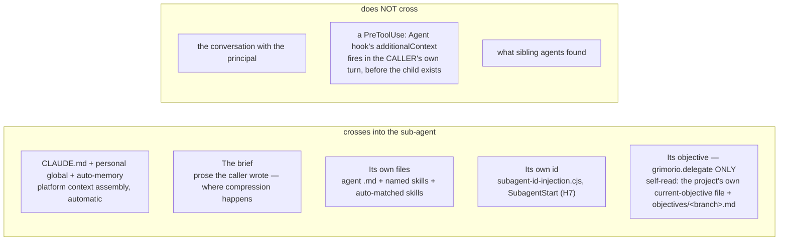
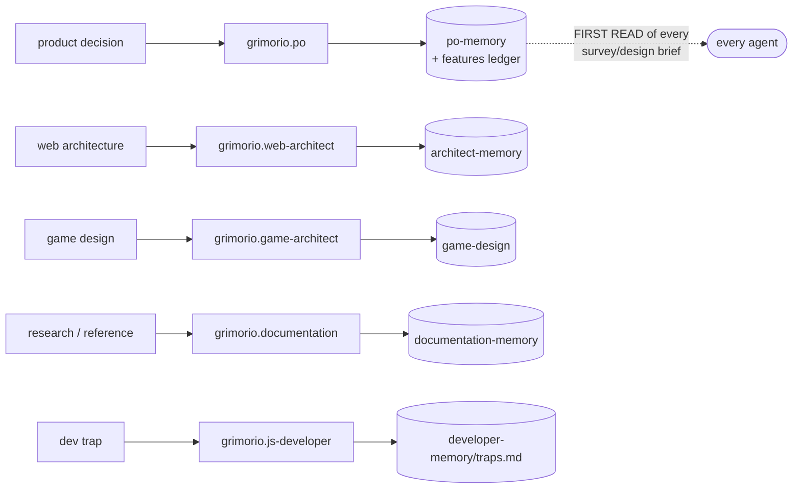
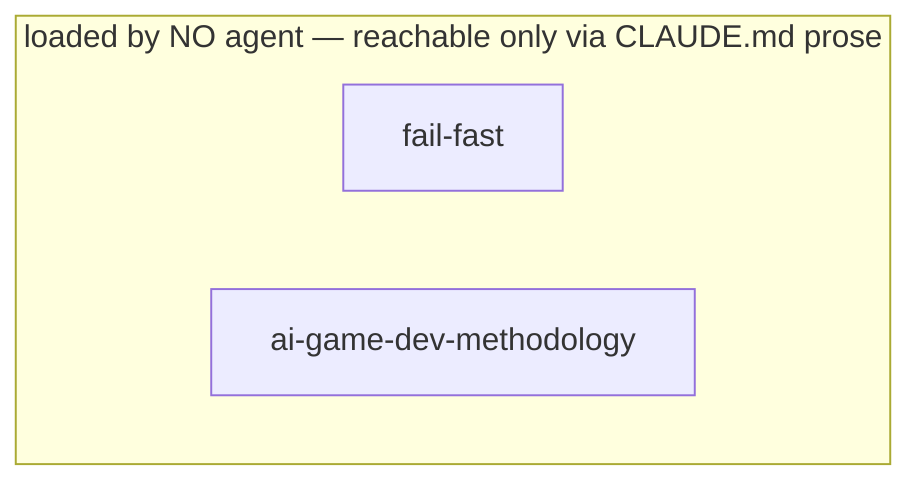

# Grimorio — how information actually travels

This is **chain documentation**, not a capability index: it describes the machinery's shape, which changes far
more slowly than the code it governs. It is kept rewritten to CURRENT truth — git history holds what changed and
why; this file states what is true today, not a layered record of its own corrections.

---

## 1. The context boundary — the thing that is most often gotten wrong

**`CLAUDE.md` reaches EVERY agent — the main loop and every spawned sub-agent alike, automatically, from birth.**
The project `CLAUDE.md`, the principal's personal global `~/.claude/CLAUDE.md`, and the user's auto-memory
`MEMORY.md` all arrive via the platform's own context assembly (the `claudeMd` system-reminder) — not a repo
hook; grep `.claude/settings.json` and there is no such hook. Confirmed in the source project by a zero-tool
`grimorio.scout` probe (forbidden from opening any file) that quoted the project's `CLAUDE.md` verbatim, and
independently from inside `grimorio.system-keeper`'s own spawned context, which carries the identical block.

```mermaid
flowchart TB
    CEO([Principal])

    subgraph MAIN["MAIN LOOP"]
        direction TB
        CM1["CLAUDE.md + personal global<br/>+ auto-memory (platform-assembled)"]
        LOOP["the chat agent<br/><b>routes, decides, commits</b>"]
        CM1 --> LOOP
    end

    subgraph SUB["SUB-AGENT — a fresh context"]
        direction TB
        CM2["CLAUDE.md + personal global<br/>+ auto-memory (same platform assembly)"]
        SYS["its own agent .md<br/>(contract + Knowledge list)"]
        SK["the skills it names"]
        BRIEF["the brief its caller wrote"]
        ID["its own id (H7, SubagentStart)"]
    end

    CEO -->|"speaks"| LOOP
    LOOP ==>|"Agent tool"| SUB
    SUB -.->|"final text only"| LOOP
    LOOP -->|"reports"| CEO

    style CM1 fill:#2a3a2a,stroke:#5a5
    style CM2 fill:#2a3a2a,stroke:#5a5
```

**OPEN, unmeasured:** whether a rule meant for the ROUTER (the main loop, which decides) landing unread-but-
present in a DOER's context (a sub-agent, which builds/tests/reviews) is harmless noise or a real cost. Two
incidents are on record in the source project and do not settle it either way — flagged for the principal to
weigh, not re-argued here:

- A capabilities-ledger read-first rule lived only in `CLAUDE.md` while several capabilities were built and never
  wired, some re-discovered later in one session. The incident is real; the CAUSE remains undiagnosed — it was
  never that the rule was absent from the architects' context, since it wasn't.
- A test-planning method lived in the product's own feature ledger; the QA agent loaded its own memory skill,
  not the product-memory skill, so it never saw it. Fixed by naming the ledger in the QA memory skill directly
  — a skill-naming fix, unrelated to whether `CLAUDE.md` itself reaches an agent.

---

## 2. What crosses the boundary, beyond `CLAUDE.md`

**Box G is why the old `agent-routing-reminder.cjs` hook was deleted** (§3): a `PreToolUse: Agent` hook fires in
the CALLER's own turn, before the spawned child's context exists, so its `additionalContext` can only ever
inform the caller's NEXT decision — never the child it was about to spawn. Confirmed twice in the source
project: a prior probe recorded in its own design-doc history, and a zero-tool `grimorio.scout` probe the same
day the hook was deleted, which reported `SPAWN CHECKS ABSENT` / `THE PRINCIPAL'S OBJECTIVE ABSENT` from a
freshly spawned child's own context, alongside `its own id PRESENT` (H7, which DOES fire inside the child's own
context assembly) and `CLAUDE.md PRESENT` (§1).

**The branch-objective gap (row E) is real and open for everyone but `grimorio.delegate`.** `grimorio.delegate`
self-reads the project's own current-objective file and `objectives/<its-branch>.md` off its own disk at task
start (`flow-delegation/delegate-behavior.md`) — a file already tracked in its worktree, nothing a hook needs to
hand it. No other spawnable agent type has an equivalent self-read instruction; for everything spawned as
something other than `grimorio.delegate`, nothing currently delivers the branch's objective at all.

---

## 3. The mechanisms — what is wired, and what each one does

Everything else in grimorio is prose. These are machinery.

**EXACTLY ONE HOOK WIRED IN `.claude/settings.json` DENIES ANYTHING: `spawn-grimorio-conduct-gate.cjs`
(`PreToolUse: Agent`). Read that before you reason about enforcement anywhere in this corpus.** Verified live:
DENY on a bare spawn prompt, ALLOW once the prompt carries the compelling `grimorio-conduct` instruction, DENY
on the retired `prompt-reading` wording. The other wired hooks only inject context, append a line, or ask a
question after the fact — for THOSE, and only those, **NEVER cite a hook as the thing that enforces a rule**:
none of them deny. Refusal otherwise survives only on the git side (`G1`/`G2` below), which gates a COMMIT,
never a tool call — `spawn-grimorio-conduct-gate.cjs` is the one exception, gating a spawn instead.

The principal's own ruling that produced this state, translated: hooks are the LAST option, and each one needs
explicit approval with a strong technical justification. A double-digit count of proposed hooks had accumulated
at one point, none ever approved on the strength of "it enforces a rule that already exists in prose" alone —
the objection was not the count, it was that they enforced what agent rules already forced, and a denial
surfaced as a bare `BLOCKED` with no way to tell which of many had fired. **NEVER add a hook here without
explicit approval**, and read `.claude/hooks/harness.md` before touching this directory at all.

**THE ENVELOPE — read this before writing any hook, it is the thing that makes a capability look absent.**
Almost every hook output field must be nested inside `hookSpecificOutput`, with `hookEventName` set to the
firing event's name. Returned at the TOP LEVEL it parses fine, exits `0`, and is **silently ignored — no error
anywhere**. Exception: `decision`, `reason`, `systemMessage`, `continue`, `stopReason` stay OUTSIDE the
envelope, at the top level, always. -> full 30-event table: `claude-code-guide` skill → `references/hooks.md`.

```mermaid
flowchart TB
    subgraph HOOKS["hooks — settings.json — none of these refuse (the one that does is below)"]
        H1["<b>harness-lookup.cjs</b><br/>PreToolUse: Edit / Write / MultiEdit<br/>injects the ascending harness.md<br/><i>dedups per session</i>"]
        H2["<b>log-agent-invocation.cjs</b><br/><b>PreToolUse: Agent + PostToolUse: Agent</b><br/>appends a DISPATCH row (pre) then a RESOLUTION<br/>row (post) per spawn — fields 14-17 record<br/>the CALLER's own id, a join key, the<br/>CHILD's new id, and dispatch status"]
        H3["<b>prompt-check.cjs</b><br/>PostToolUse: Edit / Write / MultiEdit<br/>+ PostToolUse: Agent<br/>asserts a NEGATIVE — 'you probably broke<br/>the standard, go and look'<br/><i>parses nothing, judges nothing</i>"]
        H5["<b>mark-skill-loaded.cjs</b><br/>PostToolUse: Skill<br/>TRACKED marker (unread) + always-on<br/>debug log (every skill) — see below"]
        H7["<b>subagent-id-injection.cjs</b><br/>SubagentStart: *<br/>hands the CHILD its own agent_id"]
        H8["<b>worktree-create-from-develop.cjs</b><br/>WorktreeCreate<br/>REPLACES git — creates from develop's tip<br/><i>never exits non-zero</i>"]
        H10["<b>log-agent-completion.cjs</b><br/><b>SubagentStop: *</b><br/>appends the CHILD's own id/type + last message<br/>on completion — RECORDS only, cannot wake anyone"]
    end
    subgraph HOOKGATE["hooks — settings.json — the ONE hook that refuses a TOOL CALL directly"]
        H9["<b>spawn-grimorio-conduct-gate.cjs</b><br/><b>PreToolUse: Agent</b><br/>DENIES the spawn outright when the prompt carries<br/>no compelling grimorio-conduct instruction<br/><i>verified live: DENY bare, ALLOW compelled</i>"]
    end
    subgraph GATE["git — scripts/pre-commit.sh — the only OTHER place anything still REFUSES"]
        G1["<b>objectives/ gate</b><br/>refuses a commit with no branch<br/>objective, or out of declared scope"]
        G1B["<b>check-comment-blocks.mjs</b><br/>refuses a staged comment block<br/>over 4 lines — @keep-comment exits"]
        G1C["<b>check-agent-tiers.mjs</b><br/>refuses ANY commit while an agent declares<br/>opus/fable with disallowedTools: Agent,<br/>or declares no model at all<br/><i>reads .claude/agents/, not the diff</i>"]
    end
    subgraph GATE2["git — scripts/close-branch.sh, a DIFFERENT trigger (branch CLOSE, not every commit)"]
        G2["<b>the numbered close gates</b><br/>refuse to CLOSE a branch — objective/base/clean-tree/<br/>open-checks/VERIFY/feature-line/etc.<br/><i>its own final commit runs `git commit --no-verify`,<br/>so G1 does not fire there — this gate already covers it</i>"]
    end
    ED["editing a file"] --> H1
    ED -.-> H3
    SP["spawning an agent"] --> H2
    SP -.-> H3
    SP --> H9
    BORN["a subagent's context is assembled — child side"] --> H7
    WT["creating a worktree — isolation:'worktree'"] --> H8
    LS["loading a skill"] --> H5
    H5 -.->|"marker nobody reads"| DEAD["no consumer<br/>(both gates deleted)"]
    RET["an agent's own turn stops — child side"] --> H10
    CMT["an ordinary commit"] --> G1
    CLOSE["closing a branch"] --> G2

    style DEAD fill:#3a2a2a,stroke:#a55,stroke-dasharray: 5 5
    style H9 fill:#2a3a2a,stroke:#5a5
    style H10 fill:#2a3a2a,stroke:#5a5
    style G1 fill:#2a3a2a,stroke:#5a5
    style G1B fill:#2a3a2a,stroke:#5a5
    style G1C fill:#2a3a2a,stroke:#5a5
    style G2 fill:#2a3a2a,stroke:#5a5
```

**This map answers "what event is it wired to?" — it deliberately does NOT answer "does it have an EFFECT right
now?", and reading the first as the second produced wrong causal stories in the source project.** The two are
different constructs: a hook can fire on every single turn and emit nothing. `harness-lookup.cjs` dedups per
session, so it emits nothing on the second edit of a session however large its first injection was. **A
CONDITION column here would be prose drifting from the hook it describes** — which is exactly how this
section's own hook COUNT went stale before — so the answer is a tool that RUNS each hook, never a table:
`scripts/hook-conditions.mjs`, indexed in `.claude/skills/agent-writing/audit-toolchain.md`. **ALWAYS run it
rather than trusting any count written here.** It also answers what this map cannot ask at all — **for a named
SCENARIO, which hooks does it meet, in what order, and how many had an EFFECT** — and that is where the real
gap sits: an ordinary main-loop edit to an ordinary file, second of the session, meets `harness-lookup.cjs` and
it is silent, correctly and by design, so the scenario is ungated end to end and no per-hook row can show it.
Its population is the hooks `.claude/settings.json` wires; the git-side links of the same chain (`G1`, `G2`)
sit outside it, declared rather than implied.

**`log-agent-invocation.cjs` fires on both `PreToolUse` and `PostToolUse` — read this as TWO generations per
spawn, not one.** On `PostToolUse` the row is stamped when the spawn RESOLVES (for a foreground spawn, when it
returns; for a background spawn, immediately at `async_launched`, not at completion), so two children launched
in one message can still log seconds apart on THIS generation — that is why the `PreToolUse` generation stays
load-bearing for fan-out identification, and why both events fire rather than either replacing the other. Field
13 records which event wrote each row — `pre` or `post` — because the file holds both generations and **they
mean opposite things**. **NEVER compare a `pre` row's timestamp against a `post` row's**, and **ALWAYS state
which generation a count was drawn from.** Field 12 (the caller's own `agent_type`) is populated, so a completed
spawn is attributable to the caller that raised it; absent means the top-level main loop, so `-` is a reading,
not missing data.

**Fields 14-17 close the parent-identity gap §3b used to call unclosed.** Measured in the source project (real
foreground AND background test spawns, raw stdin captured via a temporary diagnostic hook, reverted after):
`PostToolUse: Agent` carries BOTH the caller's own `agent_id` (field 14) and, in `tool_response.agentId`, the
child's brand-new id (field 16, `post` rows only — the child does not exist yet at `PreToolUse` time, so it is
always `NA` on a `pre` row) — in the SAME event, for both a synchronous and an `async_launched` dispatch. Field
15 (`tool_use_id`) is the JOIN KEY: identical on a dispatch row and its own resolution row, so the two
generations of one spawn can be paired even though they log at different times. Field 17 mirrors
`tool_response.status` (`"completed"` or `"async_launched"`, `NA` on `pre`). **This was never a hook
limitation** — `SubagentStop` still cannot self-identify its own parent (§3b, unchanged) — **it was that
nothing had ever read `PostToolUse`'s own `tool_response.agentId`.**

**`mark-skill-loaded.cjs` is wired, runs on every `Skill` call, and now does TWO independent things.** Its
original TRACKED-marker half exists solely for two deleted gates that used to consult it, and **NOTHING READS
WHAT THAT HALF WRITES** — kept rather than removed, because deleting it is a change to the wired hook set and
that call belongs to the principal, not to whoever notices the dead marker. A SECOND, always-on half now
appends every `Skill` call, TRACKED or not, to `.claude/.cache/skill-load-debug.log` (timestamp, skill, session,
agent-type) — added because a measurement in the source project's own governance log had no mechanical way to
tell "the skill did not load" apart from "the skill loaded but left no behavioral footprint." Recorded here so
nobody re-derives either half's markers as evidence of anything they don't carry.

**`worktree-create-from-develop.cjs` is the highest ACCIDENTAL-blast-radius file here.** `WorktreeCreate`
REPLACES git's own worktree creation outright, and per the platform contract ANY non-zero exit aborts creation
for the WHOLE PROJECT, not just the triggering spawn. It never blocks on purpose: every internal failure path
falls through to git's own default behaviour and always exits 0 (verified live by hiding `develop` and watching
the fallback still create a worktree). The caution it earns is not that it refuses anything — it never does —
but that a bug in this one file is the only thing here that could break spawning project-wide by accident.

### What the deletions COST — three closures that reverted to open

The hooks were deleted because they enforced what agent rules already forced. That reasoning holds for the
enforcement; it does not make the gaps they covered disappear. **NEVER read a "FIXED" or "CLOSED" verdict in
§7's loss map as current if its mechanism was one of these.**

- **A branch objective no longer reaches any prompt, loop, or Workflow step.** A prior reminder hook was the
  only carrier. `grimorio.delegate` still self-reads its own objective off disk; nothing else does. Loss-map
  rows 6 and 6b, once recorded there as FIXED and PARTIAL, are open again.
- **Nothing gates domain routing, at spawn OR at write.** Both the spawn-side check and the write-side guard
  are gone, and the only declaration of which tree each specialist claims exclusively went with them. Loss-map
  row 9 is open for every writer, not just the main loop.
- **The governance-file restriction is prose alone.** `CLAUDE.md` rule 20 still binds; nothing refuses a
  violating write. The CANONICAL declaration of what counts as a governance path is
  `scripts/refobl/governance.cjs` — but **NEVER treat it as the only one**: `scripts/refobl/prefix.cjs` and
  `scripts/audit-chain.mjs` each hardcode an independent hand-synced copy of the same pattern set, and
  `prefix.cjs` does so deliberately because it has to fail CLOSED. A deleted hook was once a fourth copy; losing
  it removed the enforcement, not the duplication. **WHEN you edit any one of the three ⟶ edit all three.**

**One design lesson outlived its hook and is kept here because it is about markers, not about that hook.** A
session-keyed marker file cannot prove a skill is still IN CONTEXT. The real decay is neither wall-clock nor
spawn count — it is context COMPACTION, which can summarise a loaded skill's text out of context while the
marker, which knows nothing about what survived, still says "loaded". **WHEN you are tempted to gate anything
on "was skill X loaded" ⟶ remember the marker answers a different question than the one you are asking.**

**Asymmetry — PARTIALLY closed on recording, and PARTIALLY closed on detection; ARMING stays open.** The way
IN, on the CHILD's own side, was already instrumented — `subagent-id-injection.cjs` hands it its own id, closing
the gap where no agent could see its own id and `SendMessage(to:"main")` silently misrouted a nested child's
report to the top level. The way BACK now has a recording half too: `log-agent-completion.cjs` (§3b) records
every child's own id/type/last message on `SubagentStop`, and `log-agent-invocation.cjs` fields 14-17 record the
parent↔child link at dispatch — so a reader of both logs CAN determine which parent a finished child belonged
to. **What was once open — nothing JOINS the two logs or ACTS on a parked parent — is now CLOSED for the JOIN,
not for the ACT:** `scripts/parked-watch.mjs` joins both logs and reports a genuinely parked parent, tested both
directions by `scripts/selftest/parked-watch.sh` (7 assertions: a real park is reported; a parent that acted
after its child finished, a parent whose own last completion closed VERIFIED/COULD NOT despite a later stale
child completion, a still-running child, and a repeated poll of an already-alerted pair are all correctly
silent). It does not `SendMessage` anyone — it only prints. **What remains open is ARMING, not the join:**
nothing invokes this script automatically — no hook, no cron. It runs only when the TOP-LEVEL SESSION explicitly
starts it for the current session (`ref:skill/grimorio.conduct/project.main-loop-only.md` rule 8, the top-level
session's own standing obligation) and then acts on what it prints. WHEN nobody has armed it this session, the
rescue described in grimorio-conduct rule 8 does not exist for that session, regardless of the join now being
built and proven. Each level must still hand its own id DOWN in the brief when it spawns further; the logs
supplement that, they do not replace it.

### 3a. Available and unused — what the corrected hook reference surfaced

`claude-code-guide/references/hooks.md` documents all 30 hook events; these are the real, usable ones this repo
does not wire, each with what it could do HERE:

- **`PostToolBatch`** — fires after a parallel tool batch resolves, can block the whole batch. Unused; no
  current gate here is batch-shaped rather than per-call.
- **`PermissionRequest`** — fires when a call needs a permission decision; can allow/deny/rewrite the input.
  Unused; permissions here are handled by `settings.json` allow/deny lists, not a hook.
- **`InstructionsLoaded`** — fires when a CLAUDE.md / rules file loads; observation only, no return value used
  by the platform. Unused; would let something log exactly WHEN `CLAUDE.md` reaches the main loop.

`SubagentStop` moved out of this list — it is wired now (§3b).

### 3b. `SubagentStop` — WIRED, for RECORDING only; the BLOCKING ruling still stands

**The original ruling below was about BLOCKING a subagent from finishing, and that conclusion is UNCHANGED —
`log-agent-completion.cjs` does not block anything, inject context, or invoke `SendMessage`.** It only appends
one line per `SubagentStop` firing (the child's own `agent_id`/`agent_type`/`last_assistant_message`/
`agent_transcript_path`) to `.claude/.cache/agent-completions.log`. What changed is the REASON to wire the
event at all: not "does what came back satisfy the objective" (loss 4 in §7, still open, still unclosed by this),
but "did a nested-background child finish with nobody watching" — a later ruling sanctioned nested background
parking as a trade rescued by the top-level session's watch WHEN ARMED — see "Asymmetry" above for the arming
requirement, not restated here — and a watch needs something to read. This hook is that something; it answers a
narrower, different question than the one the original ruling below closed.

**The original ruling, preserved as still-correct for what it actually claimed.** *What it would close:* a
mechanical form of "does what came back satisfy the objective, or only a narrower proxy" — loss 4 in §7 below.
*The conclusion:* blocking a child from finishing is equivalent to sending it more work, and `SendMessage`
already does that — to the immediate caller, at any depth (the REPORT-BACK rule, now reachable via `fan-out`
and `flow-delegation`). There is no BLOCKING case here that `SendMessage` does not already cover — this remains
true; nothing in the later change blocks anything.

**One fact on record, not a diagnosis:** an earlier hook that WOULD have blocked on this event was disabled
after heavy, unproductive token burn, and deleted outright later; the incident that led to disabling it remains
undiagnosed. `log-agent-completion.cjs` is a different hook with a narrower, non-blocking job — it does not
reopen that incident's risk, because it cannot block or inject by construction (no `hookSpecificOutput` envelope
emitted at all).

### 3c. The audit toolchain — G1/G2/G2B above are two gates out of a much larger set, indexed elsewhere on purpose

`scripts/` and `scripts/selftest/` hold the rest of grimorio's audit/verification machinery — corpus-integrity
checks, spawn/plan-discipline measurement, branch-methodology self-tests, the reference-obligation toolchain.
None of it was named anywhere in the source project's own system for a long stretch: `scripts/agent-stats.sh`,
the tool that measures whether the plan is being followed at all, had been run zero times there, including by
`grimorio.system-keeper` while auditing that very system. **This file stays structure, not contents — the
tool-by-tool inventory (what each one ANSWERS, and WHEN to run it) is a CODE file, not chain documentation:**
`.claude/skills/agent-writing/audit-toolchain.md`. `grimorio.system-keeper` loads it and runs the toolchain
BEFORE forming any judgment about the system, per its own behavior file's Core Rule 4.

### 3d. Environment dependencies — what grimorio requires from Claude Code itself

Grimorio's delegates and nested fan-outs spawn sub-agents deeper than Claude Code's documented default max
subagent spawn depth allows. **DOCUMENTED:** `CLAUDE_CODE_MAX_SUBAGENT_SPAWN_DEPTH` exists and controls it (set
via the `env` option or `.claude/settings.json`); the platform default is `3` layers below the main
conversation. This repo's own `.claude/settings.json` declares it as `5` in its `env` block so grimorio's
nested delegates/fan-outs are not refused by the undocumented default a fresh clone would otherwise silently
fall back to — announce this to anyone adopting the corpus rather than letting them discover the gap the same
way it was first discovered here. **NOT MEASURED:** that a depth-5 spawn actually succeeds — nobody has run one
and watched it spawn; the finding is recorded in the source project's own research bibliography, not carried
into this export — this file is chain STRUCTURE, that doc carried the sourcing. The principal's own framing,
translated: *"when we export grimorio, it has to be accounted for that it requires changes to Claude Code's
variables."*

**Known-unavailable on the machine this was authored on, NOT a task to fix:** `CLAUDE_CODE_MESSAGING_SOCKET` is
absent, and `CLAUDE_CODE_ENABLE_TASKS=0`. The socket, if present, would let a `SubagentStop` hook wake a parked
parent BY ITSELF; without it, the nested-background rescue mechanism this file already documents (§3b,
`ref:skill/grimorio.conduct#spawning-an-agent` rule 8) depends on the TOP-LEVEL SESSION noticing on its own
watch instead — which is how it is actually built today, not a gap in what's built. **HYPOTHESIS, not a
measured fact:** `CLAUDE_CODE_ENABLE_TASKS` is what creates the socket. NEVER set it mid-session to find out —
changing it underneath a live run would alter harness behaviour nobody has characterized.

---

## 4. Routing — which agent, when

```mermaid
flowchart TB
    REQ([a request]) --> TIER{"1 · which TIER?<br/>agent-tiers"}
    TIER --> PICK{"2 · which AGENT?<br/>agent-selection"}

    PICK -->|"build"| DEV["<b>builders</b><br/>js · ui · py · go · game-developer"]
    PICK -->|"decide HOW"| ARCH["<b>architects</b><br/>web-architect · game-architect<br/>solution-architect"]
    PICK -->|"prove it"| ADV["<b>adversarial</b><br/>code-reviewer · qa · security<br/>ux · manual-verifier · critics"]
    PICK -->|"find out"| RES["<b>research</b><br/>researcher → scout ×N<br/>entropy · documentation"]
    PICK -->|"WHAT / WHY"| PO["<b>po</b><br/>the only one that may ask the principal"]

    DEV --> ADV
    ADV -->|"REWORK"| DEV

    subgraph ESC["escalation ladder — five DIFFERENT signals"]
        E1["design unchallenged → <b>entropy</b>"]
        E2["one hard blocker → <b>unblocker</b>"]
        E3["principal frustrated → <b>adviser</b> (Fable)"]
        E4["stuck loop → <b>delegate</b> (Opus)"]
        E5["grimorio itself failing/undesigned →<br/><b>system-keeper</b> (Opus) — EVIDENCE only, never a conclusion"]
    end
    PICK -.-> ESC

    style PO fill:#2a2a3a,stroke:#55a
```

**A builder never gates itself.** The adversarial agent is a separate context by design — that is the
whole point of the split.

---

## 5. Where knowledge lives, and who owns it

Four memory-writing agents ("knowledge harnesses") own the durable record. Nothing else may write it.

Three distinct things wear the word **harness** — do not confuse them:

| | What it is | Enforced? |
|---|---|---|
| `harness.md` in a code tree | **code guardrail** — what must be READ before proposing file structure, hierarchically downward: cross-file rules, "don't modify X without Y", "don't duplicate" | injected, never blocks |
| knowledge harness | the four **agents above** that write memory | n/a — it is an agent |
| `objectives/harness.md` | a **branch-process gate** — misnamed; a branch objective is explicitly *not* harness material | **blocks at commit** |

---

## 6. Skills — declared vs orphaned

An agent loads a skill by naming it in its `## Knowledge` section. Current counts drift fast in a live
project — recount before trusting an old figure. In the source project at the time this was written:

Most-loaded: `working-memory` (24 agents), `fan-out` (21), `agent-selection` (18 — NAMED by that many agents,
enforced on none of them since the hook that forced it to load was deleted), `flow-delegation` (13, every
agent that raises a single owned delegate), `feature-workflow` (12), `development-patterns` (10).
`report-design` and `experiment-method` are each loaded by exactly the one agent that owns that concern
(`delegate`, `experimenter`) — thin, not necessarily wrong.

Loaded by **no agent** — reachable only via `CLAUDE.md` prose:

---

## 7. THE LOSS MAP — every chain, and exactly where it breaks

The principal's own framing, and the reason this section exists (translated): *"you have to think about the
flow of information: where it goes, how far it reaches, how it gets lost."*

```mermaid
flowchart TB
    CEO([Principal's message])
    CEO -->|"CLAUDE.md attached<br/>EVERY message"| L1["MAIN LOOP"]
    L1 -->|"brief (prose)"| L2["CHILD"]
    L2 -->|"brief written by the CHILD"| L3["GRANDCHILD"]
    L3 -.->|"final text"| L2
    L2 -.->|"final text"| L1
    L1 -.->|"report"| CEO

    X1{{"LOSS 1<br/>CLAUDE.md stops here"}}
    X2{{"LOSS 2<br/>compression"}}
    X3{{"LOSS 3<br/>compression, again<br/>and the child cannot know<br/>the parent already compressed"}}
    X4{{"LOSS 4<br/>no verification<br/>of what returns"}}
    X5{{"LOSS 5<br/>provenance dissolves<br/>'you told me to'"}}

    L1 -.-> X1
    L1 -.-> X2
    L2 -.-> X3
    L2 -.-> X4
    L1 -.-> X5

    style X1 fill:#3a2a2a,stroke:#a55
    style X2 fill:#3a2a2a,stroke:#a55
    style X3 fill:#3a2a2a,stroke:#a55
    style X4 fill:#3a2a2a,stroke:#a55
    style X5 fill:#3a2a2a,stroke:#a55
```

| # | Chain | Where it breaks, today | Fixed? |
|---|---|---|---|
| 1 | `CLAUDE.md` → anyone but the main loop | It reaches every agent automatically (§1); whether a router-only rule landing as noise in a doer's context is a real cost is unmeasured | **OPEN — re-diagnose, not structural** |
| 2 | main loop → child | The brief is prose the main loop authors; it compresses | **OPEN** — carrier fix proposed (brief = a PATH) |
| 3 | child → grandchild | Same compression, compounded, across every agent type that can spawn a further child | **OPEN** — same fix; a path survives N hops, a paraphrase does not |
| 4 | child → parent (the return) | Nothing VERIFIES what came back against the objective — `SendMessage` still covers the redirect/blocking case, unchanged (§3b). **PARTIAL**: `log-agent-completion.cjs` + `log-agent-invocation.cjs` fields 14-17 RECORD every completion and its parent; `scripts/parked-watch.mjs` now JOINS the two logs and reports a genuinely parked parent (tested both directions, §3b). Still open: nothing ARMS that script automatically, and nothing verifies what a NON-parked return actually satisfies | **OPEN for verification of returned content; PARTIAL for observability, now including the join (§3b); ARMING open** |
| 5 | child's report → the principal | The child's claim is relayed in the main loop's voice and becomes "the principal said." (translated) *"I was saying: ah, you told me to do it — and I never did. And that ended up spreading everywhere."* | **OPEN — no mechanism**, only the if-you-cannot-quote-him rule |
| 6 | branch objective → loops/workflows | Was commit-time only, then carried by an injection hook, and is commit-time only again | **REOPENED** — both carriers deleted. Nothing injects an objective into a prompt, a `/loop` iteration, or a Workflow step. The resolver `scripts/objective-current.sh` survives, but only the commit and close gates call it |
| 6b | branch objective → a spawned child | Was commit-time only | **PARTIAL** — `grimorio.delegate` self-reads (§2). **OPEN for every other spawnable agent type** |
| 7 | `harness.md` → the reader | Injected on **Edit/Write/MultiEdit only**. An agent that only INSPECTS (Read/Grep/Bash) never receives it | **OPEN — total, not main-loop-specific** |
| 8 | skills → agents | Loaded only if the agent NAMES them. Three are named by nobody (§6) | **OPEN** |
| 9 | `agent-selection`'s domain-routing table → the spawn | `grimorio.go-developer` (scope: the game-sim service) raised roughly 0 of several hundred spawns against a comparable volume of historical commits in that tree, in the source project's own measurement; `grimorio.delegate` wrote that work itself on Opus for several loops instead. Same shape for `js-developer`. Three written rules (this table, `agent-tiers`, the delegate's own charter) never fired. Re-measured later at a larger spawn count, and it is NOT a uniform zero across the table's three tracked rows: `go-developer` still 0 and `ui-developer` still 0, but the third tracked row `js-developer` reads non-zero. (`game-developer` is also 0, and is deliberately NOT a tracked row — the domain table excludes it as an unresolved routing decision, so it must not be counted as if it were one) | **REOPENED — closed briefly, then reopened.** Both gates and the domain table itself were deleted. Nothing checks domain routing at spawn OR at write, and the only declaration of which tree each specialist claimed exclusively went with them — so the table above is now the sole record that those claims existed. **NEVER cite a prior closure of this row as current** |
| 10 | `agent-stats.sh` field 10 (the milestone-link deviation) → a reader | Measured, populated on every spawn since the field was built, read by nobody: the large majority of plan-aware spawns logged `MISSING`, re-measured in the source project | **REOPENED** — the gate that demanded the line was deleted, and `log-agent-invocation.cjs` field 10 was retired with it and is now always empty (§3). `MILESTONE-LINK:` is read by nothing; a brief still carrying one is following a convention, not a check |

**Measured in the source project, not itself a loss to fix but the shape worth naming: `scripts/agent-stats.sh`
block 5 reported that roughly two-thirds of logged spawns were `grimorio.scout` + `grimorio.prompt-writer` +
`grimorio.system-keeper` + `grimorio.documentation`.** Grimorio was spending most of its own spawn volume
maintaining grimorio, not building the product it ships against — `grimorio.js-developer` showed a much smaller
share of invocations in the same window. Not a "loss" the routing map has a box for; recorded here because rows
9-10 above are two symptoms of the same shape and a reader re-deriving "why is domain routing broken" should see
the volume distribution that produced it, not just its two sharpest instances.

**Loss 5 is the one with no mechanism at all, and it is asymmetric in a dangerous way.** The forward path has a
carrier for the principal's words (the current-objective file, verbatim, marked authoritative). The return path
has none: a child's finding arrives as plain text and merges into the main loop's voice with nothing marking
whose claim it was. The rule *"if you cannot quote him, it is not his"* is the prose patch over a missing
mechanical field.

**Loss 3 has a property worth stating on its own:** a paraphrase degrades at every hop, but a *path* does not.
That is the whole argument for the carrier fix — the only proposal here that survives every spawning agent.

---

**Maintenance:** this file describes STRUCTURE, not contents — it changes when a hook, an agent, or a
context boundary changes, not when code does. If it ever needs updating because a *feature* shipped, it
has drifted into being an index and should be cut back. When a correction lands, REWRITE the affected
section to its final state — do not layer a new paragraph on top of the old claim. Git history is the
record of what changed; this file is only ever the current truth.
