# Prompt Writer — Quasi-Software View (five layers: NODES, PHASES, INTERNAL, PARALLELIZATION, EXPECTED OUTPUTS)

This is `grimorio.prompt-writer`'s own DRAWN quasi-software design view, produced per
ref:skill/grimorio.phase-splitting#the-agent-design-plans-drawn-view--a-hard-requirement-never-optional's standing
requirement, and saved alongside the agent's own phase chain
(`.claude/skills/grimorio.agent-writing/prompt-writer-phases/`), per that same section's own "ALWAYS SAVE the view
alongside the agent's own design, as a reference file" rule. **This file EXTENDS the six already-shipped phase
files — it never replaces or rewrites any of them.** Phase 0
(`ref:skill/grimorio.agent-writing/prompt-writer-behavior.md`) and Phase 1 through Phase 6
(`ref:skill/grimorio.agent-writing/prompt-writer-phases/phase-1-search-first.md` through
`ref:skill/grimorio.agent-writing/prompt-writer-phases/phase-6-report-close.md`) are UNCHANGED here — this pass adds
new steps INSIDE Phase 2 and Phase 4 (see "Dispatch B's own step-level additions" below), and this file draws
their consequences; it does not re-author either phase file.

Same class of artifact as the precedent `ref:skill/grimorio.system-design/project.design-orchestrator-quasi-software-view.md`
(APPROVED) and its sibling
`ref:skill/grimorio.agent-writing/system-keeper-phases/system-keeper-quasi-software-view.md#the-five-layers-at-a-glance-and-where-each-is-drawn`
(the current CANONICAL five-layer worked example in this corpus, per Dispatch A) — this file mirrors that
sibling's own structure: the same five-layer split, the same "at a glance" summary near the top, the same
DFD/fork-join grounding paragraph pattern for the INTERNAL layer, the same WORK-vs-ORCHESTRATION table shape
for EXPECTED OUTPUTS. Unlike either precedent, this chain is authored by the exact agent whose own structure it
draws — `grimorio.prompt-writer` drawing `grimorio.prompt-writer`.

## The five layers, at a glance, and where each is drawn

NODES (the orchestration graph) is EMPTY here, by construction — see "The GRAPH layer is empty by construction"
below — so what the first diagram actually draws is PHASES (the state machine) with LOOP folded in as detail on
the spine, the same treatment the sibling keeper view gives its own LOOP layer. INTERNAL (each phase's own
artifact-flow IN→OUT) gets its own, second diagram, immediately after — cramming DFD-style satellite nodes onto
the already-dense early-exit edges of the first diagram would reduce legibility, not add it, so it is drawn
separately on purpose, the same reasoning the sibling keeper view already applies. PARALLELIZATION is prose, not
a diagram, because — for this chain, for an even stronger reason than the keeper's own sequential-only finding —
there is structurally nothing to draw. EXPECTED OUTPUTS is a table, immediately below its own section, for the
same reason the sibling keeper view gives: a two-column WORK-vs-ORCHESTRATION split per phase reads better as
rows than as diagram labels.

## The diagram

*(Kept as "The diagram" rather than "Layer 1 + 2 — …" specifically to preserve
`ref:skill/grimorio.agent-writing/prompt-writer-behavior.md`'s own existing `#the-diagram` citation without an
out-of-scope edit to Phase 0 — the prose immediately below names it as Layers 1+2 explicitly, so the five-layer
framing still reads clearly; only the heading TEXT stays stable for the pointer's sake.)*

```mermaid
flowchart TB
    P1["P1 · SEARCH-FIRST"] --> P2["P2 · UNDERSTAND, VERIFY<br/>& PLAN"]
    P2 --> P3["P3 · RULE SYNTAX"]
    P3 --> P4["P4 · FILE STRUCTURE"]
    P4 --> P5["P5 · CONTENT GUARDRAILS"]
    P5 --> P6["P6 · REPORT & CLOSE<br/>(terminal — no hand-off)"]

    P1 -.->|"REFUSAL: spec unwritable to standard —<br/>missing content, no clear reader, would invent<br/>policy, or asks to compress the principal's own words"| P6
    P2 -.->|"REFUSAL: handed LEVEL does not survive<br/>Phase 2's own verification against the placement ladder"| P6
    P2 -.->|"PLAN-FOR-REVIEW (NOT a refusal): step 3c's own<br/>STEPS-VS-PHASES verdict is PHASES AND this is a<br/>brand-new chain OR a rewrite changing an existing<br/>chain's phase count/boundaries (step 5) — produces the<br/>reviewable plan artifact and returns to caller; Phase 3<br/>is never entered this pass"| P6
    P4 -.->|"REFUSAL: a behavior file authored/rewritten<br/>this pass does not open its Steps section with<br/>a graph-definition step"| P6
    P5 -.->|"REFUSAL: spec asks the writer to author a<br/>rule the principal never gave"| P6

    ENTRY{{"CLONE-EXECUTOR MODE declared,<br/>+ fully pre-filled Phase-2-equivalent plan"}}
    ENTRY -.->|"ENTRY: SKIPS P1 & P2 entirely — brief's own<br/>pre-filled fields treated as P2's own<br/>DELIVERABLE, verbatim, nothing re-derived"| P3

    style ENTRY fill:#2a2a3a,stroke:#77a,stroke-width:2px,stroke-dasharray: 3 3
```

**Reading Layers 1+2 (NODES, empty, and PHASES).** The solid rectangular spine (P1→P2→P3→P4→P5→P6) is the
STATE MACHINE — the same six phase files already shipped under
`.claude/skills/grimorio.agent-writing/prompt-writer-phases/`, unchanged; this view draws them, it does not redefine
them. The dashed edges are the LOOP layer, folded into this same diagram rather than drawn as a sixth layer of
its own — the identical treatment the sibling keeper view gives its own LOOP — applying
ref:skill/grimorio.loop-and-graph#2-the-loop--the-iteration-and-its-exit-condition one level down over phases; but this
chain's own LOOP is structurally different from a repeating loop: there is no back-edge that re-enters an
earlier phase (see below). What appears instead are FIVE distinct early-exit edges (four REFUSAL edges, from
P1, P2, P4, P5, each running to P6, each carrying its own Core-Rule-2 trigger verbatim; plus ONE PLAN-FOR-REVIEW
edge, also from P2 to P6, which is NOT a refusal — see the section below for why the two are kept structurally
distinct) and ONE alternate ENTRY edge (from a CLONE-EXECUTOR MODE condition directly into P3, skipping P1 and
P2 entirely). **Of this spine, only the edges leaving a phase file that carries a `FINGERPRINT:` annotation —
P2's own two stated Hard hand-off branches (to P3, and to P6 on PLAN-FOR-REVIEW) and P5→P6 — now GATE on an
EXECUTED check rather than a trust-based transition (that phase's own Hard hand-off writes its filled
DELIVERABLE to disk and runs `node scripts/check-phase-fingerprint.mjs` against it, per
import:skill/grimorio.phase-splitting/project.fingerprint-gate.md, looping back to fix-then-rerun on a FAIL instead of letting
the edge fire on an unverified block), and P6's own terminal `## OUTPUT` close is gated the same way, EXCEPT
every edge leaving P1, P3, or P4 (including their own REFUSAL edges above) and P2's own separately-drawn
REFUSAL edge, none of which is wired this way today because P1, P3, and P4 carry no `FINGERPRINT:` annotation
and P2's REFUSAL path is not a literal "read the next phase" sentence in that file's own Hard hand-off text.**
The NODES layer — agent-nodes for anything this chain spawns or leans on — is EMPTY: no
agent-node appears anywhere in this diagram, and "The GRAPH layer is empty by construction" section below
states why that is the correct rendering, not an unfinished one. Because NODES is empty, this diagram does not
need the agent-node-vs-phase-node shape distinction the design-orchestrator precedent's own legend uses — there
is no agent-node to distinguish a phase-node from, so no such legend entry is drawn here.

## There is no repeating back-edge in this chain — and why

**WHEN a reader expects a repeating back-edge in this diagram, matching the design-orchestrator view (which loops P6 back to P4) ⟶ read this section, not the absence, as the answer: this chain has none, by design, not by omission.** ref:skill/grimorio.agent-writing/prompt-writer-phases/phase-6-report-close.md's own "Why there is no
evaluation phase in this chain" section states the reasoning in full and is not reproduced here — in one
sentence, re-evaluation of what this agent produces lives one level UP, inside agent:grimorio.system-keeper's
own VERIFICATION and ADVERSARIAL REVIEW phases, never inside this chain itself. An honest "N/A" is the correct
entry here, exactly as the design-orchestrator precedent states "N/A" for its own routing question rather than
inventing a loop this chain does not have.

## Five early-exit edges, never merged into one — four REFUSAL, one PLAN-FOR-REVIEW, and why they are kept apart

**NEVER draw the five early-exit edges above (P1, P2×2, P4, P5 → P6) as one merged edge — each fires from a
different trigger, and merging them would hide which check actually produced the exit.** Four are Core Rule 2
("NEVER finish over being RIGHT") restated separately, once per phase, per that phase's own text:

| Origin phase | Trigger (verbatim from that phase's own Core Rule 2 restatement) |
|---|---|
| P1 · SEARCH-FIRST | the spec cannot be written to standard — missing content, no clear reader, would require inventing policy, or asks to compress the principal's own words |
| P2 · UNDERSTAND, VERIFY & PLAN | the handed LEVEL does not survive this phase's own verification step against the placement ladder |
| P4 · FILE STRUCTURE | a behavior file authored/rewritten this pass does not open its Steps section with a graph-definition step |
| P5 · CONTENT GUARDRAILS | the spec asks the writer to author a rule the principal never gave — filling a gap noticed itself |

**The fifth edge, also leaving P2, is a genuinely different kind of exit, drawn and named as one.**
**NEVER fold it into the REFUSAL table above — it fires from a different trigger than Core Rule 2's own four.**
Phase 2's own step 5 (PRESENT-PLAN-BEFORE-IMPLEMENTING) fires WHEN step 3c's own STEPS-VS-PHASES TEST
(ref:skill/grimorio.phase-splitting/project.steps-vs-phases-test.md, wired this dispatch — see "Dispatch F" below)
concludes PHASES, AND either this is a brand-new phase chain or a REWRITE that changes an existing chain's own
phase count/boundaries — this is not "the spec is unwritable," Core Rule 2's own trigger; the spec may be
perfectly writable, the artifact's own SHAPE is what still needs designing before rule text can be drafted
against it. **Rewired this dispatch, replacing a narrower prior trigger** (a genuinely new agent AND its own
designer not yet fully grasping how it reaches its objective) **that could never fire on a rewrite of an
existing agent at all** — exactly the incident that produced this fix (`grimorio.phase-splitting/project.steps-vs-phases-test.md`'s
own opening section). The distinction matters for a reader deciding what this exit MEANS: a REFUSAL reports a
defect in what was handed to this agent; PLAN-FOR-REVIEW reports a legitimate, expected outcome — a reviewable
plan artifact, produced and returned for `grimorio.system-keeper`'s own review, exactly the two-separate-steps
discipline Phase 2's own step 5 states in full (the plan, THEN, only once reviewed, the rule-text) — never a
finding that something was wrong with the brief. **WHEN step 3c's own verdict is STEPS, or PHASES with no
chain-boundary change (a same-shape edit inside one existing phase) ⟶ this edge never fires — the ordinary
forward spine (P2→P3) already covers both cases, drawn as the solid edge above, never a separate branch of its
own.**

Only P3 (RULE SYNTAX) and P6 (REPORT & CLOSE, terminal) carry no early-exit edge of their own — P3's own
nearest analogue is CLONE-EXECUTOR MODE's own refusal, which surfaces THROUGH P3's ordinary step 2 (a clause
with no clear opener "is not a hard rule"), not as a further distinct edge, per
ref:skill/grimorio.agent-writing/prompt-writer-behavior.md#clone-executor-mode--entry-point-for-a-haiku-tiered-same-type-clone.

## The alternate entry point is an ENTRY, never a REFUSAL or PLAN-FOR-REVIEW edge

**NEVER draw the CLONE-EXECUTOR alternate-entry edge as a REFUSAL or PLAN-FOR-REVIEW edge — it points the
opposite direction, INTO the chain at P3, never out of it toward P6.**
**WHEN the invoking brief explicitly declares CLONE-EXECUTOR MODE AND hands a fully pre-filled plan equivalent to Phase 2's own deliverable (OBJECTIVE, EXIT CONDITION, LEVEL HANDED (verified), FORM CHOSEN) ⟶ P1 and P2 are skipped entirely and the chain enters directly at P3**, treating the brief's own pre-filled fields as P2's own
DELIVERABLE, verbatim, nothing re-derived — stated in full at
ref:skill/grimorio.agent-writing/prompt-writer-behavior.md#clone-executor-mode--entry-point-for-a-haiku-tiered-same-type-clone.
Today the only caller expected to use this path is agent:grimorio.system-keeper, raising a Haiku-tiered
same-type clone of this same agent, per grimorio-conduct rule 20's own same-type-clone exception — this is why
the diagram's ENTRY node names the condition ("CLONE-EXECUTOR MODE declared…"), never `grimorio.system-keeper`
itself as an agent-node (see the next section).

## The GRAPH layer is empty by construction

**NEVER read the empty GRAPH layer above as an unfinished section.** `disallowedTools: Agent` is set in this
agent's own shell (ref:repo/.claude/agents/grimorio.prompt-writer.md, confirmed by reading its frontmatter
directly for this view), and every one of the six phase files states the same fact explicitly in its own Step
1: "this agent never invokes another agent, in any phase, ever." Zero agent-nodes is therefore the correct,
complete rendering of this chain's GRAPH layer — not a gap this file leaves open, and not a legend entry
waiting to be filled in on some future pass.

**NEVER add an agent-node, or an edge to agent:grimorio.system-keeper, anywhere in this diagram.**
`grimorio.system-keeper` is this agent's own PARENT — the one that invokes it, hands it the level and the
verbatim content to land, and evaluates its output — never a child this chain spawns or leans on. The
design-orchestrator precedent draws agent-nodes only for agents THAT agent itself spawns or leans on, never its
own caller; this file follows that identical convention, so `grimorio.system-keeper` appears in this file's own
prose (as PARENT, as the source of CLONE-EXECUTOR MODE) but never as a node in the diagram itself.

## Layer 3 — INTERNAL: per-phase artifact-flow (IN → OUT)

**Grounding — shared across every quasi-view that draws this layer, extracted once, not restated here:**
ref:skill/grimorio.phase-splitting/project.quasi-view-requirements.md#half-a--boundary-artifact-flow-unchanged. This anchor moved
when the requirement's own text grew past `SKILL.md`'s ~500-line smell threshold and was extracted into its own
companion file — the citation below is now fixed to the real heading, not the pre-move one that this file
carried as a dead anchor until this pass (found via `node scripts/audit-chain.mjs --anchors`).

**Design choice, stated rather than left implicit: ONE artifact node per phase BOUNDARY, never two** — the same
choice the sibling keeper view already makes, applied here to this chain's own six phases. Every phase's Hard
hand-off section already states it explicitly: Phase N's OUT is the exact same content Phase N+1 consumes as
its IN. This diagram therefore draws five boundary artifacts (one between each consecutive phase pair, P1↔P2
through P5↔P6) plus Phase 6's own terminal `## OUTPUT` going to the caller — never one IN/OUT pair per phase
individually.

The dotted edges here are deliberately the SAME visual convention as Layers 1+2's early-exit edges (dashed,
distinct from the solid forward spine) but carry a DIFFERENT meaning in this second diagram — "consumes"/
"produces" (data moving), never "REFUSAL"/"PLAN-FOR-REVIEW"/"ENTRY" (control moving). Reading the two diagrams
side by side: the first shows WHICH phase runs next and WHY (control); this one shows WHAT crosses each
boundary (data) — the same DFD process-vs-flow separation the grounding paragraph above states, now applied to
this chain specifically.

**What this diagram deliberately omits, and why.** Every early-exit edge drawn in Layers 1+2 — the four
REFUSAL findings, the PLAN-FOR-REVIEW plan artifact, and the ENTRY brief's own pre-filled fields — each carries
a real artifact of its own too, but this diagram does not draw a satellite node for any of them: adding an
artifact node on top of an already-labelled early-exit edge (Layers 1+2 already states each edge's own trigger,
or in PLAN-FOR-REVIEW's case its own outcome, verbatim on the edge itself) would duplicate information already
legible on the first diagram rather than add a new fact — the same "one artifact, not two" reasoning the
"Design choice" paragraph above applies to a phase-boundary artifact (a DFD data store consumed by one process
and produced by another is one store, never drawn twice), applied here a second time to an early-exit artifact
instead of a boundary one — the identical restraint the sibling keeper view already applies to its own two
loop-back paths.

### Half (b) — per-phase interior behavior + KNOWN-ERRORS-TO-PHASE mapping

Half (a) above answers only "what crosses each boundary" — it says nothing about what a phase DOES to earn that
hand-off, and draws IDENTICALLY whether the six phases behind it are well-designed or gutted. Per
ref:skill/grimorio.phase-splitting/project.quasi-view-requirements.md#half-b--per-phase-interior-behavior-new's own newly-landed
FORM mandate, this section closes that gap for this chain's own six phases with SIX per-phase mermaid flowcharts
(one per phase, P1 through P6) — never a markdown table, the SPECIFIC forbidden render for per-phase steps and
decision logic, not merely disfavored: a table INFORMS a reader that steps exist but never OBLIGES them to see
the actual control flow, while a flowchart is drawable and traceable node-by-node, so an omitted branch shows up
as a missing EDGE rather than as a row a careful reader happened to notice was gone. This replaces the single
condensed table this section drew until this pass, mirroring
ref:skill/grimorio.agent-writing/system-keeper-phases/system-keeper-quasi-software-view.md#layer-3--internal-per-phase-artifact-flow-in--out's
own worked precedent in SHAPE only, never its content — this chain has a different agent, different phases, and
its own genuinely different known-errors. **Table 2 below (the KNOWN-ERRORS-TO-PHASE mapping, immediately after
the six flowcharts) stays a TABLE, unchanged in form** — that render was never the forbidden one; only the
per-phase steps/decision-logic render was. **ALWAYS read every flowchart below as sourced FROM the six phase
files' own current text, never as a paraphrase.** **WHEN this section and the live phase files ever disagree ⟶
re-derive the flowcharts fresh against the files, the next time this section is drawn or redrawn — the files
govern, never this diagram's own prior wording.**

**This file earns its size (grimorio-conduct rule 23's own escape valve): it is a `cite:`-only saved reference,
opened on demand when a reader specifically needs the quasi-view, never loaded on every turn like an
always-loaded skill or behavior file — and its growth past ~500 lines is the direct, intended consequence of the
newly-landed flowchart mandate above, which trades vertical space for a diagram that is traceable and OBLIGING
rather than merely informative, the same trade the mandate itself states.**

**Extended re-justification, per `grimorio.code-reviewer`'s own FINDING-05 (Dispatch F, LOW): the load-frequency
argument above is NOT one of Phase 4 step 2's own two named LAST-RESORT grounds for a skill file that keeps
growing (ref:skill/grimorio.agent-writing/prompt-writer-phases/phase-4-file-structure.md's own step 2) — named
honestly rather than left resting on an argument that doesn't actually satisfy the rule it needs to satisfy.**
This file DOES meet the SECOND of those two grounds directly: "splitting would sever content that has to be
read together." Every "Dispatch X" section in this file documents ONE authoring pass's own change AGAINST the
CURRENT state of the diagrams and tables it sits beside — moving the dispatch log to a companion file would
force a reader auditing any one change to hold two files open simultaneously, cross-referencing node IDs and
table rows across a file boundary, exactly the severed-reading cost the ground exists to name. This is the
SAME shape of justification `SKILL.md` and `system-keeper-quasi-software-view.md` already apply to their own
size, not a fresh invention for this file. A future pass that adds substantial NEW diagram/table content
(rather than another dispatch-log entry) still owes a real SPLIT-vs-LAST-RESORT judgment fresh, never a silent
extension of this paragraph's own count.

**P1 · SEARCH-FIRST**

```mermaid
flowchart TB
    A1["Step 1 — state the graph:<br/>single SELF (read the brief,<br/>open every target file, check<br/>whether this task is a<br/>rewrite); no spawn"] --> A2["Step 2 — read the spec IN<br/>FULL, hold it VERBATIM"]
    A2 --> A2w{"reads like a compressed<br/>summary rather than the<br/>principal's own words?"}
    A2w -->|"YES"| A2f["say so as a SPEC QUALITY<br/>FINDING — never guess at the<br/>gaps left out"]
    A2w -->|"NO"| A3
    A2f --> A3
    A3["Step 3 — open every target<br/>file IN FULL before forming<br/>any view — never edit or<br/>plan from a summary"] --> A3c{"CORE RULE 2 — spec<br/>writable to standard? (missing<br/>content, no clear reader,<br/>would invent policy, or asks<br/>to compress the principal's<br/>own words)"}
    A3c -->|"NO — unwritable"| AREF(["REFUSE here, naming why —<br/>→ Phase 6 (REFUSAL edge,<br/>Layers 1+2)"])
    A3c -->|"YES — writable"| A4{"Step 4 — task is a<br/>REWRITE or an audit of an<br/>existing file?"}
    A4 -->|"YES"| A4a["run the nine audit lenses<br/>against the CURRENT file,<br/>file findings, before<br/>anything is drafted"]
    A4 -->|"NO"| A4b["N/A — new content"]
    A4a --> A5
    A4b --> A5
    A5["Step 5 — ALWAYS surface<br/>relevant precedent for this<br/>artifact TYPE"] --> A6{"Step 6 — spec spans<br/>multiple independent targets<br/>already fully/identically<br/>decided by grimorio.system-<br/>keeper?"}
    A6 -->|"YES"| A6a["name a MECHANICAL-VOLUME<br/>finding — a recommendation<br/>only, this agent cannot act<br/>on it (no spawn, no Agent<br/>tool)"]
    A6 -->|"NO"| A6b["'No mechanical volume —<br/>every target needs genuine<br/>judgment' — the common,<br/>legitimate answer"]
    A6a --> AEXIT
    A6b --> AEXIT
    AEXIT(["→ Phase 2 · UNDERSTAND,<br/>VERIFY & PLAN"])

    classDef exit fill:#2a2a3a,stroke:#668,stroke-dasharray: 3 3
    class AEXIT,AREF exit
```

**P2 · UNDERSTAND, VERIFY & PLAN**

```mermaid
flowchart TB
    B1["Step 1 — state the graph:<br/>single SELF (objective/exit<br/>condition, verify the level,<br/>choose FORM); no spawn"] --> B2["Step 2 — BEFORE anything<br/>else ⟶ state OBJECTIVE<br/>(verbatim) + EXIT CONDITION"]
    B2 --> B2b["Step 2b — ALWAYS name the<br/>EXPECTED-RESULT ARTIFACT — a<br/>concrete worked example of<br/>correct, WORKING output —<br/>before drafting a single rule"]
    B2b --> B2c["Step 2c — WHEN the artifact<br/>is GOAL-SHAPED ⟶ apply<br/>Cockburn's own lunch test to<br/>verify the purpose is genuine<br/>goal-level, not a subfunction<br/>dressed up as one; name the<br/>REAL goal on a mismatch"]
    B2c --> B3["Step 3 — NEVER decide WHERE<br/>something goes; VERIFY (never<br/>choose) the handed LEVEL<br/>against the placement ladder"]
    B3 --> B3c{"CORE RULE 2 — the<br/>handed level survives this<br/>phase's own verification?"}
    B3c -->|"NO — looks wrong"| B3f["flag the mismatch in the<br/>DELIVERABLE — never silently<br/>relocate, never silently<br/>proceed"]
    B3f --> BREF(["REFUSE here — → Phase 6<br/>(REFUSAL edge, Layers 1+2)"])
    B3c -->|"YES"| B3s{"Step 3c — STEPS-VS-PHASES<br/>TEST (EVERY pass: new agent<br/>OR rewrite; BEFORE FORM<br/>commits to anything) —<br/>verdict?"}
    B3s -->|"STEPS"| B4["Step 4 — ALWAYS choose<br/>FORM before wording: LITERAL<br/>(algorithm) or LATITUDE<br/>(prose)"]
    B3s -->|"PHASES"| B5{"Step 5 — brand-new chain, OR<br/>rewrite changes an existing<br/>chain's own phase<br/>count/boundaries, AND no<br/>ALREADY-REVIEWED plan for this<br/>exact scope was handed in?"}
    B5 -->|"YES"| B5p["do NOT proceed to Phase 3<br/>— produce the REVIEWABLE PLAN<br/>artifact instead, as TWO<br/>separate steps: (a) the plan<br/>of HOW it works, THEN (b) the<br/>rule-text"]
    B5p --> B5b["Step 5b — ALWAYS apply the<br/>anti-plausibility method<br/>explicitly: name what the<br/>plan covers AND what it does<br/>not, against the complete<br/>scope"]
    B5b --> BPLAN(["PLAN-FOR-REVIEW (NOT a<br/>refusal) — → Phase 6 directly,<br/>Phase 3 never entered<br/>(Layers 1+2)"])
    B5 -->|"NO — same-shape edit<br/>inside one existing phase, OR<br/>an already-reviewed plan for<br/>this exact scope WAS handed<br/>in (the two-pass escape)"| B4
    B4 --> B6
    B6{"Step 6 — the SYSTEMIC<br/>process/machinery change being<br/>authored into another agent<br/>ALSO applies to this own<br/>chain?"}
    B6 -->|"YES"| B6a["FLAG only — mirrors, never<br/>decides, grimorio.system-<br/>keeper's own SUBJECT-ZERO<br/>rule"]
    B6 -->|"NO"| B6b["'N/A — this pass's own<br/>change does not touch<br/>process/machinery doctrine' /<br/>'N/A — already applied to my<br/>own chain this same dispatch'"]
    B6a --> BEXIT
    B6b --> BEXIT
    BEXIT(["→ Phase 3 · RULE SYNTAX"])

    classDef exit fill:#2a2a3a,stroke:#668,stroke-dasharray: 3 3
    class BEXIT,BREF,BPLAN exit
```

**P3 · RULE SYNTAX**

```mermaid
flowchart TB
    C1["Step 1 — state the graph:<br/>single SELF (write every rule,<br/>then re-scan what was<br/>written); no spawn"] --> C2["Step 2 — ALWAYS write every<br/>hard rule with one of the four<br/>openers or the CHECK form"]
    C2 --> C2c{"clause carries ALWAYS /<br/>NEVER / BEFORE / WHEN /<br/>CHECK?"}
    C2c -->|"NO — none of these"| C2n["not a hard rule — give it<br/>one, or write it as knowledge<br/>in a skill instead (CLONE-<br/>EXECUTOR MODE's own nearest<br/>refusal surfaces through this<br/>exact branch)"]
    C2c -->|"YES"| C3
    C2n --> C3
    C3{"Step 3 — a rule needs an<br/>exception, precondition, or<br/>postcondition plain openers<br/>can't express cleanly?"}
    C3 -->|"YES"| C3a["reach for the matching<br/>extension-vocabulary word —<br/>composes WITH, never<br/>replaces, the four openers"]
    C3 -->|"NO"| C4
    C3a --> C4
    C4{"Step 4 — artifact concerns<br/>model-tier selection for<br/>invocations it authors into<br/>ANOTHER agent?"}
    C4 -->|"YES"| C4a["apply the tier scale — name<br/>the archetype, name the tier,<br/>never 'choose wisely'"]
    C4 -->|"NO — N/A most passes,<br/>this agent is non-recursive"| CEXIT
    C4a --> CEXIT
    CEXIT(["→ Phase 4 · FILE<br/>STRUCTURE"])

    classDef exit fill:#2a2a3a,stroke:#668,stroke-dasharray: 3 3
    class CEXIT exit
```

**P4 · FILE STRUCTURE**

```mermaid
flowchart TB
    D1["Step 1 — state the graph:<br/>single SELF (assemble the<br/>rules into the file(s), write<br/>to disk, confirm every pointer<br/>resolves, check the five named<br/>conditions); no spawn"] --> D2{"Step 2 — a domain has more<br/>to say than fits without<br/>bloating the always-loaded<br/>file?"}
    D2 -->|"YES"| D2a["split into topic-referenced<br/>companion files — NEVER drop<br/>content to stay short"]
    D2 -->|"NO"| D3
    D2a --> D3
    D3{"Step 3 — artifact IS a<br/>behavior file, AND its Steps<br/>section's first step is NOT a<br/>graph-definition step?"}
    D3 -->|"YES"| DREF(["CORE RULE 2 — REFUSE to<br/>ship the file, name the gap —<br/>→ Phase 6 (REFUSAL edge,<br/>Layers 1+2)"])
    D3 -->|"NO / N/A — not a<br/>behavior file this pass"| D3b
    D3b{"Step 3b — file being<br/>authored/rewritten this pass<br/>defines TWO OR MORE phases —<br/>a brand-new state machine, OR<br/>a single step added to an<br/>ALREADY-EXISTING phase of one?"}
    D3b -->|"YES — either shape"| D3br["ALWAYS run RENDER / GROUP /<br/>MEASURE / SPLIT sizing —<br/>every phase (brand-new chain)<br/>or the ONE affected phase vs<br/>its pre-edit siblings (an<br/>existing-phase edit)"]
    D3br --> D3bp{"a phase is a PINCHO<br/>(materially oversized vs its<br/>siblings)?"}
    D3bp -->|"YES"| D3bs["split it, or ship it flagged<br/>with an explicit reason —<br/>NEVER silently oversized"]
    D3bp -->|"NO"| D3c
    D3bs --> D3c
    D3b -->|"NO — this pass touches no<br/>phase-chain agent at all<br/>(a STEPS-shaped agent)"| D4
    D3c{"Step 3c — SAME trigger as<br/>3b: classify every AFFECTED<br/>phase/node against Rule<br/>8(a)-(c) of flow-method.md?"}
    D3c -->|"YES — trigger fires"| D3cr["REPORT-ONLY (reads/reports,<br/>never writes) → parallel-<br/>eligible / MODIFYING (writes<br/>the artifact) → sequential /<br/>two checks INDEPENDENT →<br/>split, DEPENDENT → same node"]
    D3cr --> D4
    D3c -->|"NO — same STEPS-shaped<br/>exclusion as 3b"| D4
    D4["Step 4 — NEVER write the<br/>same method text into two<br/>files"] --> D4c{"about to write a passage<br/>already written into a first<br/>file?"}
    D4c -->|"YES"| D4a["extract to the skill both<br/>already load, leave a one-line<br/>reminder in each"]
    D4c -->|"NO"| D5
    D4a --> D5
    D5{"Step 5 — adding, renaming,<br/>or removing a `##`-level<br/>section in a file with a<br/>frontmatter `description:`?"}
    D5 -->|"YES"| D5a["update that description in<br/>the SAME pass"]
    D5 -->|"NO"| D6
    D5a --> D6
    D6["Step 6 — ALWAYS write the<br/>file(s) directly via<br/>Write/Edit"] --> D7["Step 7 — BEFORE the<br/>DELIVERABLE is filled: for<br/>every pointer newly added or<br/>changed this pass, open its<br/>target and confirm it exists"]
    D7 --> D7c{"target file or named<br/>section does not exist?"}
    D7c -->|"YES"| D7a["fix the pointer or the<br/>target NOW — never leave<br/>unresolved, never defer to<br/>Phase 6"]
    D7c -->|"NO"| DH1
    D7a --> DH1
    DH1["Step 7a — HARNESS-VALIDATE:<br/>run `--graph-first` AND<br/>`--examples`, TWO SEPARATE<br/>Bash calls per file, never<br/>combined (else-if dispatch<br/>only honors the first flag)"] --> DH2{"either command's<br/>exit code, per file?"}
    DH2 -->|"0 — both commands,<br/>every file"| D7b{"Step 7b — this pass<br/>changes an artifact's own<br/>CONTRACT (not merely its<br/>prose)?"}
    DH2 -->|"1 — either<br/>exits 1"| DH3{"2 retries<br/>already used?"}
    DH2 -->|"2 — filter matched<br/>ZERO files"| DH5(["STOP, fix the filter,<br/>re-run (never counted<br/>against the 2-retry budget)"])
    DH5 --> DH1
    DH3 -->|"NO"| D6
    DH3 -->|"YES"| DH4(["STOP — report that<br/>command's own FAIL<br/>output verbatim"])
    D7b -->|"YES"| D7bA["grep the corpus for every<br/>OTHER site that documents,<br/>exemplifies, or depends on<br/>that same contract; reconcile<br/>EVERY one found, same pass —<br/>never ship a changed contract<br/>while a sibling site still<br/>describes the OLD one"]
    D7b -->|"NO"| D8
    D7bA --> D8
    D8["Step 8 — ALWAYS run the<br/>five named gate checks before<br/>hand-off (shell purity, one<br/>behavior entry, completeness,<br/>no behavior-only skill,<br/>size)"] --> DEXIT
    DEXIT(["→ Phase 5 · CONTENT<br/>GUARDRAILS"])

    classDef exit fill:#2a2a3a,stroke:#668,stroke-dasharray: 3 3
    class DEXIT,DREF,DH4 exit
```

**P5 · CONTENT GUARDRAILS**

```mermaid
flowchart TB
    E1["Step 1 — state the graph:<br/>single SELF (scan the written<br/>file(s) against every<br/>guardrail below, refuse<br/>anything that must be<br/>refused); no spawn"] --> E2{"Step 2 — about to inline<br/>doctrine into what is written,<br/>instead of a trigger?"}
    E2 -->|"YES"| E2a["NEVER — trigger only, cite<br/>the skill instead of<br/>restating it"]
    E2 -->|"NO"| E3
    E2a --> E3
    E3{"Step 3 — asked to put a<br/>project-specific fact into<br/>general knowledge, or a<br/>general fact into a project<br/>file?"}
    E3 -->|"YES"| E3a["redirect it to the correct<br/>level, say so"]
    E3 -->|"NO"| E4
    E3a --> E4
    E4{"Step 4 — content being<br/>authored originates in the<br/>principal's own non-English<br/>words?"}
    E4 -->|"YES, going into an<br/>executable ORDER"| E4a["write the TRANSLATION —<br/>never his verbatim words"]
    E4 -->|"YES, but this is a<br/>RECORD (ledger / log /<br/>commit)"| E4b["verbatim quote is correct<br/>— it is provenance"]
    E4 -->|"NO"| E5
    E4a --> E5
    E4b --> E5
    E5{"Step 5 — about to justify a<br/>hard rule by recounting the<br/>specific past incident that<br/>produced it?"}
    E5 -->|"YES"| E5a["NEVER — state the HARM in<br/>the reader's own register<br/>instead; the incident belongs<br/>in a record, not the rule's<br/>own justification"]
    E5 -->|"NO"| E6
    E5a --> E6
    E6{"Step 6 — CORE RULE 2 — the<br/>spec asks the writer to author<br/>a rule the principal never<br/>gave?"}
    E6 -->|"YES — a gap noticed<br/>itself"| EREF(["REFUSE to author it, name<br/>the gap — → Phase 6 (REFUSAL<br/>edge, Layers 1+2)"])
    E6 -->|"NO"| E7{"Step 7 — this pass wrote<br/>or edited a `## OUTPUT`<br/>section?"}
    E7 -->|"YES"| E7a["ALWAYS confirm every example<br/>inside it is the REAL,<br/>exact artifact — never a<br/>description/placeholder that<br/>only LOOKS real; the<br/>deterministic gate (step 7a,<br/>node DH1 in the P4 diagram<br/>above) can only prove<br/>ABSENCE, never authenticity"]
    E7 -->|"NO"| EEXIT
    E7a --> EEXIT
    EEXIT(["→ Phase 6 · REPORT &<br/>CLOSE"])

    classDef exit fill:#2a2a3a,stroke:#668,stroke-dasharray: 3 3
    class EEXIT,EREF exit
```

**P6 · REPORT & CLOSE**

```mermaid
flowchart TB
    F1["Step 1 — state the graph:<br/>single SELF (assemble the<br/>report, close VERIFIED, COULD<br/>NOT, or PLAN-FOR-REVIEW); no<br/>spawn; terminal"] --> F2["Step 2 — ALWAYS write the<br/>target file(s) directly<br/>(already done in Phase 4) —<br/>this step reports ABOUT that<br/>writing, never a second pass<br/>at it"]
    F2 --> F3["Step 3 — ALWAYS report, per<br/>artifact touched: the level<br/>verified/used, the FORM chosen<br/>and why, every pointer added<br/>and whether it resolved<br/>(verbatim from Phase 4's own<br/>table), any duplication<br/>extracted, anything REFUSED<br/>and why — never a full recap<br/>of the diff"]
    F3 --> F4{"Step 4 — which close<br/>shape applies?"}
    F4 -->|"every relevant gate<br/>item was confirmed"| F4a["VERIFIED — naming which<br/>gate items were confirmed<br/>(RULE SYNTAX's opener check,<br/>FILE STRUCTURE's five named<br/>checks, its pointer-resolution<br/>table, AND its HARNESS-VALIDATE<br/>result, CONTENT GUARDRAILS'<br/>six scans)"]
    F4 -->|"a phase refused"| F4b["COULD NOT — naming what was<br/>refused, and at which phase"]
    F4 -->|"Phase 2's own step 5<br/>fired, Phases 3-5 never ran"| F4c["PLAN-FOR-REVIEW — naming<br/>what Phase 1/2 actually<br/>established, and the PLAN<br/>ARTIFACT as the deliverable<br/>being returned"]
    F4a --> FTERM
    F4b --> FTERM
    F4c --> FTERM
    FTERM(["TASK CLOSED — terminal, no<br/>Phase 7; this chain ends<br/>here"])

    classDef exit fill:#2a2a3a,stroke:#668,stroke-dasharray: 3 3
    class FTERM exit
```

**Reading these six flowcharts as a measurement instrument, not decoration — the pincho check.** Raw step
counts, re-verified against the six phase files fresh this pass BY DIRECT GREP, not carried forward from any
prior draft: P1=7 (incl. 5b), P2=10 (incl. 2b, 2c, 3c, 5, 5b, 6), P3=4, P4=12 (incl. 3b, the new 3c, 7a, 7b),
P5=7, P6=4.
P4 visibly carries more than double P3's or P6's own load (12 vs 4 each) — but this is not a fresh finding this
rendering surfaces: Phase 4's own text already names and defends it explicitly ("This is the largest phase in
this chain, honestly reported as such... splitting 'shape it' from 'verify it's shaped' would recreate the exact
mistake this agent's own phase map already corrected once") — a considered, self-aware sizing decision, not an
omission. **This dispatch's own RENDER/GROUP/MEASURE self-check, applied to its own one edited phase (P4), per
`grimorio.phase-splitting/project.steps-vs-phases-test.md`'s own worked instance of the very test P4's own step 3c now
enforces on every OTHER pass, applied here to this pass's OWN edit first:** P4 gains ONE new step (3c),
classifying phase/node read-write shape — the SAME MISSION as step 3b's own sizing judgment (both are
"is this phase-chain edit structurally sound before it ships" checks), landing immediately beside its sibling
rather than opening a new cognitive thread; RENDER (one new WHEN-trigger, four Rule-8(a)-(c) sub-clauses, one
new DELIVERABLE field) GROUPED against step 3b's own existing load (same trigger condition, same "classify the
affected phase(s)" mission) MEASURES as one bounded addition, not a multiple of P4's own already-large sibling
count — not a pincho, the SAME verdict this file's own P2-addition self-check already reached for its own prior
dispatch, applying the identical discipline rather than a looser one to its own author's own change.

**Table 2 — KNOWN-ERRORS-TO-PHASE mapping.** One row per measured incident/known-error already in this corpus
that this agent's own kind of work makes relevant. **WHEN a row's own ADDRESSED BY column reads OMISSION ⟶ that
is a real, currently-true gap, never a placeholder** — no phase in this chain owns that failure mode yet.

| # | Known error / incident | Addressed by |
|---|---|---|
| 1 | Lossy relay across hops — compression at the IN hop (`GRIMORIO-CHAIN.md`'s own Loss Map) | P1 step 2 (hold the spec VERBATIM; flag if it reads as compressed). No OUT-side relay equivalent applies here the way it does for `grimorio.system-keeper`'s own chain: this chain terminates by writing files directly to disk (P4 step 6), never relaying content through a further hop |
| 2 | THE TELL: a quasi-view requirement authored for `grimorio.design-orchestrator` with no equivalent ever produced for the keeper's own chain OR `prompt-writer-phases/` — this file's own path, named explicitly in the original incident | Addressed by this saved view's own existence, and by THIS SAME DISPATCH's own two-halves deepening (this very table) |
| 3 | A rule/spec authored with no concrete worked example of correct output ships correct-SHAPED but wrong-content, undetectable from its own rule-form alone — grounded in Design by Contract (Meyer, 1986), Specification by Example (Adzic, 2011), few-shot/exemplar prompting (Brown et al., 2020) | P2 step 2b (EXPECTED-RESULT ARTIFACT) |
| 4 | A phase-map derivation that produced a single phase carrying roughly 28 distinct requirements before anyone counted it | P4 step 3b (PINCHO-SIZING CHECK, RENDER/GROUP/MEASURE/SPLIT) |
| 5 | Rule-text drafted for a design whose own shape (STEPS vs PHASES) was never decided, or a design not yet reviewed before implementation — the ORIGINAL incident named an epistemic "author doesn't yet grasp it" trigger; step 5's own condition is now the STRUCTURAL fact (a brand-new or boundary-changing phase chain, per step 3c's own verdict) plus the two-pass escape (an already-reviewed plan handed back skips a second PLAN-FOR-REVIEW round) — grounded in Architecture Decision Records (Nygard, 2011), design docs at Google, the IETF RFC process | P2 step 3c (the decision) + step 5 (PLAN-FOR-REVIEW: produce the reviewable plan before implementation, with the two-pass escape) |
| 6 | CLAIM-HARDENED-BEYOND-EVIDENCE: an artifact that "looks complete" reads as good by both its own author and its reviewer while a real gap survives — the anti-plausibility incident itself | **ADDRESSED BY THIS SAME DISPATCH**: Target File 1 (this very table, closing this chain's own half-(b) gap) and Target File 2 (P2 step 5b, requiring the PLAN-FOR-REVIEW artifact to carry durable evidence of what was considered) |
| 7 | RULE-EXISTED-DID-NOT-FIRE (grimorio-defects.md #13): this exact agent type, `grimorio.prompt-writer`, `SendMessage`d an agent-TYPE name instead of an id, three times, and reported to the wrong session | **OMISSION.** No phase in this chain, nor Phase 0, instructs holding or using the parent's agent id when raising a mid-run question via `SendMessage` — searched fresh across every phase file this pass; zero mentions of `SendMessage` or "agent id" anywhere in `.claude/skills/grimorio.agent-writing/prompt-writer-phases/` |
| 8 | REFERENCE-OUTLIVED-ITS-TARGET: pointer rot caused by an edit in an unrelated file elsewhere in the corpus | **PARTIAL / OMISSION.** P4 step 7 confirms every pointer newly added or changed THIS PASS resolves, but never re-checks a pre-existing pointer that rotted because its TARGET moved elsewhere — live example: this exact dispatch's own trigger, the dead anchor this file itself carried (fixed above), caused by an unrelated move in `grimorio.phase-splitting/SKILL.md`, invisible to any prior pass's own step 7 because that anchor was not "added or changed" by that pass. This dispatch fixes the ONE named instance; it does not close the class, and no step in this chain currently re-checks a pointer it did not itself touch this pass |
| 9 | "A rule is not verified by reading it" — WRITTEN is not the same fact as WORKS, the distinction `grimorio.system-keeper`'s own P7 step 5 draws explicitly for its report to the CEO (ref:skill/grimorio.agent-writing/system-keeper-phases/system-keeper-quasi-software-view.md's own Table 2, row 17) | **OMISSION.** P6 step 4's own VERIFIED close names which gate items were confirmed (RULE SYNTAX / FILE STRUCTURE / CONTENT GUARDRAILS — all WRITTEN-side checks) but states no equivalent disclaimer; a reader of this chain's own VERIFIED close could over-read it as proof the shipped rule WORKS, not only that it was written to standard |
| 10 | The Quality Checklist's own "Examples" item (`grimorio.prompt-writing-quality/SKILL.md`, item 6) was a SOFT bullet — no ALWAYS/NEVER form, no action named inside any task's own Steps anywhere in this chain — and a sibling agent's `## OUTPUT` section (`grimorio.extract-cleaner`, no `Skill` tool, self-contained) described its own output shape in prose only, with no literal sample to copy | **ADDRESSED BY THIS SAME DISPATCH** — the checklist item promoted to a genuine hard rule (`ref:skill/grimorio.prompt-writing-quality#examples-must-be-the-real-output-never-a-description-of-it`), reached by TWO named actions in this chain: P4's own new step 7a (the mechanical `--examples` gate, catching total absence) and P5's own new step 7 (the semantic trigger, catching a present-but-fake example the gate cannot reach) |
| 11 | `ref:skill/grimorio.phase-splitting/project.flow-method.md`'s own Rule 8(a)-(c) (REPORT-ONLY parallelizes, MODIFYING stays sequential, INDEPENDENT-vs-DEPENDENT checks split or stay together) had NO forcing function anywhere in this chain — confirmed live, `grep -rl "flow-method" .claude/skills/grimorio.agent-writing/prompt-writer-phases/` returned EMPTY before this pass — so a phase chain a future authoring pass designs could ship well- or badly-classified with nothing here to catch it either way; surfaced mid-task by `grimorio.system-keeper` while reviewing `grimorio.solution-architect`'s own new chain, whose plan happened to satisfy Rule 8 correctly by accident, without the mechanism forcing it | **ADDRESSED BY THIS SAME DISPATCH** — P4's own new step 3c (this file's own `D3c` node above), the same trigger as step 3b, classifying every affected phase/node against Rule 8 before the DELIVERABLE is filled |

**Several of the keeper's own 19 known-errors were checked against this chain and found genuinely N/A — named
here rather than silently dropped.** Anything about spawning, tiering a child, or CODE-VOLUME delegation
(`disallowedTools: Agent` forecloses all three at the shell level, confirmed structurally in the "Layer 4 —
PARALLELIZATION" section below) — the parked-agent/backgrounding incident, the registration-cost-threshold
incident, the "nothing under `.claude/` outside six governed classes" gap, `agent-selection`'s ban on a
recursion-capable generic worker, and the SELF-AUTHORED-GOVERNANCE-EDIT incident (inverted here: this chain IS
the writer `grimorio.system-keeper` routes to, so that incident's own prohibition is trivially satisfied, not
merely inapplicable). Three more are owned one level up, by design, per this chain's own stated reasoning
(P6's own "Why there is no evaluation phase in this chain" section): the five-check file-shape scan (monotonic
growth, superseded-rule-beside-replacement, hook+`GRIMORIO-CHAIN.md` sync — `grimorio.system-keeper`'s own Phase
5 step 5 runs this against THIS chain's own output), the downstream-index-update duty (keeper's Phase 5 step 7),
and the mandatory-selftest / `claude-md-pointers.sh` theatre-detection canary (keeper's Phase 5 step 3) — none of
which this chain runs itself, correctly, since P6 already states re-evaluation of this chain's own output lives
one level up, never inside this chain.

## Layer 4 — PARALLELIZATION: this chain's own work is entirely sequential, N/A by construction

**Finding, stated plainly rather than papered over: no fork/join bar belongs anywhere in this diagram, and for
a STRONGER reason than "no stated alternative" — it is structurally impossible, not merely undesired.**
`disallowedTools: Agent` is set in this agent's own shell, confirmed above under "The GRAPH layer is empty by
construction": this chain cannot invoke ANYTHING, ever, in any phase, so there is no second running thing it
could ever run concurrently WITH. This is a stronger finding than the sibling keeper view's own — that chain
CAN spawn (four agent-nodes, each confirmed sequential-only by its own phase text); this chain cannot spawn AT
ALL, so the sequential-only finding here follows from the shell's own frontmatter, not from a phase file's
own explicit discipline about how to use a capability it holds.

**The one place this pass checked freshly for a possible exception, per the brief's own instruction to read
CLONE-EXECUTOR MODE fresh rather than assume: could ordinary mode and CLONE-EXECUTOR MODE ever run
"concurrently" in some sense?** Read fresh
(ref:skill/grimorio.agent-writing/prompt-writer-behavior.md#clone-executor-mode--entry-point-for-a-haiku-tiered-same-type-clone),
the answer is plainly no, for two independent reasons, not one:

1. **Within a single running instance of this chain**, CLONE-EXECUTOR MODE and the ordinary Phase 0→1→2 path
   are ALTERNATIVE entry points into ONE single-threaded execution, never two simultaneously-active paths
   inside the same run — the ENTRY edge in Layers 1+2 above is a fork in WHICH DOOR a run enters through, drawn
   exactly like the REFUSAL/PLAN-FOR-REVIEW edges are drawn: a branch, not a concurrency primitive. Multiple
   edges leaving or entering one node is a GRAPH/LOOP-layer branching fact, never a PARALLELIZATION one — this
   distinction is worth stating explicitly so a reader does not mistake the five-plus-one edges already drawn
   above for something this layer should also draw.
2. **Across separate invocations** — an ordinary-tier `grimorio.prompt-writer` node and, separately, a
   Haiku-tier CLONE-EXECUTOR node, both raised by `grimorio.system-keeper`'s own Phase 4 — the spawning CALLER
   itself forecloses concurrency: "every `grimorio.prompt-writer` node in this phase's own graph — Haiku-tiered
   or not — stays sequential and foreground"
   (ref:skill/grimorio.agent-writing/system-keeper-phases/phase-4-authoring-coordination.md#steps's own step 6, restating step
   3's identical foreground-only discipline). So even two SEPARATE instances of this agent, one ordinary and one
   cloned, are never dispatched to run at the same time by the one caller that could ever raise more than one.

Both reasons independently close the question; neither is redundant with the other — (1) rules out concurrency
INSIDE one run, (2) rules out concurrency ACROSS runs. The honest answer stays N/A, stated for a structurally
different (and stronger) reason than the sibling keeper view's own sequential-only finding, exactly as the
brief asked this pass to determine fresh rather than assume.

## Layer 5 — EXPECTED OUTPUTS: WORK vs ORCHESTRATION, per phase

**The distinction this layer draws, kept separate from Layer 3 above: Layer 3 shows the DATA that crosses a
phase boundary — what the next phase literally reads. This layer shows the RESULT that phase's own WORK exists
to produce — the reason the phase runs at all, which is not the same fact as its output artifact's field
names.** WORK is what a phase's own action produces. ORCHESTRATION is the separate, coordinating act of routing
that result to the next actor (or, for P2's own PLAN-FOR-REVIEW branch, to the caller directly instead).

**P6 is a genuine exception to the WORK-vs-ORCHESTRATION split the sibling keeper view establishes for its own
P4/P6 — named explicitly here rather than force-fitted onto that pattern.** The keeper's own P4 and P6 produce
"almost no work-product of their own by design," because a further keeper phase always follows to act on their
coordination decision. This chain has no phase after P6 — P6 IS the terminal work-product itself (the actual
report reaching `grimorio.system-keeper`), not a pure coordination act with nothing of its own to show; its
ORCHESTRATION column is correspondingly closer to "hands the finished report to the caller" than to "routes a
decision onward for someone else to act on."

| Phase | WORK PRODUCT (what the phase's own action produces) | ORCHESTRATION ACT (what it then routes, and to whom) |
|---|---|---|
| P1 · SEARCH-FIRST | The spec held verbatim, every target file's current content, rewrite-lens findings (WHEN a rewrite), surfaced precedent, and the MECHANICAL-VOLUME finding — established FACTS, no judgment applied yet | Hands all of it forward to P2 unmodified (or, on Core Rule 2 refusal, straight to P6) |
| P2 · UNDERSTAND, VERIFY & PLAN | The stated OBJECTIVE/EXIT CONDITION, the verified (or flagged) LEVEL, the FORM decision, the EXPECTED-RESULT ARTIFACT (step 2b), the GOAL-LEVEL CHECK (step 2c), the STEPS-VS-PHASES VERDICT (step 3c, this dispatch — the new/rewrite reasoning and, for a rewrite, whether the chain's own phase count/boundaries change), and, WHEN triggered, the reviewable PLAN artifact itself (step 5) plus the SELF-AWARE flag (step 6) | Routes the plan forward to P3 in the ordinary case (STEPS verdict, or PHASES with no chain-boundary change) — OR, WHEN step 5 fires, routes the reviewable plan artifact directly to P6/the caller instead, Phase 3 never entered |
| P3 · RULE SYNTAX | The individually well-formed rule set — every rule opener-checked, extension vocabulary applied where needed | Hands the syntactically-verified rule set to P4 |
| P4 · FILE STRUCTURE | The actual file(s) written to disk, the pointer-resolution table, the HARNESS-VALIDATE result (step 7a — both deterministic gates, per file, plus any retry count), the five-named-check gate result, the PINCHO-SIZING CHECK finding (step 3b, WHEN a new multi-phase agent is in scope), and the RULE-8 CLASSIFICATION CHECK (step 3c, this dispatch — same trigger as 3b) | Hands the written file(s) plus every check result to P5 |
| P5 · CONTENT GUARDRAILS | The five scan results (doctrine-inlining, level-redirect, non-English, justification-harm, EXAMPLE-AUTHENTICITY per step 7, this dispatch) and, WHEN it fires, the named REFUSAL | Routes scan results and any refusal to P6 |
| P6 · REPORT & CLOSE | The terminal work-product itself — the per-artifact report and the VERIFIED/COULD-NOT close; unlike the keeper's own P4/P6, this IS the phase's deliverable, not a coordination act standing in for one | Terminal — hands the finished report to `grimorio.system-keeper`'s own AUTHORING-COORDINATION phase; no further phase to route to |

## Dispatch B's own step-level additions — one changes the drawn shape, two do not

This per-item judgment was checked fresh against what this pass actually drew, rather than assumed from how
Dispatch A's own equivalent addition landed on the sibling keeper view — three of the four items below leave
this file's own drawn shape untouched, but one genuinely does not, and is named as the exception it is:

- **Phase 2's new step 2b** (EXPECTED-RESULT ARTIFACT, ref:skill/grimorio.agent-writing/prompt-writer-phases/phase-2-understand-verify-plan.md)
  does NOT alter the drawn shape — no new phase, no new edge, no new node. It adds a DELIVERABLE field to an
  existing phase's existing work; Layer 5's P2 row above already reflects it in prose.
- **Phase 2's new step 5** (PRESENT-PLAN-BEFORE-IMPLEMENTING, same file) **DOES alter the drawn shape** — this
  is the one genuine exception. It adds the PLAN-FOR-REVIEW edge from P2 to P6, already drawn in Layers 1+2
  above and explained in "Five early-exit edges" above — not merely narrated in prose, an actual new edge on
  the diagram itself.
- **Phase 2's new step 6** (SELF-AWARE flag, same file) does NOT alter the drawn shape — a DELIVERABLE-field
  flagging duty only, mirroring (never deciding) `grimorio.system-keeper`'s own SUBJECT-ZERO rule; no new edge
  or node results from stating a flag in a field.
- **Phase 4's new step 3b** (PINCHO-SIZING CHECK, ref:skill/grimorio.agent-writing/prompt-writer-phases/phase-4-file-structure.md)
  does NOT alter the drawn shape — the check resolves entirely INSIDE Phase 4 (split a phase inline, or ship it
  flagged with a reason, both recorded in Phase 4's own DELIVERABLE), never routing to a new edge or a new
  node; Layer 5's P4 row above already reflects the new finding in prose.

## Dispatch C's own additions — Half (b), and Phase 2's new step 5b — neither alters the drawn diagram shape

Checked fresh, the same per-item discipline as Dispatch B's own section above, never assumed from precedent:

- **Half (b) of Layer 3** (the six per-phase flowcharts plus Table 2 above) does NOT alter the STATE MACHINE, LOOP, or GRAPH shape
  drawn in Layers 1+2, and does NOT alter half (a)'s own boundary-artifact diagram — it is new content (six
  per-phase flowcharts plus Table 2) inside the already-existing INTERNAL layer, satisfying
  ref:skill/grimorio.phase-splitting/project.quasi-view-requirements.md#layer-4--internal-when-drawn-both-halves-are-owed-never-boundary-flow-alone's
  own standing requirement that both halves ship together once this layer is drawn at all, never a new node or
  edge on any diagram.
- **Phase 2's new step 5b** (the anti-plausibility duty on the PLAN-FOR-REVIEW artifact,
  ref:skill/grimorio.agent-writing/prompt-writer-phases/phase-2-understand-verify-plan.md) does NOT alter the drawn
  shape — it adds an obligation to an already-drawn edge (the PLAN-FOR-REVIEW edge from P2 to P6, already on the
  diagram since Dispatch B), never a new edge or node; the P2 flowchart above already reflects it as its own
  branch (step 5b).

## Dispatch D's own additions — one changes the drawn shape, one does not

Checked fresh, the same per-item discipline as Dispatch B's and C's own sections above:

- **Phase 4's new step 7a** (HARNESS-VALIDATE, ref:skill/grimorio.agent-writing/prompt-writer-phases/phase-4-file-structure.md)
  **DOES alter the drawn shape** — the P4 flowchart above now carries four new nodes (DH1-DH4) and a new
  loop-back edge (DH3 "NO" → D6, mirroring extract-cleaner's own S5→S4 loop-back exactly), replacing the prior
  direct D7a/D7c→D8 convergence. This is the one genuine exception in this dispatch, drawn rather than merely
  narrated.
- **Phase 5's new step 7** (EXAMPLE-AUTHENTICITY, ref:skill/grimorio.agent-writing/prompt-writer-phases/phase-5-content-guardrails.md)
  **DOES alter the drawn shape too, but more narrowly** — the P5 flowchart above gains one new branch (E7/E7a),
  never a new edge to a different phase: both its own branches still converge on the SAME EEXIT node the
  diagram already carried, so P5's own early-exit structure to P6 (the REFUSAL/PLAN-FOR-REVIEW edges in Layers
  1+2) is unchanged.

## Dispatch E's own addition — Phase 2's new step 2c, does not alter the Layers-1+2 drawn shape

Checked fresh, the same per-item discipline as Dispatch B's, C's, and D's own sections above:

- **Phase 2's new step 2c** (GOAL-LEVEL CHECK — Cockburn's own lunch test applied to a goal-shaped artifact,
  cross-referencing ref:skill/grimorio.system-design/scope-completeness-method.md#1-the-spine--the-five-problem-types's
  own Type A row rather than re-deriving the test,
  ref:skill/grimorio.agent-writing/prompt-writer-phases/phase-2-understand-verify-plan.md) does NOT alter the
  Layers-1+2 drawn shape — no new phase, no new edge, no new node at that level; it adds a DELIVERABLE field to
  an existing phase's existing work, mirroring step 2b's own prior addition exactly (same non-effect, same
  reasoning). It DOES add one new node (`B2c`) to the Half(b) per-phase flowchart above, between `B2b` and `B3`
  — the same treatment every prior step-addition (2b, 5, 5b, 6) already received in that same flowchart, since
  Half(b) draws every real step by construction; this is the expected, not exceptional, consequence of a
  genuinely new step landing inside an already-drawn phase.

## Dispatch F's own additions — one changes the drawn shape, one widens an existing node's own condition

Checked fresh, the same per-item discipline as Dispatch B's through E's own sections above. This dispatch is the
CEO-diagnosed defect this whole chain exists to fix — translated: he assumed `grimorio.prompt-writer` already
understood phase-design/state-machine/delegation logic because he reviews it by hand, but a roster rewrite
applied a uniform "graph-first steps" line to every agent instead, and a REWRITE of an existing agent was never
even asked the STEPS-vs-PHASES question — grounded in full at
ref:skill/grimorio.phase-splitting/project.steps-vs-phases-test.md, not restated here.

- **Phase 2's new step 3c** (STEPS-VS-PHASES TEST,
  ref:skill/grimorio.agent-writing/prompt-writer-phases/phase-2-understand-verify-plan.md) **DOES alter the drawn
  shape** — the P2 flowchart above now carries a new decision node (`B3s`, placed after the pre-existing `B3c`
  Core-Rule-2 node — a distinct node ID was required precisely BECAUSE `B3c` already named a different branch;
  a first pass of this same edit reused `B3c` for both, a real node-ID collision caught and fixed in REWORK
  below), with its STEPS branch feeding `B4` (FORM) directly and its PHASES branch feeding into `B5`'s own
  (now narrower) condition. This is a genuine new node and new branch, not a relabeling. **Numbering note:**
  the step is numbered 3c, not 4b, in the actual phase file — it runs BEFORE step 4 (FORM), per a REWORK fix
  below; this diagram's own node naming and edge order now match that.
- **Phase 2's own step 5, rewired** (same file) does NOT add a new edge or node of its own — the PLAN-FOR-REVIEW
  edge it drives already existed (landed in an earlier dispatch); only the CONDITION that fires it changed, from
  "a genuinely new agent whose designer does not yet fully grasp it" to "step 3c's verdict is PHASES AND (a
  brand-new chain OR a rewrite changing an existing chain's own boundaries) AND no already-reviewed plan for
  this exact scope was handed in" — the italicized clause is the REWORK fix below, not part of the original
  pass. The edge's own LABEL text is updated in Layers 1+2 above to reflect this; the edge itself, and the node
  it points to, are unchanged.
- **Phase 4's step 3b, widened trigger** (ref:skill/grimorio.agent-writing/prompt-writer-phases/phase-4-file-structure.md)
  does NOT alter the drawn shape at the Layers-1+2 level, and does not add a new node to the P4 flowchart —
  `D3b`'s own CONDITION text is widened (a single step added to an already-existing phase now also fires the
  sizing check, closing the exact gap the "Reading these six flowcharts" paragraph above used to describe as a
  correct exemption) but its own branches (YES → sizing judgment, NO → D4) are structurally unchanged; only what
  routes into the YES branch grew.

## Dispatch F — REWORK cycle 1, `grimorio.code-reviewer` FINDING-01 and FINDING-04, both fixed

**FINDING-01 (CRITICAL) — the ORIGINAL step 5 rewiring above deadlocked the chain.** A purely STRUCTURAL
condition ("brand-new chain OR boundary change") cannot ever become false on a later dispatch, because the only
thing that could flip it — the chain existing on disk with its new shape — is exactly what step 5 was blocking;
every dispatch, first or Nth, would produce a plan and never implement it. **Fixed** by adding an explicit
TWO-PASS ESCAPE to step 5's own condition (`AND no ALREADY-REVIEWED PLAN ARTIFACT for this exact scope was
handed in`), drawn above as the `B5` node's own widened condition and its "NO" branch now routing to `B4`
(previously it routed to a since-removed `B5n` placeholder node). The caller-side half of this contract —
`grimorio.system-keeper`'s own Phase 4 (authoring-coordination) now hands back a reviewed plan verbatim, marked
reviewed, when re-invoking for a scope it already approved a plan for — is a NEW clause in THAT file
(ref:skill/grimorio.agent-writing/system-keeper-phases/phase-4-authoring-coordination.md's own step 2), outside
this diagram's own drawn scope (it draws `grimorio.prompt-writer` only, never its caller's internals) but named
here so a reader knows the escape is not one-sided prose.

**FINDING-04 (MEDIUM) — the step used to claim it ran "before FORM (step 4)" while numbered 4b, AFTER step 4 in
the same list.** **Fixed** by renumbering it 3c and moving it to sit between step 3's own Core-Rule-2 check and
step 4 (FORM) in the actual phase file — the diagram above now matches: `B3s` sits between `B3c` and `B4`, never
after `B4` the way the pre-REWORK version of this diagram drew it.

Both fixes are ALREADY reflected in the diagrams and prose above — this section is the REWORK LOG, read
alongside "Dispatch F's own review status" near the end of this file for the reviewer's own verdict history,
not a second description of what changed.

## Consistency pass — step 7b's own missing flowchart node, found and fixed

**Step 7b (CONTRACT-CONSISTENCY CHECK, ref:skill/grimorio.agent-writing/prompt-writer-phases/phase-4-file-structure.md)
predates every dispatch named above and was already counted in the pincho-check paragraph's own "P4=11" total —
but no node for it was ever drawn in the P4 flowchart until this pass.** The flowchart converged straight from
`DH2`'s "YES" branch to `D8`, silently skipping the step between them. Fixed this pass: `DH2`'s "YES" branch now
routes to a new `D7b` decision node (mirroring the real step's own contract-change trigger and its corpus-wide
reconciliation action, `D7bA`), which then converges on `D8` exactly as `DH2`'s own "NO"-side retry path already
did. This is a diagram-accuracy fix, never a doctrine change — the step's own text in
`phase-4-file-structure.md` is untouched; only this file's own rendering of it now matches.

## Consistency pass — exit-code-2 branch added to `DH2` (P4), matching step 7a's own real text

**Step 7a's own text (`phase-4-file-structure.md`) already distinguishes THREE exit codes for the harness
check — exit 0 (clean), exit 1 (a real violation, capped at 2 retries), and exit 2 (the `[filter]` matched ZERO
files, STOP and fix the filter, NEVER counted against the 2-retry budget) — but until this pass `DH2` in the P4
flowchart above only ever branched two ways, folding exit 2 silently into whichever side a reader guessed.**
Fixed this pass: `DH2`'s own question is now framed per exit code rather than a bare YES/NO, and a new node,
`DH5`, renders the exit-2 outcome exactly as step 7a states it — a STOP that fixes the filter and re-runs `DH1`,
never a retry-budget deduction and never a route to `DH4`'s own FAIL-report terminal. `DH5` carries a loop-back
edge to `DH1` (re-run the same two commands with the corrected filter) and is deliberately left OUT of this
diagram's `exit` classDef — unlike `DH4`, it does not end the phase, it resumes it. This raises the P4
flowchart's own DH-prefixed node count from four (DH1-DH4) to five (DH1-DH5); the pincho-check paragraph's own
step count for Phase 4 (still 7a as a single numbered step, "P4=11") is unaffected — this is a new NODE inside
an already-counted step, never a new step. This is a diagram-accuracy fix, never a doctrine change — step 7a's
own text in `phase-4-file-structure.md` is untouched; only this file's own rendering of it now matches, the same
class of fix the section immediately above already applied to `D7b`.

## Code-review verdict: SHIPPED WITH RECORDED REWORK (2-cycle cap reached, per
ref:skill/grimorio.agent-writing/system-keeper-phases/phase-6-adversarial-review.md's own CAP rule)

An EARLIER, now-superseded review is on record for the PRIOR version of this file (three layers drawn — STATE
MACHINE and LOOP folded into one diagram, GRAPH empty; INTERNAL, PARALLELIZATION, and EXPECTED OUTPUTS not yet
drawn at all): it was reviewed and shipped as SHIPPED WITH RECORDED REWORK, and that review's own open finding
was attributed to the sibling `system-keeper-quasi-software-view.md`, never to this file's own content — nothing
in this file's own prior content was found defective across either of that earlier review's cycles. That
verdict is now consolidated into this project's own feature-status ledger (the prior
citation here — the bare path `objectives/keeper-self-apply-systemic.md`, not repeated in live `ref:` form since
it no longer resolves — that objective closed and merged, and this line is the fix for the dead reference it
left behind). That earlier verdict is history, not what is recorded below — it covered only the prior
three-layer version of this file; the FULL current diff (this file's own five-layer rewrite plus its Half (b)
deepening, the sibling `system-keeper-quasi-software-view.md`'s own equivalent deepening, and
`grimorio.phase-splitting/SKILL.md`'s own extraction) went through its OWN, separate, later two-cycle review, recorded
here in full.

**Cycle 1 — REWORK, two MEDIUM findings, both in sibling files, both fixed and independently re-confirmed clean
at cycle 2:** (1) a KNOWN-ERRORS-TO-PHASE citation in `system-keeper-quasi-software-view.md`'s own Table 2
pointed at the wrong phase step for the verbatim-fidelity rule; (2) `grimorio.phase-splitting/SKILL.md`'s own extraction
did not disclose that the file was still over the ~500-line smell threshold afterward. Neither finding touched
this file's own content.

**Cycle 2 — REWORK again, cap reached, three LOW/MEDIUM findings, none CRITICAL, per the reviewer's own words
("None of the three findings here are CRITICAL... not worth blocking this diff a third time"):**
1. FINDING-03 (LOW, `grimorio.phase-splitting/SKILL.md`) — a stale, false-precise line-count figure in the cycle-1 fix's
   own disclosure paragraph ("~515 lines" against a true count of 524 when the finding was raised). Fixed in
   that file this same dispatch — re-measured live and restated as an explicit approximation instead.
2. FINDING-04 (MEDIUM, `system-keeper-quasi-software-view.md`'s own Table 2, row 19) — stale prose describing
   THIS file's own dead anchor as "not fixed here," when by the time the whole diff shipped it HAD been fixed —
   this file's own dead-anchor fix (named in this file's own Layer 3 grounding paragraph above) predates this
   dispatch; only the sibling file's own stale row-19 wording needed correcting, done this same dispatch.
3. FINDING-05 (LOW, `system-keeper-quasi-software-view.md`'s own "pincho check" paragraph) — an overstated
   "more than double" step-count comparison. Fixed in that file this same dispatch.

None of the three cycle-2 findings touched this file's own content directly — all three land in the sibling
file or in `grimorio.phase-splitting/SKILL.md`; this file's own dead-anchor fix (the subject of FINDING-04's own stale
description elsewhere) is the only piece of this file that any cycle-2 finding references at all.

Per ref:skill/grimorio.agent-writing/system-keeper-phases/phase-7-close-out-report.md's own step 5: this SHIPPED state
covers only that the placement above (and across the sibling files this diff touches) is correctly WRITTEN —
never that any rule or table entry it describes now WORKS. Writing and firing are separate facts.

## Dispatch F's own review status — CYCLE 1 REWORK, fixes landed, CYCLE 2 pending

**Named honestly rather than left silently implied by the SHIPPED verdict above, which covers only the dispatch
that ended at "Dispatch E."** This file's own "Dispatch F's own additions" section, the rewired Phase 2 step 5
trigger, Phase 2's new step 3c, Phase 4's widened step 3b, the new companion file
`grimorio.phase-splitting/project.steps-vs-phases-test.md`, and the js-developer-memory portability fix are this
dispatch's own changes, gated by `agent:grimorio.code-reviewer` against the FULL diff (grimorio-conduct rule 20;
the brief's own C4) — not yet folded into the verdict recorded above, which predates this dispatch entirely.

**CYCLE 1 — REWORK, two blocking findings (CRITICAL FINDING-01, HIGH FINDING-02) plus two secondary findings
(MEDIUM FINDING-03, FINDING-04), all four fixed this same pass — see "Dispatch F — REWORK cycle 1" above for
FINDING-01/04's own diagram-level fix, and this file's own Table 2 row 5 for FINDING-03's fix.** FINDING-02 (the
`js-developer-memory/behavior.md` portability fix was incomplete — Step 4, the Definition of Done, and the
worked example still carried the same layer-glob leak two sections below the fixed Scope Boundary block) is
fixed in that file directly, outside this diagram's own drawn scope — re-verified live: `node
scripts/audit-chain.mjs --portability js-developer-memory` now reports zero hits against `behavior.md` itself
(only the separately-flagged, out-of-scope `SKILL.md` hits remain). FINDINGS 05-07 (LOW/INFO, this file's own
continued size growth, a narrower-than-stated portability population boundary, CLONE-EXECUTOR MODE's silence on
the new field) are addressed below rather than deferred.

Update this section again, not the verdict above, once CYCLE 2 actually returns.

## A further, later, SEPARATE addition — Phase 4's new step 3c, NOT part of Dispatch F, review pending

**Named honestly rather than folded into Dispatch F's own history above, which it postdates and is unrelated
to.** A later dispatch (`grimorio.system-keeper`'s own mid-task finding, surfaced while reviewing
`grimorio.solution-architect`'s own new phase chain) wired Phase 4's own step 3c — the Rule-8(a)-(c)
classification test from `ref:skill/grimorio.phase-splitting/project.flow-method.md`, previously unreferenced
anywhere in this chain — plus this file's own matching `D3c` node (Layer 1+2/Half-b P4 flowchart above), the
updated raw step count (P4=12, was 11) and pincho self-check paragraph, the new Table 2 row 11, and the Layer 5
P4 row's own RULE-8 CLASSIFICATION CHECK addition. **Gated through `agent:grimorio.code-reviewer`, per this same dispatch's own governing brief — not yet returned
as this section is written; this line is NOT a claim of APPROVED, only a disclosure that the change exists and
review is in flight.**
