# System Keeper — Quasi-Software View (five layers: NODES, PHASES, INTERNAL, PARALLELIZATION, EXPECTED OUTPUTS)

This is `grimorio.system-keeper`'s own DRAWN quasi-software design view, produced per
ref:skill/grimorio.phase-splitting#the-agent-design-plans-drawn-view--a-hard-requirement-never-optional's standing
requirement that every agent-design plan carry one, saved alongside the agent's own design as a reference file.
Unlike its precedent, ref:skill/grimorio.system-design/project.design-orchestrator-quasi-software-view.md, which only ADDS the
LOOP and GRAPH layers on top of a separately already-approved STATE MACHINE map
(this project's own phase-map derivation record),
this keeper chain has no equivalent separate map-derivation document — its seven phase files, already built and
merged under `.claude/skills/grimorio.agent-writing/system-keeper-phases/`, ARE the state machine. This file draws all
five layers directly from those seven files, read in full for this pass; it changes none of their content.

**Why this file earns its size (grimorio-conduct rule 23's own escape valve, exercised rather than silently
skipped): this is a `cite:`-only saved reference file, loaded on demand when a reader specifically needs the
quasi-view — never on every turn the way an always-loaded skill or behavior file is.** Its growth past the
~500-line smell threshold is the direct, intended consequence of the newly-landed per-phase flowchart mandate
(ref:skill/grimorio.phase-splitting/project.quasi-view-requirements.md#half-b--per-phase-interior-behavior-new): a flowchart
trades vertical space for being traceable and obliging in exactly the way a table cannot, and that same trade is
what this file's size now reflects — never treated as a defect to silently absorb.

## The five layers, at a glance, and where each is drawn

NODES + PHASES (the orchestration graph and the
state machine) share one diagram, below — they were already both drawn before this pass and are kept together
because a phase-node and an agent-node read correctly only against the same spine. INTERNAL (each phase's own
artifact-flow IN→OUT) gets its own, second diagram, immediately after — cramming DFD-style satellite nodes onto
the already-dense loop/graph edges of the first diagram would reduce legibility, not add it, so it is drawn
separately on purpose. PARALLELIZATION is prose, not a diagram, because the honest finding is that there is
nothing to draw. EXPECTED OUTPUTS is a table, immediately below its own section, because a two-column
WORK-vs-ORCHESTRATION split per phase reads better as rows than as diagram labels.

## Layer 1 + 2 — NODES (the orchestration graph) and PHASES (the state machine)

```mermaid
flowchart TB
    P1["P1 · INTAKE"] --> P2["P2 · DIAGNOSIS"]
    P2 --> P3["P3 · PLACEMENT"]
    P3 --> P4["P4 · AUTHORING-<br/>COORDINATION"]
    P4 --> P5["P5 · VERIFICATION"]

    P5 -->|"EXIT: WHEN no defect was found (P5 steps<br/>2-7) — carries forward a verified-complete diff"| P6["P6 · ADVERSARIAL<br/>REVIEW"]
    P5 -.->|"LOOP-BACK: WHEN a defect WAS found (P5 steps<br/>2-7) — NOT re-submitted to P6 until P5<br/>re-verifies it clean"| P4

    P6 -->|"EXIT (OUTSIDE IMPROVE-AND-VALIDATE MODE only):<br/>APPROVED, OR 2nd-cycle cap reached with only<br/>LOW/MEDIUM findings — ships as SHIPPED WITH<br/>RECORDED REWORK, never laundered to APPROVED"| P7["P7 · CLOSE-OUT<br/>& REPORT"]
    P6 -->|"EXIT: 2nd-cycle cap reached with a<br/>CRITICAL/HIGH finding still open — no ship,<br/>ESCALATES, but still reaches P7 to report it"| ESC(["ESCALATED —<br/>guardian/CEO must<br/>resolve, no ship"])
    ESC -->|"P7 still runs and reports it — CLOSE as<br/>COULD NOT, naming the open finding as the<br/>blocker; this is how the escalation reaches<br/>the guardian/CEO"| P7
    P6 -.->|"LOOP-BACK: WHEN a REWORK verdict returns (P6<br/>step 4) — CAPPED at 2 cycles total (step 5);<br/>re-verified at P5 before a 2nd P6 cycle"| P4

    VALID["IMPROVE-AND-VALIDATE<br/>MODE · VALIDATION"]
    P6 -->|"WHEN operating under IMPROVE-AND-VALIDATE MODE<br/>(entered at P2 step 10) — on APPROVED or a<br/>cap-reached REWORK with only LOW/MEDIUM<br/>findings alike"| VALID
    VALID -->|"EXIT: PASS — ships"| P7
    VALID -->|"EXIT: cap-reached DEGRADATION — ALWAYS<br/>ESCALATES (no LOW/MEDIUM carve-out here),<br/>never ships, never laundered to PASS"| ESC

    SUCC(("target agent<br/>(successor —<br/>variable identity)"))
    VALID -->|"spawn, foreground,<br/>own declared tier,<br/>decoy task"| SUCC
    SUCC -->|"actual output<br/>(never self-report)"| VALID

    SCOUT(("grimorio.scout"))
    P2 -->|"WHEN diagnosis needs a narrow<br/>measurement gap (P2 step 6)"| SCOUT
    SCOUT -->|"report back"| P2

    PW(("grimorio.prompt-writer"))
    P4 -->|"one node per PROMPT-CONTENT target,<br/>foreground, sequential — authors verbatim<br/>content (P4 steps 1-6)"| PW
    PW -->|"report back — incl. any refusal/flag"| P4

    CODEVOL(("CODE-VOLUME delegate<br/>(named developer agent, OR<br/>grimorio.qa for a TEST-FILE<br/>target — never the same<br/>developer, OR Haiku-tier<br/>keeper clone)"))
    P4 -->|"WHEN a target classifies CODE VOLUME<br/>(P4 step 1's three-answer DELEGATION<br/>DECISION — may resolve to 'nothing delegable')"| CODEVOL
    CODEVOL -->|"report back"| P4

    CODEREV(("grimorio.code-reviewer"))
    P6 -->|"foreground, one node per cycle,<br/>up to 2 (P6 steps 1 &amp; 5)"| CODEREV
    CODEREV -->|"verdict: APPROVED / REWORK /<br/>ESCALATE"| P6

    style SCOUT fill:#2a3a2a,stroke:#5a5
    style PW fill:#2a3a2a,stroke:#5a5
    style CODEVOL fill:#2a3a2a,stroke:#5a5
    style CODEREV fill:#2a3a2a,stroke:#5a5
    style SUCC fill:#2a3a2a,stroke:#5a5
    style ESC fill:#3a2a2a,stroke:#a55
```

**Reading these two layers.** The solid rectangular spine (P1→P2→P3→P4→P5→P6→P7) is the STATE MACHINE — the
seven phase files' own chain, unchanged, per
ref:skill/grimorio.phase-splitting#the-model--a-phase-is-a-mini-loop-state-with-three-fields. The two pairs of edges
leaving P5 and P6 are the LOOP (folded into this same PHASES layer, not a sixth layer of its own — LOOP is
detail on the state-machine spine, per ref:skill/grimorio.loop-and-graph#2-the-loop--the-iteration-and-its-exit-condition
applied one level down over phases): each solid forward edge carries its EXIT condition verbatim as its label;
each dashed edge carries its own LOOP-BACK trigger verbatim. **Every edge leaving a phase file that carries a
`FINGERPRINT:` annotation — P1→P2, P2→P3, P4→P5, both the P5→P6 and P5→P4 edges, the VALID→P7 edge (per
`ref:skill/grimorio.agent-writing/system-keeper-phases/system-keeper-improve-and-validate-mode.md`'s own hard hand-off,
added this pass), and P7's own terminal
`## OUTPUT` close — now GATES on an EXECUTED check rather than a trust-based transition (that phase's own Hard
hand-off writes its filled DELIVERABLE to disk and runs `node scripts/check-phase-fingerprint.mjs` against it,
per import:skill/grimorio.phase-splitting/project.fingerprint-gate.md, looping back to fix-then-rerun on a FAIL instead of
letting the edge fire on an unverified block), EXCEPT P3→P4 and both edges leaving P6, not yet wired this way
because `phase-3-placement.md` and `phase-6-adversarial-review.md` carry no `FINGERPRINT:` annotation today and
so were out of this pass's own scope — the P6→VALID edge inherits that same P6 exception, only VALID's own exit
is fingerprint-gated.

**VALID itself is NOT an agent-node — it is drawn RECTANGULAR, the SAME visual convention as P1-P7, because
internally it is phase-like (steps, a cap, a loop-back), exactly the shape
ref:skill/grimorio.phase-splitting#the-model--a-phase-is-a-mini-loop-state-with-three-fields already describes for a
phase, never the fixed-identity spawned-agent shape the circular nodes below carry.** The mode file's own step 1
states the actual target it represents is VARIABLE ("self, or a named other phased agent"), never a fixed
identity the way `CODEREV` always resolves to `agent:grimorio.code-reviewer` — drawing it circular, the same
shape as the four fixed-identity agent-nodes, would blur exactly the distinction this file's own governing
three-layer standard requires. The circular nodes are the NODES layer — the GRAPH's agent-nodes, per
ref:skill/grimorio.loop-and-graph#3-the-graph--who-is-in-it-and-the-branch-rule, drawn in a shape visually distinct from
every rectangular phase-node so a reader tells a phase from a spawned or leaned-on agent at a glance, with no
legend doing that work. All FIVE agent-nodes drawn here — `agent:grimorio.scout`, `agent:grimorio.prompt-writer`,
the CODE-VOLUME delegate, `agent:grimorio.code-reviewer`, and `SUCC` (the actual variable-identity successor
this mode spawns, round-tripped beneath `VALID`) — are WIRED (solid edges): the seven phase files plus this mode
file already spawn each of them today, but only ONE fires unconditionally.
`agent:grimorio.code-reviewer` alone is UNCONDITIONAL — Phase 6 step 2 raises it, ALWAYS, on the full governance
diff, every pass. The other four are CONDITIONAL, each on its own trigger: `agent:grimorio.scout` fires only
WHEN Phase 2's diagnosis hits a genuine measurement gap; `agent:grimorio.prompt-writer` fires only WHEN a
PROMPT-CONTENT target exists; the CODE-VOLUME delegate fires only WHEN a target classifies as CODE VOLUME, and
even that firing may still resolve to "nothing delegable" per Phase 4 step 1's own three-answer DELEGATION
DECISION — see the section below for that node's own gap; `SUCC` fires only WHEN `VALID` (the phase-like node,
never an agent itself) spawns it, which itself fires only WHEN Phase 2 step 10 entered IMPROVE-AND-VALIDATE
MODE, per this file's own new addendum below — the conditionality belongs to `SUCC`, the actual variable-identity
spawn, never to `VALID`, which is a routing/grading step the mode's own text runs regardless of who it ends up
spawning. **SUCC's own internal retry — the mode file's own step 6, WHEN a DEGRADATION verdict routes back to
Phase 3/4 to fix the root doctrine, capped at the same two cycles as Phase 6's own cap — stays INSIDE VALID's
own box, drawn as neither a third edge here nor a new P3/P4-facing arrow**, exactly as no phase's own internal
numbered Steps are separately drawn as GRAPH edges either; only the round-trip `VALID⟷SUCC` edges and VALID's
own two GRAPH-level edges (from P6, to P7) are load-bearing at this diagram's own level of detail.

## Two distinct loop-backs, both returning to the SAME Phase 4 node — never duplicated per iteration

**NEVER draw either loop-back above as a fresh copy of Phase 4 for a second or later cycle — both always return
to the identical P4 node already drawn, whether a given loop fires once or (for the P6 loop, capped) twice.**
The two back-edges answer genuinely different questions and must not be merged into one:

- **P5 → P4** fires on the keeper's OWN eyes finding a defect (Phase 5's five-check gate, pointer resolution, or
  selftests) — self-verification, before any adversarial reader ever sees the diff. It is uncapped: Phase 5
  re-runs its full gate on every re-authored return, as many times as a defect keeps surfacing, because nothing
  in Phase 5's own text bounds it.
- **P6 → P4** fires on an INDEPENDENT agent's verdict (`grimorio.code-reviewer` returning REWORK) — an
  adversarial check the keeper's own eyes cannot substitute for. It IS capped, at two cycles total (Phase 6 step
  5), and a defect routed back through it is always re-verified at Phase 5 again before it is resubmitted to
  Phase 6 — so a P6 loop-back's resumption path runs P4 → P5 → P6, using the SAME spine edges already drawn
  above, never a new edge.

## The REWORK cap resolves to an honest outcome, never a laundered one — SHIP when the debt is non-blocking, ESCALATE when it isn't

**WHEN the second `grimorio.code-reviewer` cycle still returns REWORK ⟶ Phase 6 does NOT raise a third cycle —
it resolves the cap-reached outcome by SEVERITY, never by a single default.** WHEN every remaining finding
from that cycle is LOW or MEDIUM (per Phase 6's own step 5a triage) ⟶ it proceeds forward to Phase 7 anyway,
recording the true outcome as SHIPPED WITH RECORDED REWORK — the disjunction carried on the P6 → P7 edge label
above: that edge fires on APPROVED, or on a REWORK the cap has exhausted with only non-blocking debt
remaining. WHEN any CRITICAL or HIGH finding remains open at the cap ⟶ Phase 6 does NOT ship — but it still
proceeds to Phase 7, exactly as the APPROVED and SHIPPED-WITH-RECORDED-REWORK cases do, because Phase 7 is the
mechanism that reports the escalation to the caller. Phase 7's own CLOSE field resolves this case as COULD NOT
rather than VERIFIED, naming the open finding as the blocker — never a silent dead-end with nothing reported.
Both outcomes are "honest, never laundered" in the same sense: neither pretends the cap made the finding go
away — one ships an admitted debt, the other refuses to ship at all, and both are reported to the caller
either way, on the ESC → P7 edge drawn above. Phase 7 reports both cases honestly, per its own step 5 (the
ship case) and step 6 (the escalate case) — this file adds nothing to that reporting duty beyond drawing the
edges that carry both outcomes there.

## The CODE-VOLUME delegate is conditional, and carries a REAL, CURRENT gap

The CODEVOL node fires only WHEN Phase 3's placement decision names a target as MECHANICAL CODE VOLUME rather
than PROMPT CONTENT (Phase 4 step 1's classification) — most passes through this chain never reach it at all,
exactly as most passes never reach SCOUT. Phase 4 step 1's own three-answer DELEGATION DECISION governs which
concrete agent sits behind this node on any given firing: (1) a named developer agent whose declared scope
covers the target path — WHEN that target is itself a TEST FILE, this answer SPLITS to `grimorio.qa`, the
independent test-writing gate, instead, NEVER the same-pass developer, UNLESS that developer's own TDD-exception
(driving its own fix) applies — (2) a same-type Haiku-tier clone of the keeper itself, execute-only, or (3) an
explicit, self-justified "nothing delegable here." **That same step names a REAL, CURRENT gap this diagram does not
paper over: nothing under `.claude/` outside the six governed classes is currently claimed by any
`grimorio.*-developer` shell** — so answer (1) has no live match today, and answer (2), the Haiku-tier keeper
clone, is the correct fallback in practice until a developer's declared scope is extended to cover it.

## No future/not-wired agent-node belongs in this graph — N/A, not invented

Unlike its precedent, which draws `agent:grimorio.web-architect` and `agent:grimorio.game-architect` dashed and
explicitly labelled "future — NOT wired," a full read of all seven phase files surfaced no language naming an
agent the keeper MAY one day lean on but does not currently spawn. **N/A is the honest answer here** — nothing
of that shape is invented above to match the precedent's own visual pattern.

## Layer 3 — INTERNAL: per-phase artifact-flow (IN → OUT)

**Grounding — shared across every quasi-view that draws this layer, extracted once, not restated here:**
ref:skill/grimorio.phase-splitting/project.quasi-view-requirements.md#half-a--boundary-artifact-flow-unchanged. This anchor moved
when the requirement's own text grew past `SKILL.md`'s ~500-line smell threshold and was extracted into its own
companion file — the citation below is now fixed to the real heading, not the pre-move one.

**Design choice, stated rather than left implicit: ONE artifact node per phase BOUNDARY, never two.** A naive
reading of "one IN node and one OUT node per phase" would draw fourteen artifact nodes for seven phases — but
every phase's Hard hand-off section already states it explicitly: Phase N's OUT is the exact same content Phase
N+1 consumes as its IN ("Phase 4 does not re-derive placement — it hands exactly what this phase decided").
Drawing two separate nodes at one boundary would incorrectly imply two different artifacts where the chain
names one; a DFD data store consumed by one process and produced by another is ONE store, not two. This diagram
therefore draws six boundary artifacts (one between each consecutive phase pair, P1↔P2 through P6↔P7) plus
Phase 7's own terminal `## OUTPUT` going to the caller — never one IN/OUT pair per phase individually.

The dotted edges here are deliberately the SAME visual convention as Layer 1+2's loop-back edges (dashed,
distinct from the solid forward spine) but carry a DIFFERENT meaning in this second diagram — "consumes"/
"produces" (data moving), never "EXIT"/"LOOP-BACK" (control moving). Reading the two diagrams side by side: the
first shows WHICH phase runs next and WHY (control); this one shows WHAT crosses each boundary (data) — the
same DFD process-vs-flow separation the grounding paragraph above states, now applied to this chain specifically.

**What this diagram deliberately omits, and why.** The two loop-back paths (P5→P4, P6→P4) each carry their own
artifact too — a DEFECT description (Phase 5's own `DEFECT FOUND THIS PASS` field; Phase 6's own cycle verdict)
— but this diagram does not draw a seventh and eighth artifact node for them. Per Finding 2's own "do not
over-fragment" guidance, adding a defect-artifact node on top of an already-capped, already-labelled loop-back
edge (Layer 1+2 already states each loop-back's own trigger verbatim on the edge itself) would duplicate
information already legible on the first diagram rather than add a new fact.

### Half (b) — per-phase interior behavior + KNOWN-ERRORS-TO-PHASE mapping

The diagram above is half (a) — boundary artifact-flow only. Per
ref:skill/grimorio.phase-splitting/project.quasi-view-requirements.md#layer-4--internal-when-drawn-both-halves-are-owed-never-boundary-flow-alone,
half (a) alone cannot show whether a phase INSIDE its own boundary is well-designed, contradicts a sibling
phase, or silently dwarfs its siblings' own load — three failure classes a boundary-only diagram draws
IDENTICALLY whether the phases behind it are sound or gutted. This section closes that gap for the keeper's own
chain with SEVEN per-phase mermaid flowcharts (one per phase, P1 through P7) plus the KNOWN-ERRORS-TO-PHASE
mapping below, per
ref:skill/grimorio.phase-splitting/project.quasi-view-requirements.md#half-b--per-phase-interior-behavior-new's own newly-landed
FORM mandate: a markdown table is the SPECIFIC forbidden render for per-phase steps and decision logic, never
merely disfavored — a table INFORMS a reader that steps exist but never OBLIGES them to see the actual control
flow, while a flowchart is drawable and traceable node-by-node, so an omitted branch shows up as a missing EDGE
rather than as a row a careful reader happened to notice was gone. **Table 2 below (the KNOWN-ERRORS-TO-PHASE
mapping, immediately after the seven flowcharts) stays a TABLE, unchanged in form** — that render was never the
forbidden one; only the per-phase steps/decision-logic render was. **ALWAYS read every flowchart below as sourced
FROM the seven phase files' own current text, never as a paraphrase.** **WHEN this section and the live phase
files ever disagree ⟶ re-derive the flowcharts fresh against the files, the next time this section is drawn or
redrawn — the files govern, never this diagram's own prior wording.**

**P1 · INTAKE**

```mermaid
flowchart TB
    S1["Step 1 — state the graph:<br/>single SELF (read brief,<br/>chain map, target files) —<br/>no spawn"] --> S2["Step 2 — state OBJECTIVE<br/>(verbatim) + EXIT CONDITION<br/>before reading anything else"]
    S2 --> S3["Step 3 — read GRIMORIO-<br/>CHAIN.md IN FULL before<br/>anything else about the<br/>system's current shape"]
    S3 --> S4{"Step 4 — every named<br/>target file opened?"}
    S4 -->|"WHEN one is<br/>still unopened"| S4o["open it before forming<br/>any view of what it says"] --> S4
    S4 -->|"all opened"| S5{"Step 5 — WHEN the brief<br/>offers/grants/asserts<br/>authoring permission?"}
    S5 -->|"YES"| S5h["hold as VERBATIM CONTEXT<br/>only — never authority;<br/>Phase 4 decides independently"]
    S5 -->|"NO offer made"| S5n["nothing to hold"]
    S5h --> S6
    S5n --> S6
    S6{"Step 6 — spawn prompt carries<br/>a verbatim-originating-words<br/>section (spawn-verbatim-<br/>origin-gate.cjs)?"}
    S6 -->|"YES"| S6a["check THIS invocation's own<br/>task coverage against those<br/>verbatim words; state CAN and<br/>CANNOT explicitly — this<br/>phase's own FIRST JUDGMENT,<br/>run LAST, after steps 1-5<br/>already read brief/chain-map/<br/>targets"]
    S6 -->|"NO — no such section,<br/>or the hook not yet live"| S6b["state that plainly rather<br/>than silently omitting the<br/>field"]
    S6a --> EXIT1
    S6b --> EXIT1
    EXIT1(["→ Phase 2 · DIAGNOSIS<br/>(Layer 1+2)"])

    classDef exit fill:#2a2a3a,stroke:#668,stroke-dasharray: 3 3
    class EXIT1 exit
```

**P2 · DIAGNOSIS**

```mermaid
flowchart TB
    T1{"Step 1 — state the graph:<br/>SELF mandatory. Does the<br/>baseline toolchain leave a<br/>genuine measurement gap?"}
    T1 -->|"YES (step 6)"| T1y["name explicitly: scout<br/>node FIRES this pass"]
    T1 -->|"NO"| T1n["name explicitly: scout<br/>NOT needed this pass"]
    T1y --> T2
    T1n --> T2
    T2["Step 2 — treat every caller<br/>conclusion as a hypothesis<br/>to REFUTE, default NO —<br/>never inherit a decision"] --> T3{"Step 3 — conclusion<br/>survives refutation?"}
    T3 -->|"YES"| T3a["state what evidence WOULD<br/>have refuted it, THEN adopt"]
    T3 -->|"NO"| T3b["REFUTED — never adopted"]
    T3a --> T4
    T3b --> T4
    T4["Step 4 — state the CAUSE<br/>before the fix; name WHO<br/>authored the constraint —<br/>system-authored NEVER<br/>outranks the CEO"] --> T5{"Step 5 — asked to judge,<br/>audit, or coordinate?"}
    T5 -->|"YES"| T5a["run the FULL audit<br/>toolchain FIRST, before<br/>any hypothesis"]
    T5 -->|"NO"| T5b["N/A this pass"]
    T5a --> T6
    T5b --> T6
    T6{"Step 6 — narrow measurement<br/>gap needed, AND gathering it<br/>≠ placement/authoring?"}
    T6 -->|"YES"| T6a["raise grimorio.scout<br/>directly, tiered —<br/>never Opus for a grunt"]
    T6a --> T6s{"need splits into<br/>several probes?"}
    T6s -->|"YES"| T6sy["decompose per loop-and-<br/>graph §1 / §4"]
    T6s -->|"NO"| T7
    T6sy --> T7
    T6 -->|"NO"| T7
    T7{"Step 7 — probing whether a<br/>governance-file edit (1 of<br/>rule-20's six classes) fires<br/>THIS session?"}
    T7 -->|"YES"| T7live{"reached via a LIVE<br/>Skill() tool call?"}
    T7live -->|"YES"| T7na["rule does NOT apply —<br/>already reads fresh<br/>from disk at call time"]
    T7live -->|"NO"| T7ord["order the probe subject:<br/>(a) read the file NOW,<br/>(b) quote the changed clause<br/>BEFORE reading into behavior"]
    T7ord --> T7cls{"which class?"}
    T7cls -->|"CLAUDE.md or<br/>harness.md"| T7obey["quote-back PROVES<br/>OBEDIENCE"]
    T7cls -->|"the other four<br/>(hook / settings /<br/>shell / non-live SKILL.md)"| T7read["quote-back PROVES only<br/>it was READ, never that<br/>it now GOVERNS"]
    T7obey --> T8
    T7read --> T8
    T7na --> T8
    T7 -->|"NO — not probing a<br/>governance-file edit"| T8
    T8{"Step 8 — TRUE CAUSE is<br/>SYSTEMIC (process/machinery,<br/>never one agent's own WORK)?"}
    T8 -->|"YES"| T8a["self-first: fix the<br/>keeper's OWN doctrine<br/>FIRST, verify with Phase 5's<br/>own rigor"]
    T8a --> T8b["ALWAYS propagate to EVERY<br/>agent the principle applies<br/>to — enumerate INCLUDED /<br/>EXCLUDED, state the scan<br/>actually run"]
    T8b --> T8c["Phase 3 MUST include the<br/>keeper's own file + every<br/>INCLUDED agent among<br/>TARGET FILE(S)"]
    T8 -->|"NO — SPECIFIC<br/>TO ONE AGENT"| T8d["self-first does NOT apply;<br/>place directly via the<br/>ordinary Phase 3 table"]
    T8c --> T9
    T8d --> T9
    T9{"Step 9 — finalizing a<br/>change to an EXISTING<br/>mechanism's own contract<br/>(hook input, rule format,<br/>check pass/fail shape)?"}
    T9 -->|"YES"| T9a["survey the REAL AS-IS: every<br/>other site that documents,<br/>enforces, or exemplifies the<br/>SAME mechanism (rule text,<br/>diagram/quasi-view, deny-<br/>message, selftest fixture);<br/>any stale site found becomes<br/>a REQUIRED TARGET for<br/>Phase 3"]
    T9 -->|"NO — genuinely new<br/>mechanism, nothing to<br/>strand"| T9b["'N/A — no existing<br/>mechanism being changed'"]
    T9a --> EXIT2
    T9b --> EXIT2
    EXIT2(["→ Phase 3 · PLACEMENT<br/>(Layer 1+2)"])

    classDef exit fill:#2a2a3a,stroke:#668,stroke-dasharray: 3 3
    class EXIT2 exit
```

**P3 · PLACEMENT**

```mermaid
flowchart TB
    U1["Step 1 — state the graph:<br/>single SELF — decide<br/>placement — zero spawns"] --> U2["Step 2 — establish WHO<br/>READS THIS, AND WHEN,<br/>before choosing a file"]
    U2 --> U3{"Step 3 — who reads it?"}
    U3 -->|"main loop + every<br/>child, every turn,<br/>to DECIDE"| U3a["CLAUDE.md — hard rule,<br/>never prose"]
    U3 -->|"one agent, doing<br/>its own job"| U3b["that agent's own<br/>behavior file"]
    U3 -->|"anyone doing a<br/>kind of work"| U3c["the skill that<br/>owns that work"]
    U3 -->|"only the CHILD<br/>of a spawn"| U3d["that child's own<br/>identity"]
    U3a --> U4
    U3b --> U4
    U3c --> U4
    U3d --> U4
    U4{"Step 4 — BEFORE routing:<br/>documentation-type content<br/>vs applied/operative?"}
    U4 -->|"apply the applied-<br/>vs-saved-for-later test"| U4a["applied → owning agent's<br/>memory / saved →<br/>grimorio.documentation"]
    U4a --> U5
    U5{"Step 5 — CLAUDE.md<br/>approaching 150 lines?"}
    U5 -->|"YES"| U5a["something must leave<br/>before anything enters"]
    U5 -->|"NO"| U5b["no constraint fires"]
    U5a --> U6
    U5b --> U6
    U6{"Step 6 — the rule has<br/>no clear reader?"}
    U6 -->|"YES"| U6a["report the FINDING —<br/>never guess a file"]
    U6 -->|"NO"| U7
    U6a --> U7
    U7{"Step 7 — placement covers<br/>more than one independent<br/>target?"}
    U7 -->|"YES"| U7a["decompose; give each target<br/>its own a-priori pass<br/>condition; write the plan<br/>into the loop's artifact<br/>tree, BEFORE Phase 4 authors"]
    U7 -->|"NO — single target"| U8
    U7a --> U8
    U8{"Step 8 — Phase 2 handed<br/>forward SYSTEMIC?"}
    U8 -->|"YES"| U8a["ALWAYS include the keeper's<br/>own file + every INCLUDED<br/>propagation target among<br/>TARGET FILE(S) — never<br/>bounded to the brief"]
    U8 -->|"NO — SPECIFIC"| U9
    U8a --> U9
    U9{"Step 9 — target changes an<br/>agent's design/process?"}
    U9 -->|"YES"| U9c{"agent already has a<br/>saved quasi-view?"}
    U9c -->|"YES"| U9y["include the saved view<br/>among TARGET FILE(S),<br/>SAME pass"]
    U9c -->|"NO"| U9n["name the absence as a<br/>finding — never retro-<br/>actively demand one"]
    U9y --> U9s{"addition changes any<br/>of the 3 drawn layers?"}
    U9s -->|"NO"| U9s1["no diagram edit needed"]
    U9s -->|"YES"| U9s2["view maintenance fires"]
    U9 -->|"NO"| U10
    U9n --> U10
    U9s1 --> U10
    U9s2 --> U10
    U10{"Step 10 — TARGET FILE(S)<br/>include authoring a<br/>genuinely NEW phased agent?"}
    U10 -->|"YES, no saved<br/>view yet BECAUSE new"| U10a["ALWAYS include producing its<br/>full FIVE-layer quasi-view,<br/>SAME authoring pass"]
    U10 -->|"NO"| EXIT3
    U10a --> EXIT3
    EXIT3(["→ Phase 4 · AUTHORING-<br/>COORDINATION (Layer 1+2)"])

    classDef exit fill:#2a2a3a,stroke:#668,stroke-dasharray: 3 3
    class EXIT3 exit
```

**P4 · AUTHORING-COORDINATION**

```mermaid
flowchart TB
    V1["Step 1 — classify every<br/>independent target"] --> V1c{"PROMPT CONTENT or<br/>CODE VOLUME?"}
    V1c -->|"PROMPT CONTENT"| V1p["graph gains one<br/>grimorio.prompt-writer<br/>node, foreground"]
    V1c -->|"CODE VOLUME"| V1d{"owe a DELEGATION<br/>DECISION (required field)"}
    V1d -->|"1 — named developer<br/>scope covers path"| V1d1{"target is a TEST<br/>FILE (proves another<br/>target's own correctness)?"}
    V1d1 -->|"NO"| V1d1a["cite the scope line<br/>that matches"]
    V1d1 -->|"YES"| V1d1t{"developer's OWN<br/>TDD-driving test<br/>(TDD exception)?"}
    V1d1t -->|"YES"| V1d1a
    V1d1t -->|"NO — needs<br/>independent proof"| V1d1q["answer SPLITS —<br/>delegate is grimorio.qa,<br/>NEVER the same-pass<br/>developer"]
    V1d -->|"2 — Haiku clone,<br/>EXECUTE-ONLY"| V1d2chk{"target genuinely<br/>separable AND already<br/>fully specified (own file,<br/>own selftest)?"}
    V1d2chk -->|"YES"| V1d2["delegate it — brief carries<br/>COMPLETE spec; never<br/>general-purpose; gated at<br/>Phase 5 reality check"]
    V1d2chk -->|"NO — cannot state the<br/>complete spec yet"| V1d2no["answer 2 does NOT yet<br/>legitimately apply —<br/>finish specifying first,<br/>never delegate<br/>underspecified"]
    V1d -->|"3 — nothing<br/>delegable"| V1d3["justified with OWN<br/>reasoning — NEVER cites<br/>the caller's own offer"]
    V1d -->|"no developer's scope<br/>covers the path"| V1g["name the REAL, CURRENT gap;<br/>fall back to answer 2 —<br/>NEVER silently to 3"]
    V1g --> V1d2chk
    V1p --> V1b
    V1d1a --> V1b
    V1d1q --> V1b
    V1d2 --> V1b
    V1d2no --> V1b
    V1d3 --> V1b
    V1b{"Step 1b — classify the<br/>SAME node's own WORK"}
    V1b -->|"DO-IT-YOURSELF"| V1be["CATEGORICALLY EXCLUDED<br/>for every node here"]
    V1b -->|"FAN-OUT-WITH-<br/>A-LIMIT"| V1bf["one bounded node per<br/>Phase 3 target set; a<br/>single target still counts<br/>(minimal instance)"]
    V1b -->|"RELAUNCH-FRESH"| V1br["satisfied BY CONSTRUCTION<br/>— every node is already<br/>a fresh spawn"]
    V1be --> V2
    V1bf --> V2
    V1br --> V2
    V2["Step 2 — invoke the writer<br/>with Phase 1's verbatim<br/>content + Phase 3's<br/>placement decision"] --> V3["Step 3 — ALWAYS invoke in<br/>the FOREGROUND, never<br/>backgrounded"]
    V3 --> V4["Step 4 — ALWAYS hand it<br/>the keeper's own agent id"]
    V4 --> V5["Step 5 — NEVER authorize<br/>the writer to originate a<br/>rule on its own"]
    V5 --> V6{"Step 6 — per node: is this<br/>MECHANICAL VOLUME, fully/<br/>identically decided?"}
    V6 -->|"YES"| V6t{"saving EXCEEDS the<br/>registration-cost<br/>threshold?"}
    V6t -->|"YES"| V6c["HAIKU-TIER CLONE — a<br/>GOVERNED target is now<br/>ALSO eligible (CEO ruling,<br/>2026-08-21)"]
    V6c --> V6m["MUST declare CLONE-EXECUTOR<br/>MODE + fully pre-filled plan<br/>+ no-unplanned-decisions field"]
    V6t -->|"NO — e.g. a 2-line<br/>change never clears it"| V6o["stays at the writer's OWN<br/>declared tier, authored<br/>inline"]
    V6 -->|"NO — genuine<br/>authoring judgment"| V6o
    V6m --> EXIT4
    V6o --> EXIT4
    EXIT4(["→ Phase 5 · VERIFICATION<br/>(Layer 1+2)"])

    classDef exit fill:#2a2a3a,stroke:#668,stroke-dasharray: 3 3
    class EXIT4 exit
```

**P5 · VERIFICATION**

```mermaid
flowchart TB
    W0{"Phase 4's TIER PER NODE<br/>declared HAIKU CLONE, OR<br/>CODE-VOLUME DELEGATION<br/>named a Haiku-tier executor?"}
    W0 -->|"YES"| W0a["THIS review IS the reality<br/>check — SAME rigor<br/>(steps 2-7), never lighter"]
    W0a --> W0b["PLUS one additional check:<br/>every choice in the return<br/>traces to an explicit plan<br/>line — none decided by<br/>the clone itself"]
    W0 -->|"NO"| W1
    W0b --> W1
    W1["Step 1 — state the graph:<br/>single SELF running every<br/>check below; no spawn"] --> W2["Step 2 — ALWAYS verify every<br/>pointer the writer wrote by<br/>OPENING its target and<br/>confirming the section exists"]
    W2 --> W3["Step 3 — ALWAYS run EVERY<br/>selftest, discovered fresh<br/>(union) — audit-chain.mjs's<br/>MALFORMED = 0; claude-md-<br/>pointers.sh ≥ 2 DANGLING"]
    W3 --> W4["Step 4 — NEVER report<br/>'selftests pass' for a<br/>subset and call it the whole"]
    W4 --> W5["Step 5 — ALWAYS check the<br/>five writer-output properties<br/>+ the CODE-VOLUME blank/<br/>self-build check + the<br/>TEST-FILE independence check<br/>+ the DETERMINISTIC HARNESS<br/>check (`--graph-first` /<br/>`--examples`, TWO SEPARATE<br/>calls, against the diff —<br/>exit 2 is NEVER sent back to<br/>Phase 4 as a defect: fix the<br/>filter, re-run)"]
    W5 --> W5a{"artifact under review is a<br/>phase-design plan or a<br/>quasi-software-view?"}
    W5a -->|"YES"| W5b["ALWAYS run the anti-<br/>plausibility check — demand<br/>evidence, deduce omissions,<br/>NEVER close on 'looks<br/>complete'"]
    W5a -->|"NO"| W6
    W5b --> W6
    W6{"Step 6 — CHECK: did the<br/>writer place a passage that<br/>also belongs in another<br/>agent?"}
    W6 -->|"YES"| W6a["it was a skill —<br/>send it BACK"]
    W6 -->|"NO"| W7
    W6a --> W7
    W7["Step 7 — ALWAYS update<br/>whatever downstream index<br/>the change affects, or<br/>flag it missing"] --> W8{"Step 8 — a defect was<br/>found anywhere in<br/>steps 2-7?"}
    W8 -.->|"YES"| EXIT5b
    W8 -->|"NO"| W9{"Step 9 — Phase 3 named<br/>multiple independent<br/>targets?"}
    W9 -->|"YES"| W9a["close EACH target's own<br/>verdict separately —<br/>PROVEN / FINDING"]
    W9 -->|"NO — single<br/>target"| EXIT5a
    W9a --> EXIT5a
    EXIT5a(["→ Phase 6 · ADVERSARIAL<br/>REVIEW (Layer 1+2 EXIT)"])
    EXIT5b(["→ Phase 4 (Layer 1+2<br/>LOOP-BACK) — never<br/>patched here"])

    classDef exit fill:#2a2a3a,stroke:#668,stroke-dasharray: 3 3
    class EXIT5a,EXIT5b exit
```

**P6 · ADVERSARIAL REVIEW**

```mermaid
flowchart TB
    X1["Step 1 — state the graph:<br/>SELF (assemble the full diff)<br/>→ code-reviewer (foreground,<br/>up to 2 cycles) → SELF (route)"] --> X2["Step 2 — ALWAYS raise the<br/>reviewer on the FULL<br/>governance diff, own agent<br/>id in the brief, BEFORE<br/>it lands"]
    X2 --> X3["Step 3 — ALWAYS invoke in<br/>the FOREGROUND, never pass<br/>model without a NAMED<br/>reason"]
    X3 --> X4{"Cycle 1 verdict"}
    X4 -.->|"REWORK"| X4a["Step 4 — defect goes back<br/>to Phase 4, re-verified<br/>at Phase 5 — never<br/>patched here"]
    X4a --> X4b["only THEN re-submit to<br/>the reviewer for Cycle 2"]
    X4b --> X5{"Step 5 — Cycle 2 verdict,<br/>CAPPED at two cycles total"}
    X5 -->|"still REWORK<br/>(cap reached)"| X5sev{"Step 5a — cap cycle's own<br/>findings: any CRITICAL/HIGH<br/>still open?"}
    X5sev -->|"NO — LOW/MEDIUM<br/>only"| X5a["do NOT raise a 3rd cycle —<br/>proceed to Phase 7, record<br/>SHIPPED WITH RECORDED<br/>REWORK, honestly"]
    X5sev -->|"YES"| X5esc["do NOT ship — ESCALATE the<br/>finding verbatim to the<br/>guardian/CEO, STOP"]
    X5 -->|"APPROVED"| X5b["proceed to Phase 7 —<br/>FINAL DISPOSITION: APPROVED"]
    X4 -->|"APPROVED"| X4c["proceed to Phase 7 —<br/>FINAL DISPOSITION: APPROVED"]
    X4 -->|"ESCALATE (reviewer's<br/>own verdict)"| ESC
    X5 -->|"ESCALATE (reviewer's<br/>own verdict)"| ESC
    X5esc --> ESC
    ESC(["ESCALATED —<br/>guardian/CEO must<br/>resolve, no ship"])
    ESC -->|"P7 still runs — CLOSE as<br/>COULD NOT, naming the finding"| EXIT6
    X5a --> EXIT6
    X5b --> EXIT6
    X4c --> EXIT6
    EXIT6(["→ Phase 7 · CLOSE-OUT<br/>& REPORT (Layer 1+2)"])

    classDef exit fill:#2a2a3a,stroke:#668,stroke-dasharray: 3 3
    class EXIT6 exit
    classDef escalate fill:#3a2a2a,stroke:#a55,stroke-dasharray: 2 2
    class ESC escalate
```

**A narrowed, still-honestly-stated gap in the source file.** `phase-6-adversarial-review.md`'s own DELIVERABLE format names ESCALATE as a legitimate CYCLE 1/2 VERDICT value, and its Steps 1-5 never separately spell out routing for THAT specific trigger (the reviewer's own raw ESCALATE verdict, distinct from a cap-reached REWORK with a CRITICAL/HIGH finding open). This diagram converges both onto the SAME `ESC` terminal above — never ships, hands to the guardian/CEO — because both share the identical semantics the word already carries (stop, do not ship), not because the phase file's own numbered Steps state a routing rule for the raw-verdict case specifically; that narrower gap in the SOURCE TEXT itself is still real and not claimed closed here, only rendered less consequential now that a real ESC terminal exists for it to converge into rather than dangling as an unrouted omission.

**P7 · CLOSE-OUT & REPORT**

```mermaid
flowchart TB
    Y1["Step 1 — state the graph:<br/>single SELF, no spawn,<br/>terminal"] --> Y2["Step 2 — ALWAYS bring the<br/>branch's own ledger current"]
    Y2 --> Y3["Step 3 — run the FINAL<br/>SWEEP (git status<br/>equivalent)"]
    Y3 --> Y3c{"sweep finds an<br/>uncommitted artifact?"}
    Y3c -->|"YES"| Y3a["commit it NOW,<br/>before closing"]
    Y3c -->|"NO — clean"| Y4
    Y3a --> Y4
    Y4["Step 4 — ALWAYS report what<br/>moved, every pointer opened,<br/>every writer refusal/flag, the<br/>reviewer's full verdict history,<br/>Phase 2's own verdict, and<br/>Phase 1's own CAN/CANNOT<br/>judgment — ALL RESTATED"] --> Y5{"Step 5 — report closes<br/>because the diff places a<br/>rule/prompt/skill clause/<br/>agent instruction?"}
    Y5 -->|"YES"| Y5a["VERIFIED covers only that<br/>placement is correctly<br/>WRITTEN — NEVER that the<br/>rule now WORKS"]
    Y5a --> Y5f{"firing was observed<br/>this pass?"}
    Y5f -->|"YES"| Y5f1["say so, with<br/>the observation"]
    Y5f -->|"NO"| Y5f2["say so plainly —<br/>WRITTEN-AND-UNFIRED"]
    Y5 -->|"NO"| TERM
    Y5f1 --> TERM
    Y5f2 --> TERM
    TERM(["CLOSE — VERIFIED or<br/>COULD NOT (terminal,<br/>no Phase 8)"])

    classDef exit fill:#2a2a3a,stroke:#668,stroke-dasharray: 3 3
    class TERM exit
```

**Reading these seven flowcharts as a measurement instrument, not decoration — the pincho check.** Raw step
counts, re-verified against the seven phase files fresh this pass BY DIRECT GREP, not carried forward from any
prior draft of this paragraph — two of the seven counts below were themselves stale and are the fix this exact
pass needed: P1=6 (incl. step 6, the verbatim-originating-words COVERAGE/VIABILITY CHECK — the prior count of 5
undercounted it and left it undrawn in the P1 flowchart above until this pass), P2=9 (incl. step 9, the AS-IS
SURVEY — the prior count of 8 undercounted it and left it undrawn in the P2 flowchart above until this pass),
P3=10, P4=7 (incl. 1b), P5=10 (9 numbered plus the Haiku-clone addendum), P6=5, P7=5 (the "final sweep" is step
3 itself, already inside the 5 numbered steps — never a sixth item on top of them; the prior "P7=6 (incl. the
final sweep)" double-counted it). P3 and P5 now visibly carry EXACTLY double P6's and P7's own load (10 vs 5
each) — and a smaller ~1.67× P1's (10 vs 6), short of double there; P1, not P7, is the one that falls short of
double once the real counts above are used. This is named here as an
OBSERVATION, not asserted as a defect: P3 carries two distinct, genuinely separate obligations beyond placement
itself (the SYSTEMIC-propagation multi-target rule of step 8, and the saved-quasi-view maintenance/generation
duty of steps 9-10) and P5 carries its own core seven checks plus the Haiku-clone reality-check section plus
the anti-plausibility addendum — both are candidates a future RENDER/GROUP/MEASURE pass against
ref:skill/grimorio.phase-splitting#sizing-a-phase--render-group-measure-split-the-pincho-check should weigh, never
silently split here as a side effect of drawing these flowcharts.

**Table 2 — KNOWN-ERRORS-TO-PHASE mapping.** One row per measured incident/known-error already in this corpus
that this agent's own kind of work makes relevant. **WHEN a row's own ADDRESSED BY column reads OMISSION ⟶
that is a real, currently-true gap, never a placeholder** — no phase in this chain owns that failure mode yet.

| # | Known error / incident | Addressed by |
|---|---|---|
| 1 | Lossy relay across hops — compression at every hop, compounding (`GRIMORIO-CHAIN.md`'s own Loss Map, losses 2 & 3) | P1's own unnumbered "Verbatim fidelity — the way IN" section (before `## Steps`, never step 2) + P4's own unnumbered "Verbatim fidelity — the way OUT" section (before `## Steps`, never step 2) |
| 2 | The pre-merge keeper: "a Sonnet agent with no idea how to diagnose, interpret, or maintain the system, essentially a slave" (the CEO's own diagnosis, per P2's own header) | P2 in full — its entire existence is the fix: refute-by-default (steps 2-4) |
| 3 | THE TELL: a quasi-view requirement authored for `grimorio.design-orchestrator` with no equivalent ever produced for the keeper's own chain or `prompt-writer-phases/` | P2 step 8 (self-first SYSTEMIC propagation) — and this very dispatch is that TELL's own direct downstream closure |
| 4 | "The most common defect in this system" — placement decided by picking the least-wrong file, "a guess wearing a decision's shape" | P3 step 2 (WHO READS THIS, AND WHEN) + step 6 (report the finding, never guess) |
| 5 | `CLAUDE.md` historically carried agent-specific rules wrongly (a test-quality rule, a fan-out method) | P3 step 3 (the placement table) + step 5 (the 150-line check) |
| 6 | Registration-cost-threshold measured incident: the threshold's own line-count gate, applied to `verify-gen.sh` plus its selftest (~442 lines) against the mandatory registration floor (~593 lines), would have wrongly REFUSED delegation for the CEO's own original complaint task | P4 step 1's own delegation answer 2 (the exclusion and the measured incident itself are both stated there) — step 6 only defines the threshold's own formula, used to gate a `grimorio.prompt-writer` clone, never this exclusion |
| 7 | "Nothing under `.claude/` outside the six governed classes is currently claimed by any `grimorio.*-developer` shell" — a REAL, CURRENT gap | P4 step 1 (named as a FINDING; Haiku-tier fallback, never a silent default to `general-purpose`) |
| 8 | `agent-selection`'s own HARD RULE 1: no recursion-capable generic type as a grimorio.fan-out/execution worker | P4 step 1 (explicit prohibition on `general-purpose` for the CODE-VOLUME delegate) |
| 9 | `SELF-AUTHORED-GOVERNANCE-EDIT` (grimorio-defects.md #11): the keeper edited a skill directly for a one-word fix instead of routing it to the writer, against its own behavior file | P4's own defining NEVER — "NEVER author the change yourself because invoking the writer feels slower" |
| 10 | `RULE-EXISTED-DID-NOT-FIRE` (grimorio-defects.md #13): `grimorio.prompt-writer` `SendMessage`d an agent-TYPE name instead of an id, three times, and reported to the top session instead of its caller | P4 step 4 (ALWAYS hand the writer the keeper's own agent id) |
| 11 | `TOOL-DEFECT` (grimorio-defects.md #3): a BACKGROUND subagent auto-denies a prompting tool call and still reports success; the SubagentStop dual-control / parked-agent incident (ref:skill/grimorio.conduct#spawning-an-agent rule 9b — "Eleven agents parked today; do not be the twelfth," which failed even at maximum in-brief attention once) | P4 step 3 + P6 step 3 (ALWAYS foreground, NEVER backgrounded — the exact sanctioned mitigation rule 9c names for this chain, by name) |
| 12 | The Haiku-clone-reality-check CEO directive (2026-08-20/08-21): a fabricated or assumed "it's fine" verification is exactly the failure mode a cheap-model executor invites | P5's own "Haiku-clone reality check" section (same rigor as any node, steps 2-7, plus the no-unplanned-decisions check) |
| 13 | `claude-md-pointers.sh`'s own theatre-detection canary — fewer than 2 DANGLING controls reported means the selftest itself is theatre | P5 step 3 (named explicitly as part of the mandatory selftest run) |
| 14 | File-shape defects this project has shipped before: monotonic growth, a superseded rule left beside its replacement, a hook landed without `GRIMORIO-CHAIN.md` updated, knowledge placed in an agent file, method text duplicated across agents | P5 step 5 (the five-check list) |
| 15 | "A review-verdict artifact has been left uncommitted past a completed review cycle in this system before, caught only by a sweep no phase was then required to run" (P7's own cited prior experience) | P7's own "final sweep" step |
| 16 | Missing numeric REWORK cap ("the current file names no numeric cap anywhere") and the harm of a third-cycle-forever pattern — "an unbounded loop wearing a gate's shape" | P6 step 5 (CAP at two cycles; ship honestly on a cap-reached REWORK) |
| 17 | "A rule is not verified by reading it" (reasoning-principles) — placement of a rule is not proof it fires | P7 step 5 (VERIFIED covers WRITTEN only, never WORKS, unless firing was actually observed) |
| 18 | `CLAIM-HARDENED-BEYOND-EVIDENCE`-class defects generally, and the specific incident this whole mapping exists because of: a five-layer quasi-view that "looked complete" and read as good by both its own author and its reviewer while missing half (b) entirely | **ADDRESSED BY THIS SAME DISPATCH, Target File 2** — `phase-5-verification.md`'s new anti-plausibility step (ref:skill/grimorio.agent-writing/system-keeper-phases/phase-5-verification.md's own step 5 addendum); unaddressed by any phase-file text that predates this pass |
| 19 | **OMISSION.** Pointer/anchor rot caused by an edit in an unrelated file elsewhere in the corpus (`REFERENCE-OUTLIVED-ITS-TARGET`, grimorio-defects.md #4/#6/#16) — live example: this exact dispatch's own trigger, the dead anchor this file itself carried until this pass, found only via `node scripts/audit-chain.mjs --anchors` (3 dead corpus-wide at the time this row was first written, one of the other two an identical pattern in `prompt-writer-quasi-software-view.md` — flagged separately at that time, and fixed by a later dispatch inside this same diff before it shipped; live count now, re-checked: 1 dead corpus-wide, the single pre-existing, unrelated `grimorio.po-memory/project.decisions.md` entry) | **No phase in this chain owns this as a standing gate.** P5 step 3 names only the MALFORMED count as a mandatory gate ("its MALFORMED count must read 0") — never the ANCHORS dead-count, even though the same tool invocation reports both. This dispatch fixed the ONE dead anchor its own brief named, and a later dispatch in this same diff fixed the sibling file's own dead anchor too — so by the time this diff shipped, both known instances were closed. It does not close the CLASS: no phase currently requires checking for a future recurrence before a diff ships. |
| 20 | Phase 2's own exemplar-grounding step (step 4) — already active since 2026-08-22 — ran and still failed to surface `prompt-writing-quality`'s own HARNESS taxonomy, because that skill was never loaded in Phase 2's own context: a real, dated incident (2026-08-25, `grimorio.extract-cleaner`'s own first authoring pass reinvented a bespoke semantic "firma"/attestation mechanism instead of reaching for the already-formalized deterministic harness tier) | **ADDRESSED BY THIS SAME DISPATCH, Target Files 1 and 2** — Phase 2 step 4's own new HARNESS-section-check sentence plus the matching narrow LOAD addition (`ref:skill/grimorio.agent-writing/system-keeper-phases/phase-2-diagnosis.md`'s own step 4 and LOAD (JIT) section), plus Phase 5's own corrected rationale section naming the carve-out (`ref:skill/grimorio.agent-writing/system-keeper-phases/phase-5-verification.md`'s own "Why `agent-writing` and `prompt-writing-quality` load HERE (in FULL), not three phases ago" section) |
| 21 | `TEST-FILE-ROUTED-TO-WRONG-AGENT`: Phase 4 step 1's own three-answer DELEGATION DECISION never named `grimorio.qa` as a legitimate delegate for a CODE-VOLUME test-file target — even a keeper pass that faithfully ran this forced step (live since commit `4a0f9dbe`, 2026-08-21) would, as the doctrine read, have routed a test file to "a developer," never to QA. A real incident predates the fix, both commits verified live: commit `b482c856` (2026-08-25, "redesign extract-cleaner around the harness") hand-wrote both a new deterministic harness script AND its own selftest itself, in the same commit, with zero delegation to anyone | **ADDRESSED BY THIS SAME DISPATCH, Target Files 1, 2, and 3** — Phase 4 step 1's own answer-1 TEST-FILE split (`ref:skill/grimorio.agent-writing/system-keeper-phases/phase-4-authoring-coordination.md`'s own step 1), Phase 5's own matching TEST-INDEPENDENCE check (`ref:skill/grimorio.agent-writing/system-keeper-phases/phase-5-verification.md`'s own step 5 addendum), plus this file's own CODEVOL label, delegate-enumeration section, and P4/P5 per-phase flowcharts, all updated in the same pass |
| 22 | The `--graph-first`/`--examples` deterministic harness (`ref:repo/scripts/audit-chain.mjs`) already existed, ranked and named by `prompt-writing-quality`'s own HARNESS taxonomy, but sat UNWIRED — no phase in either this chain or `grimorio.prompt-writer`'s own chain ever called it; the Examples checklist item it was built to enforce stayed a SOFT bullet with no named action anywhere | **ADDRESSED BY THIS SAME DISPATCH, Target Files 1, 2, 3, and 4** — P5's own step 5 addendum (this file's own `ref:skill/grimorio.agent-writing/system-keeper-phases/phase-5-verification.md`), mirrored by `grimorio.prompt-writer`'s own new Phase 4 step 7a and Phase 5 step 7, plus the promoted hard rule itself (`ref:skill/grimorio.prompt-writing-quality#examples-must-be-the-real-output-never-a-description-of-it`) |

## Layer 4 — PARALLELIZATION: this chain's own work is entirely sequential

**Finding, stated plainly rather than papered over: no fork/join bar belongs anywhere in this diagram.** Every
node this chain spawns is explicit, sequential, foreground work — Phase 4 step 3's own text: *"ALWAYS invoke it
in the FOREGROUND — NEVER in the background — and wait on it directly... backgrounding it buys no parallelism,
only parking risk with no offsetting gain"* (governing the `grimorio.prompt-writer` and CODE-VOLUME nodes), and
step 6's own tiering clause restates it explicitly a second time: *"every `grimorio.prompt-writer` node in this
phase's own graph — Haiku-tiered or not — stays sequential and foreground... this phase deliberately stays
stricter than [the general fan-out ladder's] usual case [of] genuine N-way parallel dispatch."* Phase 6 step 3
carries the identical discipline for `grimorio.code-reviewer`: *"ALWAYS invoke it in the FOREGROUND, never
backgrounded... the same foreground and never-pass-model discipline Phase 4 already carries."* Two of this
chain's four agent-nodes — `grimorio.prompt-writer`/CODE-VOLUME and `grimorio.code-reviewer` — are therefore
CONFIRMED sequential-only by their own phase files' explicit text, not by absence of a stated alternative.

**The one place this pass checked freshly for a possible exception, and what it found: Phase 2 step 6
(scout-raise) is a genuinely OPEN question in the source text, not a third confirmed sequential-only case.**
Read fresh, step 6's own text raises `agent:grimorio.scout` in the singular throughout ("raise
agent:grimorio.scout directly," never "raise scouts"), and its only account of a multi-probe measurement need
points at loop-and-graph's own decompose/probe-design machinery for how to SHAPE one cue — not at
loop-and-graph's own §3b FAN-OUT-WITH-A-LIMIT case for genuinely parallel dispatch. Unlike Phase 4 step 3 and
Phase 6 step 3, quoted above, Phase 2 step 6 carries no explicit sequential-only statement of its own — so this
is read literally as SINGLE-SCOUT (matching the one SCOUT node already drawn in Layer 1+2), but named here as a
genuine gap in the source text rather than a third confirmed finding of the same weight as the two above. WHEN
a future pass through Phase 2 genuinely needs N concurrent scouts for independent probes ⟶ that is the one place
a fork/join bar (`@{shape: fork}` / `@{shape: join}`, Mermaid's own native long-rectangle shapes, the direct
UML Activity Diagram / BPMN parallel-gateway equivalent) would belong in this diagram — not drawn here because
the source text, as it reads today, does not yet grant it.

**This pass's own new `SUCC` agent-node does not qualify this finding — checked explicitly, rather than left for
a reader to infer.** The mode file's own step 2 states the successor-spawn happens "via the Agent tool," in the
FOREGROUND, ONE fresh instance — never a fan-out of several successors run concurrently — so `SUCC` is a fifth
CONFIRMED sequential-only agent-node, by its own source text's explicit statement, the same standing Layer 4's
opening paragraph above already established for `grimorio.prompt-writer`/CODE-VOLUME and
`grimorio.code-reviewer`. `VALID`, the phase-like node that spawns it, carries no parallelism question of its
own — the same standing every phase-node (P1-P7) already has, never drawn against this finding at all. This
chain's own PARALLELIZATION finding — "no fork/join bar belongs anywhere in this diagram" — still holds in full
after this pass's own addition.

## Layer 5 — EXPECTED OUTPUTS: WORK vs ORCHESTRATION, per phase

**The distinction this layer draws, kept separate from Layer 3 above: Layer 3 shows the DATA that crosses a
phase boundary — what the next phase literally reads. This layer shows the RESULT that phase's own WORK exists
to produce — the reason the phase runs at all, which is not the same fact as its output artifact's field names.**
WORK is what a phase's own action produces (Phase 2's work-product, for example, is a refuted-or-adopted
verdict plus a true-cause diagnosis — a judgment, not a file format). ORCHESTRATION is the separate, coordinating
act of routing that result to the next actor (Phase 2 handing its verdict to Phase 3). Two phases in this chain
— P4 and P6 — produce almost NO work-product of their own by design (their defining rule is a NEVER: do not
author, do not review yourself); their WORK is the coordination decision itself, not prose or a verdict.

| Phase | WORK PRODUCT (what the phase's own action produces) | ORCHESTRATION ACT (what it then routes, and to whom) |
|---|---|---|
| P1 · INTAKE | The stated OBJECTIVE/EXIT CONDITION, the brief held verbatim, the chain-map and every target file's current content, the CALLER'S AUTHORING-PERMISSION OFFER (step 5, recorded never decided), and the COVERAGE/VIABILITY CHECK against any verbatim-originating-words section (step 6) — established FACTS, no judgment applied yet | Hands all of it forward to P2 unmodified |
| P2 · DIAGNOSIS | A refuted-or-adopted verdict per conclusion, the TRUE CAUSE, who authored the constraint, the SYSTEMIC-vs-SPECIFIC classification, and the AS-IS SURVEY (step 9) of every other site describing a mechanism this pass changes | Routes the verdict + classification to P3; WHEN systemic, also hands forward the self-first obligation this same phase's own step 8 owes; ALWAYS also hands forward step 9's own AS-IS SURVEY findings as REQUIRED TARGETS Phase 3 must add to its own TARGET FILE(S) |
| P3 · PLACEMENT | The placement decision itself: target file(s), level per file, and (per step 9/10) whether a saved quasi-view must be maintained or generated in this same pass | Hands the ONE fact P4 cannot proceed without: WHERE, in what shape |
| P4 · AUTHORING-COORDINATION | No authored prose of its own by design — its work-product IS the coordination decisions: the CODE-VOLUME DELEGATION answer, the SIZE/CONTEXT classification (step 1b), the TIER PER NODE call | Spawns `grimorio.prompt-writer` and/or the CODE-VOLUME delegate (foreground, sequential per Layer 4) and relays every return, including refusals, to P5 |
| P5 · VERIFICATION | The verification result itself: pointers-opened table, full selftest run, the five-check result, the DETERMINISTIC HARNESS check result (`--graph-first`/`--examples`, this dispatch), per-target closure | Routes forward to P6 on a clean diff, or back to P4 with the specific defect on a dirty one |
| P6 · ADVERSARIAL REVIEW | Also no authored prose of its own — the actual verdict is `grimorio.code-reviewer`'s, a separate agent's; P6's own work-product is the cycle history and FINAL DISPOSITION it records | Spawns `grimorio.code-reviewer` (foreground, up to two cycles per Layer 4) and routes REWORK back to P4, or, on APPROVED/cap-reached — WHEN operating under IMPROVE-AND-VALIDATE MODE, to VALID (this mode's own VALIDATION step) instead of directly to P7; OTHERWISE straight to P7 |
| P7 · CLOSE-OUT & REPORT | The durable record: ledger current, final `git status` sweep, the full report (every pointer, every refusal/flag, the full reviewer verdict history, Phase 1's own CAN/CANNOT judgment, all restated) | Terminal — reports the finished record to the caller; no further phase to hand off to |

## Dispatch A's own step-level additions — reflected here in prose only, no diagram-shape edit

None of the three additions below alters this file's own drawn STATE MACHINE, LOOP, or GRAPH shape (no new
phase, no new loop-back edge, no new agent-node) — the same test Phase 3's own step 9 self-application already
applied to itself, applied here to all three:

- **Phase 2 step 8's propagation clause** (ref:skill/grimorio.agent-writing/system-keeper-phases/phase-2-diagnosis.md's
  own step 8) is now UNCONDITIONAL and UNPROMPTED: once a SYSTEMIC fix is verified on the keeper itself, it is
  ALWAYS propagated to every agent in the corpus whose own equivalent doctrine the same principle applies to —
  never only the agent(s) a caller's brief happened to name. This does not change the P2 node drawn in Layer
  1+2 above; it changes what P2's own WORK (Layer 5's table, this row) now obliges downstream, in prose.
- **Phase 4's new step 1b** (ref:skill/grimorio.agent-writing/system-keeper-phases/phase-4-authoring-coordination.md)
  adds a THIRD lens — DO-IT-YOURSELF / FAN-OUT-WITH-A-LIMIT / RELAUNCH-FRESH, per
  ref:skill/grimorio.loop-and-graph#3b-size-dependent-delegation--decide-the-graphs-shape-before-you-spawn-ceo-2026-08-21
  — applied to the SAME PW/CODEVOL nodes already drawn in Layer 1+2, composing with (never replacing) the
  existing PROMPT-vs-CODE-VOLUME classification and the Haiku-tier decision. It does not add a new node or
  change either node's own spawn discipline (Layer 4's sequential-only finding is unaffected).
- **Phase 3's new step 10** (ref:skill/grimorio.agent-writing/system-keeper-phases/phase-3-placement.md) makes producing
  a saved quasi-software-view an owed TARGET FILE, in the SAME authoring pass, WHEN this phase's own targets
  include a genuinely NEW phased agent — distinct from step 9's existing MAINTENANCE obligation for an EXISTING
  view. This file — the keeper's own view — is itself an instance of what step 9 (not step 10) maintains, since
  `grimorio.system-keeper` is not new; step 10 is exercised the next time a genuinely new phased agent is
  designed, not by this pass.

## Dispatch B's own step-level addition — reflected here in prose only, no diagram-shape edit

**Phase 5's new step 5 addendum** (the DETERMINISTIC HARNESS check, `ref:skill/grimorio.agent-writing/system-keeper-phases/phase-5-verification.md`'s
own step 5) does NOT alter this file's own drawn STATE MACHINE, LOOP, or GRAPH shape — no new phase, no new
loop-back edge, no new agent-node. It extends the existing W5 node's own text (Layer 3's Half-(b) P5 flowchart
above already reflects the new wording) and Layer 5's own P5 row — the SAME pattern Dispatch A's own three
items above already established for a step added to an EXISTING phase rather than a new one.

## Consistency pass — exit-code-2 clause added to `W5`'s own node text, no decision node existed to branch

**Verified fresh this pass, before drafting anything: unlike the sibling `prompt-writer-quasi-software-view.md`'s
own P4 flowchart (which draws a dedicated `DH2` decision node branching on the harness check's own exit code),
this file's P5 flowchart never drew any exit-0/exit-1 decision node, or table row, specific to the DETERMINISTIC
HARNESS check — `W5` states the check exists, in prose, and its own pass/fail folds into the GENERIC `W8` "a
defect was found anywhere in steps 2-7?" decision shared by every check in that step, never a dedicated branch of
its own.** Step 5's own real text (`phase-5-verification.md`) already states plainly that exit 2 is "NEVER sent
back to Phase 4... it means the `[filter]` argument THIS phase's own invocation constructed matched ZERO files" —
a materially different outcome from exit 1 (a genuine defect, routed to `W8`'s "YES" branch and on to `EXIT5b`),
so leaving it unstated would let a reader assume exit 2 silently follows the same `W8` path exit 1 does. Fixed
this pass, following this file's own established convention for a step-5 addendum (Dispatch B's own paragraph
immediately above: extend `W5`'s own node text, never invent a new decision node) rather than inventing a `DH2`-
style node this file never had: `W5`'s own text now names the exit-2 handling explicitly. This does NOT alter
this file's own drawn STATE MACHINE, LOOP, or GRAPH shape — no new node, no new edge, `W8`'s own routing is
unchanged — the identical "text-only, no shape change" finding Dispatch B's own paragraph already reached for
this same check's first addition.

## Dispatch C's own step-level addition — reflected here in prose only, no diagram-shape edit

**Phase 7's new OUTPUT field** (`ref:skill/grimorio.agent-writing/system-keeper-phases/phase-7-close-out-report.md`'s
own step 4 and `## OUTPUT` block) does NOT alter this file's own drawn STATE MACHINE, LOOP, or GRAPH shape —
no new phase, no new loop-back edge, no new agent-node. It restates, as the OUTPUT block's own first field,
the CAN/CANNOT coverage/viability judgment Phase 1 already computes at its own step 6 — a hand-off gap, not a
new capability: the judgment was already made, it simply never reached the one report a caller actually reads.
This extends the existing `Y4` node's own text (Layer 3's Half-(b) P7 flowchart below) and Layer 5's own P7
row (WORK PRODUCT column) — the SAME pattern Dispatch A and Dispatch B each already established for a step
added to an EXISTING phase rather than a new one.

## Dispatch D's own addition — UNLIKE Dispatches A, B, and C above, this ONE DOES change the drawn shape

**Every "step-level addition" paragraph above (Dispatch A, Dispatch B, and the exit-code-2 consistency pass)
explicitly relied on its own change NOT altering this file's own drawn STATE MACHINE, LOOP, or GRAPH shape —
that carve-out does NOT apply here.** This pass's own addition — IMPROVE-AND-VALIDATE MODE
(`ref:skill/grimorio.agent-writing/system-keeper-phases/system-keeper-improve-and-validate-mode.md`, a genuinely NEW
companion file, entered at Phase 2's own new step 10) — is this file's own FIRST-OF-ITS-KIND change that
genuinely alters the drawn shape, named honestly rather than filed under the same "text-only" template the
three prior paragraphs used:

- **A new phase-like node, `VALID`**, drawn RECTANGULAR per the SAME visual convention as `P1`-`P7` above
  (never circular — internally it is phase-like, steps/cap/loop-back, never a fixed-identity spawned agent),
  representing this mode's own VALIDATION step (Layer 1+2's own mermaid block, above).
- **A new agent-node, `SUCC`**, drawn circular per the SAME visual convention as `SCOUT`/`PW`/`CODEVOL`/
  `CODEREV` above, representing this mode's own VARIABLE-IDENTITY successor-spawn (self, or a named other
  phased agent, per the mode file's own step 1 — never a fixed identity the way `CODEREV` always resolves to
  `agent:grimorio.code-reviewer`), round-tripped beneath `VALID` (`VALID → SUCC` on spawn, `SUCC → VALID` on
  the successor's own actual output, never its self-report).
- **A new conditional edge, `P6 → VALID`**, WHEN this dispatch is operating under IMPROVE-AND-VALIDATE MODE —
  and a matching new edge, `VALID → P7`, on PASS or a cap-reached DEGRADATION — replacing what was previously
  a single unconditional `P6 → P7` edge with a genuinely BRANCHING one (`ref:skill/grimorio.agent-writing/system-keeper-phases/phase-6-adversarial-review.md`'s
  own hard hand-off, extended this same pass with the matching WHEN clause).

Both are real additions to the GRAPH and to the LOOP's own routing, not a refinement of an existing phase's
prose — the exact opposite of what Dispatch A, B, and C each found for their own change. Layer 5 (EXPECTED
OUTPUTS) and Layer 4 (PARALLELIZATION) are both updated below to match, in the same pass.

## Code-review verdict: SHIPPED WITH RECORDED REWORK (2-cycle cap reached, per
ref:skill/grimorio.agent-writing/system-keeper-phases/phase-6-adversarial-review.md's own CAP rule)

An EARLIER, now-superseded review is on record for a prior state of this file (the two-layer version, NODES and
PHASES only): it was reviewed and shipped as SHIPPED WITH RECORDED REWORK, and that verdict is now consolidated
into this project's own feature-status ledger (the prior citation here — the bare path
`objectives/keeper-self-apply-systemic.md`, not repeated in live `ref:` form since it no longer resolves — that
objective closed and merged, and this line is the fix for the dead reference it left behind). That earlier
verdict is history, not what is recorded below — the FULL current diff (this file's own five-layer rewrite plus
its Half (b) deepening, the sibling `prompt-writer-quasi-software-view.md`'s own equivalent deepening, and
`grimorio.phase-splitting/SKILL.md`'s own extraction) went through its OWN, separate, later two-cycle review, recorded
here in full.

**Cycle 1 — REWORK, two MEDIUM findings, both fixed and independently re-confirmed clean at cycle 2:**
1. A KNOWN-ERRORS-TO-PHASE citation in Table 2 above pointed at the wrong phase step for the verbatim-fidelity
   rule — fixed; it now cites P1's own unnumbered "Verbatim fidelity — the way IN" section correctly (see row 1
   above).
2. `grimorio.phase-splitting/SKILL.md`'s own extraction of the quasi-view requirement did not disclose that the file was
   still over the ~500-line smell threshold afterward — fixed; a disclosure paragraph there now names the real
   residual size and a further-extraction candidate.

**Cycle 2 — REWORK again, cap reached, three LOW/MEDIUM findings, none CRITICAL, per the reviewer's own words
("None of the three findings here are CRITICAL... not worth blocking this diff a third time"):**
1. **FINDING-03 (LOW, `grimorio.phase-splitting/SKILL.md`).** The cycle-1 fix's own disclosure paragraph stated the
   file's residual size as "~515 lines" when it was actually measured at 524 at the time this finding was
   raised. **Fixed this same dispatch** — re-measured live (526 lines by the time this dispatch's own further
   edit landed), and the paragraph now states the figure as an explicit approximation rather than a false-precise
   number, naming why: a paragraph disclosing the file's own size is itself part of what it counts.
2. **FINDING-04 (MEDIUM, this file's own Table 2, row 19, above).** Row 19 described the sibling file's own
   dead anchor as "flagged separately, not fixed here" — true when that row was first written, but a later
   dispatch inside this same diff fixed it before the diff shipped, leaving row 19's own prose stale relative to
   the diff's own final state. **The underlying anchor fix predates this dispatch** — this dispatch corrects
   only row 19's own stale wording to match it, re-verified live: `node scripts/audit-chain.mjs --anchors` now
   reports 1 dead corpus-wide (the single pre-existing, unrelated `grimorio.po-memory/project.decisions.md` entry).
3. **FINDING-05 (LOW, this file's own "pincho check" paragraph, above Table 1).** The paragraph claimed P3 and
   P5 "visibly carry more than double" P1's, P6's, or P7's own load — but P3=10 against P1=5 and P6=5 is
   EXACTLY double, never more than, and against P7=6 it is only ~1.67×, short of double. **Fixed this same
   dispatch** — the paragraph now states the comparison precisely.

Per ref:skill/grimorio.agent-writing/system-keeper-phases/phase-7-close-out-report.md's own step 5: this SHIPPED state
covers only that the placement above is correctly WRITTEN — never that any rule or table entry it describes now
WORKS. Writing and firing are separate facts, and nothing in this section claims firing was observed.
