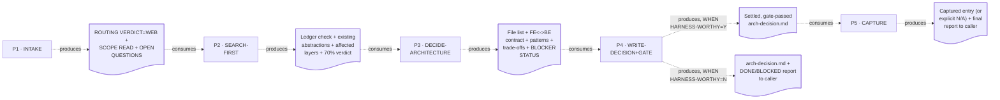

# Web Architect — Quasi-Software View (five layers: NODES+PHASES, LOOP+GRAPH, INTERNAL, PARALLELIZATION, EXPECTED OUTPUTS)

This is `grimorio.web-architect`'s own DRAWN quasi-software design view, produced per
ref:skill/grimorio.phase-splitting#the-agent-design-plans-drawn-view--a-hard-requirement-never-optional's
standing requirement that every agent-design plan carry one, saved alongside the agent's own design as a
reference file. It was authored AFTER all five phase files, per
ref:skill/grimorio.phase-splitting/project.quasi-view-requirements.md#half-b--per-phase-interior-behavior-new's
own requirement that a per-phase
interior flowchart be RE-DERIVED from the real, already-authored file, never invented before it exists — every
flowchart below is re-derived from the actual phase `.md` files, read fresh, not sketched in advance.

## STEPS vs PHASES verdict, and the orchestrator/purpose-driven classification

**VERDICT: PHASES, purpose-driven.** Full reasoning saved in this project's own branch-objective records.
Short form: the prior flat
`grimorio.architect-memory/behavior.md` carried 19 numbered steps under 5 explicitly named "Step N — NAME"
headers (REVIEW-THE-BRIEF, EXPLORE-THE-CODEBASE, DECIDE-ARCHITECTURE, WRITE-THE-DECISION, DONE), each drawing on
genuinely different knowledge, gated by a load-bearing sequencing rule ("BEFORE opening any codebase file,"
"BEFORE setting status ⟶ ENSURE every gate-check box holds") with a real, previously-unimplemented gap (the
harness-mode promise to capture into architect-memory) — the exact shape
ref:skill/grimorio.phase-splitting/project.steps-vs-phases-test.md names as a genuine multi-stage state machine
flattened into one `## Steps` list. `grimorio.web-architect` is PURPOSE-DRIVEN, not an orchestrator: every phase
is the architect doing its OWN substantive judgment work, with one bounded, conditional scout-verifier fork
threaded through two phases — never the agent's whole workflow the way an orchestrator spawns unconditionally on
every pass.

## The four standing purpose-driven dimensions — where each is threaded, not manufactured as a phase

a. **GRIMORIO MEMBERSHIP/BASES** — named once, in Phase 1's own opening "Standing precondition" section,
   mirroring `grimorio.solution-architect`'s and `grimorio.prompt-writer`'s own Phase 1, never re-taught.
b. **LOOP + RELATIONSHIPS** — stated once in Phase 0 (`behavior.md`)'s own "LOOP + RELATIONSHIPS" section:
   PARENT is whoever hands a PO brief (a PO, an orchestrator, `grimorio.system-keeper`); ITSELF is the
   distributed self-check (each phase's own DELIVERABLE gate, Phase 4's gate-check specifically, never one
   bolted-on review phase); CHILDREN is REAL but CONDITIONAL, bounded to the scout-verifier choice threaded
   through Phase 2 and Phase 3 only — the shell carries no `disallowedTools: Agent`, confirmed live.
c. **KNOWN ERRORS** — this agent's own domain-specific known errors are named in Layer 3's own
   KNOWN-ERRORS-TO-PHASE mapping below.
d. **BASE REQUIREMENTS AS ONE MISSION** — the prior file's own 2 Core rules are NOT given their own phase: CR1
   (architect-memory FIRST) is fully delegated to Phase 2, the exact phase it gates; CR2 (BLOCKED on an
   unanswered architectural question) is threaded cross-cutting — noted at Phase 1, carried at Phase 3, SET at
   Phase 4 — per Phase 0's own "The two Core Rules" section.

**SEARCH-FIRST, applied, not manufactured as a 6th phase.** Phase 2 (SEARCH-FIRST/EXPLORE-THE-CODEBASE) IS this
agent's own domain-specific SEARCH-FIRST move — reading `grimorio.architect-memory` and the features-status
ledger before any codebase file, the exact archetype
ref:skill/grimorio.phase-splitting#orchestrator-vs-purpose-driven--the-judgment-tests-own-missing-half requires as
a purpose-driven agent's own opening move.

## Layer 1 + 2 — NODES (the orchestration graph) and PHASES (the state machine)

```mermaid
flowchart TB
    P1["P1 · INTAKE<br/>(REVIEW-THE-BRIEF)"] -->|"WHEN ROUTING<br/>VERDICT = WEB"| P2["P2 · SEARCH-FIRST /<br/>EXPLORE-THE-<br/>CODEBASE"]
    P1 -.->|"WHEN ROUTING VERDICT = GAME<br/>(early exit, P1 step 4) — NEVER<br/>a loop, never merged with<br/>the P4→P3 loop-back below"| GAME(("hand to<br/>game-architect<br/>(terminal)"))
    P2 --> P3["P3 · DECIDE-<br/>ARCHITECTURE"]
    P3 --> P4["P4 · WRITE-THE-<br/>DECISION + GATE"]

    P4 -->|"WHEN HARNESS-WORTHY = Y<br/>(P4 step 5)"| P5["P5 · CAPTURE-INTO-<br/>ARCHITECT-MEMORY"]
    P4 -->|"WHEN HARNESS-WORTHY = N"| DONE1(("DONE — report<br/>to caller"))
    P5 --> DONE2(("DONE — report<br/>to caller"))

    P4 -.->|"LOOP-BACK: WHEN a gate-check<br/>box fails on deficient content<br/>(P4 step 4)"| P3

    SCOUT(("grimorio.scout<br/>(scoped verifier,<br/>Haiku-tier)"))
    P2 -->|"WHEN a prior-art/existing-<br/>abstraction claim needs<br/>independent verification<br/>(P2 step 7)"| SCOUT
    P3 -->|"WHEN the SAME kind of claim<br/>surfaces here instead, and P2<br/>did not already fire it (P3 step 12)"| SCOUT
    SCOUT -->|"verification<br/>result"| P2
    SCOUT -->|"verification<br/>result"| P3

    classDef earlyExit fill:#3a2a2a,stroke:#a55,stroke-dasharray: 3 3
    classDef scoutNode fill:#2a3a2a,stroke:#5a5
    class GAME earlyExit
    class SCOUT scoutNode
```

**Reading these two layers.** The solid spine (P1→P2→P3→P4→[P5]→DONE) is the STATE MACHINE — the five phase
files' own chain, per ref:skill/grimorio.phase-splitting#the-model--a-phase-is-a-mini-loop-state-with-three-fields.
The dashed blue back-edge (P4→P3) is the LOOP, folded into this same PHASES layer, carrying P4 step 4's own
trigger verbatim as its label, per ref:skill/grimorio.loop-and-graph#2-the-loop--the-iteration-and-its-exit-condition
applied one level down over phases. The dashed RED edge (P1→GAME) is a DIFFERENT thing entirely — an EARLY EXIT,
never a loop — drawn in a visually distinct color/style specifically so a reader never confuses "this chain
routes away and terminates" with "this chain repeats." `SCOUT` is the one agent-node in the GRAPH, drawn
circular (distinct from the rectangular phase-nodes), CONDITIONAL on either Phase 2's own step 7 or Phase 3's own
step 12 — a REAL, sometimes-wired spawn (not a future/not-wired one), drawn as a normal conditional edge rather
than a dashed "not wired yet" one, because both firing points are live in the already-authored phase files.

## Layer 4 — PARALLELIZATION: no genuine fork/join bar in this chain

**Finding: unlike `grimorio.solution-architect`'s own Phase 2 (which forks a genuine N-way scout PANEL), this
chain never raises more than ONE `grimorio.scout` at a time.** Both Phase 2 step 7 and Phase 3 step 12 name "ONE
scoped `agent:grimorio.scout`" — singular, never a panel — so while SCOUT is correctly classified REPORT-ONLY
under Rule 8(a) of ref:skill/grimorio.phase-splitting/project.flow-method.md (it only reads/verifies, it never
writes `arch-decision.md` or any phase's own DELIVERABLE), there is no second concurrent instance for it to run
alongside — Rule 8(a)'s parallelization eligibility is real in principle but has nothing to parallelize against
in this chain's own current shape. This mirrors `grimorio.system-keeper`'s own Phase 2 step 6 precedent (one
scout raised for one bounded gap, never an N-slice panel), not `grimorio.solution-architect`'s own Phase 2 shape
— the two scout-fork precedents this corpus already carries are genuinely different sizes, and this chain is the
smaller one.

**Every phase P1-P5 is CONFIRMED MODIFYING and sequential-only under Rule 8(b)** — each writes its own phase
DELIVERABLE (P4 additionally writes the shared `arch-decision.md` artifact) as it goes; none of the phase files'
own text names a second, concurrent writer of the same artifact anywhere in this chain.

## Layer 3 — INTERNAL: per-phase artifact-flow (IN → OUT), Half (a)

**ONE artifact node per phase BOUNDARY, never two** — 4 boundary artifacts (P1↔P2 through P4↔P5) plus P4's own
terminal output when HARNESS-WORTHY=N; the P4→P3 loop-back's own artifact (the failed gate-box name) intentionally
NOT drawn as a 5th node, per the "do not over-fragment an already-labelled loop-back edge" reasoning already
established at `grimorio.solution-architect`'s own precedent view.

### Half (b) — per-phase interior behavior, drawn from the REAL authored files

**Every flowchart below is re-derived from the actual phase `.md` file, read fresh this pass.**

**P1 · INTAKE (REVIEW-THE-BRIEF)**

```mermaid
flowchart TB
    A1["Step 1 — state own graph:<br/>SELF only, no spawn"] --> A2["Step 2 — state OBJECTIVE +<br/>EXIT CONDITION"]
    A2 --> A3["Step 3 — read the PO brief:<br/>stories, acceptance criteria,<br/>out of scope"]
    A3 --> A4{"Step 4 — does this touch<br/>the game (sim/render)?"}
    A4 -->|"YES"| A4y["ROUTING VERDICT=GAME —<br/>route to game-architect,<br/>chain stops here"]
    A4 -->|"NO"| A4n["ROUTING VERDICT=WEB"]
    A4n --> A5{"Step 5 — brief already<br/>leaves a question<br/>unanswered?"}
    A5 -->|"YES"| A5a["note as OPEN<br/>QUESTIONS, carried<br/>forward — never<br/>yet BLOCKED"]
    A5 -->|"NO"| A5b["OPEN QUESTIONS:<br/>None yet"]
    A5a --> EXIT1
    A5b --> EXIT1
    A4y --> EXITGAME
    EXIT1(["→ P2 · SEARCH-FIRST"])
    EXITGAME(["→ game-architect<br/>(terminal, early exit)"])
    classDef exit fill:#2a2a3a,stroke:#668,stroke-dasharray: 3 3
    classDef earlyExit fill:#3a2a2a,stroke:#a55,stroke-dasharray: 3 3
    class EXIT1 exit
    class EXITGAME earlyExit
```

**P2 · SEARCH-FIRST / EXPLORE-THE-CODEBASE**

```mermaid
flowchart TB
    B1["Step 1 — state own graph:<br/>SELF + conditional SCOUT<br/>fork"] --> B2["Step 2a — read architect-<br/>memory FIRST (CR1) —<br/>ALWAYS, any mode"]
    B2 --> B2b{"Step 2b — mode?"}
    B2b -->|"NORMAL — explore<br/>what already exists"| B2n["explore the<br/>codebase freely"]
    B2b -->|"LIGERO — skip<br/>codebase exploration"| B2l["reason only over<br/>the supplied artifacts"]
    B2n --> B3
    B2l --> B3
    B3["Step 3 — read the features-<br/>status ledger; state what<br/>already exists"]
    B3 --> B4["Step 4 — search existing<br/>abstractions (repos/handlers/<br/>entities/utilities/routes/<br/>components)"]
    B4 --> B5["Step 5 — map affected<br/>layers: DB/API/UI/auth"]
    B5 --> B6{"Step 6 — 70% of the<br/>requirement already exists?"}
    B6 -->|"YES"| B6y["MODIFY EXISTING"]
    B6 -->|"NO"| B6n["CREATE NEW"]
    B6y --> B7
    B6n --> B7
    B7{"Step 7 — a claim genuinely<br/>needs independent<br/>verification?"}
    B7 -->|"YES"| B7y["raise ONE scoped<br/>grimorio.scout<br/>(Haiku-tier)"]
    B7 -->|"NO"| B7n["N/A — state<br/>plainly"]
    B7y --> EXIT2
    B7n --> EXIT2
    EXIT2(["→ P3 · DECIDE-<br/>ARCHITECTURE"])
    classDef exit fill:#2a2a3a,stroke:#668,stroke-dasharray: 3 3
    class EXIT2 exit
```

**P3 · DECIDE-ARCHITECTURE**

```mermaid
flowchart TB
    C1["Step 1 — state own graph:<br/>SELF + the SAME<br/>conditional SCOUT fork"] --> C2["Step 2 — decide the file<br/>list: CREATE/MODIFY/<br/>DELETE + layer"]
    C2 --> C3["Step 3 — define the<br/>FE<->BE contract precisely"]
    C3 --> C4["Step 4 — name Existing<br/>Abstractions to Reuse<br/>(from P2)"]
    C4 --> C5{"Step 5 — a New<br/>Abstraction is proposed?"}
    C5 -->|"YES, unjustified"| C5a["NEVER — reuse<br/>existing instead"]
    C5 -->|"justified against<br/>existing code"| C5b["name it"]
    C5a --> C6
    C5b --> C6
    C6["Step 6 — reference Patterns<br/>Applied from development-<br/>patterns"] --> C7["Step 7 — Data Model<br/>Changes, or None"]
    C7 --> C8["Step 8 — flag Security<br/>Considerations (OWASP)"]
    C8 --> C9["Step 9 — build the<br/>Trade-offs matrix +<br/>recommendation"]
    C9 --> C10{"Step 10 — a trade-off<br/>needs a human decision?"}
    C10 -->|"YES"| C10a["name it in BLOCKER<br/>STATUS — NEVER set<br/>final BLOCKED here"]
    C10 -->|"NO"| C10b["BLOCKER STATUS:<br/>None"]
    C10a --> C11
    C10b --> C11
    C11{"Step 11 — P1's OPEN<br/>QUESTIONS still<br/>unresolved?"}
    C11 -->|"YES"| C11a["carry into<br/>BLOCKER STATUS too"]
    C11 -->|"NO"| C12
    C11a --> C12
    C12{"Step 12 — a claim needs<br/>verification, AND P2<br/>didn't already fire it?"}
    C12 -->|"YES"| C12a["raise the SAME<br/>scoped scout fork"]
    C12 -->|"NO"| C12b["N/A"]
    C12a --> EXIT3
    C12b --> EXIT3
    EXIT3(["→ P4 · WRITE-<br/>DECISION+GATE"])
    classDef exit fill:#2a2a3a,stroke:#668,stroke-dasharray: 3 3
    class EXIT3 exit
```

**P4 · WRITE-THE-DECISION + GATE**

```mermaid
flowchart TB
    LOOPIN(["◄ from P4's own<br/>LOOP-BACK, or from P3<br/>(first pass)"]) --> E1["Step 1 — state own graph:<br/>SELF + LOOP-BACK edge<br/>to P3"]
    E1 --> E2["Step 2 — write<br/>arch-decision.md<br/>(## OUTPUT template)"]
    E2 --> E3["Step 3 — run the<br/>7-item gate check"]
    E3 --> E4{"Step 4 — any box fails<br/>on DEFICIENT CONTENT<br/>(not a human trade-off)?"}
    E4 -->|"YES"| E4a["LOOP BACK to P3 —<br/>fix the content there,<br/>NEVER ship a failing<br/>decision"]
    E4 -->|"NO — every box<br/>holds, or the only<br/>failure is a genuine<br/>trade-off"| E5
    E4a --> LOOPOUT
    E5["Step 5 — set status<br/>DONE or BLOCKED —<br/>CR2 resolves HERE"] --> E6{"HARNESS-WORTHY?"}
    E6 -->|"Y — non-obvious<br/>decision settled"| EXIT4
    E6 -->|"N — nothing<br/>worth remembering"| DONE4
    LOOPOUT(["LOOP-BACK →<br/>P3 · DECIDE-<br/>ARCHITECTURE"])
    EXIT4(["→ P5 · CAPTURE-INTO-<br/>ARCHITECT-MEMORY"])
    DONE4(["DONE — report<br/>to caller"])
    classDef exit fill:#2a2a3a,stroke:#668,stroke-dasharray: 3 3
    classDef loopedge fill:#2a2a3a,stroke:#66a,stroke-dasharray: 3 3
    class EXIT4,DONE4 exit
    class LOOPOUT,LOOPIN loopedge
```

**P5 · CAPTURE-INTO-ARCHITECT-MEMORY** (terminal — runs only WHEN P4's HARNESS-WORTHY was Y)

```mermaid
flowchart TB
    F1["Step 1 — state own graph:<br/>SELF only, no spawn"] --> F2{"Step 2 — worth<br/>remembering? (non-<br/>obvious decision, not<br/>routine coding)"}
    F2 -->|"N"| F2a["CAPTURE TYPE: N/A<br/>— report explicitly<br/>nothing captured"]
    F2 -->|"Y"| F3{"Step 3/4 — DECISION<br/>(project-wide) or<br/>OPERATIONAL FACT<br/>(one area)?"}
    F3 -->|"DECISION"| F3a["write into<br/>project.md (or<br/>{topic}.md if the<br/>split threshold fires)"]
    F3 -->|"OPERATIONAL<br/>FACT"| F3b["write into the<br/>relevant {area}.md"]
    F3a --> F5
    F3b --> F5
    F5{"Step 5 — sits beside a<br/>SUPERSEDED prior entry?"}
    F5 -->|"YES"| F5a["rewrite to final state,<br/>or quarantine — NEVER<br/>interleave"]
    F5 -->|"NO"| F6
    F5a --> F6
    F6{"Step 6 — about to cite<br/>this as SIGNED/<br/>ACCEPTED?"}
    F6 -->|"YES"| F6a["run the Custody<br/>check (git ls-files)<br/>before citing"]
    F6 -->|"NO — still<br/>RECOMMENDED,<br/>NOT SIGNED"| F6b["check does not<br/>fire yet"]
    F6a --> OUT
    F6b --> OUT
    F2a --> OUT
    OUT(["Final report to<br/>caller — terminal,<br/>no hand-off"])
    classDef exit fill:#2a2a3a,stroke:#668,stroke-dasharray: 3 3
    class OUT exit
```

**Table — KNOWN-ERRORS-TO-PHASE mapping.** Rows 1-3 are grounded, dated/measured incidents; row 4 is a
standing PREVENTIVE scope rule, stated without a dated incident behind it — flagged here explicitly so all
four rows are never read as carrying identical evidentiary weight.

| # | Known error / incident / standing rule | Addressed by |
|---|---|---|
| 1 | Three capabilities were re-discovered in one session because the `features-status.md` read was skipped | P2 step 3 |
| 2 | The `tmp/` citation-loss custody incident (2026-07-18) — a SIGNED/ACCEPTED decision cited a dead `tmp/features/**` path | P5 step 6, per this project's own architecture memory's own custody-incident record |
| 3 | **OMISSION, now addressed.** The harness-mode promise ("captures settled web-architecture decisions into architect-memory") was never actually implemented in the pre-split flat file — nothing in it ever wrote into `project.md` or an `{area}.md` file | **This chain's own Phase 5, in full** — the phase this whole re-audit pass was written to close, named plainly rather than left as a residual gap |
| 4 | **STANDING PREVENTIVE RULE — no dated incident.** The web-architect's own scope boundary: never force a web-CRUD frame onto a game/sim decision | P1 step 4 (the routing verdict) |

## Layer 5 — EXPECTED OUTPUTS: WORK vs ORCHESTRATION, per phase

| Phase | WORK PRODUCT (what the phase's own action produces) | ORCHESTRATION ACT (what it then routes, and to whom) |
|---|---|---|
| P1 · INTAKE | The routing verdict (WEB/GAME), the scope read, and any early-noted open question | Hands WEB-routed briefs to P2; GAME-routed briefs terminate to `game-architect` |
| P2 · SEARCH-FIRST | The ledger check, existing abstractions found, affected layers, the 70% verdict | Hands the map to P3; conditionally forks `scout` for one claim |
| P3 · DECIDE-ARCHITECTURE | The file list, the FE↔BE contract, reuse/new abstractions, patterns, data model, security, trade-offs | Hands the decision content to P4; conditionally forks `scout` for one claim P2 did not already cover |
| P4 · WRITE-DECISION+GATE | The written, gate-passed `arch-decision.md`, its DONE/BLOCKED status | Loops back to P3 on a content-deficient gate failure; forks to P5 when harness-worthy, else terminates |
| P5 · CAPTURE | The captured decision/operational-fact entry (or an explicit "nothing captured") | Terminates — reports the full settled chain to the caller |
