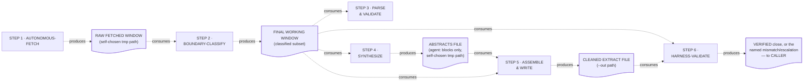

# Extract-Cleaner — Quasi-Software View (STATE MACHINE + LOOP + GRAPH, both Layer-4 halves)

This is `agent:grimorio.extract-cleaner`'s own DRAWN quasi-software design view, produced per
ref:skill/grimorio.phase-splitting/project.quasi-view-requirements.md's own three-layer HARD requirement — a genuinely new
agent, so this view lands in the same authoring pass as the shell and its behavior file, never deferred.

**No `-phases/` directory exists for this agent, and that absence is not an omission.** The task is ONE
cognitive mission — autonomously fetch its own CEO-turn window, classify the topic boundary, parse the
classified window, clean its `agent:` turns, write it, verify it — not a chain of distinct
questions/deliverables/knowledge, per ref:skill/grimorio.phase-splitting's own "group base requirements into
fewer, richer phases" guidance, the same shape `agent:grimorio.scout`'s own single-file behavior takes. **The
STATE MACHINE layer below draws this agent's own SIX INTERNAL STEPS
(`ref:skill/grimorio.conduct/extract-cleaner-behavior.md`'s own Steps section) as the sequential spine in place
of a multi-file phase chain** — a reader who expects a `-phases/` directory here should read this paragraph,
not the absence, as the answer.

---

## Layers 1 + 2 + 3 — STATE MACHINE, LOOP, and GRAPH in one diagram

```mermaid
flowchart TB
    CALLER(("CALLER — the main loop,<br/>or any other agent (H11<br/>exempts every subagent-<br/>originated spawn,<br/>regardless of type)"))
    CALLER -->|"NOTHING required — any<br/>file/count/session claim<br/>is ignored; an optional<br/>--out path is the ONLY<br/>thing honored"| S1

    subgraph CLEANER["agent:grimorio.extract-cleaner —<br/>ONE cognitive mission, no<br/>phase-file chain"]
      direction TB
      S1["STEP 1<br/>AUTONOMOUS-FETCH"] --> S2["STEP 2<br/>BOUNDARY-CLASSIFY"]
      S2 --> S3["STEP 3<br/>PARSE & VALIDATE"] --> S4["STEP 4<br/>SYNTHESIZE"]
      S4 --> S5["STEP 5<br/>ASSEMBLE & WRITE"]
      S5 --> S6["STEP 6<br/>HARNESS-VALIDATE"]
    end

    S3 -.->|"malformed window"| STOP1(["STOP — report the<br/>specific defect; never<br/>repair, merge, or<br/>fabricate a turn"])
    S3 -.->|"turn floor not met<br/>(&lt;3 user: or<br/>&lt;5 total)"| STOP2(["STOP — report the<br/>counts found vs the<br/>required floor; never<br/>proceed"])
    S6 -.->|"LOOP-BACK: harness<br/>script exits 1 — retry,<br/>≤2 total"| S5
    S6 -->|"EXIT: harness script<br/>exits 0 (VERIFIED) — or 2<br/>retries exhausted (STOP,<br/>report the script's FAIL<br/>output)"| DONE(["report to CALLER"])

    style CALLER fill:#2a3a2a,stroke:#5a5,stroke-width:2px
    style CLEANER fill:none,stroke:#77a,stroke-width:2px
    classDef exit fill:#2a2a3a,stroke:#668,stroke-dasharray: 3 3
    class DONE,STOP1,STOP2 exit
```

**Reading this diagram.** The solid `S1→S2→S3→S4→S5→S6` chain inside the `CLEANER` subgraph is the STATE
MACHINE — this agent's own six internal steps, standing in for a phase-file chain per the section above. `S1`
(AUTONOMOUS-FETCH) and `S2` (BOUNDARY-CLASSIFY) are the two steps this pass added: S1 resolves the agent's own
session id and invokes `ref:repo/scripts/ceo-transcript-lookup.mjs` itself (never the caller); S2 is a genuine
semantic judgment, never mechanical, deciding where the current thread begins. The dashed `S6→S5` edge is the
LOOP — the ONLY back-edge this agent carries — labeled with its real exit condition (the harness script exits 0)
and its bounded-retry escalation (2 retries exhausted → STOP, never a silent third attempt); the dashed
`S3→STOP1` and `S3→STOP2` edges are two non-repeating early exits off PARSE & VALIDATE — STOP1 for a malformed
alternation, STOP2 for a window that does not meet the turn-floor gate (≥3 `user:` turns, ≥5 total) — both a
defect in what Steps 1-2 produced, never a loop to retry, and never a reason to silently re-run S2 with a softer
boundary just to clear the floor. The `CALLER→S1` and `S6/DONE→CALLER` edges, plus the visually distinct
`CLEANER` container (a bordered subgraph, never drawn as an undifferentiated rectangle among the spine's own
nodes) and the circular `CALLER` node, are the GRAPH: one caller, one callee, **and no agent-node for a child
anywhere in this diagram, because none exists.** `disallowedTools` is not set on this shell for the simple
reason that `Skill` and `Agent` are never listed in its `tools:` line at all — the agent structurally cannot
spawn, so drawing spawn machinery here would misrepresent what this agent does today, exactly the failure
ref:skill/grimorio.phase-splitting/project.quasi-view-requirements.md's own hard-locked-non-recursive clause
warns against manufacturing. **The `CALLER→S1` edge itself is the drawn form of this pass's own redesign**: it
no longer carries a file path or a count — it carries nothing this agent will honor beyond an optional `--out`,
which is exactly what makes the CALLER node's own label read "NOTHING required" instead of "the ONLY two inputs
required" (the OLD label, before this pass).

---

## Layer 4a — INTERNAL: boundary artifact-flow

**Grounding — shared across every quasi-view that draws this layer, not restated here:**
ref:skill/grimorio.phase-splitting/project.quasi-view-requirements.md#half-a--boundary-artifact-flow-unchanged. This agent has no
multi-phase chain to draw N-1 boundaries across in the phase-file sense, but it now has SIX internal
boundaries worth naming, each traceable to one dashed edge in the mermaid diagram below: Step 1 → Step 2 (the
raw fetched window handed to the classifier); Step 2 → Step 4 (the SAME classified window file, read a SECOND
time — Step 4's own grounding read of the preserved `user:` turns, never re-produced); Step 2 → Step 5 (the
SAME classified window file, read a THIRD time as `splice`'s own `<window-file>` argument inside Step 5 —
named here as its own boundary rather than folded into a parenthetical); Step 2 → Step 6 (the SAME classified
window file, read a FOURTH time, as HARNESS-VALIDATE's own `<input>`, per
`ref:skill/grimorio.conduct/extract-cleaner-behavior.md`'s own Step 6, so this agent's own critical fix reads
from the classified window rather than Step 1's raw, pre-classification fetch); Step 4 → Step 5 (the new
ABSTRACTS FILE, `splice`'s own second argument); and Step 5 → Step 6 (Step 5's own written result,
HARNESS-VALIDATE's own `<output>`).

Not drawn as a separate node, because it is produced and consumed entirely WITHIN `S6` itself, never crossing a
step boundary this diagram exists to show: Step 6's own INDEPENDENT-REFETCH sub-step produces one further
artifact, a FRESH reference file (a separate `ceo-transcript-lookup.mjs --user-count 1` invocation, at gate
time), which `S6` immediately consumes as the harness script's own third argument — this is why `S6`'s own box
above shows only THREE crossing edges (`FINAL` in, `ART` in, `OUT` out) rather than FOUR: drawing the fresh
reference file as its own node would add a fourth incoming edge, which this diagram deliberately omits since
that artifact never crosses the step boundary it depicts.

The dotted edges carry the same "consumes"/"produces" meaning the exemplar's own equivalent diagrams use,
deliberately the same visual convention as the LOOP-back edge above (dashed) but a different fact: data moving,
never control moving. The Step1→Step2→Step3 chain is new this pass: the RAW FETCHED WINDOW is Step 1's own
intermediate artifact (never the caller's own file — this agent produced it itself), and the FINAL WORKING
WINDOW is Step 2's own classified output, the one every downstream step (3-6) actually operates on — drawn with
FOUR "consumes" edges off the SAME `FINAL` node, never a second node: one to `S3` (immediate downstream), one
to `S4` (Step 4's own grounding read of the preserved `user:` turns during synthesis, consulted without
re-producing them), one to `S5` (HARNESS-VALIDATE's own sibling need — `splice`'s own `<window-file>`
argument), and one to `S6`
(HARNESS-VALIDATE's own `<input>`, per the CRITICAL fix landed in
`ref:skill/grimorio.conduct/extract-cleaner-behavior.md`'s own Step 6 — Step 6 no longer reads Step 1's raw,
pre-classification fetch).

The ABSTRACTS FILE is new this pass, alongside the boundary-classify-on-`user:`-turns-only correction: Step 4's
own per-`agent:`-turn compression loop, drawn in full in Layer 4b below, now closes by writing ONE ordered file
containing ONLY `agent:` blocks — never appended into any buffer during the loop itself, assembled and written
just once, at the very end of Step 4 — which Step 5's own mechanical `splice` invocation then consumes alongside
`FINAL` (the classified window file) to produce the CLEANED EXTRACT FILE. This closes the same free-generation
risk Step 2's own `slice` invocation already closes for the boundary cut: neither `user:` content nor the final
document's own assembled content ever passes through a model-authored `Write` call again — `FINAL`'s own three
"consumes" edges above (`S3`, `S5`, `S6`) and `ABS`'s own edge into `S5` are the drawn form of that fix.

The terminal artifact is still the report itself — VERIFIED with its harness-script PASS proof, or the named
mismatch — reaching the CALLER, never a second file this agent writes beyond the one `--out <path>` destination.

---

## Layer 4b — INTERNAL: interior behavior + KNOWN-ERRORS-TO-PHASE mapping

Per ref:skill/grimorio.phase-splitting/project.quasi-view-requirements.md#half-b--per-phase-interior-behavior-new, this agent has
only ONE "phase" in the sense that requirement uses the word — its own single cognitive mission — so it gets
ONE mermaid flowchart, never a markdown table, translating every WHEN/IF branch
`ref:skill/grimorio.conduct/extract-cleaner-behavior.md`'s own Steps section actually contains, one-to-one.

```mermaid
flowchart TB
    A0["STEP 0 — state own graph:<br/>SELF node, 6 sub-steps,<br/>no spawn (no Skill, no<br/>Agent tool in tools:)"] --> A1["STEP 1 —<br/>AUTONOMOUS-FETCH:<br/>resolve own session from<br/>$CLAUDE_CODE_SESSION_ID;<br/>invoke ceo-transcript-<br/>lookup.mjs --user-count 20<br/>via Bash; read raw output"]
    A1 --> A2["STEP 2 —<br/>BOUNDARY-CLASSIFY:<br/>read ONLY the fetched<br/>window's own user: turns,<br/>decide K (most-recent<br/>user: turns to keep) by<br/>own judgment — never citing<br/>agent: content; invoke<br/>assemble-cleaned-extract.<br/>mjs slice via Bash to<br/>produce FINAL window<br/>mechanically"]
    A2 --> A3["STEP 3 — read final window,<br/>confirm strict user:/agent:<br/>alternation"]
    A3 --> A3c{"window malformed? (two<br/>same-role turns adjacent,<br/>or a turn silently<br/>missing)"}
    A3c -->|"YES"| A3s(["STOP — report the<br/>specific defect; NEVER<br/>repair, merge, or<br/>fabricate a turn"])
    A3c -->|"NO"| A3f{"turn floor met?<br/>(≥3 user: turns,<br/>≥5 total)"}
    A3f -->|"NO"| A3fs(["STOP — report the<br/>counts found vs the<br/>required floor; NEVER<br/>pad or soften Step 2's<br/>own boundary decision"])
    A3f -->|"YES"| A4["STEP 4 — SYNTHESIZE:<br/>ITERATE one agent: turn at<br/>a time — read ONLY that<br/>turn, compress against the<br/>preserved user: turns +<br/>the growing abstracts-so-<br/>far (never a whole-arc<br/>reread, never appending<br/>user: text anywhere);<br/>extract negatives (incl.<br/>cross-turn), decisions,<br/>commitments; strip<br/>narration/filler; rewrite<br/>PROPOSAL-voiced; at the<br/>END, write the ordered<br/>ABSTRACTS-ONLY file via<br/>Write"]
    A4 --> A5["STEP 5 — ASSEMBLE & WRITE:<br/>invoke assemble-cleaned-<br/>extract.mjs splice (window<br/>file + abstracts file) via<br/>Bash — mechanical byte-copy<br/>of user: turns + abstract<br/>substitution, header<br/>emitted automatically —<br/>writes to --out path<br/>(never a Write-tool-<br/>authored final document)"]
    A5 --> A6["STEP 6 — HARNESS-VALIDATE:<br/>INDEPENDENT-REFETCH first —<br/>fresh ceo-transcript-<br/>lookup.mjs --user-count 1 —<br/>THEN run verify-cleaned-<br/>extract.sh input/output/<br/>reference via Bash —<br/>deterministic harness,<br/>never an ad hoc diff or<br/>self-read"]
    A6 --> A6c{"script exit code?"}
    A6c -->|"0"| A6v(["VERIFIED — quote both<br/>commands (INDEPENDENT-<br/>REFETCH + harness) + the<br/>harness PASS output as<br/>proof"])
    A6c -->|"1"| A6r{"2 retries already<br/>used?"}
    A6r -->|"NO — revise the<br/>abstracts file, re-splice"| A5
    A6r -->|"YES"| A6s(["STOP — report the script's<br/>FAIL output verbatim; NEVER<br/>claim VERIFIED"])

    classDef exit fill:#2a2a3a,stroke:#668,stroke-dasharray: 3 3
    class A3s,A3fs,A6v,A6s exit
```

**KNOWN-ERRORS-TO-PHASE mapping.** One row per known error this agent's own kind of work makes relevant.
**WHEN a row's own ADDRESSED BY column reads OMISSION ⟶ that is a real, currently-true gap, never a
placeholder.**

| # | Known error / incident | Addressed by |
|---|---|---|
| 1 | Haiku is measured to ignore an ambient/skill-loaded rule even when instructed (`ref:skill/grimorio.agent-tiers#haiku-the-volume-tier--plan-on-sonnetopus-execute-on-haiku-review-on-sonnet`'s own measured finding) | This agent loads no skill at all — it carries no `Skill` tool, so its entire discipline is inline in this one behavior file, never dependent on an ambient or skill-loaded rule firing |
| 2 | A self-graded check is not proof (`ref:skill/grimorio.flow-delegation#independence-not-capability--why-you-raise-a-delegate-ceo-ruling-2026-08-12`) | Step 6's own deterministic harness script (`ref:repo/scripts/verify-cleaned-extract.sh`), called via Bash and judged by its exit code — never an LLM's own unverified claim of "the output looks right" (the behavior file's own Self-check gate and its final Rules bullet both name this explicitly) |
| 3 | Silently repairs, merges, or fabricates a malformed input | Step 3's own explicit STOP-and-report rule — never a silent fix |
| 4 | This agent was not yet spawnable by the main loop via the live H9/H11 gate, pending an `EXEMPT_TYPES` hook edit. | **CLOSED, 2026-08-25** — `"grimorio.extract-cleaner"` landed in both hooks' own `EXEMPT_TYPES` lists in a separate, parallel pass of an earlier branch, verified live by agent:grimorio.system-keeper (`node --check` on both hook files; a smoke test confirming the type passes both hooks silently while a non-exempt type is still correctly denied). Per the WRITTEN-vs-FIRED distinction (`ref:skill/grimorio.reasoning-principles#a-rule-is-not-verified-by-reading-it--the-artifact-class-that-needs-an-observation-hard-rule-ceo-2026-08-12`), this closes WRITTEN + landed + synthetically observed on a probe — not yet observed on a real production dispatch |
| 5 | (a) Turn-by-turn ISOLATED compression loses cross-turn negatives — the load-bearing constraints emerge across the whole arc, never from one turn alone; (b) an ad hoc, hand-reinvented inline Bash diff stood in for a real deterministic harness | (a) addressed by Step 4/A4 — iterative one-`agent:`-turn-at-a-time processing grounded against the preserved `user:` turns and the growing abstracts-so-far (never a whole-arc reread), so a negative visible only from an earlier turn is still captured because that earlier turn already sits, preserved, on disk in the classified window file; (b) addressed by Step 6/A6 — `ref:repo/scripts/verify-cleaned-extract.sh`, the grimorio HARNESS concept's own deterministic tier, called via Bash and judged by its exit code, never a hand-written diff |
| 6 | Three grading criteria postdating an earlier authoring pass were not yet exhibited: H5 (a correct measurement can still mislead if its own SCOPE is left unstated), H6 (the corpus's own capability index is the first place to check before deciding what to do, and owes an update when the corpus changes), H7 (the verbatim-origin chain this agent cleans has a FLOOR — truncating on a "looks self-contained" judgment risks silently dropping an earlier, still load-bearing confirmation) | H5 — the OUTPUT "Report scope"/"Fetch scope" fields, A6v's own scoped claim. H7 — the Step 3/A3f-A3fs floor gate. H6 — this agent's own hard-locked runtime genuinely has no discovery-first decision to make (named explicitly in `ref:skill/grimorio.conduct/extract-cleaner-behavior.md`'s own paragraph); its update-on-change half is satisfied by the authoring pass that changed it updating `GRIMORIO-INDEX.md`'s own extract-cleaner line, recorded in `ref:skill/grimorio.conduct/project.extract-cleaner-project.md` |
| 7 | The agent's own prior design let the CALLER decide its own fetch depth and hand it a file — a caller (including the main loop itself) could silently under-fetch, exactly the failure the CEO caught live: a `--count` chosen too shallow for the arc, and the deeper root cause that this agent should never have accepted a count, file, or session id from anyone to begin with | **CLOSED, this pass (2026-08-30)** — Steps 1-2/A1-A2, the two new leading steps: Step 1 fetches a FIXED `--user-count 20` autonomously, ignoring any caller-supplied depth; Step 2 classifies the boundary by the agent's own judgment, never a caller's. The Core rules' own new injection-resistance rule and this file's own CALLER→S1 edge label (Layer 1-3 above) are the drawn/written form of the same fix |
| 8 | Step 4's own WHOLE-ARC-FIRST synthesis mandate failed twice on the real ~20-turn window it was designed for: `af40e4231486d810d` truncated to the 9 oldest turns and self-reported a false PASS; `a19ad3abf203c65dd` left every `agent:` turn raw, citing "token budget" | **CLOSED, this pass (2026-08-30)** — Step 4/A4 redesigned to iterative one-`agent:`-turn-at-a-time processing (above); Step 6/A6 gained the INDEPENDENT-REFETCH sub-step and the 3-argument harness contract; `ref:repo/scripts/verify-cleaned-extract.mjs` gained COMPLETENESS (an independently re-fetched reference catches an upstream truncation) and COMPRESSION (every `agent:` turn must be genuinely shorter) gates, so a repeat of either failure is now mechanically caught rather than trusted on self-report — see `ref:skill/grimorio.conduct/project.extract-cleaner-project.md`'s own dated entry |
| 9 | A real production run's own CHECK-3 retry-exhaustion, on closer diagnosis, traced to BOTH Step 2's own window-cut write AND Step 5's own final-assembly write relying on LLM free-generation to reproduce previously-read `user:` turn text — a byte-identity mismatch risk on long turns, at TWO separate write points, never Step 5 alone | **CLOSED, this pass (2026-08-30)** — Step 2/A2's boundary cut and Step 5/A5's final assembly both now invoke `ref:repo/scripts/assemble-cleaned-extract.mjs` (`slice`/`splice`) via Bash instead of writing via the `Write` tool; `user:` text and the final document's own content never pass through model free-generation anywhere in this agent's path, closing the failure by construction rather than by prose alone — `ref:skill/grimorio.conduct/extract-cleaner-behavior.md`'s own Rules section gained a new bullet naming this explicitly. See `ref:skill/grimorio.conduct/project.extract-cleaner-project.md`'s own dated entry |

---

## What this view does NOT claim

Consistent with this corpus's own standing honesty discipline: every node and edge above documents what this
agent's own written behavior file NOW SAYS, never that it has been OBSERVED firing on a real, gate-passed spawn.
Writing and firing are separate facts —
`ref:skill/grimorio.reasoning-principles#a-rule-is-not-verified-by-reading-it--the-artifact-class-that-needs-an-observation-hard-rule-ceo-2026-08-12`,
applied here rather than re-derived. Row 4 above is a closed instance from an earlier pass, carried forward
honestly rather than re-claimed as this pass's own work. Row 5 and row 6 are two further instances of the same
discipline from that earlier pass, likewise carried forward, never re-claimed. **Row 7 is THIS pass's own
instance of the same honesty**: Steps 1-2/A1-A2 (AUTONOMOUS-FETCH, BOUNDARY-CLASSIFY) are WRITTEN here, never
claimed OBSERVED firing on a real, gate-passed spawn of this agent under the new steps — no such run has
happened yet at the time this view was drawn. **Row 8 is a further instance of the same honesty**: the
iterative Step 4/A4 loop and Step 6/A6's own INDEPENDENT-REFETCH sub-step are WRITTEN here, never yet claimed
OBSERVED firing on a real, gate-passed spawn of this agent under the new design. **Row 9 is THIS pass's own
instance of the same honesty**: the mechanical `slice`/`splice` invocations in Step 2/A2 and Step 5/A5, and Step
4/A4's own rewritten abstracts-file write, are WRITTEN here, never yet claimed OBSERVED firing on a real,
gate-passed spawn of this agent under this pass's own design — UNLESS/UNTIL the live re-run this same branch's
own objective requires (`this project's own boundary-splice objective record`'s
own check C7) actually lands and
is recorded, in which case name that observation instead.
