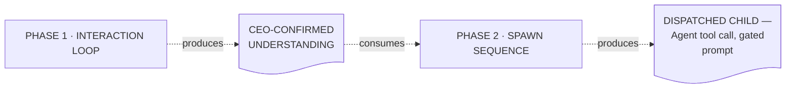

# Main-Loop Flow — Quasi-Software View (STATE MACHINE + LOOP + GRAPH, both Layer-4 halves)

This is the main loop's own DRAWN quasi-software design view, produced under the EXTENDED scope
ref:skill/grimorio.phase-splitting/project.quasi-view-requirements.md#the-three-layer-hard-requirement now states explicitly
(its own 2026-08-24 "EXTENDED" paragraph): a phased-process design `grimorio.system-keeper` produces that is
NOT itself an agent still owes this same drawn view, unchanged in every other respect. **This file is the
first instance produced under that extended scope** — no earlier version of this view ever existed, drawn or
undrawn, for the main loop's own spawn-phase flow. That absence is exactly what let the flow ship once with
only its LOGIC drawn (phases, an algorithm) and none of its IMPLEMENTATION depth — the CEO's own diagnosis,
translated: *"your quasi-software view shows the correct logic, but very little depth... the logic is great,
the implementation, no."* Model and conventions follow
ref:skill/grimorio.agent-writing/system-keeper-phases/system-keeper-quasi-software-view.md#the-five-layers-at-a-glance-and-where-each-is-drawn's
own precedent — cited for the general layer/labeling discipline (DFD doc-shaped artifact nodes, dashed vs
solid edge meaning, circular vs rectangular node shape), never re-derived here.

**Scope of what this file draws.** The main loop's own two-phase flow, per the CEO's own reframing (translated,
2026-08-24): *"the main loop is also a flow... its loop: Phase 1 is the interaction loop — you talk until I
understand, exit when you say 'ya entendiste, sigue' — then Phase 2 is everything already prescribed about
launching an agent."* Phase 1 has no written Steps section anywhere in the corpus to render from — it is
defined entirely by that quote, so its own interior flowchart below is built directly from it, honestly, rather
than from a phase file that does not exist. Phase 2's four sub-steps ARE written, in full, in
ref:skill/grimorio.conduct/project.main-loop-only.md rules 13 and 14 (as updated by this same authoring pass) plus the
real, current logic of `ref:repo/.claude/hooks/spawn-verbatim-origin-gate.cjs` (H11, also updated this pass) —
every flowchart below is re-derived from those files' own current text, not from memory or from this file's
own prior wording.

---

## Layer 1 + 2 + 3 — STATE MACHINE, LOOP, and GRAPH in one diagram

Per the exemplar's own convention, the phase spine and the agent-nodes it spawns share one diagram — a
phase-node and an agent-node only read correctly against the same spine. Phase 2 is drawn EXPANDED into its
own four sub-steps directly in this diagram (rather than left as one opaque box) because the one loop-back this
layer is required to draw — H11's DENY — is an edge BETWEEN two of those sub-steps, not between two phases;
collapsing Phase 2 to a single node here would make that loop-back undrawable at this layer.

```mermaid
flowchart TB
    P1["PHASE 1 · INTERACTION LOOP<br/>CEO talks until the assistant<br/>demonstrably understands"]
    P1 -.->|"LOOP-BACK: CEO has NOT yet<br/>said 'ya entendiste, sigue' —<br/>keep talking"| P1
    P1 -->|"EXIT: CEO says<br/>'ya entendiste, sigue'"| S1

    subgraph P2["PHASE 2 · SPAWN SEQUENCE"]
      direction TB
      S1["build pseudo-spec<br/>(rule 13, six parts)"] --> S2["independent coverage<br/>check (rule 14, four<br/>parts + carve-out)"]
      S2 --> S3{"H11 gate —<br/>spawn-verbatim-origin-<br/>gate.cjs (ELEMENT 1,<br/>1b, 2, 3)"}
      S3 -->|"ALLOW — all three<br/>elements present"| S4["dispatch<br/>(Agent tool call)"]
    end
    S3 -.->|"DENY — missing ELEMENT<br/>1, 1b, 2, and/or 3 (H11<br/>names which)"| S1

    S4 --> CHILD(("the H11-gated<br/>child"))

    SCOUT_HAIKU(("agent:grimorio.extract-cleaner<br/>HAIKU-tier (baked in)<br/>rule 13 part 4"))
    S1 -->|"WHEN the main loop cannot<br/>affirmatively show its own<br/>cleaning is unbiased"| SCOUT_HAIKU
    SCOUT_HAIKU -->|"cleaned agent-turn<br/>abstract, returned"| S1

    SCOUT_SONNET(("agent:grimorio.scout<br/>SONNET-tier<br/>rule 14"))
    S2 -->|"fresh, hard-locked,<br/>non-recursive"| SCOUT_SONNET
    SCOUT_SONNET -->|"coverage map —<br/>UNCOVERED gates S2"| S2

    style SCOUT_HAIKU fill:#2a3a2a,stroke:#5a5
    style SCOUT_SONNET fill:#2a3a2a,stroke:#5a5
    style CHILD fill:#2a3a2a,stroke:#5a5
```

**Reading this diagram.** The solid P1→S1 edge and the S1→S2→S3→S4 chain are the STATE MACHINE. P1's own
dashed self-loop, labeled with the CEO's own exit phrase verbatim, is the LOOP — the only back-edge Phase 1
carries. The S3→S1 dashed edge is Phase 2's own loop-back, fired by H11's DENY — the ONLY loop-back Phase 2
carries at THIS layer; rule 14's own separate UNCOVERED→STOP-and-rewrite gate is a second, narrower loop-back
that lives one level down, inside the "independent coverage check" sub-step's own interior (Layer 4b below) —
drawing it here too would duplicate what that flowchart already shows without adding a new fact at this
altitude, the same "do not over-fragment" discipline the exemplar's own Layer 3 section applies. The two
circular SCOUT nodes are the GRAPH's agent-nodes: `agent:grimorio.scout` fires TWICE inside Phase 2, at two
DIFFERENT tiers for two DIFFERENT purposes — Haiku, cleaning the assistant's own turns (rule 13 part 4); Sonnet,
checking the drafted brief's own coverage (rule 14) — drawn as two distinct nodes rather than one node reused,
because merging them would hide that they run at different tiers for different reasons. `CHILD` is the generic
"the H11-gated child" GRAPH node the requirement names — deliberately generic, since which concrete agent type
is spawned varies spawn to spawn and is not this flow's own concern to fix.

**No future/not-wired agent-node belongs in this diagram — N/A, not invented.** A full read of rules 13/14 and
H11's own current code surfaced no language naming an agent the flow MAY one day lean on but does not
currently spawn — both SCOUT nodes above are live and wired today.

---

## Layer 4a — INTERNAL: boundary artifact-flow (N-1 rule)

**Grounding — shared across every quasi-view that draws this layer, not restated here:**
ref:skill/grimorio.phase-splitting/project.quasi-view-requirements.md#half-a--boundary-artifact-flow-unchanged. Two phases means
ONE boundary artifact (N-1), plus the terminal phase's own final output crossing to the caller — never one
IN/OUT pair per phase.

The dotted edges carry the same "consumes"/"produces" (data-moving) meaning the exemplar's own equivalent
diagram uses, deliberately the same visual convention as a loop-back edge (dashed) but a different fact. What
crosses the ONE boundary this flow has is not a file or a structured object — it is the shared understanding
the CEO's own exit phrase confirms exists, which Phase 2 then acts on to build a pseudo-spec against. The
terminal artifact is the dispatched `Agent` tool call itself, carrying the gated prompt (verbatim quote +
alternating structure + coverage instruction) H11 required to let it through.

---

## Layer 4b — INTERNAL: per-sub-step interior behavior + KNOWN-ERRORS-TO-PHASE mapping

Per ref:skill/grimorio.phase-splitting/project.quasi-view-requirements.md#half-b--per-phase-interior-behavior-new, this half is
owed together with Layer 4a, never alone, and MUST render one mermaid `flowchart` per phase — never a table.
Phase 1 gets one flowchart (its own interior is genuinely simple — a single decision). Phase 2 gets FOUR,
one per sub-step (S1-S4 above), rather than one crowded diagram for the whole phase, because each sub-step is
itself a multi-part written PROCEDURE (rule 13's six parts; rule 14's four parts plus a two-condition
carve-out; H11's own real branching code; a short terminal hand-off) — cramming all four into one flowchart
would produce exactly the kind of dense, hard-to-trace diagram this layer's own grounding argues against.
**Every flowchart below is re-derived from the real, current text of `main-loop-only.md` rules 13/14 and
`spawn-verbatim-origin-gate.cjs` — nothing here is invented or paraphrased from memory**, per this brief's own
explicit prohibition against inventing branches or steps.

### PHASE 1 · INTERACTION LOOP (interior)

```mermaid
flowchart TB
    A1["CEO speaks — states,<br/>corrects, or confirms"] --> A2["assistant proposes /<br/>clarifies its own<br/>understanding"]
    A2 --> A3{"CEO says 'ya entendiste,<br/>sigue' (the exit phrase,<br/>verbatim)?"}
    A3 -->|"NO — still<br/>correcting"| A1
    A3 -->|"YES"| EXITP1(["→ PHASE 2 ·<br/>SPAWN SEQUENCE"])

    classDef exit fill:#2a2a3a,stroke:#668,stroke-dasharray: 3 3
    class EXITP1 exit
```

### PHASE 2, sub-step S1 · build pseudo-spec (rule 13's own six-part PROCEDURE)

Part 5 of rule 13 ("THE WHY") states rationale only — it names no WHEN/IF-branch of its own, so it is not
rendered as a node here; every other part is.

```mermaid
flowchart TB
    B1["Part 1 — AUTONOMOUS, NEVER<br/>MAIN-LOOP-DRIVEN: raise agent:<br/>grimorio.extract-cleaner with NO<br/>file/count/session argument —<br/>same raise as B4a below, not a<br/>second one; walking the chain /<br/>choosing depth is now<br/>STRUCTURALLY IMPOSSIBLE"] --> B2["Part 2 — format user:/agent:,<br/>EVERY turn present, STRICTLY<br/>alternating — never two<br/>same-role turns in a row"]
    B2 --> B3["Part 3 — the CEO's own turns<br/>are CITED VERBATIM (a partial<br/>quote is fine, paraphrase is<br/>NEVER allowed)"]
    B3 --> B4{"Part 4 — can the main loop<br/>affirmatively show its own<br/>cleaning is NOT self-biased?"}
    B4 -->|"NO — the ordinary case"| B4a["raise agent:grimorio.<br/>extract-cleaner (Haiku-tier,<br/>baked in) to clean the<br/>assistant's own turns —<br/>MUST preserve negative<br/>constraints"]
    B4 -->|"YES"| B4b["N/A this pass"]
    B4a --> B5
    B4b --> B5
    B5{"Part 6 — is the assembled<br/>extract long?"}
    B5 -->|"YES"| B5a["write it to a FILE; the SHORT<br/>inline quote still sits inside a<br/>real user:/agent: pair — the<br/>pointer lives INSIDE the agent:<br/>turn, after its own label"]
    B5 -->|"NO"| B5b["inline is enough on<br/>its own"]
    B5a --> EXITB(["→ S2 · independent<br/>coverage check"])
    B5b --> EXITB

    classDef exit fill:#2a2a3a,stroke:#668,stroke-dasharray: 3 3
    class EXITB exit
```

### PHASE 2, sub-step S2 · independent coverage check (rule 14's own four-part PROCEDURE + carve-out)

```mermaid
flowchart TB
    C0{"Carve-out (a) — did rule 13's<br/>own Part 1 find a SINGLE CEO<br/>turn, no prior correction<br/>chain?"}
    C0 -->|"YES"| C0a["rule 14 does NOT fire —<br/>skip straight to S3"]
    C0 -->|"NO"| C0b{"Carve-out (b) — is the spawn<br/>being drafted itself a<br/>grimorio.delegate already<br/>gated by flow-delegation's<br/>own pre-flight?"}
    C0b -->|"YES"| C0a
    C0b -->|"NO"| C1
    C1["Part 1 — RAISE a fresh, hard-<br/>locked, non-recursive<br/>agent:grimorio.scout — SONNET<br/>tier, NEVER Haiku"] --> C2["Part 2 — HAND IT the pseudo-<br/>spec S1 built AND the DRAFTED<br/>child brief, not yet sent"]
    C2 --> C3["Part 3 — IT RETURNS a<br/>coverage map: one row per<br/>pseudo-spec clause → the<br/>brief text that covers it, or<br/>UNCOVERED"]
    C3 --> C4{"Part 4 — does any clause<br/>read UNCOVERED?"}
    C4 -->|"YES"| C4a["STOP — rewrite the brief<br/>before spawning, never<br/>proceed partially-covered"]
    C4a -.-> C2
    C4 -->|"NO"| EXITC
    C0a --> EXITC
    EXITC(["→ S3 · H11 gate"])

    classDef exit fill:#2a2a3a,stroke:#668,stroke-dasharray: 3 3
    class EXITC exit
```

### PHASE 2, sub-step S3 · H11 gate (`spawn-verbatim-origin-gate.cjs`'s own real, current branching)

```mermaid
flowchart TB
    H1{"caller carries agent_type<br/>or agent_id on the hook's<br/>own stdin?"}
    H1 -->|"YES — caller is a<br/>subagent"| H1a(["ALLOW — hook has NO<br/>effect (main-loop-only<br/>scope)"])
    H1 -->|"NO — caller IS<br/>the main loop"| H2{"subagent_type is an<br/>EXEMPT_TYPES member?"}
    H2 -->|"YES"| H2a(["ALLOW — exempt type,<br/>carries no Skill tool<br/>to gate"])
    H2 -->|"NO"| H3["compute ELEMENT 1 (verbatim<br/>label + quoted span), ELEMENT<br/>1b (user:/agent: labels<br/>ANCHORED in a bounded window<br/>before/after that span, never<br/>whole-prompt), ELEMENT 2<br/>(coverage/viability<br/>instruction)"]
    H3 --> H4{"ALL THREE (1, 1b, 2)<br/>elements present?"}
    H4 -->|"NO"| H4b(["DENY — names exactly<br/>which element(s) are<br/>missing"])
    H4 -->|"YES"| H5["compute ELEMENT 3 —<br/>LOG-based, ONLY evaluated<br/>once 1/1b/2 already pass:<br/>read .claude/.cache/agent-<br/>invocations.log directly for a<br/>completed grimorio.extract-<br/>cleaner row, SAME session,<br/>within a 30-min window"]
    H5 --> H6{"a matching row<br/>found?"}
    H6 -->|"YES"| H4a(["ALLOW + additionalContext<br/>reminder — confirm Haiku-<br/>clean (rule 13 pt.4),<br/>coverage check (rule 14),<br/>AND ELEMENT 3 satisfied"])
    H6 -->|"NO — missing, stale<br/>(over 30 min), wrong<br/>session, or no log file<br/>at all"| H4b
    H4b -.->|"main loop must fix the<br/>brief (or raise extract-<br/>cleaner first) and retry"| BACK(["→ back to S1 · build<br/>pseudo-spec"])

    classDef exit fill:#2a2a3a,stroke:#668,stroke-dasharray: 3 3
    class H1a,H2a,H4a exit
```

### PHASE 2, sub-step S4 · dispatch

```mermaid
flowchart TB
    E1["H11 ALLOWED — the Agent<br/>tool call fires with the<br/>gated prompt"] --> E2["child is spawned — receives<br/>the brief; the ALLOW-path<br/>reminder is NOT in the<br/>child's own context"]
    E2 --> E3["main loop's OWN next turn<br/>now carries the reminder<br/>(GRIMORIO-CHAIN.md#2's own<br/>'Box G' — a PreToolUse hook's<br/>additionalContext fires in<br/>the CALLER's turn, before the<br/>child exists)"]
    E3 --> TERM(["Phase 2 complete for<br/>this spawn"])

    classDef exit fill:#2a2a3a,stroke:#668,stroke-dasharray: 3 3
    class TERM exit
```

### KNOWN-ERRORS-TO-PHASE mapping

One row per known error the brief that produced this file names — transcribed faithfully, never re-verdicted
or invented here; a row reading PARTIAL stays PARTIAL, never rounded up to CLOSED.

| # | Known error / incident | Addressed by |
|---|---|---|
| 1 | Haiku-clean never invoked (rule 13 part 4 written, not wired) — now named `agent:grimorio.extract-cleaner`; the agent itself EXISTS (built this pass, shell + behavior + drawn view) and, as of 2026-08-25, is a member of both spawn gates' own `EXEMPT_TYPES` — SPAWNABLE by name (verified live). | H11's new ALLOW-path reminder (this pass's Target A, S3/S4 above) — **PARTIAL**: reminder only, never gated — a hook structurally cannot invoke an agent. Never read as CLOSED. **2026-08-30 narrowing (H5/H6 above, ELEMENT 3)**: H11 now additionally DENIES, not merely reminds, when no completed `grimorio.extract-cleaner` dispatch is found in-session, recently — still **PARTIAL**, never CLOSED: it proves a dispatch HAPPENED, never that its exact output was then copied faithfully into the prompt, and a hook still structurally cannot invoke an agent itself. |
| 2 | H11 gameable by a single stapled quote (no `user:`/`agent:` structural check existed) | H11's ELEMENT 1b, hardened TWICE — first added (this pass's Target A, S3 above) requiring both labels present anywhere in the prompt, then RE-ANCHORED (FINDING-01: grimorio.code-reviewer's cycle-1 REWORK verdict, independently reproduced by system-keeper, fixed by prompt-writer's cycle-2 pass) after the reviewer showed the first version was itself gameable by a `user:`/`agent:` pair placed anywhere, disconnected from the actual quote — **CLOSED** for that specific reproduced attack (both labels must now sit within a bounded window immediately before/after the quoted span ELEMENT 1 matched); still cannot verify the quote is genuinely unedited, that N was chosen honestly, or that a plausible-looking pair placed genuinely ADJACENT to a fabricated quote is not itself fabricated — see the hook's own extended GAMEABILITY OBJECTION section. |
| 3 | No pre-spawn reminder existed on the ALLOW path at all | The same ALLOW-path `additionalContext` reminder (Target A, S3/S4 above) — **CLOSED** for reminder DELIVERY; never becomes verification of compliance. |
| 4 | `quasi-view-requirements.md` scoped to "agent-design plan" only — a main-loop-flow or hook design was never obligated a drawn view | This pass's Target B scope extension — **CLOSED** for scope; this very file is the first instance produced under the extended scope. |
| 5 | Rule 14 is unenforced doctrine (its own text already says so) | The same ALLOW-path reminder, now covering rule 14 too (Target A, S3/S4 above) — **PARTIAL**, same honesty as row 1: a reminder, never enforcement, because judging free-form brief coverage mechanically is not possible — exactly why rule 14 routes to an agent instead of proposing a hook, per its own text. |
| 6 | Corpus-precedent — self-only correction reliably degrades quality (Huang et al., ICLR 2024, `cite:arxiv/2310.01798`) | Rule 14 already routes the coverage check to an INDEPENDENT fresh `agent:grimorio.scout`, never the same context that drafted the brief (S2 above) — **already CLOSED**, cited here as evidence this design already accounts for the class of error, not as a gap this pass had to fix. |
| 7 | Corpus-precedent — `GRIMORIO-CHAIN.md` loss-map rows 2/3, compression at every hop | Rule 13's own whole-chain-verbatim discipline (S1 above) addresses row 2 — **PARTIAL**, per the loss map's own current wording (`ref:repo/.claude/GRIMORIO-CHAIN.md#7-the-loss-map--every-chain-and-exactly-where-it-breaks` row 2); cited rather than re-derived a fresh verdict here. |

---

## What this view does NOT claim

Consistent with this pass's own explicit constraint (never soften "written, never observed firing" into
"enforced"): every CLOSED verdict above closes a SHAPE or a SCOPE gap, never a BEHAVIOR one. Nothing in this
file, or in the hardened hook, or in the broadened quasi-view scope, has been OBSERVED firing on a real spawn
yet — this file documents what the flow now IS, correctly and in depth, not that it has been watched running
this way. That distinction is `ref:skill/grimorio.reasoning-principles#a-rule-is-not-verified-by-reading-it--the-artifact-class-that-needs-an-observation-hard-rule-ceo-2026-08-12`,
applied here rather than re-derived.
