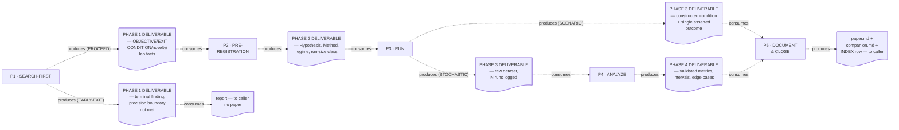

# Experimenter — Quasi-Software View (five layers: NODES, PHASES, INTERNAL, PARALLELIZATION, EXPECTED OUTPUTS)

This is `grimorio.experimenter`'s own DRAWN quasi-software design view, produced per
ref:skill/grimorio.phase-splitting#the-agent-design-plans-drawn-view--a-hard-requirement-never-optional's
standing requirement, and saved alongside the agent's own phase chain
(`.claude/skills/grimorio.experiment-method/experimenter-phases/`), per that same section's own "ALWAYS SAVE
the view alongside the agent's own design, as a reference file" rule. This file EXTENDS the six already-shipped
phase-chain files — Phase 0 (ref:skill/grimorio.experiment-method/experimenter-behavior.md) and Phase 1 through
Phase 5 (`.claude/skills/grimorio.experiment-method/experimenter-phases/phase-1-search-first.md` through
`phase-5-document-and-close.md`) — this file draws their consequences and is kept in lockstep with whatever
they actually say; it never invents or re-authors content independently of them, so any later fix to one of
the five phase files is reflected here in the same pass, never left stale.

Same class of artifact as
`ref:skill/grimorio.agent-writing/prompt-writer-phases/prompt-writer-quasi-software-view.md`,
`ref:skill/grimorio.agent-writing/system-keeper-phases/system-keeper-quasi-software-view.md`, and
`ref:skill/grimorio.ux-memory/ux-phases/ux-quasi-software-view.md` — this file mirrors their shape (the same
five-layer split, the same "at a glance" summary near the top, the same DFD grounding paragraph pattern for the
INTERNAL layer), SCALED to this agent's own 5 phases — much lighter than `system-keeper`'s 7, no extra weight
manufactured to match that precedent's own scale. Two of the five phases (PRE-REGISTRATION, ANALYZE) carry a
FINGERPRINT-gated hard hand-off, matching `grimorio.security-memory/security-phases/`'s own shape; SEARCH-FIRST
and DOCUMENT & CLOSE carry a genuine branching hand-off matching `grimorio.ux-memory/ux-phases/`'s own shape —
**both together**, per phase file, never one exemplar's shape picked exclusively over the other for this chain.

## The five layers, at a glance, and where each is drawn

NODES (the orchestration graph) is EMPTY here, by construction — see "The GRAPH layer is empty by construction"
below — so what the first diagram actually draws is PHASES (the state machine) with LOOP folded in as detail
on the spine (there is no back-edge in this chain at all — see its own section below). INTERNAL (each phase's
own artifact-flow IN→OUT, half (a)) gets its own, second diagram, immediately after, for the same DFD
process-vs-flow separation the other three precedents already apply. PARALLELIZATION is prose, not a diagram —
there is structurally nothing to draw. EXPECTED OUTPUTS is a table, immediately below its own section.

## The diagram — Layers 1+2 (NODES, empty, and PHASES)

```mermaid
flowchart TB
    P1["P1 · SEARCH-FIRST"] -->|"PROCEED — precision<br/>boundary met, gated by<br/>FINGERPRINT check"| P2["P2 · PRE-<br/>REGISTRATION"]
    P2 -->|"gated by FINGERPRINT<br/>check — anti-HARKing gate"| P3["P3 · RUN"]
    P3 -->|"STOCHASTIC regime"| P4["P4 · ANALYZE"]
    P3 -.->|"SCENARIO regime — nothing<br/>to analyze beyond the<br/>asserted outcome"| P5["P5 · DOCUMENT &<br/>CLOSE (terminal)"]
    P4 -->|"gated by FINGERPRINT<br/>check"| P5

    P1 -.->|"EARLY-EXIT — precision<br/>boundary NOT met, no run,<br/>no paper"| EARLYEXIT(["report to caller<br/>directly — no Phase 2-5"])

    classDef exit fill:#2a2a3a,stroke:#668,stroke-dasharray: 3 3
    class EARLYEXIT exit
```

**Reading this diagram.** The solid rectangular spine (P1→P2→P3→P4→P5) is the STATE MACHINE. Three of its four
forward edges — P1→P2, P2→P3, P4→P5 — are FINGERPRINT-gated: that phase's own Hard hand-off writes its filled
DELIVERABLE to disk and runs `node scripts/check-phase-fingerprint.mjs` against it, per
import:skill/grimorio.phase-splitting/project.fingerprint-gate.md, looping back to fix-then-rerun on a FAIL
instead of letting the edge fire on an unverified block — never a trust-based transition. P3→P4 carries no
FINGERPRINT (Phase 3's own LOAD (JIT) section declares none) and fires as a plain, unguarded regime branch. The
dashed P3→P5 edge is the SAME regime branch's OTHER arm — a genuine skip, not a loop-back, taken when Phase 2
decided SCENARIO instead of STOCHASTIC. The dashed P1→EARLYEXIT edge is this chain's ONLY early-termination
path — distinct from the regime branch, drawn with its own dashed style per this file's own visual convention
for a non-forward edge. **NEVER read the P1→P2 edge's own FINGERPRINT gate as also covering the EARLYEXIT
edge** — Phase 1's own OBJECTIVE/EXIT CONDITION fields are explicitly "N/A, EARLY-EXIT" on that path (per
Phase 1's own DELIVERABLE template), so there is nothing for the gate to check on that edge, and Phase 1's own
Hard hand-off correctly wires the gate ONLY on the PROCEED branch, never on both.

## There is no repeating back-edge in this chain — and why

**WHEN a reader expects a repeating back-edge in this diagram ⟶ read this section, not the absence, as the
answer: this chain has none, by design, not by omission.** Nothing in this chain re-runs an earlier phase
against a fresh input — a HARKing attempt (changing the hypothesis after seeing data) is not a loop-back, it is
"a NEW experiment, logged as such" (Phase 2's own step 3) — a fresh Phase 0 invocation, never a re-entry into
this same chain's own P2 node. The three non-forward edges in the diagram above are the SCENARIO skip and the
EARLY-EXIT termination, both forward or terminal, never a LOOP-layer back-edge.

## The GRAPH layer is empty by construction

**NEVER read the empty GRAPH layer above as an unfinished section.** No `Agent` tool appears in
`grimorio.experimenter`'s own shell `tools:` line (confirmed by reading its frontmatter directly for this
view: `Bash, Glob, Grep, Read, Edit, Write, TodoWrite, WebFetch, WebSearch, NotebookEdit`), and every one of the
five phase files states the same fact explicitly in its own Step 1: "this agent never invokes another agent, in
any phase, ever." Zero agent-nodes is therefore the correct, complete rendering of this chain's GRAPH layer.

**NEVER add an agent-node for `grimorio.game-architect`, the CEO, or the automatic invocation trigger to this
diagram.** Whoever invokes `grimorio.experimenter` is this agent's own PARENT — per Phase 0's own
LOOP+RELATIONSHIPS section — never a child this chain spawns or leans on, so it appears in Phase 0's own prose
only, never as a node in the diagram itself.

## Layer 3 — INTERNAL: per-phase artifact-flow (IN → OUT)

**Grounding — shared across every quasi-view that draws this layer, extracted once, not restated here:**
ref:skill/grimorio.phase-splitting/project.quasi-view-requirements.md#half-a--boundary-artifact-flow-unchanged.

**Design choice, stated rather than left implicit: ONE artifact node per phase BOUNDARY, EXCEPT the P1
boundary and the P3 boundary, which each deliberately carry TWO** — the same choice the `ux-memory` precedent
already applies to its own P1 boundary, extended here for the same reason named explicitly: P1's own
DELIVERABLE shape genuinely differs branch to branch (a full OBJECTIVE/EXIT CONDITION/novelty-check block on
PROCEED vs an "N/A, EARLY-EXIT" terminal finding on the other), and P3's own RAW DATA LOGGED differs by regime
(a SCENARIO's single asserted outcome vs a STOCHASTIC run's full dataset feeding a genuinely different next
consumer) — drawing one artifact at either boundary would misrepresent two genuinely different hand-offs as
one. P2↔P3 and P4↔P5 each stay a single artifact — neither phase's own DELIVERABLE shape varies by branch.

The dotted edges here are the same visual convention as Layer 1+2's non-forward edges (dashed, distinct from a
solid forward spine) but carry a DIFFERENT meaning — "consumes"/"produces" (data moving), never a phase
transition trigger (control moving).

### Half (b) — per-phase interior behavior + KNOWN-ERRORS-TO-PHASE mapping

Half (a) above answers only "what crosses each boundary" — it says nothing about what a phase DOES to earn
that hand-off. Per
ref:skill/grimorio.phase-splitting/project.quasi-view-requirements.md#half-b--per-phase-interior-behavior-new's
own FORM mandate, this section closes that gap with FIVE per-phase mermaid flowcharts, drawn FROM the five
phase files actually written this pass, never invented or summarized generically.

**P1 · SEARCH-FIRST**

```mermaid
flowchart TB
    A1["Step 1 — state the graph:<br/>single SELF (read brief, read<br/>method, read index/prior<br/>papers); no spawn"] --> A2{"Step 2 — precision boundary<br/>met (a real design HYPOTHESIS<br/>is being settled by a run)?"}
    A2 -->|"NO"| AEXIT(["terminal: EARLY-EXIT — no<br/>paper, report to caller<br/>directly, skip Steps 3-7"])
    A2 -->|"YES"| A3["Step 3 — state OBJECTIVE<br/>(verbatim) + EXIT CONDITION"]
    A3 --> A4["Step 4 — read project.md<br/>IN FULL (lab, paths, index,<br/>bars, invocation trigger)"]
    A4 --> A5["Step 5 — read INDEX.md,<br/>check novelty (already<br/>recorded? extend, don't<br/>re-run)"]
    A5 --> A6["Step 6 — read any signed<br/>design doc under test"]
    A6 --> A7["Step 7 — confirm CHILDREN:<br/>this agent never spawns"]
    A7 --> APROCEED(["terminal: PROCEED — carries<br/>OBJECTIVE/EXIT CONDITION/<br/>novelty/lab facts, gated by<br/>FINGERPRINT, → Phase 2"])

    classDef exit fill:#2a2a3a,stroke:#668,stroke-dasharray: 3 3
    class AEXIT,APROCEED exit
```

**P2 · PRE-REGISTRATION**

```mermaid
flowchart TB
    B1["Step 1 — state the graph:<br/>single SELF; no spawn"] --> B2["Step 2 — hypothesis-<br/>authorship handoff: sharpen<br/>game-architect's [H] number<br/>or the CEO's — never invent<br/>the design you then validate"]
    B2 --> B3["Step 3 — PRE-REGISTER:<br/>write Hypothesis + Method<br/>FIRST (IV, controls, seeds,<br/>skill levels, N) — blocks<br/>HARKing"]
    B3 --> B4{"Step 4 — harness supplies<br/>the axes the method<br/>demands (decision-seed,<br/>≥2 competence tiers)?"}
    B4 -->|"axis missing"| B4a["flag the confound in the<br/>paper's Method section,<br/>lower confidence"]
    B4 -->|"axes present"| B4b["no confound to flag"]
    B4a --> B5
    B4b --> B5
    B5{"Step 5 — regime decision<br/>(SCENARIO-FIRST doctrine)"}
    B5 -->|"mechanic does what<br/>intended — short-horizon<br/>behavioral claim"| B5a["SCENARIO"]
    B5 -->|"design/balance claim —<br/>a lever, a fairness number,<br/>a ship gate"| B5b["STOCHASTIC"]
    B5a --> B6
    B5b --> B6
    B6{"Step 6 — N-size<br/>classification"}
    B6 -->|"reliability/effect-size<br/>claim"| B6a["statistical claim —<br/>earns the full grid"]
    B6 -->|"ceiling/break-point<br/>picture"| B6b["characterization —<br/>a few representative runs"]
    B6a --> BEXIT(["terminal: carries<br/>Hypothesis/Method/regime/<br/>run-size, gated by<br/>FINGERPRINT, → Phase 3"])
    B6b --> BEXIT

    classDef exit fill:#2a2a3a,stroke:#668,stroke-dasharray: 3 3
    class BEXIT exit
```

**P3 · RUN**

```mermaid
flowchart TB
    C1["Step 1 — state the graph:<br/>single SELF — RUN the sim;<br/>restate CHILDREN (background<br/>execution is NOT fan-out)"] --> C2["Step 2 — code boundary:<br/>instrument code only<br/>(probe/analysis/lab-config)<br/>— never the mechanic under<br/>test"]
    C2 --> C3{"Step 3 — this run touches<br/>production code?"}
    C3 -->|"YES"| C3a["worktree isolation"]
    C3 -->|"NO — pure documentation<br/>/ read-only"| C3b["no worktree needed"]
    C3a --> C4
    C3b --> C4
    C4{"Step 4 — needs a real<br/>LLM call?"}
    C4 -->|"YES"| C4a["use DeepSeek — never<br/>OpenRouter free-tier"]
    C4 -->|"NO"| C4b["N/A"]
    C4a --> C5
    C4b --> C5
    C5{"Step 5 — regime carried<br/>from Phase 2"}
    C5 -->|"SCENARIO"| C5a["construct the condition,<br/>run ONCE byte-exact,<br/>assert the outcome — no<br/>seeds, no N"]
    C5 -->|"STOCHASTIC"| C5b["run sized for power;<br/>background execution if<br/>long, resume on own<br/>completion — NEVER shrink<br/>N to fit a turn"]
    C5a --> C6
    C5b --> C6
    C6["Step 6 — log the raw<br/>output either way"] --> C7{"regime?"}
    C7 -->|"SCENARIO"| CEXITS(["terminal: → Phase 5<br/>directly, skip Phase 4"])
    C7 -->|"STOCHASTIC"| CEXITT(["terminal: → Phase 4"])

    classDef exit fill:#2a2a3a,stroke:#668,stroke-dasharray: 3 3
    class CEXITS,CEXITT exit
```

**P4 · ANALYZE (STOCHASTIC-only)**

```mermaid
flowchart TB
    D1["Step 1 — state the graph:<br/>single SELF — analyze the<br/>raw data; no spawn. Never<br/>fires for a SCENARIO run"] --> D2["Step 2 — ANALYZE with real<br/>inference: Wilson intervals,<br/>multiple-comparisons<br/>correction, minimum<br/>detectable effect, grounded<br/>metrics vs targets, guard<br/>the three failure modes"]
    D2 --> D3{"Step 3 — Phase 2 flagged a<br/>confound?"}
    D3 -->|"YES"| D3a["confirm confidence is<br/>lowered — never launder<br/>it away"]
    D3 -->|"NO"| D3b["N/A"]
    D3a --> D4
    D3b --> D4
    D4["Step 4 — enumerate EDGE<br/>CASES and resolve each<br/>(required section)"] --> D5["Step 5 — check every<br/>metric against project's<br/>own acceptance bars, where<br/>the hypothesis touches<br/>them"]
    D5 --> DEXIT(["terminal: carries every<br/>metric/interval/edge-case,<br/>gated by FINGERPRINT,<br/>→ Phase 5"])

    classDef exit fill:#2a2a3a,stroke:#668,stroke-dasharray: 3 3
    class DEXIT exit
```

**P5 · DOCUMENT & CLOSE (terminal)**

```mermaid
flowchart TB
    E1["Step 1 — state the graph:<br/>single SELF, terminal; no<br/>spawn"] --> E2{"Step 2 — regime this run<br/>arrived under?"}
    E2 -->|"STOCHASTIC — arrived<br/>via Phase 4"| E2a["Phase 4 already resolved<br/>edge cases — write them<br/>into the paper as-is, do<br/>NOT re-derive"]
    E2 -->|"SCENARIO — arrived<br/>directly from Phase 3"| E2b["FIRST and ONLY place edge<br/>cases are enumerated:<br/>against the constructed<br/>condition + asserted<br/>outcome — enumerate +<br/>resolve now"]
    E2a --> E3["Step 3 — write the full<br/>PAPER (Title, Hypothesis,<br/>Method incl. regime, Data,<br/>Metrics, Edge cases from<br/>step 2, Results, Repro,<br/>Conclusion) — final-state<br/>only, every unproven number<br/>[H]"]
    E2b --> E3
    E3 --> E4{"Step 4 — paper-home<br/>decided?"}
    E4 -->|"still genuinely<br/>undecided"| E4a["surface the FLAGGED GAP<br/>explicitly — NEVER recreate<br/>a root experiments/ folder"]
    E4 -->|"home confirmed"| E4b["write to the confirmed<br/>home"]
    E4a --> E5
    E4b --> E5
    E5["Step 5 — write the<br/>DIGESTIBLE COMPANION (what<br/>we asked, what we found,<br/>what it means, ~1 page, no<br/>jargon)"] --> E6["Step 6 — update INDEX.md<br/>(one row: slug, question,<br/>verdict, date-run)"]
    E6 --> E7["Step 7 — return the<br/>handoff verdict; flag a<br/>game-architect label flip<br/>if applicable"]
    E7 --> E8{"Step 8 — close shape"}
    E8 -->|"paper+companion written,<br/>INDEX updated, fate stated<br/>with evidence"| E8a["VERIFIED"]
    E8 -->|"harness can't meet method,<br/>or the run itself failed"| E8b["COULD NOT — name blocker,<br/>escalate"]
    E8a --> E9
    E8b --> E9
    E9["Step 9 — report faithfully:<br/>null/refuted/didn't-move<br/>results in full, in BOTH<br/>docs — never Goodhart,<br/>never an autopilot"] --> TERM(["CLOSE — terminal, no<br/>Phase 6, gated by<br/>FINGERPRINT at the close<br/>itself"])

    classDef exit fill:#2a2a3a,stroke:#668,stroke-dasharray: 3 3
    class TERM exit
```

**Table — KNOWN-ERRORS-TO-PHASE mapping.**

| # | Known error / incident | Addressed by |
|---|---|---|
| 1 | HARKing (hypothesizing after results are known) — changing the hypothesis after seeing data | P2 step 3 (PRE-REGISTER: Hypothesis + Method written BEFORE any number exists, gated mechanically on the P2→P3 edge) |
| 2 | N shrunk to fit a turn — "trades validity for latency" (the H1/H3 failure) | P3 step 5 (STOCHASTIC branch: "NEVER shrink N to fit a turn") |
| 3 | Goodhart (metrics get gamed), determinism-replays-the-same-game, one-skill-level-lies — the three failure modes | P4 step 2 (guard all three against the FULL dataset; determinism-replay already guarded once, narrowly, at P3 step 5's own STOCHASTIC-branch execution — the regime branch that actually runs the pre-registered seeds, the one Phase 3's own narrow LOAD of failure mode 2 governs) |
| 4 | The canonical false-"lever-found" trap — a sweep over k settings surfaces a spurious "significant" result with no multiple-comparisons correction | P4 step 2 (multiple-comparisons correction, mandatory whenever the experiment sweeps) |
| 5 | The CEO's cost-ruling: "an insane amount of experiments for the little you get" — over-experimenting past what the question needs | P2 step 6 (RUN-SIZE CLASSIFICATION: statistical claim vs characterization, sized to the question) |
| 6 | The auto-invocation precision boundary — a QA smoke run, a one-off sanity run, or a build check must never trigger a paper | P1 step 2 (the ONLY phase this chain checks it at, terminal EARLY-EXIT if unmet) |
| 7 | The deleted-`experiments/`-folder gap — no confirmed new home for a paper, and NEVER recreate the root folder | P5 step 4 (surface the FLAGGED GAP explicitly every time, read live, never assumed resolved) |

No further corpus-wide known error was found to plausibly apply to this agent's own kind of work beyond the
seven above — searched against this corpus's own named spawn/tiering/backgrounding incidents (the parked-agent
incident, the registration-cost-threshold incident); none of them apply, since no `Agent` tool forecloses all
of them structurally (see PARALLELIZATION below), and this table is not padded with a row that does not
genuinely apply.

## Layer 4 — PARALLELIZATION: this chain's own work is entirely sequential, N/A by construction

**Finding, stated plainly: no fork/join bar belongs anywhere in this diagram, and for a STRONGER reason than
"no stated alternative" — it is structurally impossible, not merely undesired.** No `Agent` tool appears in
this agent's own shell, confirmed above under "The GRAPH layer is empty by construction": this chain cannot
invoke ANYTHING, ever, in any phase, so there is no second running thing it could ever run concurrently with. A
long STOCHASTIC background execution (Phase 3 step 5) is this agent's OWN computation resuming on ITS OWN
completion — never a second agent running in parallel — the exact distinction Phase 3's own step 1 draws
explicitly, restated here because it is the one place in this chain most likely to be mistaken for genuine
parallelism.

## Layer 5 — EXPECTED OUTPUTS: WORK vs ORCHESTRATION, per phase

**P5 is a genuine exception to the WORK-vs-ORCHESTRATION split, named explicitly rather than force-fitted:**
this chain has no phase after P5 — P5 IS the terminal work-product itself (the actual `paper.md` +
`companion.md` reaching the caller), not a pure coordination act with nothing of its own to show.

| Phase | WORK PRODUCT (what the phase's own action produces) | ORCHESTRATION ACT (what it then routes, and to whom) |
|---|---|---|
| P1 · SEARCH-FIRST | The stated OBJECTIVE/EXIT CONDITION, the novelty check against INDEX.md, the project lab facts carried forward — OR, on the other branch, the single terminal EARLY-EXIT finding — established FACTS, no hypothesis judgment applied yet | Routes to P2 on PROCEED (FINGERPRINT-gated), or terminates straight to the caller on EARLY-EXIT — no paper either way at this phase |
| P2 · PRE-REGISTRATION | The actual anti-HARKing commitment: Hypothesis + Method, written BEFORE any data exists, plus the regime decision and the run-size classification | Hands the committed plan to P3 (FINGERPRINT-gated) — this IS the gate that makes Phase 3 "forbidden to start" without it real |
| P3 · RUN | The raw executed data — a single byte-exact SCENARIO outcome, or a full STOCHASTIC dataset logged from N runs, never shrunk to fit a turn | Branches to P4 on STOCHASTIC, or skips straight to P5 on SCENARIO — the ONE ungated edge in this chain's own forward spine |
| P4 · ANALYZE | The validated inferential result: Wilson intervals, the multiple-comparisons correction, the grounded metrics vs targets, the resolved edge cases, the failure-mode guard | Hands the complete, validated analysis to P5 (FINGERPRINT-gated) — never re-derived there |
| P5 · DOCUMENT & CLOSE | The durable record itself: `paper.md`, `companion.md`, the updated INDEX row, PLUS the resolved edge cases — carried forward from Phase 4 for STOCHASTIC, or enumerated here for the first and only time for SCENARIO — terminal work-product, not a coordination act (no P6 to route to) | Hands the finished record + verdict to the caller (FINGERPRINT-gated at the close itself, per the terminal-gate pattern) |

## RENDER / GROUP / MEASURE — the actual counts rendered while authoring the five phase files

Per ref:skill/grimorio.phase-splitting/project.quasi-view-requirements.md#evidence-of-phase-design-reasoning--save-the-rendergroupmeasure-working-product-never-discard-it-silently's
own requirement — counts taken from the phase files as actually written this pass, not invented:

**RENDER** (every distinct step/decision rendered, per phase): P1 = 7 numbered steps (1-7), 1 carrying a
WHEN-branch (step 2: the precision boundary — the chain's only terminal EARLY-EXIT). P2 = 6 numbered steps
(1-6), 3 carrying a branch (step 4: confound flag; step 5: the regime decision; step 6: the N-size
classification). P3 = 6 numbered steps (1-6), 3 carrying a branch (step 3: production-code isolation; step 4:
DeepSeek-vs-N/A; step 5: the regime branch, inherited from Phase 2's own decision, that also decides this
phase's own terminal edge). P4 = 5 numbered steps (1-5), 1 carrying a branch (step 3: the confound-confidence
check). P5 = 9 numbered steps (1-9), 3 carrying a branch (step 2: the STOCHASTIC-vs-SCENARIO edge-case
handling, added so edge-case enumeration has a path on both regimes; step 4: the paper-home gap; step 8: the
VERIFIED / COULD NOT close shape).

**GROUP**: each phase's own grouping is CONTENT-SPEC's own explicit reasoning, carried here rather than
re-derived — P2 is "kept as ONE phase, confirmed NOT a pincho by system-keeper's own Phase 2 refutation of
verdict-conclusion C6": the hypothesis-authorship handoff, the pre-registration itself, the harness-capability
check, and the regime/N-size decisions are one coherent pre-flight commitment, never separable without breaking
the anti-HARKing gate they jointly constitute. P4 is "kept as ONE mission... edge-case enumeration folded in,
same what-does-the-data-show mission, not a bolted-on review" — real inference and edge-case enumeration both
answer the same question against the same dataset, for the STOCHASTIC regime this phase owns. P5 is "kept as
ONE mission... package the finding, never fragmented into four separate phases" — the paper, the companion, the
index update, and the close are one "package and report" act, sharing the same input (Phase 4's or Phase 3's
own output) and the same terminal consumer (the caller); the added edge-case step (step 2, this rework's own
fix) stays inside that same mission rather than becoming a fifth fragment, because on the SCENARIO arm it is
nothing more than the last piece of "packaging" the constructed condition + asserted outcome Phase 3 already
handed forward — never a second analysis phase in disguise. P1 groups the precision-boundary GATE with the rest of SEARCH-FIRST's own gathering
(project facts, novelty check, prior design docs) because the gate itself needs nothing SEARCH-FIRST hasn't
already read by the time it fires — splitting it into its own phase would isolate one WHEN-branch from the
facts it is a branch over. P3 groups the code boundary, the isolation/LLM-provider checks, and the actual
execution because all four are preconditions-then-action for the SAME single act (running the sim) — none of
them stands alone as its own mission.

**MEASURE**: P1=7, P2=6, P3=6, P4=5, P5=9 (33 steps total across the chain). No PINCHO: the largest phase (P5,
9 steps) is roughly proportional to its own JIT load (writing two documents plus an index update plus a
two-shape close, plus the one added edge-case-handling step), never several times a sibling's own load the way
the corpus's own worked pincho incident describes (~28 requirements in one phase) — the spread here (5 to 9) is
well under 2×.

**SPLIT**: not triggered — no phase above required splitting.
