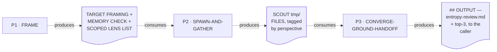

# Devil's Advocate — Quasi-Software View (five layers: NODES, PHASES, INTERNAL, PARALLELIZATION, EXPECTED OUTPUTS)

This is `grimorio.entropy`'s own DRAWN quasi-software design view, produced per
ref:skill/grimorio.phase-splitting#the-agent-design-plans-drawn-view--a-hard-requirement-never-optional's
standing requirement that every agent-design plan carry one, saved alongside the agent's own design as a
reference file. It mirrors
ref:skill/grimorio.fan-out/researcher-phases/researcher-quasi-software-view.md's own already-shipped,
already-approved three-phase shape — read in full as this file's own structural exemplar, never as its content
— the closest precedent for the SAME orchestrator archetype: a homogeneous `grimorio.scout` panel spawned to
gather independent perspectives/slices, then converged by the orchestrator itself. This file draws all layers
directly from ref:skill/grimorio.fan-out/entropy-behavior.md and its three
ref:skill/grimorio.fan-out/entropy-phases/phase-1-frame.md,
ref:skill/grimorio.fan-out/entropy-phases/phase-2-spawn-and-gather.md, and
ref:skill/grimorio.fan-out/entropy-phases/phase-3-converge-ground-handoff.md, all read/authored in full THIS
pass, in the same authoring dispatch that wrote them; it changes none of their content.

## Layer 1 + 2 — NODES (the orchestration graph) and PHASES (the state machine)

```mermaid
flowchart TB
    P1["P1 · FRAME"] -->|"EXIT: PHASE 1 DELIVERABLE filled<br/>+ fingerprint-gate PASS"| P2["P2 · SPAWN-AND-<br/>GATHER"]

    SCOUT(("N× agent:<br/>grimorio.scout<br/>(tiered, one<br/>per scoped lens)"))
    P2 -->|"fan out, foreground,<br/>synchronous, ONE<br/>message"| SCOUT
    SCOUT -->|"grounded tmp/<br/>file per lens"| P3["P3 · CONVERGE-<br/>GROUND-HANDOFF<br/>(terminal)"]

    style SCOUT fill:#2a3a2a,stroke:#5a5
```

**Reading this diagram.** The solid rectangular spine (P1→P2→P3) is the STATE MACHINE — the three phase files'
own chain, per
ref:skill/grimorio.phase-splitting#the-model--a-phase-is-a-mini-loop-state-with-three-fields. This chain carries
NO loop-back edge and NO short-circuit edge — unlike `grimorio.researcher`'s own chain (which carries a
SINGLE-SLICE COLLAPSE short-circuit inside P2), nothing in entropy's own three phase files ever skips a phase's
spawn sub-step: even a target that scopes down to a single lens (Phase 1's own SCOPED LENS LIST) still gets that
ONE lens raised as its own independent, uncontaminated `grimorio.scout` in Phase 2 — entropy's whole reason to
fan out at all is that a lens executed by entropy itself, in its own context, would contaminate the panel with
entropy's own vantage point, which is exactly the failure the panel exists to avoid regardless of panel size.
This is a genuine design difference from researcher, stated here rather than papered over by copying
researcher's own collapse mechanic where it does not apply.

The one circular agent-node, `SCOUT`, is the GRAPH layer's own contribution — per
ref:skill/grimorio.loop-and-graph#3-the-graph--who-is-in-it-and-the-branch-rule — drawn in a shape visually
distinct from the three rectangular phase-nodes, the same convention
ref:skill/grimorio.agent-writing/system-keeper-phases/system-keeper-quasi-software-view.md and researcher's own
quasi-view already establish, so a reader tells a phase from a spawned agent at a glance, with no legend doing
that work. `SCOUT` represents N independent instances (one per scoped lens), never one fixed spawn — Phase 2's
own step 3 states plainly it is the ONLY agent type ever spawned here (hard-locked non-recursive,
`disallowedTools: Agent`, one level deep, no runaway).

**No future/not-wired agent-node belongs in this graph — N/A, not invented.** A full read of all three phase
files plus Phase 0 surfaced no language naming an agent this chain MAY one day lean on but does not currently
spawn — `SCOUT` is the only agent-node this chain ever raises.

**A tested-and-rejected 4th phase, named here rather than left silent.** grimorio.system-keeper's own diagnosis
tested a 4th candidate phase — a stand-alone HAND-OFF phase, separate from CONVERGE-GROUND-HANDOFF — and this
diagram deliberately does NOT draw it: it fails the phase-boundary judgment test on both DELIVERABLE (no new
artifact beyond the already-ranked list CONVERGE-GROUND-HANDOFF produces) and KNOWLEDGE (no skill/reference
beyond what CONVERGE-GROUND-HANDOFF already holds) — Phase 3's own step 5 performs the routing act directly
against the SAME ranked list its own step 3 just produced, inside the same phase, matching
ref:skill/grimorio.phase-splitting#the-phase-boundary-judgment-test--judgment-never-an-algorithm's own
"never force a phase chain onto a task that has no real distinct question/deliverable/knowledge per phase" rule.

## Layer 3 — INTERNAL: per-phase artifact-flow (IN → OUT), half (a) only

**Grounding — shared across every quasi-view that draws this layer, not re-derived here:**
ref:skill/grimorio.phase-splitting/project.quasi-view-requirements.md#half-a--boundary-artifact-flow-unchanged.
Per this pass's own explicit scope, only half (a) (boundary artifact-flow) is drawn for this chain — half (b)
(per-phase interior flowcharts + a KNOWN-ERRORS-TO-PHASE mapping) is optional per that same file and out of
scope for this pass, exactly as it remains for
ref:skill/grimorio.fan-out/researcher-phases/researcher-quasi-software-view.md today.

**One artifact node per phase BOUNDARY, never two.** A three-phase chain has two internal boundaries
(P1↔P2, P2↔P3) plus the terminal phase's own output reaching the caller — three artifact nodes total, never one
IN/OUT pair per phase individually: each phase's own Hard hand-off text already names Phase N's OUT as the
exact content Phase N+1 consumes as its IN.

The dotted edges here are the SAME visual convention as a loop/short-circuit edge would be in Layer 1+2 (dashed,
distinct from a solid forward edge) but carry a DIFFERENT meaning — "consumes"/"produces" (data moving), never
"EXIT"/collapse (control moving) — the identical DFD process-vs-flow separation
ref:skill/grimorio.agent-writing/system-keeper-phases/system-keeper-quasi-software-view.md and researcher's own
Layer 3 already apply, now applied to this chain.

**What this diagram deliberately omits, and why.** The P1 DELIVERABLE also names an OBJECTIVE and EXIT
CONDITION field, carried forward through every later phase's own DELIVERABLE — this diagram does not draw a
separate artifact node for those fields crossing every boundary, because Layer 3's own convention is not to
over-fragment: OBJECTIVE/EXIT CONDITION rides along inside the SAME DELIVERABLE artifact already drawn at each
boundary, never a second node duplicating what the first already carries forward.

## Layer 4 — PARALLELIZATION: sequential chain, ONE genuine internal fan-out

**This chain is sequential end to end at the STATE MACHINE level — P1 → P2 → P3, never two phases running
concurrently.** The one place real parallelism exists is INSIDE P2's own SPAWN-AND-GATHER node: Phase 2's own
step 7 raises N scouts — one per Phase 1's own scoped lens — in ONE message, foreground, synchronous
(`run_in_background: false`), and blocks until every one returns. This is genuine N-way parallel dispatch, not a
sequence of one-at-a-time spawns: **this is the ONE real parallel fan-out in this whole chain**, named here
explicitly rather than left for a reader to infer from the SCOUT node's own multiplicity in Layer 1+2. Every
scout in the panel runs against its own lens independently — no scout reads another's output, no scout blocks
on another — and P2 does not proceed to Phase 3 until ALL of them have returned in the SAME turn (P2's own step
7: "you would never converge, a real observed failure, never a hypothetical one").

No other node in this chain carries a parallelism question of its own: P1 and P3 are both single SELF nodes by
their own step 1 (no spawn, ever). Unlike researcher's own P2, entropy's own P2 carries no mutually-exclusive
branch of its own — every pass fans out to at least one scout, per Layer 1+2's own note above; there is no
self-gather alternative path to weigh against the panel spawn.

## Layer 5 — EXPECTED OUTPUTS: WORK vs ORCHESTRATION, per phase

**The distinction this layer draws, kept separate from Layer 3 above: Layer 3 shows the DATA that crosses a
phase boundary — what the next phase literally reads. This layer shows the RESULT that phase's own WORK exists
to produce.**

| Phase | WORK PRODUCT (what the phase's own action produces) | ORCHESTRATION ACT (what it then routes, and to whom) |
|---|---|---|
| P1 · FRAME | The stated OBJECTIVE/EXIT CONDITION, the TARGET FRAMING (plan/design/decision + goal + real end user), the MEMORY CHECK (what po-memory/architect-memory/ux-memory already settled), and the SCOPED LENS LIST — a framing/scoping judgment, no gathering yet | Hands the framing + scoped lens list to P2 unmodified |
| P2 · SPAWN-AND-GATHER | N scouts' own grounded `tmp/` files, one per scoped lens — this phase's own work-product is largely COORDINATION (brief-building, tiering, contract-matching per agent-selection), not authored prose of its own | Spawns the scout panel (foreground, synchronous, genuinely parallel per Layer 4); hands the tagged tmp/ files to P3 |
| P3 · CONVERGE-GROUND-HANDOFF | The actual reasoning work of this whole chain: the prior-art check, the merged/grounded/ranked blind-spots (blocking vs worth-considering), and the routing call per finding | Terminal — writes `entropy-review.md` and reports the finished `## OUTPUT` block to the caller; no further phase to hand off to |

## Evidence of phase-design reasoning — the RENDER/GROUP/MEASURE working product, saved

Per
ref:skill/grimorio.phase-splitting/project.quasi-view-requirements.md#evidence-of-phase-design-reasoning--save-the-rendergroupmeasure-working-product-never-discard-it-silently,
this section saves, as a durable artifact rather than a claim taken on faith, the sizing reasoning applied while
converting entropy from a flat file into this three-phase chain.

**RENDER — the complete load, before any grouping.** The pre-split behavior file (97 measured lines, one flat
node, `## Core rules` + a 6-step `## Steps` list + `## OUTPUT` + `## Self-check` + `## Rules`) plus its shell's
own 8-entry flat Knowledge list — `grimorio.agent-selection`, `grimorio.reasoning-principles`,
`grimorio.flow-delegation`, `grimorio.working-memory`, `grimorio.research-capture`, `grimorio.fan-out`,
`grimorio.agent-tiers`, and the domain canon (`grimorio.ux-memory` → Design Canon + `grimorio.security-memory`)
— every one of those 8 loaded on EVERY invocation regardless of which of the three real stages (framing,
delegating, converging) actually needed it.

**Two further items, beyond the original 8, disclosed here as a deliberate scope addition — not part of the
original flat file.** `grimorio.po-memory` and `grimorio.architect-memory` — Phase 1's own step 4 SEARCH-FIRST
memory check (ref:skill/grimorio.fan-out/entropy-phases/phase-1-frame.md's own LOAD section) needs both to check
what the relevant memory skills already settled about the target before the panel is scoped; neither one was
ever in the original flat file's 8-entry Knowledge list. This mirrors, and is flagged the same way as, the
`grimorio.agent-selection` addition to P2 documented a few lines below — a genuine addition this authoring pass
made to close a real gap, never silently folded into the original count.

**GROUP — three clusters, measured live against the actually-authored phase files, not estimated.**
1. FRAME (P1) — needs 5 of the 10: `grimorio.reasoning-principles` (the objective/exit-condition contract),
   `grimorio.working-memory` (staging the framing note), plus the two NEW items disclosed above —
   `grimorio.po-memory` and `grimorio.architect-memory` (Phase 1's own step 4 SEARCH-FIRST memory check) — plus a
   SECOND, dual-use of `grimorio.ux-memory`'s own `project.md`, for the SAME SEARCH-FIRST check: not a new item —
   ux-memory was already counted once in the original 8, as part of the domain canon bundle Group 2 needs — but
   a newly-disclosed second USE of it, distinct from that domain-canon use (its Design Canon, loaded separately
   in Phase 2). Zero of `grimorio.agent-selection`, `grimorio.flow-delegation`, `grimorio.agent-tiers`,
   `grimorio.fan-out`, `grimorio.research-capture`, or the REST of the domain canon (`grimorio.security-memory`,
   and ux-memory's own Design Canon specifically) are needed to decide WHICH lenses apply to a target — none of
   them concern a spawn decision or a gather mechanic, both strictly Phase 2's own question. **This corrects the
   writer-brief's own stated count** ("FRAME needs 0 of the 8") — flagged in this same authoring pass's own
   report to `grimorio.system-keeper`, never silently overridden here without saying so.
2. SPAWN-AND-GATHER (P2) — needs 7 of the 8: `grimorio.agent-selection` (matching `grimorio.scout`'s own
   CONTRACT, added this pass to close a coverage gap the brief's own per-phase LOAD sections had left
   unplaced — also flagged), `grimorio.flow-delegation`, `grimorio.agent-tiers`, `grimorio.fan-out`,
   `grimorio.working-memory` (a second, distinct use from P1's — staging scout tmp/ files, not the framing
   note), `grimorio.research-capture`, and the domain canon (loaded conditionally, per active lens only). Only
   `grimorio.reasoning-principles` (P1's own objective contract, not needed again once the objective is framed)
   is absent from this group.
3. CONVERGE-GROUND-HANDOFF (P3) — needs 0 of the 8. Its own knowledge is the web-grounding discipline (ordinary
   WebSearch/WebFetch, no named skill import exists for it) plus this agent's own `## OUTPUT`/Self-check
   contract — none of the delegation-mechanics skills are needed once every scout has already returned.

**MEASURE — each group against the pincho check, relative to comparably-sized chains already in the corpus.**
None of the three groups measures as a PINCHO: Group 1 (P1) carries 7 steps across
framing/search-first/scoping, comparable to researcher's own P1 · DECOMPOSE-THE-TOPIC (6 steps); Group 2 (P2)
carries 8 steps across contract-matching/tiering/briefing/synchronous-dispatch, comparable to researcher's own
P2 · SPAWN-SCOUTS-PER-SLICE (9 steps) and to `grimorio.system-keeper`'s own mid-sized AUTHORING-COORDINATION
phase; Group 3 (P3) carries 7 steps plus the folded-in 5-item Self-check gate, the full `## OUTPUT` contract,
and the 4-item `## Rules` block, comparable to researcher's own P3 · CONVERGE-AND-CLOSE (5 steps plus its own
Self-check + OUTPUT). **No further split or children-offload needed** — the SPLIT branch of
RENDER/GROUP/MEASURE/SPLIT is not exercised this pass, an honest, considered "clean" result rather than a
default.

**RULE-8 CLASSIFICATION, per phase (ref:skill/grimorio.phase-splitting/project.flow-method.md's own Rule 8(a)-(c)):**
P1 (FRAME) and P2 (SPAWN-AND-GATHER) never write `entropy-review.md` — the chain's own shared deliverable — so
both classify **REPORT-ONLY** relative to that artifact: P1 produces an internal framing/scoping artifact
consumed only by P2, and P2's own scouts write to THEIR OWN separate `tmp/` files, never the shared deliverable,
so independent reads/gathers never conflict. P3 (CONVERGE-GROUND-HANDOFF) is the ONLY phase that writes
`entropy-review.md`, so it classifies **MODIFYING** and stays sequential — matching
`grimorio.system-keeper`'s own Phase 4 (AUTHORING-COORDINATION) worked example exactly. Inside P3, the
prior-art check (step 2), ground-and-rank (step 3), and routing (step 5) are genuinely **DEPENDENT** on each
other's own findings — routing operates directly on the ranked list ground-and-rank produces, and ground-and-rank
needs the prior-art check's own findings folded in — so all three stay together in the SAME phase/node, never
split into separate reviewer phases; this is the same reasoning that already collapsed the tested 4th HAND-OFF
candidate into P3 rather than giving it its own phase (Layer 1+2's own note above).

**Coverage — every rendered item placed, self-disclosed rather than smoothed over.** All 10 items from the
RENDER inventory above — the original 8 plus the two disclosed additions, `grimorio.po-memory` and
`grimorio.architect-memory` — land in at least one of the three groups; none is dropped. Both new items place in
Group 1 (FRAME), alongside `grimorio.reasoning-principles` and `grimorio.working-memory`. `grimorio.working-memory`
appears in both P1's framing-note-staging use and P2's scout-tmp-staging use — two DIFFERENT purposes within the
same skill, never the same knowledge loaded twice for the same reason, the identical pattern researcher's own
quasi-view already documents for `grimorio.reasoning-principles` across its P1/P3. `grimorio.ux-memory` appears
in both P1's SEARCH-FIRST-check use (its own `project.md`) and P2's domain-canon use (its Design Canon) — two
DIFFERENT purposes within the same skill, never double-counted in the 10-item total above, the same dual-use
pattern this paragraph already documents for `grimorio.working-memory`.
