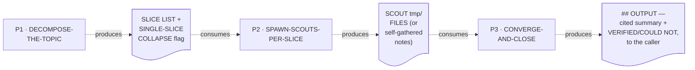

# Convergent Researcher — Quasi-Software View (five layers: NODES, PHASES, INTERNAL, PARALLELIZATION, EXPECTED OUTPUTS)

This is `grimorio.researcher`'s own DRAWN quasi-software design view, produced per
ref:skill/grimorio.phase-splitting#the-agent-design-plans-drawn-view--a-hard-requirement-never-optional's
standing requirement that every agent-design plan carry one, saved alongside the agent's own design as a
reference file. It mirrors
ref:skill/grimorio.agent-writing/system-keeper-phases/system-keeper-quasi-software-view.md#the-five-layers-at-a-glance-and-where-each-is-drawn's
own already-shipped five-layer shape — read in full as this file's own structural exemplar, never as its
content — adapted to a THREE-phase orchestrator chain instead of a seven-phase one. This file draws all layers directly from
ref:skill/grimorio.fan-out/researcher-behavior.md and its three
ref:skill/grimorio.fan-out/researcher-phases/phase-1-decompose-the-topic.md,
ref:skill/grimorio.fan-out/researcher-phases/phase-2-spawn-scouts-per-slice.md, and
ref:skill/grimorio.fan-out/researcher-phases/phase-3-converge-and-close.md, all read in full THIS pass, in the
same authoring dispatch that wrote them; it changes none of their content.

## Layer 1 + 2 — NODES (the orchestration graph) and PHASES (the state machine)

```mermaid
flowchart TB
    P1["P1 · DECOMPOSE-<br/>THE-TOPIC"] -->|"EXIT: PHASE 1 DELIVERABLE filled<br/>+ fingerprint-gate PASS"| P2["P2 · SPAWN-SCOUTS-<br/>PER-SLICE"]

    SCOUT(("N× agent:<br/>grimorio.scout<br/>(tiered, one<br/>per slice)"))
    P2 -->|"WHEN SINGLE-SLICE<br/>COLLAPSE = NO —<br/>fan out, foreground,<br/>synchronous, ONE<br/>message"| SCOUT
    SCOUT -->|"cited tmp/ file<br/>per slice"| P3

    P2 -.->|"WHEN SINGLE-SLICE<br/>COLLAPSE = YES (Phase 1's<br/>own flag) — the SPAWN<br/>sub-node never fires; P2<br/>gathers the one slice<br/>itself, sequentially, and<br/>hands straight to P3"| P3["P3 · CONVERGE-<br/>AND-CLOSE<br/>(terminal)"]

    style SCOUT fill:#2a3a2a,stroke:#5a5
```

**Reading this diagram.** The solid rectangular spine (P1→P2→P3) is the STATE MACHINE — the three phase files'
own chain, per
ref:skill/grimorio.phase-splitting#the-model--a-phase-is-a-mini-loop-state-with-three-fields. This chain carries
no LOOP-BACK edge at all — unlike `grimorio.system-keeper`'s own chain (which loops P5→P4 and P6→P4 on a
defect), nothing in any of these three phase files re-enters an earlier phase; each phase's own Hard hand-off
moves strictly forward, once, per invocation. The one non-linear edge this diagram draws is the dashed
SINGLE-SLICE COLLAPSE edge, and it is NOT a loop-back (it never returns to an earlier phase) — it is a
SHORT-CIRCUIT inside P2's own forward motion, skipping only the SCOUT fan-out, never skipping P2's own file
read: per ref:skill/grimorio.fan-out/researcher-phases/phase-2-spawn-scouts-per-slice.md's own step 1, P2 is
ALWAYS opened and executed as a node on every
pass, collapse or not — the collapse decides only whether ITS OWN internal SPAWN sub-step fires, never whether
the phase itself runs. **A note on a literal reading of this pass's own brief, stated honestly rather than
silently resolved either way:** the brief that produced this file asked for the short-circuit to be drawn "from
Phase 1 straight to Phase 3." This diagram draws it from P2 to P3 instead, because that is what
ref:skill/grimorio.fan-out/researcher-phases/phase-2-spawn-scouts-per-slice.md's own step 8 actually says
happens (P2 itself performs the sequential self-gather; nothing in the phase-splitting doctrine's own
self-redirect discipline ever permits skipping a phase file's own read) — drawing P1→P3 directly would
misstate what the chain actually executes. This is flagged to agent:grimorio.system-keeper in this dispatch's
own report, not silently substituted.

The one circular agent-node, `SCOUT`, is the GRAPH layer's own contribution — per
ref:skill/grimorio.loop-and-graph#3-the-graph--who-is-in-it-and-the-branch-rule — drawn in a shape visually
distinct from the three rectangular phase-nodes, the same convention
ref:skill/grimorio.agent-writing/system-keeper-phases/system-keeper-quasi-software-view.md already established,
so a reader tells a phase from a spawned agent at a glance, with no legend doing that
work. `SCOUT` represents N independent instances (one per slice), not one fixed spawn — P2's own step 3 states
plainly it is the ONLY agent type ever spawned here (`disallowedTools: Agent` on every one, hard-locked
non-recursive, one level deep, no runaway).

**No future/not-wired agent-node belongs in this graph — N/A, not invented.** A full read of all three phase
files plus Phase 0 surfaced no language naming an agent this chain MAY one day lean on but does not currently
spawn — `SCOUT` is the only agent-node this chain ever raises.

## Layer 3 — INTERNAL: per-phase artifact-flow (IN → OUT), half (a) only

**Grounding — shared across every quasi-view that draws this layer, not re-derived here:**
ref:skill/grimorio.phase-splitting/project.quasi-view-requirements.md#half-a--boundary-artifact-flow-unchanged.
Per this brief's own explicit scope, only half (a) (boundary artifact-flow) is drawn for this chain — half (b)
(per-phase interior flowcharts + a KNOWN-ERRORS-TO-PHASE mapping) is optional per that same file and out of
scope for this pass, exactly as it remains for
ref:skill/grimorio.agent-writing/prompt-writer-phases/prompt-writer-quasi-software-view.md today.

**One artifact node per phase BOUNDARY, never two.** A three-phase chain has two internal boundaries
(P1↔P2, P2↔P3) plus the terminal phase's own output reaching the caller — three artifact nodes total, never one
IN/OUT pair per phase individually, for the identical reason
ref:skill/grimorio.agent-writing/system-keeper-phases/system-keeper-quasi-software-view.md's own Layer 3 already
states: each phase's own Hard hand-off text already names Phase N's OUT as the exact content Phase N+1 consumes
as its IN.

The dotted edges here are the SAME visual convention as the LOOP/short-circuit edge in Layer 1+2 (dashed,
distinct from a solid forward edge) but carry a DIFFERENT meaning — "consumes"/"produces" (data moving), never
"EXIT"/collapse (control moving) — the identical DFD process-vs-flow separation
ref:skill/grimorio.agent-writing/system-keeper-phases/system-keeper-quasi-software-view.md's own Layer 3
already applies, now applied to this chain.

**What this diagram deliberately omits, and why.** The P1 DELIVERABLE also names an OBJECTIVE and EXIT
CONDITION field, carried forward through every later phase's own DELIVERABLE — this diagram does not draw a
separate artifact node for those fields crossing every boundary, because Layer 3's own convention (per Finding
2 in the cited grounding) is not to over-fragment: OBJECTIVE/EXIT CONDITION rides along inside the SAME
DELIVERABLE artifact already drawn at each boundary, never a second node duplicating what the first already
carries forward.

## Layer 4 — PARALLELIZATION: sequential chain, ONE genuine internal fan-out

**This chain is sequential end to end at the STATE MACHINE level — P1 → P2 → P3, never two phases running
concurrently.** The one place real parallelism exists is INSIDE P2's own SPAWN-SCOUTS-PER-SLICE node: WHEN the
SINGLE-SLICE COLLAPSE flag reads NO, P2's own step 7 raises N scouts — one per independent slice — in ONE
message, foreground, synchronous (`run_in_background: false`), and blocks until every one returns. This is
genuine N-way parallel dispatch, not a sequence of one-at-a-time spawns: **this is the ONE real parallel
fan-out in this whole chain, named here explicitly rather than left for a reader to infer from the SCOUT node's
own multiplicity in Layer 1+2.** Every scout in the panel runs against its own slice independently — no scout
reads another's output, no scout blocks on another — and P2 does not proceed to Phase 3 until ALL of them have
returned in the SAME turn (P2's own step 7: "background-spawning ends your turn before the panel returns — a
real observed failure, never a hypothetical one").

No other node in this chain carries a parallelism question of its own: P1 and P3 are both single SELF nodes by
their own step 1 (no spawn, ever); P2's OWN two branches (spawn-panel vs self-gather) are mutually exclusive
alternatives on the SAME pass, decided once by Phase 1's own SINGLE-SLICE COLLAPSE flag, never two paths run
together.

## Layer 5 — EXPECTED OUTPUTS: WORK vs ORCHESTRATION, per phase

**The distinction this layer draws, kept separate from Layer 3 above: Layer 3 shows the DATA that crosses a
phase boundary — what the next phase literally reads. This layer shows the RESULT that phase's own WORK exists
to produce.**

| Phase | WORK PRODUCT (what the phase's own action produces) | ORCHESTRATION ACT (what it then routes, and to whom) |
|---|---|---|
| P1 · DECOMPOSE-THE-TOPIC | The stated OBJECTIVE/EXIT CONDITION, the SLICE LIST (independent, minimal-overlap, full-coverage slices), and the SINGLE-SLICE COLLAPSE decision — a framing judgment, no gathering yet | Hands the slice list + collapse flag to P2 unmodified |
| P2 · SPAWN-SCOUTS-PER-SLICE | Either N scouts' own cited `tmp/` files (the panel case) or this phase's own directly-gathered, cited notes (the collapse case) — this phase's own work-product is largely COORDINATION (brief-building, tiering, the collapse decision's execution), not authored prose of its own | Spawns the scout panel (foreground, synchronous, genuinely parallel per Layer 4) or gathers directly; hands whichever result to P3 |
| P3 · CONVERGE-AND-CLOSE | The actual reasoning work of this whole chain: the merged/deduped/conflict-resolved cited summary, the single highest-leverage point, `[keeper?]` flags, and the VERIFIED/COULD-NOT close | Terminal — reports the finished `## OUTPUT` block to the caller; no further phase to hand off to |

## Evidence of phase-design reasoning — the RENDER/GROUP/MEASURE working product, saved

Per
ref:skill/grimorio.phase-splitting/project.quasi-view-requirements.md#evidence-of-phase-design-reasoning--save-the-rendergroupmeasure-working-product-never-discard-it-silently,
this section restates, as a durable saved artifact rather than a claim taken on faith, the sizing reasoning
`grimorio.system-keeper` already performed while deciding this chain's own shape:

**RENDER — the complete load, before any grouping.** The pre-split behavior file (90 lines, flat
STEPS) plus its shell's own 7-entry flat Knowledge list (`grimorio.agent-selection`, `grimorio.reasoning-
principles`, `grimorio.flow-delegation`, `grimorio.fan-out`, `grimorio.agent-tiers`, `grimorio.research-
capture`, `grimorio.working-memory`) — every one of those 7 skills loaded on EVERY invocation regardless of
which of the three real stages (framing, delegating, converging) actually needed it.

**GROUP — three non-overlapping clusters, each with a real hard hand-off and disjoint knowledge.**
1. FRAMING/DECOMPOSE — Steps 1-4 of the old file, needing only `grimorio.reasoning-principles`' own
   objective/exit-condition contract, `grimorio.fan-out`'s own decompose axis, and a narrow slice of
   `grimorio.agent-selection` — none of `grimorio.flow-delegation`, `grimorio.agent-tiers`,
   `grimorio.research-capture`, or `grimorio.working-memory` are needed to decompose a topic into slices.
2. DELEGATION MECHANICS — Step 5 of the old file plus its Core rules on tiering/bounded-spawn/browse-escalation/
   exemplar-grounding, needing `grimorio.flow-delegation`, `grimorio.agent-tiers`, `grimorio.research-capture`,
   `grimorio.working-memory`, `grimorio.fan-out`'s own spawn-panel mechanics, and (named, not loaded)
   `playwright-cli` — none of `grimorio.reasoning-principles`' objective contract is needed again once the
   objective is already framed.
3. SYNTHESIS/CLOSE — Steps 6-7 plus the full `## OUTPUT` and `## Self-check` sections of the old file, needing
   only the MEASURING-IS-NOT-PROVING clause of `grimorio.reasoning-principles` and the OUTPUT contract itself —
   none of the delegation-mechanics skills are needed once every scout has already returned.

**MEASURE — each group against the pincho check, relative to `grimorio.system-keeper`'s own comparable
phases.** None of the three groups measures as a PINCHO: Group 1 (P1) carries 6 steps across framing/decompose/
collapse-decision, comparable in load to `system-keeper`'s own P1 · INTAKE (6 steps, per that chain's own
re-verified count); Group 2 (P2) carries 9 steps across tiering/bounded-spawn/browse-escalation/exemplar-
flagging/synchronous-dispatch/collapse-execution, comparable to a mid-sized `system-keeper` phase (P4 ·
AUTHORING-COORDINATION, 7 steps including 1b); Group 3 (P3) carries 5 steps plus the folded-in Self-check gate
and the full OUTPUT contract, comparable to `system-keeper`'s own P7 · CLOSE-OUT & REPORT (5 steps). **No
further split or children-offload needed** — the SPLIT branch of RENDER/GROUP/MEASURE/SPLIT is not exercised
this pass, an honest, considered "clean" result rather than a default.

**Coverage — every rendered item placed, self-disclosed rather than smoothed over.** All 7 skills from the
RENDER inventory above land in exactly one of the three groups; none is dropped, and none is loaded in more
than one group's own phase file (`grimorio.reasoning-principles` appears in both P1's objective-contract use and
P3's MEASURING-IS-NOT-PROVING use, but these are two DIFFERENT anchors within the same skill, loaded for two
different, non-overlapping reasons — never the same knowledge loaded twice for the same purpose).
