# Delegate — Quasi-Software View (STATE MACHINE + LOOP + GRAPH)

This is `grimorio.delegate`'s own DRAWN quasi-software design view, produced per
ref:skill/grimorio.phase-splitting#the-agent-design-plans-drawn-view--a-hard-requirement-never-optional's
standing requirement that every agent-design plan carry one, saved alongside the agent's own design as a
reference file. It draws the three-layer HARD minimum
(ref:skill/grimorio.phase-splitting/project.quasi-view-requirements.md#the-three-layer-hard-requirement) in one
diagram, following `grimorio.system-keeper`'s own precedent
(ref:skill/grimorio.agent-writing/system-keeper-phases/system-keeper-quasi-software-view.md#layer-1--2--nodes-the-orchestration-graph-and-phases-the-state-machine)
of keeping NODES and PHASES together — a phase-node and an agent-node read correctly only against the same
spine, and this chain's own five phases plus two conditional agent-node classes are small enough that splitting
them into separate diagrams would cost legibility, not add it.

## Layer 1 + 2 + 3 — STATE MACHINE, LOOP, and GRAPH, one diagram

```mermaid
flowchart TB
    P1["P1 · INTAKE-AND-<br/>OBJECTIVE"] -->|"no refusal fired"| P2["P2 · DECOMPOSE-<br/>AND-PLAN"]
    P1 -.->|"WHEN either refusal fires (task-shape<br/>or skip-planning) — chain ends here"| EXIT1(["REFUSED — reported per<br/>Phase 5's own OUTPUT shape"])

    P2 -->|"decomposition + fan-out graph<br/>declared, TIER named"| P3["P3 · EXECUTE"]
    P3 -->|"work done, every spawned<br/>child converged"| P4["P4 · GATE-AND-<br/>VERIFY"]

    P4 -->|"EXIT: every numbered check holds,<br/>OR genuinely blocked (Core Rule 1's<br/>own ceiling on the loop below)"| P5["P5 · CLOSE-VERIFIED-<br/>OR-COULD-NOT"]
    P4 -.->|"LOOP-BACK: WHEN a failed check is<br/>judged FIXABLE — UNCAPPED, no cycle<br/>limit stated anywhere in this chain"| P3

    MECHCHILD(("MECH-CHILD<br/>(Haiku-tier)"))
    P2 -->|"already-planned mechanical<br/>volume, no named reason needed"| MECHCHILD
    MECHCHILD -->|"report back, reviewed"| P2

    OWNCHILD(("OWN-CHILD<br/>(any type, per<br/>agent-selection,<br/>tiered per<br/>agent-tiers)"))
    P3 -->|"independent item from Phase 2's<br/>own graph, foreground, one message"| OWNCHILD
    OWNCHILD -->|"converge, same turn"| P3

    classDef exit fill:#2a2a3a,stroke:#668,stroke-dasharray: 3 3
    class EXIT1 exit
    style MECHCHILD fill:#2a3a2a,stroke:#5a5
    style OWNCHILD fill:#2a3a2a,stroke:#5a5
```

**Reading these three layers.** The solid rectangular spine (P1→P2→P3→P4→P5) is the STATE MACHINE — the five
phase files' own chain, per
ref:skill/grimorio.phase-splitting#the-model--a-phase-is-a-mini-loop-state-with-three-fields. The dashed
P4→P3 edge is the LOOP — folded into this same diagram, not a fourth layer of its own, per
ref:skill/grimorio.loop-and-graph#2-the-loop--the-iteration-and-its-exit-condition applied one level down over
phases — it carries its own trigger verbatim as its label, and it is UNCAPPED: nothing in Phase 4's own text, or
anywhere else in this chain, states a numeric cycle limit, unlike the capped code-reviewer loop-back drawn in
`grimorio.system-keeper`'s own precedent. The dashed P1→EXIT1 edge is a second, narrower loop-out: a refusal
firing in Phase 1 ends the chain immediately, before Phase 2 is ever reached — drawn dashed and labelled for the
same reason the P4→P3 loop-back is, so a reader sees the early-exit path rather than having to infer it from
prose. The two circular nodes (`MECHCHILD`, `OWNCHILD`) are the GRAPH's own agent-nodes, per
ref:skill/grimorio.loop-and-graph#3-the-graph--who-is-in-it-and-the-branch-rule, drawn in a shape visually
distinct from every rectangular phase-node so a reader tells a phase from a spawned child at a glance, with no
legend doing that work.

**Both agent-node classes are WIRED (solid edges), never invented as future.** A full read of both the
pre-rewrite shell and the pre-rewrite behavior file surfaced exactly two conditional spawn shapes, never a
third:

- **`MECHCHILD`** fires from Phase 2 only, only WHEN a piece of the task is already-planned, mechanical volume —
  Phase 2's own step 4. It is a Haiku-tier, single-child dispatch (ref:skill/grimorio.fan-out#not-every-task-is-a-fan-out--the-single-child-shape-ceo-2026-07-30's
  shape, never the volume-fan-out ladder), round-tripping back to Phase 2 for review, retry-bounded at two to
  three attempts before `grimorio.delegate` finishes the piece itself.
- **`OWNCHILD`** fires from Phase 3 only, for any independent item Phase 2's own fan-out graph named for this
  phase — any agent type OTHER than `grimorio.delegate` itself (it may never spawn its own type), chosen per
  `grimorio.agent-selection` and tiered per `grimorio.agent-tiers`, always foreground, one message, converged in
  the same turn per Phase 3's own step 2.

Neither node is conditional on the OTHER firing — a pass through this chain may fire zero, one, or both,
depending entirely on what Phase 2's own decomposition actually finds.

## No future/not-wired agent-node belongs in this graph — N/A, not invented

Unlike `grimorio.system-keeper`'s own precedent, which draws two dashed, explicitly "future — NOT wired"
architect nodes, a full read of both the pre-rewrite shell (ref:repo/.claude/agents/grimorio.delegate.md) and
the pre-rewrite behavior file (ref:repo/.claude/skills/grimorio.flow-delegation/delegate-behavior.md, as it read
before this pass) surfaced no language naming an agent `grimorio.delegate` MAY one day lean on but does not
currently spawn. **N/A is the honest answer here** — nothing of that shape is invented above to match the
precedent's own visual pattern.

## Layer 4 (INTERNAL) — explicitly SCOPED OUT this pass, named not silently dropped

Per ref:skill/grimorio.phase-splitting/project.quasi-view-requirements.md#layer-4--internal-when-drawn-both-halves-are-owed-never-boundary-flow-alone,
Layer 4 stays OPTIONAL to add at all — the three layers above are the full HARD requirement for this view.
**Neither half of Layer 4 was produced this pass**: not the boundary-artifact-flow half (a) — each phase's own
IN→OUT as a separate DFD-style diagram — and not the per-phase-interior-behavior half (b) — one mermaid
flowchart per phase plus a KNOWN-ERRORS-TO-PHASE mapping table. This is a NAMED, deliberate scope decision, not
an oversight: this rewrite's own dispatch bounds its scope to what the pre-supplied, keeper-validated verdict
and design brief actually specify, and neither asked for Layer 4. Stated honestly, not dressed up as "not
needed": the real reason is deliberate deferral under this dispatch's own bounded scope, never a claim that
Layer 4 would add nothing here.

## The fingerprint-gate mechanism — deliberately NOT wired into this chain, a named scope decision

`grimorio.delegate`'s own five phase files carry **zero `FINGERPRINT:` annotations** in this pass. The
`FINGERPRINT:` + fingerprint-checker mechanism (ref:skill/grimorio.phase-splitting/project.fingerprint-gate.md,
executed via ref:repo/scripts/check-phase-fingerprint.mjs) — which EXECUTES the deliverable-before-next-file
gate rather than trusting it as prose, already wired into both `grimorio.system-keeper`'s own chain and
`grimorio.prompt-writer`'s own chain — is additional to structural progressive revelation, never itself
mandatory for every phase chain. Wiring it correctly here would require its own tmp-workspace-convention
decision: `grimorio.delegate`'s own `tmp/<its-own-agent-id>/` layout does not match the `tmp/{task-slug}/`
convention that checker's existing callers (`system-keeper`, `prompt-writer`) use, and resolving that mismatch
is out of this pass's own scope. This is a NAMED, deliberate scope decision — never a silently invented
`FINGERPRINT:` annotation with no real mechanism backing it, and never a silent omission
either.

## RENDER/GROUP/MEASURE evidence

The sizing evidence behind this view's own five-node spine — the full RENDER inventory, the GROUP reasoning, and
the MEASURE counts (no pincho found) — lives separately, cross-referenced rather than duplicated here:
ref:skill/grimorio.flow-delegation/delegate-phases/delegate-phase-map-derivation.md.
