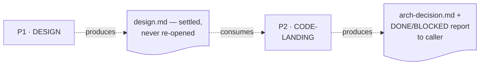

# Game Architect — Quasi-Software View (five layers: NODES+PHASES, LOOP+GRAPH, INTERNAL, PARALLELIZATION, EXPECTED OUTPUTS)

This is `grimorio.game-architect`'s own DRAWN quasi-software design view, produced per
ref:skill/grimorio.phase-splitting#the-agent-design-plans-drawn-view--a-hard-requirement-never-optional's standing
requirement that every agent-design plan carry one, saved alongside the agent's own design as a reference file.
It was authored AFTER both phase files, per
ref:skill/grimorio.phase-splitting/project.quasi-view-requirements.md#half-b--per-phase-interior-behavior-new's own
requirement that a per-phase interior flowchart be RE-DERIVED from the real, already-authored file, never
invented before it exists — every flowchart below is re-derived from the actual phase `.md` files, read fresh,
not sketched in advance.

## STEPS vs PHASES verdict, and the orchestrator/purpose-driven classification

**VERDICT: PHASES, purpose-driven.** Full reasoning saved at
cite:repo/objectives/design/game-architect-phase-map-v1-derivation.md. Short form: the prior flat
ref:skill/grimorio.game-design/designer-behavior.md carried 7 numbered steps under a shared Step-1 opener plus 2
explicit `### Phase N` headers (DESIGN, CODE-LANDING), each drawing on genuinely different knowledge (confirmed
in the derivation), gated by load-bearing sequencing rules ("ONLY once the design is settled... do NOT re-open
the design," "NEVER re-litigate the design while coding it, and NEVER let a schema drive the mechanic") — the
exact shape ref:skill/grimorio.phase-splitting#the-phase-boundary-judgment-test--judgment-never-an-algorithm names
as a genuine multi-stage state machine, here already CLAIMED in prose/description but never actually split into
separate files with real JIT loading. `grimorio.game-architect` is PURPOSE-DRIVEN, not an orchestrator,
confirmed by the file's own explicit self-declaration: "a single SELF node running ONE sequential flow... This
agent never invokes another agent as a node of that flow" — one function (design + land one mechanic), never a
coordinator of other agents' stages, with one bounded, conditional scout-verifier fork threaded through Phase 1
only.

## The four standing purpose-driven dimensions — where each is threaded, not manufactured as a phase

a. **GRIMORIO MEMBERSHIP/BASES** — named once, in Phase 1's own opening "Standing precondition" section,
   mirroring `grimorio.solution-architect`'s, `grimorio.prompt-writer`'s, and `grimorio.web-architect`'s own
   Phase 1, never re-taught.
b. **LOOP + RELATIONSHIPS** — stated once in Phase 0 (ref:skill/grimorio.game-design/designer-behavior.md)'s
   own "LOOP + RELATIONSHIPS" section: PARENT is whoever hands the design/mechanic brief (a PO, an orchestrator,
   `grimorio.system-keeper`, the feature-workflow pipeline); ITSELF is the distributed self-check (Phase 1's
   own converge+stage completeness, Phase 2's own gate check, never one bolted-on review phase); CHILDREN is
   REAL but CONDITIONAL, bounded to the scout-verifier choice threaded through Phase 1 ONLY — unlike
   `web-architect`, this chain never threads the fork through code-landing — the shell carries no
   `disallowedTools: Agent`, confirmed live.
c. **KNOWN ERRORS** — this agent's own domain-specific known errors are named in Layer 3's own
   KNOWN-ERRORS-TO-PHASE mapping below.
d. **BASE REQUIREMENTS AS ONE MISSION** — the prior file's own Rules-section bullets were NOT split into their
   own phases; each was folded into the phase that already answers their question:
   contradiction-handling/hypothesis-labeling/deliver-proposals-not-open-questions/name-game-and-mechanism fold
   into Phase 1 (they govern only how the mechanic gets designed); never-write-the-feature/never-touch-the-web-
   app/never-spawn-general-purpose are stated ONCE, at Phase 0, as standing preconditions — restated in full at
   ref:skill/grimorio.game-design/designer-behavior.md#standing-preconditions--stated-once-here-never-duplicated-per-phase
   and the agent's own shell Knowledge list, never duplicated per phase.

**SEARCH-FIRST, applied, not manufactured as a phase of its own.** Phase 1's own opening steps (the entropy
gate check + the read/explore bundle — vision, catalogue, entropy review, the actual sim/render code, the
mechanics analysis, AND the promoted features-status ledger read) ARE this agent's own domain-specific
SEARCH-FIRST move, per ref:skill/grimorio.phase-splitting#orchestrator-vs-purpose-driven--the-judgment-tests-own-missing-half.

## Layer 1 + 2 — NODES (the orchestration graph) and PHASES (the state machine)

```mermaid
flowchart TB
    P1["P1 · DESIGN<br/>(opens with<br/>SEARCH-FIRST)"] -->|"design.md<br/>settled"| P2["P2 · CODE-<br/>LANDING"]
    P2 --> DONE(("DONE / BLOCKED<br/>— report to caller<br/>(terminal)"))

    SCOUT(("grimorio.scout<br/>(scoped verifier,<br/>Haiku-tier)"))
    P1 -->|"WHEN prior-art needs<br/>verifying beyond the<br/>catalogue (P1 step 5)"| SCOUT
    SCOUT -->|"verification<br/>result"| P1

    classDef scoutNode fill:#2a3a2a,stroke:#5a5
    class SCOUT scoutNode
```

**Reading these two layers.** The solid spine (P1→P2→DONE/BLOCKED) is the STATE MACHINE — the two phase files'
own chain, per ref:skill/grimorio.phase-splitting#the-model--a-phase-is-a-mini-loop-state-with-three-fields.
`SCOUT` is the one agent-node in the GRAPH, drawn circular (distinct from the rectangular phase-nodes),
CONDITIONAL on Phase 1's own step 5 ONLY — a REAL, sometimes-wired spawn (not a future/not-wired one), never
threaded through Phase 2 (unlike `web-architect`, which forks the same kind of claim from two phases).

**There is NO genuine phase-level loop-back edge in this chain, drawn nowhere above, per the pre-supplied
verdict's own instruction.** Phase 2 step 6's own gate-fix iterate (fires when a gate box fails on deficient
content) is INTERNAL to Phase 2 — there is no separate "decide" phase to return to, because writing the
arch-decision and gating it are already fused in ONE phase — so it is drawn ONLY inside Phase 2's own interior
flowchart below, as a self-loop, never as a cross-phase back-edge on this diagram. A `BLOCKED` status is a
TERMINAL exit reported to the caller, never a trigger for a loop anywhere in this chain.

## Layer 4 — PARALLELIZATION: no genuine fork/join bar in this chain

**SCOUT is REPORT-ONLY** under Rule 8(a) of ref:skill/grimorio.phase-splitting/project.flow-method.md — it only
reads/verifies prior-art claims, it never writes `design.md` or `arch-decision.md` — but, same finding as
`grimorio.web-architect`'s own precedent, there is nothing to parallelize it against: Phase 1's own step 5 names
"ONE" scoped `agent:grimorio.scout`, singular, never a panel, so SCOUT's parallelization eligibility is real in
principle but has nothing to run alongside in this chain's own current shape.

**P1 and P2 are CONFIRMED MODIFYING and sequential-only** under Rule 8(b) — each writes its own phase
DELIVERABLE, P1 additionally writing the shared `design.md`, P2 additionally writing the shared
`arch-decision.md` — neither phase file's own text names a second, concurrent writer of the same artifact
anywhere in this chain.

## Layer 3 — INTERNAL: per-phase artifact-flow (IN → OUT), Half (a)

**ONE artifact node per phase BOUNDARY, never two** — 1 boundary artifact (P1↔P2) plus P2's own terminal
output — 2 artifact nodes total, per the "N-1 boundary artifacts, never one IN/OUT pair per phase" rule.

### Half (b) — per-phase interior behavior, drawn from the REAL authored files

**Every flowchart below is re-derived from the actual phase `.md` file, read fresh this pass.**

**P1 · DESIGN**

```mermaid
flowchart TB
    A1["Step 1 — state own graph:<br/>SELF + conditional SCOUT<br/>fork"] --> A2["Step 2 — state OBJECTIVE +<br/>EXIT CONDITION"]
    A2 --> A3{"Step 3 — entropy review<br/>exists for this topic?"}
    A3 -->|"NO"| A3n["STOP — request it,<br/>chain ends here<br/>(HARD GATE)"]
    A3 -->|"YES"| A4["Step 4 — read IN FULL:<br/>ledger + vision + catalogue<br/>+ entropy + actual code +<br/>mechanics analysis"]
    A4 --> A5{"Step 5 — prior-art needs<br/>verifying beyond the<br/>catalogue?"}
    A5 -->|"YES"| A5y["fan out ONE scoped<br/>grimorio.scout<br/>(Haiku-tier)"]
    A5 -->|"NO"| A5n["N/A — state<br/>plainly"]
    A5y --> A6
    A5n --> A6
    A6["Step 6 — converge the design:<br/>SYSTEM/CONTENT tag, diagram<br/>first, prior-art, panel answer,<br/>hypothesis label, OUT-cuts,<br/>+ composition test"] --> A7["Step 7 — tag every row<br/>with its MODALITY"]
    A7 --> A8{"Step 8 — inputs contradict,<br/>or a signature looks<br/>gravely wrong?"}
    A8 -->|"YES"| A8y["surface it; design<br/>to the vision; flag a<br/>grave signature<br/>SEPARATELY"]
    A8 -->|"NO"| A8n["None found"]
    A8y --> A9
    A8n --> A9
    A9["Step 9 — label every number<br/>hypothesis, UNLESS actually<br/>exercised"] --> A10["Step 10 — deliver proposals,<br/>never open questions"]
    A10 --> A11["Step 11 — name the game<br/>AND the exact mechanism<br/>for every citation"]
    A11 --> A12["Step 12 — stage<br/>design.md"]
    A12 --> EXIT1
    EXIT1(["→ P2 · CODE-<br/>LANDING"])
    classDef exit fill:#2a2a3a,stroke:#668,stroke-dasharray: 3 3
    classDef earlyExit fill:#3a2a2a,stroke:#a55,stroke-dasharray: 3 3
    class EXIT1 exit
    class A3n earlyExit
```

**P2 · CODE-LANDING**

```mermaid
flowchart TB
    LOOPIN(["◄ from P1<br/>(first pass)"]) --> B1["Step 1 — state own graph:<br/>SELF + internal loop-back —<br/>never spawns"]
    B1 --> B2["Step 2 — design.md exists —<br/>do NOT re-open it"]
    B2 --> B3["Step 3 — survey existing<br/>sim/render abstractions<br/>FIRST; decide reuse/<br/>extend/refactor"]
    B3 --> B4["Step 4 — write arch-decision.md:<br/>files, reuse, new abstractions,<br/>patterns, contract, checks,<br/>trade-off matrix"]
    B4 --> B5["Step 5 — run the 4-item<br/>gate check"]
    B5 --> B6{"Step 6 — any box fails on<br/>DEFICIENT CONTENT (not a<br/>human trade-off)?"}
    B6 -->|"YES"| B6y["fix content HERE,<br/>re-run the gate —<br/>INTERNAL iterate,<br/>never a cross-phase edge"]
    B6y --> B5
    B6 -->|"NO — every box<br/>holds, or the only<br/>failure is a genuine<br/>trade-off"| B7
    B7["Step 7 — set status<br/>DONE or BLOCKED"] --> B8{"Step 8/9 — status?"}
    B8 -->|"DONE"| B8y["run Custody check;<br/>migrate tmp/ substance<br/>into docs/ + sheets/ +<br/>tuning-ledger (step 8)"]
    B8 -->|"BLOCKED"| B8n["N/A — BLOCKED,<br/>nothing to migrate<br/>(step 9)"]
    B8y --> EXIT2
    B8n --> EXIT2
    EXIT2(["CLOSE: VERIFIED or<br/>COULD NOT — report<br/>to caller (terminal)"])
    classDef exit fill:#2a2a3a,stroke:#668,stroke-dasharray: 3 3
    class EXIT2 exit
```

**Table — KNOWN-ERRORS-TO-PHASE mapping.** Row 1 is a grounded, dated/measured incident (shared with
`web-architect`, same evidence). Row 2 is this agent's own OMISSION, now addressed. Rows 3-4 are standing
PREVENTIVE rules stated without a dated incident behind them — flagged here explicitly so all four rows are
never read as carrying identical evidentiary weight.

| # | Known error / incident / standing rule | Addressed by |
|---|---|---|
| 1 | Three capabilities were re-discovered in one session because the `features-status.md` read was skipped | P1 step 4 |
| 2 | **OMISSION, now addressed.** The pre-split flat file's own custody-check + never-leave-in-`tmp/`-MIGRATE discipline was stated as OUTPUT-section prose, with no numbered step ever executing it | **P2 step 8, in full** — the gap this pass's own ONE genuine addition closes, named plainly rather than left residual |
| 3 | **STANDING PREVENTIVE RULE — no dated incident.** Never write the feature yourself (builders do), never touch the web app (`web-architect` owns it) | Stated once at Phase 0, as a standing precondition |
| 4 | **STANDING PREVENTIVE RULE — no dated incident.** Never spawn `general-purpose` or any recursion-capable agent as a worker | Stated once at Phase 0 / this agent's own shell Knowledge list |

## Layer 5 — EXPECTED OUTPUTS: WORK vs ORCHESTRATION, per phase

| Phase | WORK PRODUCT (what the phase's own action produces) | ORCHESTRATION ACT (what it then routes, and to whom) |
|---|---|---|
| P1 · DESIGN | The entropy-gated, converged design — SYSTEM/CONTENT tags, hypothesis-vs-validated labels, MODALITY tags, OUT-cuts, one composition example, staged as `design.md` | Hands the settled design to P2, never re-opened; conditionally forks `scout` for one prior-art claim |
| P2 · CODE-LANDING | The written, gate-passed `arch-decision.md`; its DONE/BLOCKED status; WHEN DONE, the custody-checked migration into `sheets/`/`docs/`/the tuning ledger | Terminates — reports the full VERIFIED/COULD NOT close to the caller (a PO, an orchestrator, or `grimorio.system-keeper`) |
