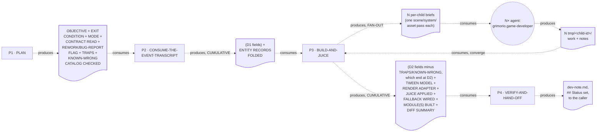

# Game Render Developer — Quasi-Software View (five layers: NODES, PHASES, INTERNAL, PARALLELIZATION, EXPECTED
OUTPUTS)

This is `grimorio.game-developer`'s own DRAWN quasi-software design view, produced per
ref:skill/grimorio.phase-splitting#the-agent-design-plans-drawn-view--a-hard-requirement-never-optional's
standing requirement that every agent-design plan carry one, saved alongside the agent's own design as a
reference file. It mirrors ref:skill/grimorio.go-developer-memory/go-developer-phases/go-developer-quasi-software-view.md's
own already-shipped five-section shape (a purpose-driven, non-hard-locked agent with a real own-type gated
fan-out, NO loop-back, and exactly ONE fan-out dispatch point) — the CLOSEST shape match in this corpus, not
ref:skill/grimorio.ui-developer-memory/ui-developer-phases/ui-developer-quasi-software-view.md's own two-loop-back,
two-dispatch-point shape. This agent's own chain is STRUCTURALLY SIMPLER than go-developer's in one respect,
stated explicitly rather than padded to match it: FOUR phases, not five — go-developer's own SEARCH-FIRST earned
a standalone phase because its own `./traps.md` is a large, disjoint, multi-wave corpus; this agent carries no
own `traps.md` at all, so its own SEARCH-FIRST mission merges into Phase 1 (PLAN) instead, the same shape
ui-developer's own PLAN phase already establishes for the identical reason. This file draws all layers directly
from ref:skill/grimorio.game-development/developer-behavior.md and its four
ref:skill/grimorio.game-development/game-developer-phases/phase-1-plan.md through
ref:skill/grimorio.game-development/game-developer-phases/phase-4-verify-and-hand-off.md, all read in full THIS
pass, in the same authoring dispatch that wrote them; it changes none of their content.

## Layer 1 + 2 — NODES (the orchestration graph) and PHASES (the state machine)

```mermaid
flowchart TB
    P1["P1 · PLAN<br/>(incl. SEARCH-FIRST)"] --> P2["P2 · CONSUME-THE-<br/>EVENT-TRANSCRIPT"]
    P2 --> P3["P3 · BUILD-AND-<br/>JUICE"]
    P3 --> P4["P4 · VERIFY-AND-<br/>HAND-OFF<br/>(terminal)"]

    COULD_NOT_P1(["COULD NOT<br/>(missing-plan<br/>refusal)"])
    P1 -.->|"MISSING-PLAN CHECK<br/>fires — chain ends"| COULD_NOT_P1

    CHILD_GAME(("N× agent:<br/>grimorio.game-developer<br/>(haiku, one per<br/>scene/system/<br/>asset pass)"))
    P3 -.->|"GATE HELD — fan out,<br/>foreground, synchronous,<br/>ONE message"| CHILD_GAME
    CHILD_GAME -.->|"each child's own<br/>tmp/&lt;child-id&gt;/<br/>work + notes"| P3

    style CHILD_GAME fill:#2a3a2a,stroke:#5a5
    style COULD_NOT_P1 fill:#3a2a2a,stroke:#a55
```

**Reading this diagram.** The solid rectangular spine (P1→P2→P3→P4) is the STATE MACHINE — the four phase
files' own chain, per ref:skill/grimorio.phase-splitting#the-model--a-phase-is-a-mini-loop-state-with-three-fields.
**This chain carries NO loop-back edge, on purpose, mirroring `grimorio.go-developer`'s own chain exactly, NOT
`grimorio.ui-developer`'s two** — a defect Phase 4 finds during its own frame-profile/teardown-race verification
is fixed INSIDE Phase 4's own self-complete mini-loop (plan→execute→check→iterate, per
ref:skill/grimorio.phase-splitting#the-two-universal-givens--true-of-every-phase-no-exceptions), never by
re-entering Phase 3's or Phase 1's own file; a full LOOP is not warranted here because this agent's own build/
verify cycle stays inside one phase's own iteration rather than crossing a phase boundary to repair itself. **A
REWORK/bug-report invocation is NEVER a mid-invocation loop-back — it is a SEPARATE, FRESH dispatch of this SAME
chain**, starting at Phase 1 as always; Phase 1 detects the REWORK/bug-report mode and carries that flag forward
to Phase 3, where the fixing knowledge domain actually lives and the mandatory failing-test-first order applies.
This is a CORRECTION to the pre-supplied diagnosis verdict's own looser "loops back to Phase 1... then re-enter
3" framing — no such chain-level edge is drawn here, for the same structural reason go-developer's own chain
draws none. The one EARLY EXIT this chain carries is drawn as its own visually distinct terminal node,
`COULD_NOT_P1`, dashed off Phase 1 — the same visual convention `CHILD_GAME` already establishes for a
non-default-path node, applied here instead of only a label sitting on an otherwise-unconditional P1→P2 edge, so
a reader scanning NODE SHAPE alone, not just edge labels, sees the early exit: Phase 1's own MISSING-PLAN CHECK
can REFUSE the invocation there, ending the chain with `## Close: COULD NOT` reported directly (per Phase 1's
own Hard hand-off), never reaching Phase 2. This node sits off Phase 1 rather than Phase 2 (where
go-developer's own equivalent `COULD_NOT_P2` sits) precisely because this agent's own missing-plan-refusal check
lives inside its FIRST phase, PLAN, per the shared build-protocol's own threading table (Phase 0's own attachment
table) — the chain-position differs, the mechanism does not.
**`COULD_NOT_P1` is a STATE MACHINE terminal state, never a GRAPH agent-node** — unlike `CHILD_GAME` below, it
names no agent to raise; it is drawn dashed and distinctly shaped only to match `CHILD_GAME`'s established
convention for "this is not one of the four ordinary phase rectangles," not to claim membership in the GRAPH
layer.

**The one circular agent-node, `CHILD_GAME`, is the GRAPH layer's own contribution** — per
ref:skill/grimorio.loop-and-graph#3-the-graph--who-is-in-it-and-the-branch-rule — drawn in a shape visually
distinct from the four rectangular phase-nodes, the same convention go-developer's own `CHILD_GO` node already
establishes, so a reader tells a phase from a spawned agent at a glance. **This is a SINGLE node, never two,
because this agent has only ONE VOLUME UNIT reachable from ONE phase** — mirroring go-developer's own shape, not
ui-developer's two independent dispatch points: this agent's own fan-out gate lives entirely inside Phase 3's
own FAN-OUT BRANCH — one scene, system, or asset pass per Haiku child — and nowhere else in the chain.

**The escalation ladder (`agent:grimorio.unblocker` / `agent:grimorio.entropy` / `agent:grimorio.adviser`) is
DELIBERATELY OMITTED from this diagram, stated here explicitly rather than silently dropped.** Unlike the
CHILDREN relationship above, this ladder is reachable from EVERY phase in the chain (Phase 0's own "Standing
awareness" section states this), not from one specific dispatch point — the same reasoning both already-shipped
sibling quasi-views already state for their own chains, reused here rather than re-derived. **No other future/
not-wired agent-node belongs in this graph** — a full read of Phase 0 plus all four phase files surfaced no
language naming any agent this chain MAY one day lean on beyond the escalation ladder (already addressed above),
the one CHILD node already drawn, and the two named developers (`agent:grimorio.js-developer`,
`agent:grimorio.py-developer`'s original mis-citation now corrected) a BLOCKED note may be routed to — those two
are NOTE RECIPIENTS, never spawn targets, and carry no node of their own for the same reason go-developer's own
"write it as a note for the owning developer" language never earns one either.

## Layer 3 — INTERNAL: per-phase artifact-flow (IN → OUT), half (a) only

**Grounding — shared across every quasi-view that draws this layer, not re-derived here:**
ref:skill/grimorio.phase-splitting/project.quasi-view-requirements.md#half-a--boundary-artifact-flow-unchanged.
Per this pass's own scope, only half (a) (boundary artifact-flow) is drawn for this chain — half (b) (per-phase
interior flowcharts + a KNOWN-ERRORS-TO-PHASE mapping) is optional per that same file and out of scope for this
pass, matching the exact scope both sibling exemplars already ship at.

**This chain IS strictly linear — no re-entry, no branching fan-out point beyond Phase 3's own single dispatch
— so its boundary count follows the plain N-1 rule cleanly, mirroring go-developer's own count, not
ui-developer's own two-loop-back deviation:**

- **FORWARD spine** (3 boundaries): P1↔P2, P2↔P3, P3↔P4, plus P4's own terminal output to the caller.
- **FAN-OUT sub-flow** (2 boundaries, ONE pair, entirely INSIDE P3, never a phase-level boundary): P3↔CHILD_GAME
  (N per-child briefs, one scene/system/asset pass each) and CHILD_GAME↔P3 (N `tmp/<child-id>/work`+`notes`
  reports, converged by P3 itself before its own forward hand-off fires).
- **LOOP-BACK re-entries**: NONE — 0 boundaries, stated explicitly as a deliberate absence, not an omission.
- **EARLY-EXIT**: 1 boundary (P1→`COULD_NOT_P1`, per Layer 1+2's own distinct terminal node, not a separate doc
  node here) — Phase 1's own MISSING-PLAN CHECK can terminate the chain with `## Close: COULD NOT` rather than
  handing off to P2, producing no artifact of its own beyond the refusal report already covered by P1's own
  DELIVERABLE.

The dotted edges here are the SAME visual convention as the fan-out edges in Layer 1+2 (both dashed there) but
carry a DIFFERENT meaning — "consumes"/"produces" (data moving), never "GATE HELD" (control moving) — the
identical DFD process-vs-flow separation every already-shipped quasi-view in this corpus already applies.

**`D2` and `D3` are labeled CUMULATIVE, not incremental — each doc node lists every field the NEXT phase
actually needs from ANY earlier phase, not only what the phase immediately upstream of it newly produced — with
ONE exception, named here rather than silently smoothed over.** OBJECTIVE, EXIT CONDITION, MODE, CONTRACT READ,
and REWORK/BUG-REPORT DETECTED (five of Phase 1's own seven fields) genuinely ride every doc node through to
Phase 4, matching the widened Hard hand-off text each of `phase-2-consume-the-event-transcript.md` and
`phase-3-build-and-juice.md` now carries: Phase 4's own `## Objective / Exit Condition` section needs the first
two, its own step 5 needs CONTRACT READ to know what the render-adapter port actually names, and its own REWORK
step needs the flag. **TRAPS CHECKED and KNOWN-WRONG CATALOG CHECKED — Phase 1's remaining two fields — do
NOT.** `phase-2-consume-the-event-transcript.md`'s own Hard hand-off still re-forwards both into `D2`, consumed
by Phase 3 as an input, but `phase-3-build-and-juice.md`'s own Hard hand-off to Phase 4 drops them from `D3` —
its own step 12 confirmation checks only that a NEW capture reached this project's own developer trap log before
the chain closes, a fact-check against the FILE's current state, never a comparison against what Phase 1 already
found; nothing downstream of Phase 2 ever reads either field again. Both fields END at `D2`, never carried into
`D3` — a correction to this diagram's own prior text, which claimed otherwise. ENTITY RECORDS FOLDED (Phase 2's
own field) rides through `D3` because Phase 3's own render adapter reads it directly, never re-deriving it.
Grounded in
ref:skill/grimorio.phase-splitting#progressive-revelation--a-hard-mechanical-requirement-never-judgment's own
"ALWAYS restate, inside a later phase's own file, any fact that phase depends on" rule — this diagram draws that
rule's effect, it does not invent a new one.

## Layer 4 — PARALLELIZATION: ONE genuine dispatch point, everywhere else sequential

**This chain is sequential end-to-end at the STATE MACHINE level — P1 → P2 → P3 → P4, one phase at a time, never
two phases running concurrently.** Unlike `grimorio.ui-developer`'s own chain (two independent dispatch points,
one per phase), this chain carries exactly ONE — mirroring `grimorio.go-developer`'s own count:

1. **Inside P3's own FAN-OUT BRANCH: WHEN the volume-fan-out ladder's step-1 gate holds, P3 raises N `haiku`
   children — one per scene, system, or asset pass — in ONE message, foreground, synchronous, per**
   ref:skill/grimorio.fan-out#the-volume-fan-out-ladder--when-an-agent-fans-out-n-children-of-its-own-type-six-step-algorithm's
   **own step 3, and blocks until every child returns before its own next-phase read (P4) fires.**

**No other node in this chain carries a parallelism question of its own.** P1, P2, and P4 are each a single
SELF node by their own step 1 (no spawn, ever). **P4 is the SOLE writer of `dev-note.md`** — per
ref:skill/grimorio.phase-splitting/project.flow-method.md#b-modifying-phases-stay-sequential ("many may ADVISE
it, but only ONE phase WRITES"), P4 stays sequential and terminal: no loop-back edge ever re-enters an earlier
phase to revise it after P4 has closed.

## Layer 5 — EXPECTED OUTPUTS: WORK vs ORCHESTRATION, per phase

**The distinction this layer draws, kept separate from Layer 3 above: Layer 3 shows the DATA that crosses a
phase boundary — what the next phase literally reads. This layer shows the RESULT that phase's own WORK exists
to produce.**

| Phase | WORK PRODUCT (what the phase's own action produces) | ORCHESTRATION ACT (what it then routes, and to whom) |
|---|---|---|
| P1 · PLAN (incl. SEARCH-FIRST) | OBJECTIVE/EXIT CONDITION, the harness lookup, MODE, the render-adapter port contract + existing-renderer survey, the missing-plan refusal call, REWORK/bug-report detection, a targeted search against this project's own developer trap log and this project's own game-development conventions record's Known-wrong catalog | Hands to P2 unconditionally, UNLESS the missing-plan refusal fired (chain ends there, `## Close: COULD NOT`) — never spawns |
| P2 · CONSUME-THE-EVENT-TRANSCRIPT | The ECS-lite entity records folded ONCE from the event transcript, the mis-attribution check, the game=DATA confirmation | Hands to P3 unconditionally — never spawns |
| P3 · BUILD-AND-JUICE | On FIRST-PASS: the survey + WHEN flagged the failing-test-first sequence + the decomposition + fan-out gate decision + the tween model + the mounted render adapter + the juice checklist applied + the fallback wired + the visual-reference-target confirmation + the actual scene/system/asset-pass module(s) built. On CHILD: the single assigned item alone | Hands to P4 unconditionally on FIRST-PASS — spawns N `CHILD_GAME` only when the gate holds — CHILD route reports to the parent, never reads P4 |
| P4 · VERIFY-AND-HAND-OFF | The frame-profile result, the teardown-race result, the decoupled-Fake-build + Storybook result, the BLOCKED note (if any), the invariant confirmation — any failure fixed and re-checked WITHIN this phase's own mini-loop before it hands off — `dev-note.md` (Pipeline mode), the commit action taken, any REWORK-cycle section, the `## Status`/`## Close` values | Terminal — reports to the caller, no further phase, no loop-back |

## Evidence of phase-design reasoning — the RENDER/GROUP/MEASURE working product, saved

Per
ref:skill/grimorio.phase-splitting/project.quasi-view-requirements.md#evidence-of-phase-design-reasoning--save-the-rendergroupmeasure-working-product-never-discard-it-silently,
this section restates, as a durable saved artifact rather than a claim taken on faith, the sizing reasoning
`grimorio.system-keeper` already performed (its own DIAGNOSIS/PLACEMENT decision) and the pre-supplied,
independently-reasoned diagnosis verdict it extended
(this project's own branch-objective records), both read in full this pass and inlined
here rather than left as a pointer into scratch that will not survive past this session.

**RENDER — the complete load, before any grouping.** The pre-split behavior file
(ref:skill/grimorio.game-development/developer-behavior.md, 137 lines before this pass) carried its own engine-
translation-note section, a flat "## Core rules" block (game=DATA/fold-once, lifecycle/frame-budget ownership,
"feel is the job," the "never build a visual without a concrete reference TARGET" rule), a single "## Steps"
section with FIVE sequential sub-steps under ONE self-node (PLAN, CONSUME-THE-EVENT-TRANSCRIPT,
BUILD-THE-SCENE-AND-UPDATE-LOOP, ANIMATE-AND-JUICE, VERIFY-AND-HAND-OFF), a fan-out clause threaded inside step 1
(never its own phase), an "## OUTPUT" section with a worked `dev-note.md` example, a "## Self-check" block
mirroring the canon's own game-feel checklist, and a "## Rules" block (never simulate/hold logic, never
hardcode an asset path, the BLOCKED-note routing bullet, never ship the engine in the main bundle). The shell
(ref:repo/.claude/agents/grimorio.game-developer.md) executed this file AND the shared
ref:skill/grimorio.developer-memory/project.build-protocol.md
together, every invocation, plus a 10-entry flat Knowledge list: `game-development` (primary reference),
`frontend-development`, `game-patterns`, `working-memory`, a terrain tileset-composition reference, `code-harness`,
`objective-harness`, `development-patterns`, `developer-memory`, `fan-out`. A single reducer-fold sub-step (the
original Step 3) did not need the tween model, the juice checklist, or the fan-out ladder loaded in full at
that moment — yet nearly the entire Knowledge list was mandatory-imported regardless of which of the 5 original
steps was actually executing. This is the exact flat-mega-load anti-pattern
ref:skill/grimorio.phase-splitting names by construction, not by inference — independently re-confirmed this
pass by reading the pre-split behavior file and the shell's own Knowledge list in full, not taken from the
pre-supplied verdict's own count alone. **One REWRITE finding surfaced during this same read, corrected in this
pass's own Phase 4**: the pre-split file's own Rules section routed a data-BLOCKED note to
`agent:grimorio.py-developer` — stale, since
this project's own developer memory confirms this project
currently has NO live Python backend service, and
ref:skill/grimorio.go-developer-memory/behavior.md#scope-boundary--hard-rule-restated-once-here-for-every-phase-below
already states the wire-contract SHAPE is `agent:grimorio.js-developer`'s job. Corrected to
`agent:grimorio.js-developer` in Phase 4's own step 5.

**GROUP — four candidates, all clearing the bar, none rejected outright, matching the pre-supplied verdict's own
final count after its own PLAN/BUILD/ANIMATE reasoning.** (1) PLAN (incl. SEARCH-FIRST): the render-adapter port
contract + existing-renderer survey (this project's own game-development memory), the missing-plan
refusal,
pipeline-vs-standalone mode, REWORK/bug-report detection, the upward harness-lookup walk (this IS the chain's
first file-reading/scoping phase), and a targeted search against this project's own developer trap log +
this project's own game-development conventions record's own Known-wrong catalog — MERGED, never split into a fifth phase, because this
agent carries no own large multi-wave traps corpus (unlike go-developer's own `./traps.md`): the reasoning
ui-developer's own PLAN phase already states for its own merge — the contract-read and the SEARCH-FIRST pass
share the SAME reading activity here — applies to this agent, not go-developer's opposite reasoning. (2)
CONSUME-THE-EVENT-TRANSCRIPT: the ECS-lite entity model + fold-once discipline + the mis-attribution bug class —
a distinct ~6-line canon subsection, never needed again once folded — the STRONGEST, most cleanly-bounded
candidate in the chain, per the pre-supplied verdict's own finding, independently reconfirmed this pass. (3)
BUILD-AND-JUICE (BUILD-THE-SCENE-AND-UPDATE-LOOP + ANIMATE-AND-JUICE merged, per the verdict's own collapse):
the tween-model + the engine-lifecycle discipline (translated via this project's own game-development memory) + filters/LOOK + juice +
accessibility canon sections, plus `frontend-development`'s DAL/Fake/visual-craft seam + `ux-memory`'s Design
Canon, plus
a terrain tileset-composition reference (conditional, terrain only), plus `development-patterns` — genuinely the heaviest single
group (rendered: ~11 distinct items, vs PLAN's ~7 and CONSUME's ~2), which is exactly the CHILDREN-OFFLOAD case
this agent's own Phase 0 already recognizes and answers by fanning independent scenes/systems/asset passes out
to Haiku children rather than by further phase-splitting a single scene's own construction — the same relief
valve go-developer's own IMPLEMENT phase already uses for an analogous heaviest-single-group finding. (4)
VERIFY-AND-HAND-OFF: the Performance + Accessibility-adjacent leak-verification canon knowledge (frame profile,
teardown race), `frontend-development`'s Storybook/Fake discipline, the shared OUTPUT template, the
worktree-isolation commit-discipline branch, REWORK-mode shape, the BLOCKED-on-ambiguity rule — a genuinely
different KIND of activity (execution/measurement/reporting) from BUILD-AND-JUICE's construction work, and,
unlike go-developer's own chain, this agent has NO separate WRITE-DEV-NOTES-REPORT phase: the pre-supplied
verdict's own four-phase count (not five) already folds verification and reporting into ONE terminal phase,
matched here exactly, never re-split.

**MEASURE — a rendered count per group, no pincho found beyond the one already-relieved by CHILDREN-OFFLOAD.**
Group BUILD-AND-JUICE carries ~11 rendered items across 6 knowledge sources (four `game-development` canon
subsections, `frontend-development`+`ux-memory`, a terrain tileset-composition reference conditional, `development-patterns`) —
not split further; splitting it would reproduce the exact measured `grimorio.prompt-writer` over-splitting
incident this skill names explicitly (a single coherent judgment call — "build a scene that renders and feels
right" — fragmented when only the WHOLE group is one mission, and the tween/`AnimState`-guard/juice interleaving
this phase's own opening section already names makes an internal split actively wrong, not merely undesirable).
No other group carries a multiple of its siblings' load: Group PLAN carries ~7 distinct knowledge sources/steps,
genuinely non-overlapping with BUILD-AND-JUICE's own six; Group CONSUME-THE-EVENT-TRANSCRIPT carries 2 knowledge
sources (the ECS-lite section, `game-patterns`' own data-vs-code vocabulary) plus a single hard invariant to
confirm, the lightest phase in the chain by design, matching the pre-supplied verdict's own "clears the bar more
cleanly than any other candidate" finding; Group VERIFY-AND-HAND-OFF carries 5 threaded build-protocol sections
plus 2 canon-adjacent verification concerns, all reporting/hand-off conventions no earlier phase touches.

**Against the pincho check and CHILDREN-OFFLOAD.** The pre-split file's flat 5-sub-step list already carried
four genuinely separate missions once regrouped (PLAN — SEARCH-FIRST absent, closed by this design — CONSUME,
BUILD-AND-JUICE, VERIFY-AND-HAND-OFF) with no fused-overload comparable to a measured 5×-sibling pincho elsewhere
in this corpus. CHILDREN-OFFLOAD was considered for BUILD-AND-JUICE's own volume and found the CORRECT remedy,
not an additional one: the phase already performs CHILDREN-OFFLOAD via its own FAN-OUT BRANCH, for the actual
build volume once the scope is known — this IS the mechanism, threaded through the one phase that actually
produces volume, never given a phase of its own, exactly as the pre-supplied verdict's own classification
already states.

**Coverage — every rendered item placed, self-disclosed rather than smoothed over.** All 10 skills from the
RENDER inventory above land in exactly one or more phase groups, or are correctly THREADED or DROPPED rather
than silently omitted: `game-development` → splits across Phase 1 (this project's own game-development memory, the port contract),
Phase 2 (the ECS-lite entity-model subsection only), and Phase 3 (the tween-model, the engine-lifecycle
discipline, filters, juice, and accessibility subsections) — its own General-level canon was never one
undifferentiated blob to begin
with, and this split makes that division legible per-phase for the first time. `frontend-development` → Phase 3
(DAL/Fake/visual-craft seam) and Phase 4 (Section 3 named states + Section 4 Storybook) — two DIFFERENT anchors
for two different questions, never the same knowledge loaded twice for the same purpose. `game-patterns` → Phase
2 only, narrowly, for the data-vs-code boundary vocabulary that keeps the fold-once discipline honest — never
loaded for its own content-model/data-template mechanics, which this render-only agent never needs. `working-
memory` → Phase 3 (the per-child `tmp/<child-id>/` folder convention, its own single FAN-OUT BRANCH).
A terrain tileset-composition reference → Phase 3, CONDITIONAL, terrain brushes only. `code-harness` → Phase 1 only (the upward
lookup, this chain's first file-reading/scoping phase). `objective-harness` → **dropped from this agent's own
knowledge chain entirely by this redesign**: neither the rewritten shell's own `## Knowledge` section nor any of
the four phase files imports it any longer — it governs branch-open/close mechanics external to this agent's own
build loop, never cited by the pre-split behavior file's own Steps either, and it mirrors the identical drop
both already-shipped sibling redesigns (go-developer, ui-developer) made for the same reason (confirmed by
re-reading both their own `## Knowledge` sections this pass — neither carries an `objective-harness` reference
either). No restoration is warranted. `development-patterns` → Phase 3 only. `developer-memory` → splits across
every phase via the threaded build-protocol table (Phase 0's own attachment table) plus Phase 1's own
its own developer trap log search plus Phase 4's own trap-capture confirmation — this agent carries no own `traps.md`
the way go-developer does, so its own name never appears as a second, agent-specific import anywhere in this
chain. `fan-out` → Phase 3 only (the volume-fan-out ladder, its own single FAN-OUT BRANCH) — never Phase 1, 2,
or 4, which never spawn.
