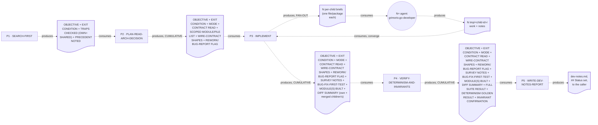

# Go Developer — Quasi-Software View (five layers: NODES, PHASES, INTERNAL, PARALLELIZATION, EXPECTED OUTPUTS)

This is `grimorio.go-developer`'s own DRAWN quasi-software design view, produced per
ref:skill/grimorio.phase-splitting#the-agent-design-plans-drawn-view--a-hard-requirement-never-optional's
standing requirement that every agent-design plan carry one, saved alongside the agent's own design as a
reference file. It mirrors ref:skill/grimorio.ui-developer-memory/ui-developer-phases/ui-developer-quasi-software-view.md's
own already-shipped five-section shape (a purpose-driven, non-hard-locked agent with a real own-type gated
fan-out) but is STRUCTURALLY SIMPLER than that exemplar in two respects, stated explicitly rather than padded to
match it: this chain has NO loop-back edges (unlike ui-developer's two — a defect Phase 4 finds is fixed inside
that phase's own mini-loop, never by re-entering an earlier phase file, per Phase 4's own "Terminal — no further
phase, no loop-back" framing), and it has exactly ONE fan-out dispatch point, not two, because this agent has
only ONE VOLUME UNIT: one file/package per Haiku child, reachable only from Phase 3 (IMPLEMENT). This file draws
all layers directly from ref:skill/grimorio.go-developer-memory/behavior.md and its five
ref:skill/grimorio.go-developer-memory/go-developer-phases/phase-1-search-first.md through
ref:skill/grimorio.go-developer-memory/go-developer-phases/phase-5-write-dev-notes-report.md, all read in full
THIS pass, in the same authoring dispatch that wrote them; it changes none of their content.

## Layer 1 + 2 — NODES (the orchestration graph) and PHASES (the state machine)

```mermaid
flowchart TB
    P1["P1 · SEARCH-FIRST"] --> P2["P2 · PLAN-READ-<br/>ARCH-DECISION"]
    P2 --> P3["P3 · IMPLEMENT"]
    P3 --> P4["P4 · VERIFY-<br/>DETERMINISM-AND-<br/>INVARIANTS"]
    P4 --> P5["P5 · WRITE-DEV-<br/>NOTES-REPORT<br/>(terminal)"]

    COULD_NOT_P2(["COULD NOT<br/>(missing-plan<br/>refusal)"])
    P2 -.->|"MISSING-PLAN CHECK<br/>fires — chain ends"| COULD_NOT_P2

    CHILD_GO(("N× agent:<br/>grimorio.go-developer<br/>(haiku, one per<br/>file/package)"))
    P3 -.->|"GATE HELD — fan out,<br/>foreground, synchronous,<br/>ONE message"| CHILD_GO
    CHILD_GO -.->|"each child's own<br/>tmp/&lt;child-id&gt;/<br/>work + notes"| P3

    style CHILD_GO fill:#2a3a2a,stroke:#5a5
    style COULD_NOT_P2 fill:#3a2a2a,stroke:#a55
```

**Reading this diagram.** The solid rectangular spine (P1→P2→P3→P4→P5) is the STATE MACHINE — the five phase
files' own chain, per ref:skill/grimorio.phase-splitting#the-model--a-phase-is-a-mini-loop-state-with-three-fields.
**This chain carries NO loop-back edge, on purpose, unlike `grimorio.ui-developer`'s own two** — a defect Phase
4 finds during its own determinism/invariant verification is fixed INSIDE Phase 4's own self-complete mini-loop
(plan→execute→check→iterate, per
ref:skill/grimorio.phase-splitting#the-two-universal-givens--true-of-every-phase-no-exceptions), never by
re-entering Phase 3's file; a full LOOP is not warranted here because this agent's own build/verify cycle stays
inside one phase's own iteration rather than crossing a phase boundary to repair itself. The one EARLY EXIT this
chain carries is drawn as its own visually distinct terminal node, `COULD_NOT_P2`, dashed off Phase 2 — the same
visual convention `CHILD_GO` already establishes for a non-default-path node, applied here instead of only a
label sitting on an otherwise-unconditional P2→P3 edge, so a reader scanning NODE SHAPE alone, not just edge
labels, sees the early exit: Phase 2's own MISSING-PLAN CHECK can REFUSE the invocation there, ending the chain
with `## Close: COULD NOT` reported directly (per Phase 2's own Hard hand-off), never reaching Phase 3.
**`COULD_NOT_P2` is a STATE MACHINE terminal state, never a GRAPH agent-node** — unlike `CHILD_GO` below, it
names no agent to raise; it is drawn dashed and distinctly shaped only to match `CHILD_GO`'s established
convention for "this is not one of the five ordinary phase rectangles," not to claim membership in the GRAPH
layer.

**The one circular agent-node, `CHILD_GO`, is the GRAPH layer's own contribution** — per
ref:skill/grimorio.loop-and-graph#3-the-graph--who-is-in-it-and-the-branch-rule — drawn in a shape visually
distinct from the five rectangular phase-nodes, the same convention `grimorio.ui-developer`'s own `CHILD_UI`/
`CHILD_STORY` nodes already establish, so a reader tells a phase from a spawned agent at a glance. **This is a
SINGLE node, never two, because this agent has only ONE VOLUME UNIT reachable from ONE phase** — unlike
ui-developer's two independent dispatch points (one per component/page, one per Story, at two different
phases), go-developer's own fan-out gate lives entirely inside Phase 3's own FAN-OUT BRANCH: one file or package
per Haiku child, and nowhere else in the chain.

**The escalation ladder (`agent:grimorio.unblocker` / `agent:grimorio.entropy` / `agent:grimorio.adviser`) is
DELIBERATELY OMITTED from this diagram, stated here explicitly rather than silently dropped.** Unlike the
CHILDREN relationship above, this ladder is reachable from EVERY phase in the chain (Phase 0's own "Standing
awareness" section states this), not from one specific dispatch point — the same reasoning
ref:skill/grimorio.ui-developer-memory/ui-developer-phases/ui-developer-quasi-software-view.md's own equivalent
section already states for its own chain, reused here rather than re-derived. **No other future/not-wired
agent-node belongs in this graph** — a full read of Phase 0 plus all five phase files surfaced no language
naming any agent this chain MAY one day lean on beyond the escalation ladder (already addressed above) and the
one CHILD node already drawn.

## Layer 3 — INTERNAL: per-phase artifact-flow (IN → OUT), half (a) only

**Grounding — shared across every quasi-view that draws this layer, not re-derived here:**
ref:skill/grimorio.phase-splitting/project.quasi-view-requirements.md#half-a--boundary-artifact-flow-unchanged.
Per this pass's own scope, only half (a) (boundary artifact-flow) is drawn for this chain — half (b) (per-phase
interior flowcharts + a KNOWN-ERRORS-TO-PHASE mapping) is optional per that same file and out of scope for this
pass, matching the exact scope the ui-developer exemplar already ships at.

**This chain IS strictly linear — no re-entry, no branching fan-out point beyond Phase 3's own single dispatch
— so its boundary count follows the plain N-1 rule cleanly, unlike ui-developer's own two-loop-back deviation:**

- **FORWARD spine** (4 boundaries): P1↔P2, P2↔P3, P3↔P4, P4↔P5, plus P5's own terminal output to the caller.
- **FAN-OUT sub-flow** (2 boundaries, ONE pair, entirely INSIDE P3, never a phase-level boundary): P3↔CHILD_GO
  (N per-child briefs, one file/package each) and CHILD_GO↔P3 (N `tmp/<child-id>/work`+`notes` reports,
  converged by P3 itself before its own forward hand-off fires).
- **LOOP-BACK re-entries**: NONE — 0 boundaries, stated explicitly as a deliberate absence, not an omission.
- **EARLY-EXIT**: 1 boundary (P2→`COULD_NOT_P2`, per Layer 1+2's own distinct terminal node, not a separate doc
  node here) — Phase 2's own MISSING-PLAN CHECK can terminate the chain with `## Close: COULD NOT` rather than
  handing off to P3, producing no artifact of its own beyond the refusal report already covered by P2's own
  DELIVERABLE.

The dotted edges here are the SAME visual convention as the fan-out edges in Layer 1+2 (both dashed there) but
carry a DIFFERENT meaning — "consumes"/"produces" (data moving), never "GATE HELD" (control moving) — the
identical DFD process-vs-flow separation every already-shipped quasi-view in this corpus already applies.

**`D2`, `D3`, and `D4` are labeled CUMULATIVE, not incremental — each doc node lists every field the NEXT phase
actually needs from ANY earlier phase, not only what the phase immediately upstream of it newly produced.** This
matches the widened Hard hand-off text each of `phase-2-plan-read-arch-decision.md`,
`phase-3-implement.md`, and `phase-4-verify-determinism-and-invariants.md` now carries: OBJECTIVE and EXIT
CONDITION (Phase 1's own fields) ride every doc node through to Phase 5, since Phase 5's own `## Objective /
Exit Condition` section needs them; MODE and CONTRACT READ (Phase 2's own fields) ride every doc node from `D2`
onward through to Phase 5 too — MODE gates Phase 5's own step 2 (Pipeline mode ALWAYS writes `dev-notes.md`;
Standalone mode owes no dev-note), CONTRACT READ is Phase 5's own cited evidence for its Completion criteria's
first bullet ("the architecture contract was actually read this invocation"); WIRE-CONTRACT SHAPES and
REWORK/BUG-REPORT FLAG (Phase 2's own fields) ride through `D3` and `D4` for Phase 5's own `## Contracts`
section and its `### REWORK Cycle {N}` step; SURVEY NOTES (Phase 3's own field) rides through `D4` for Phase
5's own `## Abstractions Reused` section; BUG-FIX-FIRST-TEST (Phase 3's own field, produced on the bug-report
path) rides through `D3` and `D4` too, as Phase 5's own cited evidence for its Completion criteria's second
bullet ("WHEN the task was a bug report, the failing test actually ran and actually failed BEFORE any
production code changed"). Grounded in
ref:skill/grimorio.phase-splitting#progressive-revelation--a-hard-mechanical-requirement-never-judgment's own
"ALWAYS restate, inside a later phase's own file, any fact that phase depends on" rule — this diagram draws that
rule's effect, it does not invent a new one.

## Layer 4 — PARALLELIZATION: ONE genuine dispatch point, everywhere else sequential

**This chain is sequential end-to-end at the STATE MACHINE level — P1 → P2 → P3 → P4 → P5, one phase at a time,
never two phases running concurrently.** Unlike `grimorio.ui-developer`'s own chain (two independent dispatch
points, one per phase), this chain carries exactly ONE:

1. **Inside P3's own FAN-OUT BRANCH: WHEN the volume-fan-out ladder's step-1 gate holds, P3 raises N `haiku`
   children — one per file/package — in ONE message, foreground, synchronous, per**
   ref:skill/grimorio.fan-out#the-volume-fan-out-ladder--when-an-agent-fans-out-n-children-of-its-own-type-six-step-algorithm's
   **own step 3, and blocks until every child returns before its own next-phase read (P4) fires.**

**No other node in this chain carries a parallelism question of its own.** P1, P2, P4, and P5 are each a single
SELF node by their own step 1 (no spawn, ever). **P5 is the SOLE writer of `dev-notes.md`** — per
ref:skill/grimorio.phase-splitting/project.flow-method.md#b-modifying-phases-stay-sequential ("many may ADVISE
it, but only ONE phase WRITES"), P5 stays sequential and terminal: no loop-back edge ever re-enters an earlier
phase to revise it after P5 has closed.

## Layer 5 — EXPECTED OUTPUTS: WORK vs ORCHESTRATION, per phase

**The distinction this layer draws, kept separate from Layer 3 above: Layer 3 shows the DATA that crosses a
phase boundary — what the next phase literally reads. This layer shows the RESULT that phase's own WORK exists
to produce.**

| Phase | WORK PRODUCT (what the phase's own action produces) | ORCHESTRATION ACT (what it then routes, and to whom) |
|---|---|---|
| P1 · SEARCH-FIRST | OBJECTIVE/EXIT CONDITION, a targeted search result against this agent's own trap log (own concrete Go traps) and this project's own developer trap log (shared), and any adjacent precedent noted | Hands to P2 unconditionally — never spawns |
| P2 · PLAN-READ-ARCH-DECISION | MODE (Pipeline/Standalone), the contract actually read, the scoped module/file list, the wire-contract shapes, the missing-plan refusal call, REWORK/bug-report detection | Hands to P3 unconditionally, UNLESS the missing-plan refusal fired (chain ends there, `## Close: COULD NOT`) — never spawns |
| P3 · IMPLEMENT | On FIRST-PASS: the survey + WHEN a risky zone is touched a reactive trap-log consultation + WHEN flagged the failing-test-first sequence + the decomposition + fan-out gate decision + the actual Go module(s) built. On CHILD: the same reactive trap-log consultation, scoped to its own item, + the single assigned file/package | Hands to P4 unconditionally on FIRST-PASS — spawns N `CHILD_GO` only when the gate holds — CHILD route reports to the parent, never reads P4 |
| P4 · VERIFY-DETERMINISM-AND-INVARIANTS | The full `-race` suite result, the determinism golden-test result, the per-invariant confirmation — any failure fixed and re-checked WITHIN this phase's own mini-loop before it hands off | Hands to P5 unconditionally — never spawns, never re-enters P3 |
| P5 · WRITE-DEV-NOTES-REPORT | `dev-notes.md` (Pipeline mode) or an inline report (Standalone), the commit action taken, any REWORK-cycle section, the `## Status`/`## Close` values | Terminal — reports to the caller, no further phase, no loop-back |

## Evidence of phase-design reasoning — the RENDER/GROUP/MEASURE working product, saved

Per
ref:skill/grimorio.phase-splitting/project.quasi-view-requirements.md#evidence-of-phase-design-reasoning--save-the-rendergroupmeasure-working-product-never-discard-it-silently,
this section restates, as a durable saved artifact rather than a claim taken on faith, the sizing reasoning
`grimorio.system-keeper` already performed (its own DIAGNOSIS/PLACEMENT decision) and the pre-supplied,
independently-reasoned diagnosis verdict it extended
(this project's own branch-objective record for this agent's phase design), both read in full this pass and inlined
here rather than left as a pointer into scratch that will not survive past this session.

**RENDER — the complete load, before any grouping.** The pre-split shell (`grimorio.go-developer.md`) carried
its own IDENTITY-section prose (the "You are an expert Go developer..." paragraph — unchanged by this pass, per
this dispatch's own explicit instruction) plus a flat Behavior block naming TWO files executed together, every
invocation, plus a 10-entry flat Knowledge list: `code-harness`, `objective-harness`, `golang` (primary
reference), `game-patterns`, `working-memory`, `development-patterns`, `developer-memory`, `go-developer-memory`,
`feature-workflow`, `fan-out`. The two full behavior files executed together:
`developer-memory/project.build-protocol.md` (~191 lines: harness lookup, survey-before-writing, fan-out gate,
missing-plan refusal, comments rule, commit-by-isolation, bug-report order, foreground-test rule,
pipeline/standalone mode, OUTPUT template, REWORK mode, harness/trap-capture) and
`go-developer-memory/behavior.md` (~96 lines: a flat 6-step `## Steps` list, `## Core rules`, a `## Self-check
gate`, `## OUTPUT`, a worked example, and a trailing `## Rules` block that DUPLICATED one of the Core rules
verbatim — the L4 duplication finding this pass's own Phase 1 SEARCH-FIRST surfaced and this rewrite resolves by
stating that boundary exactly once). A contract-reading sub-step did not need `grimorio.golang`/`game-patterns`/
`fan-out` loaded in full at that moment — yet all three were mandatory-imported regardless of which of the 6
original steps was actually executing. This is the exact flat-mega-load anti-pattern
ref:skill/grimorio.phase-splitting names by construction, not by inference — independently re-confirmed this
pass by reading both behavior files and the shell's own Knowledge list in full, not taken from the pre-supplied
verdict's own count alone.

**GROUP — five candidates, all clearing the bar, none rejected outright, one CORRECTED from the original
verdict's own six-candidate count.** (1) SEARCH-FIRST: a targeted search against this agent's own trap log (this agent's
own large, multi-wave concrete Go-service trap corpus) and this project's own developer trap log — CURRENTLY
ABSENT from the pre-split shell, the verdict's own named gap, closed by this design; kept STANDALONE rather than
merged into PLAN-READ-ARCH-DECISION because the two phases' own knowledge slices are genuinely non-overlapping
(this agent's own trap log's own corpus vs `arch-decision.md`+wire contracts), unlike `grimorio.ui-developer`'s own merge case
where the traps search was one added LAST STEP inside an already-established PLAN phase with no consumption
relationship to that phase's other items — here the hand-off is a real Unix-pipe (the traps/precedent list is
CONSUMED by the contract-read, "so the contract-read is not done blind to prior gotchas"). (2)
PLAN-READ-ARCH-DECISION: `arch-decision.md` + design docs, the wire-contract mirroring rule, this project's
hard-invariant list, the missing-plan refusal pattern, pipeline-vs-standalone mode, the upward harness-lookup
walk (this IS the chain's first file-reading/scoping phase) — none of this needs golang/game-patterns/fan-out/
determinism-testing/output-template knowledge, a materially different slice from every other candidate. (3)
IMPLEMENT (incl. the CONDITIONAL WRITE-FAILING-TEST-ON-A-BUG sub-step + the threaded fan-out gate, BOTH kept
INSIDE this one phase, never split out): golang (read first), game-patterns (mandatory before touching any
unit/weapon/structure/rule system), development-patterns, the fan-out volume-ladder (4-step gate +
declare-if-solo obligation) — the single heaviest cluster rendered (~9 distinct items across 4 knowledge
skills), a plausible pincho on its own, but the CHILDREN-OFFLOAD mechanism already built into it (fan out one
Haiku child per file/package) is exactly the sanctioned relief valve
ref:skill/grimorio.phase-splitting#sizing-a-phase--render-group-measure-split-the-pincho-check's own Sizing
section names for a heavy-but-genuinely-one-mission group, so it does not need a further internal split beyond
what the fan-out gate already provides. (4) VERIFY-DETERMINISM-AND-INVARIANTS: the hard-invariant list, the
foreground-test-execution rule, the 6-item self-check-gate checklist itself (relocated here verbatim from the
pre-split `behavior.md`'s own "Self-check gate" block) — none of golang's authoring conventions, game-patterns'
content-model shape, or fan-out's ladder is needed here; this phase reads and checks, it does not write new code
shape. (5) WRITE-DEV-NOTES-REPORT: the shared OUTPUT template, the worktree-isolation commit-discipline branch
(2 rules), REWORK-mode shape, the BLOCKED-on-ambiguity rule, the harness-mode trap-capture obligation — none of
golang/game-patterns/determinism-testing knowledge is needed to WRITE this artifact, only to have already
produced the facts it reports. **CORRECTED from the pre-supplied verdict's own six-candidate framing**: that
verdict considered WRITE-FAILING-TEST-ON-A-BUG as a sixth candidate before collapsing it into IMPLEMENT (a
reasoning step, not a rejected group of its own) — this pass's own GROUP step folds that reasoning directly into
Group (3) above rather than re-presenting it as a rejected sixth candidate, since it was never a genuinely
separate rendered cluster to begin with (its own knowledge — Go testing conventions — is the SAME domain
IMPLEMENT already carries).

**MEASURE — a rendered count per group, no pincho found beyond the one already-relieved by CHILDREN-OFFLOAD.**
Group IMPLEMENT carries ~9 rendered items across 4 knowledge sources (`grimorio.golang`, `grimorio.game-patterns`,
`grimorio.development-patterns`, `grimorio.fan-out`'s own ladder) — not split further; splitting it would
reproduce the exact measured `grimorio.prompt-writer` over-splitting incident this skill names explicitly (a
single coherent judgment call — "build/fix this correctly" — fragmented when only the WHOLE group is one
mission). No other group carries a multiple of its siblings' load: Group SEARCH-FIRST and Group
PLAN-READ-ARCH-DECISION each carry 2-4 distinct knowledge sources, genuinely non-overlapping with IMPLEMENT's
own four; Group VERIFY-DETERMINISM-AND-INVARIANTS carries 2 knowledge sources (the hard-invariant list, the
foreground-test rule) plus a genuine internal mini-loop (fix-and-rerun on either check's failure), never a
subset of an earlier group; Group WRITE-DEV-NOTES-REPORT carries 5 threaded build-protocol sections, all
reporting/hand-off conventions no earlier phase touches.

**REWORK-cycle addendum (this fix pass, per Phase 4's own PINCHO-SIZING CHECK trigger for a single step added to
an already-existing phase) — Group IMPLEMENT re-measured after FINDING-02's own new step 2a.** RENDER delta: +1
step, +1 LOAD(JIT) bullet (this agent's own trap log) — not a new SKILL dependency, since Phase 1
of this SAME chain already imports that file; this load is a second, narrowly-scoped REACTIVE use of a skill
already in the chain's own inventory, never a new source. GROUP: unchanged — still the one mission "how do I
build/fix this correctly," and a reactive gotcha-check belongs in the SAME domain as the fix itself, not a
separate concern. MEASURE: ~9 → ~10 rendered items, still the single heaviest phase (as already flagged and
relieved above), but not by a materially different margin — no re-classification from "heavy, relief-valved" to
"pincho requiring an additional split." SPLIT verdict: clean, no split needed beyond the CHILDREN-OFFLOAD relief
valve already in place.

**SECOND REWORK-cycle addendum (this fix pass, closing grimorio.code-reviewer's cycle-2 HIGH findings) — a
field-survival fix, not a sizing one.** No RENDER/GROUP/MEASURE re-evaluation is owed here: no LOAD(JIT) bullet,
step, or knowledge slice changed in any of the five phases this pass touched — only which already-produced
facts are re-forwarded across an already-existing hand-off boundary changed, and `D2`/`D3`/`D4` above are
widened to match. Two HIGH findings closed: MODE and CONTRACT READ (both Phase 2's own fields) were dropped
starting at Phase 2's own hand-off to Phase 3 and never reached Phase 5, which needs MODE for its own step 2
(Pipeline vs Standalone) and CONTRACT READ for its own Completion criteria's first bullet; BUG-FIX-FIRST-TEST
(Phase 3's own field) was dropped at Phase 3's own hand-off to Phase 4 and never reached Phase 5, which needs it
for its own Completion criteria's second bullet. One LOW finding closed alongside them: Phase 4's own hand-off
narration ("the first six arrive already-widened from Phase 3's own hand-off") is corrected to "the first ten,"
the actual, re-counted total once this pass's own widening lands. This pass's own exhaustive field-by-field
trace — every field any of the five phases' own DELIVERABLE produces, checked against the LAST phase that
actually consumes it, not only the two named HIGH findings — found no further gap.

**Against the pincho check and CHILDREN-OFFLOAD.** The pre-split file's flat 6-step list already carried five
genuinely separate missions once regrouped (SEARCH — absent — , PLAN, IMPLEMENT, VERIFY, REPORT) with no
fused-overload comparable to a measured 5×-sibling pincho elsewhere in this corpus. CHILDREN-OFFLOAD was
considered for IMPLEMENT's own volume and found the CORRECT remedy, not an additional one: the phase already
performs CHILDREN-OFFLOAD via its own FAN-OUT BRANCH, for the actual build volume once the scope is known — this
IS the mechanism, threaded through the one phase that actually produces volume, never given a phase of its own,
exactly as the pre-supplied verdict's own classification already states.

**Coverage — every rendered item placed, self-disclosed rather than smoothed over.** All 10 skills from the
RENDER inventory above land in exactly one or more phase groups, or are correctly THREADED rather than dropped:
`code-harness` → Phase 2 only (the upward lookup, this chain's first file-reading/scoping phase). `objective-harness`
→ dropped from this agent's own knowledge chain entirely by this redesign: neither the rewritten shell's own
`## Knowledge` section (now pure prose, zero skill-name bullets — confirmed by re-opening
`.claude/agents/grimorio.go-developer.md` this pass) nor any of the five phase files imports it any longer. This
is a deliberate drop, not an oversight: it governs branch-open/close mechanics external to this agent's own build
loop, never cited by the pre-split behavior file's own Steps either, and it mirrors the identical drop the
already-shipped `grimorio.ui-developer` redesign made for the same reason (confirmed by re-reading that shell —
its own `## Knowledge` section carries no `objective-harness` reference either). No restoration is warranted.
`golang` → Phase 3 only, read first.
`game-patterns` → Phase 3 only, mandatory before any content-model change. `working-memory` → Phase 3 (the
per-child `tmp/<child-id>/` folder convention, its own single FAN-OUT BRANCH). `development-patterns` → Phase 3
only. `developer-memory` → splits across every phase via the threaded build-protocol table (Phase 0's own
attachment table) plus Phase 1's own developer-trap-log search (the verdict's own named gap, closed) plus Phase
2's own `#conventions-we-chose` pointer plus Phase 4's own re-use of that same pointer for invariant confirmation
plus Phase 5's own trap-capture confirmation. `go-developer-memory` (this agent's own trap log) → Phase 1
(the proactive search) and Phase 3 (the reactive risky-zone consultation, per the updated `SKILL.md`), plus
Phase 5's own capture confirmation. `feature-workflow` → dropped from the phase-chain's own per-phase LOAD, same
as `objective-harness`: the pre-split behavior file never cited it either, and this project's own artifact-
directory structure is already covered by the threaded `build-protocol.md`'s own Pipeline-vs-Standalone/OUTPUT
sections (Phases 2 and 5) — carried forward unchanged, not a new omission. `fan-out` → Phase 3 only (the volume-
fan-out ladder, its own single FAN-OUT BRANCH) — never Phase 4/5, which never spawn.
