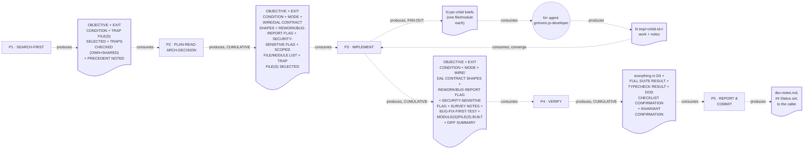

# Backend TS Developer — Quasi-Software View (five layers: NODES, PHASES, INTERNAL, PARALLELIZATION, EXPECTED OUTPUTS)

This is `grimorio.js-developer`'s own DRAWN quasi-software design view, produced per
ref:skill/grimorio.phase-splitting#the-agent-design-plans-drawn-view--a-hard-requirement-never-optional's
standing requirement that every agent-design plan carry one, saved alongside the agent's own design as a
reference file. It mirrors ref:skill/grimorio.go-developer-memory/go-developer-phases/go-developer-quasi-software-view.md's
own already-shipped five-section shape (a purpose-driven, non-hard-locked agent with a real own-type gated
fan-out, and the SAME structural simplifications go-developer's own view already states explicitly rather than
padded away: no loop-back edges — a defect Phase 4 finds is fixed inside that phase's own mini-loop, never by
re-entering an earlier phase file — and exactly ONE fan-out dispatch point, because this agent too has only ONE
VOLUME UNIT: one file/module per Haiku child, reachable only from Phase 3 (IMPLEMENT)). **This chain DIFFERS from
go-developer's own in one structural respect, stated here rather than silently copied: Phase 2 carries TWO
distinct early-exit nodes, not one** — go-developer's own chain has a single `COULD_NOT_P2` (missing-plan
refusal); this chain has that SAME node PLUS a second, differently-closed exit (`UI_STOP_P2`, Scope-Boundary
STOP, closing `VERIFIED`, never `COULD NOT`) that go-developer's own scope structurally cannot carry, since it
has no UI-adjacent boundary to hit. This file draws all layers directly from
ref:skill/grimorio.js-developer-memory/behavior.md and its five
ref:skill/grimorio.js-developer-memory/js-developer-phases/phase-1-search-first.md through
ref:skill/grimorio.js-developer-memory/js-developer-phases/phase-5-report-and-commit.md, all read in full THIS
pass, in the same authoring dispatch that wrote them; it changes none of their content.

## Layer 1 + 2 — NODES (the orchestration graph) and PHASES (the state machine)

```mermaid
flowchart TB
    P1["P1 · SEARCH-FIRST"] --> P2["P2 · PLAN-READ-<br/>ARCH-DECISION"]
    P2 --> P3["P3 · IMPLEMENT"]
    P3 --> P4["P4 · VERIFY"]
    P4 --> P5["P5 · REPORT &<br/>COMMIT<br/>(terminal)"]

    COULD_NOT_P2(["COULD NOT<br/>(missing-plan<br/>refusal)"])
    P2 -.->|"MISSING-PLAN CHECK<br/>fires — chain ends"| COULD_NOT_P2

    UI_STOP_P2(["VERIFIED<br/>(scope handed to<br/>ui-developer)"])
    P2 -.->|"SCOPE BOUNDARY CHECK<br/>= STOP — chain ends,<br/>never COULD NOT"| UI_STOP_P2

    CHILD_JS(("N× agent:<br/>grimorio.js-developer<br/>(haiku, one per<br/>file/module)"))
    P3 -.->|"GATE HELD — fan out,<br/>foreground, synchronous,<br/>ONE message"| CHILD_JS
    CHILD_JS -.->|"each child's own<br/>tmp/&lt;child-id&gt;/<br/>work + notes"| P3

    style CHILD_JS fill:#2a3a2a,stroke:#5a5
    style COULD_NOT_P2 fill:#3a2a2a,stroke:#a55
    style UI_STOP_P2 fill:#2a3a3a,stroke:#5aa
```

**Reading this diagram.** The solid rectangular spine (P1→P2→P3→P4→P5) is the STATE MACHINE — the five phase
files' own chain, per ref:skill/grimorio.phase-splitting#the-model--a-phase-is-a-mini-loop-state-with-three-fields.
**This chain carries NO loop-back edge, on purpose, mirroring go-developer's own chain** — a defect Phase 4 finds
during its own test/typecheck/invariant verification is fixed INSIDE Phase 4's own self-complete mini-loop
(plan→execute→check→iterate, per
ref:skill/grimorio.phase-splitting#the-two-universal-givens--true-of-every-phase-no-exceptions), never by
re-entering Phase 3's file. **Phase 2 carries TWO early exits, drawn as two visually distinct terminal nodes —
`COULD_NOT_P2` and `UI_STOP_P2` — never merged into one, because they close DIFFERENTLY**: `COULD_NOT_P2` fires
when the MISSING-PLAN CHECK refuses (no plan exists for judgement-bearing work) and closes `## Close: COULD
NOT`; `UI_STOP_P2` fires when the SCOPE BOUNDARY CHECK finds the task is genuinely a UI/presentation change and
closes `## Close: VERIFIED (scope correctly handed to ui-developer)` — a correct, intentional stop, never a
failure to plan or execute. Coloring `UI_STOP_P2` distinctly from `COULD_NOT_P2` (a cooler, non-alarm tone) is a
deliberate visual signal that these two dashed terminals do NOT mean the same thing, even though both end the
chain before Phase 3.

**The one circular agent-node, `CHILD_JS`, is the GRAPH layer's own contribution** — per
ref:skill/grimorio.loop-and-graph#3-the-graph--who-is-in-it-and-the-branch-rule — drawn in a shape visually
distinct from the five rectangular phase-nodes, the same convention `grimorio.go-developer`'s own `CHILD_GO`
node already establishes, so a reader tells a phase from a spawned agent at a glance. **This is a SINGLE node,
never two, because this agent has only ONE VOLUME UNIT reachable from ONE phase** — js-developer's own fan-out
gate lives entirely inside Phase 3's own FAN-OUT BRANCH: one file or module per Haiku child, and nowhere else in
the chain.

**The escalation ladder (`agent:grimorio.unblocker` / `agent:grimorio.entropy` / `agent:grimorio.adviser`) is
DELIBERATELY OMITTED from this diagram, stated here explicitly rather than silently dropped.** Unlike the
CHILDREN relationship above, this ladder is reachable from EVERY phase in the chain (Phase 0's own "Standing
awareness" section states this), not from one specific dispatch point — the same reasoning
ref:skill/grimorio.go-developer-memory/go-developer-phases/go-developer-quasi-software-view.md's own equivalent
section already states for its own chain, reused here rather than re-derived. Likewise, `agent:grimorio.security`
and `agent:grimorio.code-reviewer` — named in Phase 2's own SECURITY-SENSITIVE flag and Phase 5's own routing
note — are DELIBERATELY OMITTED too: this agent never spawns either; it only writes a routing NOTE into
`dev-notes.md` for the orchestrator or Gate B to act on, never a wired spawn edge of its own. **No other
future/not-wired agent-node belongs in this graph** — a full read of Phase 0 plus all five phase files surfaced
no language naming any agent this chain MAY one day lean on beyond the escalation ladder and the two report-only
routing mentions already addressed above, and the one CHILD node already drawn.

## Layer 3 — INTERNAL: per-phase artifact-flow (IN → OUT), half (a) only

**Grounding — shared across every quasi-view that draws this layer, not re-derived here:**
ref:skill/grimorio.phase-splitting/project.quasi-view-requirements.md#half-a--boundary-artifact-flow-unchanged.
Per this pass's own scope, only half (a) (boundary artifact-flow) is drawn for this chain — half (b) (per-phase
interior flowcharts + a KNOWN-ERRORS-TO-PHASE mapping) is optional per that same file and out of scope for this
pass, matching the exact scope the go-developer exemplar already ships at.

**This chain is ALMOST strictly linear — one single fan-out dispatch point inside P3, and TWO early-exit
boundaries off P2 rather than go-developer's own one — so its boundary count is the plain N-1 rule PLUS one
extra early-exit, stated explicitly rather than silently under-counted:**

- **FORWARD spine** (4 boundaries): P1↔P2, P2↔P3, P3↔P4, P4↔P5, plus P5's own terminal output to the caller.
- **FAN-OUT sub-flow** (2 boundaries, ONE pair, entirely INSIDE P3, never a phase-level boundary): P3↔CHILD_JS
  (N per-child briefs, one file/module each) and CHILD_JS↔P3 (N `tmp/<child-id>/work`+`notes` reports, converged
  by P3 itself before its own forward hand-off fires).
- **LOOP-BACK re-entries**: NONE — 0 boundaries, stated explicitly as a deliberate absence, not an omission.
- **EARLY-EXIT**: 2 boundaries (P2→`COULD_NOT_P2` and P2→`UI_STOP_P2`, per Layer 1+2's own two distinct terminal
  nodes, not separate doc nodes here) — Phase 2's own MISSING-PLAN CHECK can terminate the chain with `## Close:
  COULD NOT`, and its own SCOPE BOUNDARY CHECK can terminate it with `## Close: VERIFIED (scope handed to
  ui-developer)`, EITHER rather than handing off to P3 — both producing no artifact beyond the refusal/hand-off
  report already covered by P2's own DELIVERABLE (the UI_STOP path additionally writes `dev-notes.md` itself,
  named in P2's own step 5, not a separate node here).

The dotted edges here are the SAME visual convention as the fan-out edges in Layer 1+2 (both dashed there) but
carry a DIFFERENT meaning — "consumes"/"produces" (data moving), never "GATE HELD"/"STOP" (control moving) — the
identical DFD process-vs-flow separation every already-shipped quasi-view in this corpus already applies.

**`D2`, `D3`, and `D4` are labeled CUMULATIVE, not incremental — each doc node lists every field the NEXT phase
actually needs from ANY earlier phase, not only what the phase immediately upstream of it newly produced.** This
is the EXACT discipline this pass's own CARRY-FORWARD DISCIPLINE check applied against a confirmed measured gap
in the concurrent go-developer upgrade (that chain silently dropped MODE and its own bug-proving-test evidence
from some downstream hand-off lists) — MODE (Phase 2's own field) rides every doc node through to Phase 5, since
Phase 5's own step 2 needs it to decide Pipeline-vs-Standalone dev-note writing; BUG-FIX-FIRST-TEST (Phase 3's
own field) rides through `D4` because Phase 5's own Completion-criteria checklist re-confirms it is still
green; WIRE/DAL CONTRACT SHAPES, REWORK/BUG-REPORT FLAG, and SECURITY-SENSITIVE FLAG (all Phase 2's own fields)
ride through `D3` and `D4` for Phase 5's own `## Contracts` section, its `### REWORK Cycle {N}` step, and its
own security routing note, respectively; SURVEY NOTES (Phase 3's own field) rides through `D4` for Phase 5's own
`## Abstractions Reused` section. Grounded in
ref:skill/grimorio.phase-splitting#progressive-revelation--a-hard-mechanical-requirement-never-judgment's own
"ALWAYS restate, inside a later phase's own file, any fact that phase depends on" rule — this diagram draws that
rule's effect, it does not invent a new one.

**The full field → origin-phase → last-consumer table**, built before any phase file's own Hard hand-off text
was written, and checked against every one of them:

| Field | Origin | Last consumer | Forwarded through |
|---|---|---|---|
| OBJECTIVE | P1 | P5 | P2, P3, P4 |
| EXIT CONDITION | P1 | P5 | P2, P3, P4 |
| TRAP FILE(S) SELECTED | P1 | P3 (reactive consult) | P2 |
| TRAPS CHECKED (OWN) | P1 | P2 | — |
| TRAPS CHECKED (SHARED) | P1 | P2 | — |
| PRECEDENT NOTED | P1 | P2 | — |
| HARNESS LOOKUP DONE | P2 | P2 | — |
| MODE | P2 | P5 (Pipeline/Standalone decision) | P3, P4 |
| CONTRACT READ | P2 | P2 | — |
| SCOPE BOUNDARY CHECK | P2 | P2 (gate) | — |
| MISSING-PLAN CHECK | P2 | P2 (gate) | — |
| WIRE/DAL CONTRACT SHAPES | P2 | P5 (`## Contracts`) | P3, P4 |
| REWORK/BUG-REPORT DETECTED | P2 | P5 (`### REWORK Cycle`) | P3, P4 |
| SECURITY-SENSITIVE FLAG | P2 | P5 (routing note) | P3, P4 |
| SCOPED FILE/MODULE LIST | P2 | P3 | — |
| TRAPS/PRECEDENT CONSUMED | P2 | P2 | — |
| ROUTE | P3 | P3 | — |
| SURVEY NOTES | P3 | P5 (`## Abstractions Reused`) | P4 |
| RISKY-ZONE CONSULTED | P3 | P3 | — |
| BUG-FIX-FIRST-TEST | P3 | P5 (Completion criteria) | P4 |
| DECOMPOSE DECLARATION | P3 | P3 | — |
| FAN-OUT DECISION | P3 | P3 | — |
| MODULE(S)/FILE(S) BUILT | P3 | P5 (`## Changes Made`) | P4 |
| DIFF SUMMARY | P3 | P5 (`## Changes Made`) | P4 |
| FULL SUITE RESULT | P4 | P5 (Close evidence) | — |
| TYPECHECK RESULT | P4 | P5 (Close evidence) | — |
| DOD CHECKLIST CONFIRMATION | P4 | P5 (Close evidence) | — |
| INVARIANT CONFIRMATION | P4 | P5 (Close evidence) | — |
| ITERATIONS (IF ANY) | P4 | P4 | — |
| ALL FOUR CONFIRMED | P4 | P4 | — |

**Every row above whose "Last consumer" column names a phase OTHER than its own "Origin" phase was verified,
this pass, to actually appear in every intermediate phase file's own Hard hand-off "carrying forward:" list on
the way there — not only in the immediately-next phase's list.** MODE and BUG-FIX-FIRST-TEST specifically (the
two fields the concurrent go-developer upgrade dropped) were checked against P2→P3, P3→P4, and P4→P5 individually,
each confirmed present.

## Layer 4 — PARALLELIZATION: ONE genuine dispatch point, everywhere else sequential

**This chain is sequential end-to-end at the STATE MACHINE level — P1 → P2 → P3 → P4 → P5, one phase at a time,
never two phases running concurrently.** This chain carries exactly ONE parallelism point:

1. **Inside P3's own FAN-OUT BRANCH: WHEN the volume-fan-out ladder's step-1 gate holds, P3 raises N `haiku`
   children — one per file/module — in ONE message, foreground, synchronous, per**
   ref:skill/grimorio.fan-out#the-volume-fan-out-ladder--when-an-agent-fans-out-n-children-of-its-own-type-six-step-algorithm's
   **own step 3, and blocks until every child returns before its own next-phase read (P4) fires.**

**No other node in this chain carries a parallelism question of its own.** P1, P2, P4, and P5 are each a single
SELF node by their own step 1 (no spawn, ever) — this includes P2's own TWO early-exit branches, both of which
are still a single SELF node's own two possible outcomes, never a second parallel path. **P5 is the SOLE writer
of `dev-notes.md`** — per
ref:skill/grimorio.phase-splitting/project.flow-method.md#b-modifying-phases-stay-sequential ("many may ADVISE
it, but only ONE phase WRITES"), P5 stays sequential and terminal, EXCEPT for the one narrow case where P2's own
UI_STOP branch writes `dev-notes.md` itself (a partial, single-section write — `## Contracts` plus the closing
Status/Close lines — never the full template P5 owns) because the chain ends there before P5 is ever reached;
this is not a second writer of the SAME artifact in the concurrency sense Rule 8(b) governs, because the two
never run in the same invocation — P2's UI_STOP write and P5's full write are mutually exclusive outcomes of one
sequential chain, never two writers racing the same file.

## Layer 5 — EXPECTED OUTPUTS: WORK vs ORCHESTRATION, per phase

**The distinction this layer draws, kept separate from Layer 3 above: Layer 3 shows the DATA that crosses a
phase boundary — what the next phase literally reads. This layer shows the RESULT that phase's own WORK exists
to produce.**

| Phase | WORK PRODUCT (what the phase's own action produces) | ORCHESTRATION ACT (what it then routes, and to whom) |
|---|---|---|
| P1 · SEARCH-FIRST | OBJECTIVE/EXIT CONDITION, the trap-file selection + a targeted search result against it and this project's own developer trap log (shared), and any adjacent precedent noted | Hands to P2 unconditionally — never spawns |
| P2 · PLAN-READ-ARCH-DECISION | MODE (Pipeline/Standalone), the contract actually read, the Scope Boundary call, the scoped file/module list, the wire-contract shapes, the missing-plan refusal call, the SECURITY-SENSITIVE flag, REWORK/bug-report detection | Hands to P3 unconditionally, UNLESS the Scope Boundary STOP fired (chain ends, `## Close: VERIFIED`, dev-notes.md written) OR the missing-plan refusal fired (chain ends, `## Close: COULD NOT`) — never spawns |
| P3 · IMPLEMENT | On FIRST-PASS: the survey + WHEN a risky zone is touched a reactive trap-file consultation + WHEN flagged the failing-test-first sequence + the decomposition + fan-out gate decision + the actual TS file(s)/module(s) built. On CHILD: the same reactive trap-file consultation, scoped to its own item, + the single assigned file/module | Hands to P4 unconditionally on FIRST-PASS — spawns N `CHILD_JS` only when the gate holds — CHILD route reports to the parent, never reads P4 |
| P4 · VERIFY | The full test-suite result, the typecheck result, the per-item Definition-of-Done confirmation, the per-invariant confirmation, the re-confirmed bug-proving test — any failure fixed and re-checked WITHIN this phase's own mini-loop before it hands off | Hands to P5 unconditionally — never spawns, never re-enters P3 |
| P5 · REPORT & COMMIT | `dev-notes.md` (Pipeline mode) or an inline report (Standalone), the security routing note WHEN flagged, the commit action taken, any REWORK-cycle section, the `## Status`/`## Close` values | Terminal — reports to the caller, no further phase, no loop-back |

## Evidence of phase-design reasoning — the RENDER/GROUP/MEASURE working product, saved

Per
ref:skill/grimorio.phase-splitting/project.quasi-view-requirements.md#evidence-of-phase-design-reasoning--save-the-rendergroupmeasure-working-product-never-discard-it-silently,
this section restates, as a durable saved artifact rather than a claim taken on faith, the sizing reasoning
`grimorio.system-keeper` already performed (its own DIAGNOSIS/PLACEMENT decision, finalizing the pre-supplied,
independently-reasoned diagnosis verdict it extended,
this project's own branch-objective record for this agent's phase design, WITH TWO CORRECTIONS stated below), both
read in full this pass and inlined here rather than left as a pointer into scratch that will not survive past
this session.

**RENDER — the complete load, before any grouping.** The pre-split shell (`grimorio.js-developer.md`) carried
its own IDENTITY-section prose (the "You are an expert TypeScript developer..." paragraph — unchanged by this
pass, per this dispatch's own explicit instruction) plus a flat Behavior block naming TWO files executed
together, every invocation, plus a 10-entry flat Knowledge list: `agent-selection`, `code-harness`,
`objective-harness`, `working-memory`, `developer-memory`, `js-developer-memory`, `javascript`,
`development-patterns`, `feature-workflow`, `fan-out` (fan-out's own VOLUME UNIT rule stated inline in the
Knowledge bullet itself, duplicating what `grimorio.fan-out`'s own skill content already states — an L4
duplication finding, resolved by this rewrite the same way `grimorio.go-developer`'s own rewrite resolved its
own analogous duplication). The two full behavior files executed together: `developer-memory/project.build-
protocol.md` (~191 lines: harness lookup, survey-before-writing, fan-out gate, missing-plan refusal, comments
rule, commit-by-isolation, bug-report order, foreground-test rule, pipeline/standalone mode, OUTPUT template,
REWORK mode, harness/trap-capture) and `js-developer-memory/behavior.md` (~129 lines: a flat 6-step `## Steps`
list, a Scope Boundary hard-rule block with an embedded UI-STOP + security-routing rule, a Pipeline-artifacts
section, a 6-item Self-check gate, `## OUTPUT` + a full worked dev-notes example, an 8-item Definition of Done,
and a 2-item `## Rules` block). A contract-reading sub-step did not need `grimorio.javascript`/
`development-patterns`/`fan-out` loaded in full at that moment — yet all three were mandatory-imported
regardless of which of the 6 original steps was actually executing. This is the exact flat-mega-load
anti-pattern ref:skill/grimorio.phase-splitting names by construction, not by inference — independently
re-confirmed this pass by reading both behavior files and the shell's own Knowledge list in full, not taken from
the pre-supplied verdict's own count alone. **This pass ALSO opened two files the pre-supplied verdict's own
"Sources read" list never opened**: this agent's own primary trap log (540 lines / 48,289 bytes) and
this agent's own runner-node trap log (73 lines / 6,317 bytes), both re-measured live via `wc -l`/`wc -c`
this pass, not trusted from the brief's own stated figures alone — the evidence behind Correction 1 below.

**GROUP — five candidates, all clearing the bar, none rejected outright, TWO deliberate CORRECTIONS applied
against the pre-supplied verdict's own six-candidate framing, both stated here with their reasoning, never
silently applied.**

**Correction 1 — SEARCH-FIRST is its own STANDALONE phase, never merged into intake.** The pre-supplied
verdict's own text proposed `PLAN-READ (SEARCH-FIRST + intake)` as ONE merged phase. This design overrides that:
this agent's own trap corpus (its own primary trap log, 540 lines/48,289 bytes, PLUS its own runner-node trap
log, 73 lines/6,317 bytes — a combined ~613 lines/54,606 bytes across the two-file split this agent alone
carries) is comparable in size to `grimorio.go-developer`'s own single trap log (591 lines/54,604 bytes, re-measured this pass, not
trusted from memory) — the exact corpus size that already justified go-developer's own standalone Phase 1
(SEARCH-FIRST), on the grounds that the traps corpus is a genuinely NON-OVERLAPPING knowledge slice from
`arch-decision.md` contract-reading. The pre-supplied verdict's own "Sources read" list never opened either
js-developer trap file, so it never weighed this evidence — this is a legitimate, evidenced correction, not a
deviation hidden from the record.

**Correction 2 — BUG-REPRODUCTION is THREADED INSIDE the IMPLEMENT phase, never its own phase node.** The
pre-supplied verdict proposed a standalone `[BUG-REPRODUCTION, conditional]` phase. This design overrides that
too, on TWO grounds: (a) the orchestrating brief explicitly instructed that the BUG-REPRODUCTION conditional and
the fan-out gate belong THREADED inside the chain, not as ceremony phases; (b) independently, the
knowledge-boundary test the pre-supplied verdict itself under-applied here: proving a bug (writing the failing
test) and fixing it draw on the IDENTICAL JS/TS testing+code knowledge domain — there is no JIT-knowledge
boundary crossed between the two, exactly the same reasoning `grimorio.go-developer`'s own shipped Phase 3
already applies to the identical shared build-protocol section, for a sibling agent.

(1) SEARCH-FIRST: a targeted search against the selected one/both of this agent's own two trap logs (this
agent's own two-file trap split — the file-selection step itself a genuine judgment call go-developer's single
trap log never required) and this project's own developer trap log — CURRENTLY ABSENT from the pre-split shell,
closed by this design; kept STANDALONE per Correction 1 above; the hand-off is a real Unix-pipe (the traps/
precedent list is CONSUMED by the contract-read, "so the contract-read is not done blind to prior gotchas"). (2)
PLAN-READ-ARCH-DECISION: `arch-decision.md` + wire/DAL contracts, the wire-contract mirroring rule, this
project's hard-invariant list, the missing-plan refusal pattern, pipeline-vs-standalone mode, the upward
harness-lookup walk (this IS the chain's first file-reading/scoping phase), PLUS TWO js-developer-only steps
`grimorio.go-developer`'s own analogous phase does not carry at all: the Scope Boundary STOP check (a genuine
early-exit gate, never folded quietly into the missing-plan check) and the SECURITY-SENSITIVE flag (auth/
session/BOLA routing) — none of this needs javascript/development-patterns/fan-out/Definition-of-Done knowledge,
a materially different slice from every other candidate. (3) IMPLEMENT (incl. the CONDITIONAL
WRITE-FAILING-TEST-ON-A-BUG sub-step + the threaded fan-out gate, BOTH kept INSIDE this one phase per Correction
2 above, never split out): javascript (read first), development-patterns, the fan-out volume-ladder (4-step gate
+ declare-if-solo obligation), the reactive trap-file consult — the single heaviest cluster rendered (~8 distinct
items across 3 knowledge skills plus the reactive traps load), a plausible pincho on its own, but the
CHILDREN-OFFLOAD mechanism already built into it (fan out one Haiku child per file/module) is exactly the
sanctioned relief valve ref:skill/grimorio.phase-splitting#sizing-a-phase--render-group-measure-split-the-pincho-check's
own Sizing section names for a heavy-but-genuinely-one-mission group, so it does not need a further internal
split beyond what the fan-out gate already provides. (4) VERIFY: the Definition-of-Done 8-item checklist itself
(relocated here verbatim from the pre-split `behavior.md`'s own "Definition of Done" section), the hard-invariant
list, the foreground-test-execution rule, PLUS re-confirming the bug-proving test still passes — none of
javascript's authoring conventions, development-patterns' layer-placement rules, or fan-out's ladder is needed
here; this phase reads and checks, it does not write new code shape. (5) REPORT & COMMIT: the shared OUTPUT
template, the worktree-isolation commit-discipline branch (2 rules), REWORK-mode shape, the BLOCKED-on-ambiguity
rule, the harness-mode trap-capture obligation, PLUS the SECURITY-SENSITIVE routing note (a js-developer-only
addition go-developer's own Phase 5 does not carry) — none of javascript/development-patterns/testing knowledge
is needed to WRITE this artifact, only to have already produced the facts it reports.

**MEASURE — a rendered count per group, no pincho found beyond the one already-relieved by CHILDREN-OFFLOAD.**
Group IMPLEMENT carries ~8 rendered items across 3 knowledge sources (`grimorio.javascript`,
`grimorio.development-patterns`, `grimorio.fan-out`'s own ladder) plus the reactive two-file trap consult — not
split further; splitting it would reproduce the exact measured `grimorio.prompt-writer` over-splitting incident
this skill names explicitly (a single coherent judgment call — "build/fix this correctly" — fragmented when only
the WHOLE group is one mission). No other group carries a multiple of its siblings' load: Group SEARCH-FIRST and
Group PLAN-READ-ARCH-DECISION each carry 2-5 distinct knowledge/check items, genuinely non-overlapping with
IMPLEMENT's own three-plus-traps; Group VERIFY carries 2 knowledge sources (the hard-invariant list, the
foreground-test rule) plus the DoD checklist itself and a genuine internal mini-loop (fix-and-rerun on any check's
failure), never a subset of an earlier group; Group REPORT & COMMIT carries 5 threaded build-protocol sections
plus the security-routing addition, all reporting/hand-off conventions no earlier phase touches.

**Against the pincho check and CHILDREN-OFFLOAD.** The pre-split file's flat 6-step list already carried five
genuinely separate missions once regrouped (SEARCH — absent —, PLAN, IMPLEMENT, VERIFY, REPORT) with no
fused-overload comparable to a measured 5×-sibling pincho elsewhere in this corpus. CHILDREN-OFFLOAD was
considered for IMPLEMENT's own volume and found the CORRECT remedy, not an additional one: the phase already
performs CHILDREN-OFFLOAD via its own FAN-OUT BRANCH, for the actual build volume once the scope is known — this
IS the mechanism, threaded through the one phase that actually produces volume, never given a phase of its own.

**Coverage — every rendered item placed, self-disclosed rather than smoothed over.** All 10 skills from the
RENDER inventory above land in exactly one or more phase groups, or are correctly THREADED rather than dropped:
`agent-selection` → dropped from a full corpus `import:` entirely, kept only as a lazy `ref:` from Phase 0's own
"Standing awareness" section (the escalation-ladder anchor) plus Phase 2/Phase 5's own security-routing anchor —
mirroring exactly how `grimorio.go-developer`'s own rewrite treats this same skill (never in its RENDER inventory
as a full import either, cited only lazily where its escalation-ladder content is actually needed). `code-harness`
→ Phase 2 only (the upward lookup, this chain's first file-reading/scoping phase). `objective-harness` → dropped
from this agent's own knowledge chain entirely by this redesign, for the identical reason
`grimorio.go-developer`'s own redesign already dropped it: it governs branch-open/close mechanics external to
this agent's own build loop, never cited by the pre-split behavior file's own Steps either. `working-memory` →
Phase 3 (the per-child `tmp/<child-id>/` folder convention, its own single FAN-OUT BRANCH). `developer-memory` →
splits across every phase via the threaded build-protocol table (Phase 0's own attachment table) plus Phase 1's
own developer-trap-log search plus Phase 2's own developer-memory scope/invariant pointers plus
Phase 4's own re-use of the invariant pointer plus Phase 5's own trap-capture confirmation. `js-developer-memory`
(this agent's own two-file trap split) → Phase 1 (the proactive search, WITH the two-file
selection step this agent alone requires) and Phase 3 (the reactive risky-zone consultation), plus Phase 5's own
capture confirmation. `javascript` → Phase 3 only, read first. `development-patterns` → Phase 3 only.
`feature-workflow` → dropped from the phase-chain's own per-phase LOAD, same as `objective-harness`: the
pre-split behavior file never cited it either, and this project's own artifact-directory structure is already
covered by the threaded `build-protocol.md`'s own Pipeline-vs-Standalone/OUTPUT sections (Phases 2 and 5),
mirroring `grimorio.go-developer`'s own identical drop of this same skill. `fan-out` → Phase 3 only (the volume-
fan-out ladder, its own single FAN-OUT BRANCH) — never Phase 4/5, which never spawn.
