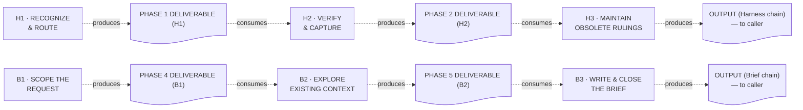

# Product Owner — Quasi-Software View (STATE MACHINE + LOOP + GRAPH, plus INTERNAL — both halves)

This is `grimorio.po`'s own DRAWN quasi-software design view, produced per
ref:skill/grimorio.phase-splitting#the-agent-design-plans-drawn-view--a-hard-requirement-never-optional's
standing requirement that every agent-design plan carry one, saved alongside the agent's own design as a
reference file. PO's own six phase files, authored this same pass under
`.claude/skills/grimorio.po-memory/po-phases/`, plus Phase 0
(`.claude/skills/grimorio.po-memory/behavior.md`), ARE the state machine — this file draws every layer directly
from those seven files, read in full for this pass; it changes none of their content.

Unlike its own precedent at
ref:skill/grimorio.agent-writing/system-keeper-phases/system-keeper-quasi-software-view.md#the-five-layers-at-a-glance-and-where-each-is-drawn,
PO's own chain carries no PARALLELIZATION or EXPECTED-OUTPUTS layer here — those two are not part of this pass's own required
content, and are not invented to match a heavier precedent's own shape. This file holds exactly the three-layer
hard minimum (STATE MACHINE + LOOP + GRAPH, one diagram) plus the INTERNAL layer, BOTH halves — boundary
artifact-flow (half a) and per-phase interior behavior plus a KNOWN-ERRORS-TO-PHASE mapping (half b) — never
silently matching a bigger agent's own five-layer shape (NODES/PHASES/INTERNAL/PARALLELIZATION/EXPECTED-OUTPUTS)
where PO's own chain does not carry that weight. INTERNAL is the one additional layer PO's own chain does carry,
drawn here in full per
ref:skill/grimorio.phase-splitting/project.quasi-view-requirements.md#layer-4--internal-when-drawn-both-halves-are-owed-never-boundary-flow-alone's
own unconditional "MUST draw BOTH... never the first alone" — not a lighter partial version scaled down to this
chain's own smaller size.

## The diagram

```mermaid
flowchart TB
    P0["PHASE 0 · ENTRY<br/>(behavior.md)"]
    P0 -->|"WHEN Harness mode<br/>declared"| H1["H1 · RECOGNIZE<br/>&amp; ROUTE"]
    P0 -->|"WHEN Brief mode<br/>declared"| B1["B1 · SCOPE THE<br/>REQUEST"]

    H1 -->|"hands: recognized<br/>statement + routing target"| H2["H2 · VERIFY<br/>&amp; CAPTURE"]
    H2 -->|"hands: the diff (what<br/>changed in the routing<br/>target)"| H3["H3 · MAINTAIN<br/>OBSOLETE RULINGS<br/>(terminal)"]

    B1 -->|"hands: the scoped<br/>request"| B2["B2 · EXPLORE<br/>EXISTING CONTEXT"]
    B2 -->|"hands: scoped request<br/>+ contrast findings"| B3["B3 · WRITE &amp; CLOSE<br/>THE BRIEF<br/>(terminal)"]

    SCOUT1(("grimorio.scout"))
    H3 -.->|"WHEN the obsolete-ruling<br/>sweep needs more than a<br/>direct grep — MAY fire,<br/>optional"| SCOUT1
    SCOUT1 -.->|"report back"| H3

    SCOUT2(("grimorio.scout"))
    B2 -.->|"WHEN the codebase search<br/>is wider than a direct<br/>lookup — MAY fire, optional"| SCOUT2
    SCOUT2 -.->|"report back"| B2

    style SCOUT1 fill:#2a3a2a,stroke:#5a5
    style SCOUT2 fill:#2a3a2a,stroke:#5a5
```

**Reading this diagram.** The two solid edges leaving `P0` ARE the two-entry-point structural decision, drawn
as branching FROM Phase 0, never as two disconnected diagrams — mode is CALLER-DECLARED before Phase 0's own
chain ever runs, per `behavior.md`'s own "Hard hand-off — two entry points, caller-declared" section, so `P0`
itself makes no decision; it only routes to whichever of `H1`/`B1` the caller's own declared mode already
named. The Harness spine (`H1 → H2 → H3`) and the Brief spine (`B1 → B2 → B3`) are each the STATE MACHINE axis,
per ref:skill/grimorio.phase-splitting#the-model--a-phase-is-a-mini-loop-state-with-three-fields, drawn as solid
forward edges carrying each hand-off's own content, verbatim, as its label. `SCOUT1` and `SCOUT2` are the GRAPH
layer's own agent-nodes, per ref:skill/grimorio.loop-and-graph#3-the-graph--who-is-in-it-and-the-branch-rule,
drawn circular — visually distinct from every rectangular phase-node — and dashed, since both are PO's own two
live CHILDREN-relationship boundaries: conditional, optional, never a requirement. They are drawn as two
separate nodes, never one shared node reused across both chains, because they fire independently, at different
phases, in different chains, on different triggers.

## The LOOP layer — a real, checked finding: neither chain carries one

**NEITHER chain carries a chain-level loop-back edge — no phase in either spine repeats.** This is a checked
finding, not a silent omission: `H1`, `H2`, `B1`, and `B2` each hand off forward exactly once, unconditionally,
to the next phase in their own spine; nothing in any of the six phase files' own text routes backward to an
earlier phase. Each TERMINAL phase (`H3`, `B3`) instead carries its OWN internal self-check gate as a
phase-local mini-loop — plan → execute → check, per
ref:skill/grimorio.phase-splitting#the-two-universal-givens--true-of-every-phase-no-exceptions's own "every phase
is its own self-complete mini-loop" given — rather than a back-edge to an earlier phase: `H3`'s own
"Self-check gate (Harness chain)" and `B3`'s own "Quality Checklist" are both this same shape, confirmed
internally, before either terminal phase closes VERIFIED or COULD NOT, never by looping back to `H1`/`B1` to
redo earlier work.

## Layer 4 — INTERNAL: boundary-artifact-flow (half a) + per-phase interior behavior (half b) — both drawn

**Grounding — shared across every quasi-view that draws this layer, extracted once, not restated here:**
ref:skill/grimorio.phase-splitting/project.quasi-view-requirements.md#half-a--boundary-artifact-flow-unchanged.

Four boundary artifacts (`H1↔H2`, `H2↔H3`, `B1↔B2`, `B2↔B3`) plus each terminal phase's own final `## OUTPUT`
going to the caller — never `P0→H1`/`P0→B1` as a fifth and sixth boundary, since Phase 0 produces no
DELIVERABLE of its own to hand off; it only routes the caller's raw request forward unchanged.

**Correction, against CURRENT repo state, not a stale citation — this file previously declined half (b) here by
quoting `project.quasi-view-requirements.md`'s own now-STALE line that "two shipped quasi-views already draw
half (a)... neither yet draws half (b)... a separate, later dispatch, out of scope here," and calling that "the
SAME scope choice" this file was making.** Re-checked directly against both cited files this pass, not assumed:
`ref:skill/grimorio.agent-writing/system-keeper-phases/system-keeper-quasi-software-view.md` now carries a full
"### Half (b) — per-phase interior behavior + KNOWN-ERRORS-TO-PHASE mapping" section (seven per-phase
flowcharts, P1 through P7, plus a Known-Errors-To-Phase table), and
`ref:skill/grimorio.agent-writing/prompt-writer-phases/prompt-writer-quasi-software-view.md` carries the identical
shape for its own six phases. **Both citations that justified deferring half (b) here no longer support that
claim — the deferral this file stated was never independently true of PO's own chain, it was borrowed reasoning
from two files that have since moved on.** Rather than re-justify a divergence PO's own chain does not actually
need — its six phases are lighter than either precedent's, but ref:skill/grimorio.phase-splitting/project.quasi-view-requirements.md#layer-4--internal-when-drawn-both-halves-are-owed-never-boundary-flow-alone's
own "MUST draw BOTH... never the first alone" carries no proportionality exception for a lighter chain to invoke
— this file now closes the gap directly: half (b) is drawn below, for real, against PO's own six phase files'
current text, never invented or borrowed from either precedent's own shape.

### Half (b) — per-phase interior behavior + KNOWN-ERRORS-TO-PHASE mapping

Half (a) above answers only "what crosses each boundary" — it says nothing about what a phase DOES to earn that
hand-off, and draws IDENTICALLY whether the six phases behind it are well-designed or gutted. Per
ref:skill/grimorio.phase-splitting/project.quasi-view-requirements.md#half-b--per-phase-interior-behavior-new's own
FORM mandate, this section closes that gap with SIX per-phase mermaid flowcharts (one per phase, H1/H2/H3/B1/B2/B3)
— never a markdown table, the SPECIFIC forbidden render for per-phase steps and decision logic: a table INFORMS a
reader that steps exist but never OBLIGES them to see the actual control flow, while a flowchart is drawable and
traceable node-by-node, so an omitted branch shows up as a missing EDGE rather than as a row a careful reader
happened to notice was gone. **Table 2 below (the KNOWN-ERRORS-TO-PHASE mapping, immediately after the six
flowcharts) stays a TABLE, unchanged in form** — that render was never the forbidden one; only the per-phase
steps/decision-logic render was. **ALWAYS read every flowchart below as sourced FROM the six phase files' own
current text** (including this same dispatch's own reordering fix to H1, drawn fresh against the corrected
file, never against its pre-fix shape) **, never as a paraphrase. WHEN this section and the live phase files
ever disagree ⟶ re-derive the flowcharts fresh against the files, the next time this section is drawn or
redrawn — the files govern, never this diagram's own prior wording.**

**H1 · RECOGNIZE & ROUTE**

```mermaid
flowchart TB
    S1["Step 1 — state the graph:<br/>SELF — lightly recognize,<br/>grep the identified<br/>candidate, then formally<br/>route; no spawn"] --> S2["Step 2 — BEFORE anything<br/>else ⟶ state OBJECTIVE<br/>(verbatim) + EXIT CONDITION"]
    S2 --> S3["Step 3 — lightweight<br/>recognize: settled decision<br/>vs vision/roadmap/ambition<br/>vs Grimorio meta-vision —<br/>names a CANDIDATE file only"]
    S3 --> S4["Step 4 — BEFORE routing or<br/>writing anything ⟶ grep that<br/>candidate file (SEARCH-FIRST,<br/>grimorio-conduct rule 22) —<br/>state what was found"]
    S4 --> S5{"Step 5 — route, confirmed<br/>against the grep: which<br/>kind?"}
    S5 -->|"settled product<br/>decision"| R1["project.md"]
    S5 -->|"product vision /<br/>roadmap / ambition"| R2["project.vision.md"]
    S5 -->|"Grimorio meta-system's<br/>own vision (NOT product)"| R3["project.grimorio-vision.md<br/>(provisional)"]
    R1 --> EXIT1
    R2 --> EXIT1
    R3 --> EXIT1
    EXIT1(["→ H2 · VERIFY &amp; CAPTURE"])

    classDef exit fill:#2a2a3a,stroke:#668,stroke-dasharray: 3 3
    class EXIT1 exit
```

**H2 · VERIFY & CAPTURE**

```mermaid
flowchart TB
    T1["Step 1 — state the graph:<br/>SELF — verify source, write<br/>entry, resolve Currency; no<br/>spawn"] --> T2{"Step 2 — BEFORE marking<br/>SIGNED/ACCEPTED/DECIDED —<br/>custody check: cited source<br/>is a tmp/ path?"}
    T2 -->|"YES, item still<br/>OPEN, not yet signed"| T2a["legal — tmp/ citation<br/>stands as-is"]
    T2 -->|"YES, marking SIGNED<br/>now"| T2b["migrate the verbatim<br/>substance into the project's<br/>own long-form docs FIRST,<br/>then cite the migrated path"]
    T2 -->|"NO — already a real,<br/>tracked doc"| T2c["cite directly"]
    T2a --> T3
    T2b --> T3
    T2c --> T3
    T3["Step 3 — ALWAYS write the<br/>entry into H1's own routing<br/>target, capturing exactly<br/>what H1 recognized"] --> T4{"Step 4 — resolve Currency,<br/>same session: obvious /<br/>straightforward / genuinely<br/>ambiguous?"}
    T4 -->|"obvious superseded<br/>fact"| T4a["DELETE on sight"]
    T4 -->|"straightforward<br/>update"| T4b["UPDATE in place to<br/>the final state"]
    T4 -->|"genuinely ambiguous<br/>— cannot tell which is<br/>now true"| T4c["ESCALATE to the<br/>user — never guess"]
    T4a --> EXIT2
    T4b --> EXIT2
    T4c --> EXIT2
    EXIT2(["→ H3 · MAINTAIN<br/>OBSOLETE RULINGS"])

    classDef exit fill:#2a2a3a,stroke:#668,stroke-dasharray: 3 3
    class EXIT2 exit
```

**H3 · MAINTAIN OBSOLETE RULINGS (terminal)**

```mermaid
flowchart TB
    U1["Step 1 — state the graph:<br/>SELF (sweep) → OPTIONAL<br/>scout → SELF (update +<br/>close); name explicitly<br/>whether scout fires"] --> U2["Step 2 — ALWAYS sweep the<br/>corpus for any earlier<br/>ruling this entry makes<br/>wrong; update it in the<br/>SAME pass"]
    U2 --> U3{"Step 3 — sweep needs<br/>more than a direct grep?"}
    U3 -->|"YES"| U3a["MAY raise ONE bounded,<br/>optional grimorio.scout,<br/>tiered — never Opus for a<br/>grunt"]
    U3 -->|"NO"| U3b["direct grep alone<br/>sufficient — no scout"]
    U3a --> U4
    U3b --> U4
    U4["Self-check gate — BEFORE<br/>closing VERIFIED, confirm<br/>ALL SIX separately:<br/>objective/exit stated first,<br/>routed to the right file,<br/>custody check ran before<br/>signed, Currency resolved<br/>with no superseded fact left,<br/>every obsolete ruling updated,<br/>file reads as current truth"] --> TERM(["CLOSE — VERIFIED or<br/>COULD NOT (terminal, no<br/>H4)"])

    classDef exit fill:#2a2a3a,stroke:#668,stroke-dasharray: 3 3
    class TERM exit
```

**B1 · SCOPE THE REQUEST**

```mermaid
flowchart TB
    V1["Step 1 — state the graph:<br/>SELF — scope, clarify; no<br/>spawn. SEARCH-FIRST: ALWAYS<br/>read project.md FIRST — has a<br/>similar feature/brief been<br/>ruled on before?"] --> V2["Step 2 — BEFORE writing the<br/>brief ⟶ state OBJECTIVE +<br/>EXIT CONDITION"]
    V2 --> V3{"Step 3 — request is<br/>vague?"}
    V3 -->|"YES"| V3a["identify what's missing:<br/>actor / behavior / done /<br/>out-of-scope"]
    V3 -->|"NO"| V4
    V3a --> V4
    V4["Step 4 — ALWAYS batch every<br/>clarifying question into ONE<br/>round (max ~5), then continue<br/>immediately"] --> EXIT4(["→ B2 · EXPLORE<br/>EXISTING CONTEXT"])

    classDef exit fill:#2a2a3a,stroke:#668,stroke-dasharray: 3 3
    class EXIT4 exit
```

**B2 · EXPLORE EXISTING CONTEXT**

```mermaid
flowchart TB
    W1["Step 1 — state the graph:<br/>SELF (search) → OPTIONAL<br/>scout → SELF (receive); name<br/>explicitly whether scout<br/>fires"] --> W2{"Step 2 — mode?"}
    W2 -->|"NORMAL, request<br/>references existing<br/>behavior"| W2a["search the codebase,<br/>contrast current vs desired"]
    W2 -->|"LIGERO"| W2b["read only what the<br/>prompt names"]
    W2a --> W3
    W2b --> W3
    W3{"Step 3 — search wider<br/>than a direct lookup?"}
    W3 -->|"YES"| W3a["MAY raise ONE bounded,<br/>optional grimorio.scout,<br/>tiered — never Opus for a<br/>grunt"]
    W3 -->|"NO"| W4
    W3a --> W4
    W4{"Step 4 — LIGERO mode, OR<br/>genuinely greenfield with<br/>nothing to contrast?"}
    W4 -->|"YES"| W4a["contrast findings<br/>legitimately EMPTY — state<br/>plainly, never invent one"]
    W4 -->|"NO"| W4b["real contrast findings<br/>produced"]
    W4a --> EXIT5
    W4b --> EXIT5
    EXIT5(["→ B3 · WRITE &amp; CLOSE<br/>THE BRIEF"])

    classDef exit fill:#2a2a3a,stroke:#668,stroke-dasharray: 3 3
    class EXIT5 exit
```

**B3 · WRITE & CLOSE THE BRIEF (terminal)**

```mermaid
flowchart TB
    X1["Step 1 — state the graph:<br/>SELF — write the brief,<br/>close; no spawn"] --> X2["Step 2 — ALWAYS write<br/>po-brief.md: Gherkin stories<br/>(happy path + ≥1 error/edge<br/>case), testable acceptance<br/>criteria, named UI states,<br/>Out of Scope"]
    X2 --> X2b{"listing a Blocker?"}
    X2b -->|"YES"| X2b1{"genuine EXTERNAL blocker<br/>— subscription, business<br/>decision, missing design?"}
    X2b1 -->|"YES"| X2b1a["list it"]
    X2b1 -->|"NO — an internal<br/>question PO could have<br/>resolved itself"| X2b1b["NEVER list it — resolve<br/>it up front instead, per<br/>Phase 0's Core rule 3"]
    X2b -->|"NO"| X3
    X2b1a --> X3
    X2b1b --> X3
    X3{"Step 3 — set Status"}
    X3 -->|"complete, no<br/>blockers"| X3a["DONE"]
    X3 -->|"a blocker needs a<br/>human decision"| X3b["BLOCKED"]
    X3a --> X4
    X3b --> X4
    X4["Step 4 — BEFORE reporting<br/>VERIFIED ⟶ run the Quality<br/>Checklist in full (7 items)"] --> TERM2(["CLOSE — VERIFIED or<br/>COULD NOT (terminal, no<br/>B4)"])

    classDef exit fill:#2a2a3a,stroke:#668,stroke-dasharray: 3 3
    class TERM2 exit
```

**Reading these six flowcharts as a measurement instrument, not decoration — the pincho check.** Raw step
counts, re-verified against the six phase files fresh this pass BY DIRECT GREP (H1 counted AFTER this same
dispatch's own reordering fix, never against its pre-fix shape): H1=5 (incl. the newly-split grep step), H2=4,
H3=3 (plus the six-item self-check gate, drawn as one node above rather than six, since none of its six
confirmations branches — it is a checklist, not a decision), B1=4, B2=4, B3=4 (plus the Blockers sub-branch and
the seven-item Quality Checklist, same treatment as H3's gate). **No phase here is a pincho against its
siblings — every count sits in the same narrow 3-to-5 band**, a materially different result from either
precedent's own P3/P4/P5 sizes running 2-3× a sibling's own count. This is the concrete confirmation of what
this file's own opening paragraph already states as an observation, not an assertion: PO's own six-phase chain
is genuinely lighter than either 7-phase precedent, measured here rather than merely claimed.

**Table 2 — KNOWN-ERRORS-TO-PHASE mapping.** One row per measured incident/known-error already in this corpus
that this agent's own kind of work makes relevant. **WHEN a row's own ADDRESSED BY column reads OMISSION ⟶
that is a real, currently-true gap, never a placeholder** — no phase in this chain owns that failure mode yet.

| # | Known error / incident | Addressed by |
|---|---|---|
| 1 | The custody-check incident (handle `1Q`, 2026-07-18) — a CEO ruling's own source was cited only via a `tmp/` pointer and was genuinely lost once `tmp/` was later pruned on its own schedule (this project's own product memory, its own "Custody check — worked exemplars" section) | H2 step 2 (the custody check — BEFORE marking anything SIGNED/ACCEPTED/DECIDED, `git ls-files` the cited path; a still-open item may cite `tmp/`, a ruling being signed may not) |
| 2 | Currency doctrine — "Never keep the error beside the version that replaces it... you keep the version that is CORRECT and CURRENT" (the CEO's own words, quoted in H2's own text) | H2 step 4 (DELETE the obvious / UPDATE the straightforward / ESCALATE only the genuinely ambiguous — never a fourth option of leaving both versions standing) |
| 3 | The Maintenance incident — an obsolete ruling left standing, uncontradicted, after a later ruling superseded it (the CEO's own words, naming the actual product ruling it overturned: this project's own product memory, its own "Maintenance — worked instance" section) | H3 step 2 (sweep the corpus for any earlier ruling the new entry makes wrong; update it in the SAME pass, without waiting to be asked) |
| 4 | THE TELL — the half-(b) per-phase-interior requirement instituted corpus-wide with no equivalent ever drawn for PO's own chain, this file's own prior text openly citing the two precedents' now-stale deferral as its own justification | **ADDRESSED BY THIS SAME DISPATCH** — this very half-(b) section, drawn fresh against PO's own six phase files, closing the gap this row itself names |
| 5 | This same dispatch's own FINDING-02: H1's SEARCH-FIRST opening instructed grepping a not-yet-identified target file, before the recognition step that determines WHICH file is even relevant | **ADDRESSED BY THIS SAME DISPATCH** — H1's own Steps 1, 3, 4, 5 reordered (recognize the candidate FIRST, grep it SECOND, route THIRD) and its own DELIVERABLE block's field order corrected to match |
| 6 | REFERENCE-OUTLIVED-ITS-TARGET — pointer rot caused by an edit elsewhere in the corpus moving a target this chain cites, invisible to any pass that only checks pointers it itself touched | **OMISSION.** No phase in this chain re-checks a pre-existing pointer it did not itself change this pass — the identical, currently-open gap `ref:skill/grimorio.agent-writing/prompt-writer-phases/prompt-writer-quasi-software-view.md`'s own Table 2 already names for its own chain, unaddressed here either |
| 7 | "A rule is not verified by reading it" — WRITTEN is not the same fact as WORKS, the distinction `grimorio.system-keeper`'s own P7 step 5 draws explicitly for its report to the CEO | **OMISSION.** Neither H3's own close ("VERIFIED — naming what the memory file now says") nor B3's own close ("VERIFIED — naming what the brief specifies") states this disclaimer; a reader of either close could over-read it as proof the captured ruling or brief now WORKS downstream, not only that it was written to standard |
| 8 | RULE-EXISTED-DID-NOT-FIRE (`grimorio-defects.md`) — `grimorio.prompt-writer` `SendMessage`d an agent-TYPE name instead of an id, three times, and reported to the wrong session | **N/A, structurally.** This chain never uses `SendMessage` — its only inter-agent relationship (the optional scout, H3 step 3 / B2 step 3) is a foreground `Agent`-tool raise-and-report-back, the exact shape this incident's own failure mode does not reach |

## Reading this as a measurement instrument

A reader can verify, at a glance: every phase file's own hand-off content (H1's "recognized statement +
routing target," H2's "diff," B1's "scoped request," B2's "contrast findings") appears verbatim as an edge
label on the main diagram above, matching each phase file's own "Hard hand-off" section; both `agent:grimorio.scout`
raises (H3 step 3, B2 step 3) appear as the only two agent-nodes, each dashed and each labeled with its own
real trigger condition, never invented. **Spot-checked against the six phase files, not asserted:** every
Steps-item in each file that describes GRAPH-level behavior (a spawn, a hand-off) maps to a real edge here, and
now, with half (b) drawn above, every WHEN/IF-ELSE/BEFORE branch each phase's own Steps section actually
contains maps to a real node or edge in that phase's own flowchart too — nothing purely internal to a phase
(grepping, recognizing, writing, resolving Currency, running a quality checklist) is left undrawn any longer,
closing exactly the gap the prior version of this file left open and named rather than hid.
