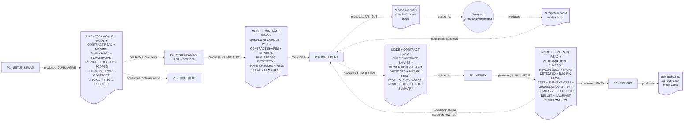

# Python Developer — Quasi-Software View (five layers: NODES, PHASES, INTERNAL, PARALLELIZATION, EXPECTED OUTPUTS)

This is `grimorio.py-developer`'s own DRAWN quasi-software design view, produced per
ref:skill/grimorio.phase-splitting#the-agent-design-plans-drawn-view--a-hard-requirement-never-optional's
standing requirement that every agent-design plan carry one, saved alongside the agent's own design as a
reference file. It mirrors
ref:skill/grimorio.go-developer-memory/go-developer-phases/go-developer-quasi-software-view.md's own
already-shipped five-section shape (a purpose-driven, non-hard-locked agent with a real own-type gated
fan-out) IN FORM, never in CONTENT — this agent's own domain (Python/Pydantic, not Go/determinism) differs
throughout. It is STRUCTURALLY DIFFERENT from that exemplar in exactly TWO respects, both deliberate, both
stated here rather than left for a reader to notice on their own: (1) this chain carries a REAL chain-level
LOOP-BACK edge from Phase 4 back into Phase 3 — go-developer's own chain has none — because the pre-supplied
diagnosis this chain is built from explicitly calls for REWORK to loop back into "Phase 3/4" with the failure
as new input, unlike go-developer's own defect-stays-inside-Phase-4's-mini-loop design; (2) this chain draws
its own conditional WRITE-FAILING-TEST sub-step as a REAL 5th rectangular phase-node in the state-machine
spine (Phase 2), with a labelled conditional entry edge from Phase 1 — go-developer's own equivalent sub-step
lives merged INSIDE its own Phase 3 (IMPLEMENT), never as its own node. This file draws all layers directly
from ref:skill/grimorio.py-developer-memory/behavior.md and its five
ref:skill/grimorio.py-developer-memory/py-developer-phases/phase-1-setup-and-plan.md through
ref:skill/grimorio.py-developer-memory/py-developer-phases/phase-5-report.md, all read in full THIS pass, in
the SAME authoring dispatch that wrote them; it changes none of their content.

## Layer 1 + 2 — NODES (the orchestration graph) and PHASES (the state machine)

```mermaid
flowchart TB
    P1["P1 · SETUP & PLAN"] --> P3["P3 · IMPLEMENT"]
    P1 -.->|"REWORK/BUG-REPORT<br/>DETECTED = YES"| P2["P2 · WRITE-FAILING-<br/>TEST (conditional)"]
    P2 --> P3
    P3 --> P4["P4 · VERIFY"]
    P4 --> P5["P5 · REPORT<br/>(terminal)"]
    P4 -.->|"CHAIN-LEVEL LOOP-BACK —<br/>scope/approach defect Phase 4's<br/>own mini-loop cannot resolve"| P3

    COULD_NOT_P1(["COULD NOT<br/>(missing-plan<br/>refusal)"])
    P1 -.->|"MISSING-PLAN CHECK<br/>fires — chain ends"| COULD_NOT_P1

    CHILD_PY(("N× agent:<br/>grimorio.py-developer<br/>(haiku, one per<br/>file/module)"))
    P3 -.->|"GATE HELD — fan out,<br/>foreground, synchronous,<br/>ONE message"| CHILD_PY
    CHILD_PY -.->|"each child's own<br/>tmp/&lt;child-id&gt;/<br/>work + notes"| P3

    style CHILD_PY fill:#2a3a2a,stroke:#5a5
    style COULD_NOT_P1 fill:#3a2a2a,stroke:#a55
    style P2 fill:#2a2a3a,stroke:#55a
```

**Reading this diagram.** The solid rectangular spine (P1→P3→P4→P5, with P2 sitting on the CONDITIONAL branch
off P1) is the STATE MACHINE — the five phase files' own chain, per
ref:skill/grimorio.phase-splitting#the-model--a-phase-is-a-mini-loop-state-with-three-fields. **P2 is drawn as
a full rectangular phase-node, the SAME shape as P1/P3/P4/P5 — never a differently-shaped node — because it
IS a real phase in the spine, not a sub-step; only its ENTRY EDGE (dashed, labelled with the exact routing
condition) marks it as conditional, never the node itself.** This is the deliberate divergence from
`grimorio.go-developer`'s own chain named in this file's own opening section: that chain's equivalent
WRITE-FAILING-TEST-ON-A-BUG sub-step lives merged inside its own Phase 3 file, with no node of its own at all.

**The CHAIN-LEVEL LOOP-BACK edge (P4 -.-> P3) is drawn dashed, visually distinct from the solid forward
spine, carrying its own exit-condition text as its label — never an unlabelled back-edge that tells a reader a
loop exists without ever telling them when it fires.** This is the SECOND deliberate divergence from
go-developer's own chain, which carries no loop-back edge at all: Phase 4's own file states the boundary
explicitly — an ORDINARY defect Phase 4's own mini-loop can resolve stays inside that phase's own
plan→execute→check→iterate cycle (never triggering this edge); only a defect that reveals the SCOPE or
APPROACH Phase 3 built against was itself wrong routes back here, carrying the failure report as new input to
Phase 3's own FIRST-PASS branch.

**The one EARLY EXIT this chain carries** is drawn as its own visually distinct terminal node, `COULD_NOT_P1`,
dashed off Phase 1 — the same visual convention `CHILD_PY` already establishes for a non-default-path node,
applied here instead of only a label sitting on an otherwise-unconditional P1→P3 edge, so a reader scanning
NODE SHAPE alone, not just edge labels, sees the early exit: Phase 1's own MISSING-PLAN CHECK can REFUSE the
invocation there, ending the chain with `## Close: COULD NOT` reported directly (per Phase 1's own Hard
hand-off), never reaching Phase 2 or Phase 3. **`COULD_NOT_P1` is a STATE MACHINE terminal state, never a
GRAPH agent-node** — unlike `CHILD_PY` below, it names no agent to raise; it is drawn dashed and distinctly
shaped only to match `CHILD_PY`'s established convention for "this is not one of the five ordinary phase
rectangles," not to claim membership in the GRAPH layer.

**The one circular agent-node, `CHILD_PY`, is the GRAPH layer's own contribution** — per
ref:skill/grimorio.loop-and-graph#3-the-graph--who-is-in-it-and-the-branch-rule — drawn in a shape visually
distinct from the five rectangular phase-nodes, the same convention `grimorio.go-developer`'s own `CHILD_GO`
node already establishes, so a reader tells a phase from a spawned agent at a glance. **This is a SINGLE node,
never two, because this agent has only ONE VOLUME UNIT reachable from ONE phase** — go-developer's own fan-out
gate is the direct precedent this mirrors, not `grimorio.ui-developer`'s own two independent dispatch points:
py-developer's own fan-out gate lives entirely inside Phase 3's own FAN-OUT BRANCH, one file or module per
Haiku child, and nowhere else in the chain.

**The escalation ladder (`agent:grimorio.unblocker` / `agent:grimorio.entropy` / `agent:grimorio.adviser`) is
DELIBERATELY OMITTED from this diagram, stated here explicitly rather than silently dropped.** Unlike the
CHILDREN relationship above, this ladder is reachable from EVERY phase in the chain (Phase 0's own "Standing
awareness" section states this), not from one specific dispatch point — the same reasoning
ref:skill/grimorio.go-developer-memory/go-developer-phases/go-developer-quasi-software-view.md's own equivalent
section already states for its own chain, reused here rather than re-derived. **No other future/not-wired
agent-node belongs in this graph** — a full read of Phase 0 plus all five phase files surfaced no language
naming any agent this chain MAY one day lean on beyond the escalation ladder (already addressed above) and the
one CHILD node already drawn.

## Layer 3 — INTERNAL: per-phase artifact-flow (IN → OUT), half (a) only

**Grounding — shared across every quasi-view that draws this layer, not re-derived here:**
ref:skill/grimorio.phase-splitting/project.quasi-view-requirements.md#half-a--boundary-artifact-flow-unchanged.
Per this pass's own scope, only half (a) (boundary artifact-flow) is drawn for this chain — half (b) (per-phase
interior flowcharts + a KNOWN-ERRORS-TO-PHASE mapping) is optional per that same file and out of scope for this
pass, matching the exact scope the go-developer exemplar already ships at.

**This chain is NOT strictly linear the way go-developer's own is — it carries ONE conditional branch (P1→P2,
taken only on the bug-report route) and ONE genuine chain-level loop-back (P4→P3) — so its boundary count
follows a WIDER accounting than the plain N-1 rule, stated explicitly rather than silently applying a formula
that does not fit this chain's own shape:**

- **FORWARD spine** (4 boundaries): P1↔P3 (ordinary route) OR P1↔P2↔P3 (bug-report route, 2 boundaries
  replacing the 1 direct P1↔P3 boundary on that route), P3↔P4, P4↔P5, plus P5's own terminal output to the
  caller.
- **CONDITIONAL branch** (1 boundary, P1↔P2, taken only WHEN Phase 1's own REWORK/BUG-REPORT DETECTED field is
  YES): P2's own output re-joins the SAME P3 input boundary the ordinary route uses, per Phase 2's own Hard
  hand-off carrying the identical cumulative field set plus its own new BUG-FIX-FIRST-TEST field.
- **FAN-OUT sub-flow** (2 boundaries, ONE pair, entirely INSIDE P3, never a phase-level boundary): P3↔CHILD_PY
  (N per-child briefs, one file/module each) and CHILD_PY↔P3 (N `tmp/<child-id>/work`+`notes` reports,
  converged by P3 itself before its own forward hand-off fires).
- **LOOP-BACK re-entry**: 1 boundary (P4→P3), carrying the failure report as new input to Phase 3's own
  FIRST-PASS branch — the ONE structural difference from go-developer's own chain (0 loop-back boundaries),
  named explicitly in this file's own opening section.
- **EARLY-EXIT**: 1 boundary (P1→`COULD_NOT_P1`, per Layer 1+2's own distinct terminal node, not a separate doc
  node here) — Phase 1's own MISSING-PLAN CHECK can terminate the chain with `## Close: COULD NOT` rather than
  handing off to P2 or P3, producing no artifact of its own beyond the refusal report already covered by P1's
  own DELIVERABLE.

**`D1` through `D4` are labeled CUMULATIVE, not incremental — each doc node lists every field the NEXT phase
actually needs from ANY earlier phase, not only what the phase immediately upstream of it newly produced.**
This is the diagram's own VISIBLE proof of the fix this chain's whole redesign exists to make: **MODE and
CONTRACT READ (both Phase 1's own fields) ride EVERY doc node from `D1` through `D4`, all the way to Phase 5's
own consumption — they are named explicitly in `D2`, `D3`, and `D4` above even though Phase 2, Phase 3, and
Phase 4 each consume neither directly, per
ref:skill/grimorio.phase-splitting#progressive-revelation--a-hard-mechanical-requirement-never-judgment's own
"restate, inside a later phase's own file, any fact that phase depends on" rule.** And
**BUG-FIX-FIRST-TEST (Phase 2's own new field, produced only on the bug-report route) rides `D2`, `D3`, and
`D4` all the way to Phase 5 as well** — the actual carried evidence (a test, a command, a confirmed error),
never a bare phase-name pointer.

**Stated plainly, exactly which fields `grimorio.go-developer`'s own equivalent diagram HAD dropped at which
boundary — independently found during this redesign's own diagnosis, since closed in go-developer's own
cycle-2 REWORK (its own diagram widened to match) — and confirmed this diagram never repeated either gap:**
go-developer's own `D2`/`D3`/`D4` sequence (its Phase-2-through-Phase-4 hand-off) used to never list MODE at
all — its own Phase 5 branches "IN PIPELINE MODE... IN STANDALONE MODE" by name, and at the time of this
redesign's own diagnosis no MODE field appeared anywhere in its own "GIVEN this phase receives..." list, a gap
this chain's `D1`→`D4` sequence closes by naming MODE explicitly on every doc node above — a gap
go-developer's own diagram has since closed independently too. Separately, go-developer's own Phase 3 used to
produce a BUG-FIX-FIRST-TEST field its own diagram never carried past `D3` at all — only the boolean
REWORK/BUG-REPORT DETECTED flag survived to its own Phase 5's doc node, even though its own Phase 5 Completion
criteria cites the failing-test-ran-first fact as load-bearing evidence with nothing behind it. This diagram's
own `D2`→`D3`→`D4` sequence carries the REAL BUG-FIX-FIRST-TEST content (not a flag) through every hop to
Phase 5, closing that second gap too.

## Layer 4 — PARALLELIZATION: ONE genuine dispatch point, everywhere else sequential

**This chain is sequential end-to-end at the STATE MACHINE level — P1 → (P2, conditionally) → P3 → P4 → P5,
one phase at a time, never two phases running concurrently, and the P4→P3 loop-back re-enters sequentially
too, never in parallel with anything.** This chain carries exactly ONE genuine parallel dispatch point:

1. **Inside P3's own FAN-OUT BRANCH: WHEN the volume-fan-out ladder's step-1 gate holds, P3 raises N `haiku`
   children — one per file/module — in ONE message, foreground, synchronous, per**
   ref:skill/grimorio.fan-out#the-volume-fan-out-ladder--when-an-agent-fans-out-n-children-of-its-own-type-six-step-algorithm's
   **own step 3, and blocks until every child returns before its own next-phase read (P4) fires.**

**No other node in this chain carries a parallelism question of its own.** P1, P2, P4, and P5 are each a
single SELF node by their own step 1 (no spawn, ever). **P5 is the SOLE writer of `dev-notes.md`** — per
ref:skill/grimorio.phase-splitting/project.flow-method.md#b-modifying-phases-stay-sequential ("many may ADVISE
it, but only ONE phase WRITES"), P5 stays sequential and terminal on its OWN forward path: the chain's only
re-entry is P4's own loop-back into P3, which never touches P5 or revises anything P5 has already written —
P5 is only ever reached once, on the path that finally clears Phase 4 for good.

## Layer 5 — EXPECTED OUTPUTS: WORK vs ORCHESTRATION, per phase

**The distinction this layer draws, kept separate from Layer 3 above: Layer 3 shows the DATA that crosses a
phase boundary — what the next phase literally reads. This layer shows the RESULT that phase's own WORK exists
to produce.**

| Phase | WORK PRODUCT (what the phase's own action produces) | ORCHESTRATION ACT (what it then routes, and to whom) |
|---|---|---|
| P1 · SETUP & PLAN | The upward harness lookup, MODE, the contract actually read, the scoped implementation checklist, the wire-contract shapes, the missing-plan refusal call, REWORK/bug-report detection, a last-step search against this agent's own trap log + this project's own developer trap log | Hands to P2 (bug-report route) or directly to P3 (ordinary route) — UNLESS the missing-plan refusal fired (chain ends there, `## Close: COULD NOT`) — never spawns |
| P2 · WRITE-FAILING-TEST (conditional) | A pytest test proving the reported bug, run and confirmed to fail with the expected error, BEFORE any production code changes | Hands to P3 unconditionally — never spawns; entered only on the bug-report route |
| P3 · IMPLEMENT | On FIRST-PASS: the survey + the build against the checklist or the confirmed-red test + the decomposition + fan-out gate decision + the actual Python module(s) built. On CHILD: the single assigned file/module | Hands to P4 unconditionally on FIRST-PASS — spawns N `CHILD_PY` only when the gate holds — CHILD route reports to the parent, never reads P4. Re-entered from P4's own loop-back on a scope/approach defect |
| P4 · VERIFY | The full pytest suite result, the per-invariant confirmation, WHEN applicable the bug-report's own reproduction-test re-confirmation — any ORDINARY defect fixed and re-checked WITHIN this phase's own mini-loop before it hands off | Hands to P5 unconditionally on PASS — loops back to P3 on a scope/approach defect its own mini-loop cannot resolve — never spawns |
| P5 · REPORT | `dev-notes.md` (Pipeline mode) or an inline report (Standalone), the commit action taken, any REWORK-cycle section, the `## Status`/`## Close` values | Terminal on this path — reports to the caller, no further phase, no further loop-back from here |

## Evidence of phase-design reasoning — the RENDER/GROUP/MEASURE working product, saved

Per
ref:skill/grimorio.phase-splitting/project.quasi-view-requirements.md#evidence-of-phase-design-reasoning--save-the-rendergroupmeasure-working-product-never-discard-it-silently,
this section is THIS pass's own fresh re-derivation of the sizing reasoning, checked against the actual files
this pass produced — never copy-pasted from the pre-supplied diagnosis verdict
(this project's own branch-objective record for this agent's phase design, read in full this pass and independently
re-confirmed here rather than trusted on its own say-so) or from `grimorio.system-keeper`'s own dispatch notes.

**RENDER — the complete load, before any grouping.** The pre-split shell (`grimorio.py-developer.md`) carried
its own IDENTITY-section prose (the "You are an expert Python developer..." paragraph — unchanged by this
pass, per this dispatch's own explicit instruction) plus a flat Behavior block naming TWO files executed
together, every invocation, plus a 10-entry flat Knowledge list: `agent-selection`, `code-harness`,
`objective-harness`, `working-memory`, `python` (primary reference), `development-patterns`,
`developer-memory`, `py-developer-memory`, `feature-workflow`, `fan-out`. The two full behavior files executed
together: `developer-memory/project.build-protocol.md` (191 lines: harness lookup, survey-before-writing,
fan-out gate, missing-plan refusal, comments rule, commit-by-isolation, bug-report order, foreground-test
rule, pipeline/standalone mode, OUTPUT template, REWORK mode, harness/trap-capture) and
`py-developer-memory/behavior.md` (99 lines, re-confirmed by this pass's own direct read: a flat 6-step `##
Steps` list whose own Step 1 already states a 5-sub-step SELF-only graph, 4 Core rules, a 5-item `## Self-check
gate`, an `## OUTPUT` block + a worked example, and a trailing `## Rules` block — 2 items, frontend-scope ban
and ambiguous-contract BLOCKED — confirmed, by this pass's own direct comparison against the 4 Core rules, to
carry NO duplication with them, unlike `grimorio.go-developer`'s own pre-split file, which duplicated one Core
rule verbatim in its own trailing Rules block). A contract-reading sub-step did not need `grimorio.python`'s
own Testing/Ports-and-Adapters sections, `grimorio.development-patterns`, or the fan-out ladder loaded in full
at that moment — yet all were mandatory-imported regardless of which of the 6 original steps was actually
executing. This is the exact flat-mega-load anti-pattern
ref:skill/grimorio.phase-splitting names by construction, not by inference — independently re-confirmed this
pass by reading both behavior files and the shell's own Knowledge list in full, not taken from the
pre-supplied verdict's own count alone.

**GROUP — five candidates, all clearing the bar, one earning its own conditional PHASE-NODE rather than a
merged sub-step.** (1) SETUP & PLAN: harness lookup, MODE determination, `arch-decision.md` + wire-contract
reading, the missing-plan refusal, and — as a LAST STEP, deliberately folded rather than split into its own
phase — a search against this agent's own trap log (this agent's own small, 5-entry, ~9KB corpus) and
this project's own developer trap log. Kept FOLDED rather than standalone, unlike go-developer's own SEARCH-FIRST
phase, because the deciding factor — corpus SIZE and KNOWLEDGE-OVERLAP with the phase it would otherwise sit
beside — comes out the OPPOSITE way here: go-developer's own trap corpus is large (multi-wave, six+ numbered
waves) and covers a genuinely SEPARATE knowledge slice (pathing, collision, morale) from `arch-decision.md`
reading, earning its own phase; THIS agent's own corpus is small and its content (Pydantic model mechanics,
reasoning-model token sizing) overlaps DIRECTLY with the Pydantic-mirroring work SETUP & PLAN already does —
folding it costs nothing new and manufacturing a phase boundary here would not clear
ref:skill/grimorio.phase-splitting#the-phase-boundary-judgment-test--judgment-never-an-algorithm's own
distinct-question test. (2) WRITE-FAILING-TEST (conditional): pytest conventions, the bug-report's own
mandatory-order step 1 — kept as its OWN phase-node, unlike go-developer's own merged sub-step, because the
DELIVERABLE differs in kind, not merely in content: a confirmed-red test is a literal GATING artifact that
blocks entry to IMPLEMENT on this route, distinct from IMPLEMENT's own code-diff deliverable, even though the
pytest KNOWLEDGE partially overlaps — the tension is named honestly in Phase 2's own opening section, not
smoothed over. (3) IMPLEMENT (incl. the internal fan-out gate, kept INSIDE this one phase, never split out):
`grimorio.python`'s Ports-and-Adapters/functional-core conventions, `development-patterns`, the fan-out
volume-ladder — the single heaviest cluster rendered, a plausible pincho on its own, but the CHILDREN-OFFLOAD
mechanism already built into it (fan out one Haiku child per file/module) is exactly the sanctioned relief
valve ref:skill/grimorio.phase-splitting#sizing-a-phase--render-group-measure-split-the-pincho-check's own
Sizing section names for a heavy-but-genuinely-one-mission group. (4) VERIFY: the hard-invariant list, the
foreground-test-execution rule, PLUS its own genuine internal mini-loop/chain-level-loop-back boundary test —
none of `grimorio.python`'s authoring conventions, `development-patterns`, or the fan-out ladder is needed
here; this phase reads and checks, it does not write new code shape. (5) REPORT: the shared OUTPUT template,
the worktree-isolation commit-discipline branch, REWORK-mode shape, the BLOCKED-on-ambiguity rule (relocated
here verbatim from the pre-split file's own trailing `## Rules` block), the harness-mode trap-capture
obligation — none of `grimorio.python`/`development-patterns`/fan-out knowledge is needed to WRITE this
artifact, only to have already produced the facts it reports.

**MEASURE — a rendered count per group, no pincho found beyond the one already-relieved by
CHILDREN-OFFLOAD.** Group IMPLEMENT carries ~7 rendered items across 3 knowledge sources (`grimorio.python`,
`grimorio.development-patterns`, `grimorio.fan-out`'s own ladder) — smaller than go-developer's own equivalent
group (~9-10 items across 4 sources, since this agent's own domain carries no equivalent of `game-patterns`'
own content-model shape) — not split further; splitting it would reproduce the exact measured
`grimorio.prompt-writer` over-splitting incident this skill names explicitly. No other group carries a
multiple of its siblings' load: Group SETUP & PLAN carries 5 distinct knowledge sources (harness, mode/refusal
sections of build-protocol, the refusal-pattern companion, Pydantic conventions, the two traps indexes),
genuinely non-overlapping with IMPLEMENT's own three; Group WRITE-FAILING-TEST carries 2 knowledge sources
(pytest conventions, the bug-order section), the lightest phase in the chain by design — its own DELIVERABLE
is a single gating artifact, not a broad build; Group VERIFY carries 3 knowledge sources (the hard-invariant
list, the foreground-test rule, the bug-order section's own step 3) plus its own genuine mini-loop/loop-back
boundary logic, never a subset of an earlier group; Group REPORT carries 4 threaded build-protocol sections,
all reporting/hand-off conventions no earlier phase touches.

**Against the pincho check and CHILDREN-OFFLOAD.** The pre-split file's flat 6-step list already carried five
genuinely separate missions once regrouped (SETUP&PLAN with the traps search folded in, WRITE-FAILING-TEST,
IMPLEMENT, VERIFY, REPORT) with no fused-overload comparable to a measured 5×-sibling pincho elsewhere in this
corpus. CHILDREN-OFFLOAD was considered for IMPLEMENT's own volume and found the CORRECT remedy, not an
additional one: the phase already performs CHILDREN-OFFLOAD via its own FAN-OUT BRANCH, for the actual build
volume once the scope is known — this IS the mechanism, threaded through the one phase that actually produces
volume, never given a phase of its own, exactly as the pre-supplied verdict's own classification already
states, independently re-confirmed here against this pass's own actual phase-3 file rather than assumed.

**Coverage — every rendered item placed, self-disclosed rather than smoothed over.** All 10 skills from the
RENDER inventory above land in exactly one or more phase groups, or are correctly THREADED rather than
dropped: `agent-selection` → dropped from this agent's own per-phase LOAD entirely, same as
`grimorio.go-developer`'s own precedent drop, but restated here in the ONE place it actually belongs: the
escalation-ladder pointer in Phase 0's own "Standing awareness" section carries the SAME content
(unblocker/entropy/adviser routing) this Knowledge bullet used to name, so nothing from it is lost, only
relocated to the standing section that fires from every phase rather than a per-phase LOAD line no single
phase would otherwise own. `code-harness` → Phase 1 only (the upward lookup, this chain's first
file-reading/scoping phase). `objective-harness` → dropped from this agent's own knowledge chain entirely by
this redesign, mirroring `grimorio.go-developer`'s own identical drop: confirmed by re-checking THIS agent's
own pre-split `behavior.md` (re-read this pass, in full, per the dispatch's own explicit instruction to check
this rather than assume the go-developer precedent transfers) — it never cited `objective-harness` in its own
Steps either, so the drop is not a new omission, only a name finally matching what the file already did.
`working-memory` → Phase 3 (the per-child `tmp/<child-id>/` folder convention, its own single FAN-OUT BRANCH).
`python` → Phase 1 (the Pydantic mirroring conventions, its own scoping load), Phase 2 (the pytest testing
section), and Phase 3 (Ports-and-Adapters/functional-core, read first). `development-patterns` → Phase 3
only. `developer-memory` → splits across every phase via the threaded build-protocol table (Phase 0's own
attachment table) plus Phase 1's own developer-trap-log search plus Phase 1's own developer-memory invariant
pointer plus Phase 4's own re-use of that same pointer for invariant confirmation plus Phase 5's own
trap-capture confirmation. `py-developer-memory` (this agent's own trap log) → Phase 1's own last-step
search (the ONLY search this corpus needs, per this file's own GROUP-section reasoning for why it is folded
rather than standalone), plus Phase 5's own capture confirmation. `feature-workflow` → dropped from the
phase-chain's own per-phase LOAD, same as `objective-harness` and mirroring `grimorio.go-developer`'s own
identical drop: the pre-split behavior file never cited it either, and this project's own artifact-directory
structure is already covered by the threaded `build-protocol.md`'s own Pipeline-vs-Standalone/OUTPUT sections
(Phases 1 and 5) — carried forward unchanged, not a new omission. `fan-out` → Phase 3 only (the volume-fan-out
ladder, its own single FAN-OUT BRANCH) — never Phase 1, 2, 4, or 5, none of which spawn.
