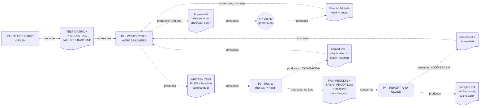

# QA — Quasi-Software View (five layers: NODES, PHASES, INTERNAL, PARALLELIZATION, EXPECTED OUTPUTS)

This is `grimorio.qa`'s own DRAWN quasi-software design view, produced per
ref:skill/grimorio.phase-splitting#the-agent-design-plans-drawn-view--a-hard-requirement-never-optional's
standing requirement that every agent-design plan carry one, saved alongside the agent's own design as a
reference file. It mirrors
ref:skill/grimorio.verifier-memory/verifier-phases/verifier-quasi-software-view.md's own already-shipped
five-section shape (a purpose-driven, non-hard-locked agent with a real own-type gated fan-out) and reuses
ref:skill/grimorio.agent-writing/system-keeper-phases/system-keeper-quasi-software-view.md's own Layer 1+2
dashed-edge-with-verbatim-trigger-label mermaid convention for drawing a genuine phase-to-phase LOOP-BACK — this
chain is the first purpose-driven, own-type-fan-out chain in the corpus that ALSO carries a real internal
loop-back, so it draws on both exemplars rather than either alone. This file draws all layers directly from
ref:skill/grimorio.qa-memory/behavior.md and its four
ref:skill/grimorio.qa-memory/qa-phases/phase-1-search-first-and-plan.md through
ref:skill/grimorio.qa-memory/qa-phases/phase-4-report-and-close.md, all read in full THIS pass, in the same
authoring dispatch that wrote them; it changes none of their content.

## Layer 1 + 2 — NODES (the orchestration graph) and PHASES (the state machine)

```mermaid
flowchart TB
    P1["P1 · SEARCH-FIRST<br/>& PLAN"] --> P2["P2 · WRITE-TESTS-<br/>ACROSS-LAYERS"]
    P2 -->|"BOTH FIRST-PASS and<br/>RE-ENTRY routes converge<br/>here, unconditional"| P3["P3 · RUN &<br/>BREAK-PROOF"]
    P3 -->|"EXIT: LOOP-BACK-A<br/>did NOT fire"| P4["P4 · REPORT-AND-<br/>CLOSE (terminal)"]

    P3 -.->|"LOOP-BACK-A: WHEN a new test does NOT go<br/>RED under its own mutation (break-proof,<br/>live, discovered inside P3) — names the<br/>test + why it failed to catch it"| P2
    P4 -.->|"LOOP-BACK-B: WHEN failure-taxonomy classifies<br/>a raw suite failure as a TEST bug (after<br/>the fact, discovered inside P4) — names<br/>the test + the fix needed"| P2

    CHILD(("N× agent:<br/>grimorio.qa (haiku,<br/>one per test<br/>spec/path)"))
    P2 -.->|"GATE HELD — fan out,<br/>foreground, synchronous,<br/>ONE message"| CHILD
    CHILD -.->|"each child's own<br/>tmp/&lt;child-id&gt;/<br/>work + notes"| P2

    style CHILD fill:#2a3a2a,stroke:#5a5
```

**Reading this diagram.** The solid rectangular spine (P1→P2→P3→P4) is the STATE MACHINE — the four phase
files' own chain, per ref:skill/grimorio.phase-splitting#the-model--a-phase-is-a-mini-loop-state-with-three-fields.
**This chain carries TWO distinct LOOP-BACK edges, both re-entering P2, drawn as two visually distinct dashed
edges each carrying its own verbatim trigger label** — the same mermaid convention
ref:skill/grimorio.agent-writing/system-keeper-phases/system-keeper-quasi-software-view.md's own Layer 1+2
diagram already establishes for its own P5↔P4/P6↔P4 edges, reused here rather than invented fresh. **The two
edges are NEVER merged into one**, because they fire from different phases, at different discovery moments,
over different failure populations: LOOP-BACK-A fires live, inside P3's own break-proof mutation, over a NEW
test that fails to catch a real bug; LOOP-BACK-B fires after the fact, inside P4's own failure-taxonomy
classification, over an EXISTING run failure the ordinary suite run already surfaced. Neither loop-back has a
separate RETURN edge drawn back to its own originating phase — after P2 fixes the named test, P2's own ordinary
forward hand-off (the solid P2→P3 edge above, unconditional on both the FIRST-PASS and RE-ENTRY routes) already
carries the fix back to P3, and P3's own ordinary forward hand-off (the solid P3→P4 edge, when no loop fires the
second time) already carries it on to P4 — the loop CLOSES through the existing forward spine, it does not need
a second dashed edge for the return trip.

**The one circular agent-node, `CHILD`, is the GRAPH layer's own contribution** — per
ref:skill/grimorio.loop-and-graph#3-the-graph--who-is-in-it-and-the-branch-rule — drawn in a shape visually
distinct from the four rectangular phase-nodes, the same convention
ref:skill/grimorio.verifier-memory/verifier-phases/verifier-quasi-software-view.md's own `CHILD` node already
establishes, so a reader tells a phase from a spawned agent at a glance. `CHILD` represents N independent
instances (one per test spec/path, this agent's own VOLUME UNIT), reachable ONLY from Phase 2's own FAN-OUT
BRANCH — no other phase in this chain ever spawns. **This is the deliberate INVERSE of
agent:grimorio.manual-verifier's own placement of the identical shape**: verifier's `CHILD` node hangs off ITS
Phase 1, because its own VOLUME UNIT (one click-path/route) is knowable the moment its own Impact Matrix is
built, in that same phase; this agent's own `CHILD` node hangs off Phase 2 instead, because its own VOLUME UNIT
(one test spec/path) is only knowable once Phase 1's own Test Matrix already exists — the fan-out structurally
cannot fire one phase earlier here, unlike verifier's own chain.

**No future/not-wired agent-node belongs in this graph — N/A, not invented.** A full read of Phase 0 plus all
four phase files surfaced no language naming an agent this chain MAY one day lean on but does not currently
spawn — `CHILD` is the only agent-node this chain ever raises.

## Layer 3 — INTERNAL: per-phase artifact-flow (IN → OUT), half (a) only

**Grounding — shared across every quasi-view that draws this layer, not re-derived here:**
ref:skill/grimorio.phase-splitting/project.quasi-view-requirements.md#half-a--boundary-artifact-flow-unchanged.
Per this pass's own scope, only half (a) (boundary artifact-flow) is drawn for this chain — half (b) (per-phase
interior flowcharts + a KNOWN-ERRORS-TO-PHASE mapping) is optional per that same file and out of scope for this
pass, matching the exact scope already shipped this same session for the verifier and system-keeper exemplars.

**This chain is NOT strictly linear, so its boundary count deviates from the plain N-1 rule, stated explicitly
rather than forced to fit.** ref:skill/grimorio.phase-splitting/project.quasi-view-requirements.md's own N-1 rule
assumes a single spine with no re-entry; this chain's own real boundary count is named here rather than papered
over:

- **FORWARD spine** (3 boundaries): P1↔P2, P2↔P3, P3↔P4, plus P4's own terminal output to the caller.
- **FAN-OUT sub-flow** (2 boundaries, entirely INSIDE P2, never a phase-level boundary — structurally different
  from the forward spine): P2↔CHILD (N per-child briefs, one test spec/path each) and CHILD↔P2 (N
  `tmp/<child-id>/work`+`notes` reports, converged by P2 itself before P2's own forward hand-off fires).
- **LOOP-BACK re-entries** (2 boundaries, each distinct): P3↔P2 (LOOP-BACK-A, carrying a named test + why it
  failed to catch its own mutation) and P4↔P2 (LOOP-BACK-B, carrying a named test + the fix needed) — each a
  ONE-WAY dashed edge into P2; the RETURN half of each loop reuses the forward spine's own existing P2→P3 and
  P3→P4 edges, per Layer 1+2's own reading note above, so it is not counted a second time here.

The dotted edges here are the SAME visual convention as the LOOP-BACK/fan-out edges in Layer 1+2 (both dashed
there) but carry a DIFFERENT meaning — "consumes"/"produces" (data moving), never "EXIT"/"LOOP-BACK"/"GATE HELD"
(control moving) — the identical DFD process-vs-flow separation every already-shipped quasi-view in this corpus
already applies.

## Layer 4 — PARALLELIZATION: ONE genuine dispatch point, everywhere else sequential

**This chain is sequential end-to-end at the STATE MACHINE level — P1 → P2 → P3 → P4, one phase at a time,
never two phases running concurrently, on the ordinary forward route.** Both loop-back re-entries (P3→P2,
P4→P2) are ALSO strictly sequential — a loop-back is never a parallel dispatch, it is a single agent returning
to an earlier phase of its own SAME invocation and continuing to run, one phase at a time, through the fix.
**The ONLY parallel dispatch point in this whole chain is INSIDE P2's own FAN-OUT BRANCH: WHEN the
volume-fan-out ladder's step-1 gate holds, P2 raises N `haiku` children — one per test spec/path — in ONE
message, foreground, synchronous, per**
ref:skill/grimorio.fan-out#the-volume-fan-out-ladder--when-an-agent-fans-out-n-children-of-its-own-type-six-step-algorithm's
**own step 3, and blocks until every child returns before its own next-phase read (P3) fires.** This is genuine
N-way parallel dispatch, not a sequence of one-at-a-time spawns — named here explicitly rather than left for a
reader to infer from `CHILD`'s own multiplicity in Layer 1+2.

**No other node in this chain carries a parallelism question of its own.** P1, P3, and P4 are each a single
SELF node by their own step 1 (no spawn, ever). **P4 is the SOLE writer of `qa-report.md`** — per
ref:skill/grimorio.phase-splitting/project.flow-method.md#b-modifying-phases-stay-sequential ("many may ADVISE
it, but only ONE phase WRITES"), P4 stays sequential even considering the two loop-back edges: fixing a test in
P2 never writes the report itself; only P4, on its own final convergence with no loop-back left outstanding,
writes it. **P3's own RUN step and BREAK-PROOF step are correctly kept as one phase, not split**, because they
share the same population (the tests P2 just wrote) and the same question ("does this actually work, and would
it catch a real bug") — unlike P3 and P4, which ask genuinely independent questions (does it run clean, versus
what does a failure actually mean) and are correctly kept as separate phases.

## Layer 5 — EXPECTED OUTPUTS: WORK vs ORCHESTRATION, per phase

**The distinction this layer draws, kept separate from Layer 3 above: Layer 3 shows the DATA that crosses a
phase boundary — what the next phase literally reads. This layer shows the RESULT that phase's own WORK exists
to produce.**

| Phase | WORK PRODUCT (what the phase's own action produces) | ORCHESTRATION ACT (what it then routes, and to whom) |
|---|---|---|
| P1 · SEARCH-FIRST & PLAN | THE BRIEF and pipeline artifacts read, the declared Test Matrix (AC→test→layer→FAIL-definition), the Pre-existing Failures baseline run, the changed-file exploration notes | Hands to P2 unconditionally |
| P2 · WRITE-TESTS-ACROSS-LAYERS | On FIRST-PASS: the decomposition + fan-out gate decision + the actual test files written (E2E-floor first, then integration/unit, then negatives). On RE-ENTRY: the single fixed test | Hands to P3 unconditionally, on either route — spawns N `CHILD` only when the gate holds |
| P3 · RUN & BREAK-PROOF | Per-project pass/fail counts + the executed break-proof log (mutate/RED/revert/GREEN per new test) | Hands to P4 (no loop) OR loops back to P2 (LOOP-BACK-A, a break-proof-discovered test-authoring bug) |
| P4 · REPORT-AND-CLOSE | The failure-taxonomy classification, the coverage check, `qa-report.md`, the `## Status` value | Terminal — reports to the caller (no loop, or a fired loop already re-converged clean) OR loops back to P2 (LOOP-BACK-B, a classification-discovered test bug) |

## Evidence of phase-design reasoning — the RENDER/GROUP/MEASURE working product, saved

Per
ref:skill/grimorio.phase-splitting/project.quasi-view-requirements.md#evidence-of-phase-design-reasoning--save-the-rendergroupmeasure-working-product-never-discard-it-silently,
this section restates, as a durable saved artifact rather than a claim taken on faith, the sizing reasoning
`grimorio.system-keeper` already performed and independently re-derived (not merely trusted) in
ref:tmp/qa-phase-upgrade/phase-2-deliverable.txt, tightened here as this chain's own saved evidence.

**RENDER — the complete load, before any grouping.** The pre-diff SHELL (`grimorio.qa.md`, 36 lines) carried its
own IDENTITY-section prose, distinct from the flat `behavior.md` below and MISSED by this pass's own original
RENDER: the character paragraph ("the last line of defense before code ships... rigorous and honest...") plus a
second paragraph — "And you do not work a queue by hand... decompose whatever is in front of you into
independent items instead of grinding through them yourself, for EVERY task you take, not a case bound to
test-writing alone. Whether an item actually becomes a spawned child is GATED by `grimorio.fan-out`'s ladder,
never automatic." That second paragraph is a personality-level mandate, not a Core rule and not a Step, so it
was never counted in this pass's original RENDER tally below; its own corrected home is
ref:skill/grimorio.qa-memory/behavior.md's own "one boundary restated" section (read that file directly for the
restored bullet's own text, not re-derived here). The pre-split `behavior.md` (164 lines, flat STEPS): 3
Core rules; a Step-0 graph-statement (1 item); Step 1/PLAN sub-steps 2-7 (6 items: read brief, read pipeline
artifacts, plan layers/e2e-floor doctrine, declare matrix per-AC, run baseline, explore changed files —
knowledge: `feature-workflow` artifact structure, `qa-memory`-general E2E-floor + weak-test anti-patterns,
`development-patterns` layer-boundary assignment); Step 2/WRITE-TESTS sub-steps 8-11 (4 items: decompose-declare,
fan-out-ladder-gate+spawn, write-per-matrix, negative tests — knowledge: `javascript`, `fan-out` ladder,
`working-memory` tmp-convention, `development-patterns` architecture-boundary); Step 3/RUN sub-steps 12-13 (2
items: run+regress, break-proof — knowledge: `qa-memory` break-proof protocol, `project.md` test-framework
commands); Step 4-5/REPORT sub-steps 14-17 (4 items: analyze-failure-taxonomy, coverage-check, write
`qa-report.md`, close-status — knowledge: the inline failure taxonomy, the own OUTPUT/Status contract) — plus
the shell's own flat 7-entry Knowledge list (`agent-selection`, `reasoning-principles`, `working-memory`,
`qa-memory`, `development-patterns`, `javascript`, `fan-out`), every one loaded on EVERY invocation regardless
of which of the four real functional stages actually needed it.

**GROUP — four candidates, all clearing the bar, none rejected outright.** (1) SEARCH-FIRST & PLAN: SEARCH-FIRST
merges in rather than becoming a standalone fifth node — the identical reasoning
ref:skill/grimorio.verifier-memory/verifier-phases/phase-1-scope-and-delegate.md's own step 3 already applies
for its own chain, reused here rather than re-derived: the feature-specific search IS the same reading pass
that produces the matrix, and the corpus-wide precedent half is already a standing JIT import on this same
phase. (2) WRITE-TESTS-ACROSS-LAYERS: where the own-type gated fan-out lives — placed here rather than Phase 1
specifically because this agent's own VOLUME UNIT (one test spec/path) is only knowable once the Test Matrix
already exists, the deliberate INVERSE of where verifier's own analogous section places it. (3) RUN &
BREAK-PROOF: a genuine mini hard-loop carrying its own LOOP-BACK-A, a real STOP/re-route condition, not a
subset of WRITE-TESTS or REPORT. (4) REPORT-AND-CLOSE: the OUTPUT/Status contract, the failure-taxonomy
judgment, and its own LOOP-BACK-B, with DONE folded in as this phase's own terminal close rather than a fifth
node. No candidate was rejected — all four match the pre-supplied diagnosis's own four groups, one-to-one.

**MEASURE — a rendered count per group, one convention applied uniformly, no pincho found.** ONE counting
convention governs every group's own step count below, stated once here rather than left for a future
reader/reviewer to reverse-engineer per group: **the graph-statement step (step 1) counts as exactly ONE step
regardless of how many internal branches it declares — the identical treatment already correctly given to the
FAN-OUT BRANCH step's own 3 internal sub-parts (counted once) — and a lettered sub-step (1a, 1b, etc.) that is a
conditional variant of step 1's own branches, rather than a new top-level action, is never separately counted.**
Group P1/SEARCH-FIRST & PLAN: 3 knowledge slices (`feature-workflow` artifact structure, `qa-memory`-general
E2E-floor+anti-patterns, `development-patterns` layer-boundary assignment) across 7 steps (the
graph-statement/PARENT-CHILD-branch-declaration step counted once — step 1a's own conditional CHILD-branch
variant not separately counted — then read-brief, read-artifacts, plan-layers, declare-matrix, run-baseline,
explore-changed-files). Group P2/WRITE-TESTS-ACROSS-LAYERS: 4 knowledge slices (`javascript`, `fan-out` ladder,
`working-memory` tmp-convention, `development-patterns` architecture-boundary) across 5 steps (the
graph-statement/three-branch-declaration step counted once — steps 1a/1b's own conditional RE-ENTRY/CHILD-branch
variants not separately counted — then decompose-declare, the nested 3-sub-step FAN-OUT BRANCH counted once,
write-per-matrix, negatives). Group P3/RUN & BREAK-PROOF: 2 knowledge slices (`qa-memory` break-proof protocol,
`project.md` test-framework commands) across 4 steps (the graph-statement step counted once, then run-projects,
break-proof, LOOP-BACK-A). Group P4/REPORT-AND-CLOSE: 2 knowledge slices (the inline failure taxonomy, the own
OUTPUT/Status contract) across 6 steps (the graph-statement step counted once, then classify, LOOP-BACK-B,
coverage-check, write-report, close). **No group carries a multiple of its siblings' load** — P2 leads every
group in knowledge slices (4, against P1's 3 and P3's/P4's 2 each), a count this fix leaves untouched. On the
step-count axis, applying the SAME convention to all four groups (rather than P2 and P4 counting their own
graph-statement step while P1 and P3 silently didn't) surfaces a DIFFERENT leader: **P1, at 7 steps** — its own
graph-statement step was previously omitted from both the list and the count, at an undercounted 6; P3 was
undercounted for the identical reason, at 3 instead of 4; P2 (5) and P4 (6) were already counting theirs
correctly and are restated here unchanged, now visibly following the same stated rule rather than reading as
independently arrived-at. The honest, now-consistent ranking is P1 (7) > P4 (6) > P2 (5) > P3 (4). Neither axis
shows a 5×-sibling pincho the way
ref:skill/grimorio.verifier-memory/verifier-phases/verifier-quasi-software-view.md's own pre-split
"sanity-baseline" stage measured — no further SPLIT is warranted, matching `grimorio.system-keeper`'s own
independently re-derived MEASURE verdict rather than merely trusting it.

**Against the pincho check.** The pre-split file's four labeled stages (PLAN, WRITE-TESTS, RUN, REPORT) already
carried genuinely separate missions with no fused overload comparable to `manual-verifier`'s own pre-split
"sanity-baseline" stage, which HAD measured as a real 5× pincho and forced an actual SPLIT into two phases. No
group here required further SPLIT. **CHILDREN-OFFLOAD was considered for P2's own heavier load (4 knowledge
slices, the largest group) and found ALREADY APPLIED, not additionally needed**: P2 already performs its own
CHILDREN-OFFLOAD, via its own FAN-OUT BRANCH, for the actual test-writing volume once the matrix is known — a
further recursive offload of P2's own planning load onto a child would misapply CHILDREN-OFFLOAD one level too
deep for a gain that does not exist at that level, the identical reasoning verifier's own quasi-view already
states for its own analogous P1.

**Coverage — every rendered item placed, self-disclosed rather than smoothed over.** All 7 skills from the
RENDER inventory above land in exactly one or more phase groups, or are correctly DROPPED with the reason
stated rather than silently lost: `grimorio.agent-selection` is DROPPED entirely — this chain's only spawn
shape is a same-type fan-out already fully decided by design (Phase 2's own FAN-OUT BRANCH), so no phase ever
needs to SELECT which agent type to raise, mirroring `grimorio.manual-verifier`'s own shell, which carries no
equivalent knowledge slice either. `grimorio.reasoning-principles` is likewise DROPPED as a per-phase JIT
load — unlike `grimorio.system-keeper`/`grimorio.prompt-writer`'s own reasoning-heavy chains, no phase here
declares its own OBJECTIVE/EXIT CONDITION field, mirroring verifier's own Phase 5, which cites the
VERIFIED/COULD-NOT close inline without a dedicated import bullet either. `grimorio.working-memory` appears in
P2 only (the per-child folder convention). `grimorio.fan-out` appears in P2 only (the ladder). `grimorio.
qa-memory` itself splits across P1 (E2E-floor doctrine + weak-test anti-patterns) and P3 (the break-proof
protocol) — its own General-level content was never one undifferentiated blob to begin with, and this split
makes that division legible per-phase for the first time, mirroring the identical split verifier's own
quasi-view already documents for its own `qa-memory`-analog skill. `grimorio.development-patterns` appears in
P1 (layer-boundary assignment) and P2 (architecture-boundary check) — two DIFFERENT anchors for two different
questions, never the same knowledge loaded twice for the same purpose. `grimorio.javascript` appears in P2 only
(authoring conventions). `grimorio.feature-workflow` appears in P1 (artifact-directory structure) and P4
(report path + the REWORK cycle its `FAIL` status triggers) — again two different anchors for two different
questions within the same skill. The shell's own IDENTITY-section decompose-mandate (added to RENDER above,
corrected from this pass's original omission) is accounted for too: it is NOT one of the 7 skills tallied above
(it is the shell's own prose, not an imported skill), and it lands in `behavior.md`'s own "one boundary
restated" section — the single home every phase already inherits from once, per that section's own existing
"restated once, here, for every phase below" convention — never duplicated per-phase.
