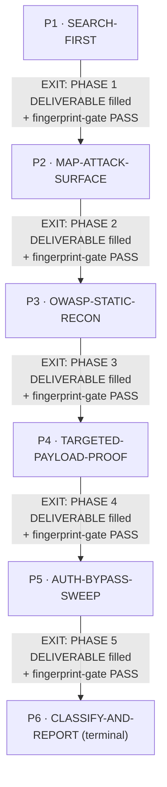

# Security Auditor — Quasi-Software View (five layers: NODES, PHASES, INTERNAL, PARALLELIZATION, EXPECTED OUTPUTS)

This is `grimorio.security`'s own DRAWN quasi-software design view, produced per
ref:skill/grimorio.phase-splitting#the-agent-design-plans-drawn-view--a-hard-requirement-never-optional's
standing requirement that every agent-design plan carry one, saved alongside the agent's own design as a
reference file. It mirrors
ref:skill/grimorio.fan-out/researcher-phases/researcher-quasi-software-view.md's own already-shipped five-layer
shape — read in full as this file's own structural exemplar, never as its content — adapted to a SIX-phase,
fully sequential, non-recursive chain instead of a three-phase orchestrator one. This file draws all layers
directly from ref:skill/grimorio.security-memory/behavior.md and its six
ref:skill/grimorio.security-memory/security-phases/phase-1-search-first.md through
ref:skill/grimorio.security-memory/security-phases/phase-6-classify-and-report.md, all read in full THIS pass,
in the same authoring dispatch that wrote them; it changes none of their content.

## Layer 1 + 2 — NODES (the orchestration graph) and PHASES (the state machine)

**Reading this diagram.** The solid rectangular spine (P1→P2→P3→P4→P5→P6) is the STATE MACHINE — the six phase
files' own chain, per
ref:skill/grimorio.phase-splitting#the-model--a-phase-is-a-mini-loop-state-with-three-fields. This chain carries
NO LOOP-BACK edge anywhere: a FAIL status set at P6 routes EXTERNALLY, to ref:skill/grimorio.feature-workflow's
own REWORK cycle (a fresh invocation of this agent, starting again at Phase 0, against the reworked code), never
an internal loop-back to an earlier phase of THIS invocation. Unlike `grimorio.system-keeper`'s own chain
(which loops P5→P4 and P6→P4 on a defect), nothing in any of these six phase files re-enters an earlier phase;
each phase's own Hard hand-off moves strictly forward, once, per invocation — a fully linear chain with no
internal loop is a legitimate shape here, not an unfinished one.

**No agent-node anywhere in this graph — stated explicitly, never merely "none found."**
`disallowedTools: Agent` is set on agent:grimorio.security's own shell, confirmed live this pass: this agent is
HARD-LOCKED non-recursive, and never spawns another agent from any phase, for any reason. Every other
already-shipped quasi-view in this corpus (system-keeper's `agent:grimorio.prompt-writer` node, researcher's
`SCOUT` node) draws at least one circular agent-node because that agent CAN spawn; this chain draws none because
grimorio.security structurally cannot.

## Layer 3 — INTERNAL: per-phase artifact-flow (IN → OUT), half (a) only

**Grounding — shared across every quasi-view that draws this layer, not re-derived here:**
ref:skill/grimorio.phase-splitting/project.quasi-view-requirements.md#half-a--boundary-artifact-flow-unchanged.
Per this brief's own explicit scope, only half (a) (boundary artifact-flow) is drawn for this chain — half (b)
(per-phase interior flowcharts + a KNOWN-ERRORS-TO-PHASE mapping) is optional per that same file and out of
scope for this pass, exactly as it remains for researcher's own quasi-view today.

**One artifact node per phase BOUNDARY, never two.** A six-phase chain has five internal boundaries
(P1↔P2, P2↔P3, P3↔P4, P4↔P5, P5↔P6) plus the terminal phase's own output reaching the caller — six artifact
nodes total, never one IN/OUT pair per phase individually, for the identical reason every already-shipped
quasi-view in this corpus already states: each phase's own Hard hand-off text already names Phase N's OUT as
the exact content Phase N+1 consumes as its IN.

```mermaid
flowchart LR
    P1["P1 · SEARCH-<br/>FIRST"] -.->|produces| D1@{shape: doc, label: "OBJECTIVE/EXIT<br/>+ precedent +<br/>attack-surface<br/>facts + earned<br/>rules"}
    D1 -.->|consumes| P2["P2 · MAP-ATTACK-<br/>SURFACE"]
    P2 -.->|produces| D2@{shape: doc, label: "attack-surface<br/>map (endpoints,<br/>data flow, auth<br/>boundaries, deps)"}
    D2 -.->|consumes| P3["P3 · OWASP-STATIC-<br/>RECON"]
    P3 -.->|produces| D3@{shape: doc, label: "filled A01-A10<br/>table + flagged<br/>surfaces"}
    D3 -.->|consumes| P4["P4 · TARGETED-<br/>PAYLOAD-PROOF"]
    P4 -.->|produces| D4@{shape: doc, label: "payload proof<br/>results + dep-<br/>audit result"}
    D4 -.->|consumes| P5["P5 · AUTH-BYPASS-<br/>SWEEP"]
    P5 -.->|produces| D5@{shape: doc, label: "sweep table<br/>(every auth'd<br/>endpoint x 4<br/>vectors)"}
    D5 -.->|consumes| P6["P6 · CLASSIFY-<br/>AND-REPORT"]
    P6 -.->|produces| OUT@{shape: doc, label: "security-report.md,<br/>## Status set,<br/>to the caller"}
```

The dotted edges here are the SAME visual convention as the EXIT edges in Layer 1+2 (both solid-and-labeled in
that diagram) but carry a DIFFERENT meaning — "consumes"/"produces" (data moving), never "EXIT" (control
moving) — the identical DFD process-vs-flow separation every already-shipped quasi-view in this corpus already
applies, now applied to this chain.

## Layer 4 — PARALLELIZATION: none — fully sequential by structural necessity

**This chain is sequential end to end, at every level — P1 → P2 → P3 → P4 → P5 → P6, one phase at a time, no
fan-out anywhere, ever.** Unlike researcher's own chain (one genuine internal fan-out inside P2, spawning N
scouts) or system-keeper's own chain (a spawn to `grimorio.prompt-writer` inside P4), this chain has NO node
capable of parallel dispatch at all: `disallowedTools: Agent`, confirmed at Layer 1+2 above, makes every phase a
single SELF node by construction, never a candidate for fan-out. Nothing in this layer is a design choice this
pass made — it is the direct, structural consequence of the same hard-lock every earlier layer already names.

## Layer 5 — EXPECTED OUTPUTS: WORK vs ORCHESTRATION, per phase

**The distinction this layer draws, kept separate from Layer 3 above: Layer 3 shows the DATA that crosses a
phase boundary — what the next phase literally reads. This layer shows the RESULT that phase's own WORK exists
to produce.**

| Phase | WORK PRODUCT (what the phase's own action produces) | ORCHESTRATION ACT (what it then routes, and to whom) |
|---|---|---|
| P1 · SEARCH-FIRST | OBJECTIVE/EXIT CONDITION stated; precedent audits surfaced; attack-surface facts and earned rules carried forward — a gathering pass, no code touched yet | Hands to P2 |
| P2 · MAP-ATTACK-SURFACE | The attack-surface map itself: endpoints, entry points, data flow, auth boundaries, new dependencies — read from upstream docs only | Hands to P3 |
| P3 · OWASP-STATIC-RECON | The filled A01-A10 static-analysis table + flagged surfaces + systemic findings | Hands to P4 |
| P4 · TARGETED-PAYLOAD-PROOF | Real, executed payload proof against exactly what P3 flagged, plus the dependency-audit result | Hands to P5 |
| P5 · AUTH-BYPASS-SWEEP | The exhaustive four-vector sweep table across EVERY authenticated endpoint P2 named, independent of P3's own flags | Hands to P6 |
| P6 · CLASSIFY-AND-REPORT | The actual reasoning work of this whole chain: severity + [CODE FIX]/[ARCH ISSUE] classification, the finished `security-report.md`, `## Status` set | Terminal — reports to the caller; no further phase to hand off to |

## Evidence of phase-design reasoning — RENDER/GROUP/MEASURE

Per
ref:skill/grimorio.phase-splitting/project.quasi-view-requirements.md#evidence-of-phase-design-reasoning--save-the-rendergroupmeasure-working-product-never-discard-it-silently,
this section restates, as a durable saved artifact rather than a claim taken on faith, the sizing reasoning
`grimorio.system-keeper` already performed while deciding this chain's own shape.

**RENDER — the complete load, before any grouping.** The pre-split `behavior.md` (flat STEPS: 3 Core rules, 10
numbered steps across 5 labeled stages — PLAN-MAP/OWASP-REVIEW/BUILD-AND-RUN-ATTACKS/CLASSIFY/DONE — one bolted
4-concern self-check gate, the OUTPUT template, 6 standing Rules) plus the shell's own 5-entry flat Knowledge
list (`grimorio.reasoning-principles`, `grimorio.working-memory`, `grimorio.security-memory` [the OWASP
checklist + auth-bypass vectors + payload format + severity + classification — practically all loaded up
front], `grimorio.feature-workflow`, `grimorio.development-patterns`) — every skill loaded on EVERY invocation
regardless of which of the five real functional stages (search, map, static-recon, prove, classify) actually
needed it.

**GROUP — six non-overlapping clusters, each a real distinct question/deliverable/knowledge slice.**
(0) SEARCH-FIRST: `audits/` + `attack-surface.md` + gate-methodology precedent — a genuine gap in the pre-split
file (`audits/` was never referenced anywhere in the old `behavior.md` or the shell). (1) MAP-ATTACK-SURFACE:
upstream pipeline docs only, zero security-memory playbook content, needing `development-patterns` moved here
from the old flat list. (2) OWASP-STATIC-RECON: the OWASP-10 checklist section alone. (3) TARGETED-PAYLOAD-
PROOF: the payload-format section + dependency-audit command, proving what (2) flagged. (4) AUTH-BYPASS-SWEEP:
the auth-bypass-testing section alone — an EXHAUSTIVE sweep independent of what (2)/(3) flagged. (5) CLASSIFY-
AND-REPORT: the severity + classification sections + `feature-workflow`'s own REWORK/escalation rule + the
OUTPUT template.

**MEASURE — a rendered count per group, not only the flagged one.** Group 0/SEARCH-FIRST: 3 project-fact
knowledge slices (precedent audits, attack-surface facts, earned gate-methodology rules) across 6 steps.
Group 1/MAP-ATTACK-SURFACE: 1 knowledge slice (development-patterns' auth/authorization/validation
recognition) across 3 steps. Group 2/OWASP-STATIC-RECON: 1 knowledge slice (the OWASP-10 checklist) across
3 steps. Group 3/TARGETED-PAYLOAD-PROOF: 2 knowledge slices (attack-payload-format + the dependency-audit
command) across 5 steps. Group 4/AUTH-BYPASS-SWEEP: 1 knowledge slice (the auth-bypass-testing section)
across 3 steps. Group 5/CLASSIFY-AND-REPORT: 3 knowledge slices (code-fix-vs-arch classification, severity
grading, and `feature-workflow`'s own REWORK/escalation rule) across 7 steps. Every group other than the one
below stays at ONE-TO-THREE cleanly-scoped slices per phase, none carrying the fused, cross-cutting load the
pincho below did.

**Against the pincho check.** The pre-split file's original single "BUILD-AND-RUN-ATTACKS" step
(payload generation/writing/execution + dependency audit + the full 4-vector auth-bypass sweep across every
authenticated endpoint, ALL in one step) carried THREE distinct knowledge slices at once versus every sibling
candidate's ONE — a rendered, measured pincho, exactly as the pre-supplied re-audit verdict flagged for
validation, not merely asserted. It fused two procedurally different missions: a TARGETED proof reacting to what
static recon already flagged, versus an EXHAUSTIVE sweep that must run on every authenticated endpoint
regardless of what static recon found. **SPLIT: resolved by dividing it into TARGETED-PAYLOAD-PROOF (group 3)
and AUTH-BYPASS-SWEEP (group 4)** — together they carry the SAME three slices the old fused step carried at
once (payload-format, the dependency-audit command, auth-bypass-testing), now divided so TARGETED-PAYLOAD-
PROOF holds its own two-slice load (payload-format + the dependency-audit command, both proving what static
recon already flagged) and AUTH-BYPASS-SWEEP holds exactly one (the auth-bypass-testing section, run
exhaustively regardless of what static recon found) — each with its own distinct question and deliverable
shape, never re-fused. **CHILDREN-OFFLOAD was considered and REJECTED as structurally unavailable**: this
agent is hard-locked non-recursive, so SPLIT is the only remedy the sizing method offers here.

**Coverage — every rendered item lands in exactly one group; none dropped.** The old file's item "NEVER
hardcode a project-specific test path... this general behavior file" was an AUTHORING-TIME meta-rule directed
at whoever writes this file, never a runtime step the agent itself performs each invocation — it is honored by
this very split (project-specific facts stay in `project.md`, referenced not inlined) rather than becoming a
phase step of its own.
