# Solution Architect — Quasi-Software View (five layers: NODES+PHASES, LOOP+GRAPH, INTERNAL, PARALLELIZATION, EXPECTED OUTPUTS)

This is `grimorio.solution-architect`'s own DRAWN quasi-software design view, produced per
ref:skill/grimorio.phase-splitting#the-agent-design-plans-drawn-view--a-hard-requirement-never-optional's standing
requirement that every agent-design plan carry one, saved alongside the agent's own design as a reference file.
This file went through THREE passes, all disclosed rather than only the final state kept: a PLAN-FOR-REVIEW
sketch (Layers 1+2 and 5, plus a PROVISIONAL Layer 3 Half (b)), produced before any phase file existed and
handed to `agent:grimorio.system-keeper` for review per
ref:skill/grimorio.agent-writing/prompt-writer-phases/phase-2-understand-verify-plan.md's own step 5; then, on
APPROVAL, a FINAL-AS-OF-THEN pass reconciling Layer 3 Half (b) against the seven real, now-authored phase files;
then a THIRD, `grimorio.code-reviewer`-driven REWORK-cycle-1 pass — Phase 3, 4, 5, and 6 each gained a new
trail-logging step, and Phase 3/5/6 gained a new uncertainty-flag step (Phase 4 already carried one), per
FINDING-02 (a false cross-cutting-coverage claim in this chain's own saved RENDER/GROUP evidence, now corrected
at ref:repo/objectives/design/solution-architect-phase-map-v1-derivation.md — also relocated there from a
gitignored `tmp/` path this same cycle, per FINDING-01) — every flowchart this pass touches is re-derived from
the real, now-corrected files, read fresh, never carried over unchecked.

## STEPS vs PHASES verdict, and the orchestrator/purpose-driven classification

**VERDICT: PHASES, purpose-driven.** Full reasoning saved at
ref:repo/objectives/design/solution-architect-phase-map-v1-derivation.md (relocated here from a `tmp/` scratch
path — that path was gitignored and would have been pruned, per `grimorio.code-reviewer`'s own FINDING-01,
mirroring the same durable-evidence precedent `design-orchestrator-phase-map-v1-derivation.md`,
`prompt-writer-phase-map-v2/v3-derivation.md`, and `system-keeper-phase-map-derivation.md` already set in this
same `objectives/design/` directory). Short form: the prior flat file's own `## Steps`
heading numbered 13 steps under 7 explicitly named "Node" headers, each drawing on genuinely different
knowledge, gated by load-bearing sequencing rules ("never before Node 3 DESIGN," the feature-inventory HARD
STOP, the CHECKPOINT-AND-PERSIST loop-back) — the textbook measured-incident shape
ref:skill/grimorio.phase-splitting/project.steps-vs-phases-test.md names. `grimorio.solution-architect` is
PURPOSE-DRIVEN, not an orchestrator: every phase except one bounded, conditional scout-panel fork/join inside
SCOPE-AND-DECOMPOSE is the architect doing its OWN substantive analytical work, never coordinating other agents
as its whole function.

## The four standing purpose-driven dimensions — where each is threaded, not manufactured as a phase

a. **GRIMORIO MEMBERSHIP/BASES** — named once, in Phase 1's own opening "Standing precondition" section,
   mirroring `grimorio.prompt-writer`'s own Phase 1, never re-taught.
b. **LOOP + RELATIONSHIPS** — stated once in Phase 0 (`behavior.md`)'s own "LOOP + RELATIONSHIPS" section:
   PARENT is whoever invokes the architect; ITSELF is the distributed self-check (each phase's own DELIVERABLE
   gate, never one bolted-on review phase); CHILDREN is REAL but CONDITIONAL and bounded to Phase 2's own scout
   panel — the shell carries no `disallowedTools: Agent`, confirmed live.
c. **KNOWN ERRORS** — this agent's own domain-specific known errors are named in Layer 3's own
   KNOWN-ERRORS-TO-PHASE mapping below, drawn from `SKILL.md`'s own "Anti-patterns" table and "the pre-build
   gate" section.
d. **BASE REQUIREMENTS AS ONE MISSION** — the prior file's own 6 "Core rules" and 5 "Rules" bullets are NOT
   given their own phase; each is threaded into the specific phase(s) where it is actually enforced (e.g. "Cost
   is OPEX, not dev" surfaces at both Phase 4's tech-selection judgment and Phase 6's own recommendation line;
   "Read before you design" IS Phase 1's own read-existing-first gate).

**SEARCH-FIRST, applied, not manufactured as an 8th phase.** Phase 1's own "read-existing-first gate" (its step
3) already IS this agent's own domain-specific SEARCH-FIRST move — the land-surveyor case
ref:skill/grimorio.phase-splitting#orchestrator-vs-purpose-driven--the-judgment-tests-own-missing-half's own
illustration names.

## Layer 1 + 2 — NODES (the orchestration graph) and PHASES (the state machine)

```mermaid
flowchart TB
    P1["P1 · GATHER-<br/>REQUIREMENTS"] --> P2["P2 · SCOPE-AND-<br/>DECOMPOSE"]
    P2 --> P3["P3 · DESIGN"]
    P3 --> P4["P4 · SELECT-TECH<br/>(reuse▸borrow▸<br/>buy▸build)"]
    P4 --> P5["P5 · WIDEN-AND-<br/>CHALLENGE"]
    P5 --> P6["P6 · RECOMMEND"]
    P6 --> P7["P7 · CHECKPOINT-<br/>AND-PERSIST"]

    P7 -->|"EXIT: WHEN every capability-<br/>sized piece is checkpointed<br/>(P7 step 6)"| DONE(("DONE —<br/>report to caller"))
    P7 -.->|"LOOP-BACK: WHEN capability-sized<br/>pieces remain unchecked (P7 step 6)<br/>— next piece re-enters at DESIGN"| P3

    SCOUT(("grimorio.scout<br/>(panel, N per<br/>capability piece,<br/>Haiku-tier)"))
    P2 -->|"WHEN the ask is big or cross-<br/>cutting (P2 step 3) — bounded<br/>fork, never the default"| SCOUT
    SCOUT -->|"per-piece findings,<br/>joined by SELF<br/>(P2 step 4)"| P2

    style SCOUT fill:#2a3a2a,stroke:#5a5
```

**Reading these two layers.** The solid spine (P1→P2→P3→P4→P5→P6→P7) is the STATE MACHINE — the seven phase
files' own chain, per
ref:skill/grimorio.phase-splitting#the-model--a-phase-is-a-mini-loop-state-with-three-fields. The single dashed
back-edge (P7→P3) is the LOOP, folded into this same PHASES layer, carrying P7 step 6's own trigger verbatim as
its label, per ref:skill/grimorio.loop-and-graph#2-the-loop--the-iteration-and-its-exit-condition applied one
level down over phases. `SCOUT` is the one agent-node in the GRAPH, drawn circular (distinct from the
rectangular phase-nodes), CONDITIONAL on Phase 2's own big/cross-cutting decision (its step 3) — never the
default.

**No future/not-wired agent-node is invented.** Phase 0's own "Your MEMORY" note and the prior flat file's OUTPUT
section both name a hand-off to "the software architect" for internal-code-design decisions — no agent named
that exists in this corpus (`grimorio.web-architect`/`grimorio.game-architect` split the role by area), and
nothing in the phase files invokes either via the `Agent` tool — it is advisory prose in Phase 7's own terminal
report, never a spawn. N/A, stated rather than invented.

## Layer 4 — PARALLELIZATION: the ONE genuine fork in this chain

**Finding: unlike `grimorio.system-keeper`'s own shipped view, which found NO fork/join bar belonged anywhere
in its diagram (every one of its four agent-nodes fires strictly sequentially), this chain's own Phase 2 forks
for real.** Phase 2 step 3's own text: "spawn a panel of hard-locked `agent:grimorio.scout` grunts... one per
capability piece" — plural, N-way, applying Rule 8(a) of
ref:skill/grimorio.phase-splitting/project.flow-method.md: each scout is REPORT-ONLY (it only reads/gathers for
its own piece, never writes the shared decomposition artifact), so the panel is eligible to run concurrently,
converging back at Phase 2's own step 4 (SELF, MODIFYING — it is the one node that writes the converged
decomposition, so it stays sequential per Rule 8(b)).

**Every other phase (P1, P3, P4, P5, P6, P7) is CONFIRMED sequential-only and MODIFYING under Rule 8(b)** — each
writes/settles its own piece of the design artifact as it goes; none of the phase files' own text names a spawn
anywhere outside Phase 2's own scope.

## Layer 3 — INTERNAL: per-phase artifact-flow (IN → OUT), Half (a)

**ONE artifact node per phase BOUNDARY, never two** — 6 boundary artifacts (P1↔P2 through P6↔P7) plus P7's own
terminal output to the caller; the P7→P3 loop-back's own artifact (the remaining-pieces list) intentionally NOT
drawn as a 7th node, per the "do not over-fragment an already-labelled loop-back edge" reasoning.

```mermaid
flowchart LR
    P1["P1 · GATHER-<br/>REQUIREMENTS"] -.->|produces| D1@{shape: doc, label: "Signed feature/scope<br/>inventory + requirements<br/>+ user stories"}
    D1 -.->|consumes| P2["P2 · SCOPE-AND-<br/>DECOMPOSE"]
    P2 -.->|produces| D2@{shape: doc, label: "Capability-sized piece list,<br/>each traced to stories"}
    D2 -.->|consumes| P3["P3 · DESIGN"]
    P3 -.->|produces| D3@{shape: doc, label: "Per-piece invariant/NFR +<br/>C4 + sequence + mechanism"}
    D3 -.->|consumes| P4["P4 · SELECT-TECH"]
    P4 -.->|produces| D4@{shape: doc, label: "Per-piece ladder result +<br/>5-lens judgment + OPEX line"}
    D4 -.->|consumes| P5["P5 · WIDEN-AND-<br/>CHALLENGE"]
    P5 -.->|produces| D5@{shape: doc, label: "Widened findings: canon,<br/>workaround(s), >=1 new finding"}
    D5 -.->|consumes| P6["P6 · RECOMMEND"]
    P6 -.->|produces| D6@{shape: doc, label: "Recommendation + OPEX<br/>line + 1-2 flagged risks"}
    D6 -.->|consumes| P7["P7 · CHECKPOINT-<br/>AND-PERSIST"]
    P7 -.->|produces| OUT@{shape: doc, label: "Persisted piece(s) in<br/>project.md, tagged"}
```

### Half (b) — per-phase interior behavior, drawn from the REAL authored files

**Every flowchart below is re-derived from the actual phase `.md` file, read fresh this pass — not carried over
from the plan-stage sketch.**

**P1 · GATHER-REQUIREMENTS**

```mermaid
flowchart TB
    A1["Step 1 — state own graph:<br/>SELF only, no spawn"] --> A2["Step 2 — state OBJECTIVE +<br/>EXIT CONDITION"]
    A2 --> A3{"Step 3 — read-existing-<br/>first: prior design for<br/>this topic in project.md?"}
    A3 -->|"YES"| A3y["REVISION — modify/<br/>update/refine what<br/>exists, never re-derive"]
    A3 -->|"NO"| A3n["fresh design"]
    A3y --> A4["Step 4 — Gate 0: NEVER<br/>produce technical design<br/>without requirements+<br/>scope+stories as input"]
    A3n --> A4
    A4 --> A5{"Step 5 — feature-inventory<br/>HARD STOP, UNLESS step 3<br/>found a prior inventory"}
    A5 -->|"fresh"| A5a["enumerate every feature<br/>IN/OUT/future + cost,<br/>verify, flag uncertainty,<br/>STOP for human sign-off"]
    A5 -->|"revision"| A5b["REVISE the prior<br/>inventory instead"]
    A5a --> A6
    A5b --> A6
    A6["Step 6 — requirements +<br/>user stories (Gherkin +<br/>acceptance), once signed<br/>off"] --> EXIT1
    EXIT1(["→ P2 · SCOPE-AND-<br/>DECOMPOSE"])
    classDef exit fill:#2a2a3a,stroke:#668,stroke-dasharray: 3 3
    class EXIT1 exit
```

**P2 · SCOPE-AND-DECOMPOSE**

```mermaid
flowchart TB
    B1["Step 1 — state own graph:<br/>SELF + conditional SCOUT<br/>fork/join"] --> B2["Step 2 — decompose into<br/>capability-sized pieces,<br/>each traced to stories"]
    B2 --> B3{"Step 3 — single well-<br/>scoped piece, or big/<br/>cross-cutting ask?"}
    B3 -->|"single piece"| B3n["run P3-P7 directly,<br/>no fan-out"]
    B3 -->|"big/cross-cutting"| B3y["fork: raise a panel of<br/>grimorio.scout, ONE per<br/>piece, Haiku-tiered,<br/>flow-briefed"]
    B3y --> B4["Step 4 — hold working<br/>notes in tmp/ until<br/>settled, then join:<br/>converge to consensus,<br/>SELF's own tier"]
    B3n --> EXIT2
    B4 --> EXIT2
    EXIT2(["→ P3 · DESIGN<br/>(per piece)"])
    classDef exit fill:#2a2a3a,stroke:#668,stroke-dasharray: 3 3
    class EXIT2 exit
```

**P3 · DESIGN** — also the target of P7's own LOOP-BACK; runs identically regardless of entry direction.

```mermaid
flowchart TB
    LOOPIN(["◄ from P7 LOOP-BACK,<br/>OR from P2 (first piece)"]) --> C1["Step 1 — state own graph:<br/>SELF only, no spawn"]
    C1 --> C2["Step 2 — invariant/NFR<br/>FIRST, then C4 view,<br/>sequence diagram, mechanism<br/>decision — every artifact<br/>traces to a story"]
    C2 --> C3{"Step 3 — NEVER name a<br/>technology or library at<br/>this stage"}
    C3 --> C4["Step 4 — log the<br/>reasoning trail to tmp/<br/>AS this phase works"]
    C4 --> C5{"Step 5 — uncertain or<br/>under-specified?"}
    C5 -->|"YES"| C5a["say so, flag it —<br/>NEVER invent an<br/>invariant/NFR/mechanism<br/>not actually asked for"]
    C5 -->|"NO"| EXIT3
    C5a --> EXIT3
    EXIT3(["→ P4 · SELECT-TECH"])
    classDef exit fill:#2a2a3a,stroke:#668,stroke-dasharray: 3 3
    class EXIT3 exit
    classDef loopin fill:#2a2a3a,stroke:#668,stroke-dasharray: 3 3
    class LOOPIN loopin
```

**P4 · SELECT-TECH**

```mermaid
flowchart TB
    E1["Step 1 — state own graph:<br/>SELF only, no spawn"] --> E2{"Step 2 — Do we ALREADY<br/>have it?"}
    E2 -->|"YES"| E2y["REUSE"]
    E2 -->|"NO"| E3{"Can we BORROW<br/>(maintained,<br/>permissive lib)?"}
    E3 -->|"YES"| E3y["adopt the library"]
    E3 -->|"NO"| E4{"Can we BUY<br/>(managed service)?"}
    E4 -->|"YES"| E4y["buy it"]
    E4 -->|"NO"| E5["Must BUILD —<br/>thinnest thing<br/>that closes the gap"]
    E2y --> E6
    E3y --> E6
    E4y --> E6
    E5 --> E6
    E6["Step 3 — judge the chosen<br/>candidate: OPEX + fit +<br/>license + lock-in +<br/>maintenance; state OPEX<br/>out loud"]
    E6 --> E7{"Step 4 — building what a<br/>maintained lib/service<br/>already does?"}
    E7 -->|"YES, no OPEX/fit<br/>justification"| E7a["NEVER — reuse/<br/>borrow/buy instead"]
    E7 -->|"NO / justified"| E8
    E7a --> E8
    E8{"Step 5 — dependency<br/>frozen, abandoned,<br/>patented, or copyleft?"}
    E8 -->|"YES"| E8a["flag as a liability<br/>explicitly"]
    E8 -->|"NO"| E9
    E8a --> E9
    E9{"Step 6 — two options<br/>genuinely close?"}
    E9 -->|"YES"| E9a["prefer lower OPEX,<br/>clearer exit"]
    E9 -->|"NO"| E10
    E9a --> E10
    E10{"Step 7 — uncertain or<br/>under-specified?"}
    E10 -->|"YES"| E10a["say so, flag it —<br/>never invent a need"]
    E10 -->|"NO"| E11
    E10a --> E11
    E11["Step 8 — log the<br/>reasoning trail to tmp/<br/>AS this phase works"] --> EXIT4
    EXIT4(["→ P5 · WIDEN-AND-<br/>CHALLENGE"])
    classDef exit fill:#2a2a3a,stroke:#668,stroke-dasharray: 3 3
    class EXIT4 exit
```

**P5 · WIDEN-AND-CHALLENGE**

```mermaid
flowchart TB
    F1["Step 1 — state own graph:<br/>SELF only, no spawn"] --> F2["Step 2 — run the unknown-<br/>unknowns checklist (failure<br/>mode, scaling wall,<br/>idempotency, abuse<br/>surface, cost@10x/100x,<br/>on-call, compliance)"]
    F2 --> F3["Step 3 — cite the relevant<br/>canon by name"]
    F3 --> F4{"Step 4 — a blocker was<br/>surfaced?"}
    F4 -->|"YES"| F4a["find the compliant<br/>workaround (existence-<br/>proof heuristic), or<br/>state precisely why<br/>none exists"]
    F4 -->|"NO"| F5
    F4a --> F5
    F5["Step 5 — challenge inherited<br/>assumptions, esp. from a<br/>single prototype"] --> F6["Step 6 — separate essence<br/>(invariant) from accident<br/>(swappable choice)"]
    F6 --> F7{"Step 7 — at least ONE<br/>failure mode / risk /<br/>cheaper option / pattern<br/>NOT already named?"}
    F7 -->|"NO"| F7a["not done — keep<br/>looking before<br/>proceeding"]
    F7a --> F7
    F7 -->|"YES"| F8["Step 8 — log the<br/>reasoning trail to tmp/<br/>AS this phase works"]
    F8 --> F9{"Step 9 — a candidate<br/>finding is genuinely<br/>uncertain, not a real<br/>risk?"}
    F9 -->|"YES"| F9a["say so, flag as<br/>uncertain — NEVER<br/>manufacture a finding<br/>just to satisfy step 7"]
    F9 -->|"NO"| EXIT5
    F9a --> EXIT5
    EXIT5(["→ P6 · RECOMMEND"])
    classDef exit fill:#2a2a3a,stroke:#668,stroke-dasharray: 3 3
    class EXIT5 exit
```

**P6 · RECOMMEND**

```mermaid
flowchart TB
    G1["Step 1 — state own graph:<br/>SELF only, no spawn"] --> G2["Step 2 — recommend, with<br/>the explicit OPEX line<br/>carried from P4"]
    G2 --> G3["Step 3 — flag the 1-2 risks<br/>(license, lock-in,<br/>maintenance) that could<br/>reverse this recommendation,<br/>drawn from P4/P5"]
    G3 --> G4["Step 4 — log the<br/>reasoning trail to tmp/<br/>AS this phase works"]
    G4 --> G5{"Step 5 — P4 and P5 pull<br/>in different directions,<br/>no clear winner?"}
    G5 -->|"YES"| G5a["say so, flag it —<br/>NEVER invent certainty<br/>neither upstream phase<br/>actually reached"]
    G5 -->|"NO"| EXIT6
    G5a --> EXIT6
    EXIT6(["→ P7 · CHECKPOINT-<br/>AND-PERSIST"])
    classDef exit fill:#2a2a3a,stroke:#668,stroke-dasharray: 3 3
    class EXIT6 exit
```

**P7 · CHECKPOINT-AND-PERSIST**

```mermaid
flowchart TB
    H1["Step 1 — state own graph:<br/>SELF only, no spawn"] --> H2{"Step 2 — this piece still<br/>being actively explored/<br/>debated?"}
    H2 -->|"YES"| H2a["keep in tmp/,<br/>not yet persisted"]
    H2 -->|"NO — settled"| H3["Step 3 — persist to<br/>project.md (or its<br/>{topic}.md), tagged<br/>RECOMMENDED, NOT SIGNED,<br/>the MOMENT it settles"]
    H3 --> H4{"Step 4 — explicit human<br/>approval given?"}
    H4 -->|"YES"| H4a["re-tag SIGNED/<br/>DECIDED"]
    H4 -->|"NO"| H4b["NEVER tag SIGNED<br/>without it — stays<br/>RECOMMENDED, NOT<br/>SIGNED"]
    H2a --> H5
    H4a --> H5
    H4b --> H5
    H5{"Step 5 — project.md >500<br/>lines, or a section<br/>>150 lines?"}
    H5 -->|"YES"| H5a["split into<br/>{topic}.md, one-line<br/>pointer left behind"]
    H5 -->|"NO"| H6
    H5a --> H6
    H6{"Step 6 — capability-sized<br/>pieces from P2 remain<br/>unchecked?"}
    H6 -->|"YES"| LOOP(["LOOP-BACK →<br/>P3 · DESIGN<br/>(next piece)"])
    H6 -->|"NO — all<br/>checkpointed"| DONE(["DONE — report<br/>full design to<br/>caller"])
    classDef exit fill:#2a2a3a,stroke:#668,stroke-dasharray: 3 3
    class LOOP,DONE exit
```

**Table — KNOWN-ERRORS-TO-PHASE mapping.**

| # | Known error / incident | Addressed by |
|---|---|---|
| 1 | Build-inertia: grabbing the first-level solution instead of the best pattern already surfaced (`SKILL.md`'s own "pre-build gate" section — two real in-repo incidents named: single-terrain blob autotiling shipped over already-surfaced corner/Wang transitions; hand-rolled code shipped over an existing reference implementation) | P4 step 2 (the reuse▸borrow▸buy▸build ladder, stop-at-first-yes — the same discipline this agent enforces on OTHERS via the pre-build gate, applied to its own tech-selection stage) |
| 2 | A design redesigned from scratch because nothing checked whether one already existed | P1 step 3 |
| 3 | Feature-inventory hard stop skipped — "the failure this role most often committed" | P1 step 5 |
| 4 | Recommendation contains only what the requester already named — reflecting inputs instead of adding knowledge (`SKILL.md`'s own anti-pattern table) | P5 in full — its entire purpose is this fix (steps 2-7) |
| 5 | Recommending without an OPEX line (`SKILL.md`'s own anti-pattern table) | P4 step 3 (state OPEX out loud) + P6 step 2 (restated as the recommendation's own headline) |
| 6 | Adopting an unmaintained/frozen or copyleft/patented dependency (`SKILL.md`'s own anti-pattern table) | P4 step 5 |
| 7 | Over-generalizing from a single prototype or data point (`SKILL.md`'s own anti-pattern table) | P5 step 5 |
| 8 | **OMISSION.** Designing internal code structure here instead of deferring to the software/game/web architect (`SKILL.md`'s own "Boundary with software architecture" section) | **No phase in this chain owns this as an active check** — it is a structural, standing boundary on the agent's own identity, stated in the shell (`.claude/agents/grimorio.solution-architect.md`), never touched by this pass, not a step any phase executes. |

## Layer 5 — EXPECTED OUTPUTS: WORK vs ORCHESTRATION, per phase

| Phase | WORK PRODUCT (what the phase's own action produces) | ORCHESTRATION ACT (what it then routes, and to whom) |
|---|---|---|
| P1 · GATHER-REQUIREMENTS | The signed, verified feature/scope inventory (unless revising a prior one) plus requirements + user stories, established as the BASIS for everything downstream | Hands the inventory + stories to P2 unmodified |
| P2 · SCOPE-AND-DECOMPOSE | The capability-sized piece list, each traced to specific stories; on a big/cross-cutting ask, the converged panel consensus | Forks the scout panel (conditional, N-way) and hands each piece to P3 |
| P3 · DESIGN | Per piece: invariant/NFR, C4 view, sequence diagram, mechanism decision, each traced to its story | Hands the settled per-piece design to P4 |
| P4 · SELECT-TECH | Per piece: the reuse/borrow/buy/build verdict, judged on OPEX+fit+license+lock-in+maintenance | Hands the tech verdict to P5 |
| P5 · WIDEN-AND-CHALLENGE | The widened findings: canon citations, workaround(s) for any blocker, challenged assumptions, at least one failure mode/risk/cheaper option the requester did not name | Hands the findings to P6 |
| P6 · RECOMMEND | The actual recommendation: explicit OPEX line + 1-2 flagged reversing risks | Hands the recommendation to P7 |
| P7 · CHECKPOINT-AND-PERSIST | The persisted (or still-staged) piece, tagged RECOMMENDED-NOT-SIGNED or SIGNED/DECIDED | Loops back to P3 for the next unchecked piece, or terminates — reports the full settled design to the caller |
