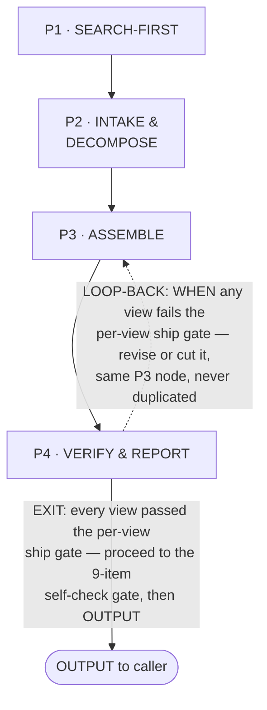
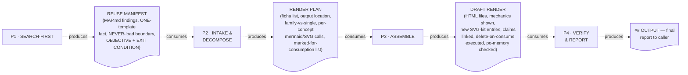

# Design Redactor — Quasi-Software View (STATE MACHINE + LOOP + GRAPH + INTERNAL layers)

This is `grimorio.design-redactor`'s own DRAWN quasi-software design view, produced per
ref:skill/grimorio.phase-splitting#the-agent-design-plans-drawn-view--a-hard-requirement-never-optional's standing
requirement, drawn DIRECTLY by `grimorio.system-keeper` rather than handed to `grimorio.prompt-writer` — the
explicit standing permission for either path, per
ref:skill/grimorio.phase-splitting/project.quasi-view-requirements.md#the-three-layer-hard-requirement's own
opening sentence. Saved alongside the agent's own phase chain
(`.claude/skills/grimorio.system-design/design-redactor-phases/`), per that same section's "ALWAYS SAVE the view
alongside the agent's own design" rule.

**This file draws four ALREADY-SHIPPED files, unchanged — it never re-authors any of them.** Phase 0
(`ref:skill/grimorio.system-design/design-redactor-behavior.md`) and Phase 1 through Phase 4
(`ref:skill/grimorio.system-design/design-redactor-phases/phase-1-search-first.md` through
`ref:skill/grimorio.system-design/design-redactor-phases/phase-4-verify-report.md`), authored by
`grimorio.prompt-writer` from `grimorio.system-keeper`'s own verbatim content assignment, per the RENDER/GROUP/
MEASURE evidence at
`ref:skill/grimorio.system-design/design-redactor-phase-map-v1-derivation.md`.

Same class of artifact as the two shipped precedents in this same corpus —
`ref:skill/grimorio.system-design/project.design-orchestrator-quasi-software-view.md` (this agent's own sibling,
same skill home) and `ref:skill/grimorio.agent-writing/prompt-writer-phases/prompt-writer-quasi-software-view.md`
(the closer structural match — also `disallowedTools: Agent`, also an empty GRAPH layer) — but sized to what a
4-phase, non-recursive, single-loop-back chain actually needs, never inflated to match either precedent's own
larger page count.

## The diagram

**Reading the two layers drawn here.** The solid rectangular spine (P1→P2→P3→P4) is the STATE MACHINE, per
ref:skill/grimorio.phase-splitting#the-model--a-phase-is-a-mini-loop-state-with-three-fields — the four already-
shipped phase files, unchanged; this view draws them, it does not redefine them. The two edges leaving P4 are the
LOOP, per ref:skill/grimorio.loop-and-graph#2-the-loop--the-iteration-and-its-exit-condition applied one level
down over phases: the solid edge to `DONE` is the EXIT, carrying the exit condition verbatim as its label; the
dashed edge back to P3 is the LOOP-BACK, carrying its own trigger verbatim, exactly as
`phase-4-verify-report.md`'s own step 2 states it ("WHEN any view fails ⟶ this is a genuine LOOP-BACK... return
to `phase-3-assemble.md`... you do NOT proceed to step 3 below... on a pass where any view still fails"). **This
is the ONLY loop edge in this chain** — P1→P2 and P2→P3 are one-way hand-offs with no return path, confirmed by
reading each phase file's own Hard hand-off section fresh: neither names a condition under which it sends the
chain backward.

## The GRAPH layer is empty by construction

**NEVER read the absent GRAPH layer above as an unfinished section.** `disallowedTools: Agent` is set in this
agent's own shell (`ref:repo/.claude/agents/grimorio.design-redactor.md`, frontmatter line 5, confirmed by reading
it directly for this view), and every one of the four phase files states the same fact explicitly in its own Step
1: "this agent never invokes another agent, in any phase, ever." Zero agent-nodes is therefore the correct,
complete rendering — the SAME empty-GRAPH shape
`ref:skill/grimorio.agent-writing/prompt-writer-phases/prompt-writer-quasi-software-view.md#the-graph-layer-is-empty-by-construction`
already documents for its own sibling non-recursive chain, matched here rather than duplicated with different
wording. **Unlike `grimorio.design-orchestrator`'s own Phase 1 (which MAY raise `grimorio.scout` on an unfamiliar
domain), this agent's own Phase 1 carries NO such option, ever** — its own text says so explicitly (Step 1: "This
phase carries NO scout-fan-out option, and never will").

**NEVER add an agent-node, or an edge to `grimorio.design-orchestrator`, anywhere in this diagram.**
`grimorio.design-orchestrator` is this agent's own typical PARENT (Phase 0's own LOOP+RELATIONSHIPS section: "…
typically `grimorio.design-orchestrator`'s own Phase 7, but NEVER assumed to be exclusively that caller") — never
a child this chain spawns or leans on. It appears in this file's own prose only, exactly the convention the
prompt-writer precedent already applies to its own PARENT (`grimorio.system-keeper`).

## Layer 3 — INTERNAL: per-phase artifact-flow (IN → OUT)

**Grounding — shared across every quasi-view that draws this layer, extracted once, not restated here:**
ref:skill/grimorio.phase-splitting/project.quasi-view-requirements.md#half-a--boundary-artifact-flow-unchanged.

**Design choice: ONE artifact node per phase BOUNDARY, never two.** Every phase's own Hard hand-off already
states it: Phase N's OUT is the exact same content Phase N+1 consumes as its IN. This chain's four phases draw
THREE boundary artifacts (P1↔P2, P2↔P3, P3↔P4) plus P4's own terminal `## OUTPUT` going to the caller — never one
IN/OUT pair per phase individually, and never a fourth boundary node duplicating the LOOP-BACK path already drawn
and labelled in the diagram above.

The dotted edges here reuse the same visual convention as the diagram above's LOOP-back edge (dashed, distinct
from the solid forward spine) but carry a DIFFERENT meaning — data moving ("consumes"/"produces"), never control
moving ("EXIT"/"LOOP-BACK"). The first diagram shows WHICH phase runs next and WHY; this one shows WHAT crosses
each boundary.

## Layer 3, Half (b) — per-phase interior behavior + KNOWN-ERRORS-TO-PHASE mapping

Per ref:skill/grimorio.phase-splitting/project.quasi-view-requirements.md#half-b--per-phase-interior-behavior-new's
FORM mandate: one mermaid `flowchart` per phase, never a markdown table for per-phase steps/decision logic — an
omitted branch must show up as a missing EDGE, not a row a careful reader happened to notice was gone. **ALWAYS
read every flowchart below as sourced FROM the four phase files' own current text, never as a paraphrase. WHEN
this section and the live phase files ever disagree ⟶ re-derive fresh against the files — they govern, never this
diagram's own prior wording.**

**P1 · SEARCH-FIRST**

```mermaid
flowchart TB
    A1["Step 1 — state the graph:<br/>single SELF (read MAP.md,<br/>confirm ONE-template,<br/>confirm NEVER-load, state<br/>OBJECTIVE/EXIT CONDITION);<br/>NO scout-fan-out option,<br/>ever — no spawn"] --> A2["Step 2 — BEFORE reading<br/>the design source itself,<br/>state OBJECTIVE (verbatim<br/>from caller) and EXIT<br/>CONDITION"]
    A2 --> A3["Step 3 — BEFORE rendering<br/>anything, read MAP.md IN<br/>FULL, find what exists,<br/>REUSE it — never reinvent"]
    A3 --> A4["Step 4 — ALWAYS reuse the<br/>project's ONE template as<br/>the only design-system<br/>home — AWARENESS only,<br/>never yet its exact<br/>component classes"]
    A4 --> A5["Step 5 — NEVER load<br/>artifact-design, artifact-<br/>diagramming, or dataviz"]
    A5 --> AEXIT
    AEXIT(["→ P2 · INTAKE &<br/>DECOMPOSE<br/>(fingerprint-gated on<br/>OBJECTIVE + EXIT CONDITION)"])

    classDef exit fill:#2a2a3a,stroke:#668,stroke-dasharray: 3 3
    class AEXIT exit
```

**P2 · INTAKE & DECOMPOSE**

```mermaid
flowchart TB
    B1["Step 1 — state the graph:<br/>single SELF (read source,<br/>decide ficha list, resolve<br/>location, decide mermaid-<br/>vs-SVG per concept, mark<br/>consumed items); no spawn"] --> B2["Step 2 — ALWAYS read the<br/>design source (design.md<br/>alone, or every file in the<br/>family) IN FULL before<br/>deciding anything"]
    B2 --> B3["Step 3 — WHEN rendering,<br/>place HTML output at the<br/>SAME location the source's<br/>own path used — never<br/>re-decide it"]
    B3 --> B4{"Step 4 — source is a<br/>FAMILY of files, not one<br/>design.md?"}
    B4 -->|YES| B4a["produce exactly ONE render<br/>for the whole family — one<br/>index.html + ficha-N.html<br/>set — NEVER one per file"]
    B4 -->|NO| B5
    B4a --> B5
    B5["Step 5 — for each concept<br/>needing a picture, decide<br/>mermaid vs hand-authored<br/>SVG by INFORMATION-TYPE<br/>(form-per-concept table);<br/>cross-check against Phase<br/>1's own reuse manifest —<br/>a kit-covered concept is<br/>reused, never re-authored"] --> B6{"Step 6 — this render<br/>consumes a backlog/<br/>finding/correction item?"}
    B6 -->|YES| B6a["MARK it here as consumed<br/>— do NOT delete yet;<br/>deletion is Phase 3's own<br/>job, same change it<br/>renders from"]
    B6 -->|NO| BEXIT
    B6a --> BEXIT
    BEXIT(["→ P3 · ASSEMBLE"])

    classDef exit fill:#2a2a3a,stroke:#668,stroke-dasharray: 3 3
    class BEXIT exit
```

**P3 · ASSEMBLE**

```mermaid
flowchart TB
    C1["Step 1 — state the graph:<br/>single SELF (build HTML<br/>per Phase 2's plan, author<br/>new SVGs, delete Phase 2's<br/>marked items, link every<br/>claim); no spawn"] --> C1c{"CORE RULE — about to<br/>redesign what the source<br/>says, or write/scope an<br/>executive summary?"}
    C1c -->|"YES — either"| C1cf["NEVER — a gap is a finding<br/>to report in Phase 4, never<br/>silently fixed; WHEN the<br/>source seems to call for a<br/>summary, flag it as a named<br/>future need instead"]
    C1c -->|NO| C2
    C1cf --> C2
    C2["Step 2 — for every<br/>mechanic/algorithm/flow/<br/>rule the source names ⟶<br/>SHOW it, never just name<br/>it"] --> C3["Step 3 — ALWAYS build the<br/>HTML using the ONE<br/>template's own components<br/>— never invent a new one<br/>the template already has a<br/>class for"]
    C3 --> C4{"Step 4 — a concept needs<br/>a hand-authored SVG the<br/>kit does not yet cover?"}
    C4 -->|YES| C4a["author it, SAVE it into<br/>the kit, add a MAP.md row<br/>— SAME change"]
    C4 -->|NO| C5
    C4a --> C5
    C5["Step 5 — every claim in<br/>the render links to its<br/>supporting doc or graphic<br/>— depth deferred, never<br/>dropped"] --> C6["Step 6 — NEVER ship a<br/>shallow trailer: the WHOLE<br/>mechanism, depth deferred<br/>in layers/links — same<br/>rule as Step 5, at the<br/>whole-render level"]
    C6 --> C7{"Step 7 — this render<br/>consumes an item Phase 2<br/>marked?"}
    C7 -->|YES| C7a["delete it from its source<br/>list NOW, SAME change —<br/>the EXECUTION half of the<br/>rule Phase 2 only marked"]
    C7 -->|NO| C8
    C7a --> C8
    C8["Step 8 — ALWAYS ground<br/>every claim against po-<br/>memory's signed product<br/>vision — never contradict<br/>what is already signed"] --> CEXIT
    CEXIT(["→ P4 · VERIFY<br/>& REPORT"])

    classDef exit fill:#2a2a3a,stroke:#668,stroke-dasharray: 3 3
    class CEXIT exit
```

**P4 · VERIFY & REPORT**

```mermaid
flowchart TB
    D1["Step 1 — state the graph:<br/>single SELF (run ship gate,<br/>run 9-item self-check gate,<br/>assemble report) PLUS a<br/>genuine LOOP-BACK edge to<br/>P3 when any view fails; no<br/>spawn"] --> D2{"Step 2 — BEFORE shipping,<br/>run the per-view ship gate<br/>on every diagram P3<br/>produced — passes for<br/>EVERY view?"}
    D2 -->|"NO — at least<br/>one view fails"| D2LB(["LOOP-BACK → P3 ·<br/>ASSEMBLE, naming which<br/>view failed and why —<br/>never proceed to Step 3<br/>or OUTPUT on this pass"])
    D2 -->|"YES — every<br/>view passed"| D3["Step 3 — ALWAYS run the<br/>9-item self-check gate as<br/>ONE mission (source read<br/>in full? location correct?<br/>family→ONE render? template<br/>reused not invented? every<br/>mechanic shown? ship gate<br/>run? SVG+MAP.md row<br/>together? no exec summary?<br/>delete-on-consume executed?)"]
    D3 --> D4["Step 4 — NEVER spawn a<br/>sub-agent to parallelize<br/>rendering — serial, one<br/>design at a time"]
    D4 --> D5{"Step 5 — hit a genuine<br/>blocker mid-render (no<br/>template component, a<br/>missing prerequisite)?"}
    D5 -->|YES| D5a["name it plainly in the<br/>COULD-NOT close — cannot<br/>spawn, never invent a<br/>component or guess past<br/>it; caller decides whether<br/>to escalate further"]
    D5 -->|NO| DOUT
    D5a --> DOUT
    DOUT(["OUTPUT — the 6-field<br/>report block to the caller,<br/>terminal, no Phase 5"])

    classDef exit fill:#2a2a3a,stroke:#668,stroke-dasharray: 3 3
    class D2LB,DOUT exit
```

**Reading these four flowcharts as a measurement instrument, not decoration — the pincho check.** Raw step
counts, counted fresh against each phase file's own numbered `## Steps` list: P1=5, P2=6, P3=8 (incl. the Core
Rule branch), P4=5. This matches
`ref:skill/grimorio.system-design/design-redactor-phase-map-v1-derivation.md#step-3--measure-each-groups-load`'s
own MEASURE table (A=3, B=6, C=9, D grouped) closely enough to confirm no drift crept in between that derivation
and what actually shipped — the small deltas (P1's 5 steps vs the derivation's 3 rendered Core-rule items reflect
the two ADDED standing requirements, OBJECTIVE/EXIT CONDITION and the graph-statement step, both accounted for in
the derivation's own text as standing per-phase requirements never double-counted against the original 30) are
expected, not a discrepancy. **P3 (ASSEMBLE) remains the heaviest phase by a clear margin (8 vs 5-6 elsewhere),
exactly as its own file names honestly in its own opening paragraph** — never a fresh finding this diagram
surfaces, a confirmation of what the phase file already discloses about itself.

**Table — KNOWN-ERRORS-TO-PHASE mapping.** One row per measured incident/known-error in this corpus relevant to
this agent's own kind of work (a serial, non-recursive renderer). **WHEN a row's ADDRESSED BY column reads
OMISSION or N/A ⟶ that is a real, currently-true state, never a placeholder.**

| # | Known error / incident | Addressed by |
|---|---|---|
| 1 | Lossy relay across hops — compression at the IN hop | P1 step 2 (state OBJECTIVE verbatim from the caller, before reading anything else) |
| 2 | A step outside the task's own momentum goes undone (inertia/ordering) | The whole 4-phase split itself — Phase 0's own KNOWN ERRORS section names this as the reason the split exists at all |
| 3 | A phase that dumps everything in one pass becomes an unusable pincho (~28-30 requirement incident) | The RENDER/GROUP/MEASURE derivation (`design-redactor-phase-map-v1-derivation.md`) plus the pincho check immediately above this table |
| 4 | CLAIM-HARDENED-BEYOND-EVIDENCE — an artifact that "looks complete" while a real gap survives | P4 step 3 (9-item self-check gate) + step 2 (ship gate); the OUTPUT block's own `VERIFIED:` field names which claims are backed by which evidence |
| 5 | Executive-summary scope creep on a renderer surface | DOUBLE-COVERED: P3's own Core Rule (never write one while assembling) AND P4's own self-check item 8 (did I write or start one) — the write-time guard and the verify-time guard are two distinct phases, never the same check run twice |
| 6 | Delete-on-consume marked but never executed — an item silently re-consumed by a later design | P2 step 6 (MARK only) → P3 step 7 (EXECUTE, same change) → P4 step 3's own self-check item 9 (confirms it) — three distinct phases, each carrying its own half |
| 7 | SendMessage/agent-id misdirection (a spawned child reports to the wrong session) | **N/A, structurally** — `disallowedTools: Agent` forecloses spawning or messaging any other agent, in any phase, confirmed at "The GRAPH layer is empty by construction" above |
| 8 | "WRITTEN is not the same fact as WORKS" — a shipped artifact passing its own gate is not proof it functions for a human reader | **OMISSION.** P4's own ship gate and self-check gate are both PAPER checks against stated criteria — nothing in this chain opens the rendered HTML in a browser or otherwise confirms it actually displays correctly for a human, the same gap a purely textual review of any UI artifact carries. Not addressed by any phase in this chain today |
| 9 | Reference-outlived-its-target — a pointer rotted by an unrelated edit elsewhere in the corpus | **OMISSION.** No phase in this chain re-checks a PRE-EXISTING pointer it did not itself add or change this pass; only pointers newly added during this authoring pass were confirmed to resolve (done once, at authoring time, not a standing per-invocation check) |

## Layer 4 — PARALLELIZATION: entirely sequential, N/A by construction

**Finding, stated plainly: no fork/join bar belongs anywhere in this diagram, for a structural reason, not a
stylistic one.** `disallowedTools: Agent` means this chain cannot invoke anything, ever, in any phase — there is
no second running thing it could run concurrently WITH. The one LOOP-BACK edge (P4→P3) is a re-entry into the
SAME single-threaded execution, never a second thread — the identical distinction
`ref:skill/grimorio.agent-writing/prompt-writer-phases/prompt-writer-quasi-software-view.md#layer-4--parallelization-this-chains-own-work-is-entirely-sequential-na-by-construction`
already draws for its own sibling chain, applied here rather than re-derived.

## Layer 5 — EXPECTED OUTPUTS: WORK vs ORCHESTRATION, per phase

| Phase | WORK (what this phase's own action produces) | ORCHESTRATION (what it routes onward) |
|---|---|---|
| P1 — SEARCH-FIRST | The reuse manifest: MAP.md findings, the ONE-template fact confirmed, the NEVER-load boundary confirmed | Hands the manifest + OBJECTIVE/EXIT CONDITION to P2, fingerprint-gated |
| P2 — INTAKE & DECOMPOSE | The render plan: ficha list, output location, per-concept form calls, marked-for-consumption list | Hands the plan to P3 as its own bounded build target |
| P3 — ASSEMBLE | The actual draft HTML render, new SVG-kit entries, executed deletions, linked claims | Hands the finished draft to P4 for verification |
| P4 — VERIFY & REPORT | **A genuine EXCEPTION to the WORK-vs-ORCHESTRATION split** — like its structural sibling in the prompt-writer view, P4 IS the terminal work-product itself (the ship-gate result, the self-check result, the final report), not a pure coordination act with nothing of its own to show | Either loops back to P3 (on a failing view) or hands the finished `## OUTPUT` block directly to the caller — there is no phase after it |
