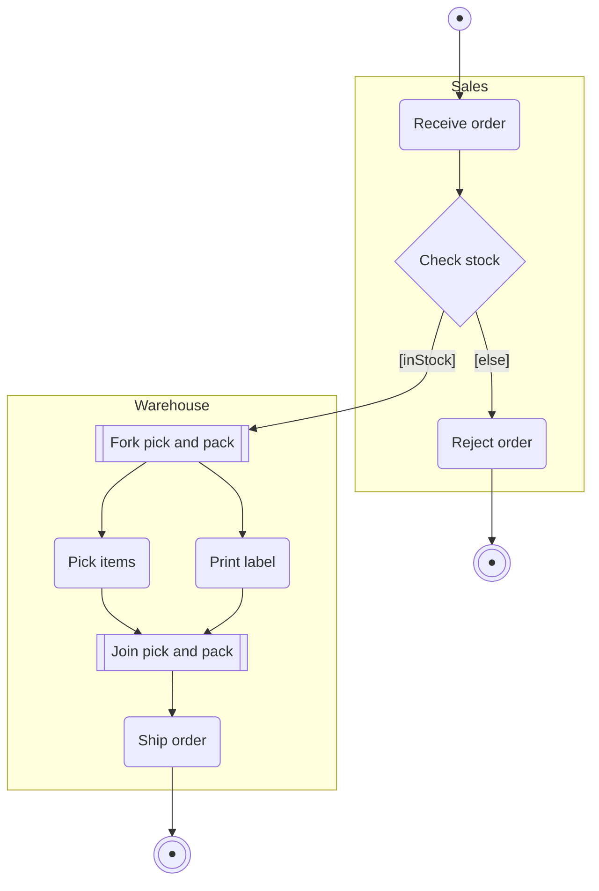

# UML Activity Diagram — Formal Reference

Fourth entry in the per-diagram-type reference series (companion to `use-case-diagram.md` and
`state-machine-diagram.md`). Same job: the exact rules an author must obey, the anti-patterns, and a
mechanical checklist — so `scripts/diagram-kit/activity.mjs` can generate correct-by-construction and lint
legacy diagrams. **The load-bearing contrast with the state machine:** an activity diagram's nodes are
**ACTIONS** (verb phrases — "Settle the match"); a state machine's nodes are **SITUATIONS** (nouns/adjectives —
"Settling"). Same graph shape (initial → flow → final, reachability, dead ends), inverted node semantics.

Sources: OMG UML 2.5 activity-diagram chapter as rendered/quoted in `uml-diagrams.org`
(`activity-diagrams.html`, `activity-diagrams-controls.html`); Scott Ambler, `agilemodeling.com`'s activity-diagram
style guide; Martin Fowler's own bliki (`martinfowler.com/bliki/UmlActivityDiagram.html`); Wikipedia's
`Activity diagram` article (quoting the OMG 2.5.1 text on control/object nodes). **Coverage note, stated up
front (same discipline the use-case reference used):** the *UML Distilled* 3rd-edition chapter 11 text itself
was not directly fetchable (the O'Reilly chapter page returned 403); Fowler's own bliki page **is** a direct
primary source and is quoted verbatim below — it is short (a pointer, not a treatise) and says so about
itself: *"I've often bemoaned the fact that there isn't a good book on teaching UML's activity diagrams"* and
points to Conrad Bock's UML 2 work as the deeper resource. Every non-obvious claim below is grounded in a
directly-fetched secondary or primary source; nothing is invented.

---

## Section A — Formal definition

### A.1 Element set and notation (uml-diagrams.org, quoting OMG UML 2.5; Wikipedia's shape table)

| Element | UML term | Mermaid `flowchart` shape (this kit's convention) |
|---|---|---|
| **Initial node** | `InitialNode` (a control node) | filled circle — `id((●))` |
| **Action** | `ActionNode` (an executable node) | rounded box — `id("Verb phrase")` |
| **Decision** | `DecisionNode` (a control node) | diamond — `id{"guard question"}` |
| **Merge** | `MergeNode` (a control node) | diamond — `id{"label"}` (same glyph as decision; see A.5) |
| **Fork** | `ForkNode` (a control node) | bar — `id[["fork"]]` |
| **Join** | `JoinNode` (a control node) | bar — `id[["join"]]` (same glyph as fork; see A.6) |
| **Activity final** | `ActivityFinalNode` | encircled filled circle — `id(((●)))` |
| **Flow final** | `FlowFinalNode` | not generated by this kit (out of scope, see A.4) |
| **Activity partition (swimlane)** | `ActivityPartition` | `subgraph id["Name"] ... end` |

Per Wikipedia's own rendering of the OMG UML 2.5.1 text: *"Object nodes hold data that is input to and
output from executable nodes, and moves across object flow edges. Control nodes specify sequencing of
executable nodes via control flow edges."* Wikipedia's shape table independently corroborates the
initial/action/decision/fork-join/final mapping used above: *"Stadia (rounded rectangles): represent
actions... Diamonds: represent decisions... Bars: represent the start (split) or end (join) of concurrent
activities... Black circle: represents the start... Encircled black circle: represents the end."*

### A.2 The transition/edge label

An edge carries an optional **guard**, written `[condition]`, evaluated when a token reaches a decision
(uml-diagrams.org, quoting the spec on guards: *"specification evaluated at runtime to determine if the edge
can be traversed"*). Unlike a state machine's `event [guard] / action` triad, a plain activity edge carries
no event — flow itself is the trigger; the guard is the only formal annotation an edge needs.

### A.3 Initial node — this kit's deliberate scope narrowing (disclosed, not silent)

uml-diagrams.org, quoting the OMG spec directly: **"Activities may have more than one initial node. In this
case, invoking the activity starts multiple flows, one at each initial node."** The spec genuinely permits
multiple initial nodes for a deliberately-concurrent-start activity. **This kit restricts to exactly ONE
initial node** — the common single-entry-point business-process case this series' other diagrams also model
(and the shape the CEO's own brief asked this kit to enforce) — and treats a second initial as a defect
within that scope. A genuinely multi-entry concurrent-start activity is out of this kit's scope, not
forbidden by the UML spec; if one is ever needed, it needs its own model shape, not a silent exception here.

### A.4 Flow final vs. activity final (uml-diagrams.org, quoting the spec)

Two distinct terminal node kinds exist, and conflating them is a documented pitfall (Section C.1):
- **Flow final** — *"destroys all tokens that arrive at it but has no effect on other flows in the
  activity."* Ends ONE branch only.
- **Activity final** — *"the first one reached stops all flows in the activity"*, terminating every
  executing action, destroying tokens in object nodes (except output parameters), aborting synchronous
  invocations (asynchronous calls are unaffected).

This kit models **activity-final only** (`model.finals`) — the common case, and the one the brief's own hard
rules name ("at least one activity-final reachable"). Flow-final is out of scope; a model needing it needs
its own extension, not a silent reuse of `finals`.

### A.5 Decision and merge — ONE glyph, two roles (uml-diagrams.org)

Decision and merge share the diamond glyph; the spec distinguishes them by their edges, not their shape:
- **Decision**: one incoming, ≥2 outgoing, each guarded. *"The modeler should arrange that each token only
  be chosen to traverse one outgoing edge."* An **else** guard is legal on **at most one** outgoing edge:
  *"For decision points, a predefined guard 'else' may be defined for at most one outgoing edge."* Tokens are
  **not duplicated** — exactly one outgoing edge fires per token.
- **Merge**: ≥2 incoming, exactly one outgoing, **unguarded** — it reunites alternative (not concurrent)
  flows. *"Merge should not be used to synchronize concurrent flows"* — that is fork/join's job (A.6). All
  incoming/outgoing edges at a merge must be homogeneously typed (all control, or all object flow).

Ambler (`agilemodeling.com`) states the decision-guard obligation as a hard rule, independently of the spec
text above: **"Each Transition Leaving a Decision Point Must Have a Guard."** Two further guard rules, same
source: **"Guards Should Not Overlap"** (his example: `x<0`, `x=0`, `x>0` are consistent; `x<=0` and `x>=0` are
not) and **"Guards on Decision Points Must Form a Complete Set"** (his example: `x<0` and `x>0` alone leave
`x=0` undefined) — Ambler's own fix is his fourth rule, **"Apply an `[Otherwise]` Guard for 'Fall Through'
Logic."**

### A.6 Fork and join — ONE glyph, two roles (uml-diagrams.org)

Fork and join share the bar glyph, again distinguished by their edges:
- **Fork**: one incoming, ≥2 outgoing. *"Tokens arriving at a fork are duplicated across the outgoing
  edges"* — every branch runs, unconditionally and concurrently (unlike a decision, which chooses ONE).
- **Join**: ≥2 incoming, one outgoing, default **"and"** semantics — *"requires at least one token offered on
  each incoming edge"* before it fires.

**Balance is the defect surface this kit checks (D7):** every fork's branches must reconverge at a matching
join whose incoming-edge count equals the fork's outgoing-edge count. A fork with no matching join leaves a
thread that never rejoins the main flow (Ambler's **"Miracle" activity** in spirit — see C.4); a join with
nothing forked into it is waiting on a synchronization that can never happen.

### A.7 Activity partitions / swimlanes (Ambler, `agilemodeling.com`)

A partition groups actions by the responsible actor/role/system, drawn as a swimlane. Ambler's style rules:
**"Order Swimlanes in a Logical Manner," "Apply Swim Lanes To Linear Processes," "Have Less Than Five
Swimlanes," "Consider Horizontal Swimlanes for Business Processes."** This kit's own added rule (D10, not
from a cited source — a direct consequence of declaring partitions at all): once `model.partitions` is
non-empty, every action must name exactly one of them — an action with no assigned partition on a
partitioned model is an omission, not a valid "no lane" state.

### A.8 The hard constraints, stated as explicit numbered rules

1. **Every id referenced by an edge, by `initial`, or by `finals` must resolve** — `initial`/`finals` are
   their OWN control markers (never also a `nodes` entry — a flowchart has no native pseudostate the way
   `stateDiagram-v2` has `[*]`, so this kit gives initial/final their own dedicated shapes instead, A.1).
2. **Exactly one initial node** (this kit's scoped convention, A.3).
3. **At least one activity-final, and it must be reachable** from the initial (A.4).
4. **An action node names an ACTIVE VERB PHRASE** — never a bare noun/adjective/status/gerund standing alone
   (Wikipedia's action-node shape table + this series' own inverted state-machine rule; the state machine's
   own reference names the mirror-image rule: *"States are conditions/situations, not actions"* —
   `state-machine-diagram.md` §A.3 rule 7).
5. **Every decision node's outgoing edges carry a `[guard]`**, at most one of which may be `[else]`
   (Ambler, A.5).
6. **A merge node has ≥2 incoming edges and exactly 1 outgoing edge**, and is never used to synchronize a
   fork's concurrent branches (A.5, uml-diagrams.org's explicit prohibition).
7. **Fork and join are BALANCED** — every fork's branches reconverge at one join whose incoming-edge count
   equals the fork's outgoing-edge count (A.6).
8. **No node is a dead end** ("Black Hole" activity, Ambler — a node with incoming, no outgoing) unless it is
   a declared activity-final.
9. **Every node is reachable** from the initial (no "Miracle" activity, Ambler — a node with outgoing, no
   incoming, i.e. unreachable).
10. **If partitions are declared, every action names exactly one** (A.7, this kit's own consequence rule).

---

## Section B — Canonical example (mermaid, compile-clean)

An order-fulfilment activity: one initial, a guarded decision with `[else]`, a fork/join pair over two
partitions, and two activity-finals (an early rejection, and normal completion) — the multi-final case A.4
explicitly allows.

Reading it: `D` is a decision (2 outgoing, guarded, exhaustive via `[else]`); `F`/`J` are a balanced
fork/join pair (2 branches out of `F`, 2 edges into `J`); every action reads as a verb phrase; `Z1`/`Z2` are
both reachable activity-finals — `Warehouse` with no outgoing anywhere would have been the dead-end defect
(A.8 rule 8).

---

## Section C — Documented anti-patterns

### C.1 An activity diagram that is really a STATE MACHINE (and the reverse)

The two diagram types are historically entangled — Wikipedia's own account: *"In UML 1, activity diagrams
were seen as special cases of state diagrams"* before UML 2 *"reformalized them based on Petri net-like
semantics."* The confusion still surfaces as a drawing mistake in both directions:
- **Nodes named as situations, drawn as an activity** ("Settling", "Pending approval") — those are STATES;
  an activity's nodes are the VERBS that cause the transition between situations, not the situations
  themselves. This kit's D4 rule catches the tell mechanically.
- **The inverse**, documented in this series' own state-machine reference (`state-machine-diagram.md`
  §C): *"A FLOWCHART wearing the label: boxes = processing steps chained by unlabelled arrows — that is an
  activity diagram / flowchart, not a state machine."* A state machine's `statemachine.mjs` lint SKIPS a
  `flowchart` block for exactly this reason (its own cross-type-skip mirrors this kit's own skip of
  `stateDiagram-v2`, A.8 rule 1's own control-marker distinction).

### C.2 Flowchart terminator/box notation standing in for the UML activity vocabulary

A **real, mechanically-surfaced instance** of this exact anti-pattern (see the kit's own selftest, which
lints the actual design-doc file this was found in): a control-flow diagram whose own prose explicitly
self-identifies as *"the ACTIVITY/control-flow view"* was drawn with a stadium shape (`(["text"])`) doing
double duty as BOTH the single entry point and MULTIPLE distinct early-exit points, and plain rectangles
(`[text]`) for its process steps — the generic flowchart convention, not the UML action/initial/final
vocabulary of A.1. It is a real, useful diagram; it is simply not drawn in the notation it says it is. The
correct alternative: use the dedicated shapes (A.1) so a reader (and this kit) can tell "start" from "an
early exit" from "an ordinary step" without reading every label.

### C.3 Plain-text edge labels standing in for `[guard]` brackets

A second real, mechanically-surfaced instance from the same source file: decision edges labelled with bare
"yes"/"no"/"THROWS" text instead of a bracketed guard. Ambler's own rule (A.5, A.8 rule 5) is explicit that a
transition leaving a decision **must** carry a guard — a plain label reads fine to a human but is invisible
to a tool checking exhaustiveness/overlap (Ambler's "Guards Should Not Overlap" / "Must Form a Complete Set"
rules cannot even be evaluated against free text).

### C.4 "Black Hole" and "Miracle" activities (Ambler's own named anti-patterns)

Ambler names both directly: **"Question 'Black Hole' Activities"** (an action with transitions IN but none
OUT — this kit's D8) and **"Question 'Miracle' Activities"** (transitions OUT but none IN, i.e. unreachable
— this kit's D9). An unbalanced fork/join (A.6) is a structural special case of the same family: a forked
thread that never reaches a join is a Miracle *for the join waiting on it*.

### C.5 «include»/«extend»-style sequencing borrowed from the use-case diagram

Not sourced to a specific citation (a logical-consistency note, not a spec claim): an activity diagram
already IS the sequencing diagram — importing a use-case's «include»/«extend» stereotypes onto activity
edges (to mean "always calls" / "optionally calls") is redundant and wrong-typed; express sub-activity calls
as ordinary action nodes with a call-behavior label, never as a borrowed use-case stereotype.

---

## Section D — Mechanical checklist (mirrors `activity.mjs`'s own `item N` numbering)

1. Every id an edge/`initial`/`finals` references resolves; `initial` and each `finals` entry are their own
   control markers, never also a `nodes` entry (A.1, A.8 rule 1).
2. Exactly one initial node declared (A.3, A.8 rule 2).
3. At least one activity-final declared, and it is reachable from the initial (A.4, A.8 rule 3).
4. Every action node's name reads as a VERB PHRASE, never a bare noun/adjective/gerund/status word
   (A.1, A.8 rule 4) — the INVERSE of the state machine's own D3 ("names a SITUATION").
5. Every decision node's outgoing edges carry a `[guard]`; at most one may be `[else]` (A.5, A.8 rule 5).
6. Every merge node has ≥2 incoming and exactly 1 outgoing edge (A.5, A.8 rule 6).
7. Every fork's branches reconverge at a matching join with the same thread count (A.6, A.8 rule 7).
8. No node is a dead end ("Black Hole") unless it is a declared activity-final (A.8 rule 8, C.4).
9. Every node is reachable from the initial ("Miracle" check, A.8 rule 9, C.4).
10. If partitions are declared, every action names exactly one (A.7, A.8 rule 10).
11. The mermaid source actually parses (`flowchart` block, valid node/edge/subgraph syntax) — verified by
    compiling it, never assumed correct by inspection.

---

## Sourcing summary

| Claim area | Grounding | Fetched directly? |
|---|---|---|
| Node/control-node vocabulary, initial multiplicity, flow-final vs activity-final, decision/merge/fork/join semantics, guard/else rules, merge-not-for-sync | `uml-diagrams.org` (`activity-diagrams.html`, `activity-diagrams-controls.html`), quoting OMG UML 2.5 | Yes, both fetched directly |
| Mandatory/complete/non-overlapping decision guards, `[Otherwise]` guard, swimlane style rules, "Black Hole"/"Miracle" activity anti-patterns | Scott Ambler, `agilemodeling.com`'s activity-diagram guidelines | Yes, fetched directly |
| Fowler's own remark on activity-diagram teaching material (coverage note) | Martin Fowler, own bliki, `martinfowler.com/bliki/UmlActivityDiagram.html` | Yes, fetched directly (a short, self-describing pointer page, not a treatise) |
| Shape-to-role table (stadia/diamonds/bars/circles), UML1→UML2 reformalization, activity-vs-flowchart distinction | Wikipedia, `Activity diagram`, itself quoting OMG UML 2.5.1 | Yes, fetched directly |
| State-machine cross-reference (C.1's inverse anti-pattern) | This series' own `state-machine-diagram.md` §A.3 rule 7 / §C | Repo self-citation |
