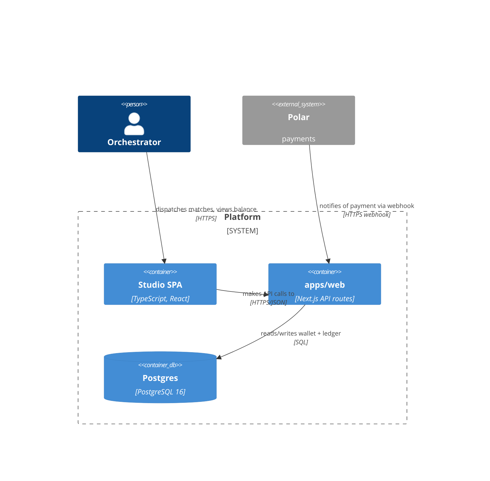

# C4 Container Diagram — Formal Reference

Third entry in the per-diagram-type reference series (companion to `use-case-diagram.md` and
`state-machine-diagram.md`). Same job: the exact rules an author must obey, the anti-patterns, and a
mechanical checklist — so `scripts/diagram-kit/c4container.mjs` can generate correct-by-construction and
lint legacy diagrams.

Sources: c4model.com — the [Container diagram](https://c4model.com/diagrams/container) page, the
[Notation](https://c4model.com/diagrams/notation) page, and the
[System Context diagram](https://c4model.com/diagrams/system-context) page (single-system-in-scope rule);
mermaid.js.org's own [C4 syntax reference](https://mermaid.js.org/syntax/c4.html) for the exact
`C4Container` function signatures this kit emits; Simon Brown, *Software Architecture for Developers* —
the book that originated the C4 model, cited here only for the level hierarchy already stated verbatim on
c4model.com (the site is Brown's own canonical restatement of the book's model, kept current where the
book is not).

## Section A — FORMAL DEFINITION

### A.1 Where "container" sits in the C4 levels
C4 defines four hierarchical levels — **Context → Container → Component → Code** — each a zoom-in on the
one above it. A **Container diagram (level 2)** "visualizes the high-level shape of the software
architecture and how responsibilities are distributed across it. It also shows the major technology
choices and how the containers communicate." (c4model.com/diagrams/container) It zooms into **a single
software system** — the same "single software system in scope" rule the System Context diagram (level 1)
states for itself (c4model.com/diagrams/system-context) — and decomposes THAT one system into its
containers, while every other system stays undecomposed context.

### A.2 What a "container" is
"A container is an application or a data store." (c4model.com/diagrams/container) Examples given: a
server-side web application, a client-side single-page application, a desktop/mobile app, a database
schema, a file-system folder, a cloud storage bucket. A container is a **separately runnable/deployable
unit** — not a library, not a class.

### A.3 Element vocabulary + mermaid tokens (`C4Container`, mermaid.js.org/syntax/c4.html)
| Element | Meaning | Mermaid token | Args (positional) |
|---|---|---|---|
| Person | a human user | `Person(alias, label, ?descr)` | no technology field |
| Person (external) | a human user outside the org | `Person_Ext(alias, label, ?descr)` | same shape |
| External system | a system the diagram does NOT decompose | `System_Ext(alias, label, ?descr)` | no technology field |
| System boundary | the ONE system in focus | `System_Boundary(alias, label) { ... }` | wraps its containers |
| Container | an app / process | `Container(alias, label, ?techn, ?descr)` | techn is the 3rd arg |
| Container (data store) | a database / schema | `ContainerDb(alias, label, ?techn, ?descr)` | same shape |
| Container (queue) | a message queue/broker | `ContainerQueue(alias, label, ?techn, ?descr)` | same shape |
| Relationship | an interaction | `Rel(from, to, label, ?techn)` | label is 3rd arg, techn 4th |

mermaid's C4 support is marked **experimental** by mermaid.js.org itself ("the syntax and properties can
change in future releases") — this kit's `generate()` is restricted to the subset verified to compile via
this project's own mermaid tool (`a mermaid validator`): `Person`/`Person_Ext`,
`System_Ext`, `System_Boundary { }`, `Container`/`ContainerDb`/`ContainerQueue`, `Rel`.

### A.4 The HARD CONSTRAINTS (stated as rules; numbered to match the kit's `item N`)
1. **Exactly ONE `System_Boundary`** — the system in focus — and **every `Container`/`ContainerDb`/
   `ContainerQueue` sits inside it.** A container diagram decomposes one system (A.1); a second boundary
   or a container declared outside the one boundary breaks that single-system-in-scope contract.
2. **Every `Rel`'s two endpoints reference DECLARED elements** — no dangling relationship. Implicit in
   c4model.com's own worked diagrams: every line connects two elements that are themselves drawn.
3. **Every `Rel` is LABELLED.** Notation page: "Every line should be labelled, the label being consistent
   with the direction and intent of the relationship (e.g. dependency or data flow)."
   (c4model.com/diagrams/notation)
4. **Relationships BETWEEN containers should carry a technology/protocol.** Notation page, container-level
   specific: "Relationships between containers (typically these represent inter-process communication)
   should have a technology/protocol explicitly labelled." Stated as a "should" — a strong convention, not
   an absolute prohibition the way rules 1-3 are — so the kit treats a tech-less container-to-container
   `Rel` as a **WARNING**, never a hard FAIL.
5. **Every `Container`/`ContainerDb`/`ContainerQueue` carries an explicit technology descriptor.**
   Notation page: "Every container and component should have a technology explicitly specified." Applied
   as a hard rule at the container level (not softened to WARN) because the technology arg is *why* a
   container diagram exists at all (A.1: "shows the major technology choices").
6. **No orphan container** — every container has at least one relationship in or out. A container drawn
   with no connection to anything cannot be "how the containers communicate" (A.1) — it is either a
   modelling mistake or genuinely dead.
7. **A `Person`/`Person_Ext` and a `System_Ext` sit OUTSIDE the system boundary** — they are context
   (A.3 of the System Context diagram: "software systems... that are directly connected to the software
   system in scope... typically sit outside the scope or boundary of your own software system"), never
   containers of the system being decomposed.
8. **Every element carries a short description** and its type is explicit. Notation page: "The type of
   every element should be explicitly specified" and "Every element should have a short description." A
   content-quality convention, not mechanically enforced as a hard FAIL by this kit (analogous to how the
   use-case reference treats an unassociated use case as a WARN, not a defect).

## Section B — CANONICAL EXAMPLE (mermaid, compile-clean)

A minimal container diagram for a spend-tracking system: one person, one external payments system, three
containers, all relationships labelled and teched.

Reading it: one `System_Boundary` (`platform`) holds every container; `user` (a `Person`) and `polar` (a
`System_Ext`) sit outside it; every `Rel` names both its purpose and its protocol; every container names
its technology in the 3rd argument. Verified to compile via
`a mermaid validator` (" 0 failed ").

## Section C — DOCUMENTED ANTI-PATTERNS
- **PROSE-DRAWN "C4"**: a diagram whose title or heading claims to be a C4 container diagram but is
  actually authored in a different mermaid dialect (a plain `flowchart`), with the container/technology/
  relationship information encoded only as free-text node labels and edge labels, never as C4's own typed
  tokens (`Container(id, label, techn)`, `Rel(from, to, label, techn)`). This is invisible to any
  C4-specific mechanical check — a lint or a generator built against `C4Container` syntax cannot see it at
  all, because it never matches. **Observed in the wild** — see the real-instance finding below.
- **MULTIPLE SYSTEMS IN ONE CONTAINER DIAGRAM**: two or more `System_Boundary` blocks in the same diagram.
  A container diagram decomposes ONE system (A.1); showing a second system's internals turns it into an
  ad-hoc multi-system diagram C4 does not define. (A.4 rule 1.)
- **CONTAINER OUTSIDE ANY BOUNDARY**: a `Container(...)` call that sits outside every `System_Boundary` —
  either an accidental placement or a container that actually belongs to a DIFFERENT system and should be
  drawn as a `System_Ext`/context element instead, never as a loose container. (A.4 rule 1.)
- **THE UNLABELLED ARROW**: a `Rel` with no description — the reader cannot tell whether it is a
  dependency, a data flow, or something else. (A.4 rule 3.)
- **THE TECHNOLOGY-LESS CONTAINER**: a `Container(...)` with no 3rd argument — defeats the diagram's own
  purpose of showing "the major technology choices." (A.4 rule 5.)
- **THE ORPHAN CONTAINER**: a container drawn with zero relationships — cannot be "how the containers
  communicate." (A.4 rule 6.)
- **A PERSON OR EXTERNAL SYSTEM INSIDE THE BOUNDARY**: drawing `Person`/`System_Ext` calls nested inside
  the `System_Boundary { }` block — conflates context (who/what the system talks to) with the system's own
  internal decomposition. (A.4 rule 7.)

## Section D — MECHANICAL CHECKLIST (each a yes/no; `item N` matches the kit's violation codes)
1. Exactly ONE `System_Boundary`, and every `Container`/`ContainerDb`/`ContainerQueue` sits inside it.
2. Every `Rel`'s `from`/`to` names a declared element (no dangling relationship).
3. Every `Rel` carries a label describing its purpose.
4. Every container-to-container `Rel` carries a technology/protocol (WARN if missing, not a hard FAIL).
5. Every `Container`/`ContainerDb`/`ContainerQueue` carries an explicit technology descriptor.
6. No container is an orphan (zero relationships in or out).
7. Every `Person`/`Person_Ext`/`System_Ext` sits outside every `System_Boundary`.
8. The mermaid parses as `C4Container` (verified via the project's own mermaid compiler, not assumed —
   mermaid's C4 support is experimental).

## Real-instance finding — the PROSE-DRAWN "C4" anti-pattern, found live

Linting a real design file with this
kit's `lint`: the file carried **5 mermaid blocks total — 2 `flowchart`, 3 `classDiagram` — and ZERO
genuine `C4Container` blocks.** The lint correctly reports `--- lint CLEAN ---` (0 violations, 5 blocks
skipped as non-C4Container) because none of the 5 are the C4 dialect this kit judges — an honest absence,
not a false negative.

The finding worth surfacing: **§2.2 of that same file is titled "The C4 container diagram — the deployable
parts and how they talk (v5)"**, but its fenced block opens with `flowchart TB`, not `C4Container`. Every
container is a free-text node label (`"Container: Studio SPA (browser, TS/React)"`), every relationship
is a `-->|"..."|`-style flowchart edge with the protocol folded into the same text label, and the "single
system boundary" is a plain `subgraph` with no `System_Boundary` semantics attached. This is the
PROSE-DRAWN "C4" anti-pattern documented in Section C above, observed rather than invented: a diagram that
*claims* C4-container status in its own heading while being authored in a dialect no C4-specific tool
(mermaid's own `C4Container` renderer, this kit's `generate`/`validate-model`/`lint`) can parse or check —
so none of this reference's 8 hard rules (technology-per-container, single boundary, labelled+teched
relationships) are, or ever were, mechanically verifiable on it. The content is plausibly still faithful to
C4's own container-level thinking (it does show containers, technologies, and protocols, in prose); the
defect is notational, not conceptual — and it is exactly the gap a future re-authoring of §2.2 in real
`C4Container` syntax would close, gaining this kit's checks for free.
