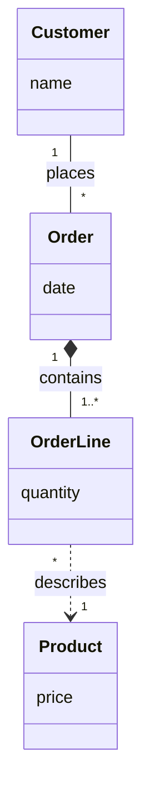
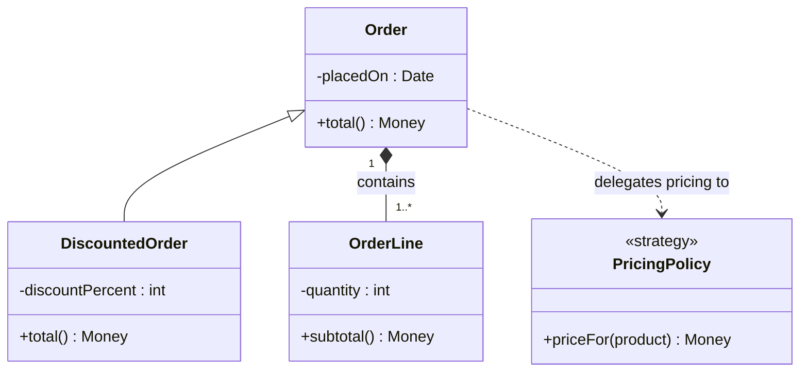

# UML Class Diagram — Formal Reference

Third entry in the per-diagram-type reference series (companion to `use-case-diagram.md` and
`state-machine-diagram.md`). Same job: the exact rules an author must obey, the anti-patterns, and a
mechanical checklist — so `scripts/diagram-kit/classdiagram.mjs` can generate correct-by-construction and
lint legacy diagrams. A class diagram is the one UML type with **two distinct, legitimate perspectives**
on the same subject matter (Larman's own point, ch.9): the **domain/conceptual model** (vocabulary, no
operations) and the **design class diagram** (types, visibility, operations) — this file grounds both.

Sources: Craig Larman, *Applying UML and Patterns*, 3rd ed., ch.9 "Domain Models" (read via
`objectsbydesign.com/books/larman_notes/4-StaticModeling.html`, Larman's own consulting site, and the
O'Reilly chapter listing, `oreilly.com/library/view/applying-uml-and/0131489062/ch09.html`); Martin
Fowler, *UML Distilled*, the chapter introducing the three perspectives on class diagrams (numbered ch.3
in the edition this project cites; ch.4 in some other printings — the perspectives themselves, not the
chapter number, are the load-bearing fact, corroborated via `etutorials.org`'s excerpt of the same text);
OMG UML 2.5.1's classifier/association/generalization/dependency chapters, as rendered directly by
`uml-diagrams.org` (`association.html`, `aggregation.html`, `composition.html`, `generalization.html`,
`dependency.html`, fetched 2026-08-31); mermaid's own `classDiagram` syntax reference
(`mermaid.js.org/syntax/classDiagram.html`, fetched 2026-08-31) for the notation this kit emits.

## Section A — FORMAL DEFINITION

### A.1 Elements and notation
| Element | Notation | Mermaid (`classDiagram`) |
|---|---|---|
| **Class** (classifier) | rectangle, name + optional attribute/operation compartments | `class Name { ... }` |
| **Attribute** | `[visibility] name : type` | `+balance : int` |
| **Operation** | `[visibility] name(params) returnType` | `+debit(amount) void` |
| **Visibility** | `+` public, `-` private, `#` protected, `~` package | prefix on the member line |
| **Stereotype** | `«name»` above/inside the class | `<<name>>` on its own line in the class body |
| **Association** | solid line, optional open arrowhead marking navigability, optional role names + multiplicity at each end | `A --> B` (directed) / `A -- B` (undirected) |
| **Aggregation** ("shared", weak whole-part) | solid line, **hollow diamond** at the whole end | `A o-- B` (`A` = whole) |
| **Composition** (strong whole-part) | solid line, **filled diamond** at the whole end | `A *-- B` (`A` = whole) |
| **Generalization** (inheritance) | solid line, **hollow triangle** pointing to the general (parent) classifier | `Parent <|-- Child` |
| **Dependency** | dashed line, open arrowhead from client to supplier | `Client ..> Supplier` |

Sources for the relationship row: OMG UML 2.5.1 as quoted/rendered by `uml-diagrams.org` — association
("a relationship between classifiers which is used to show that instances of classifiers could be either
linked to each other or combined logically or physically into some aggregation" —
`uml-diagrams.org/association.html`); aggregation ("a 'weak' form of aggregation when part instance is
independent of the composite," hollow diamond at the aggregate end — `aggregation.html`); composition
("exclusive ownership: a part could be included in at most one composite (whole) at a time... if a
composite (whole) is deleted, all of its composite parts are 'normally' deleted with it," filled diamond —
`composition.html`); generalization ("a binary taxonomic directed relationship between a more general
classifier (superclass) and a more specific classifier (subclass)... the arrowhead points to the symbol
representing the general classifier" — `generalization.html`); dependency ("a directed relationship... the
client is in some sense incomplete while semantically or structurally dependent on the supplier
element(s)," dashed arrow client→supplier — `dependency.html`). Mermaid's own member/arrow-token syntax
(`+`/`-`/`#`/`~`, `<|--`/`*--`/`o--`/`-->`/`..>`) is confirmed against `mermaid.js.org/syntax/classDiagram.html`
and against this project's own compiler (`a mermaid validator`, which runs real
`mermaid.parse()`).

### A.2 The two perspectives (Fowler; independently corroborated by Larman's two models)
Fowler names three perspectives a class diagram can be drawn in — **conceptual** ("draws a diagram that
represents the concepts in the domain under study... with little or no regard for the software that might
implement it"), **specification** (the software's interfaces, not its implementation), and
**implementation** (the actual code shape, e.g. bidirectional pointers between related classes) — and notes
perspective is "not part of the formal UML" but is load-bearing for reading a diagram correctly. Larman's
own domain-modeling chapter makes the same cut operationally: a **domain (conceptual) model** shows the
vocabulary of the problem space with **no operations**, and a separate **design class diagram** shows the
solution space with attributes, types, visibility, and operations — the two are DISTINCT artifacts, not one
diagram with optional detail. This kit's `model.perspective` field (`'conceptual' | 'design'`, default
`'design'`) exists to keep that distinction explicit and checkable rather than implied by omission.

### A.3 The HARD CONSTRAINTS (stated as rules, numbered to match the kit's `item` codes)
1. **Every class id is declared exactly once.** A repeated id is ambiguous — which declaration governs its
   members?
2. **A class name is a NOUN (a classifier), never a verb phrase.** Larman: conceptual classes name "things"
   in the domain, identified as noun phrases; a class named `ProcessPayment` names an ACTION — that belongs
   on an operation (`+process(payment)`), never as the classifier's own name. The kit's heuristic is
   deliberately narrow: it flags a verb-first COMPOUND (`mintRunCapability`, `ProcessPayment` — the
   function-name tell), never a bare single-word match (`Run`, `Transfer` are legitimate nouns in ordinary
   English even though the same spelling can also be a verb).
3. **Every relationship's two endpoints reference a DECLARED class** — no dangling endpoint. A relationship
   naming a class the model never declared is not a smaller diagram, it is a broken one.
4. **A present multiplicity is well-formed**: `1`, `0..1`, `*`, `1..*`, `0..*`, an exact `n`, or a bounded
   range `n..m` with `n ≤ m`. Multiplicity applies only to association/aggregation/composition — see rule 6.
5. **Generalization relationships form a DAG — no inheritance cycle.** Generalization is defined (A.1's
   sourced quote) as a directed relationship from a more SPECIFIC classifier to a more GENERAL one — a
   partial order. `A` more-general-than `B` more-general-than `A` contradicts the definition itself: the
   relationship cannot be simultaneously "more general than" and "more specific than" in both directions.
6. **The relationship's arrow/kind must match its own semantics.** A generalization edge (`<|--`) asserts
   substitutability — "is a kind of" — never an action ("uses", "produces", "calls"); an
   association/aggregation/composition/dependency edge must never assert "is a" (that is what
   generalization is FOR). A generalization edge never carries a multiplicity (multiplicity belongs to
   association-family relationships, which have countable ends; substitutability does not). Drawing one
   kind's semantics with another kind's arrow is a defect the lint catches wherever the edge's own label
   gives away the mismatch — see Section C.1 for a real, found instance of exactly this.
7. **(Domain/conceptual perspective) a conceptual class carries no operations** — WARN, not a hard fail.
   Larman/Fowler both treat this as a MODELING GUIDELINE for keeping the two perspectives honest, not an
   OMG structural constraint (nothing in the metamodel forbids an operation on a class used conceptually);
   the kit only raises this warning when `model.perspective === 'conceptual'` and a class in that model
   declares an operation anyway.

## Section B — CANONICAL EXAMPLES (mermaid, compile-clean)

### B.1 Domain/conceptual model — Larman's first model (no operations)
A small order-and-line-item vocabulary, the textbook shape of Larman's own worked domain models: nouns,
associations with multiplicity and role-reading labels, no methods, no types.

Reading it: `Order` and `OrderLine` are a whole-part COMPOSITION (an `OrderLine` cannot outlive its
`Order` — Larman's own worked example); `OrderLine ..> Product` is a DEPENDENCY, not composition — an
order line refers to a product it does not own or contain.

### B.2 Design class diagram — Larman's second model (types, visibility, operations)
The same subject matter, now in the solution space: a `Discount` policy applies to a subtype of `Order`.

Reading it: `Order <|-- DiscountedOrder` is a genuine substitutability claim — anywhere an `Order` is
accepted, a `DiscountedOrder` can stand in, per its own overridden `total()`. `Order ..> PricingPolicy` is
a dependency (Order calls it, does not inherit from it, does not contain it) — the direct counter-example
to the anti-pattern in Section C.1.

## Section C — DOCUMENTED ANTI-PATTERNS

### C.1 Generalization drawn for a "uses" relationship (found in the real instance, see below)
**The anti-pattern:** drawing `<|--` (generalization) between two classes whose real relationship is
"class B calls/uses class A's interface," never "B is a kind of A." The arrowhead makes a substitutability
claim the design does not intend, and it is checkable directly from the edge's own label: a generalization
edge labelled "uses" is asserting two contradictory things in one line.
**Why it is wrong:** per A.3 rule 6 — generalization means "the child is a kind of the parent, and can
stand in anywhere the parent is accepted" (A.1's sourced OMG definition). A "uses" relationship is a
DEPENDENCY (`..>`) at most, never an inheritance edge.
**Real occurrence, observed live:** a real design file's §2.4 drew three edges — `BudgetGuard <|-- BudgetedLlmClient : uses`, `BudgetGuard <|-- GameStrategy : uses`,
`BudgetGuard <|-- TurnLoopUnitCaller : uses` — draw generalization arrows for what the design's own prose
(and the label itself) describes as a USES relationship (three "hardened door" classes calling into a
shared guard), not an IS-A hierarchy. This kit's lint flags all three (item 6) — see the discrimination
proof in this kit's selftest run against the real file.
**The correct alternative:** `BudgetedLlmClient ..> BudgetGuard : uses` (dependency, arrow pointing from
the client to the guard it calls) — or, if the intent really is code reuse via a shared base class, name
the actual is-a relationship instead ("BudgetedLlmClient is a kind of BudgetGuard" is not what the design
says anywhere else in the same file).

### C.2 A function name promoted to a class name
**The anti-pattern:** naming a class node after the exported FUNCTION it wraps (`mintRunCapability`,
`requireEscrowToken`) instead of the CONCEPT or ROLE it plays (`CapabilityMinter`, `EscrowTokenGuard`).
**Why it is wrong:** A.3 rule 2 — a class names a THING, an operation names an ACTION; a lower-camelCase
verb-first identifier is the tell that a function got drawn as if it were a classifier.
**Real occurrence, this repo:** the same §2.4 block declares `class mintRunCapability` and
`class requireEscrowToken` — both literal function names from the codebase, elevated to class nodes. This
kit's lint flags both (item 2).
**The correct alternative:** name the class for its ROLE (`CapabilityMinter`, `EscrowTokenVerifier`) and
put the function as (or call into) one of its operations — the stereotype (`<<money gate>>`,
`<<runner gate>>`) the real diagram already carries on these nodes is itself evidence the author meant a
ROLE, and the class name should have matched that intent.

### C.3 Attribute that is really a conceptual class (Larman)
**The anti-pattern:** modeling a real domain concept as a bare attribute string/number instead of its own
class with an association. Larman's own test, stated directly (`objectsbydesign.com`): *"If we don't think
of some conceptual class X as a number or text in the real world, X is probably a conceptual class, not an
attribute... relate conceptual classes with an association, not with an attribute."*
**Why it is wrong:** it hides structure (multiplicity, its own attributes, its own lifecycle) inside a
primitive, and it is the single most common way a domain model under-models its own vocabulary.
**The correct alternative:** if the "attribute" itself has parts, a unit, or a lifecycle of its own, promote
it to a class and connect it by association/composition — exactly the shape `Order *-- OrderLine` takes
in B.1/B.2, versus a wrong alternative that would have modeled `Order.lines : string`.

### C.4 Multiplicity omitted where it materially disambiguates
**The anti-pattern:** an association with no multiplicity at either end when the cardinality is exactly the
fact the diagram exists to record (e.g., whether a `Match` can have one slot or two).
**Why it is wrong:** per A.1, multiplicity is how a class diagram states a structural INVARIANT — "1..2",
not "some". Omitting it where the invariant is the point defeats the diagram's own job.
**The correct alternative:** state the multiplicity explicitly wherever the count is a real constraint the
design depends on (the real instance's own `Match "1" *-- "1..2" MatchSlot` is the correct shape — it is
the exact invariant declared in `02-structure.md` §2.5, whose own note points to
`06-settlement-state-machine.md` §6.3 for the fragility that cardinality creates).

## Section D — FAITHFUL-MERMAID CHECKLIST (each a yes/no)
1. Uses `classDiagram` (not `flowchart`, not a hand-drawn box-and-arrow substitute).
2. Every class id is declared once; no two classes silently share an id.
3. Every class name is a NOUN classifier, never a verb-phrase/function-name (Section C.2).
4. Every relationship's two endpoints name a class actually declared in the same diagram — no dangling
   endpoint.
5. Every present multiplicity is well-formed (`1`, `0..1`, `*`, `1..*`, `0..*`, `n`, or `n..m` with `n ≤ m`).
6. Generalization relationships (`<|--`) form a DAG — no cycle, and no multiplicity on a generalization edge.
7. Every relationship's arrow matches what its own label asserts: a `<|--` edge reads IS-A, never an action
   (Section C.1); an association/aggregation/composition/dependency edge never reads IS-A.
8. If the model declares a `conceptual` perspective, no class in it carries operations (WARN if it does —
   Section A.2).
9. The mermaid actually parses (`classDiagram` block, valid class/member/relationship syntax) — verified
   against a real compiler (`a mermaid validator`), never assumed from visual inspection.

---

## Sourcing summary (per-claim provenance)

| Claim area | Grounding | Fetched directly? |
|---|---|---|
| Class/attribute/operation/visibility notation, mermaid's own arrow tokens | `mermaid.js.org/syntax/classDiagram.html`; confirmed empirically against this project's own mermaid compiler | Yes, both |
| Association / aggregation / composition / generalization / dependency formal definitions + notation | OMG UML 2.5.1, quoted/rendered via `uml-diagrams.org` (association.html, aggregation.html, composition.html, generalization.html, dependency.html) | Yes, all five fetched directly |
| The two/three perspectives (conceptual vs. specification vs. implementation) | Martin Fowler, *UML Distilled* — perspectives chapter, corroborated via `etutorials.org`'s excerpt and independent search summaries | Secondary excerpt, not the primary book text |
| Domain model = no operations; noun-naming; attribute-vs-association test; association naming | Craig Larman, *Applying UML and Patterns*, ch.9, via `objectsbydesign.com/books/larman_notes/4-StaticModeling.html` (Larman's own site) and the O'Reilly chapter listing | Secondary rendering of the primary chapter's own guidelines, not the raw book PDF |
| The two real anti-pattern instances (C.1, C.2) | Observed live in a real design file's §2.4 | Yes, read directly from the source design file |
