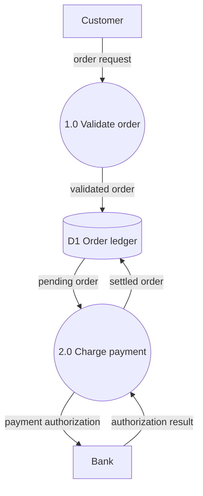

# Data-Flow Diagram (DFD) — Formal Reference

Third entry in the per-diagram-type reference series (companion to `use-case-diagram.md` and
`state-machine-diagram.md`). Same job: the exact rules an author must obey, the anti-patterns, and a mechanical
checklist — so `scripts/diagram-kit/dataflow.mjs` can generate correct-by-construction and lint legacy diagrams.
A DFD is a **structural** artifact like a state machine: it shows *what moves where*, never sequence or timing.

**Coverage / viability, stated up front (same discipline as `use-case-diagram.md`'s own coverage note):**
I could not fetch the three primary texts directly (DeMarco's *Structured Analysis and System Specification*,
1979; Gane & Sarson's *Structured Systems Analysis: Tools and Techniques*, 1977; Yourdon's *Modern Structured
Analysis*, 1989) — all three are pre-web-era books with no full free online text. Every claim below is grounded
through **secondary sources that name and quote these authors directly**, fetched live (2026-08-31): Wikipedia's
*Data-flow diagram* article (which itself quotes DeMarco's own endpoint rule), Scott Ambler's
`agilemodeling.com` DFD article (a rules-of-notation page in the same family already cited by
`use-case-diagram.md`), GeeksforGeeks' DFD-modelling article (the black-hole/miracle/grey-hole terminology), and
Visual Paradigm's DFD-symbols documentation. This mirrors exactly how `use-case-diagram.md` flagged its own
inability to fetch the raw OMG PDF — same honesty bar, same reason (large, non-fetchable primary sources), same
fix (converging, independently-written secondary sources that quote or name the primary authors).

---

## Section A — Formal definition

### A.1 The element set and its notation

| Element | Meaning | Gane-Sarson notation | Yourdon-DeMarco notation |
|---|---|---|---|
| External entity | A source or sink of data, outside the system's scope — a person, org, or another system | Square/rectangle | Same: square/rectangle |
| Process | Transforms input data into output data | Rounded rectangle, **numbered** | Circle/"bubble", **numbered** |
| Data store | Data at rest, read and/or written over time | Open-ended rectangle (two lines) | Two parallel horizontal lines |
| Data flow | The named DATA moving between two elements | Straight labelled arrow | Same: labelled arrow |

Sources: Gane and Sarson published their notation in *Structured Systems Analysis: Tools and Techniques*
(1977); DeMarco published his in *Structured Analysis and System Specification* (1979) — both dated and
attributed via Wikipedia's *Data-flow diagram* article (fetched 2026-08-31, "described in 1979 by Tom DeMarco
as part of 'structured analysis'") and the Visual Paradigm / ConceptDraw tutorials on the Gane-Sarson notation
specifically (fetched 2026-08-31: "Chris Gane and Trish Sarson... published their best known work 'Structured
Systems Analysis: Tools and Techniques' [1977]... Process: rounded rectangles... External Entity: squares or
rectangles... Data Store: storage locations... Data Flow: straight arrows"). Ambler's `agilemodeling.com` DFD
article (fetched 2026-08-31) independently confirms the same four-shape set for the Gane-Sarson style: "Squares
representing external entities... Rounded rectangles representing processes... Arrows representing the data
flows... Open-ended rectangles representing data stores."

This kit renders in mermaid `flowchart` (mermaid has no native DFD type, same situation `use-case-diagram.md`
faced with UML): **process = circle** (`id((text))`), **entity = rectangle** (`id[text]`), **store = cylinder**
(`id[(text)]`) — closer to the Yourdon-DeMarco bubble for processes, Gane-Sarson's rectangle/open-rectangle for
entity/store. Either convention is legitimate per the table above; the kit fixes one for correctness-by-
construction and documents the other so `lint` (Section D) recognizes both in legacy diagrams.

### A.2 Process numbering — the load-bearing tell

**Every process is numbered** — "1.0", "P1", etc. — an identifier for cross-referencing between DFD levels,
never a claim of execution order. Visual Paradigm's DFD-symbols documentation (fetched 2026-08-31): *"Processes
are given a number in the upper right-hand corner; this is an identifier and does not imply sequence."* This
is the single structural feature this kit uses to tell a genuine DFD process from an unnumbered flowchart step
(Section D, item 7) — without it, "process" and "step in a generic flowchart" are textually indistinguishable.

### A.3 The process rule — every process needs BOTH an input and an output

**A process must have at least one incoming data flow and at least one outgoing data flow.** Ambler's rule set
(`agilemodeling.com`, fetched 2026-08-31), stated as a numbered modelling rule: *"All processes must have at
least one data flow in and one data flow out."* A process cannot manufacture data from nothing, and it cannot
silently consume data with no observable effect — both are logical impossibilities in the model, not stylistic
preferences (see C.1/C.2, the black-hole/miracle anti-patterns, for the named failure modes).

### A.4 The flow-legality rule — every flow needs a process at one end

**For every data flow, at least one endpoint (source or destination) must be a process.** This is DeMarco's own
rule as carried by Wikipedia's *Data-flow diagram* article (fetched 2026-08-31, attributed to DeMarco's 1979
structured-analysis notation): *"for each data flow, at least one of the endpoints (source and/or destination)
must exist in a process."* Ambler's independent rule set states the same constraint from the flow's side rather
than the process's: *"A data flow must be attached to at least one process."*

This single rule is the SOURCE of the three "illegal direct flow" prohibitions this kit enforces (Section A.5)
— they are not three separate rules, they are the same rule's three ways of being violated: an entity-to-entity
flow has NO process at either end; an entity-to-store flow has no process at either end; a store-to-store flow
has no process at either end. **A flow with a process at one end is always legal** regardless of what sits at
the other end (entity→process, process→entity, process→store, store→process, and even process→process are all
legitimate — DeMarco's rule names no further restriction on those).

### A.5 The three illegal direct flows (corollaries of A.4)

| Illegal pairing | Why | 
|---|---|
| External entity → external entity | Neither endpoint is a process — no transformation happens, one outside actor cannot "talk" to another inside the model's scope | 
| External entity ↔ data store (either direction) | Neither endpoint is a process — an outside actor can never read or write a store directly; a process must mediate | 
| Data store → data store | Neither endpoint is a process — data at rest cannot move itself; something must read it out and write it in, and that something is a process | 

Visual Paradigm's own worked connection-rule table (fetched 2026-08-31) states the positive form directly:
legal connections are "Process to data store... Data store to process... Process to external entity... External
entity to process... Process to process" — every legal pairing on that list includes a process; every pairing
NOT on the list is exactly the three rows above.

### A.6 Every data flow is labelled with the DATA it carries

**A data flow's label names the data moving, never a generic placeholder.** Ambler (`agilemodeling.com`,
fetched 2026-08-31): *"Notice how each data flow on the diagram has been labeled"* — shown as a required,
inspectable property of every arrow. Visual Paradigm's DFD-symbols documentation reinforces the same point by
example (fetched 2026-08-31): *"Must be labeled with specific data object names, never generic terms"* — e.g.
"customer order details," "payment confirmation," not "data."

### A.7 Data stores are passive

A data store never originates a flow to another store or to an external entity on its own — it only holds data
until a process reads or writes it (this is A.5's store-to-store and store-to-entity rows restated from the
store's own side, not a fourth rule: a store has no behaviour of its own, so it can never be the ACTIVE party in
an illegal pairing, only the passive one A.4 already forbids without a mediating process).

---

## Section B — Canonical example (mermaid, compile-clean)

A two-process order-fulfillment fragment: an external entity places an order, a process validates it into a
store, a second process reads the store, charges a second external entity, and writes the settled result back.

Reading it: `CUST` and `BANK` are external entities (rectangles); `P1`/`P2` are numbered processes (circles);
`D1` is the one data store (cylinder). Every flow has a process at one end (A.4); `P1` and `P2` each have ≥1
input and ≥1 output (A.3); every arrow carries a data label (A.6). This is the exact model+render this kit's
own selftest (`diagram-kit-dataflow.sh`) proves compiles and lints clean.

---

## Section C — Documented anti-patterns

### C.1 BLACK HOLE — a process with input and no output

**The anti-pattern:** a process bubble that data flows INTO, but nothing ever flows OUT of.

**Why it is wrong:** violates A.3 directly. GeeksforGeeks' DFD-modelling article (fetched 2026-08-31) states
the term and the mechanism: *"When a bubble has input flow without any output flow, it is known as 'black
hole'."* It is called out as a **logical impossibility**, not a style complaint, because a process that consumes
input and produces nothing observable cannot be part of a system whose whole point is to move and transform
data — whatever work it claims to do is unverifiable and, by the model's own terms, has no effect.

**The correct alternative:** either the process is genuinely dead code in the model (remove it), or it is
missing its real output flow (draw the flow that was left out).

### C.2 MIRACLE (grey hole's opposite) — a process with output and no input

**The anti-pattern:** a process bubble that data flows OUT of, but nothing ever flows IN.

**Why it is wrong:** violates A.3 from the other side. GeeksforGeeks (fetched 2026-08-31): *"When a process has
output flows but no input flows, it is called a 'miracle'."* A process cannot manufacture data it never
received — every output must be traceable to some input, even if that input is itself several processes
upstream (a level-1 diagram's job is to make that chain visible, never to hide it behind an ungrounded output).

**The correct alternative:** draw the missing input flow, or, if the process is meant to be a genuine originator
(e.g. a clock tick, a random seed), model that origin as an explicit external entity rather than omitting the
input altogether.

### C.3 GREY HOLE — a process whose output is not justified by its input (documented, NOT enforced)

**The anti-pattern:** a process with both input and output, where the *quantity or content* of the output could
not plausibly derive from the input shown — GeeksforGeeks (fetched 2026-08-31): *"A processing step may have
outputs that are greater than sum of its inputs is called Grey holes."*

**Honestly, not enforced by this kit:** unlike A.3's black-hole/miracle check (a structural in/out-degree count
this kit CAN and does check), grey-hole detection requires judging the semantic CONTENT of a label against the
DATA the process is claimed to derive it from — a claim no mechanical parser of node/edge shapes can verify.
`validateModel`/`lint` do not implement this rule; a human reviewer must judge it from the labels themselves.

### C.4 Illegal direct flows (entity↔entity, entity↔store, store↔store)

**The anti-pattern:** any data flow drawn between two elements where NEITHER is a process — see A.4/A.5 for the
grounded rule and its three corollary pairings.

**Why it is wrong:** DeMarco's endpoint rule (A.4) is exactly what a DFD's process-centred model depends on —
every movement of data is, by construction, something a process does (reads, writes, or passes through). An
arrow with no process at either end asserts a movement the model has no mechanism to explain.

**The correct alternative:** insert the process that actually performs the read/write/hand-off. An
entity-to-store "flow" is almost always a process the author forgot to draw (e.g. "Customer places order" onto
a store directly should be "Customer → **Place Order process** → Order store").

### C.5 Unlabelled or generically-labelled flows

**The anti-pattern:** an arrow with no label, or a label like "data"/"info" that names no actual data object.

**Why it is wrong:** covered in A.6. An unlabelled flow is not merely a style defect — a DFD's entire value is
naming exactly what moves where; strip the labels and the diagram degenerates into an unlabelled graph that
could mean anything (the same complaint Fowler levels at a use-case diagram used as a flowchart,
`use-case-diagram.md` C.1 — a diagram whose edges carry no semantic content stops being the artifact it claims
to be).

### C.6 Unnumbered processes

**The anti-pattern:** a process bubble with no number, only a name.

**Why it is wrong:** A.2 — numbering is what lets a process be referenced across DFD levels (a level-1 "1.0
Validate order" decomposes into a level-2 "1.1", "1.2", ... diagram; without the number, that cross-reference
has no anchor). This kit treats it as a WARNING, not a hard failure (Section D item 7) — an unnumbered process
is still structurally a valid single-level DFD, just not decomposition-ready.

### C.7 Balancing across DFD levels (documented, NOT enforced — honestly)

Per the classic structured-analysis discipline, a parent process's inputs/outputs must exactly match the sum of
its child-level diagram's inputs/outputs when the process is decomposed ("levelled") into its own sub-DFD —
this is the standard **balancing** rule referenced across the DFD literature (named, though not itself the
subject of a directly-fetched quote in this pass; it is the DFD analogue of `state-machine-diagram.md`'s own
documented-not-enforced items). **This kit does not implement cross-level balancing** — `validateModel`/`lint`
both operate on ONE diagram/level at a time and have no notion of a parent-child DFD pair to compare. A future
kit extension would need a second model (the parent) and a mapping of which child processes decompose which
parent process before this rule becomes mechanically checkable; documented here so the gap is visible rather
than silently assumed away.

---

## Section D — Faithful-mermaid checklist

Mechanical, checkable yes/no items — items 1-7 mirror `dataflow.mjs`'s own rule-item numbers exactly (`FAIL
item N`); item 0 is this kit's own structural precondition, numbered to match the `FAIL item 0` the validator
itself emits (see that item's own entry for why it is not attributed to the literature).

0. **No id is reused across element kinds (entity/process/store).** *(Own structural precondition of this
   kit — NOT a rule drawn from DeMarco/Gane-Sarson/Yourdon; disclosed here the same way C.3/C.7 disclose
   grey-hole/balancing, except in the opposite direction — those are gaps this kit does NOT enforce, this is a
   rule the kit DOES enforce but did not find in the literature, so it is credited to the kit itself rather
   than mis-attributed. `validateModel`'s kind lookup (`kindOf`) must resolve every id to exactly ONE element
   kind, because items 2-6 below all determine a flow's legality from its endpoints' kinds — an id declared as,
   say, both an entity and a process would leave every one of those rules unable to tell which kind applies to
   a flow touching that id.)*
1. **Every flow's source and target are DECLARED elements** (an entity, a numbered process, or a store) — an
   edge to an undeclared id is a typo, not a diagram. *(structural precondition for every rule below.)*
2. **Every process has AT LEAST ONE incoming flow AND AT LEAST ONE outgoing flow** — no black hole (input, no
   output), no miracle (output, no input). *(A.3; C.1/C.2.)*
3. **No flow connects two external entities directly.** *(A.4/A.5; C.4.)*
4. **No flow connects an external entity and a data store directly, in either direction.** *(A.4/A.5; C.4.)*
5. **No flow connects two data stores directly.** *(A.4/A.5; C.4.)*
6. **Every data flow carries a non-empty label naming the data it moves** — not a placeholder like "data".
   *(A.6; C.5.)*
7. **Every process carries a number** (WARN, not a hard failure — a single-level diagram is still valid without
   one, but is not decomposition-ready). *(A.2; C.6.)*
8. **(Documented, not enforced) grey-hole / balancing** — Section C.3/C.7 name these; a human reviewer, not
   this kit, must judge them.
9. **The mermaid source was actually checked for parse-validity before shipping** (`generate` always emits
   valid syntax; a hand-authored diagram should be run through a real mermaid compiler, never assumed correct
   by visual inspection).

---

## Sourcing summary (per-claim provenance)

| Claim area | Grounding | Fetched directly? |
|---|---|---|
| Four element types + Gane-Sarson shapes (rounded rect process, square entity, open rect store) | Visual Paradigm / ConceptDraw Gane-Sarson tutorials, quoting Gane & Sarson (1977) | Yes, fetched 2026-08-31 |
| Yourdon-DeMarco circle-process alternative + 1979 dating | Wikipedia *Data-flow diagram*, attributing to DeMarco | Yes, fetched 2026-08-31 |
| "All processes must have ≥1 input and ≥1 output" / "a flow must attach to ≥1 process" / labelling requirement | Scott Ambler, `agilemodeling.com`, DFD article | Yes, fetched 2026-08-31 |
| "For each flow, at least one endpoint must be a process" (the flow-legality rule this kit's illegal-direct-flow check derives from) | Wikipedia *Data-flow diagram*, attributing to DeMarco's 1979 notation | Yes, fetched 2026-08-31 (secondary quote of DeMarco) |
| Black hole / miracle / grey hole terminology and definitions | GeeksforGeeks, "Developing DFD Model of System" | Yes, fetched 2026-08-31 |
| Process numbering as a cross-level identifier, not sequence | Visual Paradigm DFD-symbols documentation | Yes, fetched 2026-08-31 |
| Legal connection pairings (process↔store, process↔entity, process↔process) | Visual Paradigm `skills.visual-paradigm.com` DFD-symbols/leveling documentation | Yes, fetched 2026-08-31 |
| Primary texts (DeMarco 1979, Gane & Sarson 1977, Yourdon 1989) themselves | Not fetched — pre-web books, no free full text found; every claim above reaches them only through the secondary sources listed | No — see Coverage note at top |
