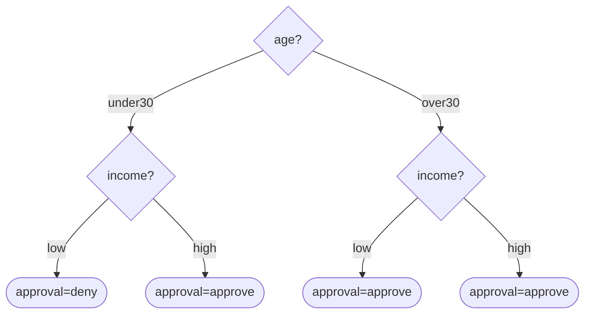

# OMG DMN Decision Table — Formal Reference

Third entry in the per-diagram-type reference series (companion to `state-machine-diagram.md` and
`use-case-diagram.md`). Same job: the exact rules an author must obey, the anti-patterns, and a mechanical
checklist — so `scripts/diagram-kit/decisiontable.mjs` can generate correct-by-construction and lint legacy
tables. **The shape exception, stated up front:** a decision table is not a mermaid diagram. It is a **DMN
(Decision Model and Notation)** artifact — a matrix of input conditions and output actions — and its
correctness is not "does this compile," it is two independently-checkable STRUCTURAL properties:
**completeness** (every combination of input values is covered) and **consistency** (no two rules conflict
under the table's declared HIT POLICY). Both properties come directly from the OMG DMN specification's own
decision-table chapter and from the academic verification literature that predates and grounds it (Vanthienen's
decision-table normalization work, and Calvanese et al.'s formal DMN analysis).

**Coverage / viability, stated up front (same honesty convention as `use-case-diagram.md`):** the raw OMG DMN
1.4 PDF (`omg.org/spec/DMN/1.4/PDF`) was not fetched directly in this pass — every OMG-spec claim about hit
policies below is grounded through secondary sources that quote/paraphrase the spec's own decision-table
chapter directly and consistently across vendors (`docs.cibseven.org`, `docs.camunda.io`), the way
`use-case-diagram.md` already grounds OMG UML through `uml-diagrams.org`. Vanthienen's own completeness/
consistency framework is grounded through his KU Leuven Prologa publication record (title and abstract read
directly) and through Bruce Silver / Ron Ross's applied DMN-style guidance (`evolute.be`, read directly).
Calvanese et al.'s formal DMN analysis paper (`arXiv:1603.07466`, BPM 2016) is grounded through its own
abstract and search-indexed summary — its own PDF's compressed text stream could not be extracted cleanly in
this pass, so its claims here are stated at the level the abstract/indexing supports, not as page-pinned
quotes. Von Halle & Goldberg's *The Decision Model* is cited for its general normalization framing only (its
own PDF was similarly unreadable in this pass) — flagged inline, not overstated as a page-verified quote.

## Section A — FORMAL DEFINITION

### A.1 Elements and notation

| Element | Meaning | Markdown rendering (this kit's convention) |
|---|---|---|
| **Condition column** | one input variable of the decision, with a **finite declared domain** of values it may take | a table column whose header names the input; the domain is declared once, e.g. `age:{under30,over30}` |
| **Action/output column** | one output variable the table decides | a table column whose header names the output |
| **Rule (row)** | one input-combination → output-combination mapping; a cell may hold a specific value, `-` (don't-care/any), or `else` (catch-all default) | `| # | age | income | approval |` — one row per rule |
| **Hit policy** | the single declared symbol governing what happens when MULTIPLE rules match the same input | declared once per table, e.g. `**Hit Policy:** U — Unique` |
| **Decision tree (companion, optional)** | the same logic drawn as a top-down path per combination — a DIFFERENT correctness concern (order/readability), not a substitute for the table's own completeness/consistency | `flowchart TD` (mermaid), only well-defined when no rule uses `-`/`else` |

### A.2 The seven DMN hit policies

Per the OMG DMN decision-table chapter, as consistently rendered across independent DMN-engine documentation
(`docs.cibseven.org/manual/2.0/reference/dmn/decision-table/hit-policy/`, fetched; corroborated by
`docs.camunda.io/docs/components/best-practices/modeling/choosing-the-dmn-hit-policy/`, fetched) — four
**single-hit** policies (the table yields exactly one result) and three **multi-hit** policies (the table
yields a list):

| Symbol | Name | Semantics | Overlap between two matching rules |
|---|---|---|---|
| **U** | Unique | "Only a single rule can be satisfied or no rule at all." | **An ERROR.** Any two rules matching the same input is invalid, regardless of whether their outputs agree. |
| **A** | Any | "Multiple rules can be satisfied. However, all satisfied rules must generate the same output." | Allowed **only if** every matching rule's output agrees; disagreeing outputs is an error. |
| **P** | Priority | Multiple rules may match with different outputs; the output ranked highest in the declared output-value priority list wins. | Allowed by design; resolved by declared priority, not rule position. |
| **F** | First | Multiple rules may match; only the first rule in table order produces output. | Allowed by design; resolved by rule position — Bruce Silver's own documented caution (Section C.6) is that this makes the result depend on row order, which is easy to get wrong silently. |
| **C** | Collect | Multiple rules may match; the result is the list of all matching outputs, arbitrary order. An aggregator suffix (`+` sum, `<` min, `>` max, `#` count) reduces the list to one value — and per `docs.cibseven.org`, "if the Collect hit policy is used with an aggregator, the decision table can only have one output." | Allowed by design. |
| **R** | Rule order | Multiple rules may match; the result is the list of all matching outputs, in table row order. | Allowed by design. |
| **O** | Output order | Multiple rules may match; the result is the list of all matching outputs, ordered by the declared output-value priority (not row order). | Allowed by design. |

### A.3 The HARD CONSTRAINTS (stated as numbered rules — the kit's `item N` codes below map 1:1)

1. **Hit policy is declared, and is one of the seven tokens above** (`U`/`A`/`P`/`F`/`C`\[`+`/`</`>`/`#`\]/`R`/`O`). An undeclared or unrecognized policy makes the table's own resolution rule unknown — a defect, not a style choice.
2. **Every condition column has a finite, declared domain**, and every rule/output reference an input/output that actually exists in the table's own schema (schema integrity).
3. **Completeness**: for every combination of the declared input domains, at least one rule matches it — a specific value, a `-` (don't-care), or an explicit default/`else` catch-all rule. An uncovered combination is a **GAP** (Calvanese et al., *Semantics and Analysis of DMN Decision Tables*, BPM 2016 / arXiv:1603.07466, name this class of defect a "missing rule").
4. **Consistency under Unique (U)**: no two rules may overlap (match a common input combination) at all — this is stricter than "same output," because Unique's own contract is that resolution never needs to happen.
5. **Consistency under Any (A)**: overlapping rules are permitted, but every overlapping rule must produce an identical output — Calvanese et al.'s "overlapping rules" analysis is exactly the geometric check this rule mechanizes (two rules' input regions intersect in the input space).
6. **Priority (P) / First (F)**: overlap is allowed by construction and is resolved deterministically by the declared priority list (P) or by row order (F) — this is NOT a consistency defect, it is the policy's whole point.
7. **Multi-hit (Collect/Rule order/Output order)**: overlap is allowed by design — the table is explicitly meant to return more than one result.
8. **No rule references an input/output name the table's own schema does not declare** — a defect distinct from completeness/consistency (a broken reference, not a logic gap).
9. **Redundant/subsumed rule — a WARNING, not a hard defect.** A rule fully covered by another rule with the same output (every combination the narrower rule matches, the broader rule also matches, with the same result) adds nothing and should be removed, per Vanthienen's own "redundant conditions... redundant combinations" checks in the Prologa decision-table-verification tool (KU Leuven, Vanthienen & Snoeck, *Knowledge Factoring Using Normalization Theory* — title/abstract read directly; the tool is independently corroborated performing exactly this class of check across multiple secondary summaries of Vanthienen's decision-table research programme).
10. **An exploding table — advisory, WARN.** Bruce Silver's own DMN modeling guidance (`evolute.be/reviews/dmn.html`, read directly): *"The order of the inputs should always try to minimize the number of rules in the table"* — a table whose combinatorial size (product of every input domain's size) has grown unmanageably large is a design smell calling for a **split** (see Section C.4), not a table to keep growing.

## Section B — CANONICAL EXAMPLE (complete + consistent, generated by this kit, tree compiles)

A loan-approval decision: two condition columns (`age`, `income`), one output (`approval`), `Unique` hit
policy, four fully-enumerated combinations — every combination distinct, so both completeness and consistency
hold by construction.

**Hit Policy:** U — Unique
**Conditions:** age:{under30,over30}, income:{low,high}
**Actions:** approval

| # | age | income | approval |
|---|---|---|---|
| 1 | under30 | low | deny |
| 2 | under30 | high | approve |
| 3 | over30 | low | approve |
| 4 | over30 | high | approve |

Reading it: 2 × 2 = 4 combinations declared, 4 rules, each rule's `(age, income)` pair distinct from every
other rule's — no gap (every combination appears in exactly one row), no overlap (Unique's own contract holds
trivially because the four pairs partition the input space exactly).

Companion decision tree (optional; well-defined here because no rule uses `-`/`else`) — compiled clean via
`a mermaid validator` in this pass (PASS, 12 lines, 0 failed):

## Section C — DOCUMENTED ANTI-PATTERNS

### C.1 The GAP (incompleteness)

An input combination no rule covers, and no default/`else` rule catches. Calvanese et al. name this a **missing
rule** and treat its detection as one of the two central analysis tasks their paper formalizes for DMN tables
(the other being overlap detection) — precisely because a gap means the decision is UNDEFINED for some real
input, which surfaces as a runtime failure or a silent wrong-default, not a compile error. (A.3 rule 3.)

### C.2 The CONTRADICTION (Unique-policy overlap)

Two rules matching the same input combination under `Unique`, whether or not their outputs agree. Per
`docs.cibseven.org`'s own formal statement, Unique requires *"only a single rule can be satisfied or no rule at
all"* — an overlap breaks that contract even when both rules happen to agree, because the table's own
declared resolution mechanism (there is none, by design) is what is actually violated, not merely the output.
(A.3 rule 4.)

### C.3 UNDECLARED / AMBIGUOUS HIT POLICY

A table with no stated hit policy, or one that mixes single-hit semantics (behaving as if only one rule can
ever match) with a schema that permits overlap. Every DMN engine's own decision-table renderer requires one of
the seven declared tokens precisely because the SAME set of rules resolves to different answers under
different policies — an undeclared policy is not "figure it out from context," it is an unresolved ambiguity.
(A.3 rule 1.)

### C.4 THE EXPLODING TABLE

A table whose combinatorial size (product of every condition column's domain size) has grown so large that
authors stop being able to verify completeness/consistency by inspection. Bruce Silver's own modeling guidance
(`evolute.be`, read directly) recommends ordering condition columns to minimize the resulting rule count and,
beyond a certain size, **splitting** the table into a hierarchy of smaller decisions (a pattern DMN itself
supports via decision-requirements composition) rather than continuing to enumerate. This kit treats a table
whose combination count exceeds 5000 as this anti-pattern (WARN, item 10) rather than attempting an exhaustive
enumeration that would itself become the performance problem.

### C.5 REDUNDANT / SUBSUMED RULES

A rule whose entire matched input region is already covered by a broader rule with the same output. Not
incorrect (the table still resolves correctly), but it is dead weight that makes the table harder to audit and
is exactly the "redundant combinations" class Vanthienen's Prologa tool flags. (A.3 rule 9, WARN not FAIL.)

### C.6 FIRST (F) MASQUERADING AS PRIORITY (P)

Bruce Silver's own critique, read directly at `evolute.be`: *"First (F)"* policies are singled out because they
make the result depend silently on row order, which violates the general modeling principle that a table's
answer shouldn't depend on how its rows happen to be arranged. His stated preference: *"Anything you can do
with F tables you can do with P tables instead"* — Priority makes the tie-break rule an explicit, declared
output-value ranking rather than an implicit row position a future editor can accidentally reorder.

## Section D — MECHANICAL YES/NO CHECKLIST

1. **Hit policy is declared** as one of `U`/`A`/`P`/`F`/`C`\[`+`/`<`/`>`/`#`\]/`R`/`O`. *(A.3.1; C.3 if violated.)*
2. **Every condition column's domain is finite and stated** (either as a JSON model's `values:[...]`, or as a
   `**Conditions:** name:{v1,v2,...}` declaration in markdown).
3. **No rule references an input/output name outside the table's own declared schema.** *(A.3.8.)*
4. **Every combination of the declared input domains is covered** by a specific value, a `-` don't-care, or an
   explicit default/`else` rule — no gap. *(A.3.3; C.1 if violated.)*
5. **Under Unique (U): no two rules overlap, period.** *(A.3.4; C.2 if violated.)*
6. **Under Any (A): every pair of overlapping rules shares an identical output.** *(A.3.5.)*
7. **Under Priority/First/Collect/Rule order/Output order: overlap is expected, not flagged** — verify the
   declared priority list or row order actually resolves every case the way the author intends (a manual
   review, since the mechanism itself is by-design ambiguity-tolerant). *(A.3.6, A.3.7.)*
8. **No rule is fully subsumed by another rule with the same output** — if one is found, remove it (WARN, not a
   hard fail). *(A.3.9; C.5.)*
9. **The table's combinatorial size is manageable** (this kit's own threshold: ≤ 5000 combinations) — beyond
   that, split it. *(A.3.10; C.4.)*
10. **If a decision-tree companion is drawn, it was actually compiled** (`node
    a mermaid validator`), not merely assumed correct by inspection — and it is only drawn
    when every rule is fully specified (no `-`/`else`), since a wildcarded rule does not map to one unambiguous
    tree path.

## Sourcing summary

| Claim area | Grounding | Fetched/read directly? |
|---|---|---|
| The seven hit policies, their formal semantics, overlap-per-policy behavior, Collect's aggregator constraint | OMG DMN spec, quoted consistently via `docs.cibseven.org` and `docs.camunda.io` | Secondary quote of spec (both fetched directly) |
| Gap ("missing rule") / overlap as the two central DMN table analysis tasks | Calvanese, Dumas et al., *Semantics and Analysis of DMN Decision Tables*, BPM 2016 (arXiv:1603.07466) | Abstract/indexing read directly; full PDF text stream not cleanly extractable in this pass |
| Completeness/consistency/redundancy as decision-table verification properties; Prologa tool's redundant-condition/action/combination checks | Jan Vanthienen (KU Leuven), *Knowledge Factoring Using Normalization Theory* (Vanthienen & Snoeck) and the broader Prologa publication record | Title/abstract and cross-source summaries read directly; not the full primary PDF |
| Exploding-table avoidance, input ordering, First-vs-Priority critique, vertical layout guidance | Bruce Silver / Ron Ross, DMN modeling guidance, `evolute.be/reviews/dmn.html` | Yes, fetched and read directly |
| General framing: Rule Family tables normalized for precision/completeness/consistency | Barbara von Halle & Larry Goldberg, *The Decision Model* | Secondary summary only (TDAN.com, publisher listing) — primary PDF unreadable in this pass, so no page-pinned quote is attributed to it here |
