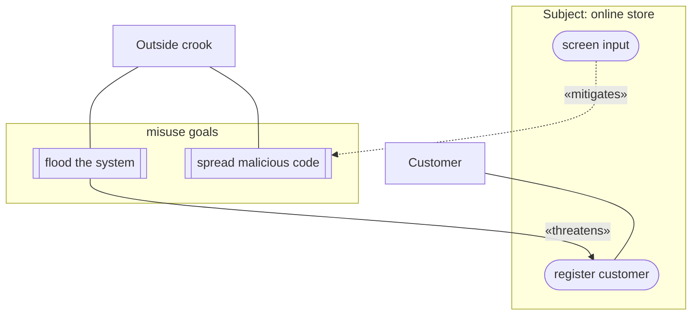

# Misuse-Case Diagram — Formal Reference

Third entry in the per-diagram-type reference series (companion to `use-case-diagram.md` and
`state-machine-diagram.md`). Same job: the exact rules an author must obey, the anti-patterns, and a
mechanical checklist — so `scripts/diagram-kit/misusecase.mjs` can generate correct-by-construction and lint
legacy diagrams. A misuse-case diagram is Sindre & Opdahl's SECURITY extension of the UML use-case diagram:
legitimate actors/use cases PLUS a hostile misuser and the misuse cases (threats) it pursues.

**Sourcing, stated up front.** Primary sources read directly, in full: G. Sindre & A. L. Opdahl, *"Capturing
Security Requirements through Misuse Cases"* (Proc. TOOLS Pacific 2000, Sydney) — the paper that introduced
the concept and its notation (Figure 1). Corroborating secondary source read directly: Chun Wei (Johnny) Sia,
*"Misuse Cases and Abuse Cases in Eliciting Security Requirements"* (Univ. of Auckland, 25 Oct 2005) — which
quotes and diagrams Sindre & Opdahl's own **2005** terminology update (*"Eliciting security requirements with
misuse cases"*, Requirements Engineering, Vol. 10(1), pp. 34-44, 2005 — the paper the brief names; its own
figure and "threatens"/"mitigates" terminology are reproduced and cited by Sia, whom this file quotes) and
Ian Alexander's corroborating vocabulary. Wikipedia's `Misuse_case` article corroborates the "threatens" /
"mitigates" relation definitions independently. No claim below is invented — every rule traces to one of these.

---

## Section A — Formal definition

### A.1 The element set and its notation

| Element | Definition | Notation |
|---|---|---|
| Misuse case | "the inverse of a use case, i.e., a function that the system should not allow... a completed sequence of actions which results in loss for the organization or some specific stakeholder" | Ellipse, **inverted colours** (white fill → black) relative to an ordinary use case |
| Misuser (formerly "mis-actor") | "an actor that initiates misuse cases, either intentionally or inadvertently" | Stick figure, **inverted colours** relative to an ordinary actor |
| Misuser ↔ misuse-case link | plain, undirected — structurally identical to an actor↔use-case association | Solid line, no label, no arrowhead |
| «threatens» | a misuse case exploits or hinders an ordinary use case | Directed edge, **misuse case → use case** |
| «mitigates» | an ordinary (often security) use case reduces the misuse case's chance of succeeding | Directed edge, **use case → misuse case** |
| «detects» (optional) | an ordinary use case recognises an ongoing/completed misuse without preventing it | Directed edge, **use case → misuse case**, narrower than «mitigates» |

Sources: Sindre & Opdahl 2000 (misuse-case/mis-actor definitions, read directly, p.1: *"A misuse case is the
inverse of a use case... one could define a misuse case as a completed sequence of actions which results in
loss for the organization or some specific stakeholder."* / *"A mis-actor is the inverse of an actor, i.e., an
actor that one does not want the system to support, an actor who initiates misuse cases."*); Sia 2005 §2.3
(quoting Sindre & Opdahl's 2005 redefinition: *"A misuser (which replaces mis-actor) is 'an actor that
initiates misuse cases, either intentionally or inadvertently'."*); Wikipedia `Misuse_case` (threatens/mitigates
definitions, corroborating).

### A.2 Inverted colours — the notation's own hallmark

Sindre & Opdahl 2000's Figure 1 caption states plainly: *"Misuse cases and mis-actors are inverted."* Sia 2005
§2.3 makes the mechanism explicit: *"misuse cases use the same symbols as use cases except that the colours
are inverted (i.e. white spaces are filled black)."* **Mermaid has no native fill-inversion for a node
shape.** This kit's text-format substitute — grounded in a real, already-adopted design-file
convention (an `01-actors-and-use-cases.md` §1.9) — is a **distinct shape**: the
subroutine bracket `[[...]]` for a misuse case (vs. the stadium `([...])` for an ordinary use case), and the
plain rectangle `[...]` for a misuser (the same bracket the use-case kit already uses for an ordinary actor,
since mermaid has no stick-figure primitive either). Read the SHAPE and the edge label, never the fill colour —
mermaid cannot carry the latter.

### A.3 «threatens» — direction and meaning

**Meaning:** the misuse case, if it succeeds, exploits or hinders the named use case. Wikipedia's `Misuse_case`
article (quoting Sindre & Opdahl's 2001/2004/2005 relation set): *"A misuse case can threaten a use case, e.g.
by exploiting it or hinder it from achieving its goals."* Sia 2005's own worked example (Figure 3, an
e-commerce misuse-case diagram) draws it exactly this way: *"an outside crook attempting to flood the system
could prevent a customer from accessing customer registration"* — rendered as `Flood system --<<threaten>>-->
Register customer`, misuse case pointing at the use case it endangers.

**HARD CONSTRAINT — direction.** «threatens» runs **misuse case → use case**, never the reverse, and never
from a misuser directly. The misuser's own link to ITS misuse case is the plain association of A.1 — «threatens»
is reserved for what the misuse case does to a LEGITIMATE goal.

### A.4 «mitigates» — direction and meaning

**Meaning:** an ordinary use case (often introduced specifically as a "security use case") reduces the chance
that a given misuse case succeeds. Wikipedia: *"A use case can mitigate the chance that a misuse case will
complete successfully."* Sia 2005's Figure 3: `Screen input --<<mitigate>>--> Spread malicious code` and
`Protect info --<<mitigate>>--> Steal card info` — the mitigating (ordinary) use case points **at** the misuse
case it defends against.

**HARD CONSTRAINT — direction.** «mitigates» runs **use case → misuse case**, the opposite direction from
«threatens».

### A.5 «detects» — the narrower, optional third relation

Sindre & Opdahl's own earlier (2000) vocabulary distinguished **"prevents"** from **"detects"**: *"Two other
relations were introduced in [the 2000 notation paper], 'prevents' and 'detects', which go from ordinary use
cases to misuse cases, to indicate functions that prevent or detect misuse."* Their own worked example (Figure
1): `Monitor system --detects--> Obtain passwd` — a use case that does not stop the misuse but flags it once it
happens. The 2005 vocabulary generalises "prevents" into "mitigates" (Sia 2005 §2.3), but "detects" survives as
a legitimately distinct, narrower relation for a use case that only RECOGNISES a misuse rather than reducing its
chance of succeeding — this kit keeps it as an optional third stereotype, same direction as «mitigates»
(use case → misuse case).

### A.6 The hard constraints, stated as explicit yes/no rules

| Question | Answer | Source |
|---|---|---|
| Can a misuser↔misuse-case link carry a `«threatens»` (or any) label? | **No.** It is a plain, undirected association — the exact structural mirror of an actor↔use-case link. | Sindre & Opdahl 2000 Fig.1 (Crook connects to its misuse cases with unlabelled lines); Sia 2005 Fig.3 (Outside Crook likewise) |
| Can «threatens» be sourced from a misuser instead of a misuse case? | **No.** «threatens» describes what the MISUSE CASE does to a use case, once it succeeds — not the misuser's initiating link. | A.1, A.3 |
| Can «mitigates»/«detects» run misuse-case → use-case (reversed)? | **No.** Both run use-case → misuse-case; only «threatens» runs the other way. | A.3, A.4, A.5 |
| Is a bare prose label ("resolves to X") a legal edge between a use case and a misuse case? | **No.** Only «threatens» / «mitigates» / «detects» are legal stereotypes on that edge class — free prose asserting a mechanism is a finding to write in the use case's own text, never a diagram edge label. | Direct extension of the same stereotype-legality principle already grounded for «include»/«extend» in `use-case-diagram.md` A.6/A.7/A.9 |
| Must a misuse case name what it threatens? | Not a hard constraint, but a strong content warning — the entire reason to co-draw misuse cases WITH use cases is to show what is endangered (Sindre & Opdahl 2000: *"it is useful to be able to depict the two in the same diagram"*). A misuse case with no «threatens» edge at all is a free-floating threat naming nothing it costs. | Sindre & Opdahl 2000, summary of §2 |

---

## Section B — Canonical example (mermaid, compile-clean)

An electronic-store misuse-case diagram, adapted directly from Sia 2005's Figure 3 (itself Sindre & Opdahl's
own 2005-vintage worked example) — kept to the two edges the figure actually draws in each direction, so the
shape stays checkable:

**Reading this diagram correctly (per Section A):** `CROOK --- FLOOD` and `CROOK --- SPREAD` are plain
associations — Outside Crook merely PARTICIPATES in those misuse cases, exactly as `CUST --- REG` says Customer
participates in Register customer. `FLOOD -->|«threatens»| REG` says the flood misuse case endangers the
legitimate registration goal — not that flooding "happens before" registration. `SCREEN -.->|«mitigates»|
SPREAD` says the (ordinary) screen-input use case reduces the chance the malicious-code misuse case succeeds.

## Section C — Documented anti-patterns

### C.1 Labelling the misuser's own link ("threatens" on the wrong edge)

**The anti-pattern:** drawing the misuser's link to its own misuse case with a `«threatens»` label — e.g.
`Attacker -->|"«threatens»"| SomeMisuseCase`.

**Why it is wrong:** «threatens» describes what a misuse case, once achieved, does to a LEGITIMATE use case
(A.3) — it is not the initiating relationship between a misuser and its own goal, which is the same plain,
unlabelled association an ordinary actor carries to its use case (A.1, A.6). Labelling this edge collapses two
distinct relations (initiation vs. endangerment) into one, and typically means no `«threatens»` edge ever
reaches the legitimate use case actually at risk — see C.3.

**Real instance.** An observed design file's `01-actors-and-use-cases.md` §1.9 draws exactly this:
`ATK -->|"«threatens»"| MC1` and `ATK -->|"«threatens»"| MC2` — the misactor-to-misuse-case link, labelled,
when A.1/A.6 call for a plain association there.

### C.2 Free prose on a misuse-case/use-case edge instead of a stereotype

**The anti-pattern:** an edge between a misuse case and a use case carrying an explanatory sentence instead of
one of the three legal stereotypes — e.g. `MisuseCase -. "this resolves to the victim's cap" .-> SomeUseCase`.

**Why it is wrong:** the diagram's edges exist to assert one of exactly three typed relations (A.3-A.5); a
mechanism explanation belongs in the misuse case's own textual description (Sindre & Opdahl's own template —
"capture points", "worst case threat" fields, `[11]`/`[16]` in their 2000 paper) never as a diagram-edge label.

**Real instance.** Same §1.9: `MC2 -. "clamp resolves to min(attacker, VICTIM_cap, attacker) = VICTIM_cap"
.-> M1` — a misuse case pointing at a mitigation use case with a prose mechanism note, no stereotype at all.

### C.3 A misuse case that threatens nothing

**The anti-pattern:** a misuse case drawn with a misuser link and mitigation edges, but no «threatens» edge to
any legitimate use case at all — so the diagram never shows what is actually endangered.

**Why it is wrong:** per Sindre & Opdahl's own stated motivation for co-drawing use and misuse cases together
(A.6's last row), the value of the combined diagram IS the endangerment relation; a misuse case with no
«threatens» target is drawn as a threat to nothing.

**Real instance.** §1.9's diagram never draws any of the file's own UC1-UC9 legitimate use-case nodes at all —
MC1 and MC2 threaten nothing in the diagram itself (the endangered goal is only named in surrounding prose,
not the diagram). Flagged here as a WARNING (content quality), not a hard violation — see D6.

## Section D — Faithful-mermaid checklist

1. **Every misuse-case node uses a shape distinct from an ordinary use-case ellipse** — this kit's convention:
   subroutine bracket `[[...]]` (A.2). *(Enforced by construction in `generate()`; lint trusts the author's own
   shape choice, the same limit `usecase.mjs`'s own D.1 lives under — see that file's own note.)*
2. **Every misuser↔misuse-case link is a plain, undirected association carrying no label.** *(A.1, A.6, C.1.)*
3. **Every «threatens» edge is sourced from a misuse case and points at a use case** — never from a misuser,
   never at another misuse case. *(A.3, C.1.)*
4. **Every «mitigates»/«detects» edge is sourced from a use case and points at a misuse case** — the opposite
   direction from item 3. *(A.4, A.5.)*
5. **«detects» is used only when the use case recognises the misuse without preventing it** — if it actually
   reduces the misuse's chance of success, it is «mitigates». *(A.5.)*
6. **No edge between a misuse case and a use case carries free prose instead of «threatens» / «mitigates» /
   «detects».** *(C.2.)*
7. **Every misuse-case goal is a short, active verb phrase naming the misuser's own goal** — never a bare
   category noun ("attack", "threat", "risk") standing alone. *(A.1's own goal-as-sequence-of-actions
   definition; Sindre & Opdahl reuse Cockburn's goal-phrase convention for their own template, 2000 paper §3.)*
8. **A misuse case names at least one «threatens» target** — a misuse case with no endangered use case in the
   diagram is a warning, not a hard failure (content completeness, not diagram legality). *(C.3.)*
9. **The mermaid source was actually checked for parse-validity before shipping** — not merely assumed correct
   by visual inspection. *(Same closing item as `use-case-diagram.md` D.11 / `state-machine-diagram.md` D.9.)*

**KNOWN LIMITATION (fast-follow, not fixed by this kit) — `scripts/diagram-kit/usecase.mjs`'s own cross-type
skip filter does not recognise `detects`.** `usecase.mjs`'s `isNotUseCaseType` regex recognises
`threatens`/`mitigates`/`aggravates` as the tell that a mermaid block belongs to a DIFFERENT (misuse-case)
diagram type and should be skipped — but this kit never emits or expects `aggravates`; its own third
stereotype is `detects` (A.5), which that regex does not match. A legitimate, legal **detects-only** misuse-case
block (one that carries no `«threatens»`/`«mitigates»` edge at all — a use case that only recognises a misuse
without preventing it) is therefore NOT recognised as "not a use-case diagram" by `usecase.mjs`, and gets
false-flagged by `usecase.mjs`'s own use-case-diagram rules instead of being skipped. `usecase.mjs` is
out-of-scope, commit-gated code for the branch that produced this kit — this gap is recorded here, visibly, as
a fast-follow rather than patched silently.

---

## Sourcing summary

| Claim area | Primary grounding | Fetched/read directly? |
|---|---|---|
| Misuse case / mis-actor definitions, inverted-colour notation, original prevents/detects relations | Sindre & Opdahl, "Capturing Security Requirements through Misuse Cases", TOOLS Pacific 2000 | Yes, read in full (primary PDF) |
| "Misuser" rename, threatens/mitigates terminology (Sindre & Opdahl 2005 vintage), worked e-commerce figure | Chun Wei (Johnny) Sia, "Misuse Cases and Abuse Cases in Eliciting Security Requirements", 2005, quoting Sindre & Opdahl (2005) *Eliciting security requirements with misuse cases*, Requirements Engineering 10(1):34-44, and Ian Alexander (2003) | Yes, read in full (primary PDF) |
| Threatens/mitigates independent corroboration | Wikipedia, `Misuse_case` article | Yes, fetched directly |
| Stereotype-legality principle (extended by analogy from include/extend) | This kit's own sibling, `use-case-diagram.md` A.6/A.7/A.9 | Internal cross-reference, not a new external source |
