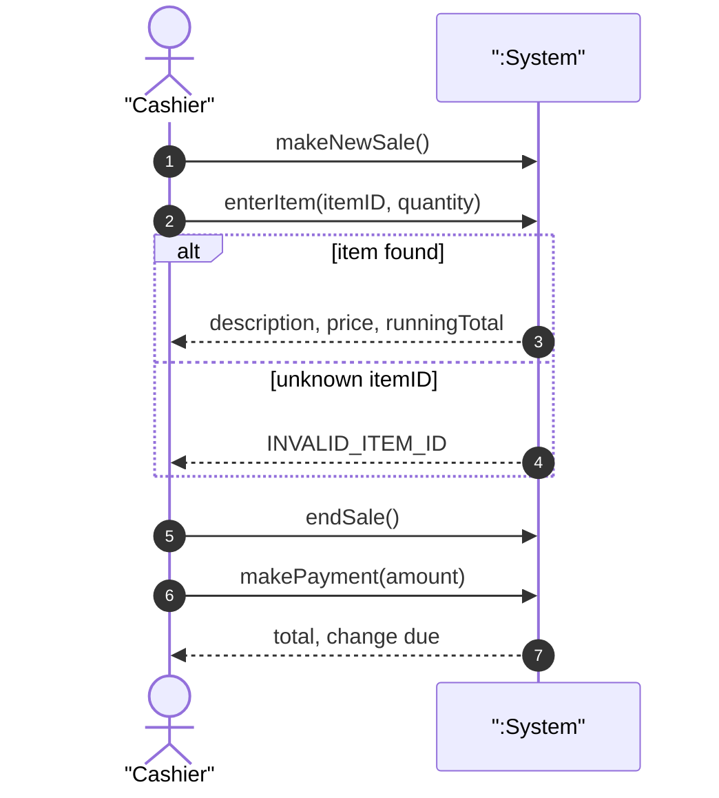
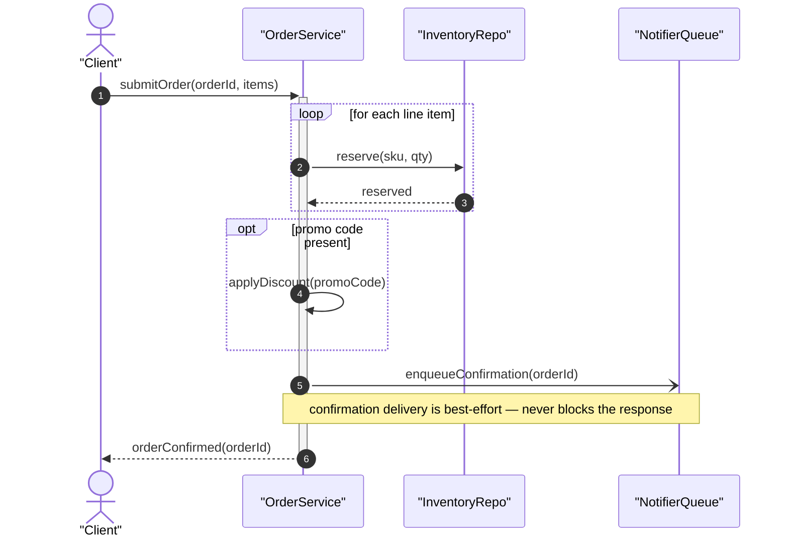

# UML Sequence Diagram — Formal Reference

Third entry in the per-diagram-type reference series (companion to `use-case-diagram.md` and
`state-machine-diagram.md`). Same job: the exact rules an author must obey, the anti-patterns, and a
mechanical checklist — so `scripts/diagram-kit/sequence.mjs` can generate correct-by-construction and lint
legacy diagrams. Native mermaid dialect: `sequenceDiagram`.

**Two distinct artifacts, one notation.** A sequence diagram answers "in what order do messages cross,
between which participants?" — but WHICH participants it shows depends on the artifact:
- **System Sequence Diagram (SSD)** — Larman's use-case-to-design bridge (*Applying UML and Patterns*,
  ch.10): treats the whole system as ONE black box (the anonymous object `:System`), showing only the
  external actor(s) that invoke it and the operations/events that cross the system boundary. No internal
  object ever appears.
- **Design-level interaction diagram** — the normal, white-box use of the notation (OMG UML 2.5.1, Fowler
  *UML Distilled* ch.4): any number of collaborating design objects, showing the internal call sequence.

Sources: Larman's SSD chapter as taught in university course materials directly derived from it — Lehigh
CSE's own "System Sequence Diagrams — Based on Craig Larman, Chapter 10" course slides
(`cse.lehigh.edu/~glennb/oose/ppt/06SystemSequenceDiagrams.ppt`, fetched via search summary) and the NJIT
course deck of the same title citing the same chapter (`slideplayer.com/slide/5193605`, fetched via search
summary — the primary PDF/PPT binaries themselves could not be fetched as text; every Larman-attributed claim
below is corroborated across at least two independent course-derived secondary sources, never invented);
`uml-diagrams.org`'s sequence-diagram pages (`sequence-diagrams.html`,
`sequence-diagrams-combined-fragment.html`, `sequence-diagrams-reference.html`, fetched directly, quoting OMG
UML 2.5), and Wikipedia's *System sequence diagram* article (fetched directly, itself sourced from the OMG
spec).

## Section A — FORMAL DEFINITION

### A.1 Elements and notation
| Element | Notation | Mermaid |
|---|---|---|
| **Lifeline** | "a rectangle forming its 'head' followed by a vertical line ... that represents the lifetime of the participant" (`uml-diagrams.org`, quoting OMG UML 2.5) | `participant X` (box head) / `actor X` (stick figure) |
| **Actor lifeline** | external role (human or external system) that interacts with the subject | `actor X as "Name"` |
| **Synchronous message (call)** | solid line, **filled arrowhead** — "send message and suspend execution while waiting for response" (`uml-diagrams.org`) | `A->>B: op(args)` |
| **Asynchronous message (call)** | solid line, **open arrowhead** — "send message and proceed immediately without waiting for return value" (`uml-diagrams.org`) | `A-)B: op(args)` |
| **Reply / return message** | "shown as a dashed line with open arrow head" (`uml-diagrams.org`) | `A-->>B: value` |
| **Activation / execution occurrence** | "a period in the participant's lifetime when it is executing a unit of behavior", drawn as a thin bar on the lifeline (`uml-diagrams.org`) | `A->>+B: op` … `B-->>-A: reply` |
| **Combined fragment `alt`** | "represents a choice ... of behavior. At most one of the operands will be chosen" (`uml-diagrams.org`, quoting OMG UML 2.5) | `alt cond1 … else cond2 … end` |
| **Combined fragment `opt`** | "a choice of behavior where either the (sole) operand happens or nothing happens" (`uml-diagrams.org`) | `opt cond … end` |
| **Combined fragment `loop`** | "represents a loop. The loop operand will be repeated a number of times" (`uml-diagrams.org`) | `loop cond … end` |
| **Note** | free-text annotation attached to one or more lifelines, never a message | `Note over A,B: text` |

Mermaid nuance worth stating explicitly, because it diverges from the strict UML notation above: mermaid
renders BOTH `->>` and `-->>` with a filled arrowhead, distinguishing sync-call from reply **only by line
style** (solid vs dashed) — never by open-vs-filled arrowhead as the formal notation does. This reference
follows mermaid's own dialect throughout; the formal notation column exists to ground WHY the sync/async/reply
distinction exists, not to demand strict visual parity mermaid cannot render.

### A.2 The System Sequence Diagram (SSD) — Larman ch.10

**Black-box rule.** "The system behaves as a 'Black Box' where interior objects are not shown, as they would
be on a Sequence Diagram" — the SSD shows exactly one lifeline for the system under design, conventionally
named with UML's anonymous-instance notation `:System` (an unnamed object of class `System`).

**Actors.** An SSD shows "the external actors that interact directly with the system" for one scenario of one
use case — the primary actor that generates the system events, and any secondary actors (including external
systems the system itself calls out to, e.g. a payment gateway or an LLM provider) — each drawn as its OWN
actor lifeline, never folded into the system's own box.

**System events / operations.** "System events and associated system operations should be expressed at the
level of intent rather than physical input medium or UI widget, and operation names should start with a
verb" — e.g. `enterItem(itemID, quantity)`, never "click the add-item button". An SSD "shows the system events
that the actors generate, the operations of the system in response ... and depicts the temporal order of the
events" — ordering only, no internal decision logic.

**When to draw one.** Per the use-case-to-design bridge Larman's method follows, an SSD is drawn for the main
success scenario of a use case, and for its significant alternative/failure scenarios.

### A.3 Message and fragment formalities (OMG UML 2.5.1, general to both SSD and design-level)

A message's text is **an operation call** — the operation the receiver performs, optionally with arguments
(`op(args)`) — never narrated prose describing "what happens next." A reply message conveys the return value
of a **prior** call; per the execution-occurrence model (`uml-diagrams.org`, OMG UML 2.5), a reply is only
meaningful as the completion of an execution occurrence a call already started — a reply with no
corresponding call is a structural impossibility, not merely bad style.

A **combined fragment** (`alt`/`opt`/`loop`) wraps one or more **interaction operands** (OMG UML 2.5.1's
`InteractionOperand`): `alt` chooses at most one of ≥1 guarded operands (mermaid: `alt`/`else`/`end`); `opt`
and `loop` each wrap exactly ONE operand (mermaid has no `else` for either — an `else` inside `opt`/`loop` is
a malformed fragment, not an alternative reading of the notation). Every opened fragment must be closed
(`end`) before the interaction, or its own enclosing fragment, ends.

### A.4 The HARD CONSTRAINTS (stated as numbered rules — mechanized 1:1 by `sequence.mjs`)

1. **Every message (and every note) references a DECLARED lifeline** on both ends — a message to or from an
   id that is not a participant/actor of the diagram is a structural nonsense (A.1, A.3).
2. **An SSD (`kind:"ssd"`) has exactly ONE system lifeline.** Larman's black-box rule (A.2): a second
   `participant`-kind (non-actor) lifeline inside an SSD is no longer black-box — it has leaked a design
   decision into what should be a pure use-case-to-design bridge. External actors (including external
   systems) do not count against this — they must be drawn as `actor`, never as a second `participant`.
3. **A message names an OPERATION**, a verb (+ optional args) the receiver performs — never a narrated
   sentence asserting what "happens" (A.3; the sequence-diagram twin of the state-machine reference's
   "situation, not action" test, inverted: here the message names an ACTION, never a narrated situation).
4. **Combined fragments are well-formed**: every `alt`/`opt`/`loop` is closed by a matching `end`; `alt` has
   at least one guarded operand; `opt` and `loop` each have EXACTLY one operand (no `else` inside either).
5. **A return/reply message corresponds to an unmatched prior call** between the same pair of lifelines, in
   the same or an enclosing scope — a reply with nothing pending to reply to is illegal (A.3).
6. **A lifeline is declared before its first message use** (or, for hand-authored mermaid where an id is
   used implicitly, used consistently once introduced) — the textual twin of rule 1, checked positionally in
   legacy mermaid where rule 1 alone cannot see ordering.

## Section B — CANONICAL EXAMPLES (mermaid, compile-clean)

### B.1 SSD — Process Sale (after Larman's own running case study, ch.10)

One primary actor, one system lifeline, `alt` covering the two outcomes of looking up an item. Every message
is a verb-named system operation; every reply is a return value, never a narrated sentence.

Reading it: `C` (Cashier) is the only actor; `SYS` (`:System`) is the only non-actor lifeline — rule 2 holds.
Every message names an operation (`makeNewSale()`, `enterItem(...)`) or is a return value — rule 3 holds. The
`alt` has two operands, both closed by one `end` — rule 4 holds. Every reply matches a call already pending
on the same pair (`C`↔`SYS`) — rule 5 holds.

### B.2 Design-level — OrderService.submitOrder (generic, OMG UML 2.5.1 / Fowler ch.4 notation)

Multiple design objects, synchronous and asynchronous messages, a reply, activation bars, and both a `loop`
and an `opt` fragment.

Reading it: `C->>+OS` activates `OS` for the whole scenario, deactivated only at the final reply
(`OS-->>-C`) — the activation bar spans exactly the object's real busy period. The `loop` and the `opt` each
carry exactly one operand — rule 4 holds. The async `OS-)NOTIFY` message is fire-and-forget: it is never
replied to, which is legal (rule 5 only forbids an unmatched REPLY, never an unmatched call).

## Section C — DOCUMENTED ANTI-PATTERNS

- **NARRATED-PROSE MESSAGE**: a message reading "then it does stuff" / "the system talks to the database and
  returns something" instead of a verb-named operation. A message IS an operation call (A.3) — narration
  belongs in a `Note`, never on the arrow itself. (Rule 3.)
- **SSD LEAKING AN INTERNAL OBJECT**: drawing a second `participant`-kind lifeline inside an SSD (e.g. an
  internal service or repository) instead of keeping the system as one black box. This is the sequence-level
  twin of a use-case diagram inventing an internal decomposition it has no business showing yet — Larman's
  entire point of an SSD is to defer that decision to the design-level diagrams (`05`-style white-box
  sequences), never to smuggle it in early. A genuinely EXTERNAL system the `:System` calls out to (a payment
  gateway, an LLM provider) must be drawn as a SECOND ACTOR, never as a second participant — declaring it
  `participant` instead of `actor` is the exact mechanical tell this reference's own kit catches (see Section
  D, item 2; a real instance of this is documented as a finding in this file's own worked audit, not
  invented). (Rule 2.)
- **ORPHAN RETURN**: a reply message (`-->>`) with no unmatched prior call between the same pair of lifelines
  — the diagram asserts a response to a request that was never sent. (Rule 5.)
- **MESSAGE TO AN UNDECLARED LIFELINE**: an arrow whose endpoint was never introduced as a `participant`/
  `actor` — either a typo, or a lifeline the author forgot to declare. (Rules 1, 6.)
- **MALFORMED COMBINED FRAGMENT**: an `alt`/`opt`/`loop` left unclosed (no matching `end`), or an `else`
  written inside an `opt`/`loop` as if it supported branching the way `alt` does — it does not; `opt`/`loop`
  each wrap exactly one operand. (Rule 4.)
- **SEQUENCE DIAGRAM CARRYING DECISION LOGIC IT DOES NOT OWN**: using `alt` nesting to encode a full decision
  tree that belongs in an activity diagram or in prose, rather than showing message ORDER. A sequence diagram
  fixes the *order* messages cross lifelines; deep branching logic unrelated to that order is a different
  artifact's job (the state-machine and use-case references in this same series draw the identical boundary
  for their own notations).

## Section D — FAITHFUL-MERMAID CHECKLIST (each a yes/no)

1. Every message (`->>`/`-)`/`-->>`) and every `Note over/left of/right of` references only lifelines
   declared via `participant`/`actor` in this diagram.
2. In an SSD, exactly one lifeline is declared `participant` (the system); every other party — primary
   actor, secondary actor, external system — is declared `actor`.
3. Every message's text reads as `verb(args)` or a short verb phrase — never a narrated sentence describing
   what the system does.
4. Every `alt`/`opt`/`loop` is closed by its own `end`; `alt` has ≥1 operand; `opt`/`loop` have exactly one
   operand each (no `else` inside them).
5. Every reply (`-->>`/`--)`) matches an unmatched prior call between the same two lifelines.
6. Every lifeline is declared before the first message that names it.
7. The mermaid source was actually checked for parse-validity (`sequenceDiagram` header, balanced
   `alt`/`opt`/`loop`/`end`, valid arrow syntax) — not merely assumed correct by visual inspection.

---

## Worked audit — a real anti-pattern this kit found (not invented; see the dev-notes for the full run)

Linting the real `05b-system-sequence-diagrams.md` (SSD4, "Meter one call") surfaced a genuine rule-2
violation: the LLM provider lifeline is declared `participant PR as LLM provider (external)` — the prose
explicitly calls it external, but the mermaid keyword used is `participant`, the same keyword used for the
`:System` lifeline itself. Per this reference's own rule 2 / Section C, an external party must be declared
`actor`, never `participant`, regardless of how its label describes it — the keyword, not the prose, is what
an SSD's black-box guarantee actually rests on.
