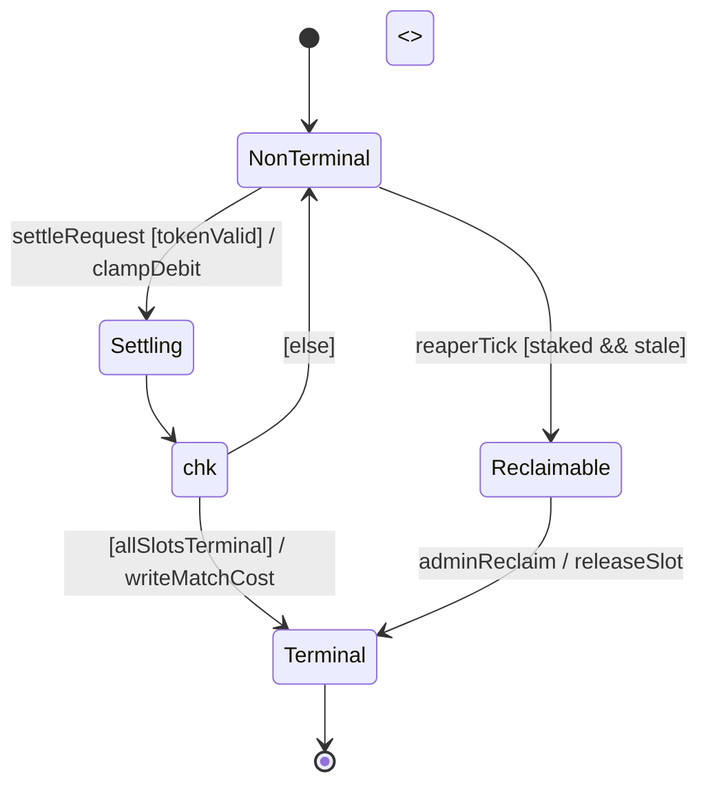

# UML State-Machine Diagram — Formal Reference

Second entry in the per-diagram-type reference series (companion to `use-case-diagram.md`). Same job: the exact
rules an author must obey, the anti-patterns, and a mechanical checklist — so `scripts/diagram-kit/statemachine.mjs`
can generate correct-by-construction and lint legacy diagrams. Unlike a use-case diagram, a state machine is a
**structural** artifact: it is mostly graphics (states + transitions), text is minimal — the concern where the
CEO's graphics-primary vision genuinely holds.

Sources: OMG UML 2.5.1 state-machine chapter as rendered in `uml-diagrams.org/state-machine-diagrams.html`;
Scott Ambler, agilemodeling.com; Sparx Systems UML 2 tutorial; Wiegers (the state-dependence + no-exit tests).

## Section A — FORMAL DEFINITION

### A.1 Elements and notation
| Element | Notation | Mermaid (`stateDiagram-v2`) |
|---|---|---|
| **State** | round-cornered rectangle, name inside; may carry entry/exit actions and internal activities | `S : name` / `state "name" as S` |
| **Transition** | solid arrow source→target, labelled `event [guard] / action` | `A --> B : event [guard] / action` |
| **Initial pseudostate** | small solid filled circle; exactly one per region; a single transition to the default state | `[*] --> A` |
| **Final state** | bullseye (circle with a dot); no outgoing transitions | `A --> [*]` |
| **Terminate pseudostate** | a cross (×) — the state machine's lifeline ends, NOT the same as a final state | (mermaid: annotate; no native ×) |
| **Choice** | diamond ◇ — dynamic conditional branch; evaluates the guards of its outgoing transitions, exactly one is taken | `state c <<choice>>` |
| **Junction** | small filled circle — chains multiple transitions (static merge/split), guards per outgoing edge | `state j <<join>>`/`<<fork>>` for concurrency |
| **Composite state** | a state containing nested region(s) with their own initial/final | `state P { [*] --> X ... }` |

### A.2 The transition label — the one formal string
`event [guard] / action` — every part optional, but the ORDER is fixed. The `event` is the trigger; the
`[guard]` is a Boolean evaluated ONCE when the event occurs; the `/action` is the side effect on taking the
transition. A bare prose label ("then it settles") is NOT a transition label — it hides the trigger.

### A.3 The HARD CONSTRAINTS (stated as rules)
1. **Exactly ONE initial pseudostate per region** (OMG: "at most one initial vertex in a region"); it has exactly one outgoing transition and no incoming.
2. **A final state has NO outgoing transition** (it is terminal); a non-final state that has no outgoing transition is a DEAD END — a defect (Wiegers' no-exit test) unless it is deliberately a final/terminate.
3. **Every state is REACHABLE** from the initial pseudostate (no orphan states).
4. **Determinism at a state**: two transitions leaving the same state on the SAME event must have mutually-exclusive guards — otherwise the machine is non-deterministic (a defect unless modelling genuine concurrency via a fork).
5. **A choice pseudostate's outgoing guards should be COMPLETE** (cover every case, ideally with an `[else]`) so the machine cannot get stuck at the diamond.
6. **A transition carries an `event [guard] / action` label, never free prose** — an unlabelled arrow asserts an automatic (completion) transition, which is a specific meaning, not "and then".
7. **States are conditions/situations, not actions** — "Settling" (a situation) is a state; "settle the match" (an action) is a transition/activity, never a state node. This is the state-machine twin of the use-case goal-level test.

## Section B — CANONICAL EXAMPLE (mermaid, compile-clean)

A match-settlement lifecycle (the shape §06 needs): one initial, guarded transitions, a choice, a final.

Reading it: every arrow names its trigger and (where it branches) its guard; `Terminal` is the only state with a
transition to the final; `NonTerminal` with no outgoing would have been the dead-end defect (A.3 rule 2).

## Section C — DOCUMENTED ANTI-PATTERNS
- **STATES-AS-ACTIONS** (the commonest): drawing "Meter call" / "Settle" (verbs) as states. A state is a *situation the object is IN* ("Metering", "Awaiting settle"); the verb is the transition. (A.3 rule 7.)
- **PROSE ARROWS**: an arrow labelled "then reconcile" — hides the trigger/guard. Every transition owes `event [guard] / action`. (A.3 rule 6.)
- **NO-EXIT / DEAD-END state**: a non-final state with no outgoing transition — the object can never leave it. (Wiegers; A.3 rule 2.)
- **MULTIPLE INITIALS / no initial**: more than one, or zero, initial pseudostate in a region. (A.3 rule 1.)
- **NON-DETERMINISTIC branch**: two same-event transitions from one state with overlapping/absent guards. (A.3 rule 4.)
- **UNREACHABLE state**: drawn but no path from the initial reaches it. (A.3 rule 3.)
- **A FLOWCHART wearing the label**: boxes = processing steps chained by unlabelled arrows — that is an activity diagram / flowchart, not a state machine (states are situations, not steps).

## Section D — FAITHFUL-MERMAID CHECKLIST (each a yes/no)
1. Uses `stateDiagram-v2` (not `flowchart`).
2. Exactly ONE `[*] -->` initial transition per region.
3. Every state node names a SITUATION (noun/adjective/-ing), never an action verb phrase.
4. Every transition between two states carries a label, and the label reads as `event`, `[guard]`, `/action`, or a combination — never bare prose asserting sequence.
5. No non-final state is a dead end (every non-`[*]`-final state has ≥1 outgoing transition).
6. Every state is reachable from `[*]`.
7. A `<<choice>>`'s outgoing edges have guards, and together they are exhaustive (an `[else]` or complete cases).
8. No two transitions leave the same state on the same event without exclusive guards.
9. The mermaid parses (`stateDiagram-v2` block, valid `-->`/`:`/`state ... {}` syntax) — verified, not assumed.
