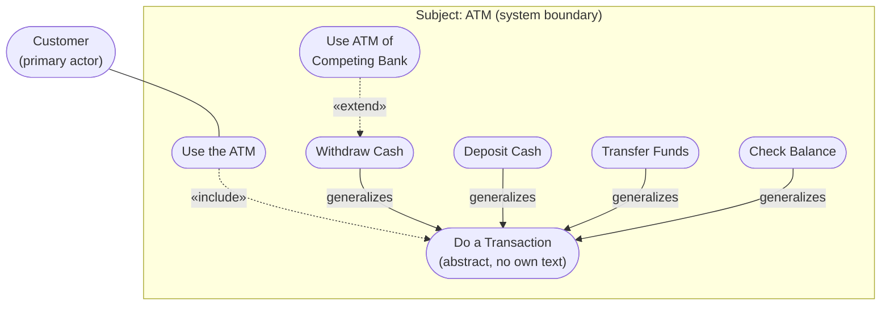

# UML Use-Case Diagram — Formal Reference

**Scope of this file (scout slice):** Section A (formal definition) and Section B (canonical
examples) are the owned deliverable of this pass; Section C (anti-patterns) is produced because it
directly feeds the final diagnosis but the *verdict on the specific diagram in question* is not made
here — that synthesis belongs to the orchestrating pass. Section D is a mechanical checklist derived
from A–C.

**Coverage / viability, stated up front:**
- **CAN ground, with a real citable source, for every non-obvious claim below:** actor, use case,
  association, «include», «extend», generalization (both use-case and actor generalization), the
  "not a flowchart" / "not sequencing" warnings, the CRUD/too-fine-grained anti-pattern, the
  actor-to-actor association prohibition, and 2–3 canonical worked examples (ATM, online-store
  «extend», actor/use-case generalization hazard).
- **CANNOT do:** I could not fetch the raw OMG UML 2.5.1 PDF directly (`omg.org/spec/UML/2.5.1/PDF`)
  — it is a large binary and both direct and page-scoped fetch attempts failed or were not
  retried after two large-PDF failures elsewhere in this pass. Every OMG-spec claim below is
  therefore grounded through **secondary sources that quote the spec directly** (uml-diagrams.org,
  Wikipedia's `Actor (UML)` article, Visual Paradigm), not through my own reading of the primary
  PDF. This is flagged inline wherever it applies. Everything attributed to Cockburn, Fowler is
  grounded in primary-source text I read directly (Cockburn's own book PDFs; Fowler's own
  bliki page).

---

## Section A — Formal definition

### A.1 The element set and its notation

| Element | UML term | Notation |
|---|---|---|
| Actor | `Actor` | Stick figure (or a rectangle stereotyped «actor» for non-human actors) |
| Use case | `UseCase` | **Ellipse**, name inside or below it |
| System boundary | `Subject` | **Rectangle** enclosing the use cases; actors sit outside it |
| Actor↔use-case link | `Association` | Solid line, **no arrowhead by default** |
| "always includes" | `Include` | Dashed line, **open arrowhead**, labelled «include» |
| "optionally extends" | `Extend` | Dashed line, **open arrowhead**, labelled «extend» |
| "is a kind of" | `Generalization` | Solid line, **hollow/open triangular arrowhead** |

Sources: OMG UML 2.5.1's actor/use-case/include/extend definitions as quoted directly in
`uml-diagrams.org` (`use-case-extend.html`, `use-case-include.html`, `use-case-actor-association.html`
— fetched 2026‑08‑30) and in Wikipedia's `Actor (UML)` article, which quotes the spec verbatim:

> "An Actor models a type of role played by an entity that interacts with the subject (e.g., by
> exchanging signals and data), but which is external to the subject." — OMG UML spec (quoted in
> Wikipedia, *Actor (UML)*, https://en.wikipedia.org/wiki/Actor_(UML), citing OMG UML V2.1.2/2.5.1)

### A.2 Actor

**Definition (OMG UML 2.5.1, as quoted in the sources above):** an actor "specifies a role played by
a user or any other system that interacts with the subject." An actor is external to the subject; it
is **not** part of the system being modelled, even when the actor is itself a computer system.

**HARD CONSTRAINT — no actor-to-actor association.** *"UML 2 prohibits direct associations between
actors themselves"* (Wikipedia, *Actor (UML)*, sourced from the OMG spec). Two actors can only be
related by **generalization** (see A.6), never by a plain association arrow implying one actor acts
"on behalf of," "notifies," or "delegates to" another. That is a documented anti-pattern — see
Section C.5.

Cockburn's independently-derived, compatible definition (primary source, his own book, *Writing
Effective Use Cases*, pre-publication draft #3, 1999, p.28 — a book he wrote **explicitly
correlated against** the UML 1.3 use-case chapter, whose author, Gunnar Overgaard, confirmed to
Cockburn that the two models do not contradict each other, p.3):

> "An actor is anything having behavior. As one student said, 'It must be able to execute an IF
> statement.'" (p.28)

### A.3 Use case

**Definition (OMG UML, as commonly quoted from the spec across multiple independent secondary
sources — see coverage note above):** a use case is "the specification of a set of actions performed
by a system, which yields an observable result that is typically of value for one or more actors or
other stakeholders of the system."

Cockburn's compatible, independently-derived definition (primary source, p.16, and again p.42 of the
same draft):

> "A use case is a description of the possible sequences of interactions between the system under
> discussion and its external actors, related to a particular goal." (p.16)
>
> Refined: "A use case is the statement of the goal the primary actor has toward the system's
> declared responsibilities, and the collection of possible scenarios between the system under
> discussion and external actors, showing how the primary actor's goal might be delivered or might
> fail." (p.42)

Notation: an **ellipse**, containing (or labelled with) a short verb phrase naming the actor's goal —
never a noun, never a system function name. Cockburn, p.51: *"Write the goal as an active goal
phrase: `<verb> <direct object>`."*

### A.4 Subject / system boundary

**Definition:** the rectangle that encloses the set of use cases, naming the system whose behaviour
is being specified. Drawing it is **optional** in the standard, but naming it in prose is *not*
optional — Cockburn's entire *Design Scope* chapter (p.33 primary text) is built on the claim that
omitting or ambiguating the boundary is one of the two most damaging and common mistakes in use-case
work (the other being goal-level confusion, see C.4):

> "This 'Scope' or 'design scope' is incredibly important in the use case. ... When your readers
> start reading a use case, they must be very clear as to what you intend is inside vs. not inside
> the system." (p.33–34)

A **true, sourced small story** he tells to illustrate the cost of an unlabelled boundary: a team
bidding a fixed-price contract assumed a printer was in scope; the client's actual printing
infrastructure was a completely separate mainframe-driven system, and the team nearly bid to build
the wrong thing (p.34, "A small, true story").

### A.5 Association (actor ↔ use case)

**Direction — the load-bearing constraint:** the association line is **undirected by default**; no
arrowhead is required or standard. `uml-diagrams.org` (fetched, quoting the spec's treatment of
multiplicities and initiation) states plainly:

> "The specification intentionally remains undefined regarding: **temporal order**: whether
> interactions occur sequentially, in parallel, or at different points in time; **control flow**:
> the document does not address how one element initiates or controls the other... The UML 2.5
> specification allows 'any reasonable interpretation'... while keeping the specific nature of
> concurrent, overlapping, or sequential behavior **deliberately unspecified**."

The spec *permits* an optional directed association (an arrowhead added to signal who initiates the
interaction), but this is a convention layered on top of an otherwise undirected relation, not a
requirement, and it still carries **no ordering or data-flow meaning** — it only marks who initiates.
Cockburn independently reaches the same operational point without ever invoking the arrowhead
convention: association lines just connect an actor to the goal it participates in.

**What an arrowhead on an association must never be read as:** the flow of data or the sequence of
steps. Agilemodeling.com's use-case-diagram guidance (Scott Ambler, fetched) states the anti-pattern
by name: *"Common mistake — arrowhead confusion: 'arrowheads are often ... confused with data flow.'
The author explicitly avoids them because practitioners misinterpret them as information flow
indicators rather than invocation direction markers."*

### A.6 «include»

**Meaning:** the base (including) use case's behaviour **always, mandatorily** incorporates the
included use case's behaviour at a defined point, every time the base use case runs. Per
`uml-diagrams.org` (quoting the spec, fetched): the include relationship is *"a directed association
showing that behavior of the included use case (the addition) is inserted into the behavior of the
including (the base) use case,"* comparable in mechanism to *"a subroutine call or macro command in
programming."*

**Notation and direction:** dashed line, open arrowhead, **pointing from the base (including) use
case to the included use case**. Labelled «include».

**What it does NOT mean:**
- **Not conditional, not optional** — the spec explicitly notes include has "no 'inclusion points'"
  the way extend does; the included behaviour is required every time, unconditionally
  (`uml-diagrams.org`).
- **Not a general-purpose "then" arrow for imposing step order across otherwise-independent use
  cases.** It is scoped strictly to "this use case's own steps always call that use case."

Cockburn's compatible, independently-written treatment (Appendix A, "UML's Includes Relation," his
own worked ATM diagram, p.225 of his book): *"'Includes' means that the higher-level use case
contains the name of the lower-level use case."* His **Guideline 13** for drawing it: *"Always draw
higher level goals higher up on the diagram than lower level goals... the arrow from a base use case
to an included use case will always point down."*

### A.7 «extend»

**Meaning:** the extending use case inserts **optional** behaviour into the base (extended) use case
at one or more named **extension points**, only under a stated condition, only some of the times the
base use case runs. Per `uml-diagrams.org` (quoting the spec, fetched): *"a directed relationship
that specifies how and when the behavior defined in usually supplementary (optional) extending use
case can be inserted into the behavior defined in the extended use case."*

**Notation and direction:** dashed line, open arrowhead, **pointing from the extending use case to
the extended (base) use case** — the *opposite* direction from «include». Labelled «extend». The
base use case must be complete and meaningful **without** the extension; the extending use case is
typically not meaningful on its own.

**What it does NOT mean:**
- **Not a subroutine call.** Unlike «include», the relationship is owned by the *extending* use
  case, and the base use case does not need to name the extension at all — that is the entire
  point of «extend» (see the canonical example, B.2).
- **Not a way to express "and then, always."** If the inserted behaviour always happens, it is
  «include», not «extend» — this is the single most common way the two relations get mixed up
  (Fowler's advice below is a direct reaction to this confusion).

**Fowler's warning (primary source — his own bliki, `martinfowler.com/bliki/IncludeAndExtend.html`,
fetched directly):**

> "Fowler's core advice is dismissive: **'ignore extend. Just pretend it doesn't exist.'** He argues
> that using extend properly won't meaningfully impact projects... Include is presented as the
> genuinely useful relationship. Fowler states: 'You use it when you have a bunch of steps in a use
> case that's either duplicated between use cases, or makes sense as its own chunk.'"

Fowler's overall verdict on the diagram, same source, also directly load-bearing for Section C:

> "Use case diagrams are very close to useless. The real value of use cases lies in the content —
> the text that describes them." The diagrams "serve merely as visual navigation aids, not as tools
> for detailed behavioral specification."

Cockburn independently arrives at a harsher, sourced critique of UML 1.3's «extend» mechanics
(Appendix A, "A critique of UML's 'extends' relation," p.226–227 of his book) — he argues the spec's
requirement to name **extension points** inside the base use case, and to update the base use case
whenever a new extension is added, **defeats the original purpose** of the relation (avoiding
modification of a locked base use case). He recommends: use «extend» rarely; if you do, never
publish the extension points on the diagram itself, because *"the extension points take up most of
the space in the ellipse, dominating the reader's view and obscuring the much more important goal
name."*

### A.8 Generalization (use-case generalization and actor generalization)

**Meaning:** the child (specific) use case or actor inherits all behaviour, attributes and
relationships of the parent (general) one, and — critically — **the child must be substitutable
anywhere the parent is used.** Per `uml-diagrams.org`/OMG UML 1.3 text as quoted in Cockburn
(Appendix A, p.229 of his book, quoting the spec directly): *"a generalization relationship between
use cases implies that the child use case contains all the attributes, sequences of behavior and
extension points defined in the parent use case, and participates in all the relationships of the
parent use case."*

**Notation and direction:** solid line, **hollow/open triangular arrowhead, pointing from the
specific (child) element to the general (parent) element.** Cockburn's **Guideline 16**: *"Always
draw the generalized goal higher on the diagram. Draw the arrowhead pointing up into the bottom of
the generalizing use case, not into the sides."*

**Actor generalization** is the one legitimate way to relate two actors on the diagram (see A.2's
prohibition on actor-to-actor association): if actor B can do everything actor A can do, plus more,
draw a generalization arrow from B to A. Cockburn's pass/fail test (p.95, his own book): *"the
specialized actor (the Manager) can do every use case the general actor (the Clerk) can do."*

**The documented hazard** of combining use-case generalization with actor generalization
incorrectly — because substitutability is transitive and easy to violate by accident — is treated
fully in Section C.5 / Section B.3, sourced to a real published error Cockburn found in *Applying Use
Cases* (Bittner & Spence).

### A.9 The hard constraints, stated as explicit yes/no rules

| Question | Answer | Source |
|---|---|---|
| Is the actor↔use-case association directed? | **No, undirected by default.** An optional arrowhead may mark who *initiates*, never a data/step order. | `uml-diagrams.org`, quoting OMG spec (A.5) |
| Does a use-case diagram show sequence / temporal order / control flow? | **No — explicitly and deliberately unspecified by the spec.** | `uml-diagrams.org` direct quote (A.5); corroborated by `sourcemaking.com` and `agilemodeling.com` (Section C.1) |
| Does it show data flow? | **No.** | `agilemodeling.com`: "use case diagrams don't model information flow between actors and use cases" (Section C.3) |
| Is «include»/«extend» a way to express "this, then that"? | **No — famously not.** «include» is an unconditional subroutine-style call at one fixed point in the base use case's own steps; «extend» is a conditional, optional insertion the base use case need not even be aware of. Neither imposes cross-use-case sequencing. | Fowler's bliki (A.7); Cockburn's "extends" critique (A.7); `uml-diagrams.org` (A.6, A.7) |
| What does the absence of an actor mean, and how is it shown? | **You show "no actor" by drawing no association at all** — never by inventing a node labelled "NO ACTOR" or "SYSTEM" and connecting it with an arrow to signify absence. A trigger with no human actor (e.g. a time-based trigger) is still written with a real primary actor — the *stakeholder who cares that the use case runs* (Cockburn, p.29: "who cares that the use case actually runs at that time"), never a null-actor placeholder node. | Cockburn, "Why actors are unimportant (and important)," p.29 of his book; corroborated structurally by A.1–A.2 (an actor is external behaviour with a goal; "no actor" is the absence of that relationship, not a new element) |

---

## Section B — Canonical examples, described precisely + one faithful mermaid rendering

### B.1 The ATM — Cockburn's own worked example (primary source, his book, multiple chapters)

This is the single most fully-worked example across Cockburn's book: a strategic use case
("Use the ATM") that **includes** four user-goal use cases, which are alternately drawn either as
flat siblings or as a **generalization** hierarchy under an abstract parent, plus one **«extend»**
example added via his own exercise answer (p.157 of his book, Exercise 12A + his ATM extension-use-case
worked discussion, p.80–82).

**Element-by-element description:**
- **Subject / system boundary:** "ATM" (scope: the computer system itself, not the containing bank).
- **Actor:** Customer (primary actor; plain solid association line to "Use the ATM," no arrowhead).
- **Use case (strategic level):** "Use the ATM" — its own main success scenario is: 1) Customer
  enters card and PIN, 2) ATM validates customer's account and PIN, 3) Customer does a transaction
  (one of the four below), repeated until quitting, 4) ATM returns card.
- **Included use cases:** "Withdraw Cash," "Deposit Cash," "Transfer Funds," "Check Balance" — each
  a **separate ellipse**, each connected to "Use the ATM" by a dashed, open-arrowhead line **pointing
  down from "Use the ATM" to each of them**, labelled «include» (Cockburn Figure 29/32(a), p.225,
  229–230).
- **Alternative, equally valid generalization form:** instead of four direct includes, draw one
  abstract, content-free use case "Do a Transaction," included by "Use the ATM," and have the four
  concrete use cases point **up** to it with hollow-triangle generalization arrows (Cockburn Figure
  32(b), p.230). Cockburn's own stated preference: *"Working in prose, I don't create generalized
  use cases... Graphically, however, there is no way to express 'does one of the following
  transactions,' so you have to find and name the generalizing goal"* (p.230) — i.e. the
  generalization form exists to compensate for a limitation of the *drawing*, not because the prose
  needs it.
- **«extend» addition:** "Use ATM of Competing Bank" is an extending use case that picks up mid-way
  through "Use the ATM," triggered by the condition *"detected that the customer's 'home' bank is a
  competing bank"* — dashed, open arrowhead pointing **from the extending use case up to "Use the
  ATM"** (the base), the opposite direction from the includes above.

### B.2 The online store — Fowler / *UML Distilled*'s canonical «extend» example

Sourced via `uml-diagrams.org`'s direct rendering of the same figure Cockburn cites as *"example
from UML Distilled"* in his own Appendix A (Figure 30(a), p.226 of his book) — this is the textbook
example most UML teaching material converges on for «extend»:

- **Base use case:** "Buy Product," carrying two named **extension points**: `payment info` and
  `shipping info`.
- **Extending use case:** "Provide Info" — dashed, open-arrowhead line pointing from "Provide Info"
  to "Buy Product," labelled «extend», with the extension-point names attached to the edge (per the
  spec's optional condition/extension-point annotation, A.7).
- **Why this is the textbook case for «extend» and not «include»:** providing payment/shipping info
  is only needed at specific optional junctures of "Buy Product," under a condition, and "Buy
  Product" is fully meaningful as a use case without ever showing that detail — the defining test
  for «extend» versus «include» (A.6 vs A.7).

### B.3 The corrected actor/use-case generalization example — Cockburn's fix to a published error

Cockburn (Appendix A, "Hazards of generalizes," p.230–231 of his book) documents a **real published
mistake** in *Applying Use Cases* (Bittner & Spence, p.89) and its correction — useful as a canonical
example precisely because it shows the failure mode from A.8 concretely.

**The broken version (do not draw this — kept here only as the description of what B.3's correction
fixes; the anti-pattern write-up is in Section C.5):** "Sales Clerk" generalizes-to "Senior Agent"
(read: Senior Agent is the general/parent actor a plain Sales Clerk specializes from — inverted from
what the authors intended), "Close a Big Deal" generalizes-to "Close a Deal," Sales Clerk associates
with "Close a Deal," Senior Agent associates with "Close a Big Deal." Because generalization implies
substitutability, this diagram literally asserts an ordinary Sales Clerk can close a big deal —
the opposite of the authors' intent.

**The corrected version (this is the canonical, faithful form):**
- Actor **generalization**: "Senior Agent" → "Sales clerk" (Senior Agent is the specific/child actor;
  the arrow's hollow triangle points up to Sales Clerk, the general/parent actor — per A.8,
  substitutability now correctly reads "a Senior Agent can do everything a Sales Clerk can, plus
  more").
- Use case **generalization**: **both** "Close a Small Deal" and "Close a Big Deal" independently
  generalize-to an abstract parent "Close a Basic Deal" — they are **siblings**, neither specializes
  the other.
- **Associations:** Sales Clerk → "Close a Small Deal"; Senior Agent → "Close a Big Deal" — each
  actor associates only with the use case actually appropriate to its role, and the earlier
  substitutability violation disappears because "Close a Big Deal" is no longer reachable through
  "Close a Small Deal."

### B.4 Faithful mermaid rendering (B.1, the ATM, combined form)

The rendering below deliberately (a) uses ellipse-shaped nodes (`([...])`) for every use case, (b)
puts the use cases inside a labelled subject subgraph, (c) draws the actor↔use-case association as a
**plain, undirected line** (no arrowhead — per A.5, an arrowhead here would misstate the spec), and
(d) draws «include»/«extend» as dashed, directed edges with the correct, opposite directions derived
in A.6/A.7. It combines B.1's include-form and generalization-form in one diagram to keep the file
short; a faithful drawing would normally pick *one* of the two forms (A.7 / Cockburn's own stated
preference is the flat include form; the generalization form is shown here only to also depict A.8's
notation in the same figure).

**Reading this diagram correctly (per Section A):** the `Customer --- UseATM` line carries **no
sequencing, no data-flow meaning** — it says only "Customer participates in this use case."
`UseATM -.-> DoTxn` (dashed, pointing down) says "Use the ATM always, unconditionally, calls Do a
Transaction" — not "Use the ATM happens, and then Do a Transaction happens." The four
`--> DoTxn` edges (solid, pointing up) say "each of these is a substitutable kind of Do a
Transaction" — not a call, not a sequence step. `CompBank -.-> Withdraw` (dashed, pointing up,
opposite direction from the include edges) says "this optional behaviour may be spliced into
Withdraw Cash under a stated condition" — Withdraw Cash itself never has to know CompBank exists.

---

## Section C — Documented bastardizations / anti-patterns

### C.1 Drawing it as a flowchart / functional decomposition

**The anti-pattern:** connecting use-case ellipses with directional arrows meant to show "this step
happens, then this one," or nesting use cases purely to show a control-flow tree, the way one would
decompose a program into functions.

**Why it is wrong:** the diagram's association and «include»/«extend» edges are all **explicitly,
deliberately unspecified for temporal order** by the spec itself (A.5, A.9) — reading a step order
into them is not a stylistic quibble, it is asserting semantics the notation was designed to *omit*.
`sourcemaking.com` (fetched) states it as a rule, not a suggestion: *"A use case diagram does not
document a meaningful order in which business use cases could be conducted."*

Cockburn documents this exact failure happening in the wild, with a name and a citation to a real,
published cartoon making fun of it — his own "Great Drawing Hoax" section (p.138–141 of his book):

> "We now have a situation in which many people think that the ellipses *are* the use cases, even
> though the ellipses convey very little information." He credits Andy Hunt and Dave Thomas's *The
> Pragmatic Programmer* (1999) for a cartoon ("Mommy, I want to go home") mocking exactly this
> "requirements made easy" misreading, and states plainly: *"It is important to recognize that the
> ellipses cannot possibly replace the text. The use case diagram is (intentionally) lacking. It
> does not [show] sequencing, data, or receiving actor."*

**The correct alternative:** put sequencing, branching, and step-by-step logic **only** in the use
case's own prose (main success scenario + numbered extensions, per A.7's own note on Cockburn's
writing conventions) or in a genuinely sequence-capable diagram (an activity diagram or sequence
diagram) — never in the use-case diagram's own edges.

### C.2 «include»/«extend» as sequencing or subroutine calls

**The anti-pattern:** using «include» to mean "do this next," or chaining «include»/«extend» edges to
express a multi-step pipeline across several use cases.

**Why it is wrong:** «include» *is* mechanically similar to a subroutine call (A.6, `uml-diagrams.org`
quote: *"analogous to a subroutine call or macro command in programming"*) — but that similarity is
about **one use case unconditionally incorporating another's whole behaviour at one fixed point**,
never about ordering unrelated use cases relative to each other. «extend» is explicitly conditional
and optional and is, per Fowler, so routinely misused this way that his blanket advice is to skip it
entirely (A.7). Cockburn's own critique of the spec's extension-point mechanism (A.7) is aimed at the
same failure mode from the writer's side: teams start naming extension points as if they were
control-flow hooks, and the base use case ends up needing edits every time a new "next step" is
bolted on — precisely the coupling the mechanism was meant to avoid.

**The correct alternative:** if two use cases genuinely need to run in a fixed order across a
business process, that is a **business process / workflow model**, not a use-case relationship —
model it separately (e.g., an activity diagram), or, if it must live inside prose, as an explicit
sentence in a use case's own main success scenario ("Customer *has the system fetch* the data from
System B" — Cockburn's own idiom for controlled sub-invocation, p.60 of his book), never as a
diagram edge between two independent use-case ellipses.

### C.3 Temporal order or data flow expressed on associations

**The anti-pattern:** drawing an arrowhead on the actor↔use-case association to mean "data flows this
way," or reading the direction of an arrowhead as "this happens before that."

**Why it is wrong:** covered fully in A.5 and A.9. To state the sourced anti-pattern explicitly,
`agilemodeling.com` (Scott Ambler, fetched): *"use case diagrams don't model information flow
between actors and use cases... 'arrowheads are often ... confused with data flow.' The author
explicitly avoids them because practitioners misinterpret them as information flow indicators rather
than invocation direction markers."*

**The correct alternative:** leave the association line plain (no arrowhead) unless you are
deliberately using the optional, spec-sanctioned convention of an arrowhead meaning *"this actor
initiates"* — and even then, document that convention once, explicitly, since it is not universally
assumed and is easily misread as something else.

### C.4 Too-fine-grained use cases (CRUD-per-button, not user goals)

**The anti-pattern:** one ellipse per button or per database operation — "Click Save," "Validate
Field," "Insert Row" — instead of ellipses that name a goal a real actor actually wants.

**Why it is wrong, with Cockburn's own named test (primary source, p.47 of his book, section
"User-goals (blue, sea level)"):**

> "The tests for a user-goal usually are:
> • Is it done by one person, in one place, at one time (2-20 minutes)?
> • **Can I go to lunch as soon as this goal is completed?**
> • Can I ask for a raise if I do many of these?"

This is the exact, verbatim source of the "go to lunch" test the CEO recalled from prior design work
— it is real, it is Cockburn's own phrasing, and it sits directly beside his "one person, one sitting"
formulation, which is the same test independently described in business-process literature as the
**"elementary business process"** level (Cockburn cites this correspondence explicitly, same page:
*"This might also be called 'user's task', and it corresponds to 'elementary business process' in the
business process engineering literature."*).

Cockburn also names the failure mode directly and gives a real, sourced anecdote of it (p.58 of his
book, "A small, true story"): *"I was once sent over a hundred pages of use cases, all indigo
('underwater' was an appropriate phrase to describe them). That requirements document did not serve
either its writers or readers."* The fix that shipped: six user-goal use cases replaced the hundred
pages, and *"everyone found them easier to understand and work with."*

His CRUD-specific guidance (Section "CRUD use cases," p.104 of his book) states the concrete,
actionable form of this anti-pattern: writing three or four separate "Create X" / "Update X" /
"Delete X" use cases where a single, goal-named "Manage X" use case (with the CRUD operations as
internal extensions, not separate top-level ellipses) would read better and clutter the model less —
while flagging that *either* choice is defensible depending on whether the different operations carry
different security/permission profiles (his own stated exception, citing Susan Lilly's contrary
preference for keeping them separate specifically for that reason).

**The correct alternative:** apply the "go to lunch" / EBP test before promoting anything to its own
ellipse; default to one use case per user goal, and treat CRUD operations as steps or extensions
inside a goal-named "Manage X" use case unless a real, stated reason (differing actor permissions)
argues for splitting them.

### C.5 Actor-to-actor behavioural arrows ("on behalf of") that are not generalization

**The anti-pattern:** drawing a plain association or a custom-labelled arrow directly between two
actor stick-figures — e.g. "Manager — notifies → Clerk" or "System — on behalf of → Customer" — to
express that one actor triggers, delegates to, or acts for another.

**Why it is wrong:** stated flatly in A.2 — *"UML 2 prohibits direct associations between actors
themselves"* (Wikipedia's *Actor (UML)*, sourced from the OMG spec). The **only** legal actor-to-actor
relationship is **generalization** (A.8), and generalization means *substitutability* ("the child can
do everything the parent can, plus more"), not "triggers" or "acts for." Section B.3's worked example
is the canonical illustration of how easily this gets confused with a delegation arrow when authors
try to force a behavioural relationship onto the actor layer.

**The correct alternative:** if actor B's action genuinely triggers a use case on behalf of actor A
(e.g., a clerk keying in a request a customer phoned in), that is expressed **inside the use case's
own prose**, not on the diagram — Cockburn's own worked distinction between primary actor and
"technological convenience for that stakeholder" (p.29 of his book, discussing exactly this
clerk-for-customer case) resolves it entirely in text: the use case names whichever actor represents
the *interest being served* as primary actor, and the diagram carries only that one, plain,
undirected association line — never a second arrow between the two actors.

---

## Section D — Faithful-mermaid checklist

Mechanical, checkable yes/no items. A mermaid diagram claiming to be a UML use-case diagram should
pass **every** item below; any "no" answer means it is a flowchart wearing the use-case label
(Section C names exactly which anti-pattern each failure corresponds to).

1. **Every use-case node uses an ellipse-equivalent shape** (`([...])` stadium shape in mermaid), never
   a plain rectangle, diamond, or box used for a process step. *(A.3; fails into C.1 if violated.)*
2. **There is a labelled subject/subgraph boundary**, and every use-case node sits inside it while
   every actor node sits outside it. *(A.4.)*
3. **No edge between two use cases, or between a use case and an actor, carries a plain solid
   directional arrow implying "then."** Any arrow present is one of: an undirected association (no
   arrowhead), a dashed «include»/«extend» edge, or a solid generalization edge — nothing else.
   *(A.5, A.9; fails into C.1/C.3 if violated.)*
4. **Every «include» edge is dashed, points from the base use case to the included use case, and the
   included use case's behaviour is unconditional** — if the edge's real-world meaning is "only
   sometimes, under a condition," it must be «extend», not «include». *(A.6, A.7; fails into C.2 if
   violated.)*
5. **Every «extend» edge is dashed and points from the extending use case to the base (extended) use
   case** — the opposite direction from item 4 — **and the base use case's own prose/description does
   not have to name or know about the extending use case.** *(A.7; fails into C.2 if violated.)*
6. **No “generalizes” edge is used to mean “calls” or “is followed by.”** Ask: could the child
   ellipse/actor be swapped in anywhere the parent is used, with no behaviour lost? If not, it is not
   a legitimate generalization edge. *(A.8; fails into C.5/B.3 if violated.)*
7. **No arrow, of any kind, connects two actor nodes directly**, except a generalization arrow.
   *(A.2, C.5.)*
8. **No node exists whose only purpose is to represent "no actor" or "the system" as a stand-in
   actor.** Absence of an actor is shown by the absence of an association line, never by an invented
   node. *(A.9.)*
9. **Nothing on the diagram — label, edge order, top-to-bottom placement — is offered as evidence of
   step sequence, timing, or data flow.** Vertical placement in mermaid is used *only* per Cockburn's
   drawing convention (higher-level goals higher on the page, A.6's Guideline 13) for readability, and
   that convention itself must be stated, never assumed self-evident. *(A.5, A.9, C.1, C.3.)*
10. **Every use-case label is a short active verb phrase naming a goal a real actor wants** — not a
    button label, not a CRUD verb standing alone, not a system-internal operation. Apply the "go to
    lunch" / EBP test (C.4) to any ellipse that looks like a UI action or a database operation.
11. **The mermaid source was actually checked for parse-validity before shipping** — bracket/quote
    balance, valid node-shape syntax (`([...])` for ellipses, `subgraph ID["Title"] ... end` for the
    boundary), valid edge syntax (`-->`, `-.->`, with `|"label"|` for labelled edges) — not merely
    assumed correct by visual inspection of the source text.

---

## Sourcing summary (per-claim provenance, for the orchestrator's own citation needs)

| Claim area | Primary grounding | Fetched directly? |
|---|---|---|
| Actor/use-case/subject/association/include/extend definitions & notation | OMG UML 2.5.1, quoted via `uml-diagrams.org` and Wikipedia *Actor (UML)* | Secondary quote of spec (see coverage note) |
| Association undirected / no sequence-or-data-flow semantics | `uml-diagrams.org`, `agilemodeling.com`, `sourcemaking.com` | Yes, all three fetched directly |
| "Ignore extend" / include-vs-extend confusion / "diagrams are close to useless" | Martin Fowler, own bliki, `martinfowler.com/bliki/IncludeAndExtend.html` | Yes, fetched directly |
| Goal levels, "go to lunch" test, EBP correspondence, CRUD guidance, design-scope discipline, Great Drawing Hoax, extends critique, generalization hazard (Bittner & Spence error + fix), actor/primary-actor distinction | Alistair Cockburn, *Writing Effective Use Cases*, pre-publication draft #3 (1999), read in full via PDF | Yes, read directly (204-page primary source) |
| Actor-to-actor association prohibition | OMG UML spec, quoted via Wikipedia *Actor (UML)* | Secondary quote of spec |
| Canonical «extend» example ("Buy Product"/"Provide Info") | Attributed by Cockburn to *UML Distilled* (Fowler), rendered independently by `uml-diagrams.org` | Both fetched; Fowler's own book text not directly read |
