# Design Orchestrator — Quasi-Software View: Layer 3 (INTERNAL) — per-phase artifact-flow + interior behavior

This is the OPTIONAL Layer 3 companion to
ref:skill/grimorio.system-design/project.design-orchestrator-quasi-software-view.md — read that file first for the
STATE MACHINE/LOOP/GRAPH layers this file does not repeat.

## Layer 3 (INTERNAL) — per-phase artifact-flow (IN → OUT) + interior behavior

Unlike the STATE MACHINE + LOOP + GRAPH diagram in the main file — a HARD requirement present there since it was
first drawn — INTERNAL is the OPTIONAL fourth layer
ref:skill/grimorio.phase-splitting/project.quasi-view-requirements.md#layer-4--internal-when-drawn-both-halves-are-owed-never-boundary-flow-alone
allows a quasi-view to add. This chain drew it for the FIRST time in Pass 3, both halves together as that
section requires — never half (a) alone. **The grounding, the FORM mandate, and the boundary-count rule are
extracted once at that pointer and read there, never re-derived here** — this section states only what is
genuinely file-specific to `grimorio.design-orchestrator`'s own seven real phase files.

### Half (a) — boundary artifact-flow (IN → OUT)

Per the shared boundary-count rule, this chain's own seven phases draw SIX boundary artifacts (one between
each consecutive phase pair, P1↔P2 through P6↔P7) plus P7's own terminal `## OUTPUT` going to the caller —
never fourteen, and never a duplicate node for the P6→P4 LOOP-BACK path already drawn, labelled, and explained
in the main file's own diagram and prose; drawing a second artifact node for that same back-edge here would
duplicate a fact already legible in the first diagram rather than add one.

```mermaid
flowchart LR
    P1["P1 · SEARCH-FIRST"] -.->|produces| D1@{shape: doc, label: "EXISTING-STATE SURVEY<br/>(MAP.md + features-status.md<br/>findings, doc-memory precedent,<br/>scout report)"}
    D1 -.->|consumes| P2["P2 · CONCERN &<br/>REGIME ELICITATION"]
    P2 -.->|produces| D2@{shape: doc, label: "ELICITED CONCERN(S) + REGIME<br/>(concern/stakeholder/R36 source/<br/>risk level/regime/NAMED DOMAINS/<br/>SUBJECT UNITY VERDICT/CONTEXT &<br/>SCOPE/AS-IS-VOICE DETERMINATION<br/>(provisional))"}
    D2 -.->|consumes| P3["P3 · AS-IS/TO-BE<br/>& GAP"]
    P3 -.->|produces| D3@{shape: doc, label: "AS-IS/TO-BE GAP (or its absence),<br/>TO-BE delta (or its absence),<br/>dispositioned gap matrix (or its<br/>absence), AS-IS-VOICE HELD"}
    D3 -.->|consumes| P4["P4 · ARTIFACT-PER-<br/>PURPOSE SELECTION"]
    P4 -.->|produces| D4@{shape: doc, label: "ARTIFACT SELECTION TABLE<br/>(per-concern type incl. mockup,<br/>INSTANCE COVERAGE, N/A-with-<br/>reason in the PROVENANCE file,<br/>views decided)"}
    D4 -.->|consumes| P5["P5 · PRODUCE THE<br/>ARTIFACTS"]
    P5 -.->|produces| D5@{shape: doc, label: "PRODUCED ARTIFACT SET<br/>(Sub-missions A-D output, per<br/>Phase 4's own selection)"}
    D5 -.->|consumes| P6["P6 · CONVERGE, VERIFY<br/>& VALIDATE"]
    P6 -.->|produces| D6@{shape: doc, label: "CONVERGED DELIVERABLE<br/>(design.md, or a file family;<br/>gated, validated)"}
    D6 -.->|consumes| P7["P7 · PLACE &<br/>REPORT"]
    P7 -.->|produces| OUT@{shape: doc, label: "## OUTPUT — final<br/>report to caller"}
```

The dotted edges here reuse the same visual convention as the LOOP-back edge already drawn in the main file's
own diagram (dashed, distinct from a solid forward spine) but carry a DIFFERENT meaning in this second diagram
— data moving ("consumes"/"produces"), never control moving ("EXIT"/"LOOP-BACK"). Reading the two diagrams side
by side: the main file's diagram shows WHICH phase runs next and WHY; this one shows WHAT crosses each
boundary.

### Half (b) — per-phase interior behavior + KNOWN-ERRORS-TO-PHASE mapping

Boundary flow alone cannot show whether a phase is well-designed, contradicts a sibling, or silently dwarfs its
siblings' own load — three failure classes a boundary-only diagram draws IDENTICALLY whether the phases behind
it are sound or gutted. This section closes that gap for `grimorio.design-orchestrator`'s own chain with SEVEN
per-phase mermaid flowcharts (P1 through P7) plus the KNOWN-ERRORS-TO-PHASE mapping in the main file, per the
same newly-landed FORM mandate: a markdown table is the SPECIFIC forbidden render for per-phase steps and
decision logic, never merely disfavored — a flowchart is drawable and traceable node-by-node, so an omitted
branch shows up as a missing EDGE rather than a row a careful reader happened to notice was gone. **ALWAYS read
every flowchart below as sourced FROM the seven phase files' own current text, never as a paraphrase.** **WHEN
this section and the live phase files ever disagree ⟶ re-derive the flowcharts fresh against the files, the
next time this section is drawn or redrawn — the files govern, never this diagram's own prior wording.**

**P1 · SEARCH-FIRST**

```mermaid
flowchart TB
    A1["Step 1 — state the graph:<br/>SELF mandatory (read brief,<br/>MAP.md, features-status.md,<br/>check doc-memory). scout node<br/>fires only WHEN unfamiliar —<br/>name explicitly which"] --> A2["Step 2 — ALWAYS state, as your<br/>own reasoning, never a question<br/>back to the caller, your<br/>OBJECTIVE (verbatim from the<br/>brief) and EXIT CONDITION —<br/>BEFORE reading anything else"]
    A2 --> A3["Step 3 — BEFORE designing or<br/>documenting anything, read<br/>MAP.md IN FULL, find what<br/>already exists, REUSE it —<br/>never reinvent"]
    A3 --> A4["Step 4 — ALWAYS read<br/>features-status.md IN FULL;<br/>state what already exists so<br/>later phases wire the GAP"]
    A4 --> A4pf["Step 4a — EMPIRICAL DOMAIN<br/>DERIVATION: WHEN subject is an<br/>API/domain ⟶ MANDATORY FIRST ACT,<br/>BEFORE any scope is fixed — walk<br/>the domain's own entry-point tree<br/>from code (framework-agnostic;<br/>this project's own instance: a<br/>route.ts sweep under apps/web/<br/>src/app/api) + grep its own<br/>nouns/money-flow terms, TRACE<br/>modules/callers behind each;<br/>record every entry point + the<br/>exact sweep command (EMPIRICAL<br/>DOMAIN ENUMERATION field)"]
    A4pf --> A4pfh["Step 4b — PRODUCT-MEMORY HINT:<br/>decisions.md/features-status.md/<br/>MAP.md are SUPPLEMENTARY ONLY —<br/>cross-check against step 4a's own<br/>enumeration, FLAG a contradiction;<br/>NEVER mandatory, NEVER blocking —<br/>a zero-grimorio-records repo still<br/>yields a correct AS-IS; state<br/>AGREES/CONTRADICTS/IS-SILENT"]
    A4pfh --> A5["Step 5 — ALWAYS check<br/>documentation-memory for saved<br/>prior-art BEFORE deciding a<br/>scout fan-out is warranted"]
    A5 --> A5b["Step 5b — hold, as a STANDING<br/>background anchor (never a<br/>spawn, never re-searched again)<br/>— the gRFC A6 (gRPC Retry<br/>Design) exemplar: bar = writing<br/>discipline / structural honesty<br/>(Abstract-first, per-capability<br/>sections, a machine-checkable<br/>config contract, an honest<br/>OBSOLETE note), NEVER the shape<br/>or format"]
    A5b --> A5c["Step 5c — ALSO hold, as a<br/>SECOND standing background<br/>anchor (never a spawn, never<br/>re-searched) — the MaMa-CRM<br/>(arc42 SAD) exemplar: bar =<br/>WHOLE-SYSTEM writing discipline<br/>(scenario-broken quality goals,<br/>named context/scope, a<br/>rationale'd solution strategy,<br/>multi-view building-block/<br/>runtime/deployment coverage, a<br/>WHY-traced crosscutting<br/>rationale), distinct from A5b's<br/>own single-feature bar, NEVER a<br/>replacement for it, NEVER the<br/>shape or format"]
    A5c --> A6{"Step 6 — domain touches an<br/>unfamiliar platform corner or<br/>game system?"}
    A6 -->|YES| A6a["fan out grimorio.scout,<br/>tiered, FOREGROUND, wait<br/>directly — never a gatherer<br/>role for this agent itself"]
    A6a --> A6s{"unfamiliar surface splits<br/>into >1 independent domain?"}
    A6s -->|YES| A6sy["one scout per domain,<br/>never one scout asked to<br/>cover two unrelated corners"]
    A6s -->|NO| A7
    A6sy --> A7
    A6 -->|NO| A7
    A7{"Step 7 — caller's brief names<br/>explicit domains to cover?"}
    A7 -->|YES| A7a["judge unfamiliarity PER named<br/>domain, never one blanket<br/>judgment; each domain not<br/>already covered by MAP.md or<br/>doc-memory is a scout-fan-out<br/>candidate BY DEFAULT — name<br/>the reason per domain"]
    A7 -->|NO| A8
    A7a --> A8
    A8["Step 8 — ALWAYS stage this<br/>phase's own thinking-base as a<br/>plain .md in tmp/ — scratch,<br/>never the deliverable"] --> EXIT1
    EXIT1(["→ P2 · CONCERN &<br/>REGIME ELICITATION"])

    classDef exit fill:#2a2a3a,stroke:#668,stroke-dasharray: 3 3
    class EXIT1 exit
```

**P2 · CONCERN & REGIME ELICITATION**

```mermaid
flowchart TB
    B1["Step 1 — state the graph:<br/>single SELF — elicit the<br/>concern, decompose, risk-scope,<br/>state regime — no spawn"] --> B2["Step 2 — ALWAYS elicit the<br/>open concern(s) and their<br/>stakeholder(s) BEFORE picking<br/>any artifact"]
    B2 --> B3{"Step 3 — caller's brief, or a<br/>chain of custody to an explicit<br/>CEO ruling, hands a NAMED list<br/>of domains/concerns?"}
    B3 -->|YES| B3a["that list IS the mandatory<br/>concern queue — track each as<br/>its own row; ALSO add each as<br/>its own CONCERN ELICITED row,<br/>R36 marked caller-given;<br/>NEVER silently substitute or<br/>narrow the list"]
    B3 -->|NO| B3c
    B3a --> B3c
    B3c["Step 3c — SUBJECT-BOUNDARY<br/>VALIDATION: gather EVIDENCE OF<br/>UNITY (shared namespace/auth-<br/>stack/wire-contract/deployment<br/>unit, named per part) — verdict<br/>ALWAYS SOURCED from Phase 1's<br/>own EMPIRICAL DOMAIN ENUMERATION,<br/>never a caller-handed<br/>slice — (i) ONE SYSTEM / (ii)<br/>CROSS-CUTTING MECHANISM / (iii)<br/>A LABEL OVER PARTS / (iv) ONE<br/>DOMAIN, QUASI-INDEPENDENT (unified<br/>domain that is ALSO practically<br/>extractable — never force into<br/>(ii)); Phase 6 CHECK 1 later<br/>confirms this verdict reached<br/>the reader"] --> B3d["Step 3d — FUNCTION-COVERAGE<br/>VALIDATION: branches on 3c's<br/>own verdict — (i)/(ii)/(iv) ⟶<br/>ALWAYS state ONE subject-wide<br/>PRINCIPAL FUNCTION, RE-SOURCED<br/>from Phase 1's own EMPIRICAL<br/>DOMAIN ENUMERATION + the<br/>subject's own name (memory a<br/>SUPPLEMENTARY cross-check only)<br/>and whether the surface CONTAINS<br/>it, mismatch or absence carried<br/>as a PROMINENT observation; (iii)<br/>⟶ NEVER one subject-wide verdict<br/>— state EACH part's own function<br/>+ CONTAINS check separately;<br/>Phase 6 CHECK 1 later confirms<br/>this verdict reached the reader"] --> B4
    B4["Step 4 — ALWAYS produce a<br/>CONTEXT & SCOPE statement<br/>(stakeholder, boundary) ONCE,<br/>before Phase 4 selects any<br/>artifact"] --> B4br{"Its own reused-vs-new<br/>element: ≥1 concern<br/>PROVISIONALLY carries a real<br/>TO-BE (per the brief + Phase<br/>1's SEARCH-FIRST finding)?"}
    B4br -->|YES| B4y["CARRIES-A-TO-BE — include the<br/>'reused unchanged vs newly<br/>designed' element exactly as<br/>before"]
    B4br -->|"NO — every concern<br/>provisionally PURE AS-IS"| B4n["AS-IS-ONLY — DEPENDENCIES-AS-<br/>THEY-ARE voice (DEPENDS ON /<br/>CALLS / READS / IS READ BY);<br/>build-relative reuse/new<br/>vocabulary FORBIDDEN anywhere<br/>reader-facing; the converged<br/>deliverable's lead file owes<br/>the exact AS-IS-ONLY marker<br/>string, verbatim"]
    B4y --> B5
    B4n --> B5
    B5["Step 5 — WHEN eliciting a<br/>concern ⟶ NAME its own source<br/>explicitly (R36): independently-<br/>stated need vs this agent's own<br/>inference from a ledger entry"]
    B5 --> B6["Step 6 — DECOMPOSE the brief<br/>into independent sub-problems;<br/>per constraint, ask who fixed<br/>it: nobody / the CEO / a prior<br/>recorded decision"]
    B6 --> B7["Step 7 — ALWAYS state a RISK<br/>level per elicited concern —<br/>including possibly ZERO design<br/>warranted"]
    B7 --> B8["Step 8 — ALWAYS state the<br/>completeness REGIME as an<br/>explicit input: plan-driven/<br/>gate-checked vs Agile-JBGE —<br/>never silently default"]
    B8 --> B9["Step 9 — ALWAYS run the<br/>problem-TYPE classification<br/>(scope-completeness-method.md<br/>§1) against EVERY concern — MAY<br/>classify as more than one type<br/>at once, never forced to one;<br/>produce the derived QUESTION-<br/>SET (spine + per-type<br/>questions), written as concrete<br/>named questions, never a<br/>description of the set"]
    B9 --> EXIT2
    EXIT2(["→ P3 · AS-IS/TO-BE<br/>& GAP"])

    classDef exit fill:#2a2a3a,stroke:#668,stroke-dasharray: 3 3
    class EXIT2 exit
```

**P3 · AS-IS/TO-BE & GAP**

```mermaid
flowchart TB
    G1["Step 1 — state the graph:<br/>single SELF — run the branch,<br/>build the gap matrix, name the<br/>transition plan — no spawn"] --> G2{"Step 2 — run exactly ONE of<br/>four clauses, PER CONCERN"}
    G2 -->|"Clause 1 — design EXISTS<br/>(own memory OR legacy<br/>designs/ MAP.md)"| GC1["AS-IS survey: select the<br/>RIGHT doc(s), state WHICH<br/>location, produce AS-IS —<br/>itself a select/reduce/<br/>validate loop. WHEN no<br/>artifact exists for touched<br/>shipped code ⟶ reverse-<br/>engineer the AS-IS instead.<br/>WHEN Phase 2 named this<br/>concern AS-IS-ONLY ⟶ state<br/>every recovered dependency in<br/>dependencies-as-they-are voice,<br/>never reuse framing — THIS<br/>PHASE confirms or OVERRIDES<br/>Phase 2's own provisional<br/>determination"]
    G2 -->|"Clause 2 — Phase 1 confirmed<br/>the design does NOT exist"| GC2["Skip AS-IS entirely —<br/>go straight to TO-BE"]
    G2 -->|"Clause 3 — an existing AS-IS<br/>needs modification"| GC3["Produce TO-BE as the CHANGE,<br/>ONLY IF a real change exists;<br/>an untouched AS-IS is left<br/>exactly as it is"]
    G2 -->|"Clause 4 — closing note only,<br/>never a branch to run"| GC4["TO-BE-becomes-new-AS-IS swap<br/>happens AT IMPLEMENTATION<br/>TIME, NEVER inside this phase<br/>— noted, not executed here"]
    GC1 --> GBAR
    GC3 --> GBAR
    GC2 --> GBAR
    GBAR["LOOP 1 (AS-IS) — WHILE a<br/>design gap remains, for every<br/>concern that ran Clause 1 or 3:<br/>LIST it, FILL it, RE-SCAN.<br/>Clause-2 concerns have no<br/>LOOP 1 of their own to run"]
    GBAR -.->|"loop-back — gap<br/>remains"| GBAR
    GBAR -->|"EXIT: completeness limit<br/>reached, for EVERY such<br/>concern in scope"| GBARRIER
    GBARRIER{"BARRIER — LOOP 1 has finished<br/>for EVERY concern in scope<br/>(incl. Clause-2 concerns, which<br/>had none to finish) BEFORE<br/>LOOP 2 begins for ANY of them"}
    GBARRIER --> GL2
    GL2["LOOP 2 (TO-BE) — GATED on a<br/>NAMED TARGET-SOURCE: a<br/>ratified target (signed<br/>decision, arch-decision,<br/>explicit CEO-stated target),<br/>OR — CLAUSE-2 CARVE-OUT —<br/>Phase 2's own concern itself,<br/>when clause 2 fired as a<br/>genuine build/design ask,<br/>never merely exploratory.<br/>WHEN one exists: WHILE a gap<br/>remains in the TO-BE delta or<br/>its gap-analysis matrix (New /<br/>Eliminated / Included, every<br/>gap dispositioned) or the AS-<br/>WAS transition/retirement plan<br/>— LIST it, FILL it, RE-SCAN.<br/>WHEN none exists: NEVER run<br/>LOOP 2 — record N/A, produce<br/>at most a labelled 'proposed<br/>(not ratified)' design"]
    GL2 -.->|"loop-back — gap<br/>remains"| GL2
    GL2 -->|"EXIT: completeness limit<br/>reached"| GREINT
    GREINT{"Design spans more than one<br/>domain (Phase 2's own NAMED<br/>DOMAINS field)?"}
    GREINT -->|YES| GREINTy["Run REINTEGRATION: decoupled<br/>domains, designed independently,<br/>now reconciled through the<br/>INTERACTIONS between their use<br/>cases; coupled domains were<br/>designed together from the<br/>start, never split to begin<br/>with"]
    GREINT -->|"NO — single domain"| GREINTn["N/A — nothing to<br/>reintegrate, stated plainly"]
    GREINTy --> GOPEN
    GREINTn --> GOPEN
    GOPEN["Step 6 — name TWO open,<br/>UNDETERMINED findings, never<br/>invented answers: (a) how the<br/>AS-IS phase formally CLOSES<br/>and hands off to TO-BE work;<br/>(b) whether AS-IS work carries<br/>mockups at all"] --> EXIT3
    EXIT3(["→ P4 · ARTIFACT-PER-<br/>PURPOSE SELECTION"])

    classDef exit fill:#2a2a3a,stroke:#668,stroke-dasharray: 3 3
    class EXIT3 exit
```

**Reading this one literally, not by impression.** The phase's own text never states, in so many words, where a
Clause-2 concern's LOOP 2 entry point sits relative to the BARRIER — this is the one place in this chain the
brief that ordered this drawing explicitly warned might be a genuine, unresolved re-entry ambiguity, worth
naming rather than papering over. Having read the phase file fresh, the only reading that keeps Clause 2's own
"skip AS-IS entirely" and the BARRIER's own "EVERY concern... before... ANY of them" from contradicting each
other is the one drawn above: a Clause-2 concern carries no LOOP 1 of its own to finish, so it clears the
BARRIER trivially, but its own LOOP 2 still never begins before every Clause-1/3 concern's LOOP 1 has reached
its completeness limit, design-wide. This is stated here as a literal derivation from the text, not an invented
branch — the alternative reading (a Clause-2 concern's TO-BE starting immediately, ungated by the BARRIER) is
never supported by the phase file's own wording and is not drawn.

**P4 · ARTIFACT-PER-PURPOSE SELECTION**

```mermaid
flowchart TB
    H1["Step 1 — state the graph:<br/>single SELF — select one<br/>artifact per concern via a<br/>three-way disposition, run a<br/>bounded design-time search<br/>inline WHEN GAP is domain-<br/>specific, decide views — no<br/>spawn, incl. the search itself"] --> H2["Step 2 — ALWAYS run an<br/>explicit FOR-EACH over every<br/>concern (loop), ranging over<br/>the FULL catalog (classic §1-9<br/>+ modern §10-16) PLUS mockups"]
    H2 --> H2d{"resolve to ONE of a<br/>three-way disposition,<br/>grounded in the SELECTION<br/>PRINCIPLE map"}
    H2d -->|INCLUDE| H2n{"FIRST — name how many<br/>identifiable INSTANCES N this<br/>concern spans (routes/<br/>operations/states/<br/>participants/events, per its<br/>own problem TYPE)"}
    H2n --> H2inc{"concern's own question is<br/>what the user SEES or how<br/>something LOOKS/FEELS?"}
    H2inc -->|YES| H2mock["MOCKUP — equally valid<br/>INCLUDE, never lesser, never<br/>default; closes VISUAL intent<br/>only"]
    H2inc -->|NO| H2other{"N = 1 (or not instance-<br/>decomposable)?"}
    H2other -->|YES| H2other1["pick ONE artifact from the<br/>FULL catalog — cite the<br/>SELECTION PRINCIPLE row, or<br/>C4/Kruchten/SSD/state-machine/<br/>ADR/decision-table/use-case-<br/>text criteria absent a row"]
    H2other -->|"NO — N >= 2"| H2other2["select an artifact INSTANCE<br/>per one of the N — NEVER a<br/>single diagram standing for<br/>all N — UNLESS the notation<br/>itself holds N side-by-side,<br/>clearly, individually labelled"]
    H2mock & H2other1 & H2other2 --> H2loop
    H2d -->|OMIT-with-reason| H2omit["catalog artifact's job<br/>matches in principle but<br/>doesn't earn its keep for THIS<br/>concern — written reason<br/>required"]
    H2omit --> H2loop
    H2d -->|GAP| H2gap{"representation question is<br/>domain-specific AND no catalog<br/>artifact answers it?"}
    H2gap -->|YES| SEARCH
    H2gap -->|"NO — no representation<br/>exists anywhere"| H2gapname["record as a NAMED GAP, same<br/>honest discipline as §16's<br/>token/cost economy"]
    H2gapname --> H2loop

    SEARCH["Step 2b — bounded design-<br/>time search: compound trigger<br/>already satisfied — NEVER fires<br/>when a known artifact already<br/>answers (e.g. API boundary →<br/>OpenAPI)"] --> SEARCH2["BOUNDED targeted lookup —<br/>explicitly NEVER<br/>grimorio.entropy's or<br/>grimorio.researcher's<br/>divergent-then-convergent<br/>machinery; no spawn"]
    SEARCH2 --> SEARCH3{"a real notation/<br/>convention found?"}
    SEARCH3 -->|YES| SEARCH3y["OUTPUT the identified<br/>convention BEFORE Phase 5<br/>authors anything"]
    SEARCH3 -->|NO| SEARCH3n["record GAP + a bespoke<br/>choice, named as bespoke —<br/>never a silent invention"]
    SEARCH3y & SEARCH3n --> H2loop

    H2loop{"more concerns<br/>remain?"}
    H2loop -->|YES| H2
    H2loop -->|"NO — every concern<br/>processed"| H2sig{"OMITTED list stayed empty,<br/>OR GAP never reached, across<br/>this design's whole lifetime?"}
    H2sig -->|YES| H2sigflag["flag as a signal worth<br/>naming — never silently read<br/>as 'needed everything' or<br/>'never needed a search'"]
    H2sig -->|NO| H2dd
    H2sigflag --> H2dd
    H2dd["Step 2c — ALWAYS run BOTH<br/>directions of the decoration<br/>detector, explicitly, as a<br/>SEPARATE named check: FORWARD<br/>— per INCLUDEd artifact, name<br/>the question CLASS it closes +<br/>the stakeholder it frames, or<br/>it is decoration — remove it;<br/>BACKWARD — per question in<br/>QUESTION-SET DERIVED, name the<br/>artifact that closes it, or it<br/>is a GAP (step 2's own three-<br/>way disposition, never a<br/>fourth invented one)"] --> H3
    H3["Step 3 — ALWAYS produce ONLY<br/>artifacts that reached INCLUDE<br/>— an OMITted or unresolved-GAP<br/>concern produces nothing"] --> H4["Step 4 — ALWAYS run the<br/>views-taxonomy determination<br/>(STRUCTURE/FLOW/CYCLE/<br/>INVENTORY/MECHANISM/DYNAMIC/<br/>QUANTITY) for EVERY concern —<br/>never an escapable conditional.<br/>A concern with INSTANCE<br/>COVERAGE N>=2 is ALREADY<br/>multi-part BY DEFINITION;<br/>concluding 'one view suffices'<br/>is a legitimate outcome of<br/>RUNNING the determination —<br/>SKIPPING it is not"]
    H4 --> EXIT4
    EXIT4(["→ P5 · PRODUCE<br/>THE ARTIFACTS"])

    classDef exit fill:#2a2a3a,stroke:#668,stroke-dasharray: 3 3
    class EXIT4 exit
```

**Placement note, stated once here rather than left silent.** The dispatching spec for this redraw named the
new step-2c node's position as "between the existing H3 and H4 nodes"; re-deriving fresh against
`phase-4-artifact-selection.md`'s own current text instead places it where the file's own numbered `## Steps`
list actually puts step 2c — between the FOR-EACH loop (step 2/2b) and step 3 (`H2dd` above, feeding `H3`) —
per this section's own governing rule ("re-derive the flowcharts fresh against the files... the files govern,
never this diagram's own prior wording"), which takes precedence over the dispatching spec's own looser
positional description whenever the two disagree.

**P5 · PRODUCE THE ARTIFACTS**

```mermaid
flowchart TB
    I1["Step 1 — state the graph:<br/>single SELF authors every<br/>selected artifact; web-architect<br/>/ game-architect NAMED as<br/>future collaborators but ZERO<br/>live spawn nodes — never<br/>spawned on this branch"] --> I2{"Step 2 — run EXACTLY the<br/>sub-missions Phase 4's<br/>selection table named"}
    I2 --> I3{"Step 3 — Phase 1 recorded an<br/>EMPIRICAL DOMAIN ENUMERATION?"}
    I3 -->|YES| I3a["author it IN FULL into the<br/>family's own PROVENANCE file,<br/>under the exact heading '##<br/>Empirical Domain Enumeration' —<br/>Sweep command + table, every<br/>entry point from Phase 1's own<br/>EMPIRICAL DOMAIN ENUMERATION<br/>field documented or<br/>dispositioned"]
    I3 -->|"NO — Phase 1 recorded<br/>N/A"| IA
    I3a --> IA
    IA{"Sub-mission A selected?<br/>(one of the original 9<br/>types, OR a mockup)"}
    IA -->|YES| IAa["produce per system-design's<br/>own per-type notation — NEVER<br/>invent a notation the skill<br/>does not name"]
    IAa --> IAm{"a MOCKUP was<br/>selected?"}
    IAm -->|YES| IAm1["author it HERE — closes<br/>exactly what Phase 4 defines a<br/>mockup as closing; NEVER<br/>runnable/compiled code; NEVER<br/>render it — design-redactor's<br/>own later iframe step"]
    IAm -->|NO| IB
    IAm1 --> IB
    IA -->|NO| IB
    IB{"Sub-mission B selected?<br/>(Phase 4 OR Phase 2's own<br/>risk-scoping named NFR)"}
    IB -->|YES| IBa["enumerate applicable ISO/IEC<br/>25010 characteristics, N/A-<br/>with-reason for the rest; for<br/>each NFR the concern touches,<br/>write a 6-part quality-<br/>attribute scenario"]
    IBa --> IBr{"Phase 2's own risk-scoping<br/>warrants an NFR-native<br/>artifact?"}
    IBr -->|YES| IBr1["produce it — never mandatory-<br/>always: a perf/capacity<br/>budget, SLI/SLO/error-budget,<br/>RTO/RPO, FMEA, observability,<br/>or degradation design"]
    IBr -->|NO| IC
    IBr1 --> IC
    IB -->|NO| IC
    IC{"Sub-mission C selected?<br/>(concern touches a trust<br/>boundary or adversarial<br/>surface)"}
    IC -->|YES| ICa["BEFORE filing ANY row as<br/>STRIDE ⟶ confirm a real<br/>privilege/trust boundary is<br/>actually crossed — a same-side,<br/>no-boundary interaction is<br/>NEVER a STRIDE threat (TH-5)"]
    ICa --> ICb["produce a threat model — STRIDE<br/>applied to a trust-boundary DFD"]
    ICb --> ICc["add misuse cases as a NOTATION<br/>EXTENSION of the use-case<br/>artifact already in scope"]
    ICc --> ICr{"risk-scoping warrants a<br/>security checklist pass?"}
    ICr -->|YES| ICr1["run OWASP ASVS/Secure-by-<br/>Design, ≤40 items"]
    ICr -->|NO| ICd
    ICr1 --> ICd
    ICd{"design touches stored<br/>user data?"}
    ICd -->|YES| ICd1["flag privacy-by-design/DPIA<br/>as a named consideration —<br/>schema+retention decided here,<br/>never deferred as a runtime<br/>finding"]
    ICd -->|NO| ID
    ICd1 --> ID
    IC -->|NO| ID
    ID{"Sub-mission D selected?<br/>(concern crosses a boundary<br/>or touches persistence)"}
    ID -->|YES| IDa{"crosses a language/process/<br/>service boundary?"}
    IDa -->|YES| IDa1["produce a wire-contract<br/>artifact: OpenAPI/AsyncAPI/<br/>protobuf, matched to this<br/>project's own seam"]
    IDa -->|NO| IDb
    IDa1 --> IDb
    IDb{"touches persistence?"}
    IDb -->|YES| IDb1["produce a data/persistence<br/>model (ER model), distinct<br/>from a class model"]
    IDb -->|NO| IDc
    IDb1 --> IDc
    IDc{"concern is event/<br/>transcript-shaped?"}
    IDc -->|YES| IDc1["apply EventStorming (problem-<br/>space) or Event Modeling<br/>(durable blueprint)"]
    IDc -->|NO| EXIT5
    IDc1 --> EXIT5
    ID -->|NO| EXIT5
    EXIT5(["→ P6 · CONVERGE, VERIFY<br/>& VALIDATE"])

    classDef exit fill:#2a2a3a,stroke:#668,stroke-dasharray: 3 3
    class EXIT5 exit
```

**P6 · CONVERGE, VERIFY & VALIDATE**

```mermaid
flowchart TB
    J1["Step 1 — state the graph:<br/>SELF — converge, ground open<br/>items, disposition gaps, decide<br/>EXIT vs LOOP-BACK — PLUS TWO<br/>independent-inspector nodes<br/>ALWAYS raised, one per check:<br/>agent:grimorio.scout (CHECK 1),<br/>agent:grimorio.entropy<br/>(CHECK 3) — both foreground,<br/>both raised FROM this phase,<br/>neither recursive"] --> J2["Step 2 — ALWAYS converge every<br/>produced artifact into ONE<br/>design.md, OR the FAMILY<br/>shape — an INVOCATION-<br/>INDEPENDENT, threshold-<br/>triggered MANDATE, never<br/>discretionary: WHEN the design<br/>would exceed ~400 lines, OR<br/>spans ≥3 distinct views/<br/>concerns ⟶ MUST split into<br/>FAMILY, ALWAYS; below threshold<br/>ONE file stays correct. NEVER force a split<br/>that doesn't genuinely compose<br/>into separate views even above<br/>threshold — state why not.<br/>ALWAYS state the shape chosen,<br/>the line/view-count that<br/>decided it, PLUS an INDEX per<br/>file WHEN a FAMILY was chosen;<br/>delete-on-consume applied in<br/>the SAME change"]
    J2 --> J3["Step 3 — ALWAYS converge the<br/>reader-facing closing content<br/>into ONE consolidated section<br/>— never a BLUF+self-scan+<br/>CLOSE triplication"]
    J3 --> J4["Step 4 — BEFORE surfacing<br/>anything as open ⟶ ground it<br/>against the bases (vision,<br/>product memory, MAP.md, live<br/>code); a question the bases<br/>already answer is RESOLVED,<br/>never open"]
    J4 --> J5c1["Step 5, CHECK 1 —<br/>VERIFICATION: ALWAYS raise<br/>agent:grimorio.scout as an<br/>INDEPENDENT completeness<br/>inspector, clean context,<br/>foreground, model omitted —<br/>hand it the finished deliverable<br/>(design.md, or every file in the<br/>family) + Phase 2's concerns/<br/>NAMED DOMAINS/QUESTION-SET<br/>DERIVED/SUBJECT UNITY VERDICT +<br/>Phase 3's AS-IS-VOICE HELD +<br/>Phase 4's INSTANCE COVERAGE +<br/>this phase's own DRAFT CLOSURE<br/>TABLE, nothing more;<br/>NEVER run this gate self as a P1<br/>SCAN pass. It RECONCILES the<br/>selection against the gate's<br/>own hidden demands (4+1, DDD,<br/>an RTM) AND the CLOSURE TABLE's<br/>own shape (one row per question,<br/>legal dispositions, every<br/>'deferred' row passes RESOLVE-<br/>then-document (Gate 4): FAIL<br/>(i) missing why/what-resolves-<br/>it/who/by-when, OR FAIL (ii)<br/>all four fields present but<br/>the bases already decide it —<br/>EITHER is the SAME Group-1<br/>STRUCTURAL FAIL)<br/>PLUS a SUBSTANTIVE check: every<br/>'answered' row's LOCATOR opened<br/>and confirmed to actually close<br/>the question (rep. sample for a<br/>large set, fraction stated) —<br/>same bar as the RTM's Group-1<br/>test, and Gates 2/3/5's own<br/>CONTENT too, not just shape —<br/>and returns a genuine MECHANICAL<br/>verdict — an N/A check must<br/>carry a reason"]
    J5c1 --> J5mech["ALSO CHECK 1 runs SEVEN more<br/>mechanical/agent checks this<br/>SAME pass, ALL the SAME Group-1<br/>STRUCTURAL-FAIL weight as the<br/>RTM/closure-table findings<br/>above (DIAGRAM-PRIMACY among<br/>them, `--diagram-primacy`,<br/>Gate 6): SCAFFOLDING-LEAK<br/>(`--no-scaffolding-leak` —<br/>reader-path text vs the<br/>PROVENANCE-file split); AS-IS-<br/>VOICE (`--as-is-voice` — Phase<br/>2/3's own AS-IS-VOICE<br/>DETERMINATION honored); CLASS-<br/>COVERAGE (`--diagram-classes`<br/>deterministic inventory PLUS<br/>scout's own by-hand cross-<br/>reference against Gate 7's<br/>required set per concern's<br/>problem TYPE + INSTANCE<br/>COVERAGE); SUBJECT-UNITY-<br/>REACHED-READER (Phase 2's own<br/>SUBJECT UNITY VERDICT reached<br/>the produced design's own EARLY<br/>reader path — a one-line<br/>statement suffices for verdict<br/>(i), a plain summary is REQUIRED<br/>for (ii)/(iii)/(iv)); PRINCIPAL-<br/>FUNCTION-REACHED-READER (Phase<br/>2's own PRINCIPAL FUNCTION<br/>VERDICT reached the produced<br/>design's own EARLY reader path,<br/>same evidentiary bar); ENUMERATION-<br/>COVERAGE (`--enumeration-coverage`<br/>— every entry point from Phase<br/>1's own EMPIRICAL DOMAIN<br/>ENUMERATION field dispositioned<br/>in provenance.md,<br/>PLUS scout's own by-hand sample<br/>confirmation; a SKIP on an API/<br/>domain subject, cross-referenced<br/>against SUBJECT UNITY VERDICT, is<br/>ITSELF a FAIL)"]
    J5mech --> J5nd{"Phase 2 named one or more<br/>caller-given domains?"}
    J5nd -->|YES| J5nda["scout counts each as its<br/>own RTM requirement row; a<br/>caller-named domain with NO<br/>artifact and NO N/A-reason<br/>FAILS this check outright —<br/>a Group-1 STRUCTURAL failure,<br/>reported back as a FAIL"]
    J5nd -->|NO| J5c2
    J5nda --> J5c2
    J5c2["CHECK 2 — DISPOSITION: every<br/>surviving open gap is<br/>dispositioned-with-a-plan or<br/>accepted as a named risk with<br/>an owner — never inflated to<br/>zero gaps, never silently<br/>dropped"]
    J5c2 --> J5c2t{"a surviving gap is about to<br/>become a fork/risk — does the<br/>design content it sits on top<br/>of already EXIST?"}
    J5c2t -->|"NO — content<br/>still undone"| J5fail["CHECK FAILS — this is Phase<br/>4/5 work still undone, not a<br/>disposition; routes to<br/>LOOP-BACK below"]
    J5c2t -->|"YES — content<br/>exists"| J5c3
    J5fail --> JDECIDE
    J5c3["CHECK 3 — VALIDATION: ALWAYS<br/>raise agent:grimorio.entropy,<br/>foreground, model omitted, to<br/>PRESSURE-TEST the design vs<br/>Phase 2's own elicited CONCERN<br/>and STAKEHOLDER — never<br/>assumed from internal<br/>consistency alone. Returns<br/>ONLY ranked blind-spots/sharp<br/>questions, NEVER a verdict —<br/>its own charter forbids one"]
    J5c3 --> J5disp["Directly after the raise —<br/>ALWAYS disposition EVERY<br/>blocking blind-spot returned,<br/>same discipline as CHECK 2<br/>(plan, or named risk with<br/>owner), subject to the SAME<br/>Check-8 fork-vs-undone-work<br/>test"]
    J5disp --> J5partial["Only once every blocking<br/>blind-spot is dispositioned —<br/>form the phase's OWN residual<br/>pass/fail call on validation,<br/>disclosed EXPLICITLY as a<br/>PARTIAL closure of A1 — NEVER<br/>'A1 closed'"]
    J5partial --> J5r{"Phase 2's concern source<br/>(R36) was this agent's OWN<br/>inference, not an<br/>independently-stated need?"}
    J5r -->|YES| J5r1["name the self-grading RISK<br/>explicitly (R37) — MADE<br/>VISIBLE, never closed; this<br/>flag COMPOSES with the<br/>PARTIAL-closure call above,<br/>never replaced by it"]
    J5r -->|NO| JDECIDE
    J5r1 --> JDECIDE
    JDECIDE{"Step 6 — coverage enough?<br/>(= every question's CLOSURE<br/>TABLE row passes all 5 gates —<br/>never 100% of every possible<br/>artifact type)"}
    JDECIDE -->|"YES — EXIT"| EXIT6a
    JDECIDE -->|"NO — LOOP-BACK"| EXIT6b
    EXIT6a(["→ P7 · PLACE & REPORT"])
    EXIT6b(["→ P4 (SAME P4/P5/P6<br/>nodes re-run, never<br/>duplicated)"])

    classDef exit fill:#2a2a3a,stroke:#668,stroke-dasharray: 3 3
    class EXIT6a,EXIT6b exit
```

**P7 · PLACE & REPORT**

```mermaid
flowchart TB
    K1["Step 1 — state the graph:<br/>single SELF — decide location,<br/>write the design deliverable(s),<br/>report — with an OPTIONAL<br/>escalation node (step 7) only<br/>WHEN genuinely warranted"] --> K23{"Step 2/3 — platform-vs-game<br/>separation derivable from<br/>step 2's own criterion<br/>(reusable-across-every-game<br/>vs specific-to-one-game)?"}
    K23 -->|YES| K23a["DEFAULT path — derive<br/>directly: designs/platform/<br/>or designs/&lt;game&gt;/, no<br/>escalation"]
    K23 -->|"NO — nothing to grab onto,<br/>or genuinely too ambiguous"| K23b["ESCALATE for a human-in-the-<br/>loop decision — same route as<br/>step 7's blocker ladder; this<br/>agent has no direct CEO<br/>channel"]
    K23a --> K4
    K23b --> K4
    K4["Step 4 — write design.md<br/>alone, OR the file family Phase<br/>6 converged to, at the decided<br/>location — NEVER produce an<br/>HTML file (design-redactor's<br/>own separate job)"] --> K5["Step 5 — NEVER build the<br/>feature this design describes"]
    K5 --> K6["Step 6 — NEVER write or scope<br/>an executive summary, at any<br/>length; flag it as a named<br/>future need if material wants<br/>one"]
    K6 --> K7{"Step 7 — hit a genuine<br/>blocker (missing prereq, a<br/>MAP.md-vs-live-code<br/>contradiction) OR a design<br/>about to finalize UNCHALLENGED?"}
    K7 -->|YES| K7w{"which kind?"}
    K7w -->|"one concrete<br/>blocker"| K7a["escalate to grimorio.unblocker<br/>— FOREGROUND, model omitted<br/>unless a NAMED reason, never<br/>below sonnet"]
    K7w -->|"about to finalize<br/>unchallenged"| K7b["escalate to grimorio.entropy —<br/>same FOREGROUND/tier-floor<br/>discipline"]
    K7a --> K8
    K7b --> K8
    K7 -->|NO| K8
    K8["Step 8 — ALWAYS report,<br/>additive to the deliverable(s)<br/>itself: objective+exit condition,<br/>TWO distinct Phase-6 facts never<br/>collapsed — the 8-check gate<br/>(passed vs N/A-with-reason) AND<br/>the CLOSURE TABLE's own EXIT/<br/>LOOP-BACK result (always EXIT<br/>here, stated explicitly) — a<br/>VERIFIED/COULD-NOT close"] --> TERM
    TERM(["CLOSE — terminal,<br/>no Phase 8"])

    classDef exit fill:#2a2a3a,stroke:#668,stroke-dasharray: 3 3
    class TERM exit
```

**Reading these seven flowcharts as a measurement instrument, not decoration — the pincho check.** Raw step
counts, re-counted fresh against each phase file's own numbered `## Steps` list this pass: P1=12 (Pass 10 had
step 4a as a single PRODUCT-FRAME PRESENCE CHECK — up from 10 to 11; this pass, Pass 11, RETRACTS that single
step and REPLACES it with TWO — step 4a, EMPIRICAL DOMAIN DERIVATION, and step 4b, PRODUCT-MEMORY HINT — net
up from 11 to 12), P2=11, UNCHANGED this pass (step 3c/3d gain CONTENT — the four-way SUBJECT UNITY VERDICT,
the re-sourced PRINCIPAL FUNCTION VERDICT — never a new numbered step; Pass 9's own count already stands),
P3=6
(but the densest INTERNAL branching of any phase in this chain — a four-clause per-concern branch, two gated
WHILE/EXIT loops, a design-wide barrier between them, a conditional REINTEGRATION step, and two explicitly
flagged-undetermined open items, all nested inside those six numbered steps), P4=6 (up from a STALE 5 — Pass 9
finally draws the pre-existing-but-undrawn step 2c, the explicit two-direction decoration detector, a second
staleness Pass 6/7 had already flagged; re-counted against this pass's own per-instance-selection rewrite
inside step 2 and the now-unconditional step 4 — step 2 now carries a per-concern loop resolving to
INCLUDE/OMIT/GAP with a nested per-instance-count branch and a mockup-vs-catalog branch and a whole-design
empty-OMITTED-or-never-GAP signal check; step 2b adds its own three-node bounded design-time-search subroutine,
composing with step 2 rather than standing beside it as a separate phase), P5=3 top-level numbered steps (up
from 2 — this SAME Pass 11 also added Phase 5's own new step 3, EMPIRICAL DOMAIN ENUMERATION authored into the
family's own PROVENANCE file, in the exact pass already logged above for the P1 11→12 and P2 step-3c/3d
CONTENT changes; this file's own pincho-check redraw omitted that third count from its first landing and is
corrected here, not logged as a new pass) —
ref:skill/grimorio.system-design/design-orchestrator-phases/phase-5-produce-artifacts.md#why-this-is-one-phase-not-four--the-pincho-split-by-load-not-by-protocol-step
already names this phase "roughly 2-3x every sibling" by LOAD, never by step count. P6=6, P7=8.
P1 is this chain's heaviest phase by raw step count (12), no longer tied with P2 (11) as of this pass — the
tie Pass 10 established (both at 11) breaks in P1's favor once this pass's own step-4a/4b split lands, P2's
own count unchanged; P7 sits four steps behind at 8; P5 remains heaviest by LOAD
despite its lowest step count (3), the caveat already noted above. By raw step count alone, P5 (3) is the
lightest, with P3 (6) and P6 (6) tied next lightest. **P4 is not the lightest by INTERNAL complexity**, though
its step count only grew by the two draws named above (5→6) rather than by a genuinely new decision — it
carries a three-way disposition, an embedded per-instance branch, an embedded search branch, a decoration-
detector pass, and a whole-design signal check that make its interior richer than its step count alone would
suggest, and this pass does not re-run RENDER/GROUP/MEASURE to settle that richer-vs-lighter tension precisely
— it states the DIRECTION of that richness honestly rather than reclaiming a stale label. This spread remains
an OBSERVATION for a future RENDER/GROUP/MEASURE pass against
ref:skill/grimorio.phase-splitting#sizing-a-phase--render-group-measure-split-the-pincho-check, never silently resolved
here.

**Why this makes the diagram a MEASUREMENT INSTRUMENT, not decoration.** A reader holding both halves can now
catch three defect classes a boundary-only diagram draws identically whether the phases behind it are sound or
gutted: an omitted known error — a KNOWN-ERRORS-TO-PHASE row with no phase claiming it, and the main file's own
Table 1 surfaces such rows honestly rather than inventing an addressing phase for any of them; a contradiction
between two phases' own decision logic, visible once both are drawn side by side instead of held apart across
seven separate prose files (none was found this pass, stated plainly rather than left unchecked); and a
pincho, visible the moment step/branch counts sit on the page instead of buried in prose — exactly what the
pincho check above surfaces for P5, and now also for P2/P4's own two previously-undrawn steps. None of these
three is detectable from half (a) alone: a boundary-flow diagram of this same seven-phase chain looks IDENTICAL
whether P3's own four-clause branch and two gated loops are faithfully implemented or silently gutted to one
unconditional AS-IS statement, because boundary flow only ever shows what crosses a hand-off, never what
happens inside one.
