# Design Orchestrator — Quasi-Software View (STATE MACHINE + LOOP + GRAPH + INTERNAL layers)

This is `grimorio.design-orchestrator`'s own DRAWN quasi-software design view, produced per
ref:skill/grimorio.phase-splitting#the-agent-design-plans-drawn-view--a-hard-requirement-never-optional's new standing
requirement. **This file EXTENDS the already-approved v1 phase map** —
this project's own phase-map derivation record,
code-reviewer APPROVED and merged to `develop` — **it never replaces or rewrites it.** That map's own seven phase definitions (SEARCH-FIRST ·
CONCERN & REGIME ELICITATION · AS-IS/TO-BE & GAP · ARTIFACT-PER-PURPOSE SELECTION · PRODUCE THE ARTIFACTS ·
CONVERGE, VERIFY & VALIDATE · PLACE & REPORT) are UNCHANGED here. What this file adds is the LOOP and GRAPH
layers the map's own linear TRANSITION lines did not yet carry: the Phase 4↔5↔6 select/produce/converge cycle
the CEO named as new information AFTER that map's own review cycle already closed, plus the agent-node GRAPH
ref:skill/grimorio.phase-splitting#the-agent-design-plans-drawn-view--a-hard-requirement-never-optional's own new
section also requires.

**Why this file earns its size, past the ~500-line smell** — attempted first: this pass consolidated three
duplicated per-pass "knock-on check"/"Code-review verdict" sections into one dated log (see "Change history"
below) and relocated a durable finding into Table 1, cutting 616 lines to 567, still over the threshold, which
is why this note is still needed. What remains past ~500 is the file's own genuine content, not padding: it is the SINGLE required
drawn view for a 7-phase agent across FOUR layers (STATE MACHINE + LOOP + GRAPH, plus the optional INTERNAL
layer this chain draws in full) — seven per-phase Half (b) flowcharts alone, each one a distinct phase's own
interior logic, are the bulk of it. Splitting per-phase would scatter the one property this file exists to
provide: a reader can catch a cross-phase contradiction or an omitted known error by holding two phases' own
flowcharts on the same page, which a seven-way split file would make strictly harder, not easier, to do.

## The diagram

```mermaid
flowchart TB
    P1["P1 · SEARCH-FIRST"] --> P2["P2 · CONCERN & REGIME<br/>ELICITATION"]
    P2 --> P3

    subgraph P3["P3 · AS-IS / TO-BE<br/>& GAP"]
        direction TB
        L1["LOOP 1 · AS-IS<br/>(per concern)"]
        L2["LOOP 2 · TO-BE<br/>(per concern, same gate)"]
        REINT["REINTEGRATION<br/>(ONLY WHEN design spans<br/>more than one domain)"]
        L1 -.->|"LOOP-BACK: WHILE a design gap remains for<br/>this concern — LIST it, FILL it, RE-SCAN"| L1
        L1 -->|"EXIT: completeness limit reached for EVERY<br/>concern in scope, before LOOP 2 begins for any"| L2
        L2 -.->|"LOOP-BACK: WHILE a gap remains in the logic<br/>or artifacts — LIST it, FILL it, RE-SCAN"| L2
        L2 -->|"EXIT: completeness limit reached"| REINT
    end

    P3 --> P4["P4 · ARTIFACT-PER-PURPOSE<br/>SELECTION"]
    P4 --> P5["P5 · PRODUCE THE<br/>ARTIFACTS"]
    P5 --> P6["P6 · CONVERGE, VERIFY<br/>& VALIDATE"]

    P6 -->|"EXIT: enough = every question's CLOSURE TABLE<br/>row passes all 5 gates (never 100% of every<br/>possible artifact type)"| P7["P7 · PLACE & REPORT"]
    P6 -.->|"LOOP-BACK: WHEN a CLOSURE TABLE row fails a<br/>gate — expand / replan / add depth, re-select —<br/>same P4/P5/P6 nodes, never duplicated per iteration"| P4

    SCOUT(("grimorio.scout"))
    P1 -->|"unfamiliar domain —<br/>prior-art fan-out (R7)"| SCOUT
    SCOUT -->|"report back"| P1
    P6 -->|"CHECK 1 — independent completeness inspector,<br/>ALWAYS raised — every run, never conditional"| SCOUT

    UNBLK(("grimorio.unblocker"))
    P7 -->|"one concrete blocker (R13)"| UNBLK

    ENTROPY(("grimorio.entropy"))
    P7 -->|"design about to finalize<br/>unchallenged (R13)"| ENTROPY
    P6 -->|"CHECK 3 — pressure-test vs Phase 2's own<br/>elicited concern, ALWAYS raised — every run"| ENTROPY

    WEBARCH(("grimorio.web-architect"))
    GAMEARCH(("grimorio.game-architect"))
    P5 -.->|"future — NOT wired"| WEBARCH
    P5 -.->|"future — NOT wired"| GAMEARCH

    style SCOUT fill:#2a3a2a,stroke:#5a5
    style UNBLK fill:#2a3a2a,stroke:#5a5
    style ENTROPY fill:#2a3a2a,stroke:#5a5
    style WEBARCH fill:#3a2a2a,stroke:#a55,stroke-dasharray: 5 5
    style GAMEARCH fill:#3a2a2a,stroke:#a55,stroke-dasharray: 5 5
```

**Reading the three layers.** The solid rectangular spine (P1→P2→P3→P4→P5→P6) is the STATE MACHINE — this is
the v1 map's own phase chain, unchanged, per
ref:skill/grimorio.phase-splitting#the-model--a-phase-is-a-mini-loop-state-with-three-fields. The two edges leaving P6
are the LOOP, per ref:skill/grimorio.loop-and-graph#2-the-loop--the-iteration-and-its-exit-condition applied one level
down over phases instead of over that skill's own testable items: the solid forward edge to P7 is the EXIT,
carrying the exit condition verbatim as its label; the dashed edge back to P4 is the LOOP-BACK, carrying its
own trigger verbatim. The circular nodes are the GRAPH's agent-nodes, per
ref:skill/grimorio.loop-and-graph#3-the-graph--who-is-in-it-and-the-branch-rule, drawn in a shape visually distinct
from every rectangular phase-node so a reader tells a phase from a spawned or leaned-on agent at a glance, with
no legend doing that work. `agent:grimorio.scout`, `agent:grimorio.unblocker`, and `agent:grimorio.entropy` are
WIRED (solid edges) because the v1 map's own Rules already fan them out today (R7, R13). `agent:grimorio.web-architect`
and `agent:grimorio.game-architect` are drawn dashed and explicitly labelled "future — NOT wired": both are
NAMED, specialized design agents this map's own Phase 5 (PRODUCE THE ARTIFACTS — where specialized design
content actually gets authored) may one day lean on, but **neither is spawned on this branch, or on any branch
to date.** The CEO's own instruction was to name the edge, never to wire it.

**Why `UNBLK` and `ENTROPY` are drawn as TWO separate nodes, not one shared node with two labelled edges.** The
diagram used to draw one combined circle, `grimorio.unblocker / grimorio.entropy`, fed only from P7's own
single blocker-or-unchallenged escalation edge. P6's own CHECK 3 now ALSO raises `agent:grimorio.entropy`,
on a wholly different, UNCONDITIONAL trigger — and P7's own INTERIOR flowchart (Half (b), below) already drew
its blocker-vs-unchallenged branch as two SEPARATE targets (K7a → unblocker, K7b → entropy), never one shared
call. Splitting the outer diagram to match makes it consistent with what P7's own interior flowchart already
showed, and keeps a reader from ever inferring that P6's unconditional entropy-raise and P7's conditional
escalation-raise are the SAME invocation or share one call/instance — they are two independent raises of the
same agent TYPE, at different phases, on different triggers, and each incoming edge states its own firing
condition rather than leaving it to be assumed shared. **NEVER read `UNBLK` and `ENTROPY` as one shared node or
one shared call** — that is exactly the ambiguity this split removes.

**P6's own two raises are UNCONDITIONAL — a third, distinct firing condition from every other wired edge in
this diagram.** `agent:grimorio.scout` (CHECK 1) and `agent:grimorio.entropy` (CHECK 3) are now raised by P6
EVERY single run, never conditionally: `agent:grimorio.scout` runs as an **independent completeness inspector**
against the finished deliverable (`design.md`, or every file in the chosen family); `agent:grimorio.entropy`
runs as an independent pressure-tester against Phase
2's own elicited concern. This is genuinely different from P1's own scout-raise, which fires only on an
unfamiliar domain (step 6 of P1, per the Half (b) flowchart below), and from P7's own escalation-raise of the
same two agent types, which fires only on a genuine blocker or a design about to finalize unchallenged (step 7
of P7, below). **NEVER read every wired edge in this diagram as firing with the same frequency** — a solid edge
means "this call happens," never "this call happens on every pass through the phase it leaves"; P6's own two
edges are the only UNCONDITIONAL ones drawn here.

## P3's own internal loop is a dogfood fix, not new content

This file was itself caught by the exact maintenance gap it exists to prevent: a later pass encoded a
LOOP1(AS-IS)/LOOP2(TO-BE)/REINTEGRATION structure into
ref:skill/grimorio.system-design/design-orchestrator-phases/phase-3-as-is-to-be-gap.md#the-two-loops--reintegration--elaborating-the-branch-above-never-replacing-it,
but never came back to draw it here — this file kept showing P3 as one plain, undifferentiated box, and that
pass's own report named the gap as left open. The P3 subgraph above closes it: LOOP 1 and LOOP 2 are each drawn
as their own WHILE/EXIT shape, in the SAME visual language the outer P6 loop above already uses (a solid
forward edge carrying its EXIT condition verbatim as its label, a dashed edge carrying its own LOOP-BACK/WHILE
trigger verbatim), applied one level further down, inside P3 instead of across the outer spine; REINTEGRATION
follows as its own step, reachable only after LOOP 2 closes.

**NEVER re-derive LOOP 1, LOOP 2, or REINTEGRATION's own mechanics in prose here** — the pointer above is the
source of truth this diagram now mirrors, read it there, never a second copy of it in this file. The same
discipline the section immediately below already models for the outer loop-back.

## The loop-back returns to the SAME three nodes, every iteration

**NEVER draw the Phase 6→Phase 4 loop-back as a fresh copy of Phase 4, 5, or 6 for a second or later
iteration — it always returns to the identical three nodes already drawn above, whether the loop runs once or
five times.** The v1 map's own
this project's own phase-map derivation record
table states which content family lives in which phase; that mapping is unaffected by how many times the loop
runs, because it names WHERE a concern is handled, never HOW MANY passes it takes to handle it. Re-deriving or
reproducing that table here would only invite it to drift from the table it duplicates — read it at the
pointer above, never a second copy of it in this file.

## A1 — the ROUTING half of Sharp Question #2 is decided here; the self-grading RISK stays MADE VISIBLE, not CLOSED

The entropy panel's own TOP-3 finding A1 (requirements self-grading: the design agent both writes the
requirement and traces to it) is **NOT closed by this ruling.** What this branch actually decided is a
narrower thing: WHICH AGENT owns A1's mitigation logic — never `agent:grimorio.po` — the ROUTING half of the
v1 map's own Sharp Question #2. The underlying self-grading RISK stays **MADE VISIBLE, not CLOSED**, exactly
the phrase the v1-derivation file's own "Honest gaps carried forward" section already uses of this identical
R36/R37 mechanism: the design agent still both writes the requirement and traces to it, and nothing added here
stops that.

**NEVER route the requirements self-grading check (A1) to `agent:grimorio.po` — not as a spawned dependency,
not as an elicitation hand-off.** It stays INSIDE `grimorio.design-orchestrator`'s OWN architect/solution-design
logic instead: Phase 2's R36 (naming each concern's own source) and Phase 6's R37 (the VALIDATION check
flagging a design-agent-inferred concern as a named risk).

**NEVER add an edge, node, or relationship to `agent:grimorio.po` anywhere in this diagram or its prose.**
Accordingly, none appears above — there is none to draw.

The reasoning in one sentence: `agent:grimorio.po` owns WHAT/WHY product decisions; where a design document's
own self-grading check lives is a HOW decision, squarely architect-shaped work, per this project's own routing
convention — ref:repo/.claude/GRIMORIO-CHAIN.md#4-routing--which-agent-when's own routing map names `po` as
"the only one that may ask the CEO," and `agent:grimorio.po`'s own shell states it plainer still: "Makes NO
technical decisions — defines WHAT and WHY, never HOW."

This ELIMINATES the first of the v1 map's own two candidate fixes for its still-open Sharp Question #2 — named
at this project's own phase-map derivation record
— routing elicitation to `agent:grimorio.po` with a lightweight SRS-shaped output. **It does NOT perform the
second candidate** — narrowing Check 1's own claim in
ref:skill/grimorio.loop-and-graph/project.design-completeness-gate.md#group-1--structural-is-it-present-and-connected to what a
backlog entry can actually support — because that file is untouched and out of scope on this branch; nothing
narrowed there. The second candidate is left as the only remaining path for whoever builds
`grimorio.design-orchestrator`'s own shell next. A reader of that section's own "Honest gaps carried forward"
note should read THIS file as narrowing Sharp Question #2 to its one remaining answer, never as having already
answered it.

**Update, this pass: R37's own CHECK 3 (Phase 6) is now backed by a REAL independent pressure-test, not
self-inference alone.** `agent:grimorio.entropy` is raised, foreground, in clean context, to pressure-test the
design against Phase 2's own elicited concern and stakeholder, returning ranked blind-spots and sharp
questions — never a verdict, per its own charter ("Provokes and questions; never decides, builds, or
archives"). Phase 6 then dispositions every blocking blind-spot it returns and forms its OWN residual pass/fail
call on validation. **ALWAYS disclose that residual call EXPLICITLY as a PARTIAL closure of A1 — NEVER phrase
it as "A1 closed."** The correct, honest framing: the visibility half (R36 + R37) is now backed by real
external pressure-testing rather than self-inference alone; the underlying self-grading risk is STILL NOT
eliminated by construction, because `grimorio.design-orchestrator` itself still decides how to disposition what
`agent:grimorio.entropy` raises. This composes WITH, never replaces, the R37 flag above — the underlying risk
still stays exactly "MADE VISIBLE, not CLOSED."

## Cross-cutting items are unaffected by the loop addition

The v1 map's own cross-cutting items — R2/R3/R10 (delete-on-consume, the bases-check, converge) and R4 (every
phase opens with its own graph-definition step), both named in that map's own Coverage section
(this project's own phase-map derivation record)
— remain unaffected by the loop drawn above. They are properties of every phase's own execution, not of
sequencing between phases, so adding a back-edge from Phase 6 to Phase 4 touches neither their content nor
where they are stated; they still hold, identically, on every pass through the loop.

## Layer 3 (INTERNAL) — per-phase artifact-flow (IN → OUT) + interior behavior

Unlike the STATE MACHINE + LOOP + GRAPH diagram above — a HARD requirement present in this file since it was
first drawn — INTERNAL is the OPTIONAL fourth layer
ref:skill/grimorio.phase-splitting/project.quasi-view-requirements.md#layer-4--internal-when-drawn-both-halves-are-owed-never-boundary-flow-alone
allows a quasi-view to add. This chain draws it for the FIRST time this pass, both halves together as that
section requires — never half (a) alone. **The grounding, the FORM mandate, and the boundary-count rule are
extracted once at that pointer and read there, never re-derived here** — this section states only what is
genuinely file-specific to `grimorio.design-orchestrator`'s own seven real phase files.

### Half (a) — boundary artifact-flow (IN → OUT)

Per the shared boundary-count rule, this chain's own seven phases draw SIX boundary artifacts (one between
each consecutive phase pair, P1↔P2 through P6↔P7) plus P7's own terminal `## OUTPUT` going to the caller —
never fourteen, and never a duplicate node for the P6→P4 LOOP-BACK path already drawn, labelled, and explained
in the diagram and prose above; drawing a second artifact node for that same back-edge here would duplicate a
fact already legible in the first diagram rather than add one.

```mermaid
flowchart LR
    P1["P1 · SEARCH-FIRST"] -.->|produces| D1@{shape: doc, label: "EXISTING-STATE SURVEY<br/>(MAP.md + features-status.md<br/>findings, doc-memory precedent,<br/>scout report)"}
    D1 -.->|consumes| P2["P2 · CONCERN &<br/>REGIME ELICITATION"]
    P2 -.->|produces| D2@{shape: doc, label: "ELICITED CONCERN(S) + REGIME<br/>(concern/stakeholder/R36 source/<br/>risk level/regime/NAMED DOMAINS/<br/>CONTEXT & SCOPE)"}
    D2 -.->|consumes| P3["P3 · AS-IS/TO-BE<br/>& GAP"]
    P3 -.->|produces| D3@{shape: doc, label: "AS-IS/TO-BE GAP<br/>(baseline or its absence, TO-BE<br/>delta, dispositioned gap matrix)"}
    D3 -.->|consumes| P4["P4 · ARTIFACT-PER-<br/>PURPOSE SELECTION"]
    P4 -.->|produces| D4@{shape: doc, label: "ARTIFACT SELECTION TABLE<br/>(per-concern type incl. mockup,<br/>N/A-with-reason, views decided)"}
    D4 -.->|consumes| P5["P5 · PRODUCE THE<br/>ARTIFACTS"]
    P5 -.->|produces| D5@{shape: doc, label: "PRODUCED ARTIFACT SET<br/>(Sub-missions A-D output, per<br/>Phase 4's own selection)"}
    D5 -.->|consumes| P6["P6 · CONVERGE, VERIFY<br/>& VALIDATE"]
    P6 -.->|produces| D6@{shape: doc, label: "CONVERGED DELIVERABLE<br/>(design.md, or a file family;<br/>gated, validated)"}
    D6 -.->|consumes| P7["P7 · PLACE &<br/>REPORT"]
    P7 -.->|produces| OUT@{shape: doc, label: "## OUTPUT — final<br/>report to caller"}
```

The dotted edges here reuse the same visual convention as the LOOP-back edge already drawn in the diagram above
(dashed, distinct from a solid forward spine) but carry a DIFFERENT meaning in this second diagram — data
moving ("consumes"/"produces"), never control moving ("EXIT"/"LOOP-BACK"). Reading the two diagrams side by
side: the diagram above shows WHICH phase runs next and WHY; this one shows WHAT crosses each boundary.

### Half (b) — per-phase interior behavior + KNOWN-ERRORS-TO-PHASE mapping

Boundary flow alone cannot show whether a phase is well-designed, contradicts a sibling, or silently dwarfs its
siblings' own load — three failure classes a boundary-only diagram draws IDENTICALLY whether the phases behind
it are sound or gutted. This section closes that gap for `grimorio.design-orchestrator`'s own chain with SEVEN
per-phase mermaid flowcharts (P1 through P7) plus the KNOWN-ERRORS-TO-PHASE mapping below, per the same
newly-landed FORM mandate: a markdown table is the SPECIFIC forbidden render for per-phase steps and decision
logic, never merely disfavored — a flowchart is drawable and traceable node-by-node, so an omitted branch shows
up as a missing EDGE rather than a row a careful reader happened to notice was gone. **ALWAYS read every
flowchart below as sourced FROM the seven phase files' own current text, never as a paraphrase.** **WHEN this
section and the live phase files ever disagree ⟶ re-derive the flowcharts fresh against the files, the next
time this section is drawn or redrawn — the files govern, never this diagram's own prior wording.**

**P1 · SEARCH-FIRST**

```mermaid
flowchart TB
    A1["Step 1 — state the graph:<br/>SELF mandatory (read brief,<br/>MAP.md, features-status.md,<br/>check doc-memory). scout node<br/>fires only WHEN unfamiliar —<br/>name explicitly which"] --> A2["Step 2 — ALWAYS state, as your<br/>own reasoning, never a question<br/>back to the caller, your<br/>OBJECTIVE (verbatim from the<br/>brief) and EXIT CONDITION —<br/>BEFORE reading anything else"]
    A2 --> A3["Step 3 — BEFORE designing or<br/>documenting anything, read<br/>MAP.md IN FULL, find what<br/>already exists, REUSE it —<br/>never reinvent"]
    A3 --> A4["Step 4 — ALWAYS read<br/>features-status.md IN FULL;<br/>state what already exists so<br/>later phases wire the GAP"]
    A4 --> A5["Step 5 — ALWAYS check<br/>documentation-memory for saved<br/>prior-art BEFORE deciding a<br/>scout fan-out is warranted"]
    A5 --> A5b["Step 5b — hold, as a STANDING<br/>background anchor (never a<br/>spawn, never re-searched again)<br/>— the gRFC A6 (gRPC Retry<br/>Design) exemplar: bar = writing<br/>discipline / structural honesty<br/>(Abstract-first, per-capability<br/>sections, a machine-checkable<br/>config contract, an honest<br/>OBSOLETE note), NEVER the shape<br/>or format"]
    A5b --> A5c["Step 5c — ALSO hold, as a<br/>SECOND standing background<br/>anchor (never a spawn, never<br/>re-searched) — the MaMa-CRM<br/>(arc42 SAD) exemplar: bar =<br/>WHOLE-SYSTEM writing discipline<br/>(scenario-broken quality goals,<br/>named context/scope, a<br/>rationale'd solution strategy,<br/>multi-view building-block/<br/>runtime/deployment coverage, a<br/>WHY-traced crosscutting<br/>rationale), distinct from A5b's<br/>own single-feature bar, NEVER a<br/>replacement for it, NEVER the<br/>shape or format"]
    A5c --> A6{"Step 6 — domain touches an<br/>unfamiliar platform corner or<br/>game system?"}
    A6 -->|YES| A6a["fan out grimorio.scout,<br/>tiered, FOREGROUND, wait<br/>directly — never a gatherer<br/>role for this agent itself"]
    A6a --> A6s{"unfamiliar surface splits<br/>into >1 independent domain?"}
    A6s -->|YES| A6sy["one scout per domain,<br/>never one scout asked to<br/>cover two unrelated corners"]
    A6s -->|NO| A7
    A6sy --> A7
    A6 -->|NO| A7
    A7{"Step 7 — caller's brief names<br/>explicit domains to cover?"}
    A7 -->|YES| A7a["judge unfamiliarity PER named<br/>domain, never one blanket<br/>judgment; each domain not<br/>already covered by MAP.md or<br/>doc-memory is a scout-fan-out<br/>candidate BY DEFAULT — name<br/>the reason per domain"]
    A7 -->|NO| A8
    A7a --> A8
    A8["Step 8 — ALWAYS stage this<br/>phase's own thinking-base as a<br/>plain .md in tmp/ — scratch,<br/>never the deliverable"] --> EXIT1
    EXIT1(["→ P2 · CONCERN &<br/>REGIME ELICITATION"])

    classDef exit fill:#2a2a3a,stroke:#668,stroke-dasharray: 3 3
    class EXIT1 exit
```

**P2 · CONCERN & REGIME ELICITATION**

```mermaid
flowchart TB
    B1["Step 1 — state the graph:<br/>single SELF — elicit the<br/>concern, decompose, risk-scope,<br/>state regime — no spawn"] --> B2["Step 2 — ALWAYS elicit the<br/>open concern(s) and their<br/>stakeholder(s) BEFORE picking<br/>any artifact"]
    B2 --> B3{"Step 3 — caller's brief, or a<br/>chain of custody to an explicit<br/>CEO ruling, hands a NAMED list<br/>of domains/concerns?"}
    B3 -->|YES| B3a["that list IS the mandatory<br/>concern queue — track each as<br/>its own row; ALSO add each as<br/>its own CONCERN ELICITED row,<br/>R36 marked caller-given;<br/>NEVER silently substitute or<br/>narrow the list"]
    B3 -->|NO| B4
    B3a --> B4
    B4["Step 4 — ALWAYS produce a<br/>CONTEXT & SCOPE statement<br/>(stakeholder, boundary, reused<br/>vs new) ONCE, before Phase 4<br/>selects any artifact"] --> B5["Step 5 — WHEN eliciting a<br/>concern ⟶ NAME its own source<br/>explicitly (R36): independently-<br/>stated need vs this agent's own<br/>inference from a ledger entry"]
    B5 --> B6["Step 6 — DECOMPOSE the brief<br/>into independent sub-problems;<br/>per constraint, ask who fixed<br/>it: nobody / the CEO / a prior<br/>recorded decision"]
    B6 --> B7["Step 7 — ALWAYS state a RISK<br/>level per elicited concern —<br/>including possibly ZERO design<br/>warranted"]
    B7 --> B8["Step 8 — ALWAYS state the<br/>completeness REGIME as an<br/>explicit input: plan-driven/<br/>gate-checked vs Agile-JBGE —<br/>never silently default"]
    B8 --> EXIT2
    EXIT2(["→ P3 · AS-IS/TO-BE<br/>& GAP"])

    classDef exit fill:#2a2a3a,stroke:#668,stroke-dasharray: 3 3
    class EXIT2 exit
```

**P3 · AS-IS/TO-BE & GAP**

```mermaid
flowchart TB
    G1["Step 1 — state the graph:<br/>single SELF — run the branch,<br/>build the gap matrix, name the<br/>transition plan — no spawn"] --> G2{"Step 2 — run exactly ONE of<br/>four clauses, PER CONCERN"}
    G2 -->|"Clause 1 — design EXISTS<br/>(own memory OR legacy<br/>designs/ MAP.md)"| GC1["AS-IS survey: select the<br/>RIGHT doc(s), state WHICH<br/>location, produce AS-IS —<br/>itself a select/reduce/<br/>validate loop. WHEN no<br/>artifact exists for touched<br/>shipped code ⟶ reverse-<br/>engineer the AS-IS instead"]
    G2 -->|"Clause 2 — Phase 1 confirmed<br/>the design does NOT exist"| GC2["Skip AS-IS entirely —<br/>go straight to TO-BE"]
    G2 -->|"Clause 3 — an existing AS-IS<br/>needs modification"| GC3["Produce TO-BE as the CHANGE,<br/>ONLY IF a real change exists;<br/>an untouched AS-IS is left<br/>exactly as it is"]
    G2 -->|"Clause 4 — closing note only,<br/>never a branch to run"| GC4["TO-BE-becomes-new-AS-IS swap<br/>happens AT IMPLEMENTATION<br/>TIME, NEVER inside this phase<br/>— noted, not executed here"]
    GC1 --> GBAR
    GC3 --> GBAR
    GC2 --> GBAR
    GBAR["LOOP 1 (AS-IS) — WHILE a<br/>design gap remains, for every<br/>concern that ran Clause 1 or 3:<br/>LIST it, FILL it, RE-SCAN.<br/>Clause-2 concerns have no<br/>LOOP 1 of their own to run"]
    GBAR -.->|"loop-back — gap<br/>remains"| GBAR
    GBAR -->|"EXIT: completeness limit<br/>reached, for EVERY such<br/>concern in scope"| GBARRIER
    GBARRIER{"BARRIER — LOOP 1 has finished<br/>for EVERY concern in scope<br/>(incl. Clause-2 concerns, which<br/>had none to finish) BEFORE<br/>LOOP 2 begins for ANY of them"}
    GBARRIER --> GL2
    GL2["LOOP 2 (TO-BE) — WHILE a gap<br/>remains in the TO-BE delta or<br/>its gap-analysis matrix (New /<br/>Eliminated / Included, every<br/>gap dispositioned) or the AS-<br/>WAS transition/retirement plan:<br/>LIST it, FILL it, RE-SCAN.<br/>Runs for every concern —<br/>Clause 2's direct TO-BE, or<br/>Clause 1/3's delta"]
    GL2 -.->|"loop-back — gap<br/>remains"| GL2
    GL2 -->|"EXIT: completeness limit<br/>reached"| GREINT
    GREINT{"Design spans more than one<br/>domain (Phase 2's own NAMED<br/>DOMAINS field)?"}
    GREINT -->|YES| GREINTy["Run REINTEGRATION: decoupled<br/>domains, designed independently,<br/>now reconciled through the<br/>INTERACTIONS between their use<br/>cases; coupled domains were<br/>designed together from the<br/>start, never split to begin<br/>with"]
    GREINT -->|"NO — single domain"| GREINTn["N/A — nothing to<br/>reintegrate, stated plainly"]
    GREINTy --> GOPEN
    GREINTn --> GOPEN
    GOPEN["Step 6 — name TWO open,<br/>UNDETERMINED findings, never<br/>invented answers: (a) how the<br/>AS-IS phase formally CLOSES<br/>and hands off to TO-BE work;<br/>(b) whether AS-IS work carries<br/>mockups at all"] --> EXIT3
    EXIT3(["→ P4 · ARTIFACT-PER-<br/>PURPOSE SELECTION"])

    classDef exit fill:#2a2a3a,stroke:#668,stroke-dasharray: 3 3
    class EXIT3 exit
```

**Reading this one literally, not by impression.** The phase's own text never states, in so many words, where a
Clause-2 concern's LOOP 2 entry point sits relative to the BARRIER — this is the one place in this chain the
brief that ordered this drawing explicitly warned might be a genuine, unresolved re-entry ambiguity, worth
naming rather than papering over. Having read the phase file fresh, the only reading that keeps Clause 2's own
"skip AS-IS entirely" and the BARRIER's own "EVERY concern... before... ANY of them" from contradicting each
other is the one drawn above: a Clause-2 concern carries no LOOP 1 of its own to finish, so it clears the
BARRIER trivially, but its own LOOP 2 still never begins before every Clause-1/3 concern's LOOP 1 has reached
its completeness limit, design-wide. This is stated here as a literal derivation from the text, not an invented
branch — the alternative reading (a Clause-2 concern's TO-BE starting immediately, ungated by the BARRIER) is
never supported by the phase file's own wording and is not drawn.

**P4 · ARTIFACT-PER-PURPOSE SELECTION**

```mermaid
flowchart TB
    H1["Step 1 — state the graph:<br/>single SELF — select one<br/>artifact per concern via a<br/>three-way disposition, run a<br/>bounded design-time search<br/>inline WHEN GAP is domain-<br/>specific, decide views — no<br/>spawn, incl. the search itself"] --> H2["Step 2 — ALWAYS run an<br/>explicit FOR-EACH over every<br/>concern (loop), ranging over<br/>the FULL catalog (classic §1-9<br/>+ modern §10-16) PLUS mockups"]
    H2 --> H2d{"resolve to ONE of a<br/>three-way disposition,<br/>grounded in the SELECTION<br/>PRINCIPLE map"}
    H2d -->|INCLUDE| H2inc{"concern's own question is<br/>what the user SEES or how<br/>something LOOKS/FEELS?"}
    H2inc -->|YES| H2mock["MOCKUP — equally valid<br/>INCLUDE, never lesser, never<br/>default; closes VISUAL intent<br/>only"]
    H2inc -->|NO| H2other["pick ONE artifact from the<br/>FULL catalog — cite the<br/>SELECTION PRINCIPLE row, or<br/>C4/Kruchten/SSD/state-machine/<br/>ADR/decision-table/use-case-<br/>text criteria absent a row"]
    H2mock & H2other --> H2loop
    H2d -->|OMIT-with-reason| H2omit["catalog artifact's job<br/>matches in principle but<br/>doesn't earn its keep for THIS<br/>concern — written reason<br/>required"]
    H2omit --> H2loop
    H2d -->|GAP| H2gap{"representation question is<br/>domain-specific AND no catalog<br/>artifact answers it?"}
    H2gap -->|YES| SEARCH
    H2gap -->|"NO — no representation<br/>exists anywhere"| H2gapname["record as a NAMED GAP, same<br/>honest discipline as §16's<br/>token/cost economy"]
    H2gapname --> H2loop

    SEARCH["Step 2b — bounded design-<br/>time search: compound trigger<br/>already satisfied — NEVER fires<br/>when a known artifact already<br/>answers (e.g. API boundary →<br/>OpenAPI)"] --> SEARCH2["BOUNDED targeted lookup —<br/>explicitly NEVER<br/>grimorio.entropy's or<br/>grimorio.researcher's<br/>divergent-then-convergent<br/>machinery; no spawn"]
    SEARCH2 --> SEARCH3{"a real notation/<br/>convention found?"}
    SEARCH3 -->|YES| SEARCH3y["OUTPUT the identified<br/>convention BEFORE Phase 5<br/>authors anything"]
    SEARCH3 -->|NO| SEARCH3n["record GAP + a bespoke<br/>choice, named as bespoke —<br/>never a silent invention"]
    SEARCH3y & SEARCH3n --> H2loop

    H2loop{"more concerns<br/>remain?"}
    H2loop -->|YES| H2
    H2loop -->|"NO — every concern<br/>processed"| H2sig{"OMITTED list stayed empty,<br/>OR GAP never reached, across<br/>this design's whole lifetime?"}
    H2sig -->|YES| H2sigflag["flag as a signal worth<br/>naming — never silently read<br/>as 'needed everything' or<br/>'never needed a search'"]
    H2sig -->|NO| H3
    H2sigflag --> H3
    H3["Step 3 — ALWAYS produce ONLY<br/>artifacts that reached INCLUDE<br/>— an OMITted or unresolved-GAP<br/>concern produces nothing"] --> H4{"Step 4 — design covers a<br/>genuinely multi-part<br/>component?"}
    H4 -->|YES| H4a["decide its VIEWS using the<br/>STRUCTURE/FLOW/CYCLE/INVENTORY/<br/>MECHANISM/DYNAMIC/QUANTITY<br/>taxonomy BEFORE naming a<br/>single diagram"]
    H4 -->|NO| H4b["N/A — no multi-part<br/>component this pass"]
    H4a & H4b --> EXIT4
    EXIT4(["→ P5 · PRODUCE<br/>THE ARTIFACTS"])

    classDef exit fill:#2a2a3a,stroke:#668,stroke-dasharray: 3 3
    class EXIT4 exit
```

**P5 · PRODUCE THE ARTIFACTS**

```mermaid
flowchart TB
    I1["Step 1 — state the graph:<br/>single SELF authors every<br/>selected artifact; web-architect<br/>/ game-architect NAMED as<br/>future collaborators but ZERO<br/>live spawn nodes — never<br/>spawned on this branch"] --> I2{"Step 2 — run EXACTLY the<br/>sub-missions Phase 4's<br/>selection table named"}
    I2 --> IA{"Sub-mission A selected?<br/>(one of the original 9<br/>types, OR a mockup)"}
    IA -->|YES| IAa["produce per system-design's<br/>own per-type notation — NEVER<br/>invent a notation the skill<br/>does not name"]
    IAa --> IAm{"a MOCKUP was<br/>selected?"}
    IAm -->|YES| IAm1["author it HERE — closes<br/>exactly what Phase 4 defines a<br/>mockup as closing; NEVER<br/>runnable/compiled code; NEVER<br/>render it — design-redactor's<br/>own later iframe step"]
    IAm -->|NO| IB
    IAm1 --> IB
    IA -->|NO| IB
    IB{"Sub-mission B selected?<br/>(Phase 4 OR Phase 2's own<br/>risk-scoping named NFR)"}
    IB -->|YES| IBa["enumerate applicable ISO/IEC<br/>25010 characteristics, N/A-<br/>with-reason for the rest; for<br/>each NFR the concern touches,<br/>write a 6-part quality-<br/>attribute scenario"]
    IBa --> IBr{"Phase 2's own risk-scoping<br/>warrants an NFR-native<br/>artifact?"}
    IBr -->|YES| IBr1["produce it — never mandatory-<br/>always: a perf/capacity<br/>budget, SLI/SLO/error-budget,<br/>RTO/RPO, FMEA, observability,<br/>or degradation design"]
    IBr -->|NO| IC
    IBr1 --> IC
    IB -->|NO| IC
    IC{"Sub-mission C selected?<br/>(concern touches a trust<br/>boundary or adversarial<br/>surface)"}
    IC -->|YES| ICa["BEFORE filing ANY row as<br/>STRIDE ⟶ confirm a real<br/>privilege/trust boundary is<br/>actually crossed — a same-side,<br/>no-boundary interaction is<br/>NEVER a STRIDE threat (TH-5)"]
    ICa --> ICb["produce a threat model — STRIDE<br/>applied to a trust-boundary DFD"]
    ICb --> ICc["add misuse cases as a NOTATION<br/>EXTENSION of the use-case<br/>artifact already in scope"]
    ICc --> ICr{"risk-scoping warrants a<br/>security checklist pass?"}
    ICr -->|YES| ICr1["run OWASP ASVS/Secure-by-<br/>Design, ≤40 items"]
    ICr -->|NO| ICd
    ICr1 --> ICd
    ICd{"design touches stored<br/>user data?"}
    ICd -->|YES| ICd1["flag privacy-by-design/DPIA<br/>as a named consideration —<br/>schema+retention decided here,<br/>never deferred as a runtime<br/>finding"]
    ICd -->|NO| ID
    ICd1 --> ID
    IC -->|NO| ID
    ID{"Sub-mission D selected?<br/>(concern crosses a boundary<br/>or touches persistence)"}
    ID -->|YES| IDa{"crosses a language/process/<br/>service boundary?"}
    IDa -->|YES| IDa1["produce a wire-contract<br/>artifact: OpenAPI/AsyncAPI/<br/>protobuf, matched to this<br/>project's own seam"]
    IDa -->|NO| IDb
    IDa1 --> IDb
    IDb{"touches persistence?"}
    IDb -->|YES| IDb1["produce a data/persistence<br/>model (ER model), distinct<br/>from a class model"]
    IDb -->|NO| IDc
    IDb1 --> IDc
    IDc{"concern is event/<br/>transcript-shaped?"}
    IDc -->|YES| IDc1["apply EventStorming (problem-<br/>space) or Event Modeling<br/>(durable blueprint)"]
    IDc -->|NO| EXIT5
    IDc1 --> EXIT5
    ID -->|NO| EXIT5
    EXIT5(["→ P6 · CONVERGE, VERIFY<br/>& VALIDATE"])

    classDef exit fill:#2a2a3a,stroke:#668,stroke-dasharray: 3 3
    class EXIT5 exit
```

**P6 · CONVERGE, VERIFY & VALIDATE**

```mermaid
flowchart TB
    J1["Step 1 — state the graph:<br/>SELF — converge, ground open<br/>items, disposition gaps, decide<br/>EXIT vs LOOP-BACK — PLUS TWO<br/>independent-inspector nodes<br/>ALWAYS raised, one per check:<br/>agent:grimorio.scout (CHECK 1),<br/>agent:grimorio.entropy<br/>(CHECK 3) — both foreground,<br/>both raised FROM this phase,<br/>neither recursive"] --> J2["Step 2 — ALWAYS converge every<br/>produced artifact into ONE<br/>design.md, OR an explicit FILE<br/>FAMILY when scope warrants it<br/>(state the shape chosen and why);<br/>delete-on-consume applied in the<br/>SAME change"]
    J2 --> J3["Step 3 — ALWAYS converge the<br/>reader-facing closing content<br/>into ONE consolidated section<br/>— never a BLUF+self-scan+<br/>CLOSE triplication"]
    J3 --> J4["Step 4 — BEFORE surfacing<br/>anything as open ⟶ ground it<br/>against the bases (vision,<br/>product memory, MAP.md, live<br/>code); a question the bases<br/>already answer is RESOLVED,<br/>never open"]
    J4 --> J5c1["Step 5, CHECK 1 —<br/>VERIFICATION: ALWAYS raise<br/>agent:grimorio.scout as an<br/>INDEPENDENT completeness<br/>inspector, clean context,<br/>foreground, model omitted —<br/>hand it the finished deliverable<br/>(design.md, or every file in the<br/>family) + Phase 2's concerns/<br/>NAMED DOMAINS, nothing more;<br/>NEVER run this gate self as a P1<br/>SCAN pass. It RECONCILES the<br/>selection against the gate's<br/>own hidden demands (4+1, DDD,<br/>an RTM) AND the CLOSURE TABLE's<br/>own shape (one row per question,<br/>legal dispositions, no bare TBD)<br/>PLUS a SUBSTANTIVE check: every<br/>'answered' row's LOCATOR opened<br/>and confirmed to actually close<br/>the question (rep. sample for a<br/>large set, fraction stated) —<br/>same bar as the RTM's Group-1<br/>test, and Gates 2/3/5's own<br/>CONTENT too, not just shape —<br/>and returns a genuine MECHANICAL<br/>verdict — an N/A check must<br/>carry a reason"]
    J5c1 --> J5nd{"Phase 2 named one or more<br/>caller-given domains?"}
    J5nd -->|YES| J5nda["scout counts each as its<br/>own RTM requirement row; a<br/>caller-named domain with NO<br/>artifact and NO N/A-reason<br/>FAILS this check outright —<br/>a Group-1 STRUCTURAL failure,<br/>reported back as a FAIL"]
    J5nd -->|NO| J5c2
    J5nda --> J5c2
    J5c2["CHECK 2 — DISPOSITION: every<br/>surviving open gap is<br/>dispositioned-with-a-plan or<br/>accepted as a named risk with<br/>an owner — never inflated to<br/>zero gaps, never silently<br/>dropped"]
    J5c2 --> J5c2t{"a surviving gap is about to<br/>become a fork/risk — does the<br/>design content it sits on top<br/>of already EXIST?"}
    J5c2t -->|"NO — content<br/>still undone"| J5fail["CHECK FAILS — this is Phase<br/>4/5 work still undone, not a<br/>disposition; routes to<br/>LOOP-BACK below"]
    J5c2t -->|"YES — content<br/>exists"| J5c3
    J5fail --> JDECIDE
    J5c3["CHECK 3 — VALIDATION: ALWAYS<br/>raise agent:grimorio.entropy,<br/>foreground, model omitted, to<br/>PRESSURE-TEST the design vs<br/>Phase 2's own elicited CONCERN<br/>and STAKEHOLDER — never<br/>assumed from internal<br/>consistency alone. Returns<br/>ONLY ranked blind-spots/sharp<br/>questions, NEVER a verdict —<br/>its own charter forbids one"]
    J5c3 --> J5disp["Directly after the raise —<br/>ALWAYS disposition EVERY<br/>blocking blind-spot returned,<br/>same discipline as CHECK 2<br/>(plan, or named risk with<br/>owner), subject to the SAME<br/>Check-8 fork-vs-undone-work<br/>test"]
    J5disp --> J5partial["Only once every blocking<br/>blind-spot is dispositioned —<br/>form the phase's OWN residual<br/>pass/fail call on validation,<br/>disclosed EXPLICITLY as a<br/>PARTIAL closure of A1 — NEVER<br/>'A1 closed'"]
    J5partial --> J5r{"Phase 2's concern source<br/>(R36) was this agent's OWN<br/>inference, not an<br/>independently-stated need?"}
    J5r -->|YES| J5r1["name the self-grading RISK<br/>explicitly (R37) — MADE<br/>VISIBLE, never closed; this<br/>flag COMPOSES with the<br/>PARTIAL-closure call above,<br/>never replaced by it"]
    J5r -->|NO| JDECIDE
    J5r1 --> JDECIDE
    JDECIDE{"Step 6 — coverage enough?<br/>(= every question's CLOSURE<br/>TABLE row passes all 5 gates —<br/>never 100% of every possible<br/>artifact type)"}
    JDECIDE -->|"YES — EXIT"| EXIT6a
    JDECIDE -->|"NO — LOOP-BACK"| EXIT6b
    EXIT6a(["→ P7 · PLACE & REPORT"])
    EXIT6b(["→ P4 (SAME P4/P5/P6<br/>nodes re-run, never<br/>duplicated)"])

    classDef exit fill:#2a2a3a,stroke:#668,stroke-dasharray: 3 3
    class EXIT6a,EXIT6b exit
```

**P7 · PLACE & REPORT**

```mermaid
flowchart TB
    K1["Step 1 — state the graph:<br/>single SELF — decide location,<br/>write the design deliverable(s),<br/>report — with an OPTIONAL<br/>escalation node (step 7) only<br/>WHEN genuinely warranted"] --> K23{"Step 2/3 — platform-vs-game<br/>separation derivable from<br/>step 2's own criterion<br/>(reusable-across-every-game<br/>vs specific-to-one-game)?"}
    K23 -->|YES| K23a["DEFAULT path — derive<br/>directly: designs/platform/<br/>or designs/&lt;game&gt;/, no<br/>escalation"]
    K23 -->|"NO — nothing to grab onto,<br/>or genuinely too ambiguous"| K23b["ESCALATE for a human-in-the-<br/>loop decision — same route as<br/>step 7's blocker ladder; this<br/>agent has no direct CEO<br/>channel"]
    K23a --> K4
    K23b --> K4
    K4["Step 4 — write design.md<br/>alone, OR the file family Phase<br/>6 converged to, at the decided<br/>location — NEVER produce an<br/>HTML file (design-redactor's<br/>own separate job)"] --> K5["Step 5 — NEVER build the<br/>feature this design describes"]
    K5 --> K6["Step 6 — NEVER write or scope<br/>an executive summary, at any<br/>length; flag it as a named<br/>future need if material wants<br/>one"]
    K6 --> K7{"Step 7 — hit a genuine<br/>blocker (missing prereq, a<br/>MAP.md-vs-live-code<br/>contradiction) OR a design<br/>about to finalize UNCHALLENGED?"}
    K7 -->|YES| K7w{"which kind?"}
    K7w -->|"one concrete<br/>blocker"| K7a["escalate to grimorio.unblocker<br/>— FOREGROUND, model omitted<br/>unless a NAMED reason, never<br/>below sonnet"]
    K7w -->|"about to finalize<br/>unchallenged"| K7b["escalate to grimorio.entropy —<br/>same FOREGROUND/tier-floor<br/>discipline"]
    K7a --> K8
    K7b --> K8
    K7 -->|NO| K8
    K8["Step 8 — ALWAYS report,<br/>additive to the deliverable(s)<br/>itself: objective+exit condition,<br/>TWO distinct Phase-6 facts never<br/>collapsed — the 8-check gate<br/>(passed vs N/A-with-reason) AND<br/>the CLOSURE TABLE's own EXIT/<br/>LOOP-BACK result (always EXIT<br/>here, stated explicitly) — a<br/>VERIFIED/COULD-NOT close"] --> TERM
    TERM(["CLOSE — terminal,<br/>no Phase 8"])

    classDef exit fill:#2a2a3a,stroke:#668,stroke-dasharray: 3 3
    class TERM exit
```

**Reading these seven flowcharts as a measurement instrument, not decoration — the pincho check.** Raw step
counts, re-counted fresh against each phase file's own numbered `## Steps` list this pass: P1=10 (this pass
added its own step 2, the OBJECTIVE/EXIT CONDITION-before-reading-anything-else rule mirroring system-keeper's
own Phase 1 — landing on top of a prior pass's own step 4c addition, the MaMa-CRM whole-system exemplar anchor
alongside 4b's pre-existing gRFC A6 single-feature anchor, both renumbered 5b/5c by this same pass's own step-2
insertion — the recount below is updated accordingly), P2=8, P3=6
(but the densest INTERNAL branching of any phase in this chain — a four-clause per-concern branch, two gated
WHILE/EXIT loops, a design-wide barrier between them, a conditional REINTEGRATION step, and two explicitly
flagged-undetermined open items, all nested inside those six numbered steps), P4=5 numbered steps (1/2/2b/3/4,
re-counted against this branch's own three-way-disposition rewrite — step 2 now carries a per-concern loop
resolving to INCLUDE/OMIT/GAP with a nested mockup-vs-catalog branch and a whole-design
empty-OMITTED-or-never-GAP signal check; step 2b adds its own three-node bounded design-time-search subroutine,
composing with step 2 rather than standing beside it as a separate phase), P5=2 top-level numbered steps —
ref:skill/grimorio.system-design/design-orchestrator-phases/phase-5-produce-artifacts.md#why-this-is-one-phase-not-four--the-pincho-split-by-load-not-by-protocol-step
already names this phase "roughly 2-3x every sibling" by LOAD, never by step count. P6=6, P7=8.
P1 is now this chain's heaviest phase by raw step count (10), with P2 and P7 tied two steps behind (8 each) —
this pass's own step 2 addition widens P1's existing lead over that pair rather than creating it; P5 remains
heaviest by LOAD despite its lowest step count (2), the caveat already noted above. By raw step count alone, P5
(2) is the lightest, with P4 (5) next lightest. **P4 is not the lightest by INTERNAL complexity**, though its
step count did not grow — it now carries a three-way disposition, an embedded search branch, and a whole-design
signal check that make its interior richer than its step count alone would suggest, and this pass does not
re-run RENDER/GROUP/MEASURE to settle that richer-vs-lighter tension precisely — it states the DIRECTION of
that richness honestly rather than reclaiming a stale label. This spread remains an OBSERVATION for a future
RENDER/GROUP/MEASURE pass against
ref:skill/grimorio.phase-splitting#sizing-a-phase--render-group-measure-split-the-pincho-check, never silently resolved
here.

**Why this makes the diagram a MEASUREMENT INSTRUMENT, not decoration.** A reader holding both halves can now
catch three defect classes a boundary-only diagram draws identically whether the phases behind it are sound or
gutted: an omitted known error — a KNOWN-ERRORS-TO-PHASE row with no phase claiming it, and Table 1 below
surfaces two such rows honestly rather than inventing an addressing phase for either; a contradiction between
two phases' own decision logic, visible once both are drawn side by side instead of held apart across seven
separate prose files (none was found this pass, stated plainly rather than left unchecked); and a pincho,
visible the moment step/branch counts sit on the page instead of buried in prose — exactly what the pincho
check above surfaces for P5. None of these three is detectable from half (a) alone: a boundary-flow diagram of
this same seven-phase chain looks IDENTICAL whether P3's own four-clause branch and two gated loops are
faithfully implemented or silently gutted to one unconditional AS-IS statement, because boundary flow only ever
shows what crosses a hand-off, never what happens inside one.

**Table 1 — KNOWN-ERRORS-TO-PHASE mapping.** One row per measured incident/known-error this agent's own seven
phase files already name. **WHEN a row's own ADDRESSED BY column reads OMISSION ⟶ that is a real,
currently-true gap, never a placeholder** — no phase in this chain owns that item yet.

| # | Known error / incident | Addressed by |
|---|---|---|
| 1 | A1 — the requirements self-grading risk: this agent both writes a requirement and traces to it | P2 step 5 (R36 — names each concern's own source, independently-stated need vs this agent's own inference) + P6 CHECK 3 (R37 — flags a design-agent-inferred concern as a named self-grading RISK), NOW BACKED by a real independent `agent:grimorio.entropy` pressure-test against Phase 2's own elicited concern, plus a disposition-of-every-blocking-blind-spot step and a residual pass/fail call, disclosed as a PARTIAL closure of A1 (never "A1 closed"). Per this file's own "A1" section above, the underlying risk STILL stays MADE VISIBLE, never fully CLOSED — no phase in this chain builds an independent requirements-ELICITATION capability that would close it: entropy pressure-tests what was already elicited, it does not re-elicit (see row 6 below). |
| 2 | TH-5 — a same-side, no-boundary human-advisory interaction wrongly filed as a STRIDE Tampering/Elevation row, at commit `b283d6a0` of this project's own game2 security-contract design | P5 Sub-mission C's own first bullet — BEFORE filing any STRIDE row, confirm a real privilege/trust boundary is actually crossed. |
| 3 | THE WRITER-MECHANISM open question — this phase has spawned neither `grimorio.web-architect` nor `grimorio.game-architect` even once across this agent's entire recorded spawn history; three candidate mechanisms named (a dedicated writer agent, a same-type self-clone, or wiring the existing-but-unwired architects), none decided | P5's own "THE WRITER-MECHANISM OPEN QUESTION" section — named and flagged as a CEO-reserved charter decision, explicitly NOT resolved by this phase. **OMISSION at the decision level**: no phase in this chain is authorized to pick among the three. |
| 4 | `grimorio.web-architect` / `grimorio.game-architect` drawn dashed and labelled "future — NOT wired" in the GRAPH layer above | P5 step 1 — explicitly confirms zero live spawn nodes to either agent, on this branch or any branch to date. Same root fact as row 3, viewed from the diagram-edge side rather than the decision side. |
| 5 | Two items P3 itself flags as OPEN/UNDETERMINED — (a) how the AS-IS phase formally CLOSES and hands off to TO-BE work; (b) whether AS-IS work carries mockups at all | **OMISSION.** P3 step 6 only NAMES both as flagged findings, per its own explicit instruction never to invent an answer; no later phase in this chain claims either. |
| 6 | The missing upstream requirements-ELICITATION capability a full SWEBOK Requirements KA process would provide — named by P6 as exactly what R37's self-grading flag makes visible, never what it closes | **OMISSION.** P6 CHECK 3's own LOAD section names this explicitly as "a decision for a future pass," not built by any phase in this chain. |
| 7 | P5's own four sub-missions (A-D) name no authoring path for §12 (choreography/orchestration), §13 (MCP), §14 (agent decision-policy), §15 (agent workflow graphs), or §16 (token-economy GAP) of ref:skill/grimorio.system-design — Sub-mission A covers only "one of the original 9 types, OR a mockup," Sub-mission D covers only OpenAPI/AsyncAPI/protobuf/ER/EventStorming, none of which reaches §12-15. A second, real wording conflict sits beside it: Sub-mission A's own line reads "NEVER invent a notation the skill does not name," while Phase 4 Step 2b (SEARCH3n) authorizes recording "a GAP plus a bespoke choice, named as bespoke" when no convention is found — a bespoke choice IS inventing a notation, by Sub-mission A's own words, and nothing in the corpus resolves the tension | **OMISSION, FLAGGED not fixed** — per this skill's own executive-summary convention (ref:skill/grimorio.system-design#shared-rule--executive-summary-is-out-of-scope), named as a future need rather than attempted here. `phase-5-produce-artifacts.md` stays untouched and out of scope on every design-orchestrator pass to date; a future Phase 5 pass owns closing both the gap and the conflict. |

## Change history — one evolving log, dated entries, never a new section per pass

**ALWAYS add a new pass's own knock-on check and review status as ONE dated entry in THIS log — NEVER as a new
`##`-level section of its own.** This is the fix for this file's own prior failure mode: two earlier passes each
appended a fresh, near-identically-titled "knock-on check" section instead of writing here, and a third
appended its own "Code-review verdict" section on top of both — three full prose sections repeating largely the
same per-sibling-phase shape, none superseding the one before it. Consolidated below into dated entries; the
one durable finding that survived across all three (P5's own §12-16 authoring gap) was relocated to Table 1
row 7 above, its proper home, rather than kept here as its own paragraph.

- **Pass 1 (P4 redraw).** Touched only P4's own interior (the three-way disposition rewrite, the bounded
  design-time search). P1/P2/P3/P6/P7 confirmed unaffected; P5's hand-off SHAPE unchanged (GAP+search is a
  third value within the same one-artifact-per-INCLUDE-row shape). The outer three-layer diagram confirmed
  unchanged — no new phase, edge, or agent-node.
- **Pass 2 (2026-08-23, on the now-DISCARDED branch `keeper/design-agent-arreglo-2`, commits
  `14980fd9`/`3d363b87`/`67348fe4`, never merged).** Drew the outer diagram's two new P6 edges and the
  `UNBLK`/`ENTROPY` node split, the extended "Reading the three layers" paragraph, the `## A1` paragraph,
  Table 1 row 1, and two Half (b) flowcharts (P1's new step-4b node, P6's CHECK 1/CHECK 3 redraw) — anchored,
  at the time, on a curated Dynamo (SOSP 2007) rubric extract for step 4b, which the CEO explicitly rejected:
  *"I see these are additional rules, and even more so, if you want to expand them, they're prose"* (translated).
  P2/P3/P4/P5/P7 confirmed unaffected in shape or text; the outer spine confirmed unchanged.
- **Pass 3 (this pass, THIS branch).** REPLACES pass 2's Dynamo-rubric content with a real, full-text exemplar
  — "gRPC Retry Design" (gRFC A6) — and RE-LANDS pass 2's own independent CHECK 1/CHECK 3 mechanism verbatim,
  via two already-reviewed, unmodified patches; pass 2's own branch never merged and its own commit history is
  confirmed NOT part of this branch's own `git log`, so no claim here rests on a commit hash from that other
  branch. Reworded the P1 step-4b node to describe the real gRFC A6 content instead of Dynamo's.
- **Pass 4 (branch `system-keeper/mama-crm-exemplar`, landing the MaMa-CRM arc42 exemplar).** ADDS one new
  Half (b) P1 node, `A4c`, immediately after `A4b`, mirroring its own node style/wording for the second,
  whole-system-scope exemplar (the real MaMa-CRM arc42 SAD) — never the shape, per the same "bar, never shape"
  discipline `A4b` already carries. Updates the pincho-check paragraph's own raw step counts accordingly
  (P1: 8 → 9), which breaks the prior P1/P2/P7 three-way tie in favor of P1 alone. No other phase, node, or
  edge touched; the outer three-layer diagram and every other Half (b) flowchart confirmed unaffected.
- **Pass 5 (this pass, branch `keeper-design-orchestrator-uplift`, rework requested by
  agent:grimorio.code-reviewer's own FINDING-01).** `phase-1-search-first.md` itself gained a new step 2
  (ALWAYS state OBJECTIVE and EXIT CONDITION before reading anything else, mirroring system-keeper's own Phase
  1) on a sibling authoring pass; this pass re-derives the Half (b) P1 flowchart to match, per this file's own
  governing rule that a live-file/diagram disagreement is fixed by re-deriving fresh, never by patching stale
  labels in place. Adds a new node `A2` for step 2; shifts every node from the old `A2` onward down one slot
  (`A2`→`A3`, `A3`→`A4`, `A4`→`A5`, `A4b`→`A5b`, `A4c`→`A5c`, the old `A5` unfamiliar-domain decision diamond
  and its `A5a`/`A5s`/`A5sy` branch nodes → `A6`/`A6a`/`A6s`/`A6sy`, the old `A6` named-domains decision diamond
  and its `A6a` branch node → `A7`/`A7a`, `A7`→`A8`) — every node's own content re-derived from
  `phase-1-search-first.md`'s own current text, never merely relabeled. Updates the pincho-check paragraph's own
  raw step count (P1: 9 → 10) and its own P1-vs-P2/P7 gap language (one step behind → two steps behind, the
  existing lead widening rather than a tie breaking). Also corrects four stale `step 4b`/`step 4c`
  cross-references OUTSIDE this file (`.claude/skills/grimorio.system-design/SKILL.md`,
  `.claude/skills/grimorio.po-memory/project.features-status.md`, and both exemplar companion files) to `step 5b`/`step 5c`. No
  other phase, node, edge, or the outer three-layer diagram touched.
- **Pass 6 (2026-08-28, this pass, worktree `keeper/scope-method-doctrine`, graduating
  ref:skill/grimorio.system-design/scope-completeness-method.md into Phase 2/4/6's own text).** Updates the
  outer diagram's own P6→P7 EXIT edge label and its P6-.->P4 LOOP-BACK label to state Phase 6's new
  per-question 5-gate CLOSURE TABLE exit condition, replacing the old "design UNDERSTOOD AND every gap
  DISPOSITIONED" wording this section used to quote verbatim. Re-derives the Half (b) P6 flowchart's own
  `JDECIDE` node to match (same quote replaced), and, since that same flowchart block was already being
  touched, its immediate sibling nodes `J2`/`J5c1` (both stale `design.md`-singular mentions matching the SAME
  pass's own Phase 6 step-2 rewrite — the single-file-OR-explicit-family allowance) — plus the Half (a) `D6`
  doc-node label and the Half (b) P7 flowchart's `K1`/`K4`/`K8` nodes (the identical `design.md`-singular
  staleness, matching Phase 7's own step 4/OUTPUT rewrite this same pass). **NOT re-derived this pass, flagged
  instead:** the Half (b) P2 and P4 flowcharts (`B`/`H` nodes) do not yet show Phase 2's new step 9
  (problem-TYPE classification) or Phase 4's new step 2c (the explicit two-direction decoration detector) —
  both phase files gained a real step this same pass that this diagram's own Half (b) does not yet draw; per
  this file's own governing rule ("re-derive the flowcharts fresh... the files govern") this IS a live
  disagreement, but redrawing two full flowcharts (new nodes, a re-run pincho-count) is a materially larger
  pass than this one's own scope (an exit-condition edge/prose update) — left for a future pass rather than
  attempted under this one's own time pressure. The pincho-check paragraph's own raw step counts (P2/P4) are
  correspondingly ALSO left stale, flagged for the same future pass. No other phase, node, edge, or the outer
  three-layer diagram's own P1-P5 spine touched.

- **Pass 7 (this pass, worktree `wt-scope-method`, CYCLE 1 REWORK requested by
  agent:grimorio.code-reviewer against Pass 6's own diff).** FINDING-01 (HIGH): `J5c1` re-derived again —
  Pass 6 already updated it for the single-file-OR-family allowance, but its own CHECK 1 description still
  named only the CLOSURE TABLE's SHAPE (row count, legal dispositions, no bare TBD), never its CONTENT; this
  pass adds the SUBSTANTIVE reconciliation `phase-6-converge-verify-validate.md`'s own CHECK 1 instruction now
  carries — every "answered" row's LOCATOR opened and confirmed, a representative-sample allowance for large
  sets, and Gates 2/3/5's own content (not just shape) covered by the same instruction. FINDING-03 (MEDIUM):
  `K8` re-derived to name Phase 6's CLOSURE TABLE EXIT/LOOP-BACK result as a fact DISTINCT from the 8-check
  gate's own pass/N-A list, matching `phase-7-place-report.md`'s own step 8/OUTPUT rewrite this same pass.
  FINDING-02 (HIGH) touches no node in THIS diagram — `design-redactor-behavior.md` is
  `agent:grimorio.design-redactor`'s own flat, non-phased behavior file, outside this quasi-view's own P1-P7
  scope; its sweep (and the matching sweep of its shell `grimorio.design-redactor.md` and this skill's own
  `SKILL.md` index line, both stale relative to the SAME contract change) is recorded only in those files'
  own history, not here. No other phase, node, edge, or the outer three-layer diagram touched; the
  pincho-check paragraph's own raw step counts are unaffected (no new numbered step added to P6 or P7 by this
  pass, only existing step content extended).

**Current status, as of Pass 3 — the only status that matters, stated once:** the WHOLE FILE is PENDING FRESH
REVIEW. **NEVER read any section as carrying a carry-forward APPROVED status from a discarded branch's own
review cycles** — that branch's review never merged, part of its own content was rejected, and even its sound
part is landed here as a fresh application on a fresh branch, not an inherited verdict.
