# Design Orchestrator — Quasi-Software View (STATE MACHINE + LOOP + GRAPH + INTERNAL layers)

This is `grimorio.design-orchestrator`'s own DRAWN quasi-software design view, produced per
ref:skill/grimorio.phase-splitting#the-agent-design-plans-drawn-view--a-hard-requirement-never-optional's new standing
requirement. **This file EXTENDS the already-approved v1 phase map** —
this project's own phase-map derivation record,
code-reviewer APPROVED and merged to `develop` — **it never replaces or rewrites it.** That map's own seven phase definitions (SEARCH-FIRST ·
CONCERN & REGIME ELICITATION · AS-IS/TO-BE & GAP · ARTIFACT-PER-PURPOSE SELECTION · PRODUCE THE ARTIFACTS ·
CONVERGE, VERIFY & VALIDATE · PLACE & REPORT) are UNCHANGED here. What this file adds is the LOOP and GRAPH
layers the map's own linear TRANSITION lines did not yet carry: the Phase 4↔5↔6 select/produce/converge cycle
the CEO named as new information AFTER that map's own review cycle already closed, plus the agent-node GRAPH
ref:skill/grimorio.phase-splitting#the-agent-design-plans-drawn-view--a-hard-requirement-never-optional's own new
section also requires.

**Why this file now stays under the ~500-line smell** — a prior pass only ATTEMPTED a fix: it consolidated three
duplicated per-pass "knock-on check"/"Code-review verdict" sections into one dated log (see "Change history"
below) and relocated a durable finding into Table 1, cutting 616 lines to 567 — still over the threshold, so
that pass's own note stayed needed after it landed. **This pass (Pass 9) does not repeat that "attempted, still
over" story — it performs the actual split instead**: the entire optional Layer 3 (INTERNAL) — both halves, all
seven per-phase Half (b) flowcharts, the pincho-check paragraph, the "measurement instrument" paragraph — moved
VERBATIM into a new companion file,
ref:skill/grimorio.system-design/project.design-orchestrator-quasi-software-view-internal.md, per
ref:skill/grimorio.phase-splitting/project.quasi-view-requirements.md#layer-4--internal-when-drawn-both-halves-are-owed-never-boundary-flow-alone's
own standing that Layer 3 is genuinely OPTIONAL, unlike the HARD-REQUIRED Layers 1-2 (STATE MACHINE + LOOP +
GRAPH) this file still draws in full below. **Actually measured, never estimated: THIS file is 409 lines**
post-split (`wc -l`, this Pass-9 entry included) — genuinely under the ~500-line ceiling, the first pass to
actually land under it rather than merely narrow the gap. Splitting per-phase, INSTEAD of splitting out the
whole optional layer, was rejected exactly as before: it would scatter the one property this file's own
Layers-1-2 content exists to provide (a reader catching a cross-phase contradiction or an omitted known error
by holding related state on the same page), which is why the split ran along the HARD-vs-OPTIONAL layer
boundary instead — and the companion file itself keeps that same property intact for the seven Half (b)
flowcharts, which still all live together, just in their own file now.

## The diagram

```mermaid
flowchart TB
    P1["P1 · SEARCH-FIRST"] --> P2["P2 · CONCERN & REGIME<br/>ELICITATION"]
    P2 --> P3

    subgraph P3["P3 · AS-IS / TO-BE<br/>& GAP"]
        direction TB
        L1["LOOP 1 · AS-IS<br/>(per concern)"]
        L2["LOOP 2 · TO-BE<br/>(per concern, gated on a named<br/>target-source; same completeness<br/>gate as LOOP 1)"]
        REINT["REINTEGRATION<br/>(ONLY WHEN design spans<br/>more than one domain)"]
        L1 -.->|"LOOP-BACK: WHILE a design gap remains for<br/>this concern — LIST it, FILL it, RE-SCAN"| L1
        L1 -->|"EXIT: completeness limit reached for EVERY<br/>concern in scope, before LOOP 2 begins for any"| L2
        L2 -.->|"LOOP-BACK: WHILE a gap remains in the logic<br/>or artifacts — LIST it, FILL it, RE-SCAN"| L2
        L2 -->|"EXIT: completeness limit reached"| REINT
    end

    P3 --> P4["P4 · ARTIFACT-PER-PURPOSE<br/>SELECTION"]
    P4 --> P5["P5 · PRODUCE THE<br/>ARTIFACTS"]
    P5 --> P6["P6 · CONVERGE, VERIFY<br/>& VALIDATE"]

    P6 -->|"EXIT: enough = every question's CLOSURE TABLE<br/>row passes all 5 gates (never 100% of every<br/>possible artifact type)"| P7["P7 · PLACE & REPORT"]
    P6 -.->|"LOOP-BACK: WHEN a CLOSURE TABLE row fails a<br/>gate — expand / replan / add depth, re-select —<br/>same P4/P5/P6 nodes, never duplicated per iteration"| P4

    SCOUT(("grimorio.scout"))
    P1 -->|"unfamiliar domain —<br/>prior-art fan-out (R7)"| SCOUT
    SCOUT -->|"report back"| P1
    P6 -->|"CHECK 1 — independent completeness inspector,<br/>ALWAYS raised — every run, never conditional"| SCOUT

    UNBLK(("grimorio.unblocker"))
    P7 -->|"one concrete blocker (R13)"| UNBLK

    ENTROPY(("grimorio.entropy"))
    P7 -->|"design about to finalize<br/>unchallenged (R13)"| ENTROPY
    P6 -->|"CHECK 3 — pressure-test vs Phase 2's own<br/>elicited concern, ALWAYS raised — every run"| ENTROPY

    WEBARCH(("grimorio.web-architect"))
    GAMEARCH(("grimorio.game-architect"))
    P5 -.->|"future — NOT wired"| WEBARCH
    P5 -.->|"future — NOT wired"| GAMEARCH

    style SCOUT fill:#2a3a2a,stroke:#5a5
    style UNBLK fill:#2a3a2a,stroke:#5a5
    style ENTROPY fill:#2a3a2a,stroke:#5a5
    style WEBARCH fill:#3a2a2a,stroke:#a55,stroke-dasharray: 5 5
    style GAMEARCH fill:#3a2a2a,stroke:#a55,stroke-dasharray: 5 5
```

**Reading the three layers.** The solid rectangular spine (P1→P2→P3→P4→P5→P6) is the STATE MACHINE — this is
the v1 map's own phase chain, unchanged, per
ref:skill/grimorio.phase-splitting#the-model--a-phase-is-a-mini-loop-state-with-three-fields. The two edges leaving P6
are the LOOP, per ref:skill/grimorio.loop-and-graph#2-the-loop--the-iteration-and-its-exit-condition applied one level
down over phases instead of over that skill's own testable items: the solid forward edge to P7 is the EXIT,
carrying the exit condition verbatim as its label; the dashed edge back to P4 is the LOOP-BACK, carrying its
own trigger verbatim. The circular nodes are the GRAPH's agent-nodes, per
ref:skill/grimorio.loop-and-graph#3-the-graph--who-is-in-it-and-the-branch-rule, drawn in a shape visually distinct
from every rectangular phase-node so a reader tells a phase from a spawned or leaned-on agent at a glance, with
no legend doing that work. `agent:grimorio.scout`, `agent:grimorio.unblocker`, and `agent:grimorio.entropy` are
WIRED (solid edges) because the v1 map's own Rules already fan them out today (R7, R13). `agent:grimorio.web-architect`
and `agent:grimorio.game-architect` are drawn dashed and explicitly labelled "future — NOT wired": both are
NAMED, specialized design agents this map's own Phase 5 (PRODUCE THE ARTIFACTS — where specialized design
content actually gets authored) may one day lean on, but **neither is spawned on this branch, or on any branch
to date.** The CEO's own instruction was to name the edge, never to wire it.

**Why `UNBLK` and `ENTROPY` are drawn as TWO separate nodes, not one shared node with two labelled edges.** The
diagram used to draw one combined circle, `grimorio.unblocker / grimorio.entropy`, fed only from P7's own
single blocker-or-unchallenged escalation edge. P6's own CHECK 3 now ALSO raises `agent:grimorio.entropy`,
on a wholly different, UNCONDITIONAL trigger — and P7's own INTERIOR flowchart (Half (b), below) already drew
its blocker-vs-unchallenged branch as two SEPARATE targets (K7a → unblocker, K7b → entropy), never one shared
call. Splitting the outer diagram to match makes it consistent with what P7's own interior flowchart already
showed, and keeps a reader from ever inferring that P6's unconditional entropy-raise and P7's conditional
escalation-raise are the SAME invocation or share one call/instance — they are two independent raises of the
same agent TYPE, at different phases, on different triggers, and each incoming edge states its own firing
condition rather than leaving it to be assumed shared. **NEVER read `UNBLK` and `ENTROPY` as one shared node or
one shared call** — that is exactly the ambiguity this split removes.

**P6's own two raises are UNCONDITIONAL — a third, distinct firing condition from every other wired edge in
this diagram.** `agent:grimorio.scout` (CHECK 1) and `agent:grimorio.entropy` (CHECK 3) are now raised by P6
EVERY single run, never conditionally: `agent:grimorio.scout` runs as an **independent completeness inspector**
against the finished deliverable (`design.md`, or every file in the chosen family); `agent:grimorio.entropy`
runs as an independent pressure-tester against Phase
2's own elicited concern. This is genuinely different from P1's own scout-raise, which fires only on an
unfamiliar domain (step 6 of P1, per the Half (b) flowchart below), and from P7's own escalation-raise of the
same two agent types, which fires only on a genuine blocker or a design about to finalize unchallenged (step 7
of P7, below). **NEVER read every wired edge in this diagram as firing with the same frequency** — a solid edge
means "this call happens," never "this call happens on every pass through the phase it leaves"; P6's own two
edges are the only UNCONDITIONAL ones drawn here.

## P3's own internal loop is a dogfood fix, not new content

This file was itself caught by the exact maintenance gap it exists to prevent: a later pass encoded a
LOOP1(AS-IS)/LOOP2(TO-BE)/REINTEGRATION structure into
ref:skill/grimorio.system-design/design-orchestrator-phases/phase-3-as-is-to-be-gap.md#the-two-loops--reintegration--elaborating-the-branch-above-never-replacing-it,
but never came back to draw it here — this file kept showing P3 as one plain, undifferentiated box, and that
pass's own report named the gap as left open. The P3 subgraph above closes it: LOOP 1 and LOOP 2 are each drawn
as their own WHILE/EXIT shape, in the SAME visual language the outer P6 loop above already uses (a solid
forward edge carrying its EXIT condition verbatim as its label, a dashed edge carrying its own LOOP-BACK/WHILE
trigger verbatim), applied one level further down, inside P3 instead of across the outer spine; REINTEGRATION
follows as its own step, reachable only after LOOP 2 closes.

**NEVER re-derive LOOP 1, LOOP 2, or REINTEGRATION's own mechanics in prose here** — the pointer above is the
source of truth this diagram now mirrors, read it there, never a second copy of it in this file. The same
discipline the section immediately below already models for the outer loop-back.

## The loop-back returns to the SAME three nodes, every iteration

**NEVER draw the Phase 6→Phase 4 loop-back as a fresh copy of Phase 4, 5, or 6 for a second or later
iteration — it always returns to the identical three nodes already drawn above, whether the loop runs once or
five times.** The v1 map's own
this project's own phase-map derivation record
table states which content family lives in which phase; that mapping is unaffected by how many times the loop
runs, because it names WHERE a concern is handled, never HOW MANY passes it takes to handle it. Re-deriving or
reproducing that table here would only invite it to drift from the table it duplicates — read it at the
pointer above, never a second copy of it in this file.

## A1 — the ROUTING half of Sharp Question #2 is decided here; the self-grading RISK stays MADE VISIBLE, not CLOSED

The entropy panel's own TOP-3 finding A1 (requirements self-grading: the design agent both writes the
requirement and traces to it) is **NOT closed by this ruling.** What this branch actually decided is a
narrower thing: WHICH AGENT owns A1's mitigation logic — never `agent:grimorio.po` — the ROUTING half of the
v1 map's own Sharp Question #2. The underlying self-grading RISK stays **MADE VISIBLE, not CLOSED**, exactly
the phrase the v1-derivation file's own "Honest gaps carried forward" section already uses of this identical
R36/R37 mechanism: the design agent still both writes the requirement and traces to it, and nothing added here
stops that.

**NEVER route the requirements self-grading check (A1) to `agent:grimorio.po` — not as a spawned dependency,
not as an elicitation hand-off.** It stays INSIDE `grimorio.design-orchestrator`'s OWN architect/solution-design
logic instead: Phase 2's R36 (naming each concern's own source) and Phase 6's R37 (the VALIDATION check
flagging a design-agent-inferred concern as a named risk).

**NEVER add an edge, node, or relationship to `agent:grimorio.po` anywhere in this diagram or its prose.**
Accordingly, none appears above — there is none to draw.

The reasoning in one sentence: `agent:grimorio.po` owns WHAT/WHY product decisions; where a design document's
own self-grading check lives is a HOW decision, squarely architect-shaped work, per this project's own routing
convention — ref:repo/.claude/GRIMORIO-CHAIN.md#4-routing--which-agent-when's own routing map names `po` as
"the only one that may ask the CEO," and `agent:grimorio.po`'s own shell states it plainer still: "Makes NO
technical decisions — defines WHAT and WHY, never HOW."

This ELIMINATES the first of the v1 map's own two candidate fixes for its still-open Sharp Question #2 — named
at this project's own phase-map derivation record
— routing elicitation to `agent:grimorio.po` with a lightweight SRS-shaped output. **It does NOT perform the
second candidate** — narrowing Check 1's own claim in
ref:skill/grimorio.loop-and-graph/project.design-completeness-gate.md#group-1--structural-is-it-present-and-connected to what a
backlog entry can actually support — because that file is untouched and out of scope on this branch; nothing
narrowed there. The second candidate is left as the only remaining path for whoever builds
`grimorio.design-orchestrator`'s own shell next. A reader of that section's own "Honest gaps carried forward"
note should read THIS file as narrowing Sharp Question #2 to its one remaining answer, never as having already
answered it.

**Update, this pass: R37's own CHECK 3 (Phase 6) is now backed by a REAL independent pressure-test, not
self-inference alone.** `agent:grimorio.entropy` is raised, foreground, in clean context, to pressure-test the
design against Phase 2's own elicited concern and stakeholder, returning ranked blind-spots and sharp
questions — never a verdict, per its own charter ("Provokes and questions; never decides, builds, or
archives"). Phase 6 then dispositions every blocking blind-spot it returns and forms its OWN residual pass/fail
call on validation. **ALWAYS disclose that residual call EXPLICITLY as a PARTIAL closure of A1 — NEVER phrase
it as "A1 closed."** The correct, honest framing: the visibility half (R36 + R37) is now backed by real
external pressure-testing rather than self-inference alone; the underlying self-grading risk is STILL NOT
eliminated by construction, because `grimorio.design-orchestrator` itself still decides how to disposition what
`agent:grimorio.entropy` raises. This composes WITH, never replaces, the R37 flag above — the underlying risk
still stays exactly "MADE VISIBLE, not CLOSED."

## Cross-cutting items are unaffected by the loop addition

The v1 map's own cross-cutting items — R2/R3/R10 (delete-on-consume, the bases-check, converge) and R4 (every
phase opens with its own graph-definition step), both named in that map's own Coverage section
(this project's own phase-map derivation record)
— remain unaffected by the loop drawn above. They are properties of every phase's own execution, not of
sequencing between phases, so adding a back-edge from Phase 6 to Phase 4 touches neither their content nor
where they are stated; they still hold, identically, on every pass through the loop.

## Layer 3 (INTERNAL) — drawn in a separate companion file

Layer 3 (per-phase artifact-flow IN → OUT + interior behavior) is the OPTIONAL fourth layer
ref:skill/grimorio.phase-splitting/project.quasi-view-requirements.md#layer-4--internal-when-drawn-both-halves-are-owed-never-boundary-flow-alone
allows a quasi-view to add — distinct from the HARD-REQUIRED Layers 1-2 (STATE MACHINE + LOOP + GRAPH) drawn
above, which stay in THIS file. It is drawn in full, both halves together, in a SEPARATE companion file:
ref:skill/grimorio.system-design/project.design-orchestrator-quasi-software-view-internal.md.

**Why it moved out, not why it exists — this file already crossed the ~500-line smell**
(ref:skill/grimorio.conduct#branches-commits-and-knowledge rule 23), and a prior pass's own attempt to fix that
by consolidating repeated sections only cut it from 616 to 567 lines, still over. Splitting out the bulkiest,
genuinely OPTIONAL layer — while keeping the HARD-REQUIRED Layers 1-2 plus the durable Table 1/history log
together in THIS file — preserves this file's own original design intent (holding two phases' own flowcharts on
the same page to catch a cross-phase contradiction or an omitted known error) exactly as before: all SEVEN
Layer-3 flowcharts still live together, just in their own file now, and this file itself finally sits at or
under the ~500-line ceiling. See "Why this file earns its size" above for the actual post-split line count.

**Table 1 — KNOWN-ERRORS-TO-PHASE mapping.** One row per measured incident/known-error this agent's own seven
phase files already name. **WHEN a row's own ADDRESSED BY column reads OMISSION ⟶ that is a real,
currently-true gap, never a placeholder** — no phase in this chain owns that item yet.

| # | Known error / incident | Addressed by |
|---|---|---|
| 1 | A1 — the requirements self-grading risk: this agent both writes a requirement and traces to it | P2 step 5 (R36 — names each concern's own source, independently-stated need vs this agent's own inference) + P6 CHECK 3 (R37 — flags a design-agent-inferred concern as a named self-grading RISK), NOW BACKED by a real independent `agent:grimorio.entropy` pressure-test against Phase 2's own elicited concern, plus a disposition-of-every-blocking-blind-spot step and a residual pass/fail call, disclosed as a PARTIAL closure of A1 (never "A1 closed"). Per this file's own "A1" section above, the underlying risk STILL stays MADE VISIBLE, never fully CLOSED — no phase in this chain builds an independent requirements-ELICITATION capability that would close it: entropy pressure-tests what was already elicited, it does not re-elicit (see row 6 below). |
| 2 | TH-5 — a same-side, no-boundary human-advisory interaction wrongly filed as a STRIDE Tampering/Elevation row, at commit `b283d6a0` of this project's own game security-contract design | P5 Sub-mission C's own first bullet — BEFORE filing any STRIDE row, confirm a real privilege/trust boundary is actually crossed. |
| 3 | THE WRITER-MECHANISM open question — this phase has spawned neither `grimorio.web-architect` nor `grimorio.game-architect` even once across this agent's entire recorded spawn history; three candidate mechanisms named (a dedicated writer agent, a same-type self-clone, or wiring the existing-but-unwired architects), none decided | P5's own "THE WRITER-MECHANISM OPEN QUESTION" section — named and flagged as a CEO-reserved charter decision, explicitly NOT resolved by this phase. **OMISSION at the decision level**: no phase in this chain is authorized to pick among the three. |
| 4 | `grimorio.web-architect` / `grimorio.game-architect` drawn dashed and labelled "future — NOT wired" in the GRAPH layer above | P5 step 1 — explicitly confirms zero live spawn nodes to either agent, on this branch or any branch to date. Same root fact as row 3, viewed from the diagram-edge side rather than the decision side. |
| 5 | Two items P3 itself flags as OPEN/UNDETERMINED — (a) how the AS-IS phase formally CLOSES and hands off to TO-BE work; (b) whether AS-IS work carries mockups at all | **OMISSION.** P3 step 6 only NAMES both as flagged findings, per its own explicit instruction never to invent an answer; no later phase in this chain claims either. |
| 6 | The missing upstream requirements-ELICITATION capability a full SWEBOK Requirements KA process would provide — named by P6 as exactly what R37's self-grading flag makes visible, never what it closes | **OMISSION.** P6 CHECK 3's own LOAD section names this explicitly as "a decision for a future pass," not built by any phase in this chain. |
| 7 | P5's own four sub-missions (A-D) name no authoring path for §12 (choreography/orchestration), §13 (MCP), §14 (agent decision-policy), §15 (agent workflow graphs), or §16 (token-economy GAP) of ref:skill/grimorio.system-design — Sub-mission A covers only "one of the original 9 types, OR a mockup," Sub-mission D covers only OpenAPI/AsyncAPI/protobuf/ER/EventStorming, none of which reaches §12-15. A second, real wording conflict sits beside it: Sub-mission A's own line reads "NEVER invent a notation the skill does not name," while Phase 4 Step 2b (SEARCH3n) authorizes recording "a GAP plus a bespoke choice, named as bespoke" when no convention is found — a bespoke choice IS inventing a notation, by Sub-mission A's own words, and nothing in the corpus resolves the tension | **OMISSION, FLAGGED not fixed** — per this skill's own executive-summary convention (ref:skill/grimorio.system-design#shared-rule--executive-summary-is-out-of-scope), named as a future need rather than attempted here. `phase-5-produce-artifacts.md` stays untouched and out of scope on every design-orchestrator pass to date; a future Phase 5 pass owns closing both the gap and the conflict. |
| 8 | Scaffolding (gate-disposition N/A tables) leaked into a design's reader-facing path — a `## Artifact types considered and SCOPED OUT` heading appeared in an AS-IS index | Addressed by: Phase 4's own TYPES SCOPED OUT field (now instructed to author into a PROVENANCE companion file, never a reader-facing one) + Phase 6 CHECK 1's own new SCAFFOLDING-LEAK mechanical check (`node scripts/audit-chain.mjs --no-scaffolding-leak`). |
| 9 | Build-relative "Reused UNCHANGED"/reuse-vs-new framing appeared inside an AS-IS design of an already-shipped surface | Addressed by: Phase 2's own new conditional AS-IS-VOICE DETERMINATION (step 4) + Phase 3's own new AS-IS-voice mandate on the reverse-engineer clause + Phase 6 CHECK 1's own new AS-IS-VOICE mechanical check (`node scripts/audit-chain.mjs --as-is-voice`). |
| 10 | A multi-instance concern (e.g. 4 routes) produced exactly one diagram total, because artifact selection picked ONE artifact per concern and the views taxonomy was gated behind an escapable multi-part-component conditional; Gate 6's own line-ratio check passed all files anyway, unable to detect a missing diagram CLASS | Addressed by: Phase 4's own new per-INSTANCE selection (step 2) + unconditional views-taxonomy determination (step 4) + INSTANCE COVERAGE field + scope-completeness-method.md's own new Gate 7 (CLASS COVERAGE) + `node scripts/audit-chain.mjs --diagram-classes`'s own deterministic inventory, cross-referenced by grimorio.scout at Phase 6 CHECK 1. |
| 11 | A design's own named SUBJECT (e.g. "the spend API") was never tested for whether it denotes one genuine system, a cross-cutting mechanism, or a label stitched over unrelated parts | Addressed by: Phase 2's own new SUBJECT-BOUNDARY VALIDATION step (3c) + SUBJECT UNITY VERDICT field + Phase 6 CHECK 1's own new SUBJECT-UNITY-REACHED-READER check. |
| 12 | A design's own named SUBJECT (e.g. "the spend API") was never tested for whether its documented surface actually CONTAINS the principal function its own name implies — a shipped metered-call function mentioned only as a diagram-node label and a negative-scope bullet, never drawn or described as the subject's own function | Addressed by: Phase 2's own step 3d (FUNCTION-COVERAGE VALIDATION) + PRINCIPAL FUNCTION VERDICT field — RE-SOURCED, Pass 11, from the product bases to Phase 1's own EMPIRICAL DOMAIN ENUMERATION field — + Phase 6 CHECK 1's own PRINCIPAL-FUNCTION-REACHED-READER check. |
| 13 | A BASES-GAP crossed silently — the CEO's own product frame for a subject sat on an unmerged branch, absent from po-memory's features-status.md, and Phase 1's own bases-read step never tested for that absence, so the design proceeded on a stale, inherited scope boundary instead of flagging the gap | Addressed by: Phase 1's own step 4b (PRODUCT-MEMORY HINT) — RESHAPED, Pass 11, from a MANDATORY/PRIMARY read to a SUPPLEMENTARY cross-check, per the CEO's own retraction (an agent whose correctness DEPENDS on memory files is broken by design) — recording AGREES/CONTRADICTS/IS-SILENT relative to step 4a's own empirical enumeration, never blocking or degrading the AS-IS when the bases are genuinely silent. |
| 14 | A prior AS-IS design of "the spend API" documented 4 endpoints as the domain's own surface while an independently re-run code sweep of `apps/web/src/app/api`, filtered on the domain's own nouns, returned 16 — `metering/calls` (the metered LLM call that actually spends money, the subject's own principal function) was scoped out entirely; no step in this chain ever enumerated the real surface from code BEFORE a subject boundary was fixed | Addressed by: Phase 1's own new step 4a (EMPIRICAL DOMAIN DERIVATION — the mandatory FIRST ACT for an API/domain subject, before any scope is fixed) + EMPIRICAL DOMAIN ENUMERATION field; Phase 2's own step 3c (SUBJECT UNITY VERDICT now SOURCED from that enumeration, extended with a fourth reading — (iv) ONE DOMAIN, QUASI-INDEPENDENT) + step 3d (PRINCIPAL FUNCTION VERDICT re-sourced the same way, per row 12 above); Phase 5's own new provenance.md authoring instruction (the `## Empirical Domain Enumeration` table, every row from Phase 1's own EMPIRICAL DOMAIN ENUMERATION field documented or dispositioned, no exceptions); Phase 6 CHECK 1's own new ENUMERATION-COVERAGE sub-check (`--enumeration-coverage`), cross-referenced against SUBJECT UNITY VERDICT so a SKIP on an API/domain subject is itself a Group-1 STRUCTURAL FAIL. |

## Change history — one evolving log, dated entries, never a new section per pass

**ALWAYS add a new pass's own knock-on check and review status as ONE dated entry in THIS log — NEVER as a new
`##`-level section of its own.** This is the fix for this file's own prior failure mode: two earlier passes each
appended a fresh, near-identically-titled "knock-on check" section instead of writing here, and a third
appended its own "Code-review verdict" section on top of both — three full prose sections repeating largely the
same per-sibling-phase shape, none superseding the one before it. Consolidated below into dated entries; the
one durable finding that survived across all three (P5's own §12-16 authoring gap) was relocated to Table 1
row 7 above, its proper home, rather than kept here as its own paragraph.

- **Pass 1 (P4 redraw).** Touched only P4's own interior (the three-way disposition rewrite, the bounded
  design-time search). P1/P2/P3/P6/P7 confirmed unaffected; P5's hand-off SHAPE unchanged (GAP+search is a
  third value within the same one-artifact-per-INCLUDE-row shape). The outer three-layer diagram confirmed
  unchanged — no new phase, edge, or agent-node.
- **Pass 2 (2026-08-23, on a now-DISCARDED design-agent branch, never merged).** Drew the outer diagram's two new P6 edges and the
  `UNBLK`/`ENTROPY` node split, the extended "Reading the three layers" paragraph, the `## A1` paragraph,
  Table 1 row 1, and two Half (b) flowcharts (P1's new step-4b node, P6's CHECK 1/CHECK 3 redraw) — anchored,
  at the time, on a curated Dynamo (SOSP 2007) rubric extract for step 4b, which the CEO explicitly rejected:
  *"I see these are additional rules, and even more so, if you want to expand them, they're prose"* (translated).
  P2/P3/P4/P5/P7 confirmed unaffected in shape or text; the outer spine confirmed unchanged.
- **Pass 3 (this pass, THIS branch).** REPLACES pass 2's Dynamo-rubric content with a real, full-text exemplar
  — "gRPC Retry Design" (gRFC A6) — and RE-LANDS pass 2's own independent CHECK 1/CHECK 3 mechanism verbatim,
  via two already-reviewed, unmodified patches; pass 2's own branch never merged and its own commit history is
  confirmed NOT part of this branch's own `git log`, so no claim here rests on a commit hash from that other
  branch. Reworded the P1 step-4b node to describe the real gRFC A6 content instead of Dynamo's.
- **Pass 4 (branch `system-keeper/mama-crm-exemplar`, landing the MaMa-CRM arc42 exemplar).** ADDS one new
  Half (b) P1 node, `A4c`, immediately after `A4b`, mirroring its own node style/wording for the second,
  whole-system-scope exemplar (the real MaMa-CRM arc42 SAD) — never the shape, per the same "bar, never shape"
  discipline `A4b` already carries. Updates the pincho-check paragraph's own raw step counts accordingly
  (P1: 8 → 9), which breaks the prior P1/P2/P7 three-way tie in favor of P1 alone. No other phase, node, or
  edge touched; the outer three-layer diagram and every other Half (b) flowchart confirmed unaffected.
- **Pass 5 (this pass, branch `keeper-design-orchestrator-uplift`, rework requested by
  agent:grimorio.code-reviewer's own FINDING-01).** `phase-1-search-first.md` itself gained a new step 2
  (ALWAYS state OBJECTIVE and EXIT CONDITION before reading anything else, mirroring system-keeper's own Phase
  1) on a sibling authoring pass; this pass re-derives the Half (b) P1 flowchart to match, per this file's own
  governing rule that a live-file/diagram disagreement is fixed by re-deriving fresh, never by patching stale
  labels in place. Adds a new node `A2` for step 2; shifts every node from the old `A2` onward down one slot
  (`A2`→`A3`, `A3`→`A4`, `A4`→`A5`, `A4b`→`A5b`, `A4c`→`A5c`, the old `A5` unfamiliar-domain decision diamond
  and its `A5a`/`A5s`/`A5sy` branch nodes → `A6`/`A6a`/`A6s`/`A6sy`, the old `A6` named-domains decision diamond
  and its `A6a` branch node → `A7`/`A7a`, `A7`→`A8`) — every node's own content re-derived from
  `phase-1-search-first.md`'s own current text, never merely relabeled. Updates the pincho-check paragraph's own
  raw step count (P1: 9 → 10) and its own P1-vs-P2/P7 gap language (one step behind → two steps behind, the
  existing lead widening rather than a tie breaking). Also corrects four stale `step 4b`/`step 4c`
  cross-references OUTSIDE this file (`.claude/skills/grimorio.system-design/SKILL.md`,
  `.claude/skills/grimorio.po-memory/project.features-status.md`, and both exemplar companion files) to `step 5b`/`step 5c`. No
  other phase, node, edge, or the outer three-layer diagram touched.
- **Pass 6 (2026-08-28, this pass, worktree `keeper/scope-method-doctrine`, graduating
  ref:skill/grimorio.system-design/scope-completeness-method.md into Phase 2/4/6's own text).** Updates the
  outer diagram's own P6→P7 EXIT edge label and its P6-.->P4 LOOP-BACK label to state Phase 6's new
  per-question 5-gate CLOSURE TABLE exit condition, replacing the old "design UNDERSTOOD AND every gap
  DISPOSITIONED" wording this section used to quote verbatim. Re-derives the Half (b) P6 flowchart's own
  `JDECIDE` node to match (same quote replaced), and, since that same flowchart block was already being
  touched, its immediate sibling nodes `J2`/`J5c1` (both stale `design.md`-singular mentions matching the SAME
  pass's own Phase 6 step-2 rewrite — the single-file-OR-explicit-family allowance) — plus the Half (a) `D6`
  doc-node label and the Half (b) P7 flowchart's `K1`/`K4`/`K8` nodes (the identical `design.md`-singular
  staleness, matching Phase 7's own step 4/OUTPUT rewrite this same pass). **NOT re-derived this pass, flagged
  instead:** the Half (b) P2 and P4 flowcharts (`B`/`H` nodes) do not yet show Phase 2's new step 9
  (problem-TYPE classification) or Phase 4's new step 2c (the explicit two-direction decoration detector) —
  both phase files gained a real step this same pass that this diagram's own Half (b) does not yet draw; per
  this file's own governing rule ("re-derive the flowcharts fresh... the files govern") this IS a live
  disagreement, but redrawing two full flowcharts (new nodes, a re-run pincho-count) is a materially larger
  pass than this one's own scope (an exit-condition edge/prose update) — left for a future pass rather than
  attempted under this one's own time pressure. The pincho-check paragraph's own raw step counts (P2/P4) are
  correspondingly ALSO left stale, flagged for the same future pass. No other phase, node, edge, or the outer
  three-layer diagram's own P1-P5 spine touched.

- **Pass 7 (this pass, worktree `wt-scope-method`, CYCLE 1 REWORK requested by
  agent:grimorio.code-reviewer against Pass 6's own diff).** FINDING-01 (HIGH): `J5c1` re-derived again —
  Pass 6 already updated it for the single-file-OR-family allowance, but its own CHECK 1 description still
  named only the CLOSURE TABLE's SHAPE (row count, legal dispositions, no bare TBD), never its CONTENT; this
  pass adds the SUBSTANTIVE reconciliation `phase-6-converge-verify-validate.md`'s own CHECK 1 instruction now
  carries — every "answered" row's LOCATOR opened and confirmed, a representative-sample allowance for large
  sets, and Gates 2/3/5's own content (not just shape) covered by the same instruction. FINDING-03 (MEDIUM):
  `K8` re-derived to name Phase 6's CLOSURE TABLE EXIT/LOOP-BACK result as a fact DISTINCT from the 8-check
  gate's own pass/N-A list, matching `phase-7-place-report.md`'s own step 8/OUTPUT rewrite this same pass.
  FINDING-02 (HIGH) touches no node in THIS diagram — `design-redactor-behavior.md` is
  `agent:grimorio.design-redactor`'s own flat, non-phased behavior file, outside this quasi-view's own P1-P7
  scope; its sweep (and the matching sweep of its shell `grimorio.design-redactor.md` and this skill's own
  `SKILL.md` index line, both stale relative to the SAME contract change) is recorded only in those files'
  own history, not here. No other phase, node, edge, or the outer three-layer diagram touched; the
  pincho-check paragraph's own raw step counts are unaffected (no new numbered step added to P6 or P7 by this
  pass, only existing step content extended).

  **CORRECTED post-hoc (grimorio.system-keeper, consolidated reference-integrity pass):** `design-redactor-behavior.md`
  was ITSELF phase-split by a later pass — it is now agent:grimorio.design-redactor's own Phase 0 entry point,
  naming a 4-phase chain under `design-redactor-phases/`. Pass 7's own "flat, non-phased" description above was
  accurate AT THE TIME it was written and is left unedited as the historical record; it is simply no longer
  current. No node in this diagram is affected by this correction, same as Pass 7's own scope statement above.

- **Pass 8 (2026-09-01, this pass, worktree `wt-systems-design`, reconciling 3 doctrine fixes already
  landed in `grimorio.design-orchestrator`'s own phase files this branch, commits `e5cce8d0`/`cf06f69d`/
  `2bfa9770`/`5ef43fc1`).** Re-derives FIVE sites against those phase files' own current text, per this file's
  own governing rule: (1) Gate 4 (phase-6) is now RESOLVE-then-document, checked as TWO separate failure
  modes — `J5c1` (Half (b) P6) re-derived to replace its stale "no bare TBD" clause with both FAIL modes
  explicitly (missing why/what-resolves-it/who/by-when, OR all four fields present but the bases already
  decide it); its own trailing "Gates 2/3/5" clause stays UNCHANGED, never widened to "Gates 2/3/4/5" — Gate
  4's own content-check is this SAME node's separate, earlier-stated FAIL(i)/FAIL(ii) RESOLVE-then-document
  mechanism, never the substantive-reconciliation instruction that covers Gates 2/3/5 alone. (2) The
  design.md-vs-FAMILY split (phase-6 step 2) is now an
  INVOCATION-INDEPENDENT, threshold-triggered MANDATE (~400 lines OR ≥3 distinct views), never discretionary —
  `J2` (Half (b) P6) re-derived to state the mandate, the never-force-a-split guard applied both directions
  (never below threshold, never an artificial split above it), and the ALWAYS-state-shape/metric/INDEX
  disclosure obligation. (3) The TO-BE/gap-matrix/LOOP-2 work (phase-3) is now conditional on a named
  target-source — `GL2` (Half (b) P3) re-derived to state the gate (a ratified target, or the CLAUSE-2
  carve-out) and its two branches, keeping the original WHILE/FILL/RE-SCAN mechanic unchanged for the
  gated-open case; its two neighboring edges (`GL2 -.->` loop-back, `GL2 -->` EXIT to `GREINT`) re-checked
  fresh against the new node text and confirmed to need NO change — both describe behavior once LOOP 2 is
  already running, which stays true whether LOOP 2 ran a gated pass or was skipped to N/A, and `GREINT`'s own
  reintegration decision is independent of the target-source gate per phase-3's own step 5. The outer
  top-level `L2` node (`## The diagram`, subgraph P3) gains a short matching mention of the same gate, kept
  terse per that diagram's own established brevity. ALSO fixes a pre-existing, twice-flagged staleness outside
  the 3 fixes above but named in scope for this dispatch: the `D3` doc-node (Half (a)) gains the same "(or its
  absence)" qualifier on its TO-BE-delta and gap-matrix fields that phase-3's own Hard hand-off section already
  gives all three fields, closing the asymmetry commits `cf06f69d` and `2bfa9770` each re-flagged without
  fixing. **Every other phase, node, and edge in both diagrams checked fresh against its own governing phase
  file this pass and confirmed unaffected by these 3 fixes** — the Half (b) P1/P2/P4/P5/P7 flowcharts (none of
  their nodes reference Gate 4, the split mandate, or target-source conditionality at all); the outer
  state-machine+loop+graph diagram's own P1-P7 spine, its P6 EXIT/LOOP-BACK edge labels (already stated at gate
  granularity, not per-gate content, so unaffected by Gate 4's own internal change), and every agent-node
  (`SCOUT`/`UNBLK`/`ENTROPY`/`WEBARCH`/`GAMEARCH`); the Half (a) diagram's other five doc-nodes (`D1`, `D2`,
  `D4`, `D5`, `D6`) and the `L1` node (LOOP 1 · AS-IS is never gated by a target-source, only LOOP 2 is, per
  phase-3's own branch section); and the pincho-check paragraph's own raw step counts for P3 and P6 (both
  phase files' own numbered `## Steps` lists stayed at 6 steps each — these 3 fixes extended existing
  steps'/Gate 4's own content, never added a new numbered step). The "Current status, as of Pass 3" closing
  paragraph below is explicitly OUT OF SCOPE for this pass, per the dispatching brief, and is left untouched.

- **Pass 9 (this pass, worktree `wt-systems-design`, fixing the 4 CEO-found doctrine defects in this
  agent's own doctrine — see Table 1 rows #8-11 above for the full ADDRESSED BY citations).** Fixes, one line
  each: (row 8) scaffolding-disposition tables leaking into a design's reader-facing path — Phase 4's TYPES
  SCOPED OUT now authors into a PROVENANCE companion file, checked by Phase 6 CHECK 1's new SCAFFOLDING-LEAK
  mechanical check; (row 9) build-relative reuse framing appearing inside an AS-IS-only design — Phase 2's new
  conditional AS-IS-VOICE DETERMINATION, confirmed/overridden by Phase 3, checked by Phase 6 CHECK 1's new
  AS-IS-VOICE mechanical check; (row 10) a multi-instance concern producing exactly one diagram — Phase 4's new
  per-INSTANCE selection and unconditional views-taxonomy determination, checked against
  `scope-completeness-method.md`'s new Gate 7 (CLASS COVERAGE) by Phase 6 CHECK 1's new CLASS-COVERAGE check;
  (row 11) a design's own named SUBJECT never tested for genuine unity — Phase 2's new SUBJECT-BOUNDARY
  VALIDATION step (3c) and SUBJECT UNITY VERDICT field, checked by Phase 6 CHECK 1's new
  SUBJECT-UNITY-REACHED-READER check. **Performs the split this file's own "Why this file earns its size"
  paragraph above states**: the ENTIRE former `## Layer 3 (INTERNAL)` section (both halves, all seven Half (b)
  flowcharts, the pincho-check paragraph, the "measurement instrument" paragraph) moved VERBATIM (with the two
  redraws named below) into a NEW companion file,
  ref:skill/grimorio.system-design/project.design-orchestrator-quasi-software-view-internal.md — WHY: this file had
  crossed the ~500-line smell across two consecutive prior authoring passes without ever splitting; splitting
  out the bulkiest, genuinely OPTIONAL layer while keeping the HARD-REQUIRED Layers 1-2 plus the durable Table
  1/history log together here preserves this file's own original "hold two phases' flowcharts on the same page"
  design intent (all seven Layer-3 flowcharts still live together, just in their own file) while finally
  bringing this file itself under the ceiling. **Half (b) redraws, in the NEW `-internal.md` file:** P2 (`B`
  nodes) — a new `B3c` node for step 3c (SUBJECT-BOUNDARY VALIDATION), `B4` rewritten to show its own new
  provisional AS-IS-ONLY-vs-CARRIES-A-TO-BE branch, PLUS a new `B9` node for Phase 2's own pre-existing step 9
  (problem-TYPE classification) that Pass 6/7 had already flagged as missing from this diagram and never drawn
  until now; P4 (`H` nodes) — the `H2other`/`H2inc` region rewritten to show the new per-INSTANCE selection
  logic (name N, select N instances or one clearly-labelled multi-instance diagram, never one-for-many), `H4`
  rewritten to remove the escapable diamond and show the unconditional views-taxonomy determination, PLUS a new
  `H2dd` node for Phase 4's own pre-existing step 2c (the two-direction decoration detector) that Pass 6/7 had
  already flagged as missing and never drawn until now — placed per the file's own governing re-derive-from-the-
  actual-text rule between the FOR-EACH loop and `H3`, a placement note in the new file states explicitly why
  this differs from the dispatching brief's own looser "between H3 and H4" phrasing; P3 (`G` nodes) — the `GC1`
  node gains a short mention of the AS-IS-voice mandate; P6 (`J` nodes) — a new `J5mech` node after `J5c1`
  names the four new sub-checks (SCAFFOLDING-LEAK, AS-IS-VOICE, CLASS-COVERAGE, SUBJECT-UNITY-REACHED-READER),
  same Group-1 STRUCTURAL-FAIL weight as the RTM/closure-table findings, and ALSO closes a pre-existing gap
  this same node had never drawn — DIAGRAM-PRIMACY, present in the phase file's own text since before this pass
  but never previously drawn as a node anywhere in this diagram; named here as an OMISSION this pass closes
  incidentally, not one this pass's own spec asked for. P1/P5/P7 checked fresh against their own governing phase
  files and confirmed UNAFFECTED by any of the 4 fixes above. The OUTER Layers 1-2 diagram (in THIS file) needed
  NO edit: no new phase, loop-back edge, or agent-node this pass — every fix landed inside an existing phase's
  own interior logic, never its boundary or its GRAPH relationships. **Post-split line count of THIS file,
  actually measured, never estimated: 409 lines** (`wc -l` after this pass's own edits, including this very
  Change-history entry, landed) — genuinely under the ~500-line ceiling this file's own smell threshold names,
  the first pass to actually land under it rather than merely attempt to.

- **Pass 10 (this pass, worktree `wt-systems-design`, landing 2 CEO-found doctrine defects — see Table 1
  rows #12-13 above for the full ADDRESSED BY citations).** Fixes, one line each: (row 12) a design's own named
  SUBJECT never tested for whether its documented surface actually CONTAINS the principal function its own name
  implies — Phase 2's own new step 3d (FUNCTION-COVERAGE VALIDATION) and PRINCIPAL FUNCTION VERDICT field,
  checked by Phase 6 CHECK 1's own new PRINCIPAL-FUNCTION-REACHED-READER check; (row 13) a BASES-GAP crossed
  silently — a signed product frame absent from po-memory's features-status.md, never tested for by Phase 1's
  own bases-read step — Phase 1's own new step 4a (PRODUCT-FRAME PRESENCE CHECK) and PRODUCT FRAME FOUND field,
  stating FOUND (with locator) or NOT FOUND (stated prominently as a finding) before any concern is elicited.
  **Refined within this SAME pass, not a new numbered pass:** step 4a's own read scope now ALSO mandates
  `.claude/skills/grimorio.po-memory/project.decisions.md` as its PRIMARY source (features-status.md/MAP.md held as
  corroborating, never the reverse) — a product frame is a settled DECISION per po-memory's own file-taxonomy
  table, never a feature-status entry alone; the original scope, read against `grimorio.po`'s own same-session
  commit `1b4bbde6` (which landed the CEO's own spend product-frame fix into `project.decisions.md`, not
  `project.features-status.md`), would have searched the wrong file and likely still reported NOT FOUND even
  after the bases-gap this row names was genuinely closed.
  **Half (b) redraws land in the companion `-internal.md` file, not here:** a new node `A4pf` in the P1
  flowchart, a new node `B3d` in the P2 flowchart, and `J5mech` extended with a sixth named check
  (PRINCIPAL-FUNCTION-REACHED-READER) — the internal file's own pincho-check paragraph is also re-derived this
  pass (P1 10→11, P2 10→11) to stay consistent with the two new nodes, per that file's own governing
  "re-derive fresh against the files" rule. **The OUTER Layers 1-2 diagram in THIS file needs NO edit this
  pass** — per `grimorio.system-keeper`'s own Phase 3 self-check: neither fix adds a new phase to the
  state-machine spine, a new loop-back edge, or a new agent-node; both land entirely inside existing phases'
  own interior logic. **Post-pass line count of THIS file, actually measured, never estimated: 437 lines**
  (`wc -l` after this pass's own edits, including this very Change-history entry, landed) — genuinely under the
  ~500-line ceiling this file's own smell threshold names.

- **Pass 11 (this pass, worktree `wt-systems-design`, landing the CEO-RETRACTED memory-as-primary fix and
  its replacement, EMPIRICAL DOMAIN DERIVATION — see Table 1 row 14 above for the full ADDRESSED BY citations).**
  RETRACTS Pass 10's own step-4a mandate (`project.decisions.md` as an EQUALLY MANDATORY/PRIMARY read) per the
  CEO's own ruling: grimorio must work correctly on an existing app carrying ZERO grimorio records, and an agent
  whose correctness DEPENDS on memory files is broken by design. Memory (`decisions.md`/`features-status.md`/
  MAP.md) is now SUPPLEMENTARY only — Phase 1's own new step 4b, PRODUCT-MEMORY HINT field: AGREES/CONTRADICTS/
  IS-SILENT, never blocking, never degrading the AS-IS when silent. REPLACES it with a genuinely new mandatory
  act, Phase 1's own new step 4a (EMPIRICAL DOMAIN DERIVATION): WHEN the subject is an API/domain ⟶ BEFORE any
  scope is fixed, walk the domain's own entry-point tree from code (framework-agnostic; this project's own
  instance: a `route.ts` sweep under `apps/web/src/app/api`) plus grep its own nouns/money-flow terms, recording
  every entry point PLUS the exact sweep command (EMPIRICAL DOMAIN ENUMERATION field). Phase 2's step 3c
  (SUBJECT UNITY VERDICT) is now SOURCED from that enumeration, never a caller-handed slice, and its vocabulary
  is extended with a fourth reading, (iv) ONE DOMAIN WITH QUASI-INDEPENDENCE, for a genuinely unified domain
  that is ALSO practically extractable (the CEO's own "very much its own domain" ruling — translated — on the spend API) — never
  force-fit into (ii) CROSS-CUTTING MECHANISM. Step 3d (PRINCIPAL FUNCTION VERDICT) is re-sourced the same way,
  branching now on (i)/(ii)/(iv) vs (iii); the CONTAINS check, the mismatch/absence-as-prominent-observation
  requirement, and the per-part branch on (iii) all stay UNCHANGED, per this pass's own re-sourcing-not-rewrite
  scope. Phase 5 gains an explicit new step (3) authoring the enumeration into the family's own PROVENANCE file
  under the exact heading `## Empirical Domain Enumeration`, cover-or-disposition, every row. Phase 6 CHECK 1
  gains a SEVENTH mechanical/agent sub-check, `--enumeration-coverage` (ENUMERATION-COVERAGE), the SAME Group-1
  STRUCTURAL weight and narrow-signal/by-hand-backstop caveat `--no-scaffolding-leak`/`--as-is-voice` already
  carry, PLUS a cross-reference against SUBJECT UNITY VERDICT so a SKIP on an API/domain subject is itself a
  FAIL, never a soft pass — this pass also corrects a pre-existing stale count in CHECK 1's own DELIVERABLE
  field ("these five" for what was already six findings before this pass's own seventh, named honestly rather
  than silently carried forward). this project's own audit-toolchain catalog's own entry 2 documents the new flag; that catalog's
  own STANDING SIZE NOTE names this as its FOURTH deferred split pass, never silently absorbed.
  **Half (b) redraws land in the companion `-internal.md` file, not here**: the P1 flowchart's own `A4pf`
  node — which previously drew ONLY the retracted PRIMARY/MANDATORY reading — is now TWO nodes (`A4pf` for the
  new mandatory empirical-derivation act, `A4pfh` for the demoted supplementary-hint check); `B3c`/`B3d`
  re-derived in the P2 flowchart for the re-sourced, four-way verdicts; a new node drawn in the P5 flowchart for
  Phase 5's own new step 3 above; `J5mech` in the P6 flowchart extended with the seventh named check; the
  internal file's own pincho-check paragraph re-derived (P1 11→12; P2 stays 11 — step 3c/3d gained CONTENT this
  pass, never a new numbered step; P5 2→3 for the new step 3 — this last count's own redraw was omitted on this
  pass's first landing and corrected in a same-pass follow-up, never logged as a new pass). **The OUTER Layers
  1-2 diagram in THIS file needs NO edit this pass** — per this branch's own Phase 3 self-check, mirroring Pass
  9/10's own precedent exactly: no new phase, loop-back edge, or agent-node; every fix lands inside existing
  phases' own interior logic. **Post-pass line count of THIS file, actually measured, never estimated: 478 lines** (`wc -l`
  after this pass's own edits, including this loop-back correction to this very Change-history entry, landed) —
  genuinely under the ~500-line ceiling this file's own smell threshold names.

**Current status, as of Pass 3 — the only status that matters, stated once:** the WHOLE FILE is PENDING FRESH
REVIEW. **NEVER read any section as carrying a carry-forward APPROVED status from a discarded branch's own
review cycles** — that branch's review never merged, part of its own content was rejected, and even its sound
part is landed here as a fresh application on a fresh branch, not an inherited verdict.
