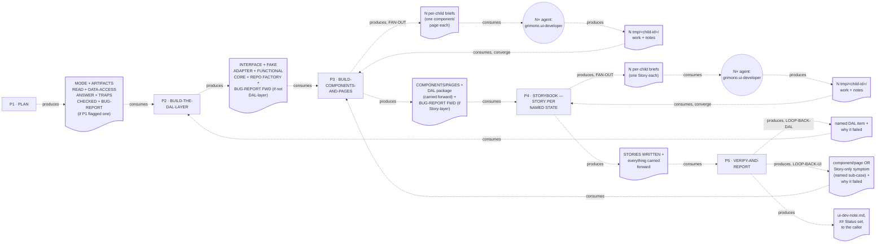

# UI Developer — Quasi-Software View (five layers: NODES, PHASES, INTERNAL, PARALLELIZATION, EXPECTED OUTPUTS)

This is `grimorio.ui-developer`'s own DRAWN quasi-software design view, produced per
ref:skill/grimorio.phase-splitting#the-agent-design-plans-drawn-view--a-hard-requirement-never-optional's
standing requirement that every agent-design plan carry one, saved alongside the agent's own design as a
reference file. It mirrors ref:skill/grimorio.qa-memory/qa-phases/qa-quasi-software-view.md's own already-shipped
five-section shape (a purpose-driven, non-hard-locked agent with a real own-type gated fan-out AND a real
internal loop-back) and EXTENDS it in two ways that chain does not need: TWO loop-back edges re-entering
DIFFERENT phases rather than the same one, and TWO separate fan-out dispatch points rather than one, because
this agent's own VOLUME UNIT exists twice — once per component/page (Phase 3), once per Story (Phase 4) — at
two structurally different points in the chain. This file draws all layers directly from
ref:skill/grimorio.ui-developer-memory/behavior.md and its five
ref:skill/grimorio.ui-developer-memory/ui-developer-phases/phase-1-plan.md through
ref:skill/grimorio.ui-developer-memory/ui-developer-phases/phase-5-verify-and-report.md, all read in full THIS
pass, in the same authoring dispatch that wrote them; it changes none of their content.

## Layer 1 + 2 — NODES (the orchestration graph) and PHASES (the state machine)

```mermaid
flowchart TB
    P1["P1 · PLAN"] --> P2["P2 · BUILD-THE-<br/>DAL-LAYER"]
    P2 -->|"BOTH FIRST-PASS and<br/>RE-ENTRY routes converge<br/>here, unconditional"| P3["P3 · BUILD-<br/>COMPONENTS-<br/>AND-PAGES"]
    P3 -->|"FIRST-PASS and<br/>RE-ENTRY converge<br/>here, unconditional"| P4["P4 · STORYBOOK —<br/>STORY PER<br/>NAMED STATE"]
    P4 -->|"FIRST-PASS and<br/>RE-ENTRY converge<br/>here, unconditional"| P5["P5 · VERIFY-AND-<br/>REPORT (terminal)"]

    P5 -.->|"LOOP-BACK-DAL: dev:fake/typecheck<br/>fails on a DAL-layer symptom<br/>(interface/adapter/Functional-<br/>Core/factory) — names what broke"| P2
    P5 -.->|"LOOP-BACK-UI: same checks fail on<br/>a component/page symptom OR a<br/>Story-only symptom (two named<br/>sub-cases, SAME edge) — names<br/>what broke"| P3

    CHILD_UI(("N× agent:<br/>grimorio.ui-developer<br/>(haiku, one per<br/>component/page)"))
    P3 -.->|"GATE HELD — fan out,<br/>foreground, synchronous,<br/>ONE message"| CHILD_UI
    CHILD_UI -.->|"each child's own<br/>tmp/&lt;child-id&gt;/<br/>work + notes"| P3

    CHILD_STORY(("N× agent:<br/>grimorio.ui-developer<br/>(haiku, one per<br/>Story)"))
    P4 -.->|"GATE HELD — fan out,<br/>foreground, synchronous,<br/>ONE message"| CHILD_STORY
    CHILD_STORY -.->|"each child's own<br/>tmp/&lt;child-id&gt;/<br/>work + notes"| P4

    style CHILD_UI fill:#2a3a2a,stroke:#5a5
    style CHILD_STORY fill:#2a3a2a,stroke:#5a5
```

**Reading this diagram.** The solid rectangular spine (P1→P2→P3→P4→P5) is the STATE MACHINE — the five phase
files' own chain, per ref:skill/grimorio.phase-splitting#the-model--a-phase-is-a-mini-loop-state-with-three-fields.
**This chain carries TWO distinct LOOP-BACK edges, re-entering TWO DIFFERENT phases — never the same one,
unlike the QA exemplar this file extends — drawn as two visually distinct dashed edges each carrying its own
verbatim trigger label**, the same mermaid convention
ref:skill/grimorio.agent-writing/system-keeper-phases/system-keeper-quasi-software-view.md's own Layer 1+2
diagram and ref:skill/grimorio.qa-memory/qa-phases/qa-quasi-software-view.md's own diagram already establish,
reused here rather than invented fresh. LOOP-BACK-DAL fires from P5's own failure classification when the
symptom traces to the interface, either adapter, the Functional Core, or the repository factory, and re-enters
P2. LOOP-BACK-UI fires from the SAME classification step when the symptom traces to a presentational component,
an Imperative-Shell page, or a `.stories.tsx` file/fixture, and re-enters P3 instead — carrying ONE of TWO
NAMED SUB-CASES within this SAME edge, never a new edge: sub-case (a), a component/page symptom, where P3 fixes
the named component/page itself; sub-case (b), a Story-only symptom, where the underlying component/page is
fine and P3 touches nothing, instead passing the named Story issue forward unchanged. Both sub-cases are
routed to P3, never directly to P4, because P3 is the earlier phase in the chain any of these three symptom
kinds could originate from — P3's own existing unconditional forward hand-off (unchanged by this fix) is what
then actually carries either outcome on to P4. P4's own RE-ENTRY branch mirrors P3's own two sub-cases (update
the Story to match a genuine component fix, or fix the named Story directly on a pass-through) and is reached
only via that hand-off once P3's own step converges, never directly from P5. Neither loop-back has a separate RETURN edge drawn back to its own
originating phase — after P2 or P3 fixes the named item, the ordinary forward spine (the solid P2→P3→P4→P5
edges above) already carries the fix on to P5 for re-verification; the loop CLOSES through the existing forward
spine, it does not need a second dashed edge for the return trip.

**A SEPARATE data thread rides this SAME forward spine, never drawn as its own edge: cycle 4's own
`BUG-REPORT CARRIED FORWARD` field.** Phase 1's own bug-report/REWORK detection step originates it, naming the
layer (DAL, component/page, or Story) a flagged symptom belongs to. Each phase downstream of P1 either
CONSUMES it — applying the named fix as part of that phase's own mandatory bug-order work, WHEN the flagged
layer matches that phase's own layer — or FORWARDS it unconsumed to the next phase in line, WHEN it does not:
P2 consumes a DAL-layer flag or forwards a component/page-or-Story-layer one; P3 consumes a component/page-layer
flag (forwarded from P2) or forwards a Story-layer one; P4 consumes a Story-layer flag (forwarded from P2
through P3). The thread TERMINATES at whichever phase's own layer it names — it never rides past P4. This is a
DIFFERENT mechanism from the two LOOP-BACK edges above, though the two can compose in one run: a FIRST-PASS
carry-forward of a bug Phase 1 already found is not the same event as a RE-ENTRY loop-back Phase 5 triggers on
a NEW symptom found at verification time — a forwarded bug consumed on FIRST-PASS can still be followed later
by a genuine loop-back if re-verification then finds something new.

**The two circular agent-nodes, `CHILD_UI` and `CHILD_STORY`, are the GRAPH layer's own contribution** — per
ref:skill/grimorio.loop-and-graph#3-the-graph--who-is-in-it-and-the-branch-rule — drawn in a shape visually
distinct from the five rectangular phase-nodes, the same convention the QA exemplar's own `CHILD` node already
establishes, so a reader tells a phase from a spawned agent at a glance. **These are TWO SEPARATE nodes, never
merged into one, because they represent TWO INDEPENDENT VOLUME UNITS reachable from TWO DIFFERENT phases**:
`CHILD_UI` represents N independent instances (one per component/page), reachable ONLY from Phase 3's own
FAN-OUT BRANCH; `CHILD_STORY` represents N independent instances (one per Story), reachable ONLY from Phase 4's
own FAN-OUT BRANCH. By the time Phase 4 runs, Phase 3's own fan-out is already converged and closed — the two
dispatch points never overlap in time, and merging their nodes would incorrectly imply one shared spawn point
serving both VOLUME UNITS, when the chain actually structurally requires two.

**The escalation ladder (`agent:grimorio.unblocker` / `agent:grimorio.entropy` / `agent:grimorio.adviser`) is
DELIBERATELY OMITTED from this diagram, stated here explicitly rather than silently dropped.** Unlike the
CHILDREN relationship above, this ladder is reachable from EVERY phase in the chain (Phase 0's own "Standing
awareness" section states this), not from one or two specific dispatch points — a full read of every
already-shipped quasi-view in this corpus (the QA exemplar, the verifier exemplar, the system-keeper exemplar)
surfaced no existing convention for drawing a from-every-phase escalation ladder as a THIRD, visually distinct
node style in a Layer-1+2 macro diagram; the closest precedent
(ref:skill/grimorio.system-design/project.design-orchestrator-quasi-software-view.md's own per-phase Half-(b)
flowcharts) draws escalation as an inline branch INSIDE one phase's own interior flowchart, a different diagram
shape from this one. Per
ref:skill/grimorio.phase-splitting/project.quasi-view-requirements.md's own "WHEN a graph names a future,
unwired agent-node edge... draw it visually distinct... and NEVER draw it identically to a real spawn
relationship" guidance, inventing a THIRD node style here, with no prior convention to anchor it, risks
misrepresenting a reachable-from-anywhere escalation path as a phase-scoped spawn edge like `CHILD_UI` or
`CHILD_STORY` above — so this diagram states the omission in prose instead, per this file's own design doc's
explicit fallback instruction, rather than inventing an unprecedented drawing convention. **No other
future/not-wired agent-node belongs in this graph** — a full read of Phase 0 plus all five phase files surfaced
no language naming any agent this chain MAY one day lean on beyond the escalation ladder (already addressed
above) and the two CHILD nodes already drawn.

## Layer 3 — INTERNAL: per-phase artifact-flow (IN → OUT), half (a) only

**Grounding — shared across every quasi-view that draws this layer, not re-derived here:**
ref:skill/grimorio.phase-splitting/project.quasi-view-requirements.md#half-a--boundary-artifact-flow-unchanged.
Per this pass's own scope, only half (a) (boundary artifact-flow) is drawn for this chain — half (b) (per-phase
interior flowcharts + a KNOWN-ERRORS-TO-PHASE mapping) is optional per that same file and out of scope for this
pass, matching the exact scope the QA exemplar already ships at.

**This chain is NOT strictly linear, so its boundary count deviates from the plain N-1 rule, stated explicitly
rather than forced to fit.** ref:skill/grimorio.phase-splitting/project.quasi-view-requirements.md's own N-1 rule
assumes a single spine with no re-entry; this chain's own real boundary count is named here rather than papered
over:

- **FORWARD spine** (4 boundaries): P1↔P2, P2↔P3, P3↔P4, P4↔P5, plus P5's own terminal output to the caller.
  **The `BUG-REPORT CARRIED FORWARD` data thread (cycle 4) rides these SAME boundaries, never a boundary of its
  own** — P1↔P2 always, WHEN Phase 1 flagged one; P2↔P3 and P3↔P4 conditionally, only while the flagged layer
  is still downstream of the phase that just ran.
- **FAN-OUT sub-flows** (4 boundaries total, TWO separate pairs, entirely INSIDE P3 and P4 respectively, never
  phase-level boundaries — structurally different from the forward spine): P3↔CHILD_UI (N per-child briefs,
  one component/page each) and CHILD_UI↔P3 (N `tmp/<child-id>/work`+`notes` reports, converged by P3 itself
  before its own forward hand-off fires); P4↔CHILD_STORY (N per-child briefs, one Story each) and
  CHILD_STORY↔P4 (N `tmp/<child-id>/work`+`notes` reports, converged by P4 itself). These are TWO INDEPENDENT
  sub-flow pairs, never one shared pair, mirroring the two independent CHILD nodes in Layer 1+2 above.
- **LOOP-BACK re-entries** (2 boundaries, each distinct, each re-entering a DIFFERENT phase — unlike the QA
  exemplar, where both loop-backs re-enter the SAME phase): P5↔P2 (LOOP-BACK-DAL, carrying the named DAL item +
  why it failed) and P5↔P3 (LOOP-BACK-UI, carrying ONE of two named sub-cases — a component/page symptom, or a
  Story-only symptom — + why it failed) — each a ONE-WAY dashed edge into its own target phase; the RETURN half
  of each loop reuses the forward spine's own existing P2→P3→P4→P5 edges, per Layer 1+2's own reading note
  above, so it is not counted a second time here.

The dotted edges here are the SAME visual convention as the LOOP-BACK/fan-out edges in Layer 1+2 (both dashed
there) but carry a DIFFERENT meaning — "consumes"/"produces" (data moving), never "GATE HELD"/"LOOP-BACK"
(control moving) — the identical DFD process-vs-flow separation every already-shipped quasi-view in this corpus
already applies.

## Layer 4 — PARALLELIZATION: TWO genuine dispatch points, everywhere else sequential

**This chain is sequential end-to-end at the STATE MACHINE level — P1 → P2 → P3 → P4 → P5, one phase at a
time, never two phases running concurrently, on the ordinary forward route.** Both loop-back re-entries
(P5→P2, P5→P3) are ALSO strictly sequential — a loop-back is never a parallel dispatch, it is a single agent
returning to an earlier phase of its own SAME invocation and continuing to run, one phase at a time, through
the fix and back down the forward spine to P5 for re-verification.

**Unlike the QA exemplar, this chain carries TWO SEPARATE parallel dispatch points, not one — because this
agent's own VOLUME UNIT exists twice, at two structurally different phases:**

1. **Inside P3's own FAN-OUT BRANCH: WHEN the volume-fan-out ladder's step-1 gate holds, P3 raises N `haiku`
   children — one per component/page — in ONE message, foreground, synchronous, per**
   ref:skill/grimorio.fan-out#the-volume-fan-out-ladder--when-an-agent-fans-out-n-children-of-its-own-type-six-step-algorithm's
   **own step 3, and blocks until every child returns before its own next-phase read (P4) fires.**
2. **Inside P4's own FAN-OUT BRANCH: WHEN the same ladder's gate holds, over a DIFFERENT VOLUME UNIT (one Story
   per child, never a component/page), P4 raises N `haiku` children the same way, and blocks until every child
   returns before its own next-phase read (P5) fires.**

These are genuinely N-way parallel dispatch, not a sequence of one-at-a-time spawns — named here explicitly
rather than left for a reader to infer from `CHILD_UI`'s and `CHILD_STORY`'s own multiplicity in Layer 1+2. They
are also NEVER concurrent WITH EACH OTHER: P3's own fan-out fully converges before P4's own phase even begins,
so at no point in this chain's execution are both dispatch points active at once.

**No other node in this chain carries a parallelism question of its own.** P1, P2, and P5 are each a single
SELF node by their own step 1 (no spawn, ever — P2's own RE-ENTRY branch is still sequential, just a repair
pass over the same phase). **P5 is the SOLE writer of `ui-dev-note.md`** — per
ref:skill/grimorio.phase-splitting/project.flow-method.md#b-modifying-phases-stay-sequential ("many may ADVISE
it, but only ONE phase WRITES"), P5 stays sequential even considering the two loop-back edges: fixing a DAL
item in P2 or a component/page/Story in P3 never writes the dev-note itself; only P5, on its own final
convergence with no loop-back left outstanding, writes it. **P2's own five build sub-items (interface, Fake
adapter, Real adapter, Functional Core, repository factory) are correctly kept as ONE phase, never split or
parallelized**, per the pre-supplied diagnosis verdict's own proven 5→1 collapse (same primary knowledge
source, tightly coupled by a shared interface signature) — this is the mirror case of P3/P4's own genuine
parallelism: P2's own load is heavy but NOT independently splittable, while P3's and P4's own loads ARE
independently splittable by construction (one component does not depend on another component's own
implementation to exist).

## Layer 5 — EXPECTED OUTPUTS: WORK vs ORCHESTRATION, per phase

**The distinction this layer draws, kept separate from Layer 3 above: Layer 3 shows the DATA that crosses a
phase boundary — what the next phase literally reads. This layer shows the RESULT that phase's own WORK exists
to produce.**

| Phase | WORK PRODUCT (what the phase's own action produces) | ORCHESTRATION ACT (what it then routes, and to whom) |
|---|---|---|
| P1 · PLAN | MODE (Pipeline/Standalone), the missing-plan refusal call, REWORK/bug-report detection, the artifacts read, the resolved data-access-strategy answer, the traps-checked search result | Hands to P2 unconditionally, unless the missing-plan refusal fired (chain ends there) |
| P2 · BUILD-THE-DAL-LAYER | On FIRST-PASS: the interface + Fake adapter (all named states) + Real adapter + Functional Core + repository factory, as one coherent package. On RE-ENTRY: the single fixed DAL item. On either route, WHEN Phase 1 flagged a component/page-or-Story-layer bug (not DAL): forwards `BUG-REPORT CARRIED FORWARD` unconsumed to P3 as part of the same hand-off | Hands to P3 unconditionally, on either route — never spawns |
| P3 · BUILD-COMPONENTS-AND-PAGES | On FIRST-PASS: the decomposition + fan-out gate decision + the actual components/hooks/pages built, applying Phase 1's own flagged component/page-layer bug as part of that build WHEN one was forwarded, or forwarding a Story-layer flag unconsumed to P4 otherwise. On RE-ENTRY: sub-case (a) the single fixed component/page, or sub-case (b) nothing touched — the named Story issue passed through unchanged. On CHILD: the single assigned component/page | Hands to P4 unconditionally on FIRST-PASS/RE-ENTRY (both sub-cases) — spawns N `CHILD_UI` only when the gate holds — CHILD route reports to the parent, never reads P4 |
| P4 · STORYBOOK — STORY PER NAMED STATE | On FIRST-PASS: the decomposition + fan-out gate decision + one Story per named state per component, using the Fake fixtures, with global CSS confirmed, applying Phase 1's own flagged Story-layer bug (forwarded via P2→P3) as part of that same write WHEN one was forwarded — the `BUG-REPORT CARRIED FORWARD` thread terminates here, never forwarded past P4. On RE-ENTRY: sub-case (a) the Story(ies) updated to match P3's fixed component, or sub-case (b) the passed-through Story fixed directly, per what P3 forwarded. On CHILD: the single assigned Story | Hands to P5 unconditionally on FIRST-PASS/RE-ENTRY (both sub-cases) — spawns N `CHILD_STORY` only when the gate holds — CHILD route reports to the parent, never reads P5 |
| P5 · VERIFY-AND-REPORT | The `dev:fake` boot result, the typecheck result, the failure classification (WHEN either check fails), `ui-dev-note.md` (Pipeline mode), the `## Status`/`## Close` values | Terminal — reports to the caller (no loop, or a fired loop already re-converged clean) OR loops back to P2 (LOOP-BACK-DAL) OR loops back to P3 (LOOP-BACK-UI) |

## Evidence of phase-design reasoning — the RENDER/GROUP/MEASURE working product, saved

Per
ref:skill/grimorio.phase-splitting/project.quasi-view-requirements.md#evidence-of-phase-design-reasoning--save-the-rendergroupmeasure-working-product-never-discard-it-silently,
this section restates, as a durable saved artifact rather than a claim taken on faith, the sizing reasoning
`grimorio.system-keeper` already performed (its own placement decision) and the pre-supplied, independently-
reasoned diagnosis verdict it extended (this project's own branch-objective records), both read
in full this pass and inlined here rather than left as a pointer into scratch that will not survive past this
session.

**RENDER — the complete load, before any grouping.** The pre-split shell (`grimorio.ui-developer.md`) carried
its own IDENTITY-section prose (the "you build UI decoupled from the real backend... you are the agent that
replaces the old 'UX writes a mockup spec' step" paragraph — unchanged by this pass, per the brief's own
explicit instruction) plus a flat Behavior block naming TWO files executed together, every invocation, plus an
11-entry flat Knowledge list: `agent-selection`, `code-harness`, `objective-harness`, `frontend-development`
(primary reference), `working-memory`, `ui-developer-memory`, `development-patterns`, `developer-memory`,
`javascript`, `feature-workflow`, `fan-out`. The two full behavior files executed together: `developer-memory/
project.build-protocol.md` (~191 lines: harness lookup, survey-before-writing, fan-out gate, missing-plan
refusal, comments rule, commit-by-isolation, bug-report order, foreground-test rule, pipeline/standalone mode,
OUTPUT template, REWORK mode, harness/trap-capture) and `ui-developer-memory/behavior.md` (~138 lines: Scope
Boundary, the data-access-strategy question, a flat 10-sub-step `## Steps` list, `## Completion criteria`, `##
What you do NOT do`). A DAL-interface-definition sub-step did not need `feature-workflow` (pipeline routing) or
the `fan-out` trigger text loaded in full at that moment — yet both were mandatory-imported regardless of which
sub-step was actually executing. This is the exact flat-mega-load anti-pattern
ref:skill/grimorio.phase-splitting names by construction, not by inference.

**GROUP — five candidates, all clearing the bar, none rejected outright.** (1) PLAN: reads
`po-brief.md`/`arch-decision.md`/prior `ui-dev-note.md`, the missing-plan refusal, pipeline-vs-standalone mode
detection, REWORK/bug-report detection, data-access-strategy resolution, and a SEARCH-FIRST precedent pass
against this project's own developer trap log — the pre-supplied verdict's own named gap (PLAN never read the
traps index), closed by this design. (2) BUILD-THE-DAL-LAYER: interface + Fake + Real + Functional Core + repo
factory, kept as ONE phase per the verdict's own proven 5→1 collapse (all five sub-items key off the SAME
primary knowledge source — `frontend-development`'s DAL/FC-IS sections — and are tightly coupled by a shared
interface signature threading through fake/real/factory) plus harness-first lookup (this IS the chain's first
file-creating phase) plus survey-before-writing scoped to the DAL folder plus the bug-report-mandatory-order
WHEN Phase 1 flagged a DAL-layer bug. (3) BUILD-COMPONENTS-AND-PAGES: components/hooks/pages, pulling
`development-patterns` + `javascript` — genuinely different knowledge from Group DAL-LAYER's `frontend-
development`-DAL sections — plus survey-before-writing scoped to components plus the fan-out gate (VOLUME UNIT:
one component/page) plus the bug-report-mandatory-order WHEN Phase 1 flagged a component/page-layer bug
(carried forward through Group DAL-LAYER's own hand-off, unconsumed, since that group's own layer never
matches). (4) STORYBOOK: one Story per named state, pulling `frontend-development`'s Storybook
section specifically — a distinct tooling concern from both DAL plumbing and component authoring, and its
deliverable is consumed by an EXTERNAL agent next (`grimorio.ux` critiques the Stories) — plus survey-before-
writing scoped to stories plus the fan-out gate (VOLUME UNIT: one Story) plus the bug-report-mandatory-order
WHEN Phase 1 flagged a Story-layer bug (carried forward the same way, through Group DAL-LAYER's and Group
BUILD-COMPONENTS-AND-PAGES's own hand-offs in turn). (5) VERIFY-AND-REPORT: `dev:fake` boot
+ typecheck (foreground, never backgrounded) + failure classification feeding TWO distinct loop-backs (a
DAL-layer symptom to Phase 2, a component/page/Story symptom to Phase 3) + `ui-dev-note.md` (the shared OUTPUT
template) + REWORK-cycle-append + commit-by-isolation + the Completion-criteria checklist as this phase's own
EXIT CONDITION. No candidate was rejected — all five match the pre-supplied verdict's own five groups,
one-to-one, extended only with the build-protocol threading table and the closed traps.md gap.

**MEASURE — a rendered count per group, no pincho found.** Group BUILD-THE-DAL-LAYER carries 5 rendered
sub-items but ONE knowledge source (`frontend-development` §1-2-3 DAL/FC-IS/named-states +
this project's own developer memory) — not split further; splitting it would reproduce the exact
measured `grimorio.prompt-writer` over-splitting incident this skill names explicitly (draft/verify/form-
decision fragmented when only the WHOLE group was one mission). No group here carries a multiple of its
siblings' load: Group PLAN is the heaviest by knowledge-slice count (5, corrected from this pass's own earlier 4 now that
`feature-workflow#artifact-directory-structure` is threaded in per the Coverage correction above:
build-protocol's own missing-plan-refusal/pipeline-mode/bug-order sections,
`feature-workflow#artifact-directory-structure`, this project's own frontend-developer memory,
this project's own developer trap log, `reasoning-principles`), but that is dimension (d) — base requirements
grouped into ONE cognitive mission — not a pincho: a human plans a task in one sitting, not in five separate
ones. Group
BUILD-COMPONENTS-AND-PAGES and Group STORYBOOK each carry 1 rendered item and 1-2 distinct knowledge sources not
shared with BUILD-THE-DAL-LAYER or with each other. Group VERIFY-AND-REPORT carries 3 knowledge sources, corrected
from this pass's own earlier 2 now that `feature-workflow#artifact-directory-structure` is threaded in per the
Coverage correction above (the dev-fake-runtime pointer, the shared OUTPUT template,
`feature-workflow#artifact-directory-structure`) across a genuine mini hard-loop (two distinct LOOP-BACK
classifications, never a subset of an earlier group).

**Against the pincho check and CHILDREN-OFFLOAD.** The pre-split file's flat 10-sub-step list already carried
five genuinely separate missions once regrouped (PLAN, DAL-LAYER, UI-LAYER, STORYBOOK, CLOSE-OUT) with no
fused-overload comparable to a measured 5×-sibling pincho elsewhere in this corpus. CHILDREN-OFFLOAD was
considered for BUILD-COMPONENTS-AND-PAGES's and STORYBOOK's own volume, and found the CORRECT remedy, not an
additional one: both groups already perform CHILDREN-OFFLOAD via their own FAN-OUT BRANCH, for the actual
build/write volume once the scope is known — this IS the mechanism, threaded through the two phases that
actually produce volume, never given a phase of its own, exactly as the pre-supplied verdict's own classification
already states.

**Coverage — every rendered item placed, self-disclosed rather than smoothed over.** All 11 skills from the
RENDER inventory above land in exactly one or more phase groups, or are correctly THREADED rather than dropped:
`agent-selection` → Phase 0's own "Standing awareness — the escalation ladder" section (never a per-phase load,
since the ladder is reachable from every phase alike). `code-harness` → Phase 2 only (the upward lookup, this
chain's first file-creating phase). `objective-harness` → dropped from the phase-chain's own per-phase LOAD
entirely: it governs branch-open/close mechanics external to this agent's own build loop, never cited by the
current pre-split behavior file's own Steps either — carried forward unchanged in this pass's own scope, not a
new omission it introduces. `frontend-development` → splits across Phase 2 (DAL/FC-IS/named-states sections)
and Phase 4 (Storybook section) — two DIFFERENT anchors for two different questions, never the same knowledge
loaded twice for the same purpose. `working-memory` → Phase 3 and Phase 4 (the per-child `tmp/<child-id>/`
folder convention, each phase's own FAN-OUT BRANCH). `ui-developer-memory` → splits across Phase 0 (Scope
Boundary), Phase 1 (`#data-access-strategy`), Phase 4 (`#Storybook`), and Phase 5 (`#dev-fake-runtime`) — its
own General-level content was never one undifferentiated blob to begin with, and this split makes that division
legible per-phase for the first time. `development-patterns` → Phase 3 only. `developer-memory` → splits across
every phase via the threaded build-protocol table (Phase 0's own attachment table) plus Phase 1's own
its own developer trap log search (the verdict's own named gap, closed) plus Phase 2's own `#ui-developer-scope`
pointer. `javascript` → Phase 2, Phase 3, and Phase 4 (authoring conventions wherever a file is actually
written). `feature-workflow` → **corrected, not dropped**: threaded into Phase 1 (`#artifact-directory-structure`,
fingerprinted to the ARTIFACTS READ field — a real per-artifact read under the correct `tmp/features/{slug}/`
directory cannot be produced without it) and Phase 5 (the same anchor, fingerprinted to the UI-DEV-NOTE PATH
field). This is the TRUE precedent `grimorio.qa-memory` already ships: QA's own Phase 1
(ref:skill/grimorio.qa-memory/qa-phases/phase-1-search-first-and-plan.md) carries this exact import
fingerprinted to its PIPELINE ARTIFACTS READ field, and QA's own Phase 4
(ref:skill/grimorio.qa-memory/qa-phases/phase-4-report-and-close.md) carries it fingerprinted to its REPORT
PATH field — QA never drops `feature-workflow`, it loads it exactly where the artifact-directory structure is
actually used, and this chain now matches that precedent instead of diverging from it. The threaded
`build-protocol.md`'s own Pipeline-vs-Standalone section (Phase 1) and OUTPUT template (Phase 5) state WHEN to
read/write the pipeline artifacts and in WHAT SHAPE — neither states WHERE those artifacts physically live
(`tmp/features/{slug}/`), which only `feature-workflow#artifact-directory-structure` defines; the two prior
threaded imports were never a substitute for this one. `fan-out` → Phase 3 and Phase 4 (the volume-fan-out
ladder, each phase's own FAN-OUT BRANCH) — never Phase 2, which the verdict's own proven 5→1 collapse
establishes is NEVER fanned out.
