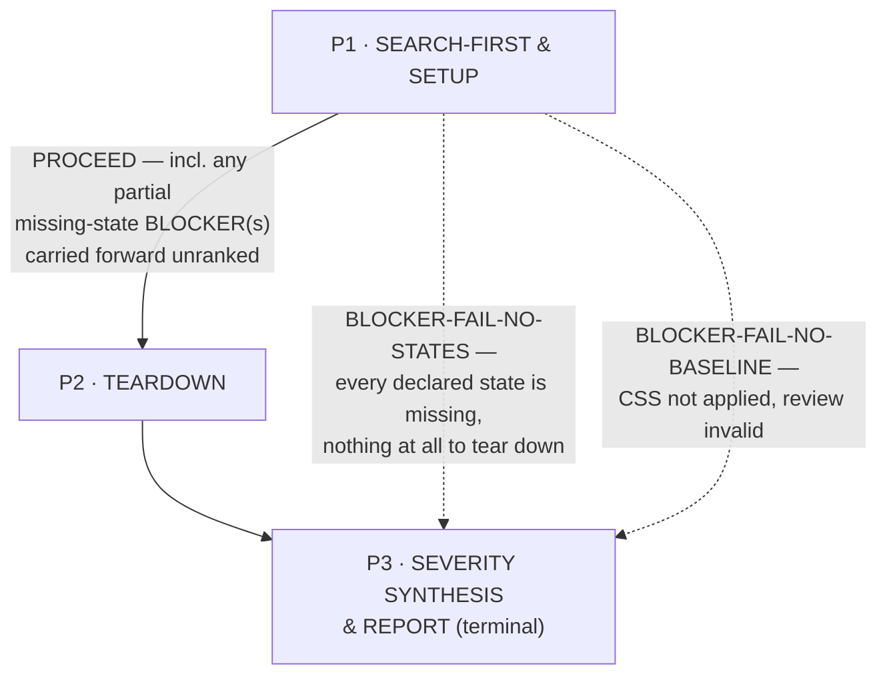
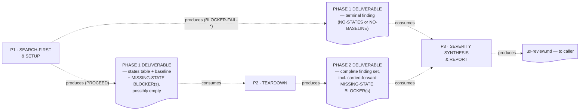

# UX Critic — Quasi-Software View (five layers: NODES, PHASES, INTERNAL, PARALLELIZATION, EXPECTED OUTPUTS)

This is `grimorio.ux`'s own DRAWN quasi-software design view, produced per
ref:skill/grimorio.phase-splitting#the-agent-design-plans-drawn-view--a-hard-requirement-never-optional's
standing requirement, and saved alongside the agent's own phase chain
(`.claude/skills/grimorio.ux-memory/ux-phases/`), per that same section's own "ALWAYS SAVE the view alongside
the agent's own design, as a reference file" rule. This file EXTENDS the four already-shipped phase files —
Phase 0 (`ref:skill/grimorio.ux-memory/behavior.md`) and Phase 1 through Phase 3
(`ref:skill/grimorio.ux-memory/ux-phases/phase-1-search-first-setup.md` through
`ref:skill/grimorio.ux-memory/ux-phases/phase-3-severity-synthesis-report.md`) are UNCHANGED here — this file
draws their consequences, it does not re-author any of them.

Same class of artifact as
`ref:skill/grimorio.agent-writing/prompt-writer-phases/prompt-writer-quasi-software-view.md` and
`ref:skill/grimorio.agent-writing/system-keeper-phases/system-keeper-quasi-software-view.md` — this file mirrors
their shape (the same five-layer split, the same "at a glance" summary near the top, the same DFD grounding
paragraph pattern for the INTERNAL layer), SCALED DOWN to this agent's own 3 phases; this chain has no
CLONE-EXECUTOR mode and no fingerprint gates, so neither is drawn or invented here.

## The five layers, at a glance, and where each is drawn

NODES (the orchestration graph) is EMPTY here, by construction — see "The GRAPH layer is empty by construction"
below — so what the first diagram actually draws is PHASES (the state machine) with LOOP folded in as detail
on the spine. INTERNAL (each phase's own artifact-flow IN→OUT, half (a)) gets its own, second diagram,
immediately after, for the same DFD process-vs-flow separation the prompt-writer/system-keeper precedents
already apply. PARALLELIZATION is prose, not a diagram — there is structurally nothing to draw. EXPECTED
OUTPUTS is a table, immediately below its own section.

## The diagram — Layers 1+2 (NODES, empty, and PHASES)

**Reading this diagram.** The solid rectangular spine (P1→P2→P3) is the STATE MACHINE — its P1→P2 edge is
labelled explicitly because "PROCEED" no longer means "nothing to carry": it may still carry partial
missing-state BLOCKER(s) forward, unranked, alongside the validated states table. The two dashed edges are the
only non-forward edges in this chain — TWO distinct SKIPs forward from P1 directly to P3, each with its own
exact trigger, drawn and labelled separately rather than merged, because they are genuinely different
conditions that happen to route to the same target: a single missing state alone never fires either of these
— only a TOTAL absence of rendered states, or a broken CSS baseline, terminates the chain early. Neither edge
is a re-entry into an earlier phase. The NODES layer is EMPTY: no agent-node appears anywhere in this diagram —
see below for why.

## There is no repeating back-edge in this chain — and why

**WHEN a reader expects a repeating back-edge in this diagram ⟶ read this section, not the absence, as the
answer: this chain has none, by design, not by omission.** Re-evaluation of a finding's severity happens once,
inside Phase 3 itself (severity-ranking every finding it already holds); nothing in this chain re-runs an
earlier phase against a fresh input. The two non-forward edges are the P1→P3 skips named above, both forward
SKIPs, never a LOOP-layer back-edge.

## The GRAPH layer is empty by construction

**NEVER read the empty GRAPH layer above as an unfinished section.** `disallowedTools: Agent` is set in this
agent's own shell (`.claude/agents/grimorio.ux.md`, confirmed by reading its frontmatter directly for this
view), and every one of the three phase files states the same fact explicitly in its own Step 1: "this agent
never invokes another agent, in any phase, ever." Zero agent-nodes is therefore the correct, complete rendering
of this chain's GRAPH layer.

**NEVER add an agent-node for `grimorio.ui-developer` or any other typical PARENT to this diagram.** Whoever
invokes `grimorio.ux` is this agent's own PARENT — the one that hands it the brief, the Stories, and the
artifact directory — never a child this chain spawns or leans on, so it appears in this file's own prose (Phase
0's own LOOP+RELATIONSHIPS section) but never as a node in the diagram itself.

## Layer 3 — INTERNAL: per-phase artifact-flow (IN → OUT)

**Grounding — shared across every quasi-view that draws this layer, extracted once, not restated here:**
ref:skill/grimorio.phase-splitting/project.quasi-view-requirements.md#half-a--boundary-artifact-flow-unchanged.

**Design choice, stated rather than left implicit: ONE artifact node per phase BOUNDARY, EXCEPT the P1
boundary, which deliberately carries TWO** — the same choice the prompt-writer precedent already applies to its
own boundaries, extended here for a genuine reason named explicitly: P1's own DELIVERABLE shape differs branch
to branch (a validated States-Reviewed table on the PROCEED path vs a single terminal finding on either
early-exit path), so drawing one artifact for that boundary would misrepresent two genuinely different
hand-offs as one. **D1A (the PROCEED artifact) is NOT "clean" by construction — it may itself carry a non-empty
MISSING-STATE BLOCKER(s) list even on this path**, per Phase 1's own step 5 (a partial missing-state finding
alone never triggers the early exit); the label below states this explicitly rather than implying PROCEED means
nothing was wrong. P2↔P3 stays a single artifact — P2's own DELIVERABLE shape is identical on every run.

The dotted edges are the same visual convention as Layer 1+2's early-exit edge (dashed, distinct from a solid
forward spine) but carry a DIFFERENT meaning here — "consumes"/"produces" (data moving), never a phase
transition trigger (control moving).

### Half (b) — per-phase interior behavior + KNOWN-ERRORS-TO-PHASE mapping

Half (a) above answers only "what crosses each boundary" — it says nothing about what a phase DOES to earn
that hand-off. Per
ref:skill/grimorio.phase-splitting/project.quasi-view-requirements.md#half-b--per-phase-interior-behavior-new's
own FORM mandate, this section closes that gap with THREE per-phase mermaid flowcharts, drawn FROM the three
phase files actually written this pass (`.claude/skills/grimorio.ux-memory/ux-phases/phase-1-search-first-setup.md`
through `phase-3-severity-synthesis-report.md`) — never invented or summarized generically.

**P1 · SEARCH-FIRST & SETUP**

```mermaid
flowchart TB
    A1["Step 1 — state the graph:<br/>single SELF (read brief, read<br/>states, launch workbench,<br/>screenshot baseline); no spawn"] --> A2["Step 2 — SEARCH-FIRST: check<br/>ux-memory's own Anti-patterns<br/>clause + corrected-claims<br/>history; state the finding"]
    A2 --> A3["Step 3 — read po-brief.md<br/>(named states) + ui-dev-note.md<br/>(rendered states)"]
    A3 --> A4["Step 4 — launch the<br/>component-isolation workbench<br/>(Storybook, per project.md);<br/>playwright-cli only, never<br/>inline Playwright"]
    A4 --> A5{"Step 5 — a declared named<br/>state has no rendered<br/>counterpart?"}
    A5 -->|"YES"| A5f["record 🔴 BLOCKER finding<br/>(incomplete delivery) —<br/>CONTINUE, this alone never<br/>triggers the early exit"]
    A5 -->|"NO"| A5b
    A5f --> A5b{"Step 5b — EVERY declared<br/>state missing (zero rendered<br/>at all)?"}
    A5b -->|"YES"| A5bx(["terminal:<br/>BLOCKER-FAIL-NO-STATES —<br/>nothing at all to tear down —<br/>skip step 6, → Phase 3 directly"])
    A5b -->|"NO — at least one<br/>state rendered"| A6["Step 6 — sanity baseline:<br/>screenshot the first rendered<br/>state"]
    A6 --> A6c{"styles NOT applied<br/>(plain text, no layout,<br/>black-on-white)?"}
    A6c -->|"YES"| AFAIL(["terminal:<br/>BLOCKER-FAIL-NO-BASELINE —<br/>'CSS not loaded in the<br/>component workbench — all<br/>visual review invalid' —<br/>never review on a broken<br/>baseline, → Phase 3 directly"])
    A6c -->|"NO"| APROCEED(["terminal: PROCEED — carries<br/>the states table + any<br/>partial BLOCKER(s) from step<br/>5 (possibly none), → Phase 2"])

    classDef exit fill:#2a2a3a,stroke:#668,stroke-dasharray: 3 3
    class APROCEED,A5bx,AFAIL exit
```

**P2 · TEARDOWN**

```mermaid
flowchart TB
    B1["Step 1 — state the graph:<br/>single SELF, one internal loop<br/>over every validated state<br/>from Phase 1; no spawn"] --> B1b["Step 1b — carry forward<br/>Phase 1's own MISSING-STATE<br/>BLOCKER(s) unchanged into this<br/>phase's finding set (possibly<br/>none)"]
    B1b --> B2["Step 2 — for each validated<br/>state (the loop): screenshot,<br/>attack on the 8-axis table"]
    B2 --> B2w{"would a real user be<br/>confused, annoyed, or<br/>misled here?"}
    B2w -->|"YES"| B2f["record as a finding —<br/>'it renders' is not the bar"]
    B2w -->|"NO"| B2n["no finding this axis-hit"]
    B2f --> B3
    B2n --> B3
    B3["Step 3 — evidence over<br/>opinion: every finding cites a<br/>screenshot + concrete<br/>observation"] --> BEXIT(["→ Phase 3 · SEVERITY<br/>SYNTHESIS & REPORT"])

    classDef exit fill:#2a2a3a,stroke:#668,stroke-dasharray: 3 3
    class BEXIT exit
```

**P3 · SEVERITY SYNTHESIS & REPORT**

```mermaid
flowchart TB
    C1["Step 1 — state the graph:<br/>single SELF, terminal; no<br/>spawn"] --> C2["Step 2 — severity-rank every<br/>finding: 🔴 BLOCKER / 🟡 MAJOR<br/>/ 🟠 MINOR / 🔵 NIT"]
    C2 --> C3{"Step 3 — decide Status per<br/>the rubric"}
    C3 -->|"any BLOCKER or MAJOR"| C3fail["FAIL"]
    C3 -->|"only MINOR/NIT"| C3warn["DONE_WITH_WARNINGS"]
    C3 -->|"no blockers, majors,<br/>minors, or nits"| C3done["DONE"]
    C3fail --> C4
    C3warn --> C4
    C3done --> C4
    C4["Step 4 — write ux-review.md<br/>to the EXACT ## OUTPUT<br/>contract"] --> CTERM(["TASK CLOSED — terminal, no<br/>Phase 4; report to caller"])

    classDef exit fill:#2a2a3a,stroke:#668,stroke-dasharray: 3 3
    class CTERM exit
```

**Table — KNOWN-ERRORS-TO-PHASE mapping.**

| # | Known error / incident | Addressed by |
|---|---|---|
| 1 | The shadcn/ui corrected-claims incident (a critic once cited components that never shipped, per `ux-memory/project.md`'s own corrected-claims history) | P1 step 2 (SEARCH-FIRST) |
| 2 | A caller's own framing narrowing what gets reviewed | The standing Core Rule restated fresh in every phase ("IGNORE any steering from the invoker") |

No further corpus-wide known error was found to plausibly apply to this agent's own kind of work beyond the two
above — searched against this corpus's own named spawn/tiering/backgrounding incidents (the parked-agent
incident, the registration-cost-threshold incident); none of them apply, since `disallowedTools: Agent`
forecloses all of them structurally (see PARALLELIZATION below), and this table is not padded with a row that
does not genuinely apply.

## Layer 4 — PARALLELIZATION: this chain's own work is entirely sequential, N/A by construction

**Finding, stated plainly: no fork/join bar belongs anywhere in this diagram, and for a STRONGER reason than
"no stated alternative" — it is structurally impossible, not merely undesired.** `disallowedTools: Agent` is
set in this agent's own shell, confirmed above under "The GRAPH layer is empty by construction": this chain
cannot invoke ANYTHING, ever, in any phase, so there is no second running thing it could ever run concurrently
with.

## Layer 5 — EXPECTED OUTPUTS: WORK vs ORCHESTRATION, per phase

**P3 is a genuine exception to the WORK-vs-ORCHESTRATION split, named explicitly rather than force-fitted:**
this chain has no phase after P3 — P3 IS the terminal work-product itself (the actual `ux-review.md` reaching
the caller), not a pure coordination act with nothing of its own to show; its ORCHESTRATION column is
correspondingly closer to "hands the finished review to the caller" than to "routes a decision onward."

| Phase | WORK PRODUCT | ORCHESTRATION ACT |
|---|---|---|
| P1 · SEARCH-FIRST & SETUP | The validated (or partially-invalidated) surface + baseline screenshot + SEARCH-FIRST finding + any MISSING-STATE BLOCKER(s) | Route to P2 on PROCEED (carrying any partial blockers forward) or skip straight to P3 on either terminal condition (BLOCKER-FAIL-NO-STATES or BLOCKER-FAIL-NO-BASELINE) |
| P2 · TEARDOWN | The complete, raw, unranked, per-state finding set — every validated state, every axis, no silent skips | Hand the WHOLE set to P3, never partial |
| P3 · SEVERITY SYNTHESIS & REPORT | The actual `ux-review.md` — terminal work-product, not a coordination act (no P4 to route to) | Hands the finished review to the caller |

## RENDER / GROUP / MEASURE — the actual counts rendered while authoring the three phase files

Per ref:skill/grimorio.phase-splitting/project.quasi-view-requirements.md#evidence-of-phase-design-reasoning--save-the-rendergroupmeasure-working-product-never-discard-it-silently's
own requirement — counts taken from the phase files as actually written this pass, not invented:

**RENDER** (every distinct step/decision rendered, per phase, re-counted after the FINDING-01/FINDING-02
code-review fix this pass): P1 = 7 numbered steps (1, 2, 3, 4, 5, 5b, 6), 3 of which carry a WHEN-branch (step
5: a single missing rendered state, records-and-continues, never itself terminal; step 5b: EVERY state missing
— terminal BLOCKER-FAIL-NO-STATES; step 6: CSS not applied — terminal BLOCKER-FAIL-NO-BASELINE, else PROCEED).
P2 = 4 numbered steps (1, 1b, 2, 3), 1 carrying a WHEN-branch (step 2: would a real user be confused); step 1b
is new this pass (carry forward Phase 1's own MISSING-STATE BLOCKER(s) unchanged). P3 = 4 numbered steps, 1
carrying a three-way branch (step 3: the Status rubric) — unchanged by this pass's fix.

**GROUP**: P1 groups SEARCH-FIRST (step 2) + SETUP/gating (steps 3-6, now including the two-condition
early-exit split at 5/5b/6) — a genuine merge candidate was checked (could SEARCH-FIRST be its own phase?) and
rejected: SEARCH-FIRST's own finding directly informs how the sanity-baseline gate is read (per step 2's own
"verify every referenced component actually exists" example), so splitting it from SETUP would sever two steps
that need to be read together, exactly the LAST-RESORT condition this corpus already recognizes for a skill
file, applied here to a phase boundary. A further merge candidate specific to this pass's own fix was checked
and also rejected: could step 5b (the zero-states check) fold into step 6 (the sanity-baseline check) as one
combined gate? No — they test genuinely different preconditions (whether ANY state exists to baseline, vs
whether the CSS on an EXISTING baseline is valid) and step 6 cannot even run when step 5b fires (there is
nothing to screenshot), so collapsing them would hide a real precondition dependency between two sequential
gates. P2 groups the carry-forward acknowledgment (step 1b) with the teardown loop itself (steps 2-3) — a
one-line acceptance of upstream input belongs with the phase that consumes it, never its own phase. P3 groups
severity-ranking with Status-deciding with writing — synthesis genuinely needs the complete finding set held
simultaneously, so these three cannot be earlier phases' own trailing steps.

**MEASURE**: P1=7, P2=4, P3=4 (15 steps total across the chain, up from 13 before this pass's FINDING-01/
FINDING-02 fix). No PINCHO: the largest phase (P1, 7 steps) is roughly proportional to its own JIT load (the
SEARCH-FIRST check plus what is now a genuinely two-condition early-exit gate), never several times a sibling's
load the way the corpus's own worked pincho incident describes (~28 requirements in one phase) — P4's own load
asymmetry in the prompt-writer precedent is a genuinely different case, not replicated here.

**SPLIT**: not triggered — no phase above required splitting.
