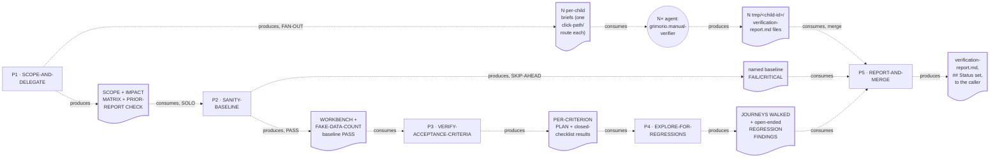

# Manual Verifier — Quasi-Software View (five layers: NODES, PHASES, INTERNAL, PARALLELIZATION, EXPECTED OUTPUTS)

This is `grimorio.manual-verifier`'s own DRAWN quasi-software design view, produced per
ref:skill/grimorio.phase-splitting#the-agent-design-plans-drawn-view--a-hard-requirement-never-optional's
standing requirement that every agent-design plan carry one, saved alongside the agent's own design as a
reference file. It mirrors
ref:skill/grimorio.security-memory/security-phases/security-quasi-software-view.md's own already-shipped
five-layer shape (a fully sequential chain) AND
ref:skill/grimorio.fan-out/researcher-phases/researcher-quasi-software-view.md's own already-shipped shape (a
circular same-type/scout agent-node reachable from one branch) — both read in full as this file's own
structural exemplars, never as its content — adapted to a FIVE-phase chain that is NOT hard-locked: this agent
CAN spawn `haiku`-tier children of its own type, but ONLY from Phase 1's own fan-out branch, the closer
structural match to researcher's chain than to security's hard-locked one. This file draws all layers directly
from ref:skill/grimorio.verifier-memory/behavior.md and its five
ref:skill/grimorio.verifier-memory/verifier-phases/phase-1-scope-and-delegate.md through
ref:skill/grimorio.verifier-memory/verifier-phases/phase-5-report-and-merge.md, all read in full THIS pass, in
the same authoring dispatch that wrote them; it changes none of their content.

## Layer 1 + 2 — NODES (the orchestration graph) and PHASES (the state machine)

```mermaid
flowchart TB
    P1["P1 · SCOPE-AND-<br/>DELEGATE"] -->|"GATE DID NOT<br/>HOLD — proceed<br/>solo"| P2["P2 · SANITY-<br/>BASELINE"]
    P2 -->|"BOTH baselines<br/>PASS"| P3["P3 · VERIFY-<br/>ACCEPTANCE-CRITERIA"]
    P3 -->|"EXIT: PHASE 3 DELIVERABLE<br/>filled + fingerprint-gate<br/>PASS"| P4["P4 · EXPLORE-FOR-<br/>REGRESSIONS"]
    P4 -->|"EXIT: PHASE 4 DELIVERABLE<br/>filled + fingerprint-gate<br/>PASS"| P5["P5 · REPORT-AND-<br/>MERGE (terminal)"]

    CHILD(("N× agent:<br/>grimorio.manual-<br/>verifier (haiku,<br/>one per click-path/<br/>route)"))
    P1 -.->|"GATE HELD — fan out,<br/>foreground, synchronous,<br/>ONE message"| CHILD
    CHILD -.->|"each child's own<br/>tmp/&lt;child-id&gt;/<br/>verification-report.md"| P5
    P1 -.->|"fan-out fired —<br/>parent skips 2-4,<br/>waits + merges"| P5

    P2 -.->|"SKIP-AHEAD: WORKBENCH<br/>FAIL or FAKE-DATA-COUNT<br/>CRITICAL — short-circuit,<br/>NOT a loop-back"| P5

    style CHILD fill:#2a3a2a,stroke:#5a5
```

**Reading this diagram.** The solid rectangular spine (P1→P2→P3→P4→P5 on the SOLO route) is the STATE MACHINE —
the five phase files' own chain, per
ref:skill/grimorio.phase-splitting#the-model--a-phase-is-a-mini-loop-state-with-three-fields. **This chain
carries NO LOOP-BACK edge anywhere**, exactly like `grimorio.security`'s own chain and unlike
`grimorio.system-keeper`'s own (which loops P5→P4 and P6→P4 on a defect): a `FAIL`/`CRITICAL` status set at P5
routes EXTERNALLY, to ref:skill/grimorio.feature-workflow's own REWORK cycle (a fresh invocation of this agent,
starting again at Phase 0, against whatever was reworked), never an internal loop-back to an earlier phase of
THIS invocation. The two dashed edges in this diagram are BOTH non-loop-back deviations from the spine, and
they are two DIFFERENT KINDS, stated explicitly rather than conflated: the P2→P5 edge is a SKIP-AHEAD
short-circuit forward (a failed sanity baseline invalidates everything downstream, so this pass jumps straight
to reporting it — never returns to retry an earlier phase, the identical distinction
ref:skill/grimorio.fan-out/researcher-phases/researcher-quasi-software-view.md's own SINGLE-SLICE-COLLAPSE edge
already states for its own chain); the P1→CHILD/CHILD→P5/P1→P5 edges are a FAN-OUT dispatch, not a
short-circuit at all — Phase 1 itself is always read and executed on every pass (its own file states this: the
FAN-OUT BRANCH is a sub-node INSIDE Phase 1, never a bypass of it), and the branch only decides whether Phase
1's own next-phase READ lands on P2 (solo) or jumps directly to P5 (fan-out fired, delegating Phases 2-4's own
work to the spawned children).

**The one circular agent-node, `CHILD`, is the GRAPH layer's own contribution** — per
ref:skill/grimorio.loop-and-graph#3-the-graph--who-is-in-it-and-the-branch-rule — drawn in a shape visually
distinct from the five rectangular phase-nodes, the same convention both cited exemplars already establish, so
a reader tells a phase from a spawned agent at a glance, with no legend doing that work. `CHILD` represents N
independent instances (one per click-path/route, this agent's own VOLUME UNIT), reachable ONLY from Phase 1's
own fan-out branch — no other phase in this chain ever spawns, per Phase 1's own step 1 graph statement and per
Phase 0's own "NOT hard-locked" section. **This is a genuine FIRST in this corpus, named honestly rather than
treated as identical to the already-shipped `SCOUT` node**: `CHILD` is a SAME-TYPE spawn
(`grimorio.manual-verifier` spawning `grimorio.manual-verifier`), while `SCOUT` is a DIFFERENT-type grunt
(`grimorio.researcher` spawning `grimorio.scout`) — the CEO's own volume-fan-out ladder
(ref:skill/grimorio.fan-out#the-volume-fan-out-ladder--when-an-agent-fans-out-n-children-of-its-own-type-six-step-algorithm)
already names `manual-verifier` spawning `manual-verifier` children as its own worked example, so this is the
first quasi-view to actually DRAW that named case, not an invented shape.

**No future/not-wired agent-node belongs in this graph — N/A, not invented.** A full read of Phase 0 plus all
five phase files surfaced no language naming an agent this chain MAY one day lean on but does not currently
spawn — `CHILD` is the only agent-node this chain ever raises.

## Layer 3 — INTERNAL: per-phase artifact-flow (IN → OUT), half (a) only

**Grounding — shared across every quasi-view that draws this layer, not re-derived here:**
ref:skill/grimorio.phase-splitting/project.quasi-view-requirements.md#half-a--boundary-artifact-flow-unchanged.
Per this pass's own scope, only half (a) (boundary artifact-flow) is drawn for this chain — half (b) (per-phase
interior flowcharts + a KNOWN-ERRORS-TO-PHASE mapping) is optional per that same file and out of scope for this
pass, matching the exact scope already shipped this same session for the security and researcher exemplars.

**This chain is NOT strictly linear, so its boundary count deviates from the plain N-1 rule, stated explicitly
rather than forced to fit.** ref:skill/grimorio.phase-splitting/project.quasi-view-requirements.md's own N-1 rule
assumes a single spine; this chain branches at P1 and short-circuits at P2, so its real boundary count is
per-ROUTE, named here rather than papered over:

- **SOLO route** (4 boundaries): P1↔P2, P2↔P3, P3↔P4, P4↔P5, plus P5's own terminal output to the caller.
- **SKIP-AHEAD route** (1 boundary, replacing three of the solo route's own): P1↔P2 (still crossed — Phase 1
  always executes), then P2↔P5 directly, plus P5's own terminal output.
- **FAN-OUT route** (2 boundaries, structurally different in kind): P1↔CHILD (N briefs, one per child) and
  CHILD↔P5 (N reports, merged), plus P5's own terminal output — Phases 2-4 never execute on this route at all,
  so they contribute no boundary here.

The dotted edges here are the SAME visual convention as the EXIT/short-circuit/fan-out edges in Layer 1+2 (both
solid-and-dashed there) but carry a DIFFERENT meaning — "consumes"/"produces" (data moving), never
"EXIT"/"GATE"/"SKIP-AHEAD" (control moving) — the identical DFD process-vs-flow separation every already-shipped
quasi-view in this corpus already applies, now applied to this branching chain.

## Layer 4 — PARALLELIZATION: ONE genuine dispatch point, everywhere else sequential

**This chain is sequential end to end at the STATE MACHINE level on the SOLO and SKIP-AHEAD routes — P1 → P2 →
P3 → P4 → P5, or P1 → P2 → P5, one phase at a time, never two phases running concurrently.** The ONLY parallel
dispatch point in this whole chain is INSIDE P1's own FAN-OUT BRANCH: **WHEN the volume-fan-out ladder's step-1
gate holds, P1 raises N `haiku` children — one per scripted click-path or route — in ONE message, foreground,
synchronous, per** ref:skill/grimorio.fan-out#the-volume-fan-out-ladder--when-an-agent-fans-out-n-children-of-its-own-type-six-step-algorithm's
**own step 3, and blocks until every child returns before its own next-phase read (P5) fires.** This is genuine
N-way parallel dispatch, not a sequence of one-at-a-time spawns — named here explicitly rather than left for a
reader to infer from `CHILD`'s own multiplicity in Layer 1+2.

**No other node in this chain carries a parallelism question of its own.** P2, P3, and P4 are each a single
SELF node by their own step 1 (no spawn, ever). **P5 is the SOLE writer of the merged `verification-report.md`
— per** ref:skill/grimorio.phase-splitting/project.flow-method.md#b-modifying-phases-stay-sequential **("many may
ADVISE it, but only ONE phase WRITES"), P5 stays sequential even on the fan-out route: N children may each
WRITE their own `tmp/<child-id>/verification-report.md` independently (no conflict — each writes only its own
path), but exactly one phase, P5, WRITES the single converged report every child's own findings feed into.**
**P3 and P4 are genuinely INDEPENDENT checks — per**
ref:skill/grimorio.phase-splitting/project.flow-method.md#c-independent-checks-separate-dependent-checks-stay-together
**— and are correctly kept as two separate phases rather than fused: P3's closed-checklist question ("does the
feature, as specified, behave right?") and P4's open-ended question ("what else broke, even when P3 was
clean?") never depend on each other's own findings — P4 walks the same Impact Matrix "even if all ACs pass,"
its own file states, proof the two are independent activities over the same ground rather than one reviewing
the other.**

## Layer 5 — EXPECTED OUTPUTS: WORK vs ORCHESTRATION, per phase

**The distinction this layer draws, kept separate from Layer 3 above: Layer 3 shows the DATA that crosses a
phase boundary — what the next phase literally reads. This layer shows the RESULT that phase's own WORK exists
to produce.**

| Phase | WORK PRODUCT (what the phase's own action produces) | ORCHESTRATION ACT (what it then routes, and to whom) |
|---|---|---|
| P1 · SCOPE-AND-DELEGATE | The declared scope + its source, the prior-report check, the Impact Matrix, and the fan-out GATE decision itself — a framing + delegation judgment, no browser opened yet | Hands to P2 (solo) or spawns N `CHILD` and hands to P5 directly (fan-out) |
| P2 · SANITY-BASELINE | PASS/FAIL on the two mandatory baselines — this phase's own work is almost entirely a gate evaluation, not authored content | Hands to P3 (both PASS) or SKIP-AHEAD to P5 (either fails) |
| P3 · VERIFY-ACCEPTANCE-CRITERIA | The per-criterion plan plus the closed-checklist, both-environments verification record | Hands to P4 unconditionally — even a clean pass here never skips P4 |
| P4 · EXPLORE-FOR-REGRESSIONS | The open-ended regression findings from every Impact-Matrix journey, plus every ambiguous signal actually investigated | Hands to P5 |
| P5 · REPORT-AND-MERGE | The actual reasoning work of this whole chain: the merge (fan-out route only), the severity-ranked `verification-report.md`, the `## Status` value, the self-check gate | Terminal — reports the finished output to the caller; no further phase to hand off to |

## Evidence of phase-design reasoning — the RENDER/GROUP/MEASURE working product, saved

Per
ref:skill/grimorio.phase-splitting/project.quasi-view-requirements.md#evidence-of-phase-design-reasoning--save-the-rendergroupmeasure-working-product-never-discard-it-silently,
this section restates, as a durable saved artifact rather than a claim taken on faith, the sizing reasoning
`grimorio.system-keeper` already performed and validated in
this project's own branch-objective records, tightened here as this chain's own
saved evidence.

**RENDER — the complete load, before any grouping.** The pre-split `behavior.md` (175 lines, flat STEPS: 3 Core
rules, a browser-tooling block, a two-environments block, 13 numbered steps across 5 labeled stages —
PLAN/RUN-SANITY-BASELINE (with a nested FAN-OUT BRANCH of its own, 4 sub-steps) / VERIFY-EACH-ACCEPTANCE-
CRITERION-VISUALLY / EXPLORE-FOR-REGRESSIONS / REPORT-WITH-SCREENSHOTS / DONE — one 10-item self-check gate, the
full OUTPUT template, the Status enum, 4 standing Rules) plus the shell's own 5-entry flat Knowledge list
(`grimorio.reasoning-principles`, `grimorio.working-memory`, `grimorio.verifier-memory`, `grimorio.feature-
workflow`, `grimorio.fan-out`) — every one of those 5 skills loaded on EVERY invocation regardless of which of
the five real functional stages (scope/delegate, baseline, verify-AC, explore-regressions, report) actually
needed it.

**GROUP — six candidates considered, five clearing the bar, one rejected outright.** (1) SCOPE-AND-DELEGATE:
the original single "sanity-baseline" candidate's own FIRST half, RENDERED (per the mandatory Sizing step) and
found to carry roughly 5× its siblings' item count — a measured pincho, not an asserted one — forcing the split
that produced this candidate. (2) SANITY-BASELINE: the other half of that same split, a genuine hard PASS/FAIL
gate with a real STOP/ESCALATE condition. (3) VERIFY-ACCEPTANCE-CRITERIA: closed-checklist verification,
needing only the state-machine-coverage/scenario-planning/visual-checklist knowledge slice. (4)
EXPLORE-FOR-REGRESSIONS: open-ended anomaly heuristics, a genuinely different MODE of looking, needing only the
error-capture severity table. (5) REPORT-AND-MERGE: the OUTPUT contract, the Status rubric, and — fan-out route
only — the merge/dedupe/rollup rule, a real synthesis judgment rather than mere formatting. (6, REJECTED) a
standalone SEARCH-FIRST phase: considered and rejected — Phase 1's own scope-declaration and Impact-Matrix build
already perform that search against THIS specific task; the corpus-wide precedent half is already JIT-scoped via
the standing `grimorio.verifier-memory` import, so a 6th node would fragment one coherent mission into ceremony,
the exact over-splitting `SKILL.md`'s own judgment test forbids. Phase 1's own file adds the prior-report check
as a content fix to its existing scope-declaration mission instead, per this same reasoning.

**MEASURE — a rendered count per group.** Group P1/SCOPE-AND-DELEGATE: 3 knowledge slices (scope-precedence,
grep-for-consumers, the volume-fan-out ladder + tmp/ per-child convention) across 6 steps including the nested
4-sub-step FAN-OUT BRANCH. Group P2/SANITY-BASELINE: 1 knowledge slice (the two baseline criteria, already
fully stated inline) across 4 steps. Group P3/VERIFY-ACCEPTANCE-CRITERIA: 3 knowledge slices (state-machine
coverage, scenario planning, visual checklist) across 4 steps. Group P4/EXPLORE-FOR-REGRESSIONS: 1 knowledge
slice (error capture) across 3 steps. Group P5/REPORT-AND-MERGE: 2 knowledge slices (the OUTPUT/Status contract,
`feature-workflow`'s own REWORK rule) across 5 steps plus the folded-in self-check gate and base-requirement
mission. Every group stays at ONE-TO-THREE cleanly-scoped slices per phase, none carrying the fused,
cross-cutting load the original single "sanity-baseline" candidate did before RENDER surfaced it.

**Against the pincho check.** The pre-split file's original single stage covering scope + Impact Matrix +
fan-out gate + BOTH sanity baselines, all under one "PLAN/RUN-SANITY-BASELINE" label, carried the identical
"5× its siblings" measured overload the pre-supplied verdict already found and this pass validates rather than
re-derives. **SPLIT: resolved by dividing it into SCOPE-AND-DELEGATE (P1) and SANITY-BASELINE (P2)** — together
they carry the same knowledge the old fused stage carried at once, now divided so P1 holds the
framing/delegation judgment and P2 holds the hard pass/fail gate alone, each with its own distinct question and
deliverable shape, never re-fused. **CHILDREN-OFFLOAD was also considered for P1's own heavier load and
rejected as unnecessary**, not unavailable (unlike security's hard-locked case): P1 is already the phase that
performs the CHILDREN-OFFLOAD itself, for its OWN downstream phases (2-4), on the fan-out route — offloading P1
's own load to a further child would recurse the offload question one level too deep for a VOLUME-shaped
gain that does not exist at that level.

**Coverage — every rendered item placed, self-disclosed rather than smoothed over.** All 5 skills from the
RENDER inventory above land in exactly one or more groups; none is dropped. `grimorio.working-memory` appears in
P1 only (the per-child folder convention). `grimorio.fan-out` appears in P1 only (the ladder). `grimorio.
reasoning-principles` appears in P1 (objective/exit-condition contract) and, implicitly, in P5's own VERIFIED/
COULD-NOT close — two DIFFERENT anchors within the same skill, never the same knowledge loaded twice for the
same purpose. `grimorio.verifier-memory` itself splits across P3 (state-machine coverage, scenario planning,
visual checklist) and P4 (error capture) — its own General-level content was never one undifferentiated blob to
begin with, and this split makes that division legible per-phase for the first time. `grimorio.feature-workflow`
appears in P5 only (the REWORK-cycle trigger).
