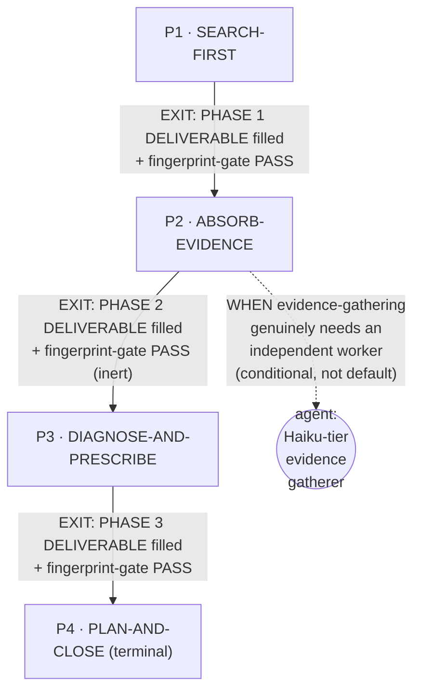
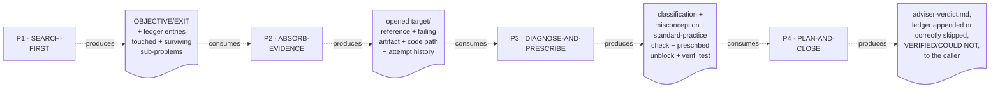

# Adviser — Quasi-Software View (five layers: NODES, PHASES, INTERNAL, PARALLELIZATION, EXPECTED OUTPUTS)

This is `grimorio.adviser`'s own DRAWN quasi-software design view, produced per
ref:skill/grimorio.phase-splitting#the-agent-design-plans-drawn-view--a-hard-requirement-never-optional's
standing requirement that every agent-design plan carry one, saved alongside the agent's own design as a
reference file. It mirrors
ref:skill/grimorio.security-memory/security-phases/security-quasi-software-view.md's own already-shipped
five-layer shape — read in full as this file's own structural exemplar, never as its content — adapted to a
FOUR-phase, sequential-but-not-hard-locked chain instead of a six-phase, fully-sequential, hard-locked
non-recursive one. This file draws all layers directly from
ref:skill/grimorio.working-memory/adviser-behavior.md and its four
ref:skill/grimorio.working-memory/adviser-phases/phase-1-search-first.md through
ref:skill/grimorio.working-memory/adviser-phases/phase-4-plan-and-close.md, all read in full this pass, in the
same authoring dispatch that wrote them; it changes none of their content.

## Layer 1 + 2 — NODES (the orchestration graph) and PHASES (the state machine)

**Reading this diagram.** The solid rectangular spine (P1→P2→P3→P4) is the STATE MACHINE — the four phase
files' own chain, per
ref:skill/grimorio.phase-splitting#the-model--a-phase-is-a-mini-loop-state-with-three-fields. This chain carries
NO LOOP-BACK edge anywhere: nothing in any of these four phase files re-enters an earlier phase of THIS
invocation; each phase's own Hard hand-off moves strictly forward, once, per invocation — a fully linear STATE
MACHINE spine is a legitimate shape here, not an unfinished one, exactly as
ref:skill/grimorio.security-memory/security-phases/security-quasi-software-view.md's own exemplar already states
for its own six-phase chain. A `FAIL`-shaped verdict here (a COULD NOT close) routes EXTERNALLY, to whoever the
Part 2 plan names as the decision-owner, never an internal loop-back to an earlier phase.

**One agent-node, drawn distinct from every phase-node, distinct from the exemplar's own zero-agent-node
graph.** `grimorio.adviser`'s own shell carries NO `disallowedTools: Agent` line, confirmed live — unlike
`grimorio.security`, this agent is NOT hard-locked non-recursive. The dotted circular node above, reached only
from P2 via a dashed conditional edge, is the ONE spawn this whole chain can ever raise: a single bounded,
Haiku-tiered evidence-gathering child, per
ref:skill/grimorio.working-memory/adviser-phases/phase-2-absorb-evidence.md's own step 3. It is drawn dashed and
explicitly labelled "conditional, not default" — never identical to a solid, always-fires spawn edge — per
ref:skill/grimorio.phase-splitting/project.quasi-view-requirements.md's own instruction that a future/optional
agent-node must never be drawn identically to an actually-wired, unconditional one. This node is real and
wired (the phase file's own step 3 actually raises it when it fires), not a "future, unwired" placeholder — the
dashed style here marks CONDITIONALITY of firing, not absence of wiring.

## Layer 3 — INTERNAL: per-phase artifact-flow (IN → OUT), half (a) only

**Grounding — shared across every quasi-view that draws this layer, not re-derived here:**
ref:skill/grimorio.phase-splitting/project.quasi-view-requirements.md#half-a--boundary-artifact-flow-unchanged.
Per this agent's own scope (mirroring
ref:skill/grimorio.security-memory/security-phases/security-quasi-software-view.md's own identical scope), only
half (a) (boundary artifact-flow) is drawn for this chain — half (b) (per-phase interior flowcharts + a
KNOWN-ERRORS-TO-PHASE mapping) is optional per that same file and out of scope for this pass.

**One artifact node per phase BOUNDARY, never two.** A four-phase chain has three internal boundaries
(P1↔P2, P2↔P3, P3↔P4) plus the terminal phase's own output reaching the caller — four artifact nodes total,
never one IN/OUT pair per phase individually, for the identical reason every already-shipped quasi-view in this
corpus already states: each phase's own Hard hand-off text already names Phase N's OUT as the exact content
Phase N+1 consumes as its IN.

The dotted edges here are the SAME visual convention as the EXIT edges in Layer 1+2 (both solid-and-labeled in
that diagram) but carry a DIFFERENT meaning — "consumes"/"produces" (data moving), never "EXIT" (control
moving) — the identical DFD process-vs-flow separation every already-shipped quasi-view in this corpus already
applies, now applied to this chain.

## Layer 4 — PARALLELIZATION: sequential end to end, EXCEPT the one optional bounded spawn inside Phase 2

**This chain is sequential end to end at the STATE-MACHINE level — P1 → P2 → P3 → P4, one phase at a time, no
fan-out anywhere in the spine.** This is the ONE place this chain differs structurally from
ref:skill/grimorio.security-memory/security-phases/security-quasi-software-view.md's own exemplar, which draws
PARALLELIZATION as "none, structurally" because `disallowedTools: Agent` makes every one of its phases a single
SELF node by construction. `grimorio.adviser` is NOT hard-locked, so its own Layer 4 cannot claim the same
absolute "none" — the honest statement is: the FOUR-PHASE SPINE is sequential by design (each phase's own
DELIVERABLE is a real, consumed precondition for the next, per Layer 3 above), and the ONE point of concurrency
this chain can ever exhibit is the single bounded child ref:skill/grimorio.working-memory/adviser-phases/phase-2-absorb-evidence.md's
own step 3 MAY raise — which runs alongside nothing else in this chain (this agent still waits on it in the
foreground before Phase 2's own hand-off, per grimorio-conduct rule 9c's own foreground-spawn discipline, never
backgrounded), so even that ONE spawn produces no genuine PARALLEL execution inside this agent's own single
invocation — it is a SEQUENTIAL sub-step of Phase 2, not a fan-out. Stated plainly: this chain has no fan-out
anywhere, at any phase, ever; it merely is not STRUCTURALLY incapable of one the way the hard-locked exemplar
is, and that distinction is worth drawing rather than silently inheriting the exemplar's own stronger claim.

## Layer 5 — EXPECTED OUTPUTS: WORK vs ORCHESTRATION, per phase

**The distinction this layer draws, kept separate from Layer 3 above: Layer 3 shows the DATA that crosses a
phase boundary — what the next phase literally reads. This layer shows the RESULT that phase's own WORK exists
to produce.**

| Phase | WORK PRODUCT (what the phase's own action produces) | ORCHESTRATION ACT (what it then routes, and to whom) |
|---|---|---|
| P1 · SEARCH-FIRST | OBJECTIVE/EXIT CONDITION stated; OPEN ledger entries touched; the presented tangle decomposed, every dissolved sub-problem named, only survivors carried forward — a gathering-and-refuting pass, no external artifact opened yet | Hands to P2 |
| P2 · ABSORB-EVIDENCE | The grounded evidence set: the real target/reference, the actual failing artifact, the code path, the attempt history — opened directly, plus WHEN fired, a bounded Haiku child's own returned evidence | Hands to P3 |
| P3 · DIAGNOSE-AND-PRESCRIBE | `adviser-verdict.md`'s own Part 1 verbatim: failure-mode classification with evidence, the named misconception, the standard-practice/prior-art check, the ONE prescribed unblock + verification test | Hands to P4 |
| P4 · PLAN-AND-CLOSE | The actual reasoning-to-execution work of this whole chain: Part 2's ordered, agent-routed executable plan, the ledger append or its live-checked skip, the nine-item self-check, `adviser-verdict.md` written to `tmp/`, VERIFIED/COULD NOT set | Terminal — reports to the caller; no further phase to hand off to |

## Evidence of phase-design reasoning — RENDER/GROUP/MEASURE

Per
ref:skill/grimorio.phase-splitting/project.quasi-view-requirements.md#evidence-of-phase-design-reasoning--save-the-rendergroupmeasure-working-product-never-discard-it-silently,
this section restates, as a durable saved artifact rather than a claim taken on faith, the sizing reasoning
applied while deciding this chain's own shape — grounded in `grimorio.adviser`'s own REAL pre-split content,
never invented or copied from `grimorio.security`'s own.

**RENDER — the complete load, before any grouping.** The pre-split `adviser-behavior.md` (flat: 4 Core rules —
CEO-chewed-out/DELTA framing, ground-in-evidence-and-prior-art, prescribe-ONE, advise-only-never-build — 10
numbered Steps across the agent's own already-stated 4-stage prose graph PLAN[steps 2-4]/DIAGNOSE[steps
5-7]/PRESCRIBE[step 8]/DONE[steps 9-10], one bolted-on 9-item self-check gate, the `## OUTPUT` template with its
full worked nightly-digest example, and a trailing 2-bullet "## Rules" section) plus the shell's own 6-entry
flat Knowledge list (`grimorio.agent-selection`, `grimorio.reasoning-principles`, `grimorio.fan-out` Part 2,
`grimorio.flow-delegation`, `grimorio.agent-tiers`, `grimorio.working-memory`) — every skill loaded on EVERY
invocation regardless of which of the four real functional stages (search, absorb, diagnose-and-prescribe,
plan-and-close) actually needed it.

**GROUP — four non-overlapping clusters, each a real distinct question/deliverable/knowledge slice, plus the
four standing purpose-driven dimensions threaded through rather than split out as phases of their own.**
(1) SEARCH-FIRST: the ledger read (Step 2) + the decompose-vs-bases discipline (Step 3) + the trailing Rules'
first bullet (framing-is-not-fact), folded in rather than left as a stray duplicate section — a genuine
internal-memory-only cluster, zero external artifacts opened. (2) ABSORB-EVIDENCE: the evidence-absorption step
alone (Step 4) + the shell's own conditional evidence-gathering-child sentence, moved here from the flat file's
own header blockquote where it sat orphaned above the numbered Steps, never actually wired to any specific
step — now landed inside the ONE step it actually governs. (3) DIAGNOSE-AND-PRESCRIBE: classification (Step 5) +
misconception (Step 6) + standard-practice check (Step 7) + prescription (Step 8) — verbatim the `## OUTPUT`
contract's own already-named "Part 1" grouping, plus Core rules 2 and 3 (ground-in-evidence, prescribe-ONE),
restated here since they govern exactly this phase's own work rather than sitting in a Core-rules block nobody
re-reads once the chain begins. (4) PLAN-AND-CLOSE: Part 2 of the OUTPUT contract (Step 9) + the ledger append
(Step 10, now conditional — see Phase 4's own live suspension check) + the 9-item self-check gate + the
VERIFIED/COULD NOT close — grouped into ONE phase per
ref:skill/grimorio.phase-splitting#orchestrator-vs-purpose-driven--the-judgment-tests-own-missing-half's own rule
(d), "output contract, checks, format are NOT one phase each."

**Threaded, not split out as phases of their own:** (a) GRIMORIO MEMBERSHIP/BASES — named once in Phase 0 as a
standing precondition, per the exemplar's own pattern. (b) LOOP+RELATIONSHIPS — parent (Phase 0's own
"invocation posture" section) / self (the self-check gate, now Phase 4's own) / children (the ONE bounded,
conditional spawn, confined to Phase 2 alone, explicitly named in Phase 0 as differing from the hard-locked
exemplar). (c) KNOWN ERRORS — Phase 1's ledger read IS this dimension. (d) BASE REQUIREMENTS AS ONE MISSION —
Phase 4's own single-phase grouping above.

**MEASURE — a rendered count per group, not only the flagged one.** Group 1/SEARCH-FIRST: 2 project-fact
knowledge slices (the defect ledger, the BASES — po-memory/features-status/architecture memories) across 3
steps (graph statement, ledger read, decomposition). Group 2/ABSORB-EVIDENCE: 1 mandatory knowledge slice
(none — pure tool use) plus 1 CONDITIONAL slice (flow-delegation's flow-brief template + agent-tiers' scale, both
loaded only when the child actually fires) across 3 steps (graph statement, absorb, conditional spawn). Group
3/DIAGNOSE-AND-PRESCRIBE: 1 knowledge slice (reasoning-principles' decompose/refute discipline, restated fresh
from Phase 1's different use of the same skill) across 5 steps (graph statement, classify, misconception,
prior-art, prescribe). Group 4/PLAN-AND-CLOSE: 4 knowledge slices (agent-selection's routing table,
flow-delegation's raise mechanics, agent-tiers' scale, reasoning-principles' close discipline restated a third
time) across 4 steps (graph statement, write plan, ledger append (now conditional), self-check) plus the
9-item gate and the
`## OUTPUT` contract. Every group other than Group 4 stays at ONE-TO-TWO cleanly-scoped slices per phase; Group
4 carries the most (4 slices) because it is the ONE phase this chain's own pre-supplied verdict already
identified as "the crispest knowledge boundary in the whole chain" — agent-routing knowledge used nowhere else —
never a pincho, since every one of its four slices answers the SAME single question ("how does this diagnosis
become a routed, executable, closed order") rather than fusing unrelated missions.

**Against the pincho check.** No rendered group here approaches the measured incident's own scale (one phase
carrying ~28 requirements, or a 13-item self-check gate large enough to be its own mission) — the largest single
item, Phase 4's own 9-item self-check gate, is the SAME 9 items the pre-split file already carried as one bolted
section, now placed inside the phase that actually earns it (the close) rather than left disconnected from the
work it checks. **SPLIT was not needed anywhere in this chain** — every one of the four groups above answers one
distinct question against one coherent knowledge slice; the one candidate that looked heaviest on paper (Group
4, four knowledge slices) resolved to "one cognitive mission, several named skills" rather than "several fused
missions," per the RENDER/GROUP reasoning above. **CHILDREN-OFFLOAD was available and used exactly once, exactly
where the pre-supplied verdict and the agent's own pre-existing shell sentence already pointed** — Group 2's own
evidence-gathering may be handed to a bounded Haiku child, per
ref:skill/grimorio.phase-splitting#sizing-a-phase--render-group-measure-split-the-pincho-check's own
CHILDREN-OFFLOAD subsection, never defaulted to, decided fresh each invocation by whether Phase 2's own evidence-
gathering genuinely needs an independent worker.

**Coverage — every rendered item lands in exactly one group; none dropped.** The pre-split file's own trailing
"## Rules" section split across two destinations rather than staying a stray appendix: its first bullet
("NEVER treat the framing you were handed as fact") folded into Group 1's own decomposition step, since it
duplicates that step's own content word-for-word; its second bullet ("ALWAYS earn the Fable tier") moved to
Phase 0, as a STANDING tier-justification governing the whole chain rather than a close-specific concern, per
this same authoring pass's own explicit judgment call, recorded here rather than left implicit. The shell's own
Knowledge-list entry for `grimorio.fan-out` Part 2 ("Stay reachable" — delegate ids, per-delegate workspace,
notes-folder protocol) is not re-cited as a separate load in Group 2: `grimorio.flow-delegation`'s own SKILL.md
frontmatter already states it "Composes fan-out's Part 2 (notes folder + watcher plumbing)," so loading
flow-delegation, as Group 2 already does, already carries fan-out Part 2's own mechanics forward — a
consolidation, not a silent drop, named here explicitly rather than left for a reader to wonder why the citation
disappeared.
