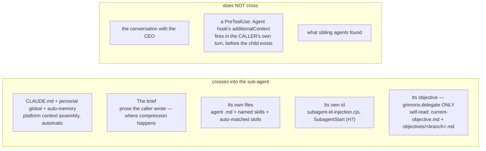

# Grimorio — how information actually travels

This is **chain documentation**, not a capability index: it describes the machinery's shape, which changes far
more slowly than the code it governs. It is kept rewritten to CURRENT truth — git history holds what changed and
why; this file states what is true today, not a layered record of its own corrections.

**NEVER read this file as a hook's own home for WHY it exists.** This file is the GLOBAL, cross-cutting INDEX of
the event/information flow — WHAT is wired, on which event, in what order. The PER-HOOK WHY documentation — CEO
rulings, measured incidents, retired designs — lives ONLY in `grimorio.hooks`'s five companion files, per the
placement test already ruled and registered there (board register entry `docs-out-of-hooks`):
`ref:skill/grimorio.hooks/SKILL.md`. **WHEN this file's own §3 prose drifts into restating a companion file's WHY
content instead of pointing at it ⟶ that is duplication owed a trim, never a second home to keep current.**

---

## 1. The context boundary — the thing that is most often gotten wrong

**`CLAUDE.md` reaches EVERY agent — the main loop and every spawned sub-agent alike, automatically, from birth.**
The project `CLAUDE.md`, the CEO's personal global `~/.claude/CLAUDE.md`, and the user's auto-memory `MEMORY.md`
all arrive via the platform's own context assembly (the `claudeMd` system-reminder) — not a repo hook; grep
`.claude/settings.json` and there is no such hook.

```mermaid
flowchart TB
    CEO([CEO])

    subgraph MAIN["MAIN LOOP"]
        direction TB
        CM1["CLAUDE.md + personal global<br/>+ auto-memory (platform-assembled)"]
        LOOP["the chat agent<br/><b>routes, decides, commits</b>"]
        CM1 --> LOOP
    end

    subgraph SUB["SUB-AGENT — a fresh context"]
        direction TB
        CM2["CLAUDE.md + personal global<br/>+ auto-memory (same platform assembly)"]
        SYS["its own agent .md<br/>(contract + Knowledge list)"]
        SK["the skills it names"]
        BRIEF["the brief its caller wrote"]
        ID["its own id (H7, SubagentStart)"]
    end

    CEO -->|"speaks"| LOOP
    LOOP ==>|"Agent tool"| SUB
    SUB -.->|"final text only"| LOOP
    LOOP -->|"reports"| CEO

    style CM1 fill:#2a3a2a,stroke:#5a5
    style CM2 fill:#2a3a2a,stroke:#5a5
```

**OPEN, unmeasured:** whether a rule meant for the ROUTER (the main loop, which decides) landing unread-but-
present in a DOER's context (a sub-agent, which builds/tests/reviews) is harmless noise or a real cost. Two
incidents are on record and do not settle it either way — flagged for the CEO to weigh, not re-argued here:

- The capabilities-ledger read-first rule lived only in `CLAUDE.md` while four capabilities were built and never
  wired, three re-discovered later in one session. The incident is real; the CAUSE remains undiagnosed — it was
  never that the rule was absent from the architects' context, since it wasn't.
- The test-planning method lived in `grimorio.po-memory/project.features-status.md`; `grimorio.qa` loaded `qa-memory`, not
  `po-memory`, so it never saw it. Fixed by naming the ledger in `qa-memory` directly — a skill-naming fix,
  unrelated to whether `CLAUDE.md` itself reaches an agent.

---

## 2. What crosses the boundary, beyond `CLAUDE.md`

**Box G is why `agent-routing-reminder.cjs` was deleted** (§3): a `PreToolUse: Agent` hook fires in the CALLER's
own turn, before the spawned child's context exists, so its `additionalContext` can only ever inform the
caller's NEXT decision — never the child it was about to spawn. A freshly spawned child's own context carries
its own id (H7, which DOES fire inside the child's own context assembly) and `CLAUDE.md` (§1); it never carries
a spawn check or the principal's own objective.

**The branch-objective gap (row E) is real and open for everyone but `grimorio.delegate`.** `grimorio.delegate`
self-reads `.claude/current-objective.md` and `objectives/<its-branch>.md` off its own disk at task start
(`grimorio.flow-delegation/delegate-behavior.md`) — a file already tracked in its worktree, nothing a hook needs
to hand it. No other spawnable agent type has an equivalent self-read instruction; for everything spawned as
something other than `grimorio.delegate`, nothing currently delivers the branch's objective at all.

---

## 3. The mechanisms — what is wired, and what each one does

Everything else in grimorio is prose. These are machinery.

**Five hooks wired in `.claude/settings.json` deny anything, and nothing else here does:**
`spawn-grimorio-conduct-gate.cjs` (H9) and `spawn-verbatim-origin-gate.cjs` (H11), both `PreToolUse: Agent`,
gating a SPAWN; `keeper-worktree-guard.cjs` (H12), gating an `Edit`/`Write`/`MultiEdit` or a state-changing Bash
git command; `board-reconcile.cjs` (H17), gating `PreToolUse: Bash` and `Stop` (both main-loop only) plus a
non-denying `SubagentStop` recording half; `subagentstop-wait.cjs` (H15), gating `SubagentStop`. Every other
wired hook only injects context, appends a line, or asks a question after the fact — **NEVER cite one of those
as the thing that enforces a rule.** Refusal otherwise survives only on the git side (G1/G2 below), which gates
a COMMIT, never a tool call. Full account of what each denying hook verifies and why:
ref:skill/grimorio.hooks/spawn-gates.md (H9, H11), ref:skill/grimorio.hooks/worktree-and-occupancy.md
(H12), ref:skill/grimorio.hooks/board-and-wait.md (H17, H15).

**NEVER add a hook here without his approval** — hooks are the LAST option, needing his own explicit approval
with a strong technical justification; read ref:repo/.claude/hooks/harness.md before touching this directory at
all.

**THE ENVELOPE — read this before writing any hook, it is the thing that makes a capability look absent.**
Almost every hook output field must be nested inside `hookSpecificOutput`, with `hookEventName` set to the
firing event's name. Returned at the TOP LEVEL it parses fine, exits `0`, and is **silently ignored — no error
anywhere**. Exception: `decision`, `reason`, `systemMessage`, `continue`, `stopReason` stay OUTSIDE the
envelope, at the top level, always. -> full 30-event table: `claude-code-guide` skill → `references/hooks.md`.

```mermaid
flowchart TB
    subgraph HOOKS["hooks — settings.json — none of these refuse (the ones that do are below)"]
        H1["<b>harness-lookup.cjs</b><br/>PreToolUse: Edit / Write / MultiEdit<br/>injects the ascending harness.md<br/><i>dedups per session</i>"]
        H2["<b>log-agent-invocation.cjs</b><br/><b>PreToolUse: Agent + PostToolUse: Agent</b><br/>appends a DISPATCH row (pre) then a RESOLUTION<br/>row (post) per spawn — fields 14-17<br/>record the CALLER's own id, a join key, the<br/>CHILD's new id, and dispatch status"]
        H3["<b>prompt-check.cjs</b><br/>PostToolUse: Edit / Write / MultiEdit<br/>+ PostToolUse: Agent<br/>asserts a NEGATIVE — 'you probably broke<br/>the standard, go and look'<br/><i>parses nothing, judges nothing</i>"]
        H5["<b>mark-skill-loaded.cjs</b><br/>PostToolUse: Skill<br/>TRACKED marker (unread) + always-on<br/>debug log (every skill) — see below"]
        H7["<b>subagent-id-injection.cjs</b><br/>SubagentStart: *<br/>hands the CHILD its own agent_id"]
        H8["<b>worktree-create-from-develop.cjs</b><br/>WorktreeCreate<br/>REPLACES git — creates from develop's tip<br/><i>never exits non-zero</i>"]
        H10["<b>log-agent-completion.cjs</b><br/><b>SubagentStop: *</b><br/>appends the CHILD's own id/type + last message<br/>on completion — RECORDS only, cannot wake anyone"]
        H16["<b>session-start-identity.cjs</b><br/>SessionStart<br/>hands the TOP-LEVEL SESSION its own identity —<br/>symmetric to H7<br/><i>never blocks, additionalContext only</i>"]
    end
    subgraph HOOKGATE["hooks — settings.json — hooks that refuse a TOOL CALL, the main loop's own turn, or a subagent's own turn directly (five: two PreToolUse: Agent, one PreToolUse: Edit/Write/MultiEdit + Bash, one PreToolUse: Bash + Stop, one SubagentStop)"]
        H9["<b>spawn-grimorio-conduct-gate.cjs</b><br/><b>PreToolUse: Agent</b><br/>SCOPED to grimorio./project.-prefixed spawn<br/>targets only; DENIES the scoped spawn<br/>outright when the prompt carries no compelling<br/>grimorio-conduct instruction<br/><i>verified live: DENY bare, ALLOW compelled,<br/>ALLOW foreign/built-in type unconditionally</i>"]
        H11["<b>spawn-verbatim-origin-gate.cjs</b><br/><b>PreToolUse: Agent</b><br/>TIER ONE: exempts a non-grimorio./<br/>project.-prefixed spawn target entirely, own<br/>justification (never inherited from H9's). Beyond that,<br/>MAIN-LOOP-ONLY: DENIES a main-loop spawn whose<br/>prompt carries no verbatim-originating-words section,<br/>no user:/agent: pair ANCHORED to the quote (ELEMENT<br/>1b — FINDING-01, closed a disconnected-label bypass), no<br/>coverage/viability-check instruction (ELEMENT 2), OR no<br/>independent LOG-based proof a grimorio.extract-cleaner<br/>dispatch ran this session AND has not since been<br/>consumed by a later main-loop spawn (ELEMENT 3, checks<br/>ORDER not a wall clock) — names which;<br/>subagent's own spawn exempt. ALLOW path now emits an<br/>additionalContext reminder (rule 13 pt.4 Haiku-clean +<br/>rule 14 coverage check + ELEMENT 3 confirmation)<br/><i>verified live via its own selftest,<br/>scripts/selftest/spawn-verbatim-origin-gate.mjs</i>"]
        H12["<b>keeper-worktree-guard.cjs</b><br/><b>FOUR responsibilities in ONE file</b><br/>PreToolUse: Edit/Write/MultiEdit — DENIES an edit<br/>landing in the main tree from a worktree session<br/>(ORIGINAL job, unchanged)<br/>PreToolUse: Bash — DENIES a subagent's own state-<br/>changing git command when another agent is registered<br/>live in the same tree; the MAIN LOOP gets a<br/>non-blocking reminder instead, never a block<br/>PostToolUse: Agent + SubagentStop — write/clear the<br/>tree-occupancy registry the Bash check reads<br/>(never deny anything themselves)<br/><i>see grimorio.code-harness's own Tree ownership /<br/>Tree occupancy awareness sections for the rules<br/>these two deny paths enforce</i>"]
        H17["<b>board-reconcile.cjs</b><br/><b>PreToolUse: Bash + Stop + SubagentStop</b><br/>(GRAPH-based, never command-string-based)<br/>THREE bindings, TWO questions: `PreToolUse: Bash`<br/>(UNCONDITIONAL, every main-loop Bash call) and `Stop`<br/>(the BACKSTOP, turn end regardless of the last<br/>action) both run the SAME shared gate — the STILL-<br/>unclaimed PRIOR commits already sitting in this<br/>turn's own range — and DENY/BLOCK naming exactly those<br/>shas when any exist (silent otherwise); the watermark<br/>advances ONLY in the clean case, never past a still-<br/>unclaimed sha. BOTH triggers DEFER entirely WHEN a<br/>first-level initiator THIS session dispatched is<br/>still LIVE (backgrounded, no completion row) —<br/>reconciling early would misattribute its own not-yet-<br/>claimed work; `PreToolUse: Bash` is the MORE exposed<br/>of the two (every Bash call, not once per turn). On<br/>`SubagentStop`, ONLY a FIRST-LEVEL initiator<br/>(dispatched DIRECTLY by the main loop, per its own<br/>dispatch row's caller fields) registers its WHOLE<br/>UNIT once, at its own close; a NESTED/grandchild<br/>spawn claims NOTHING — NEVER blocks on this half<br/><i>per-session cap + repo-wide kill switch + fail-open,<br/>SHARED across both main-loop triggers AND keyed to<br/>DISTINCT unclaimed-set states (never raw firing<br/>count), ported from subagentstop-wait.cjs's own<br/>pattern; see this file's own H17 prose below for the<br/>claim-ledger schema and the child-attribution<br/>ambiguity it names</i>"]
        H15["<b>subagentstop-wait.cjs</b><br/><b>SubagentStop: *</b><br/>WAITS up to 120s on ONE live async_launched<br/>dependency the firing agent itself dispatched, then<br/>DENIES the close either way — immediately if it<br/>finishes during the wait, preventively if the wait<br/>expires still live; silent only when no live<br/>dependency is found<br/><i>per-agent cap (default 3) + repo-wide kill switch<br/>(default 20, fail-open past it) + main-session<br/>immunity; exemplar for H17's own cap/kill-switch<br/>design</i>"]
    end
    subgraph GATE["git — scripts/pre-commit.sh — the only OTHER place anything still REFUSES"]
        G1["<b>objectives/ gate</b><br/>refuses a commit with no branch<br/>objective, or out of declared scope"]
        G1B["<b>check-comment-blocks.mjs</b><br/>refuses a staged comment block<br/>over 4 lines — @keep-comment exits"]
        G1C["<b>check-agent-tiers.mjs</b><br/>refuses ANY commit while an agent declares<br/>opus/fable with disallowedTools: Agent,<br/>or declares no model at all<br/><i>reads .claude/agents/, not the diff</i>"]
        G1D["<b>check-work-product-placement.mjs</b><br/>refuses a staged work product landing<br/>outside tmp/ — a root-level pipeline-artifact<br/>name/CLOSEOUT- prefix, or a broken skill<br/>folder naming/subfolder convention<br/><i>names the file AND where it belongs, never a<br/>bare refusal (grimorio-conduct rule 17b)</i>"]
    end
    subgraph GATE2["git — .grimorio/skills/grimorio.objective-harness/scripts/close-branch.sh, a DIFFERENT trigger (branch CLOSE, not every commit)"]
        G2["<b>the numbered close gates</b><br/>refuse to CLOSE a branch — objective/base/clean-tree/<br/>open-checks/VERIFY/feature-line/board-items-reviewed(10b)/etc.<br/><i>its own final commit runs `git commit --no-verify`,<br/>so G1 does not fire there — this gate already covers it</i>"]
    end
    ED["editing a file"] --> H1
    ED -.-> H3
    ED --> H12
    SP["spawning an agent"] --> H2
    SP -.-> H3
    SP --> H9
    SP --> H11
    SP -.->|"once live in the background"| H12
    BORN["a subagent's context is assembled — child side"] --> H7
    SESS["a session starts — main-loop side"] --> H16
    WT["creating a worktree — isolation:'worktree'"] --> H8
    LS["loading a skill"] --> H5
    H5 -.->|"marker nobody reads"| DEAD["no consumer<br/>(both gates deleted)"]
    RET["an agent's own turn stops — child side"] --> H10
    RET --> H12
    RET --> H17
    RET --> H15
    MAINBASH["the main loop runs a Bash command"] --> H17
    TURNSTOP["the main loop's own turn stops"] --> H17
    GITCMD["running a state-changing git command"] --> H12
    CMT["an ordinary commit"] --> G1
    CLOSE["closing a branch"] --> G2

    style DEAD fill:#3a2a2a,stroke:#a55,stroke-dasharray: 5 5
    style H9 fill:#2a3a2a,stroke:#5a5
    style H10 fill:#2a3a2a,stroke:#5a5
    style H11 fill:#2a3a2a,stroke:#5a5
    style H12 fill:#2a3a2a,stroke:#5a5
    style H17 fill:#2a3a2a,stroke:#5a5
    style H15 fill:#2a3a2a,stroke:#5a5
    style G1 fill:#2a3a2a,stroke:#5a5
    style G1B fill:#2a3a2a,stroke:#5a5
    style G1C fill:#2a3a2a,stroke:#5a5
    style G1D fill:#2a3a2a,stroke:#5a5
    style G2 fill:#2a3a2a,stroke:#5a5
```

`board-reconcile.cjs` (H17) replaces the retired `board-write-check.cjs` and reconciles a turn's own commits
against the board. Full account: ref:skill/grimorio.hooks/board-and-wait.md.

`subagentstop-wait.cjs` (H15) is a second `SubagentStop`-based denying hook, alongside H17's own `SubagentStop`
half. Full account: ref:skill/grimorio.hooks/board-and-wait.md.

`spawn-grimorio-conduct-gate.cjs` (H9) scopes its own denial to `grimorio.`/`project.`-prefixed spawn targets
only. Full account: ref:skill/grimorio.hooks/spawn-gates.md.

`spawn-verbatim-origin-gate.cjs` (H11) is a second, main-loop-only spawn-gating hook alongside H9. Full account:
ref:skill/grimorio.hooks/spawn-gates.md.

**This map answers "what event is it wired to?" — it deliberately does NOT answer "does it have an EFFECT right
now?"** The two are different constructs: a hook can fire on every single turn and emit nothing.
`harness-lookup.cjs` dedups per session, so it emits nothing on the second edit of a session however large its
first injection was. A CONDITION column here would be prose drifting from the hook it describes, so the answer
is a tool that RUNS each hook, never a table: ref:repo/scripts/hook-conditions.mjs, indexed in
ref:skill/grimorio.agent-writing/audit-toolchain.md. **ALWAYS run it rather than trusting any count
written here.** It also answers what this map cannot ask at all — for a named SCENARIO, which hooks does it
meet, in what order, and how many had an EFFECT — and that is where the real gap sits: an ordinary main-loop
edit to an ordinary file, second of the session, meets `harness-lookup.cjs` and it is silent, correctly and by
design, so the scenario is ungated end to end and no per-hook row can show it. Its population is the hooks
`.claude/settings.json` wires; the git-side links of the same chain (`G1`, `G2`) sit outside it, declared rather
than implied.

`log-agent-invocation.cjs` (H2) fires on both `PreToolUse: Agent` and `PostToolUse: Agent`, recording a dispatch
row and a resolution row per spawn. Full account: ref:skill/grimorio.hooks/logging-and-identity.md.

`session-start-identity.cjs` (H16) is the `SessionStart` mirror of H7, handing the top-level session its own
identity. Full account: ref:skill/grimorio.hooks/logging-and-identity.md.

`mark-skill-loaded.cjs` (H5) runs on every `Skill` call, keeping an always-on debug log plus an inert
TRACKED-marker half. Full account: ref:skill/grimorio.hooks/misc.md.

`worktree-create-from-develop.cjs` (H8) replaces git's own worktree creation, forking every isolated worktree
from `develop`'s tip. Full account: ref:skill/grimorio.hooks/worktree-and-occupancy.md.

G2's own board-items-reviewed gate (10b) asks whether a spawned first-level initiator's own close finished an
OPEN board item, routed through a fresh-context judge, never self-assessed. Full account:
ref:repo/.grimorio/skills/grimorio.objective-harness/SKILL.md's own Hard invariants #14.

### What the deletions COST — three closures that reverted to open

The hooks were deleted because they enforced what agent rules already forced. That reasoning holds for the
enforcement; it does not make the gaps they covered disappear. **NEVER read a "FIXED" or "CLOSED" verdict in
§7's loss map as current if its mechanism was one of these.** See §7 rows 6, 6b, 9 for two of what these
deletions reopened; the governance-file-restriction / three-independent-copy-sync loss those rows do not cover
survives at `ref:skill/grimorio.agent-writing/audit-toolchain.md` entry 2 (already pointed to from
§3c) — together, never either alone, the current-truth sources for what these deletions reopened, never
restated here a second time.

**One design lesson outlived its hook and is kept here because it is about markers, not about that hook.** A
session-keyed marker file cannot prove a skill is still IN CONTEXT. The real decay is neither wall-clock nor
spawn count — it is context COMPACTION, which can summarise a loaded skill's text out of context while the
marker, which knows nothing about what survived, still says "loaded". **WHEN you are tempted to gate anything
on "was skill X loaded" ⟶ remember the marker answers a different question than the one you are asking.**

**Asymmetry — PARTIALLY closed on recording, and PARTIALLY closed on detection; ARMING stays open.** The way
IN, on the CHILD's own side, was already instrumented — `subagent-id-injection.cjs` hands it its own id, closing
the gap where no agent could see its own id and `SendMessage(to:"main")` silently misrouted a nested child's
report to the top level. The way BACK is §7's own row 4 — RECORD and JOIN now exist there, ARMING stays open —
not restated here a second time. Each level must still hand its own id DOWN in the brief when it spawns
further; the logs supplement that, they do not replace it.

### 3a. Available and unused — what the corrected hook reference surfaced

`claude-code-guide/references/hooks.md` documents all 30 hook events; these are the real, usable ones this repo
does not wire, each with what it could do HERE:

- **`PostToolBatch`** — fires after a parallel tool batch resolves, can block the whole batch. Unused; no
  current gate here is batch-shaped rather than per-call.
- **`PermissionRequest`** — fires when a call needs a permission decision; can allow/deny/rewrite the input.
  Unused; permissions here are handled by `settings.json` allow/deny lists, not a hook.
- **`InstructionsLoaded`** — fires when a CLAUDE.md / rules file loads; observation only, no return value used
  by the platform. Unused; would let something log exactly WHEN `CLAUDE.md` reaches the main loop.

`SubagentStop` moved out of this list — it is wired now (§3b).

### 3b. `SubagentStop` — wired for RECORDING only; the BLOCKING ruling still stands

**`log-agent-completion.cjs` (H10) only appends one line per `SubagentStop` firing to
`.claude/.cache/agent-completions.log` — it never blocks, injects context, or invokes `SendMessage`, so the
ruling that blocking a child equals sending it more work (which `SendMessage` already covers) stays correct and
unchanged; this hook exists for a narrower reason — giving the top-level session's own ARMED watch (rule 8,
"Asymmetry" above) something to read — full account, every CEO quote, and what remains undiagnosed:
`ref:skill/grimorio.hooks/logging-and-identity.md`.**

### 3c. The audit toolchain — G1/G2/G2B above are two gates out of ~38, indexed elsewhere on purpose

`scripts/` and `scripts/selftest/` hold the rest of grimorio's audit/verification machinery — corpus-integrity
checks, spawn/plan-discipline measurement, branch-methodology self-tests, the reference-obligation toolchain.
The tool-by-tool inventory (what each one ANSWERS, and WHEN to run it) is a CODE file, not chain documentation:
`ref:skill/grimorio.agent-writing/audit-toolchain.md` — `grimorio.system-keeper` loads it and runs the
toolchain BEFORE forming any judgment about the system, per its own behavior file's Core Rule 4. **WHY this
toolchain exists in the shape it does — a script computing what a script can, an agent judging only the
residue — is a general doctrine, not this section's own to restate:**
`ref:skill/grimorio.agent-writing/symbiosis-doctrine.md`.

### 3d. Environment dependencies — what grimorio requires from Claude Code itself

Grimorio's delegates and nested fan-outs spawn sub-agents deeper than Claude Code's documented default max
subagent spawn depth allows. **DOCUMENTED:** `CLAUDE_CODE_MAX_SUBAGENT_SPAWN_DEPTH` exists and controls it (set
via the `env` option or `.claude/settings.json`); the platform default is `3` layers below the main
conversation. This repo's own `.claude/settings.json` now declares it as `5` in its `env` block
(ref:repo/.claude/settings.json) so grimorio's nested delegates/fan-outs are not refused by the undocumented
default a fresh clone would otherwise silently fall back to — this repo's own declaration is what closes a gap
that existed only on the CEO's personal machine (`~/.claude/settings.json`), silently, with nothing announcing
it. **NOT MEASURED:** that a depth-5 spawn actually succeeds — nobody has run one and watched it spawn; the
full finding and its sourcing lives in
LOST: documentation-memory/docs/53-claude-code-subagent-execution-notification-semantics-referencia.md (deleted 2026-10-04, recoverable at f942b355),
not re-derived here — this file is chain STRUCTURE, that doc carries the sourcing. The CEO's own framing,
translated: *"when we export grimorio, it has to be accounted for that it requires changes to Claude Code's
variables."*

**Known-unavailable on this machine, NOT a task to fix:** `CLAUDE_CODE_MESSAGING_SOCKET` is absent, and
`CLAUDE_CODE_ENABLE_TASKS=0`. The socket, if present, would let a `SubagentStop` hook wake a parked parent BY
ITSELF; without it, the nested-background rescue mechanism this file already documents (§3b,
ref:skill/grimorio.conduct#spawning-an-agent rule 8) depends on the TOP-LEVEL SESSION noticing on its own watch
instead — which is how it is actually built today, not a gap in what's built. **HYPOTHESIS, not a measured
fact:** `CLAUDE_CODE_ENABLE_TASKS` is what creates the socket. NEVER set it mid-session to find out — changing
it underneath a live run would alter harness behaviour nobody has characterized.

**Worktree permission isolation, CLOSED — documented here so a fresh clone never rediscovers the gap.**
Execution isolation (`isolation:"worktree"`, §3a/H8; a keeper's own manually-created worktree) and PERMISSION
isolation (`permissions.additionalDirectories` actually granting write access) are TWO DIFFERENT MECHANISMS;
only the first existed, so a worktree agent not running bypass-permissions hit a hard DENY on its own first
write.

**THE FIX, current and in force:** every worktree lives inside one fixed sibling CONTAINER directory —
`<parent-of-repoRoot>/<basename-of-repoRoot>-worktrees/<basename-of-repoRoot>-wt-<name>` — and the real main
checkout's own `.claude/settings.local.json` (untracked by design, `.gitignore:37`) grants that CONTAINER once,
covering every present and future worktree under it. `ref:repo/.claude/hooks/worktree-create-from-develop.cjs`'s
own header comment carries this formula for the platform-created population;
ref:skill/grimorio.agent-writing/system-keeper-phases/phase-b-placement-authoring.md's own "Worktree isolation"
section carries the identical formula for a keeper's own manually-created one — one container, both
populations, never two schemes. **NEVER read a fresh worktree's own missing `settings.local.json` as proof the
real main checkout lacks the grant** — the gitignore rule is working as intended; check the real main checkout
directly.

**BEFORE a fresh clone can run a worktree-isolated agent with NO bypass-permissions mode ⟶ create
`.claude/settings.local.json` granting `<parent-of-repoRoot>/<basename-of-repoRoot>-worktrees` via
`permissions.additionalDirectories`** — the formula, not a hardcoded value, since it is basename-driven; shape:
`{"permissions": {"additionalDirectories": ["<literal-absolute-path>"]}}`. This is DELIBERATELY documentation,
never a new enforcement hook.

---

## 4. Routing — which agent, when

Which TIER to run at is ref:skill/grimorio.agent-tiers's own call; which AGENT to raise, including the full
escalation ladder, is ref:skill/grimorio.agent-selection's own call — that skill owns the routing trees and the
escalation ladder in full, never restated here.

---

## 5. Where knowledge lives, and who owns it

Who owns which durable memory domain, and what the word "harness" itself means three different ways:
ref:skill/grimorio.conduct's own "Where knowledge lives" section, and ref:skill/grimorio.code-harness's own
Naming note — never restated here.

---

## 6. Skills — the ambient listing vs the second root

The corpus now has TWO physical skill roots, and a THIRD location that is neither: `.grimorio/skills/` holds
the genuinely cross-cutting AMBIENT skills' real content; `.grimorio/skills-store/` holds the rest, reached
by an explicit `import:`/`ref:` pointer, never by name-discovery. `.claude/skills/` holds neither body
directly — it holds 19 bodiless discovery adapters, one per ambient skill, because Claude Code's own
Skill-tool scan lists only `.claude/skills/` and nowhere else; each adapter carries `name`/`description`
frontmatter copied BYTE-IDENTICALLY from its real skill plus one pointer sentence, never a second copy of
its doctrine. The full classification (which skill sits in which bucket and why), the per-skill consumer
evidence, and the numbers as last computed for the ambient listing's own size are all at
ref:skill/grimorio.agent-writing/project.skill-ambient-classification.md, not restated here.

---

## 7. THE LOSS MAP — every chain, and exactly where it breaks

The CEO's framing, and the reason this section exists: *"tienes que pensar en el flujo de la
información: dónde va, hasta dónde llega, cómo se pierde."*

```mermaid
flowchart TB
    CEO([CEO's message])
    CEO -->|"CLAUDE.md attached<br/>EVERY message"| L1["MAIN LOOP"]
    L1 -->|"brief (prose)"| L2["CHILD"]
    L2 -->|"brief written by the CHILD"| L3["GRANDCHILD"]
    L3 -.->|"final text"| L2
    L2 -.->|"final text"| L1
    L1 -.->|"report"| CEO

    X1{{"LOSS 1<br/>CLAUDE.md stops here"}}
    X2{{"LOSS 2<br/>compression"}}
    X3{{"LOSS 3<br/>compression, again<br/>and the child cannot know<br/>the parent already compressed"}}
    X4{{"LOSS 4<br/>no verification<br/>of what returns"}}
    X5{{"LOSS 5<br/>provenance dissolves<br/>'you told me to'"}}

    L1 -.-> X1
    L1 -.-> X2
    L2 -.-> X3
    L2 -.-> X4
    L1 -.-> X5

    style X1 fill:#3a2a2a,stroke:#a55
    style X2 fill:#3a2a2a,stroke:#a55
    style X3 fill:#3a2a2a,stroke:#a55
    style X4 fill:#3a2a2a,stroke:#a55
    style X5 fill:#3a2a2a,stroke:#a55
```

| # | Chain | Where it breaks, today | Fixed? |
|---|---|---|---|
| 1 | `CLAUDE.md` → anyone but the main loop | It reaches every agent automatically (§1); whether a router-only rule landing as noise in a doer's context is a real cost is unmeasured | **OPEN — re-diagnose, not structural** |
| 2 | main loop → child | The brief is prose the main loop authors; it compresses | **PARTIAL as of 2026-08-23, EXTENDED 2026-08-24** — `ref:repo/.claude/hooks/spawn-verbatim-origin-gate.cjs` now mechanically requires the caller's own spawn-prompt text to carry a verbatim quote of the words that actually originated this specific spawn, at every `Agent` spawn the main loop itself makes. NARROWER than the still-open path-based-brief carrier fix below — a labeled quote inside a still-prose brief, not the whole brief becoming a path: it stops total paraphrase-substitution of the CEO's own originating words, does not eliminate compression of the surrounding brief prose, and cannot verify the quoted text is genuinely unedited. `ref:skill/grimorio.conduct/main-loop-only.md`'s own rule 14 (2026-08-24) now closes part of that remaining gap — an independent `agent:grimorio.scout` holds the drafted brief against the pseudo-spec before it is sent and STOPs on an UNCOVERED clause — but it is DOCTRINE ONLY, unenforced by any hook (a coverage judgment of this kind cannot be), so read it as a further PARTIAL, not a closure. **2026-08-30 addendum**: H11's own new ELEMENT 3 narrows this row ONE STEP FURTHER, independently of the prompt's own text — it now additionally requires ground-truth log proof (`.claude/.cache/agent-invocations.log`) that a real `grimorio.extract-cleaner` dispatch actually completed in-session recently, closing the case where the quoted chain was fabricated with NO extract-cleaner involvement at all. It still cannot verify the pasted text matches what that dispatch actually produced — a caller could still hand-edit a genuine dispatch's output before pasting it in — so this is a narrower slice of the SAME open gap, not a new closure. Carrier fix itself: still proposed (brief = a PATH), still not built |
| 3 | child → grandchild | Same compression, compounded, across every agent type that can spawn a further child | **REOPENED 2026-08-23 — reverts to OPEN, the same status this hop held before H11 landed.** H11 is now MAIN-LOOP-ONLY (row 2's own mechanism, at that hop alone, per the CEO's own ruling: only the main loop holds his live words, and a subagent-to-subagent spawn was never the case this mechanism was meant to cover, even though an earlier pass had reasoned it should be). A subagent spawning its own child is exempt from the gate entirely, so nothing reaches this hop today — a grandchild spawn is gated by nothing. A path survives N hops, a paraphrase does not — that carrier fix is still proposed, not built |
| 4 | child → parent (the return) | Nothing VERIFIES what came back against the objective — `SendMessage` still covers the redirect/blocking case, unchanged (§3b). **PARTIAL as of 2026-08-12, extended 2026-08-13**: `log-agent-completion.cjs` + `log-agent-invocation.cjs` fields 14-17 RECORD every completion and its parent; `scripts/parked-watch.mjs` now JOINS the two logs and reports a genuinely parked parent (tested both directions, §3b). Still open: nothing ARMS that script automatically, and nothing verifies what a NON-parked return actually satisfies | **OPEN for verification of returned content; PARTIAL for observability, now including the join (§3b); ARMING open** |
| 5 | child's report → the CEO | The child's claim is relayed in the main loop's voice and becomes "the CEO said." *"Decía: ah, tú me dijiste que lo hiciera — y yo jamás. Y eso se terminaba esparciendo por todos lados."* | **OPEN — no mechanism**, only the if-you-cannot-quote-him rule |
| 6 | branch objective → loops/workflows | Was commit-time only, then carried by an injection hook, and is commit-time only again | **REOPENED 2026-08-09** — both carriers deleted in `e2dee5a2` (§3). Nothing injects an objective into a prompt, a `/loop` iteration, or a Workflow step. The resolver `ref:repo/.grimorio/skills/grimorio.objective-harness/scripts/objective-current.sh` survives, but only the commit and close gates call it |
| 6b | branch objective → a spawned child | Was commit-time only | **PARTIAL** — `grimorio.delegate` self-reads (§2). **OPEN for every other spawnable agent type** |
| 7 | `harness.md` → the reader | Injected on **Edit/Write/MultiEdit only**. An agent that only INSPECTS (Read/Grep/Bash) never receives it | **OPEN — total, not main-loop-specific** |
| 8 | skills → agents | Loaded only if the agent NAMES them. Three are named by nobody (§6) | **OPEN** |
| 9 | `agent-selection`'s domain-routing table → the spawn | `grimorio.go-developer` (scope: `services/battlesim`) raised 0 of 516 times against 143 historical commits in that tree; `grimorio.delegate` wrote that work itself on Opus for 7 loops instead. Same shape for `js-developer`. Three written rules (this table, `agent-tiers`, the delegate's own charter) never fired. Re-measured 2026-08-08 at 565 spawns, and it is NOT a uniform zero across the table's three tracked rows: `go-developer` still 0 and `ui-developer` still 0, but the third tracked row `js-developer` reads **10**. (`game-developer` is also 0, and is deliberately NOT a tracked row — `domain-table.cjs` excludes it as an unresolved routing decision, so it must not be counted as if it were one) | **REOPENED 2026-08-09 — closed for exactly one day.** Both gates and the domain table itself were deleted in `e2dee5a2` (§3). Nothing checks domain routing at spawn OR at write, and the only declaration of which tree each specialist claimed exclusively went with them — so the table above is now the sole record that those claims existed. **NEVER cite this row's 2026-08-08 closure as current** |
| 10 | `agent-stats.sh` field 10 (the milestone-link deviation) → a reader | Measured, populated on every spawn since the field was built, read by nobody: 501 of 508 plan-aware spawns (99%) logged `MISSING`, re-measured 2026-08-07 | **REOPENED 2026-08-09** — the gate that demanded the line was deleted in `e2dee5a2`, and `log-agent-invocation.cjs` field 10 was retired with it and is now always empty (§3). `MILESTONE-LINK:` is read by nothing; a brief still carrying one is following a convention, not a check |
| 11 | the CEO's own DESIGN GUIDANCE (the reasoning behind an ask, distinct from the ask itself) → the corpus | `agent:grimorio.board-feeder`'s own charter is ASKS-only ("turns the principal's new asks into board items"); nothing else captures the REASONING he gives for HOW a system should work. His own words: *"cuando levantes el sintetizador y esas cosas te vas a dar cuenta que te he dado muchas pistas para muchas cosas"* — reasoning given across many turns, for agents beyond any single dispatch's own scope, surviving today only in whichever context happened to be live when he said it | **OPEN — no mechanism.** Candidate, named, not built: an accumulating file analogous in shape to `ref:repo/.claude/current-objective.md` (verbatim-carrying, authoritative, always current) but for design reasoning rather than the branch objective, or a new lane inside `ref:memory/grimorio.po-memory`'s own design-archive, written to on the SAME cadence `grimorio.board-feeder` already runs on rather than only once a decision is already settled — a proposal for whoever picks this up, not a decision made here |

**Measured the same day, not itself a loss to fix but the shape worth naming: `scripts/agent-stats.sh` block 5,
2026-08-07 — 328 of 516 logged spawns (64%) are `grimorio.scout` + `grimorio.prompt-writer` +
`grimorio.system-keeper` + `grimorio.documentation`.** Grimorio is spending most of its own spawn volume
maintaining grimorio, not building the product `services/battlesim`/`services/runner-node`/`apps/web` ship
against — `grimorio.js-developer` shows 9 invocations in the same window. Not a "loss" the routing map has a
box for; recorded here because rows 9-10 above are two symptoms of the same shape and a reader re-deriving
"why is domain routing broken" should see the volume distribution that produced it, not just its two sharpest
instances.

**Loss 5 is the one with no mechanism at all, and it is asymmetric in a dangerous way.** The forward path has a
carrier for the CEO's words (`current-objective.md`, verbatim, marked authoritative). The return path has none:
a child's finding arrives as plain text and merges into the main loop's voice with nothing marking whose claim
it was. The rule *"if you cannot quote him, it is not his"* is the prose patch over a missing mechanical field.

**Loss 3 has a property worth stating on its own:** a paraphrase degrades at every hop, but a *path* does not.
That is the whole argument for the carrier fix — the only proposal here that survives every spawning agent.

---

**Maintenance:** this file describes STRUCTURE, not contents — it changes when a hook, an agent, or a
context boundary changes, not when code does. If it ever needs updating because a *feature* shipped, it
has drifted into being an index and should be cut back. When a correction lands, REWRITE the affected
section to its final state — do not layer a new paragraph on top of the old claim. Git history is the
record of what changed; this file is only ever the current truth.
