# Design Orchestrator — Quasi-Software View (STATE MACHINE + LOOP + GRAPH + INTERNAL layers)

This is `grimorio.design-orchestrator`'s own DRAWN quasi-software design view, produced per
ref:skill/grimorio.phase-splitting#the-drawn-view's new standing
requirement. **This file EXTENDS the already-approved v1 phase map** —
the project's own phase-map derivation,
code-reviewer APPROVED and merged to `develop` — **it never replaces or rewrites it.** That map's own seven phase definitions (SEARCH-FIRST ·
CONCERN & REGIME ELICITATION · AS-IS/TO-BE & GAP · ARTIFACT-PER-PURPOSE SELECTION · PRODUCE THE ARTIFACTS ·
CONVERGE, VERIFY & VALIDATE · PLACE & REPORT) are UNCHANGED here. What this file adds is the LOOP and GRAPH
layers the map's own linear TRANSITION lines did not yet carry: the Phase 4↔5↔6 select/produce/converge cycle
the CEO named as new information AFTER that map's own review cycle already closed, plus the agent-node GRAPH
ref:skill/grimorio.phase-splitting#the-drawn-view's own new
section also requires.

**Why this file was split under the ~500-line smell (Pass 9) — and its CURRENT status, which is no longer
under it** — a prior pass only ATTEMPTED a fix: it consolidated three duplicated per-pass "knock-on
check"/"Code-review verdict" sections into one dated log (see "Change history" below) and relocated a durable
finding into Table 1, cutting 616 lines to 567 — still over the threshold, so that pass's own note stayed
needed after it landed. **Pass 9 did not repeat that "attempted, still over" story — it performed the actual
split instead**: the entire optional Layer 3 (INTERNAL) — both halves, all seven per-phase Half (b) flowcharts,
the pincho-check paragraph, the "measurement instrument" paragraph — moved VERBATIM into a new companion file,
ref:agent/grimorio.design-orchestrator/quasi-software-view-internal.md, per
ref:skill/grimorio.phase-splitting/quasi-view-requirements.md#layer-4--internal-when-drawn-both-halves-are-owed-never-boundary-flow-alone's
own standing that Layer 3 is genuinely OPTIONAL, unlike the HARD-REQUIRED Layers 1-2 (STATE MACHINE + LOOP +
GRAPH) this file still draws in full below. At Pass 9 this file measured 409 lines post-split — genuinely
under the ~500-line ceiling, the first pass to actually land under it rather than merely narrow the gap.
Splitting per-phase, INSTEAD of splitting out the whole optional layer, was rejected exactly as before: it
would scatter the one property this file's own Layers-1-2 content exists to provide (a reader catching a
cross-phase contradiction or an omitted known error by holding related state on the same page), which is why
the split ran along the HARD-vs-OPTIONAL layer boundary instead — and the companion file itself keeps that
same property intact for the seven Half (b) flowcharts, which still all live together, just in their own file
now. **This under-threshold state did NOT hold going forward — read it as Pass 9's own historical record, never
as today's state:** Pass 12 pushed this file back over the ceiling (518 lines) adding the diagram-kit LOOP
mandate's own Table 1 cell, and it has stayed over since (Pass 14: 582 lines) — every Change-history entry from
Pass 12 onward states its own real, current `wc -l` count and over/under status inline; that log, not this
header, is this file's live source of truth for its own size.

## The diagram

```mermaid
flowchart TB
    P1["P1 · SEARCH-FIRST"] --> P2["P2 · CONCERN & REGIME<br/>ELICITATION"]
    P2 --> P3

    subgraph P3["P3 · AS-IS / TO-BE<br/>& GAP"]
        direction TB
        L1["LOOP 1 · AS-IS<br/>(per concern — run BY THE CHILD,<br/>received here as complete)"]
        L2["LOOP 2 · TO-BE<br/>(per concern, gated on a named<br/>target-source; same completeness<br/>gate as LOOP 1)"]
        REINT["REINTEGRATION<br/>(ONLY WHEN design spans<br/>more than one domain)"]
        L1 -->|"EXIT: completeness limit reached for EVERY<br/>concern in scope, before LOOP 2 begins for any"| L2
        L2 -.->|"LOOP-BACK: WHILE a gap remains in the logic<br/>or artifacts — LIST it, FILL it, RE-SCAN"| L2
        L2 -->|"EXIT: completeness limit reached"| REINT
    end

    P3 --> P4["P4 · ARTIFACT-PER-PURPOSE<br/>SELECTION"]
    P4 --> P5["P5 · PRODUCE THE<br/>ARTIFACTS"]
    P5 --> P6["P6 · CONVERGE, VERIFY<br/>& VALIDATE"]

    P6 -->|"EXIT: enough = every question's CLOSURE TABLE<br/>row passes all 5 gates (never 100% of every<br/>possible artifact type)"| P7["P7 · PLACE & REPORT"]
    P6 -.->|"LOOP-BACK: WHEN a CLOSURE TABLE row fails a<br/>gate — expand / replan / add depth, re-select —<br/>same P4/P5/P6 nodes, never duplicated per iteration"| P4

    SCOUT(("grimorio.scout"))
    P1 -->|"unfamiliar domain —<br/>prior-art fan-out (R7)"| SCOUT
    SCOUT -->|"report back"| P1
    P6 -->|"CHECK 1 — independent completeness inspector,<br/>ALWAYS raised — every run, never conditional"| SCOUT

    DESIGNASIS(("grimorio.design-as-is"))
    L1 -->|"clause 1/3, per concern —<br/>concern + clause + Phase 1 results +<br/>Phase 2 AS-IS-VOICE DETERMINATION"| DESIGNASIS
    DESIGNASIS -->|"AS-IS baseline text +<br/>LOOP 1 completeness confirmation"| L1

    UNBLK(("grimorio.unblocker"))
    P7 -->|"one concrete blocker (R13)"| UNBLK

    ENTROPY(("grimorio.entropy"))
    P7 -->|"design about to finalize<br/>unchallenged (R13)"| ENTROPY
    P6 -->|"CHECK 3 — pressure-test vs Phase 2's own<br/>elicited concern, ALWAYS raised — every run"| ENTROPY

    WEBARCH(("grimorio.web-architect"))
    GAMEARCH(("grimorio.game-architect"))
    P5 -.->|"future — NOT wired"| WEBARCH
    P5 -.->|"future — NOT wired"| GAMEARCH

    style SCOUT fill:#2a3a2a,stroke:#5a5
    style UNBLK fill:#2a3a2a,stroke:#5a5
    style ENTROPY fill:#2a3a2a,stroke:#5a5
    style DESIGNASIS fill:#2a3a2a,stroke:#5a5
    style WEBARCH fill:#3a2a2a,stroke:#a55,stroke-dasharray: 5 5
    style GAMEARCH fill:#3a2a2a,stroke:#a55,stroke-dasharray: 5 5
```

**Reading the three layers.** The solid rectangular spine (P1→P2→P3→P4→P5→P6) is the STATE MACHINE — this is
the v1 map's own phase chain, unchanged, per
ref:skill/grimorio.phase-splitting#the-model--a-phase-is-a-state-with-three-fields. The two edges leaving P6
are the LOOP, per ref:skill/grimorio.loop-and-graph#2-the-loop--the-iteration-and-its-exit-condition applied one level
down over phases instead of over that skill's own testable items: the solid forward edge to P7 is the EXIT,
carrying the exit condition verbatim as its label; the dashed edge back to P4 is the LOOP-BACK, carrying its
own trigger verbatim. The circular nodes are the GRAPH's agent-nodes, per
ref:skill/grimorio.loop-and-graph#3-the-graph--who-is-in-it-and-the-branch-rule, drawn in a shape visually distinct
from every rectangular phase-node so a reader tells a phase from a spawned or leaned-on agent at a glance, with
no legend doing that work. `agent:grimorio.scout`, `agent:grimorio.unblocker`, and `agent:grimorio.entropy` are
WIRED (solid edges) because the v1 map's own Rules already fan them out today (R7, R13).
`agent:grimorio.design-as-is` is WIRED too, newest of the four — not an R7/R13-sourced edge, but
ref:agent/grimorio.design-orchestrator/phases/phase-3-as-is-to-be-gap.md#the-branch--as-isto-be-is-conditional-never-one-fixed-act's
own spawn text (its clause 1 and clause 3), split off `grimorio.design-orchestrator`'s own former AS-IS production work: spawned
foreground, one node per concern that runs clause 1 or 3, for the survey/reverse-engineer work and LOOP 1 alone
— never the TO-BE, the gap matrix, the transition plan, REINTEGRATION, or the AS-IS-VOICE CONFIRM/OVERRIDE
authority, all four of which stay P3's own. `agent:grimorio.web-architect`
and `agent:grimorio.game-architect` are drawn dashed and explicitly labelled "future — NOT wired": both are
NAMED, specialized design agents this map's own Phase 5 (PRODUCE THE ARTIFACTS — where specialized design
content actually gets authored) may one day lean on, but **neither is spawned on this branch, or on any branch
to date.** The CEO's own instruction was to name the edge, never to wire it.

**Why `UNBLK` and `ENTROPY` are drawn as TWO separate nodes, not one shared node with two labelled edges.** The
diagram used to draw one combined circle, `grimorio.unblocker / grimorio.entropy`, fed only from P7's own
single blocker-or-unchallenged escalation edge. P6's own CHECK 3 now ALSO raises `agent:grimorio.entropy`,
on a wholly different, UNCONDITIONAL trigger — and P7's own INTERIOR flowchart (Half (b), below) already drew
its blocker-vs-unchallenged branch as two SEPARATE targets (K7a → unblocker, K7b → entropy), never one shared
call. Splitting the outer diagram to match makes it consistent with what P7's own interior flowchart already
showed, and keeps a reader from ever inferring that P6's unconditional entropy-raise and P7's conditional
escalation-raise are the SAME invocation or share one call/instance — they are two independent raises of the
same agent TYPE, at different phases, on different triggers, and each incoming edge states its own firing
condition rather than leaving it to be assumed shared. **NEVER read `UNBLK` and `ENTROPY` as one shared node or
one shared call** — that is exactly the ambiguity this split removes.

**P6's own two raises are UNCONDITIONAL — a third, distinct firing condition from every other wired edge in
this diagram.** `agent:grimorio.scout` (CHECK 1) and `agent:grimorio.entropy` (CHECK 3) are now raised by P6
EVERY single run, never conditionally: `agent:grimorio.scout` runs as an **independent completeness inspector**
against the finished deliverable (`design.md`, or every file in the chosen family); `agent:grimorio.entropy`
runs as an independent pressure-tester against Phase
2's own elicited concern. This is genuinely different from P1's own scout-raise, which fires only on an
unfamiliar domain (step 6 of P1, per the Half (b) flowchart below), and from P7's own escalation-raise of the
same two agent types, which fires only on a genuine blocker or a design about to finalize unchallenged (step 7
of P7, below). **NEVER read every wired edge in this diagram as firing with the same frequency** — a solid edge
means "this call happens," never "this call happens on every pass through the phase it leaves"; P6's own two
edges are the only UNCONDITIONAL ones drawn here.

## P3's own internal loop is a dogfood fix, not new content

This file was itself caught by the exact maintenance gap it exists to prevent: a later pass encoded a
LOOP1(AS-IS)/LOOP2(TO-BE)/REINTEGRATION structure into
ref:agent/grimorio.design-orchestrator/phases/phase-3-as-is-to-be-gap.md#the-two-loops--reintegration--elaborating-the-branch-above-never-replacing-it,
but never came back to draw it here — this file kept showing P3 as one plain, undifferentiated box, and that
pass's own report named the gap as left open. The P3 subgraph above closes it: LOOP 1 and LOOP 2 are each drawn
as their own WHILE/EXIT shape, in the SAME visual language the outer P6 loop above already uses (a solid
forward edge carrying its EXIT condition verbatim as its label, a dashed edge carrying its own LOOP-BACK/WHILE
trigger verbatim), applied one level further down, inside P3 instead of across the outer spine; REINTEGRATION
follows as its own step, reachable only after LOOP 2 closes.

**NEVER re-derive LOOP 1, LOOP 2, or REINTEGRATION's own mechanics in prose here** — the pointer above is the
source of truth this diagram now mirrors, read it there, never a second copy of it in this file. The same
discipline the section immediately below already models for the outer loop-back.

## The loop-back returns to the SAME three nodes, every iteration

**NEVER draw the Phase 6→Phase 4 loop-back as a fresh copy of Phase 4, 5, or 6 for a second or later
iteration — it always returns to the identical three nodes already drawn above, whether the loop runs once or
five times.** The v1 map's own
the project's own phase-map derivation
table states which content family lives in which phase; that mapping is unaffected by how many times the loop
runs, because it names WHERE a concern is handled, never HOW MANY passes it takes to handle it. Re-deriving or
reproducing that table here would only invite it to drift from the table it duplicates — read it at the
pointer above, never a second copy of it in this file.

## A1 — the ROUTING half of Sharp Question #2 is decided here; the self-grading RISK stays MADE VISIBLE, not CLOSED

The entropy panel's own TOP-3 finding A1 (requirements self-grading: the design agent both writes the
requirement and traces to it) is **NOT closed by this ruling.** What this branch actually decided is a
narrower thing: WHICH AGENT owns A1's mitigation logic — never `agent:grimorio.po` — the ROUTING half of the
v1 map's own Sharp Question #2. The underlying self-grading RISK stays **MADE VISIBLE, not CLOSED**, exactly
the phrase the v1-derivation file's own "Honest gaps carried forward" section already uses of this identical
R36/R37 mechanism: the design agent still both writes the requirement and traces to it, and nothing added here
stops that.

**NEVER route the requirements self-grading check (A1) to `agent:grimorio.po` — not as a spawned dependency,
not as an elicitation hand-off.** It stays INSIDE `grimorio.design-orchestrator`'s OWN architect/solution-design
logic instead: Phase 2's R36 (naming each concern's own source) and Phase 6's R37 (the VALIDATION check
flagging a design-agent-inferred concern as a named risk).

**NEVER add an edge, node, or relationship to `agent:grimorio.po` anywhere in this diagram or its prose.**
Accordingly, none appears above — there is none to draw.

The reasoning in one sentence: `agent:grimorio.po` owns WHAT/WHY product decisions; where a design document's
own self-grading check lives is a HOW decision, squarely architect-shaped work, per this project's own routing
convention — ref:skill/grimorio.agent-selection#who-owns-what names `po` as
"the only one that may ask the CEO," and `agent:grimorio.po`'s own shell states it plainer still: "Makes NO
technical decisions — defines WHAT and WHY, never HOW."

This ELIMINATES the first of the v1 map's own two candidate fixes for its still-open Sharp Question #2 — named
at the project's own phase-map derivation
— routing elicitation to `agent:grimorio.po` with a lightweight SRS-shaped output. **It does NOT perform the
second candidate** — narrowing Check 1's own claim in
ref:skill/grimorio.loop-and-graph/design-completeness-gate.md#group-1--structural-is-it-present-and-connected to what a
backlog entry can actually support — because that file is untouched and out of scope on this branch; nothing
narrowed there. The second candidate is left as the only remaining path for whoever builds
`grimorio.design-orchestrator`'s own shell next. A reader of that section's own "Honest gaps carried forward"
note should read THIS file as narrowing Sharp Question #2 to its one remaining answer, never as having already
answered it.

**Update, this pass: R37's own CHECK 3 (Phase 6) is now backed by a REAL independent pressure-test, not
self-inference alone.** `agent:grimorio.entropy` is raised, foreground, in clean context, to pressure-test the
design against Phase 2's own elicited concern and stakeholder, returning ranked blind-spots and sharp
questions — never a verdict, per its own charter ("Provokes and questions; never decides, builds, or
archives"). Phase 6 then dispositions every blocking blind-spot it returns and forms its OWN residual pass/fail
call on validation. **ALWAYS disclose that residual call EXPLICITLY as a PARTIAL closure of A1 — NEVER phrase
it as "A1 closed."** The correct, honest framing: the visibility half (R36 + R37) is now backed by real
external pressure-testing rather than self-inference alone; the underlying self-grading risk is STILL NOT
eliminated by construction, because `grimorio.design-orchestrator` itself still decides how to disposition what
`agent:grimorio.entropy` raises. This composes WITH, never replaces, the R37 flag above — the underlying risk
still stays exactly "MADE VISIBLE, not CLOSED."

## Cross-cutting items are unaffected by the loop addition

The v1 map's own cross-cutting items — R2/R3/R10 (delete-on-consume, the bases-check, converge) and R4 (every
phase opens with its own graph-definition step), both named in that map's own Coverage section
(the project's own phase-map derivation)
— remain unaffected by the loop drawn above. They are properties of every phase's own execution, not of
sequencing between phases, so adding a back-edge from Phase 6 to Phase 4 touches neither their content nor
where they are stated; they still hold, identically, on every pass through the loop.

## Layer 3 (INTERNAL) — drawn in a separate companion file

Layer 3 (per-phase artifact-flow IN → OUT + interior behavior) is the OPTIONAL fourth layer
ref:skill/grimorio.phase-splitting/quasi-view-requirements.md#layer-4--internal-when-drawn-both-halves-are-owed-never-boundary-flow-alone
allows a quasi-view to add — distinct from the HARD-REQUIRED Layers 1-2 (STATE MACHINE + LOOP + GRAPH) drawn
above, which stay in THIS file. It is drawn in full, both halves together, in a SEPARATE companion file:
ref:agent/grimorio.design-orchestrator/quasi-software-view-internal.md.

**Why it moved out, not why it exists — this file already crossed the ~500-line smell**
(ref:skill/grimorio.conduct#branches-commits-and-knowledge rule 23), and a prior pass's own attempt to fix that
by consolidating repeated sections only cut it from 616 to 567 lines, still over. Splitting out the bulkiest,
genuinely OPTIONAL layer — while keeping the HARD-REQUIRED Layers 1-2 plus the durable Table 1/history log
together in THIS file — preserves this file's own original design intent (holding two phases' own flowcharts on
the same page to catch a cross-phase contradiction or an omitted known error) exactly as before: all SEVEN
Layer-3 flowcharts still live together, just in their own file now, and this file itself finally sits at or
under the ~500-line ceiling. See "Why this file earns its size" above for the actual post-split line count.

**Table 1 — KNOWN-ERRORS-TO-PHASE mapping.** One row per measured incident/known-error this agent's own seven
phase files already name. **WHEN a row's own ADDRESSED BY column reads OMISSION ⟶ that is a real,
currently-true gap, never a placeholder** — no phase in this chain owns that item yet.

| # | Known error / incident | Addressed by |
|---|---|---|
| 1 | A1 — the requirements self-grading risk: this agent both writes a requirement and traces to it | P2 step 5 (R36 — names each concern's own source, independently-stated need vs this agent's own inference) + P6 CHECK 3 (R37 — flags a design-agent-inferred concern as a named self-grading RISK), NOW BACKED by a real independent `agent:grimorio.entropy` pressure-test against Phase 2's own elicited concern, plus a disposition-of-every-blocking-blind-spot step and a residual pass/fail call, disclosed as a PARTIAL closure of A1 (never "A1 closed"). Per this file's own "A1" section above, the underlying risk STILL stays MADE VISIBLE, never fully CLOSED — no phase in this chain builds an independent requirements-ELICITATION capability that would close it: entropy pressure-tests what was already elicited, it does not re-elicit (see row 6 below). |
| 2 | TH-5 — a same-side, no-boundary human-advisory interaction wrongly filed as a STRIDE Tampering/Elevation row, at commit `b283d6a0` of this project's own game2 security-contract design | P5 Sub-mission C's own first bullet — BEFORE filing any STRIDE row, confirm a real privilege/trust boundary is actually crossed. |
| 3 | THE WRITER-MECHANISM open question — this phase has spawned neither `grimorio.web-architect` nor `grimorio.game-architect` even once across this agent's entire recorded spawn history; three candidate mechanisms named (a dedicated writer agent, a same-type self-clone, or wiring the existing-but-unwired architects), none decided | P5's own "THE WRITER-MECHANISM OPEN QUESTION" section — named and flagged as a CEO-reserved charter decision, explicitly NOT resolved by this phase. **OMISSION at the decision level**: no phase in this chain is authorized to pick among the three. |
| 4 | `grimorio.web-architect` / `grimorio.game-architect` drawn dashed and labelled "future — NOT wired" in the GRAPH layer above | P5 step 1 — explicitly confirms zero live spawn nodes to either agent, on this branch or any branch to date. Same root fact as row 3, viewed from the diagram-edge side rather than the decision side. |
| 5 | Two items P3 itself flags as OPEN/UNDETERMINED — (a) how the AS-IS phase formally CLOSES and hands off to TO-BE work; (b) whether AS-IS work carries mockups at all | **OMISSION.** P3 step 6 only NAMES both as flagged findings, per its own explicit instruction never to invent an answer; no later phase in this chain claims either. |
| 6 | The missing upstream requirements-ELICITATION capability a full SWEBOK Requirements KA process would provide — named by P6 as exactly what R37's self-grading flag makes visible, never what it closes | **OMISSION.** P6 CHECK 3's own LOAD section names this explicitly as "a decision for a future pass," not built by any phase in this chain. |
| 7 | P5's own four sub-missions (A-D) name no authoring path for §12 (choreography/orchestration), §13 (MCP), §14 (agent decision-policy), §15 (agent workflow graphs), or §16 (token-economy GAP) of ref:skill/grimorio.system-design — Sub-mission A covers only "one of the original 9 types, OR a mockup," Sub-mission D covers only OpenAPI/AsyncAPI/protobuf/ER/EventStorming, none of which reaches §12-15. A second, real wording conflict sits beside it: Sub-mission A's own line reads "NEVER invent a notation the skill does not name," while Phase 4 Step 2b (SEARCH3n) authorizes recording "a GAP plus a bespoke choice, named as bespoke" when no convention is found — a bespoke choice IS inventing a notation, by Sub-mission A's own words, and nothing in the corpus resolves the tension | **OMISSION, PARTIALLY NARROWED, neither item fully closed** — Pass 12 (branch `keeper/kit-loop-rewire`) wires the 9-kit `scripts/diagram-kit/` generate→validate-model→iterate LOOP into `phase-5-produce-artifacts.md`'s own Sub-mission A, so the 9 kit-covered types (name-matched to `diagram-references/`) are now doctrine-driven rather than dependent on a caller's brief asking for them. **A boundary question this pass noticed but did NOT decide, flagged rather than resolved**: `misusecase` and `c4container` are two of the 9 kit-covered types, yet `misusecase` is Sub-mission C's own artifact (its "misuse cases as a NOTATION EXTENSION" bullet) and C4 Container sits in the SELECTION PRINCIPLE table with no sub-mission letter of its own — whether THE GENERAL METHOD's own LOOP mandate, textually confined to Sub-mission A, actually reaches a concern Phase 4 routed through Sub-mission C or the SELECTION PRINCIPLE table instead is left open here, for `grimorio.system-keeper`'s own judgment, never silently decided by this pass. **Be honest about what this does NOT close**: it never reaches §12 (choreography/orchestration), §13 (MCP), §14 (agent decision-policy), §15 (agent workflow graphs), or §16 (token-economy) — Sub-mission A's and D's own coverage there is unchanged. The wording conflict this row also names is ALSO untouched: Sub-mission A's own narrowed FALLBACK clause still ends "NEVER invent a notation the skill does not name," beside Phase 4 Step 2b's own unchanged SEARCH3n allowance of "a bespoke choice, named as bespoke" — nothing this pass wrote resolves that tension. `phase-5-produce-artifacts.md` is no longer wholly untouched, but neither the §12-16 gap nor the wording conflict is closed by this pass — a future Phase 5 pass still owns both. |
| 8 | Scaffolding (gate-disposition N/A tables) leaked into a design's reader-facing path — a `## Artifact types considered and SCOPED OUT` heading appeared in an AS-IS index | Addressed by: Phase 4's own TYPES SCOPED OUT field (now instructed to author into a PROVENANCE companion file, never a reader-facing one) + Phase 6 CHECK 1's own new SCAFFOLDING-LEAK mechanical check (`node .grimorio/scripts/audit-chain.mjs --no-scaffolding-leak`). |
| 9 | Build-relative "Reused UNCHANGED"/reuse-vs-new framing appeared inside an AS-IS design of an already-shipped surface | Addressed by: Phase 2's own new conditional AS-IS-VOICE DETERMINATION (step 4) + Phase 3's own new AS-IS-voice mandate on the reverse-engineer clause + Phase 6 CHECK 1's own new AS-IS-VOICE mechanical check (`node .grimorio/scripts/audit-chain.mjs --as-is-voice`). |
| 10 | A multi-instance concern (e.g. 4 routes) produced exactly one diagram total, because artifact selection picked ONE artifact per concern and the views taxonomy was gated behind an escapable multi-part-component conditional; Gate 6's own line-ratio check passed all files anyway, unable to detect a missing diagram CLASS | Addressed by: Phase 4's own new per-INSTANCE selection (step 2) + unconditional views-taxonomy determination (step 4) + INSTANCE COVERAGE field + scope-completeness-method.md's own new Gate 7 (CLASS COVERAGE) + `node .grimorio/scripts/audit-chain.mjs --diagram-classes`'s own deterministic inventory, cross-referenced by grimorio.scout at Phase 6 CHECK 1. |
| 11 | A design's own named SUBJECT (e.g. "the spend API") was never tested for whether it denotes one genuine system, a cross-cutting mechanism, or a label stitched over unrelated parts | Addressed by: Phase 2's own new SUBJECT-BOUNDARY VALIDATION step (3c) + SUBJECT UNITY VERDICT field + Phase 6 CHECK 1's own new SUBJECT-UNITY-REACHED-READER check. |
| 12 | A design's own named SUBJECT (e.g. "the spend API") was never tested for whether its documented surface actually CONTAINS the principal function its own name implies — a shipped metered-call function mentioned only as a diagram-node label and a negative-scope bullet, never drawn or described as the subject's own function | Addressed by: Phase 2's own step 3d (FUNCTION-COVERAGE VALIDATION) + PRINCIPAL FUNCTION VERDICT field — RE-SOURCED, Pass 11, from the product bases to Phase 1's own EMPIRICAL DOMAIN ENUMERATION field — + Phase 6 CHECK 1's own PRINCIPAL-FUNCTION-REACHED-READER check. |
| 13 | A BASES-GAP crossed silently — the CEO's own product frame for a subject sat on an unmerged branch, absent from po-memory's features-status.md, and Phase 1's own bases-read step never tested for that absence, so the design proceeded on a stale, inherited scope boundary instead of flagging the gap | Addressed by: Phase 1's own step 4b (PRODUCT-MEMORY HINT) — RESHAPED, Pass 11, from a MANDATORY/PRIMARY read to a SUPPLEMENTARY cross-check, per the CEO's own retraction (an agent whose correctness DEPENDS on memory files is broken by design) — recording AGREES/CONTRADICTS/IS-SILENT relative to step 4a's own empirical enumeration, never blocking or degrading the AS-IS when the bases are genuinely silent. |
| 14 | A prior AS-IS design of "the spend API" documented 4 endpoints as the domain's own surface while an independently re-run code sweep of `apps/web/src/app/api`, filtered on the domain's own nouns, returned 16 — `metering/calls` (the metered LLM call that actually spends money, the subject's own principal function) was scoped out entirely; no step in this chain ever enumerated the real surface from code BEFORE a subject boundary was fixed | Addressed by: Phase 1's own new step 4a (EMPIRICAL DOMAIN DERIVATION — the mandatory FIRST ACT for an API/domain subject, before any scope is fixed) + EMPIRICAL DOMAIN ENUMERATION field; Phase 2's own step 3c (SUBJECT UNITY VERDICT now SOURCED from that enumeration, extended with a fourth reading — (iv) ONE DOMAIN, QUASI-INDEPENDENT) + step 3d (PRINCIPAL FUNCTION VERDICT re-sourced the same way, per row 12 above); Phase 5's own new provenance.md authoring instruction (the `## Empirical Domain Enumeration` table, every row from Phase 1's own EMPIRICAL DOMAIN ENUMERATION field documented or dispositioned, no exceptions); Phase 6 CHECK 1's own new ENUMERATION-COVERAGE sub-check (`--enumeration-coverage`), cross-referenced against SUBJECT UNITY VERDICT so a SKIP on an API/domain subject is itself a Group-1 STRUCTURAL FAIL. |

## What changed, and when

This file used to carry a 326-line pass-by-pass log — longer than the design it documents. **NEVER append a
pass entry here.** Git holds the history: `git log --follow` on this file names every pass, its branch and its
commits, and a diff shows exactly what each one moved. **WHEN a pass produces a durable FINDING ⟶ write the
finding into the table or section it belongs to, never a dated note about having found it.**
