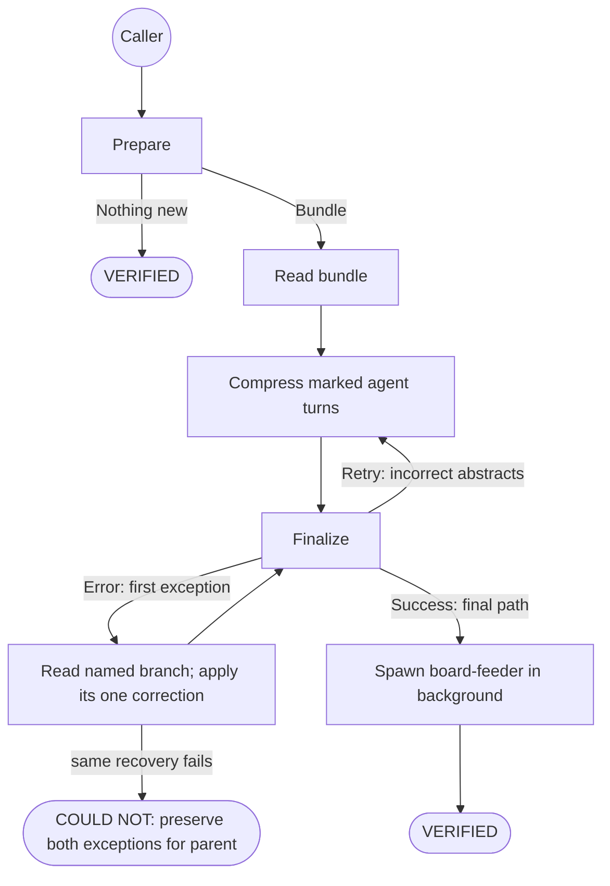
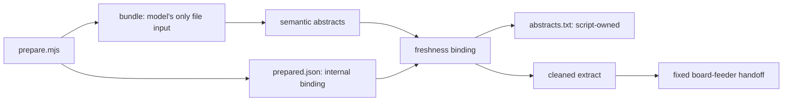

# Extract-Cleaner — Quasi-Software View

`grimorio.extract-cleaner` has one cognitive responsibility: faithfully compress the marked `agent:` turns.
Scripts own session selection, paths, artifacts, assembly, verification, and cleanup.

## Boundary decision

| Concern | Owner |
| --- | --- |
| Session, watermark, delta, and bundle | `extract-cleaner-prepare.mjs` |
| Faithful compression of marked turns | Model |
| Abstract serialization and count validation | `extract-cleaner-finalize.mjs` |
| Slice, splice, freshness, watermark update, and verification | `extract-cleaner-finalize.mjs` |
| Ask extraction, deduplication, and Project writes | `grimorio.board-feeder` then `grimorio.board-writer` |

The model submits only repeated `--abstract <value>` parameters. It never chooses an artifact path, reads or
writes `abstracts.txt`, or validates its own output.

## State machine

The ordinary run has four calls: prepare, read, finalize, and the fixed feeder spawn. Compression is the only
model judgment. A `Retry [code]` corrects abstracts and resubmits the complete set. An `Error [code]` is not
discarded: the Cleaner reads the named finalizer branch, performs its one prescribed correction, and includes
the original exception plus correction in its final message to the parent. It does not invent a broader repair.

## Artifact flow

`user:` text never crosses the model-generated artifact path. The finalizer rejects malformed abstracts before
changing the internal set, and atomically replaces that set only after complete validation. It says either:

- `Success: cleaned extract written to <path>` — spawn `grimorio.board-feeder` with that exact path.
- `Retry [code]: <cause>` — correct and resubmit the complete abstract set, at most twice.
- `Error [code]: <cause>` — retain the exception, read its named branch, make one prescribed correction, and
  report the recovered exception to the parent after success; the second failure is `COULD NOT`.

## Verification boundary

All Extract-Cleaner selftests are Node MJS files. They cover helper scripts, prepare states, finalizer success,
retry, terminal errors, and the independent parser QA suite. They do not prove a live Claude Code invocation;
that still requires an observed run.
