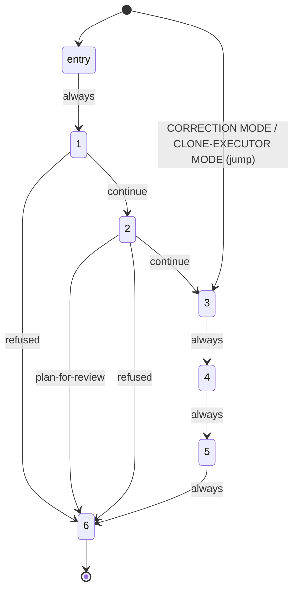

# Prompt Writer — quasi-software design view

The saved, drawn reference for `grimorio.prompt-writer`'s own phase chain, per
ref:skill/grimorio.phase-splitting#the-drawn-view. Rewritten
in full for the 2026-09-16 mechanism rewrite — the prior 850-line version accreted a dispatch-by-dispatch change
log (numbered "Dispatch" sections, review-status paragraphs, a REWORK log) beside the diagrams themselves; this
file states only the CURRENT design. Git history, not this file, holds the dispatch-by-dispatch story. Kept to
the same fidelity as the sibling
ref:skill/grimorio.agent-writing/system-keeper-phases/system-keeper-quasi-software-view.md — the six phase files
themselves are the authority on WHAT each phase does; this file is only the drawn SHAPE, per the ~500-line smell
threshold (ref:skill/grimorio.conduct#branches-commits-and-knowledge rule 23).

## Why the rewrite — the measurement that forced it

Four dispatches of this agent for one task — one authoring pass plus three small corrections — measured
1,467,058 tokens, ~620,000 of that across the three corrections alone; every invocation pays this agent's own
fixed registration cost regardless of task size. Checked against the real log window those four dispatches ran
in: the prior tmp/-fingerprint-write-and-check hand-off never actually fired in any of them — so the fixed
prose size of the chain itself (~1,300 lines across the behavior file and six phases, loaded regardless of task
size), and whatever fraction of the three corrections never actually took the already-documented CORRECTION
MODE shortcut, are the real driver, not that mechanism. The rewrite: the SAME mechanism change
`grimorio.system-keeper` gave its own chain — a script-driven hand-off replacing the tmp/-fingerprint-write-and-
check ceremony, and CORRECTION MODE/CLONE-EXECUTOR MODE's own entry now a logged `jump` call instead of resting
on prose self-discipline — applied WITHOUT collapsing this chain's own six phases, each its own distinct
cognitive mission, into an orchestrator's smaller phase count.

## Layer 1 — NODES: empty, by construction

**NEVER read the empty NODES layer as an unfinished section.** `disallowedTools: Agent` is set in this agent's
own shell (`ref:repo/.claude/agents/grimorio.prompt-writer.md`), and every phase file states the same fact in
its own Step 1: this agent never invokes another agent, in any phase, ever. Zero agent-nodes is the correct,
complete rendering — `agent:grimorio.system-keeper` is this agent's own PARENT, never a node this chain spawns
or leans on, and appears only in this file's own prose (as PARENT, and as the source of both alternate-entry
conditions below), never as a node in any diagram.

## Layer 2 — PHASES: the state machine, script-driven

| Node | File | Question it answers |
|---|---|---|
| entry | `prompt-writer-behavior.md` | Phase 0 — carry the caller's inputs forward, call the phase server |
| 1 | `phase-1-search-first.md` | What does grimorio already know about this artifact and task, before any judgment? |
| 2 | `phase-2-understand-verify-plan.md` | Given Phase 1's facts, what exactly am I building, and how? |
| 3 | `phase-3-rule-syntax.md` | Is each individual hard rule correctly formed? |
| 4 | `phase-4-file-structure.md` | Is the file itself correctly shaped, and does it actually reach disk? |
| 5 | `phase-5-content-guardrails.md` | Am I avoiding this corpus's own known authoring mistakes? |
| 6 | `phase-6-report-close.md` | What does my parent need to know, and is this close honest? (terminal) |

Every edge above is a real transition in
`.grimorio/skills/grimorio.agent-writing/prompt-writer-phases/chain.json`'s own `next` map, per phase — this
diagram and that manifest must never drift out of sync; a change to one is a change to both, in the same pass.

**A `jump --run <id> --to 3 --reason "..."` call is the mechanical, logged entry CORRECTION MODE and
CLONE-EXECUTOR MODE both use to reach Phase 3 directly, skipping Phase 1 and Phase 2 — never a graph edge of its
own**, drawn above as the single dashed `[*] --> 3` transition rather than as two separate named entries,
because both share the identical target and skip footprint.
ref:skill/grimorio.agent-writing/prompt-writer-behavior.md's own CORRECTION MODE and CLONE-EXECUTOR MODE
sections state which condition and which required fields distinguish the two. Both replace what used to be a
prose self-redirect ("SKIP Phase 1 and Phase 2, read Phase 3 directly") with this same logged call — the
mechanical, queryable proof (`.claude/.cache/phase-server-log.jsonl`) that the shortcut was actually taken.

**There is no repeating back-edge in this chain.** Re-evaluation of what this agent produces lives one level
up, inside `agent:grimorio.system-keeper`'s own VERIFICATION and ADVERSARIAL REVIEW phases — never inside this
chain itself, per
ref:skill/grimorio.agent-writing/prompt-writer-phases/phase-6-report-close.md's own "Why there is no evaluation
phase in this chain" section.

## Layer 3 — INTERNAL artifact flow, per phase

| Phase | Consumes | Produces (carried in reasoning into the next phase, never written to `tmp/`) |
|---|---|---|
| 1 | the spec, every named target file, precedent for the artifact TYPE | spec held verbatim, target files' current content, rewrite-lens findings (WHEN a rewrite), surfaced precedent, MECHANICAL-VOLUME finding |
| 2 | everything Phase 1 produced | OBJECTIVE/EXIT CONDITION, verified (or flagged) LEVEL, STEPS-VS-PHASES VERDICT, FORM chosen, and, WHEN triggered, the reviewable PLAN artifact instead of proceeding |
| 3 | everything Phase 2 produced | the individually well-formed rule set, opener-checked |
| 4 | the verified rule set | the file(s) actually written to disk, the pointer-resolution table, the HARNESS-VALIDATE result, the five-named-check gate result |
| 5 | everything Phase 4 produced | the guardrail scan results and, WHEN it fires, the named REFUSAL |
| 6 | everything upstream, restated | the final report, written as its own file under `tmp/<id>/` and recorded as `report-written` — a second durable prose artifact, distinct from the files Phase 4 wrote — with only that file's own path and the CLOSE line reaching `grimorio.system-keeper` directly |

Only the files Phase 4 actually writes to disk, and Phase 6's own final report, are ever produced mid-chain —
Phase 6 is the one exception to "no phase writes a per-phase deliverable dump to `tmp/`": its own report is
written exactly once, as the terminal act, never per-phase.

## Layer 4 — PARALLELIZATION: structurally impossible

`disallowedTools: Agent` forecloses this chain from ever invoking anything, in any phase — there is no second
running thing it could ever run concurrently with. CORRECTION MODE and CLONE-EXECUTOR MODE are ALTERNATE ENTRY
points into one single-threaded execution, never two simultaneously-active paths — a branch, never a
concurrency primitive.

## Layer 5 — EXPECTED OUTPUTS

- Ordinary dispatch: `grimorio.system-keeper` receives Phase 6's report-file path plus its CLOSE line —
  VERIFIED (naming evidence per gate item confirmed across Phases 3-5) or COULD NOT (naming the blocker and
  which phase raised it); the full `## OUTPUT` block itself is written to that file, never handed to the
  caller directly.
- PLAN-FOR-REVIEW dispatch: the same shape — the report file's path plus a CLOSE line reading PLAN-FOR-REVIEW,
  naming what Phase 1 and Phase 2 actually established; the reviewable plan artifact itself is carried INSIDE
  that file's own content (Phase 6's own PLAN ARTIFACT field), never pasted into the transcript — Phase 3
  through Phase 5 never ran this pass.
- Either way: the target file(s), written directly to disk by Phase 4, gated downstream by
  `agent:grimorio.system-keeper`'s own VERIFICATION and ADVERSARIAL REVIEW phases before anything ships.

## Known errors this design closes — carried forward, never silently dropped

- **Applying an ORCHESTRATOR phase-map method to a PURPOSE-DRIVEN agent** — over- or under-splits cognitively.
  This exact chain was once mis-derived this way, and the derivation was rejected. Closed by keeping six
  phases, each its own distinct cognitive mission, never collapsed to mirror an orchestrator's own phase count,
  and by Phase 2's own STEPS-VS-PHASES TEST (step 3c), which re-runs this judgment on every rewrite rather than
  assuming a prior shape still fits.
- **A phase sized by assumption instead of by RENDER/GROUP/MEASURE** — a phase-map derivation once produced a
  single phase carrying roughly 28 distinct requirements before anyone actually rendered and counted them.
  Closed by Phase 4's own PINCHO-SIZING CHECK (step 3b), run against the actually-rendered content of an
  affected phase, never against an assumed shape.
- **SEARCH-FIRST fused into planning** — gathering facts (what already exists, what precedent applies) folded
  into the same pass that also plans and drafts loses the discipline of establishing FACTS before any judgment
  is applied. Closed by keeping Phase 1 (SEARCH-FIRST) structurally separate from Phase 2 (UNDERSTAND, VERIFY &
  PLAN) — a boundary this mechanism rewrite does not touch.
- **A tmp/-fingerprint-write-and-check ceremony paid on every hand-off, unproven to have ever fired** — closed
  by this chain's own script-driven hand-off (`phase-engine.mjs --chain prompt-writer`), which logs every
  transition mechanically instead of trusting a phase's own self-written, self-checked `tmp/` artifact.
