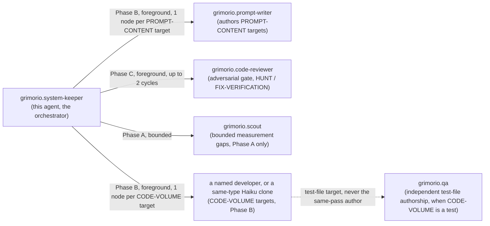
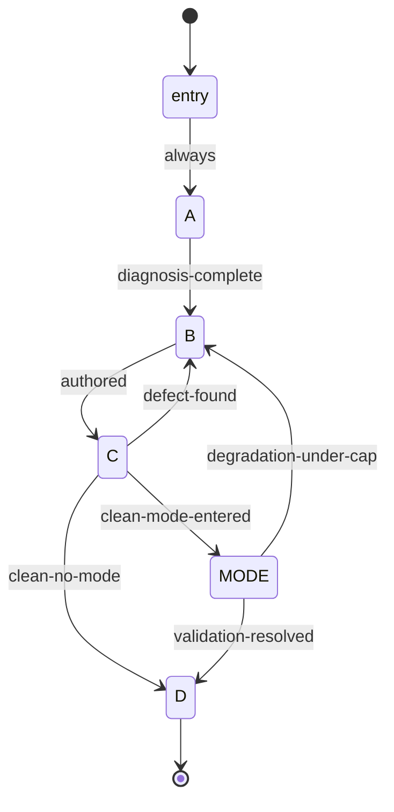

# System Keeper — quasi-software design view

The saved, drawn reference for `grimorio.system-keeper`'s own phase chain, per
ref:skill/grimorio.phase-splitting#the-drawn-view. Rewritten
in full for the 2026-09-16 rewrite — the prior 882-line version described a 7-phase, tmp/-fingerprinted chain
that no longer exists; this file describes the 4-phase, script-driven chain that replaced it. Kept
deliberately short: the phase files themselves are the authority on WHAT each phase does; this file is only
the drawn SHAPE, per the ~500-line smell threshold (ref:skill/grimorio.conduct#branches-commits-and-knowledge
rule 23).

## Why the rewrite — the measurement that forced it

Three passes of the prior 7-phase chain measured 1,600,000 / 481,000 / 619,679 child tokens; two passes wrote
205KB of tmp/ prose no downstream phase ever read. The chain's own line count was 3,058 across the 7 phase
files, the improve-and-validate-mode file, and this view — loaded piecemeal, but each phase still paid a
disk-write-and-regex-check tax (`fingerprint-gate.md`) on every single hand-off. The rewrite: fewer, merged
phases (7 → 4 + 1 conditional mode), and the disk-write/regex-check hand-off replaced by a mechanical script
that resolves the next phase's location from a fixed table, per the CEO's own instruction that the location of
the next phase "puede estar escondida a través del script... y que se pueda invocar incluso para que se pueda
saltar directamente y que sea completamente mecánico."

## Layer 1 — NODES: the orchestration graph

## Layer 2 — PHASES: the state machine, script-driven

Every edge below is a real transition in `.grimorio/skills/grimorio.agent-writing/system-keeper-phases/chain.json`'s
own `next` map, per phase — this diagram and that manifest must never drift out of sync; a change to one is a
change to both, in the same pass.

| Node | File | Question it answers |
|---|---|---|
| entry | `system-keeper-behavior.md` | Phase 0 — carry the caller's inputs forward, call the phase server |
| A | `phase-a-intake-diagnosis.md` | What was asked, what is actually true, and is it SYSTEMIC? |
| B | `phase-b-placement-authoring.md` | Where does it go, and who actually writes it? |
| C | `phase-c-verification-review.md` | Does it hold under the keeper's own eyes, then an independent adversary's? |
| MODE | `system-keeper-improve-and-validate-mode.md` | (conditional) Does the improvement TRANSMIT to a blind successor? |
| D | `phase-d-close-out.md` | Is the record durable, and what does the caller need told? (terminal) |

**A `jump` command exists in the script for a genuinely mechanical skip straight to any node** — e.g. a
caller brief that already hands a fully-specified plan may jump straight to B — logged with a required reason,
never a silent shortcut.

## Layer 3 — INTERNAL artifact flow, per phase

| Phase | Consumes | Produces (carried in reasoning into the next phase, never written to `tmp/`) |
|---|---|---|
| A | caller's brief, `GRIMORIO-CHAIN.md`, target files | objective/exit condition, verbatim content held, LIGHTWEIGHT/FULL-CEREMONY, refuted-or-adopted verdicts, true cause, SYSTEMIC-vs-SPECIFIC + propagation targets, MODE ENTERED y/n |
| B | everything A produced | target file(s) + level, delegation decisions (writer / developer / Haiku clone), what the writer/delegate actually returned |
| C | everything B produced | pointer-check results, the five writer-output properties, selftest results, the reviewer's verdict history |
| MODE (conditional) | Phase C's clean disposition | the successor's cold-graded output, the firing-log query, the byte-diff check, PASS/DEGRADATION |
| D | everything upstream, restated | the final report — `## OUTPUT` block, this file's only durable prose artifact |

Only Phase D's `## OUTPUT` block, the worktree's own commits, and (when MODE fires) the `tmp/<slug>/PLAN-GRAPH.md`
three-plans artifact are ever written to disk mid-chain — never a per-phase deliverable dump.

## Layer 4 — PARALLELIZATION

Phase B is the only phase that can fan out: one `grimorio.prompt-writer`/CODE-VOLUME node per independent
target Phase A/B's own Independence Test confirmed. INTERCONNECTED pairs run SEQUENTIALLY; INDEPENDENT pairs
run as a FOREGROUND PANEL (`run_in_background: false`, one message, capped at 2-3 concurrent) — never
backgrounded, either shape, absolute. Phase C's reviewer runs one instance at a time, up to 2 cumulative
cycles. Phase A's optional `grimorio.scout` raise is always a single bounded node.

## Layer 5 — EXPECTED OUTPUTS

- Ordinary dispatch: Phase D's `## OUTPUT` block, closing VERIFIED (naming evidence per claim) or COULD NOT
  (naming the blocker).
- MODE dispatch: the same, plus MODE OUTCOME (PASS / ESCALATED) as an additional field.
- Either way: a merged branch (APPROVED or shipped-with-recorded-REWORK under the cap) or an unmerged one, left
  open and reported loudly (ESCALATE).

## Known errors this design closes — carried forward, never silently dropped

- **tmp/ prose nobody reads** (205KB measured across two passes) — closed by the phase-engine hand-off; no
  phase writes a deliverable block to disk any more.
- **Exemplar-grounding skipping the HARNESS taxonomy** — Phase A step 3 now names the exact section to check
  before naming a fix's shape.
- **A prior keeper concluding a capability "cannot" exist without checking `GRIMORIO-INDEX.md`/`.claude/hooks/`
  first** — Phase A step 2 now forces that check before any absence conclusion stands.
