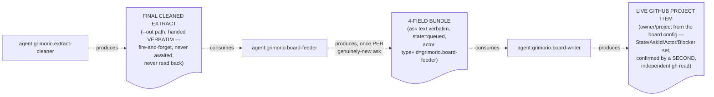
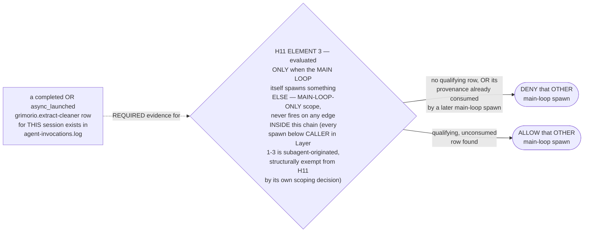

# Board Chain — Quasi-Software View (STATE MACHINE + LOOP + GRAPH, both Layer-4 halves)

This is the board chain's own DRAWN quasi-software design view — the full path a CEO ask takes from
`agent:grimorio.extract-cleaner`'s own PREPARE step through to a live item on the GitHub Project (owner
the owner and project declared in ref:repo/.claude/board-config.json), including the hooks that gate parts of that path. Produced under the EXTENDED scope
ref:skill/grimorio.phase-splitting/quasi-view-requirements.md#the-three-layer-hard-requirement's own
2026-08-24 paragraph: this is a cross-cutting process spanning multiple existing agents and hooks, no single new
agent shell to hang the view off — the exact class that EXTENDED clause names. Model and conventions follow
ref:skill/grimorio.conduct/main-loop-flow-quasi-software-view.md (PRIMARY exemplar — the other shipped
instance of a non-agent phased process) and
ref:agent/grimorio.extract-cleaner/extract-cleaner-quasi-software-view.md (SECONDARY exemplar — how a
single agent's own interior is drawn once, and pointed at rather than re-derived, when it appears as one node
inside a larger chain).

**This view is AS-IS ONLY.** Every gap named below is drawn as a real, currently-true, OPEN finding — never a
proposed fix, never a TO-BE. Where the chain, as currently written, does not close a gap the CEO has named,
that absence is exactly what this file records, not what it corrects.

**Scope boundary — what this file does NOT re-derive.** `agent:grimorio.extract-cleaner`'s own five internal
sub-steps (PREPARE/READ/COMPRESS/FINALIZE/HANDOFF), its own loop-back, and its own KNOWN-ERRORS mapping are
already drawn in full at the SECONDARY exemplar above — this file treats that agent as ONE node throughout,
exactly the way the PRIMARY exemplar treats each of the main loop's own phases as one node without re-drawing
what happens deeper inside a spawned child. ref:repo/.claude/hooks/spawn-verbatim-origin-gate.cjs's (H11) own
full ELEMENT 1/1b/2/3 branching is already drawn in full at the PRIMARY exemplar's own Layer 4b, sub-step S3 —
this file draws only the NEW fact neither exemplar states: how ELEMENT 3 relates (and does not relate) to this
specific chain.

---

## Layer 1 + 2 + 3 — STATE MACHINE, LOOP, and GRAPH in one diagram

The chain's own three agent-nodes (`agent:grimorio.extract-cleaner`, `agent:grimorio.board-feeder`,
`agent:grimorio.board-writer`) are the STATE MACHINE spine — each hands a narrower artifact to the next, never
in reverse. `board-feeder`'s own DEDUP-AND-RAISE step is expanded here, not left opaque, because it is the
chain's own only LOOP (a FOREACH over every extracted ask, never a retry) — collapsing it to one box would make
that loop undrawable at this layer. H17 (`board-reconcile.cjs`, wired 2026-09-22 — REPLACES the prior H14,
`board-write-check.cjs`, drawn here until this pass), H15, and H11's own ELEMENT 3 are drawn as GRAPH nodes
attached to the edge or agent where each actually fires, never invented as gating an edge they do not touch.
**H17's own `Stop` half is MAIN-LOOP ONLY and never fires anywhere inside this chain at all** — every hop below
is subagent-originated — so only its `SubagentStop` half is drawn here, exactly the same scoping discipline
already applied to H11 ELEMENT 3 below.

```mermaid
flowchart TB
    CALLER(("CALLER — the main loop,<br/>raising extract-cleaner<br/>AUTONOMOUSLY (rule 13 pt.1) —<br/>no file/count/session arg"))
    CALLER --> ECBOX

    subgraph ECBOX["agent:grimorio.extract-cleaner —<br/>own interior NOT re-drawn here;<br/>see the SECONDARY exemplar above"]
      direction TB
      EC["PREPARE → READ → COMPRESS →<br/>FINALIZE — 4 of 5 ordinary-case<br/>tool calls"]
    end
    ECBOX -->|"HANDOFF (Step 6) — Agent-tool<br/>spawn, run_in_background LEFT<br/>AT DEFAULT (true), fire-and-<br/>forget, NEVER awaited, NEVER<br/>read back"| BFBOX

    subgraph BFBOX["agent:grimorio.board-feeder —<br/>interior drawn in FULL, Layer 4b"]
      direction TB
      BF["LOAD-DOCTRINE → READ-WINDOW →<br/>READ-PROJECT (gh item-list 2,<br/>fresh, --limit 500) →<br/>EXTRACT-ASKS"]
      BF --> DEDUP{"DEDUP-AND-RAISE — per<br/>extracted ask, SEMANTIC dedup<br/>against the fresh non-Done<br/>read (never string match)"}
      DEDUP -.->|"LOOP-BACK: next ask<br/>(FOREACH, never a retry)"| DEDUP
      DEDUP -->|"already tracked"| SKIP["skip — no write,<br/>no spawn"]
      DEDUP -->|"genuinely new"| RAISE["raise board-writer —<br/>FOREGROUND, WAITED,<br/>same turn"]
    end
    RAISE -->|"4-field bundle: ask text<br/>verbatim, state=queued,<br/>actor=grimorio.board-feeder"| BWBOX

    subgraph BWBOX["agent:grimorio.board-writer —<br/>interior drawn in FULL, Layer 4b"]
      direction TB
      BW["VALIDATE-INPUT → CREATE-ITEM →<br/>SET-FIELDS → SELF-CHECK"]
    end
    BWBOX -->|"gh project item-create +<br/>item-edit calls"| PROJ
    PROJ@{shape: doc, label: "LIVE GITHUB PROJECT ITEM<br/>owner/# from the board config<br/>State/AskId/Actor/Blocker set"}

    H17(("H17 · board-reconcile.cjs<br/>SubagentStop half only —<br/>its Stop half never reaches<br/>this chain, see above")):::hook
    ECBOX -.->|"fires on EC's own close too —<br/>computes unclaimedCommits<br/>against EC's own turn; EC<br/>writes no commit, ALWAYS<br/>empty, Layer 4b"| H17
    BFBOX -.->|"fires on BF's own close —<br/>BF writes no commit either,<br/>ALWAYS empty, same as EC"| H17
    BWBOX -.->|"fires on BW's own close —<br/>BW touches no file of any<br/>kind, let alone a commit,<br/>ALWAYS empty, same as EC"| H17

    H15(("H15 · subagentstop-wait.cjs<br/>SubagentStop: *")):::hook
    ECBOX -.->|"fires on EC's OWN close —<br/>finds board-feeder as a LIVE<br/>async_launched dependency,<br/>no exemption exists — TENSION,<br/>Layer 4b"| H15

    E3(("H11 ELEMENT 3<br/>(spawn-verbatim-origin-<br/>gate.cjs) — see note below")):::hook
    ECBOX -.->|"NOT a gate on this edge —<br/>ELEMENT 3 only REQUIRES this<br/>agent's own completed row to<br/>exist, for OTHER main-loop<br/>spawns; see Layer 4b"| E3

    style ECBOX fill:none,stroke:#77a,stroke-width:2px
    style BFBOX fill:none,stroke:#77a,stroke-width:2px
    style BWBOX fill:none,stroke:#77a,stroke-width:2px
    classDef hook fill:#3a2a2a,stroke:#a55,stroke-width:2px
    class H17,H15,E3 hook
```

**Reading this diagram.** The solid `CALLER → ECBOX → BFBOX → BWBOX → PROJ` chain is the STATE MACHINE — three
agent-hops, each narrowing what crosses (a path, then a 4-field bundle, then a live Project item). The dashed
`DEDUP → DEDUP` self-loop inside `BFBOX` is the chain's own ONLY LOOP: a FOREACH over every ask `EXTRACT-ASKS`
found, never a retry-on-failure loop the way `extract-cleaner`'s own `S4→S3` back-edge is (that one lives one
level down, inside `ECBOX`, undrawn here per the scope boundary above). `board-writer`'s own interior carries no
loop-back at all — a straight sequential pass with terminal STOP/COULD-NOT branches, drawn in full at Layer 4b.
The three circular, dash-bordered hook nodes (`H17`, `H15`, `E3`) are the GRAPH's own gating machinery: `H17`
attaches to all three agent-boxes because it is wired to `SubagentStop: *`, but its own commit-based computation
resolves EMPTY on every one of them, since none of the three ever makes a git commit (unlike the prior H14 it
replaces, which resolved harmlessly for a DIFFERENT reason per box — dead INTAKE code, an always-nested CLOSURE
caller, an exempted agent_type), `H15` attaches only to `ECBOX` because it is the only agent in this chain that dispatches
a live, unawaited async child, and `E3` attaches to `ECBOX` with a dotted, explicitly-labeled edge because — per
the brief this view was commissioned against — it is NOT a gate on any edge this chain actually walks; it is
drawn anyway because the brief names it as one of "the hooks that gate parts of this path," and drawing it
honestly means drawing what it actually does: require proof of `ECBOX`'s own completion before releasing a
DIFFERENT, later main-loop spawn, never before releasing anything inside this chain. **No future/not-wired
agent-node belongs in this diagram** — every edge above is a real, wired spawn or hook attachment, confirmed
against each file's own current text, not a planned one.

---

## Layer 4a — INTERNAL: boundary artifact-flow (N-1 rule)

**Grounding — shared across every quasi-view that draws this layer, not restated here:**
ref:skill/grimorio.phase-splitting/quasi-view-requirements.md#half-a--boundary-artifact-flow-unchanged.
Three chain-nodes means TWO boundary artifacts (N-1), plus the terminal node's own final output crossing to the
GitHub Project — never one IN/OUT pair per node.

**What crosses, and what does not.** `extract-cleaner` reads its own watermark plus a raw transcript window
(both internal to its own PREPARE script, undrawn here per the scope boundary) and hands `board-feeder` ONLY a
path — never the transcript content itself, never a turn count. `board-feeder` reads that cleaned extract PLUS a
fresh, live `gh project item-list` call, and writes NOTHING itself: its only output is the 4-field bundle it
hands `board-writer`, once per genuinely-new ask, never a file of any kind. `board-writer` reads nothing but that
bundle plus two of its own fresh `gh project item-list` calls (a uniqueness check before writing, a self-check
after), and writes exactly one GitHub Project item via `gh project item-create` + `gh project item-edit` — never
a file, of any kind, ever, per its own behavior file's own standing rule. The terminal artifact this whole chain
produces is that one live Project item, never a second file, never a register row.

---

## Layer 4b — INTERNAL: per-node interior behavior + KNOWN-ERRORS-TO-PHASE mapping

Per ref:skill/grimorio.phase-splitting/quasi-view-requirements.md#half-b--per-phase-interior-behavior-new,
this half is owed together with Layer 4a, never alone, and renders ONE mermaid `flowchart` per node — never a
table. `extract-cleaner` is intentionally NOT re-drawn here (scope boundary, above) — every other node below is
drawn fresh against its own real, current source text, never invented or paraphrased from memory.

### `agent:grimorio.board-feeder` (interior — its own behavior file's Steps 1-7, one-to-one)

```mermaid
flowchart TB
    F0["state own graph:<br/>SELF node, 6 sub-steps,<br/>ONE child (board-writer,<br/>foreground, waited)"] --> F1["Step 1 — LOAD-DOCTRINE:<br/>load grimorio.conduct,<br/>prompt-reading (in turn),<br/>this behavior file,<br/>grimorio.fan-out"]
    F1 --> F2["Step 2 — READ-WINDOW:<br/>Read the cleaned-extract<br/>path handed, in full"]
    F2 --> F3["Step 3 — READ-PROJECT:<br/>Bash `gh project item-list 2<br/>--owner &lt;owner from the board config&gt; --format<br/>json --limit 500`, fresh —<br/>every non-Done item = a<br/>currently tracked ask"]
    F3 --> F4["Step 4 — EXTRACT-ASKS: pull<br/>every direct request/<br/>instruction/correction from<br/>the window's user: turns,<br/>verbatim quoted, turn-<br/>numbered"]
    F4 --> F5{"Step 5 — DEDUP-AND-RAISE:<br/>per extracted ask, is it<br/>already represented among<br/>Step 3's non-Done items?<br/>(SEMANTIC judgment — a<br/>reworded restatement still<br/>counts as a match)"}
    F5 -->|"already tracked"| F5skip["skip — no write,<br/>no board-writer spawn<br/>for this ask"]
    F5 -->|"genuinely new"| F5raise["raise board-writer,<br/>FOREGROUND, WAITED,<br/>same turn — bundle: ask<br/>text verbatim, state=queued,<br/>actor=grimorio.board-feeder"]
    F5skip -.->|"next ask (FOREACH,<br/>never a retry)"| F5
    F5raise -.->|"next ask (FOREACH,<br/>never a retry)"| F5
    F5skip --> F6
    F5raise --> F6
    F6(["Step 6 — REPORT: count of<br/>new asks written (or 'no new<br/>asks this window'); states<br/>plainly its own caller never<br/>waits and never reads this"])

    classDef exit fill:#2a2a3a,stroke:#668,stroke-dasharray: 3 3
    class F6 exit
```

### `agent:grimorio.board-writer` (interior — its own behavior file's Steps 1-17, one-to-one)

```mermaid
flowchart TB
    W0["state own graph:<br/>SELF node, 5 sub-steps, NO<br/>child (no Agent/Skill tool<br/>at all, by construction)"] --> W1{"Step 1 — VALIDATE-INPUT:<br/>ask text present? state one<br/>of queued/progress/blocked/<br/>done? blocker context<br/>present IF state=blocked?"}
    W1 -->|"any check fails"| WCN(["→ COULD NOT (Step 5) —<br/>NEVER invent a missing<br/>value"])
    W1 -->|"all pass"| W2["Step 2 — CREATE-ITEM:<br/>Bash `gh project item-list 2<br/>--owner &lt;owner from the board config&gt; --format<br/>json -L 500`, fresh —<br/>uniqueness read"]
    W2 --> W3["derive kebab-case &lt;id&gt;,<br/>never reused against this<br/>fresh read; compose &lt;body&gt; =<br/>ask verbatim + optional<br/>why: line + (blocked ONLY)<br/>blocker: line"]
    W3 --> W4["Bash `gh project item-create<br/>2 --owner &lt;owner from the board config&gt; --title<br/>&lt;id&gt; --body &lt;body&gt; --format<br/>json` → hold &lt;itemId&gt;"]
    W4 --> W4x{"exit 0 AND an id<br/>field returned?"}
    W4x -->|"NO"| WCN
    W4x -->|"YES"| W5["Step 3 — SET-FIELDS: one<br/>`gh project item-edit` call<br/>PER applying field — State<br/>(ALWAYS), AskId (ALWAYS),<br/>Actor (ONLY if a calling<br/>agent was handed), Blocker<br/>(ONLY if state=blocked)"]
    W5 --> W5note["record which, if any,<br/>INDIVIDUAL field-edit calls<br/>failed — never retried, never<br/>dropped, carried forward to<br/>Step 5 below — SELF-CHECK<br/>below runs regardless"]
    W5note --> W6["Step 4 — SELF-CHECK: a<br/>SECOND, independent `gh<br/>project item-list ... -L 500`<br/>— confirm &lt;itemId&gt; present,<br/>its title matches &lt;id&gt;, its<br/>State matches"]
    W6 --> W6x{"item present AND<br/>title AND State<br/>both match?"}
    W6x -->|"NO"| WCN
    W6x -->|"YES, AND no field-edit<br/>call failed"| WV(["Step 5 — VERIFIED: item id,<br/>title, confirmed State —<br/>PLUS the standing PUBLISH-<br/>obligation field, ALWAYS"])
    W6x -->|"YES, BUT a NON-State<br/>field-edit call DID fail<br/>(Actor/AskId/Blocker)"| WC(["Step 5 — COMPOUND: item+<br/>State VERIFIED, named<br/>field(s) separately COULD<br/>NOT — PLUS the standing<br/>PUBLISH-obligation field,<br/>ALWAYS"])

    classDef exit fill:#2a2a3a,stroke:#668,stroke-dasharray: 3 3
    class WV,WC,WCN exit
```

**The standing PUBLISH-obligation field, named once here.** Every `board-writer` close — VERIFIED, COULD NOT, or
COMPOUND — carries one further, standing field (its own Step 17): this agent never publishes anything derived
from the GitHub Project into the live board Artifact's own db, and never runs any projection generator. A reader
of ANY `board-writer` report who sees only "VERIFIED" without this field could mistake the write for the board
itself being current on the live Artifact — it is not. This is the exact seam the publish-half gap (row 6 below)
lives on.

### H17 — ref:repo/.claude/hooks/board-reconcile.cjs (interior — its `SubagentStop` half only, the one half this chain ever meets; its `Stop` half is main-loop-only and never fires here at all)

```mermaid
flowchart TB
    H0["SubagentStop fires —<br/>agent_id AND agent_type both<br/>present? (else: no attribution<br/>possible, exit)"] --> H1["read this session's own<br/>turn-start watermark; no<br/>watermark recorded yet for<br/>this session -> exit (nothing<br/>to reconcile against)"]
    H1 --> H2["unclaimedCommits(turnStart,<br/>claims, cwd) — the commits<br/>THIS closing agent is<br/>responsible for in the SAME<br/>open turn"]
    H2 --> H3{"any unclaimed commit?"}
    H3 -->|"NO — the REAL, CURRENT<br/>case for EVERY agent in this<br/>chain: extract-cleaner writes<br/>a tmp/ file, board-feeder<br/>writes nothing, board-writer<br/>touches no file of any kind —<br/>NONE of the three ever makes<br/>a git commit"| H3empty(["silent — zero claims<br/>appended, on EVERY real<br/>close of any of the three"])
    H3 -->|"YES (would only fire if a<br/>FUTURE change made one of<br/>these three agents commit)"| H4["appendClaim one line per<br/>commit, by:agentType/agentId<br/>— NEVER blocks, this half<br/>only ever records"]

    classDef exit fill:#2a2a3a,stroke:#668,stroke-dasharray: 3 3
    class H3empty exit
```

**What changed from H14, honestly, not smoothed over.** H14 resolved harmlessly for this chain for THREE
different reasons, one per agent (dead INTAKE code for `extract-cleaner`, an always-nested CLOSURE caller for
`board-feeder`, an exempted `agent_type` for `board-writer`) — three independent, ACCIDENTAL non-firings, none
of them a designed property of the chain. H17 resolves harmlessly for all three for ONE shared, structural
reason instead: none of the three ever makes a git commit, so its own `unclaimedCommits` computation is
provably empty on every real close, by construction — not an accident of how each agent happens to be
classified, but a direct consequence of what this chain actually DOES.

### H15 — ref:repo/.claude/hooks/subagentstop-wait.cjs (interior — its own live-dependency wait/block, applied to `extract-cleaner`'s own Step 6 spawn)

```mermaid
flowchart TB
    S0["SubagentStop fires for<br/>agent X — HERE: agent X =<br/>extract-cleaner, closing<br/>right after its own Step 6<br/>HANDOFF"] --> S1{"agent_id/agent_type<br/>present? kill-switch clear?<br/>agent cap not yet hit?"}
    S1 -->|"any fails"| S1exit(["silent exit"])
    S1 -->|"all clear"| S2["findLiveDependency(X):<br/>scan agent-invocations.log<br/>for a row where X is<br/>CALLER, dispatch_status=<br/>async_launched, child not<br/>yet FINAL_CLOSE"]
    S2 --> S3{"a live dependency<br/>found? — extract-cleaner's<br/>OWN board-feeder spawn<br/>QUALIFIES on its face:<br/>run_in_background LEFT AT<br/>DEFAULT (true) IS<br/>async_launched, and this<br/>hook's own source carries<br/>NO named exemption for any<br/>agent_type, anywhere"}
    S3 -->|"NO — board-feeder<br/>already reached its own<br/>terminal close by the time<br/>this check runs (a timing<br/>fact, not a designed<br/>exemption)"| S3exit(["silent — correct<br/>background use"])
    S3 -->|"YES — board-feeder is<br/>still running"| S4["atomic claim file for<br/>(X, board-feeder's id) —<br/>dedupes a burst of firings"]
    S4 --> S5["WAIT loop — poll every<br/>few seconds up to 120s,<br/>re-checking FINAL_CLOSE<br/>each time"]
    S5 --> S6{"board-feeder finishes<br/>DURING the wait?"}
    S6 -->|"YES"| S6block(["decision:block — 'process<br/>its result now, then<br/>close' (1 interruption<br/>logged) — CONTRADICTS<br/>extract-cleaner's own Step<br/>6 text: 'NEVER wait on<br/>this spawn in any way'"])
    S6 -->|"NO — wait expires,<br/>still live"| S7block(["decision:block —<br/>PREVENTIVE, same contra-<br/>diction, now against a<br/>spawn extract-cleaner's own<br/>design explicitly calls<br/>fire-and-forget"])

    classDef exit fill:#2a2a3a,stroke:#668,stroke-dasharray: 3 3
    class S1exit,S3exit exit
```

**What this flowchart settles, and what it does not.** The sourced material SETTLES one thing plainly: no
bypass, exemption, or `EXEMPT_TYPES`-style construct for `extract-cleaner`, or for any fire-and-forget spawn
generically, exists anywhere in ref:repo/.claude/hooks/subagentstop-wait.cjs's own current text — grepping its
full source for
`extract-cleaner`/`EXEMPT`/`exemption`/`bypass` returns zero matches. What it does NOT settle is whether this has
been OBSERVED actually firing on a real run: whether `S3` resolves to "found" or "not found" on any given
`extract-cleaner` close depends on a RACE — has `board-feeder` already reached its own terminal close by the
moment `extract-cleaner`'s own `SubagentStop` fires — and that race's own outcome is not recorded anywhere in
this corpus. Per ref:skill/grimorio.hooks/board-and-wait.md#h15--subagentstop-waitcjs, this hook's
design intentionally treats "wait, then block on either outcome" as the correct behavior for a genuine
foreground dependency; nothing in its own text carves out the deliberately-unawaited case this chain's own Step
6 represents. This is the tension the brief that produced this view names directly, and the source confirms
it: the mechanism that exists to stop a child from closing before its own grandchild finishes has no invented
bypass for the one case in this whole corpus that explicitly wants to fire-and-forget.

### `H11` ELEMENT 3 — relationship to this chain, not a re-derivation

The same ref:repo/.claude/hooks/spawn-verbatim-origin-gate.cjs's own full ELEMENT 1/1b/2/3 branching is already
drawn in full at ref:skill/grimorio.conduct/main-loop-flow-quasi-software-view.md's own Layer 4b, sub-step S3 —
not re-derived a second time here. What that file does NOT yet draw is how ELEMENT 3 relates to THIS chain
specifically:

`extract-cleaner`'s own spawn is never gated by H11 at all — it is a named member of H11's own `EXEMPT_TYPES`,
per ref:skill/grimorio.hooks/project.spawn-gates.md#the-delivery-chain-that-puts-grimorioconduct-in-front-of-a-reader--honestly-not-oversold, precisely
because it carries no `Skill` tool to comply with a gate. What H11's own ELEMENT 3 actually does is make
`extract-cleaner`'s own completed dispatch row a REQUIRED, later precondition for a DIFFERENT main-loop spawn —
never a gate this chain's own three agent-hops (`extract-cleaner → board-feeder → board-writer`) ever pass
through, since none of those three hops is main-loop-originated.

---

## KNOWN-ERRORS-TO-PHASE mapping

One row per known error/gap this chain's own real sources confirm. **A row reading OMISSION is a real,
currently-true gap, never a placeholder** — nothing below is smoothed over or claimed resolved.

| # | Known error / gap | Source | Currently addressed by |
|---|---|---|---|
| 1 | **Stale INTAKE branch.** *(historical — the hook this row described no longer exists)* `board-write-check.cjs`'s own INTAKE branch parsed a literal field label extract-cleaner's `## OUTPUT` section no longer carried — that extraction had moved entirely to `board-feeder`'s own EXTRACT-ASKS step. | ref:skill/grimorio.hooks/board-and-wait.md's own H17 account (historical narrative of the retired H14) | **CLOSED, 2026-09-22 — the hook that carried this dead branch was deleted outright**, not patched; its replacement (H17, `board-reconcile.cjs`) carries no INTAKE concept at all, so this specific shape of gap cannot recur. |
| 2 | **No spawn-time pending check; no auto in-progress transition.** Nothing wired checks, AT SPAWN TIME, whether a pending/queued board item exists for the work about to start; nothing automatically moves a `queued` item to `progress` when work on it begins. | Every hook this chain is gated by fires at `PreToolUse:Agent` (H11) or `SubagentStop`/`Stop` (H17, H15) — never at the moment work on an already-queued item actually BEGINS; H17's own two halves fire at TURN-CLOSE and CHILD-CLOSE respectively, never at spawn time either. | **OMISSION, STILL TRUE under the replacement** — the transition depends entirely on whoever starts the work remembering to raise `board-writer` with `state=progress` themselves; nothing in this chain, or in any hook gating it (H17 included), does this automatically. |
| 3 | **Fire-and-forget/wait tension.** `extract-cleaner`'s Step 6 HANDOFF deliberately leaves `run_in_background` at its default (`true`) so its own turn never blocks on `board-feeder`; ref:repo/.claude/hooks/subagentstop-wait.cjs (H15) carries no exemption, anywhere in its own current text, for this or any other deliberately-unawaited spawn. | ref:agent/grimorio.extract-cleaner/extract-cleaner-behavior.md Step 6; ref:repo/.claude/hooks/subagentstop-wait.cjs full source (grepped, zero matches for any exemption) | **OMISSION** — SETTLED that no bypass exists in the code; NOT settled whether this has been observed firing on a real run (a timing race — see H15's own flowchart note above). |
| 4 | INTAKE's own `additionalContext`-reaches-the-parent delivery path | ref:memory/grimorio.board-memory/project.vision.md#b3-what-this-vision-does-not-deliver | **UNMEASURED, and now MOOT** — the INTAKE branch this row measured was retired with the rest of `board-write-check.cjs`, 2026-09-22; H17 carries no `additionalContext`-on-SubagentStop delivery path of any kind, so this specific unmeasured claim has nothing left to measure. |
| 5 | CLOSURE/RECONCILE's own "is this closing agent's dispatch TOP-LEVEL" check | *(historical)* ref:memory/grimorio.board-memory/project.vision.md#b3-what-this-vision-does-not-deliver; sharpened to this chain's own concrete case in the retired H14's own flowchart, preserved at ref:skill/grimorio.hooks/board-and-wait.md | **CLOSED, 2026-09-22 — the mechanism this row describes no longer exists.** H17 carries no CLOSURE/RECONCILE concept, no nested-caller resolution, and no per-`agent_type` branching at all; its `SubagentStop` half fires unconditionally, on every close, nested or not — see H17's own interior flowchart above for why that is now harmless (an always-empty commit set), never because of a caller-identity check. |
| 6 | **Publish half not built.** Nothing currently invokes ref:repo/.grimorio/skills/grimorio.board/scripts/generate-projection.mjs or relays its output into the live board Artifact's own `db` — the already-landed Project item's own path onward into the page the CEO actually reads does not exist. | ref:memory/grimorio.board-memory/project.vision.md#b4-the-publish-half--the-write-side-moved-to-the-github-project-the-publish-side-stays-a-named-open-gap | **OMISSION** — `board-writer`'s own Step 17 states this plainly on every close (see the standing PUBLISH-obligation note above); no other agent or hook in this chain performs it either. |
| 7 | **register.md/GitHub-Project store mismatch.** *(historical — the specific check this row named no longer exists)* the retired H14's CLOSURE/RECONCILE branches checked for a same-day entry in ref:memory/grimorio.board-memory/register.md, but `board-writer` "NEVER touches a file, of any kind, for any reason" — its entire write surface is four `gh` CLI calls. | ref:agent/grimorio.board-writer/behavior.md's own standing rule; the retired hook's own `hasSameDayEntry()`/`REGISTER_MD` constant, preserved at ref:skill/grimorio.hooks/board-and-wait.md; named already at ref:memory/grimorio.board-memory/project.vision.md#b4-the-publish-half--the-write-side-moved-to-the-github-project-the-publish-side-stays-a-named-open-gap | **CLOSED, 2026-09-22 — H17 checks git commits, never `register.md`, so this specific mismatch cannot recur.** The BROADER fact this row was pointing at — `register.md` is not `board-writer`'s actual store — survives independently at row 6 above and is not, itself, closed by this swap. |
| 8 | **Generator body-shape mismatch.** Even once the publish half (row 6) is wired, that same generator's own `parseEntryFromLines` still expects the OLD register-stanza body shape; `board-writer`'s own current body (ask verbatim + optional `why:`/`blocker:` lines, no stanza header) does not match, so an item `board-writer` writes today would fail that parser rather than publish. | ref:memory/grimorio.board-memory/project.schema.md; ref:memory/grimorio.board-memory/project.vision.md#b4-the-publish-half--the-write-side-moved-to-the-github-project-the-publish-side-stays-a-named-open-gap | **OMISSION** — named, not resolved; a further, separate code dispatch reconciling the two shapes is owed and not scheduled by this file. |

---

## What this view does NOT claim

Consistent with this corpus's own standing honesty discipline: every node and edge above documents what this
chain's own real, current source files SAY, never that the chain has been OBSERVED running end-to-end on a real
CEO ask. Writing and firing are separate facts —
ref:skill/grimorio.reasoning-principles#a-rule-is-not-verified-by-reading-it--the-artifact-class-that-needs-an-observation-hard-rule-ceo-2026-08-12,
applied here rather than re-derived. Rows 1-3 in the KNOWN-ERRORS mapping restate, in this chain's own drawn
form, gaps the brief that produced this view already named from the CEO's own diagnosis; rows 4-8 are cited,
never re-verdicted, from ref:memory/grimorio.board-memory/project.vision.md's own Sections B3/B4 and from this pass's own
direct reading of ref:repo/.claude/hooks/board-reconcile.cjs's, ref:repo/.claude/hooks/board-reconcile-lib.mjs's,
and ref:repo/.claude/hooks/subagentstop-wait.cjs's current source (plus, for rows CLOSED by the 2026-09-22 swap,
the retired hook's own account preserved at ref:skill/grimorio.hooks/board-and-wait.md) — no row above is
this file's own invented finding. Nothing here proposes a fix for any STILL-OPEN row: a missing spawn-time check
(row 2), a missing bypass (row 3), and an unbuilt publish relay (rows 6, 8) are each CEO-gated or otherwise owned
elsewhere, per grimorio-conduct rule 5c — this file's own job ends at drawing them accurately, never at proposing
what replaces them. Rows 1, 4, 5, and 7 are CLOSED, not open — read as history of the retired H14, never as a
live gap this pass left standing.

---

## The update obligation this file itself carries

**WHEN any pass changes what this view draws — a hook added, removed, or rewired anywhere in the
`extract-cleaner → board-feeder → board-writer` chain (ref:repo/.claude/hooks/board-reconcile.cjs,
ref:repo/.claude/hooks/spawn-verbatim-origin-gate.cjs's ELEMENT 3, or ref:repo/.claude/hooks/subagentstop-wait.cjs),
a change to any of the three agents' own Steps that adds or removes a node or edge this view draws, or the
CEO-named discrepancy (declared-vs-started, no spawn-time pending check, no automatic queued→progress
transition) actually closing ⟶ ALWAYS update this file in the SAME pass, owned by agent:grimorio.system-keeper,
placed via agent:grimorio.prompt-writer.** What would FAIL if this file went stale: a future reader, most
concretely a future agent:grimorio.system-keeper diagnosing a board-related complaint, would trust a drawn AS-IS
that no longer matches the live hooks/agents, and could repeat the exact confusion this dispatch exists to
close.
