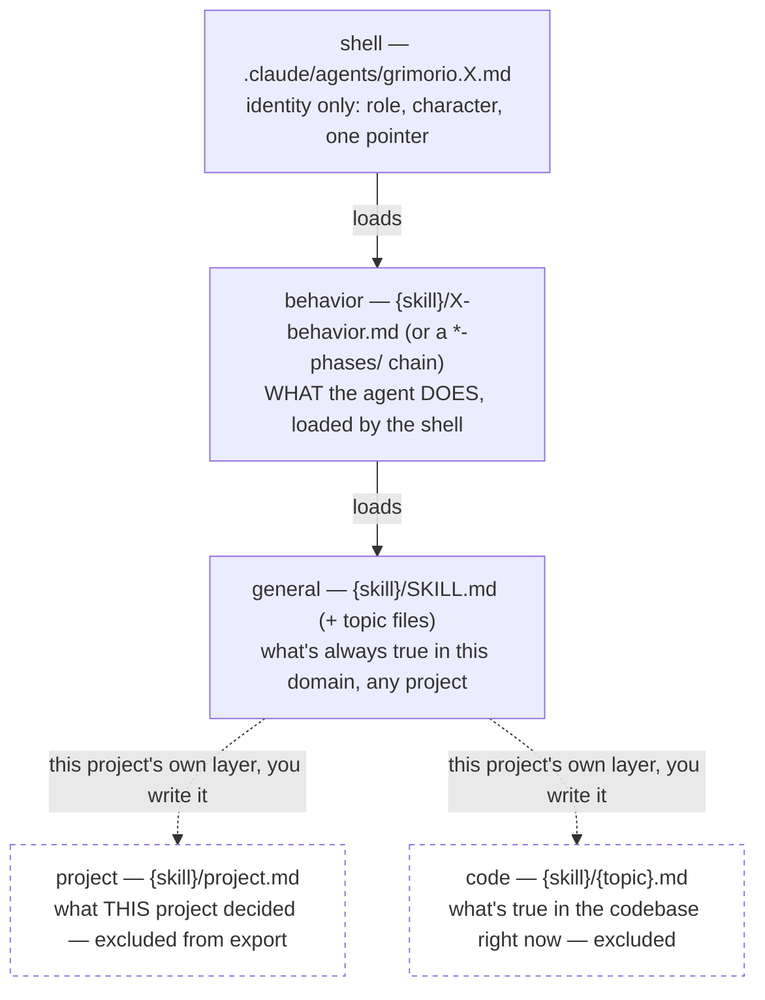

# Grimorio — a Claude Code multi-agent corpus, exported from a live project

**Grimorio is a set of Claude Code sub-agents, skills, and hooks that make a fleet of Claude agents work a
task the way a disciplined engineering team would: decompose before building, verify before claiming done,
and hand off through files a human (or the next agent) can actually audit — instead of one long chat where
everything is remembered informally and nothing is checked.** It was pulled out of a private, still-live game
platform project ("arena") after months of real use — 27 specialized agents, 46 skills, 12 enforcement hooks
— and cleaned for public adoption. This is the 2026-09-03 pass: it re-verifies every claim the previous
export made, ships one real worked example, and fixes what broke when actually cloned from scratch. See
[MANIFEST.md](MANIFEST.md) for the full, file-by-file accounting.

## Why this might be useful to you

- **You're building with Claude Code and keep re-inventing the same scaffolding** — a code reviewer that
  actually reads the diff instead of trusting a summary, a way to stop an agent from editing files nobody
  told it were governed, a way to know whether a rule you wrote is actually being followed or just sitting
  there unread.
- **You want sub-agents that own a task to completion** instead of returning "here's what I found, what
  should I do next" — `grimorio.delegate` is built specifically to not do that.
- **You want your rules MEASURED, not assumed.** This corpus's most interesting export isn't an agent — it's
  [MEASUREMENTS.md](MEASUREMENTS.md), three findings about which of its own rules actually got followed in
  production, with the population and the limit stated for each.

## What's in the box

- **27 agent shells** (`.claude/agents/grimorio.*.md`) — identity only: a role, a character, a pointer to a
  behavior file. Grouped by what they do, below.
- **46 skills** (`.claude/skills/grimorio.*/`) — the actual methods. 22 of the larger agents are written as
  explicit **phase chains** (`*-phases/` directories), not one long flat instruction file — each phase is
  self-contained, states what it loads just-in-time, and hands off explicitly to the next.
- **12 hooks** (`.claude/hooks/*.cjs`) — mechanical enforcement, wired in `.claude/settings.json`: a spawn
  gate that refuses an agent-to-agent call missing a required load instruction, a worktree-containment guard,
  a hook that blocks a subagent's turn from closing while its own background children are still alive,
  dispatch/completion loggers, and more.
- **A curated slice of `scripts/`** — a reference-grammar auditor, an agent-tier conformance checker, the
  git-hook pair (`pre-commit`/branch-objective gate), a stuck-child liveness detector — each with a selftest.
- **[MEASUREMENTS.md](MEASUREMENTS.md)** — read this even if you adopt nothing else.

## The shape of it — four levels, so method survives even when project-facts don't

Every agent is split into four files, and the split is *why* this could be exported at all: an agent's
*method* is portable even when its *project* isn't.

Ships here: shell + behavior + general (full body). Excluded: project + code — your own decisions and your
own codebase's current facts, the two layers `project.md` and a code-level topic file exist to hold. Full
doctrine: `.claude/skills/grimorio.agent-writing/SKILL.md`.

## How you know it works — the mechanisms, actually verified

Not "trust the docs." Every claim below is checkable with a command already in this repo, and this pass
re-ran every one of them rather than carrying the previous pass's numbers forward:

| Check | Result | How to re-run it |
|---|---|---|
| 13 of 14 selftests | **PASS** (the 14th fails on a documented, inherited defect — see below) | `bash scripts/selftest/*.sh` |
| Zero product/identity leakage | **clean** — only README.md/MANIFEST.md's own labelled mentions | `grep -rIl -iE "\barena\b\|warsim\|promptarena" --exclude-dir=.git .` |
| Zero un-inspected Spanish residue | **clean** — every hit is a documented, justified false positive | `LC_ALL=C.UTF-8 grep -rIP '[…accented range…]' --exclude-dir=.git .` (see MANIFEST for the full command) |
| Every `ref:repo/`/`cite:repo/` citation resolves | **confirmed** (`node scripts/audit-chain.mjs --dead` finds only pre-existing, documented `tmp:` scratch pointers, never a `repo:` one) | `node scripts/audit-chain.mjs --dead` |
| **Runs from a genuinely cold `git clone`, not just in place** | **exercised this pass** — 2 real breakages found and fixed; see "Adopting this" below | see MANIFEST → "Clean-clone verification" |
| A spawn gate actually refuses a bad agent call | **fired live, in a fresh clone, this pass** | `claude --model haiku --permission-mode bypassPermissions -p "spawn a sub-agent without loading grimorio.conduct"` → denied by `spawn-verbatim-origin-gate.cjs`, logged to `.claude/.cache/agent-invocations.log` |

The one honestly-still-broken thing: `check-phase-fingerprint`'s selftest fails on assertions 8a/8b,
identically in the source project's own current branch — an inherited defect, named rather than hidden, not
something this export introduced.

## What the output looks like

[`examples/mechanics-queue-live-fire.md`](examples/mechanics-queue-live-fire.md) — a real, already-executed
run: a `grimorio.delegate` proving four just-built hooks actually fire, hitting a genuine infrastructure
problem along the way (a worktree's modified hooks are invisible to a session rooted in the main checkout)
and solving it empirically before it could even start measuring. Shows the input, the path taken, and the
actual quoted log output — not a staged demo.

## Adopting this — what actually happens when you clone it

1. `git clone` this repo, or copy `.claude/`, `scripts/`, and `objectives/` into an existing project.
2. Run `bash scripts/install-hooks.sh` once per clone (`.git/hooks` isn't versioned). It installs a
   `pre-commit` gate; it will tell you plainly if it skips the `pre-push` gate (see below — that one's
   project-specific and wasn't exported).
3. Start Claude Code in that directory. `CLAUDE.md`'s one load instruction pulls in the rest —
   `.claude/skills/grimorio.agent-selection/SKILL.md` is the routing doctrine: which agent for which
   situation, not "read all 27 shells first."
4. Fill in your own project/code layers as you go: every per-role memory skill (`grimorio.architect-memory`,
   `grimorio.po-memory`, `grimorio.developer-memory`, `grimorio.qa-memory`, `grimorio.security-memory`, and
   the rest — one per gate/build role) ships with its general `SKILL.md` and no `project.md` — that's the
   file you write, describing your own stack and decisions. **Never edit a shell or a behavior file to fit
   your project** — that's exactly the file that's supposed to stay portable to the next one.

**What genuinely breaks on a cold clone, found by actually cloning it fresh this pass (not asserted):**
`scripts/pre-commit.sh`'s typecheck step assumes an `apps/web` TypeScript app — it just silently does nothing
if you have none, which is fine but worth knowing. `scripts/close-landed.sh` writes into a product ledger
this export deliberately doesn't ship — it's for later, once you've built your own `po-memory/project.md`.
Two other real breakages (a wrong path in `pre-commit.sh`, an installer wiring a hook shim to a file that
doesn't exist) were found the same way and are already fixed in this tree — full account in
[MANIFEST.md](MANIFEST.md) → "Clean-clone verification," including the exact failing commands and error
text, so you can judge the method, not just the claim.

## The 27 agents, grouped by what they do

| Group | Agents |
|---|---|
| Build (Sonnet default) | `js-developer`, `py-developer`, `go-developer`, `ui-developer`, `game-developer` |
| Design/architecture (Opus default) | `web-architect`, `game-architect`, `solution-architect`, `design-orchestrator`, `design-redactor` |
| Gate / adversarial (never fixes, only judges) | `code-reviewer`, `security`, `ux`, `qa`, `manual-verifier` |
| Research / knowledge | `researcher`, `scout`, `entropy`, `documentation`, `unblocker` |
| Product / process | `po`, `system-keeper`, `prompt-writer`, `extract-cleaner` |
| Owns-a-task end to end | `delegate` |
| Escalation-only | `adviser` (top reasoning tier, invoked on repeated frustration/failure) |
| Empirical | `experimenter` (settles a design hypothesis by controlled simulation) |

Every agent's own file states its scope boundary and which neighboring agent it must not be confused
with — that boundary is the one thing every shell actually contains.

## Known limitations — stated once, plainly

- **No full human re-read of the content itself.** Verification here is automated (leakage/Spanish scans,
  pointer checker, selftests, the fresh clean-clone walk) — nobody has read every exported file end to end
  for quality.
- **`check-phase-fingerprint` fails on two assertions**, inherited from the source project, not introduced
  here.
- **The Spanish detector is a heuristic**, not a proof — every hit it found was inspected; it can't prove
  the absence of what it doesn't look for.
- **Scripts are reference implementations** — exercised standalone from a cold clone this pass, but not
  wired into any CI here.

Full accounting, including three judgment calls a reviewer might make differently, in
[MANIFEST.md](MANIFEST.md).

## License

MIT
